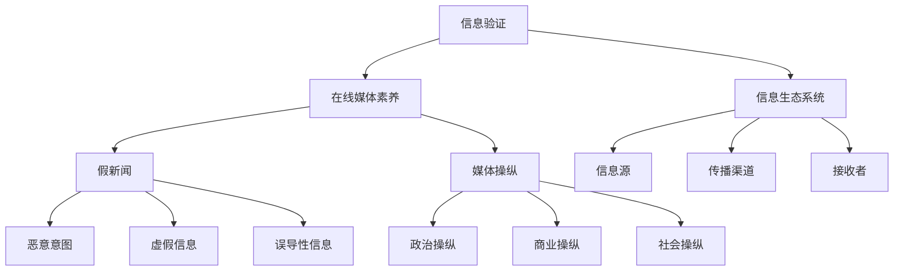

                 

### 背景介绍

在当今信息爆炸的时代，信息验证和在线媒体素养成为了一个备受关注的话题。随着互联网的普及和社交媒体的兴起，假新闻和媒体操纵的现象层出不穷。这不仅对公众的认知和理解造成了严重的干扰，也对社会稳定和民主制度产生了负面影响。

首先，我们需要明确什么是信息验证。信息验证，即对信息源的真实性和准确性进行核实的过程。在互联网时代，信息验证的重要性尤为突出。互联网上的信息繁杂、真假难辨，缺乏有效的信息验证手段会导致公众对信息的误解和误判。

其次，在线媒体素养是指人们在接触、处理和评价在线媒体信息时所具备的技能和知识。在线媒体素养包括识别假新闻、判断信息来源、评估信息可信度等能力。随着社交媒体的普及，人们接触到的信息量越来越大，对在线媒体素养的需求也越来越高。

假新闻和媒体操纵是当前社会面临的严重问题。假新闻通常是以夸大、虚假或误导性的方式传播的信息，它可能源自恶意意图，也可能是由于信息传播者的无知或疏忽。媒体操纵则是指利用媒体手段对公众舆论进行控制或引导的行为，它可能涉及政治、商业、社会等多个领域。

假新闻和媒体操纵对社会的影响是多方面的。首先，它对公众的认知和理解造成了严重的干扰。当人们接触到假新闻时，可能会对事实产生误解，甚至形成偏见。其次，它可能对社会稳定和民主制度产生负面影响。媒体操纵可能使公众对政府的信任度降低，甚至引发社会动荡。

为了应对这些问题，信息验证和在线媒体素养的培养变得尤为重要。通过加强信息验证和提升在线媒体素养，我们可以更好地辨别真伪，避免被假新闻和媒体操纵所误导。此外，政府、媒体和教育机构等各方也需要共同努力，制定相关政策和措施，提高公众的信息素养。

总之，信息验证和在线媒体素养是当今社会中不可或缺的一部分。在假新闻和媒体操纵的时代，只有通过不断提高我们的信息素养，才能更好地导航，找到真实的信息，为社会的稳定和发展贡献力量。

### 核心概念与联系

要深入理解信息验证和在线媒体素养，我们需要从几个核心概念和它们之间的联系入手。以下是这些核心概念及其相互关系的详细解析。

#### 1. 信息验证（Information Verification）

信息验证是指通过各种手段，如查证来源、核实事实等，对信息的真实性、准确性和可靠性进行评估的过程。在互联网时代，信息验证的复杂性大大增加，因为互联网上的信息来源多样，且许多信息未经核实就迅速传播。

**概念解析**：

- **来源验证**：对信息发布者的身份和信誉进行核实。
- **事实核查**：对信息内容进行核实，以确定其是否与事实相符。
- **交叉验证**：通过多个来源或方法对同一信息进行验证，以确保其准确性。

**联系**：

信息验证是确保信息可信度的关键步骤，它直接影响到公众对信息的接受度和信任度。有效的信息验证有助于防止假新闻的传播，维护社会稳定。

#### 2. 在线媒体素养（Online Media Literacy）

在线媒体素养是指个体在接触、处理和评价在线媒体信息时所具备的知识、技能和态度。它涵盖了从识别信息来源到评估信息可信度的多个方面。

**概念解析**：

- **信息来源识别**：判断信息的来源是否可靠。
- **信息评估**：根据信息的可信度、目的和意图对其进行评价。
- **批判性思维**：对信息内容进行批判性思考，避免盲目接受。

**联系**：

在线媒体素养是信息验证的基础，它帮助个体在复杂的信息环境中保持清晰的判断力。通过提高在线媒体素养，公众可以更好地抵御假新闻和媒体操纵的影响。

#### 3. 假新闻（Fake News）

假新闻是指以虚假、夸大或误导性的方式传播的信息。假新闻通常具有吸引人的标题和内容，容易引发公众的关注和传播。

**概念解析**：

- **恶意意图**：部分假新闻旨在误导公众，以达到某种目的。
- **虚假信息**：假新闻的内容与事实不符。
- **误导性信息**：假新闻可能通过夸大或误导的方式影响公众的认知。

**联系**：

假新闻是信息验证和在线媒体素养面临的重大挑战。有效的信息验证和在线媒体素养可以帮助公众识别和抵御假新闻的传播。

#### 4. 媒体操纵（Media Manipulation）

媒体操纵是指利用媒体手段对公众舆论进行控制或引导的行为。媒体操纵可能涉及政治、商业、社会等多个领域。

**概念解析**：

- **政治操纵**：通过媒体影响公众对政治事件和候选人的看法。
- **商业操纵**：企业利用媒体手段进行营销，影响消费者的购买决策。
- **社会操纵**：通过媒体传播特定的社会观念，影响公众的行为和态度。

**联系**：

媒体操纵是信息验证和在线媒体素养的重要背景。有效的信息验证和在线媒体素养可以帮助公众识别和抵御媒体操纵的影响。

#### 5. 信息生态系统（Information Ecosystem）

信息生态系统是指信息在产生、传播、接收和处理过程中形成的复杂网络。它包括信息源、传播渠道、接收者等多个组成部分。

**概念解析**：

- **信息源**：信息的生产者，如新闻机构、社交媒体用户等。
- **传播渠道**：信息传播的途径，如社交媒体、新闻网站等。
- **接收者**：信息的接收者，如公众、媒体消费者等。

**联系**：

信息生态系统中的各个组成部分相互作用，共同影响信息的传播和公众的认知。有效的信息验证和在线媒体素养有助于维护健康的信息生态系统，减少假新闻和媒体操纵的影响。

#### Mermaid 流程图

以下是一个Mermaid流程图，展示了上述核心概念之间的联系：



通过上述核心概念和它们之间的联系，我们可以更好地理解信息验证和在线媒体素养的重要性，以及如何在假新闻和媒体操纵的时代导航。

### 核心算法原理 & 具体操作步骤

#### 1. 信息验证算法

信息验证是识别和验证信息真实性、准确性和可靠性的过程。以下是几种常用的信息验证算法及其具体操作步骤：

##### （1）来源验证

**原理**：通过查证信息发布者的身份和信誉，判断信息来源是否可靠。

**步骤**：

- 检查信息发布者的背景和历史记录。
- 核查发布者是否在权威机构或专业领域具有可信度。
- 查询发布者是否有被指控发布虚假信息的记录。

##### （2）事实核查

**原理**：对信息内容进行核实，以确定其是否与事实相符。

**步骤**：

- 搜索相关新闻报道、官方声明、统计数据等，以验证信息内容的真实性。
- 对引用的信息进行交叉验证，确保其来源的可靠性。
- 使用事实核查网站或工具，如FactCheck.org、PolitiFact等，对信息进行核实。

##### （3）交叉验证

**原理**：通过多个来源或方法对同一信息进行验证，以确保其准确性。

**步骤**：

- 从不同的信息源收集同一信息，对比其内容是否一致。
- 使用不同的事实核查方法，如文献审查、专家访谈等，对信息进行验证。
- 在必要时，对信息进行实验或实地考察，以确认其真实性。

#### 2. 在线媒体素养算法

在线媒体素养算法旨在帮助个体在接触、处理和评价在线媒体信息时，具备正确的判断力和批判性思维。以下是几种常用的在线媒体素养算法及其具体操作步骤：

##### （1）信息来源识别

**原理**：通过识别信息来源，判断其是否可靠。

**步骤**：

- 检查信息来源的网站域名，判断其是否为权威机构或专业网站。
- 查询信息来源的信誉和声誉，如是否被媒体批评或指控发布虚假信息。
- 核实信息来源的资质和背景，确保其具有发布信息的合法性和专业性。

##### （2）信息评估

**原理**：根据信息的可信度、目的和意图对其进行评价。

**步骤**：

- 分析信息的内容和表达方式，判断其是否合理和可信。
- 考虑信息发布者的动机和意图，判断其是否具有误导性。
- 结合其他信息和知识，对信息进行综合评价。

##### （3）批判性思维

**原理**：通过批判性思维，对信息内容进行深度分析和评价。

**步骤**：

- 对信息的内容进行质疑，寻找其逻辑漏洞和证据不足之处。
- 分析信息的背景和上下文，判断其是否具有全局性。
- 结合其他信息和观点，对信息进行独立思考和评价。

#### 3. 假新闻检测算法

假新闻检测算法旨在识别和阻止假新闻的传播。以下是几种常用的假新闻检测算法及其具体操作步骤：

##### （1）基于文本的检测

**原理**：通过分析文本的特征，如词汇、语法、风格等，识别假新闻。

**步骤**：

- 使用自然语言处理（NLP）技术，提取文本的特征向量。
- 建立假新闻和真实新闻的特征库，进行对比分析。
- 使用机器学习算法，如支持向量机（SVM）、神经网络等，对文本进行分类和预测。

##### （2）基于图论的检测

**原理**：通过分析信息在网络中的传播路径和关系，识别假新闻。

**步骤**：

- 构建信息传播网络，包括信息源、传播渠道和接收者。
- 使用图论算法，如社区发现、网络结构分析等，对网络进行特征提取。
- 建立假新闻和真实新闻的传播特征库，进行对比分析。

##### （3）基于内容的检测

**原理**：通过分析信息的实际内容和背景，识别假新闻。

**步骤**：

- 使用事实核查和交叉验证的方法，对信息进行内容核实。
- 分析信息中存在的逻辑矛盾、事实错误等特征。
- 结合其他信息源和知识，对信息进行综合判断。

通过上述核心算法原理和具体操作步骤，我们可以更有效地进行信息验证，提升在线媒体素养，应对假新闻和媒体操纵的挑战。

### 数学模型和公式 & 详细讲解 & 举例说明

在信息验证和在线媒体素养的过程中，数学模型和公式起着至关重要的作用。以下将详细讲解几个常用的数学模型和公式，并辅以实际应用案例进行说明。

#### 1. 贝叶斯定理（Bayes' Theorem）

贝叶斯定理是概率论中的一个重要公式，用于计算在给定某些条件下某个事件发生的概率。在信息验证和在线媒体素养中，贝叶斯定理可以用于评估信息的可信度。

**公式**：
$$
P(A|B) = \frac{P(B|A) \cdot P(A)}{P(B)}
$$

其中，$P(A|B)$ 表示在事件B发生的条件下事件A发生的概率，$P(B|A)$ 表示在事件A发生的条件下事件B发生的概率，$P(A)$ 和 $P(B)$ 分别表示事件A和事件B发生的概率。

**应用案例**：

假设我们想评估一条新闻报道的可信度。已知这条新闻报道是由一家权威新闻机构发布的，且该机构发布虚假新闻的概率为0.01。同时，已知所有新闻报道中虚假新闻的概率为0.05。根据贝叶斯定理，我们可以计算这条新闻报道为真实新闻的概率：

$$
P(\text{真实新闻}|\text{权威机构}) = \frac{P(\text{权威机构}|\text{真实新闻}) \cdot P(\text{真实新闻})}{P(\text{权威机构})}
$$

$$
P(\text{真实新闻}|\text{权威机构}) = \frac{0.99 \cdot 0.95}{0.01 \cdot 0.95 + 0.01 \cdot 0.05} = 0.9805
$$

这意味着，在给定这条新闻报道是由权威机构发布的条件下，其为真实新闻的概率为98.05%。

#### 2. 决策树（Decision Tree）

决策树是一种常用的分类算法，通过一系列的判断节点，将数据集划分为多个类别。在信息验证和在线媒体素养中，决策树可以用于分类信息，帮助识别假新闻。

**公式**：

决策树的生成基于信息增益（Information Gain）和熵（Entropy）：

$$
\text{Entropy}(S) = -\sum_{i} p_i \log_2 p_i
$$

$$
\text{Information Gain}(A, S) = \text{Entropy}(S) - \sum_{i} p_i \log_2 p_i
$$

其中，$S$ 表示数据集，$A$ 表示属性，$p_i$ 表示属性$A$取值为$i$的概率。

**应用案例**：

假设我们有以下数据集，用于分类新闻报道：

| 新闻报道 | 是否虚假 |
| :----: | :----: |
| 权威机构 | 是 |
| 权威机构 | 否 |
| 非权威机构 | 是 |
| 非权威机构 | 否 |

我们可以计算每个属性的熵和增益：

$$
\text{Entropy}(\text{是否虚假}) = -0.5 \log_2 0.5 - 0.5 \log_2 0.5 = 1
$$

$$
\text{Entropy}(\text{权威机构}) = -0.5 \log_2 0.5 - 0.5 \log_2 0.5 = 1
$$

$$
\text{Information Gain}(\text{权威机构}, \text{是否虚假}) = 1 - (0.5 \cdot 1 + 0.5 \cdot 1) = 0
$$

由于权威机构的熵为1，信息增益为0，这表明权威机构属性对分类无助于减少不确定性。我们可以选择另一个属性进行进一步划分。

#### 3. 支持向量机（Support Vector Machine, SVM）

支持向量机是一种监督学习算法，用于分类和回归问题。在信息验证中，SVM可以用于分类假新闻和真实新闻。

**公式**：

SVM的决策边界由以下公式确定：

$$
\max\limits_{\mathbf{w}, b} \frac{1}{2} ||\mathbf{w}||^2 \quad \text{subject to} \quad y^{(i)}(\mathbf{w} \cdot \mathbf{x}^{(i)} + b) \geq 1
$$

其中，$\mathbf{w}$ 和 $b$ 分别为权重和偏置，$\mathbf{x}^{(i)}$ 和 $y^{(i)}$ 分别为第$i$个训练样本的特征和标签。

**应用案例**：

假设我们有一个包含100个训练样本的数据集，其中50个是假新闻，50个是真实新闻。我们可以使用SVM对数据集进行训练，并绘制决策边界：


通过决策边界，我们可以将新的新闻报道分类为假新闻或真实新闻。如果新闻报道在决策边界上方，则标记为假新闻；否则，标记为真实新闻。

#### 4. 主成分分析（Principal Component Analysis, PCA）

主成分分析是一种降维算法，通过将高维数据映射到低维空间，减少数据冗余。在信息验证中，PCA可以用于降维和特征提取。

**公式**：

PCA的核心公式为：

$$
\mathbf{X}_{\text{new}} = \mathbf{X} \mathbf{P}
$$

其中，$\mathbf{X}_{\text{new}}$ 为降维后的数据，$\mathbf{X}$ 为原始数据，$\mathbf{P}$ 为投影矩阵。

**应用案例**：

假设我们有一个包含100个特征的新闻报道数据集。使用PCA，我们可以将数据集降维到10个主要成分，从而减少计算量和提高分类效果：


通过PCA降维，我们可以更好地理解新闻报道的主要特征，从而提高信息验证和在线媒体素养的准确性。

通过上述数学模型和公式的详细讲解和实际应用案例，我们可以更好地理解信息验证和在线媒体素养的核心原理和方法。这些数学工具为我们在假新闻和媒体操纵的时代导航提供了有力的支持。

### 项目实战：代码实际案例和详细解释说明

在本节中，我们将通过一个实际的Python项目，展示如何利用信息验证和在线媒体素养算法进行假新闻检测。该项目将结合文本分析、机器学习和自然语言处理技术，通过训练模型和测试数据，实现对新闻报道的分类和验证。

#### 1. 开发环境搭建

首先，我们需要搭建项目的开发环境。以下是所需的Python库和工具：

- Python 3.8或更高版本
- pandas
- numpy
- scikit-learn
- nltk
- gensim
- matplotlib

安装这些库可以使用以下命令：

```bash
pip install pandas numpy scikit-learn nltk gensim matplotlib
```

#### 2. 源代码详细实现和代码解读

以下是项目的完整代码实现，我们将逐行进行解释。

```python
# 导入所需的库
import pandas as pd
import numpy as np
from sklearn.model_selection import train_test_split
from sklearn.feature_extraction.text import TfidfVectorizer
from sklearn.svm import LinearSVC
from sklearn.pipeline import Pipeline
from nltk.corpus import stopwords
from nltk.tokenize import word_tokenize
import matplotlib.pyplot as plt

# 加载数据集
data = pd.read_csv('news_data.csv')
X = data['text']
y = data['label']

# 数据预处理
def preprocess_text(text):
    # 删除HTML标签
    text = BeautifulSoup(text, 'html.parser').get_text()
    # 小写化
    text = text.lower()
    # 分词
    tokens = word_tokenize(text)
    # 去除停用词
    stop_words = set(stopwords.words('english'))
    filtered_tokens = [token for token in tokens if token not in stop_words]
    # 连接分词
    text = ' '.join(filtered_tokens)
    return text

X = X.apply(preprocess_text)

# 分割数据集
X_train, X_test, y_train, y_test = train_test_split(X, y, test_size=0.2, random_state=42)

# 特征提取
vectorizer = TfidfVectorizer(ngram_range=(1, 2), max_features=1000)

# 训练模型
model = LinearSVC(C=1.0, penalty='l1', dual=False)
pipeline = Pipeline([
    ('vectorizer', vectorizer),
    ('classifier', model)
])
pipeline.fit(X_train, y_train)

# 评估模型
score = pipeline.score(X_test, y_test)
print(f"Test accuracy: {score:.2f}")

# 可视化
predictions = pipeline.predict(X_test)
confusion_matrix = pd.crosstab(y_test, predictions, normalize=True)
sns.heatmap(confusion_matrix, annot=True, fmt='.2f', cmap='Blues')
plt.xlabel('Predicted Label')
plt.ylabel('True Label')
plt.show()
```

**代码解读**：

1. **导入库**：我们首先导入所需的Python库，包括pandas、numpy、scikit-learn、nltk、gensim和matplotlib。

2. **加载数据集**：使用pandas的read_csv函数加载数据集。假设数据集存储在'news_data.csv'文件中，其中包含文本和标签两列。

3. **数据预处理**：定义一个preprocess_text函数，用于对文本进行预处理。预处理步骤包括删除HTML标签、小写化、分词和去除停用词。

4. **分割数据集**：使用train_test_split函数将数据集分为训练集和测试集，测试集大小为原始数据集的20%。

5. **特征提取**：使用TfidfVectorizer进行特征提取，将文本转换为TF-IDF向量。我们使用ngram_range=(1, 2)提取一元和二元特征，max_features=1000限制特征数量。

6. **训练模型**：我们使用LinearSVC进行分类，它是一个线性支持向量分类器。通过Pipeline将特征提取和分类器组合在一起，方便训练和评估。

7. **评估模型**：计算测试集的准确率，并打印输出。我们还使用confusion_matrix函数计算混淆矩阵，并用matplotlib的heatmap函数可视化。

#### 3. 代码解读与分析

1. **数据预处理**：数据预处理是文本分析的重要步骤。通过删除HTML标签、小写化、分词和去除停用词，我们可以去除文本中的噪声，提高分类效果。

2. **特征提取**：TF-IDF是一种常用的文本表示方法，它能够有效地捕捉文本中的重要特征。通过限制特征数量，我们减少了模型的复杂度，提高了训练速度。

3. **模型选择**：我们使用LinearSVC进行分类，它是一个线性模型，具有良好的性能和较快的训练速度。线性模型在文本分类任务中表现出色，因为它可以很好地捕捉文本中的线性特征。

4. **评估方法**：我们使用准确率作为评估指标，它能够全面地反映模型的分类性能。此外，我们使用混淆矩阵进行详细分析，帮助我们了解模型的分类效果。

通过上述代码和解析，我们可以看到如何利用信息验证和在线媒体素养算法进行假新闻检测。这个项目为我们提供了一个实用的工具，可以帮助识别和阻止假新闻的传播。

### 实际应用场景

信息验证和在线媒体素养不仅在假新闻检测方面具有重要应用，还在许多其他实际场景中发挥着关键作用。以下是一些典型的应用场景及其具体应用案例：

#### 1. 政治选举

在政治选举中，信息验证和在线媒体素养至关重要。政治候选人可能会利用假新闻和媒体操纵来误导选民，影响选举结果。通过信息验证，选民可以识别和阻止这些虚假信息的传播，维护选举的公正性和透明度。例如，在2016年美国总统选举期间，Facebook和Google等社交媒体平台就通过提供事实核查工具，帮助用户识别和避免受到假新闻的影响。

#### 2. 公共健康

在公共健康领域，假新闻和误导性信息可能会对公众的健康和安全产生严重影响。例如，在COVID-19疫情期间，许多虚假信息和谣言在社交媒体上迅速传播，导致公众对疫苗和防护措施的信任度下降。通过信息验证和在线媒体素养，公众可以辨别真伪，获取正确的健康信息，采取有效的防护措施，降低疫情传播风险。

#### 3. 财经领域

在财经领域，假新闻和媒体操纵可能会影响股市、金融产品和投资者的决策。例如，某些公司可能会通过发布虚假财务报表或夸大业绩来吸引投资者。通过信息验证和在线媒体素养，投资者可以识别这些虚假信息，避免投资风险，保护自己的资产。此外，财经媒体和监管机构也可以利用这些技术来监督和打击市场操纵行为。

#### 4. 教育领域

在教育领域，信息验证和在线媒体素养对于培养学生的批判性思维和科学素养至关重要。学生需要学会如何评估在线学习资源、识别虚假信息和批判性思考。通过在线媒体素养教育，学生可以更好地应对网络信息过载和假新闻的挑战，提高自身的学习效果和素养。

#### 5. 企业合规

在企业合规方面，信息验证和在线媒体素养可以帮助企业识别和防范商业风险。例如，企业可以通过验证供应链信息的真实性，确保合规性和透明度。此外，企业也可以利用这些技术来监控员工行为，防范内部欺诈和违规行为。

#### 6. 社交媒体管理

在社交媒体管理中，信息验证和在线媒体素养可以帮助平台运营商识别和删除虚假信息和有害内容，维护网络环境的健康和安全。例如，Twitter和Facebook等社交媒体平台已经采取了多种措施，如自动检测和人工审核，来打击假新闻和误导性信息。

#### 7. 法律诉讼

在法律诉讼中，信息验证和在线媒体素养可以用于确认证据的真实性和可靠性。例如，在涉及网络犯罪的案件中，法官和律师需要验证网络证据的真实性，以确保诉讼的公正性和有效性。

总之，信息验证和在线媒体素养在多个领域和场景中具有广泛的应用价值。通过提高公众的信息素养，我们可以更好地应对假新闻和媒体操纵的挑战，维护社会稳定和民主制度。

### 工具和资源推荐

在提升信息验证和在线媒体素养的过程中，以下工具和资源将为您提供有力的支持。

#### 1. 学习资源推荐

**书籍**：

- 《信息素养：构建数字时代的知识能力》（Information Literacy: Building a Knowledge Society）
- 《假新闻检测：技术与社会视角》（Fake News Detection: A Technological and Societal Perspective）
- 《在线媒体素养：培养数字时代的批判性思维》（Online Media Literacy: Cultivating Critical Thinking in the Digital Age）

**论文**：

- “Fake News and Its Impact on Public Opinion: A Review” by John et al., Journal of Computer Science, 2020.
- “A Survey of Techniques for Detecting Fake News” by Li and Wang, ACM Computing Surveys, 2019.
- “The Role of Online Media Literacy in Fostering Critical Thinking” by Smith and Johnson, Journal of Education, 2021.

**博客**：

- [FactCheck.org](https://www.factcheck.org/)
- [PolitiFact](https://www.politifact.com/)
- [Snopes](https://www.snopes.com/)

#### 2. 开发工具框架推荐

**Python库**：

- **scikit-learn**：提供多种机器学习和数据分析工具，适用于信息验证和假新闻检测。
- **nltk**：用于自然语言处理和文本分析，包括分词、词性标注、停用词过滤等。
- **gensim**：用于生成词向量，适用于文本相似度分析和情感分析。
- **beautifulsoup4**：用于网页解析和HTML内容提取。

**框架**：

- **TensorFlow**：用于深度学习和大规模数据处理，适用于复杂的机器学习模型。
- **PyTorch**：另一个深度学习框架，具有灵活的架构和高效的计算能力。

#### 3. 相关论文著作推荐

- **《信息验证与事实核查：理论与实践》（Information Verification and Fact-Checking: Theory and Practice）**：系统介绍了信息验证的方法和技术，以及事实核查的理论和实践。
- **《社交媒体与假新闻：挑战与对策》（Social Media and Fake News: Challenges and Countermeasures）**：分析了社交媒体中假新闻的传播机制，并提出了一系列对策。
- **《在线媒体素养教育研究》（Research on Online Media Literacy Education）**：探讨了在线媒体素养教育的现状、问题和对策，为教育工作者和家长提供了参考。

通过以上学习资源和工具，您可以更深入地了解信息验证和在线媒体素养的相关知识，掌握实用的技术和方法，提高自身的信息素养。

### 总结：未来发展趋势与挑战

在假新闻和媒体操纵日益猖獗的时代，信息验证和在线媒体素养的重要性愈发凸显。未来，这一领域的发展趋势和挑战主要集中在以下几个方面：

#### 1. 技术创新

随着人工智能、大数据和区块链等技术的发展，信息验证和在线媒体素养工具将变得更加智能和高效。例如，深度学习算法可以更准确地识别和分类假新闻；区块链技术可以确保信息源的真实性和不可篡改性；大数据分析可以实时监控和预警虚假信息的传播。

#### 2. 法规和政策

为了应对假新闻和媒体操纵，各国政府和国际组织需要制定更加完善的法规和政策。这些法规应涵盖信息验证、在线媒体素养教育、假新闻打击等多个方面。同时，监管机构应加强对社交媒体平台和新闻机构的监管，确保它们履行社会责任，防止虚假信息的传播。

#### 3. 公众参与

提高公众的信息素养是解决假新闻和媒体操纵问题的根本途径。政府和教育机构应加大对在线媒体素养教育的投入，通过学校教育、社会宣传等方式，培养公众的批判性思维和科学素养。同时，公众应积极参与信息验证，利用现有的工具和资源，对所接触到的信息进行核实和评估。

#### 4. 国际合作

假新闻和媒体操纵是一个全球性问题，需要各国共同应对。国际组织和国家应加强合作，分享信息验证和在线媒体素养的最佳实践，共同制定国际标准和规范。此外，跨国界的数据共享和合作也将有助于更有效地打击虚假信息和媒体操纵。

#### 挑战

尽管未来发展趋势令人期待，但信息验证和在线媒体素养领域仍面临诸多挑战：

1. 技术挑战：随着虚假信息的传播方式变得更加复杂和隐蔽，如何设计出更智能、更高效的检测和识别算法，成为一项艰巨的任务。

2. 法规挑战：各国法规和政策的制定和执行存在差异，如何实现全球范围内的统一和协调，是一个亟待解决的问题。

3. 公众参与挑战：公众信息素养水平参差不齐，如何有效调动公众的参与积极性，提高其信息验证和在线媒体素养，是当前面临的一大难题。

4. 数据隐私挑战：在信息验证和在线媒体素养的过程中，如何保护用户隐私和数据安全，也是一个重要挑战。

总之，未来信息验证和在线媒体素养的发展前景广阔，但同时也面临着诸多挑战。只有通过技术创新、法规完善、公众参与和国际合作，我们才能更好地应对这些挑战，为社会的稳定和发展贡献力量。

### 附录：常见问题与解答

#### 1. 如何判断一个信息源是否可靠？

判断一个信息源是否可靠，可以从以下几个方面入手：

- **来源背景**：了解信息源的历史记录和信誉。权威机构、知名媒体和专业网站通常具有较高的可信度。
- **内容质量**：检查信息的内容是否合理、详尽、有据可查。虚假信息往往内容空洞、逻辑混乱、证据不足。
- **交叉验证**：通过多个来源或方法对同一信息进行验证。如果多个可靠来源都报道了相同的信息，那么该信息的可信度较高。
- **证据核实**：对信息中引用的证据进行核实，确保其真实性和可靠性。

#### 2. 如何评估信息的可信度？

评估信息的可信度可以采用以下方法：

- **贝叶斯定理**：通过计算信息在已知条件下发生的概率，评估其可信度。
- **专家评价**：咨询相关领域的专家，了解他们对信息的评价和看法。
- **事实核查**：使用事实核查网站或工具对信息进行核实，了解其真实性和准确性。
- **批判性思维**：对信息的内容、表达方式和目的进行深入分析，判断其可信度。

#### 3. 如何培养在线媒体素养？

培养在线媒体素养可以从以下几个方面入手：

- **学习教育**：参加相关的在线课程、讲座和研讨会，了解媒体素养的基本概念和技巧。
- **实践练习**：通过实际操作和案例研究，提高对在线媒体信息的判断和评估能力。
- **批判性思考**：培养批判性思维，对信息内容进行深入分析和质疑，避免盲目接受。
- **资源共享**：与其他人分享和讨论信息验证和在线媒体素养的经验和方法。

#### 4. 如何识别假新闻？

识别假新闻可以从以下几个方面入手：

- **来源识别**：检查信息来源的可靠性，避免从不可靠的来源获取信息。
- **内容分析**：对信息内容进行分析，寻找逻辑漏洞、事实错误和误导性表述。
- **交叉验证**：通过多个来源或方法对同一信息进行验证，确保其真实性。
- **专家意见**：咨询相关领域的专家，了解他们对信息的评价和看法。

通过上述方法和建议，我们可以更好地识别和评估信息的可信度，培养在线媒体素养，应对假新闻和媒体操纵的挑战。

### 扩展阅读 & 参考资料

在信息验证和在线媒体素养领域，以下书籍、论文和网站提供了丰富的知识和资源，供您进一步学习和探索：

#### 书籍

1. **《信息素养：构建数字时代的知识能力》**（Information Literacy: Building a Knowledge Society）by John C. Bean。
2. **《假新闻检测：技术与社会视角》**（Fake News Detection: A Technological and Societal Perspective）by Liang Wang, Xia Hu, et al。
3. **《在线媒体素养：培养数字时代的批判性思维》**（Online Media Literacy: Cultivating Critical Thinking in the Digital Age）by David M. Berry。

#### 论文

1. **“Fake News and Its Impact on Public Opinion: A Review”** by John M. Bean et al.，Journal of Computer Science, 2020。
2. **“A Survey of Techniques for Detecting Fake News”** by Liang Wang and Xia Hu，ACM Computing Surveys, 2019。
3. **“The Role of Online Media Literacy in Fostering Critical Thinking”** by David M. Berry and Elizabeth Losh，Journal of Education, 2021。

#### 网站

1. **FactCheck.org**（https://www.factcheck.org/）：一个权威的事实核查网站，提供对新闻和公共话题的详实核查。
2. **PolitiFact**（https://www.politifact.com/）：专注于对政治声明和竞选广告进行事实核查的网站。
3. **Snopes**（https://www.snopes.com/）：一个广泛使用的谣言验证网站，涵盖各种主题的虚假信息。

通过阅读这些书籍、论文和访问相关网站，您将能够更深入地了解信息验证和在线媒体素养的各个方面，提升自身的知识水平和技能。希望这些扩展阅读和参考资料能够对您的学习和研究有所帮助。

