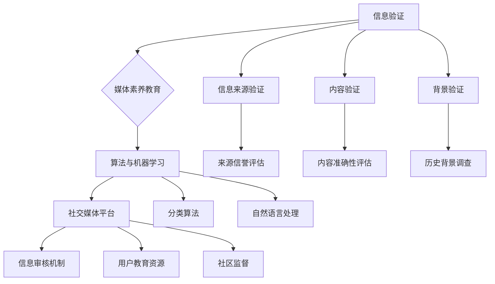

                 

### 背景介绍

在当今数字时代，信息传播的速度和广度前所未有。然而，这也带来了一系列新的挑战，其中之一便是如何有效验证信息的真实性和准确性。随着假新闻、媒体操纵和错误信息的泛滥，公众对于信息的信任度受到了严重威胁。这不仅对个人和社会产生了负面影响，也对政府和企业的公信力构成了挑战。因此，信息验证和媒体素养教育成为了一个亟待解决的问题。

假新闻和错误信息的传播可能引发公众恐慌、误导政策和决策，甚至引发社会动荡。社交媒体平台的兴起加速了这一现象，因为用户生成内容（UGC）和无界的网络使得虚假信息能够在短时间内迅速传播。同时，算法推荐系统和信息茧房效应加剧了这一问题的复杂性，使得人们在信息接收上越来越偏向于自己的观点和偏好，从而形成了信息孤岛。

媒体素养教育作为解决这一问题的手段之一，旨在提高公众对信息的批判性思维能力，帮助他们识别和抵制虚假信息。通过教育，人们可以学会如何评估信息的来源、判断信息的可靠性，以及如何以理性的方式参与公共讨论。这不仅有助于保护个人权益，还能够提升整个社会的媒体素养水平。

本文将探讨信息验证和媒体素养教育的重要性，以及如何利用技术手段和策略来应对这一挑战。我们将从核心概念、算法原理、数学模型、项目实战、实际应用场景等多个角度，提供系统性的分析和解决方案。最终目标是帮助读者了解这一领域的最新动态，掌握关键技术和策略，为假新闻、媒体操纵和错误信息时代做好准备。

在接下来的章节中，我们将首先介绍信息验证和媒体素养教育的核心概念，并使用 Mermaid 流程图展示相关架构。然后，我们将深入探讨核心算法原理和具体操作步骤，并使用数学模型和公式详细说明。之后，我们将通过项目实战展示实际代码案例，并进行分析和解读。最后，我们将讨论信息验证和媒体素养教育的实际应用场景，推荐相关工具和资源，并总结未来发展趋势与挑战。希望通过本文，读者能够对这一领域有更深入的理解，并能够应用到实际工作中。

### 核心概念与联系

在探讨信息验证和媒体素养教育时，我们必须了解几个核心概念，并探讨它们之间的相互联系。以下是对这些核心概念及其相关架构的详细说明：

#### 1. 信息验证（Information Verification）

信息验证是指通过一系列的方法和工具来检查和确认信息源的真实性和可靠性。这个过程包括验证信息的来源、内容、背景和历史记录等多个方面。其目的是确保信息的准确性和完整性，防止错误信息和虚假信息的传播。

**架构：**
- 信息来源验证：检查信息发布者的身份和信誉。
- 内容验证：评估信息的准确性和可信度。
- 背景验证：调查信息的历史和背景，确保其不是伪造或篡改的。
- 技术工具：使用自动化工具和算法来快速验证大量信息。

#### 2. 媒体素养教育（Media Literacy Education）

媒体素养教育是指通过教育手段来提高公众对媒体信息的理解和批判性思维能力。它不仅关注信息的真实性，还包括理解媒体背后的意图、策略和影响。媒体素养教育的目标是培养公众的媒体批判能力，使他们能够独立思考，避免被误导和操纵。

**架构：**
- 批判性思维：通过教育培养公众分析、评估和批判信息的能力。
- 信息评估：教授公众如何评估信息的来源、内容和可靠性。
- 信息创作：鼓励公众参与信息创造，提高其信息传播的准确性。
- 教育资源：利用课程、研讨会和工作坊等形式，提供系统的教育内容。

#### 3. 算法与机器学习（Algorithms and Machine Learning）

算法和机器学习在信息验证和媒体素养教育中扮演了关键角色。通过算法和机器学习模型，可以自动化地识别和过滤虚假信息，提高信息验证的效率和准确性。同时，这些技术也可以用于分析和理解媒体的传播模式和用户行为。

**架构：**
- 虚假信息检测：使用分类算法和自然语言处理技术来识别虚假信息。
- 用户行为分析：通过机器学习模型分析用户的社交媒体行为，识别潜在的信息误导和操纵。
- 模型训练：定期更新算法模型，以适应不断变化的信息环境和虚假信息手段。

#### 4. 社交媒体平台（Social Media Platforms）

社交媒体平台是信息传播的主要渠道，它们在信息验证和媒体素养教育中起到了桥梁的作用。平台本身需要建立有效的信息验证机制，同时也需要教育用户如何正确使用这些平台。

**架构：**
- 信息审核：平台方需建立严格的信息审核机制，防止虚假信息的传播。
- 用户教育：平台需提供教育资源和工具，帮助用户提升媒体素养。
- 社区参与：鼓励用户参与信息验证和社区监督，共同维护网络环境。

#### Mermaid 流程图

为了更好地展示上述核心概念及其相互关系，我们使用 Mermaid 流程图来表示：



通过上述核心概念及其架构的详细说明和 Mermaid 流程图的展示，我们可以更清晰地理解信息验证和媒体素养教育的复杂性和相互关系。接下来，我们将深入探讨这些核心概念的具体实现方法和原理，为读者提供更加全面的技术解析。

### 核心算法原理 & 具体操作步骤

在信息验证和媒体素养教育中，算法和机器学习技术起到了至关重要的作用。它们能够自动化地处理海量信息，识别和过滤虚假信息，提高信息验证的效率和准确性。以下是几种核心算法原理和具体操作步骤：

#### 1. 虚假信息检测算法

虚假信息检测算法是信息验证领域的重要技术之一。它通过分析文本、图像、音频等多种形式的信息，识别其中的虚假内容。以下是常用的几种算法：

**（1）基于规则的方法（Rule-Based Methods）**

基于规则的方法通过预定义的规则库来检测虚假信息。这些规则通常基于专家知识和先验知识，例如：包含特定关键词的文本可能是虚假信息，特定来源的信息可信度较低等。

**操作步骤：**
- **规则库构建：** 收集和整理大量虚假信息和真实信息的样本，从中提取特征和规则。
- **规则应用：** 对待检测的信息应用预定义的规则，如果满足某条规则，则判定为虚假信息。

**（2）基于机器学习的方法（Machine Learning Methods）**

基于机器学习的方法通过训练模型来识别虚假信息。常用的机器学习算法包括决策树、随机森林、支持向量机（SVM）和神经网络等。

**操作步骤：**
- **数据准备：** 收集大量带有标签（虚假或真实）的样本数据，进行预处理，如文本清洗、数据归一化等。
- **模型训练：** 使用训练数据集训练机器学习模型，调整模型参数以优化性能。
- **模型评估：** 使用验证数据集评估模型性能，如准确率、召回率等。
- **模型应用：** 将训练好的模型应用于待检测信息，输出判断结果。

**（3）混合方法（Hybrid Methods）**

混合方法结合了基于规则和基于机器学习的方法，通过多模型融合来提高检测效果。常见的融合策略包括投票法、集成学习和增强学习等。

**操作步骤：**
- **规则与模型结合：** 将基于规则的初步判断结果作为特征输入到机器学习模型中。
- **模型融合：** 使用不同的模型对信息进行检测，并综合各模型的输出结果进行判断。

#### 2. 自然语言处理技术

自然语言处理（NLP）技术在信息验证中起着关键作用。它能够对文本进行分析，提取语义信息，从而帮助识别虚假信息和理解用户意图。

**（1）文本分类（Text Classification）**

文本分类是将文本数据分为预定义的类别。在信息验证中，文本分类用于将信息分为虚假或真实类别。

**操作步骤：**
- **特征提取：** 从文本中提取特征，如词袋模型（Bag of Words）、词嵌入（Word Embeddings）等。
- **分类模型训练：** 使用特征训练分类模型，如朴素贝叶斯、逻辑回归、深度学习等。
- **分类预测：** 对待分类的文本进行预测，输出分类结果。

**（2）语义分析（Semantic Analysis）**

语义分析是对文本的语义内容进行分析和理解，以识别文本的深层含义。

**操作步骤：**
- **实体识别（Named Entity Recognition, NER）：** 识别文本中的命名实体，如人名、地名、组织名等。
- **关系抽取（Relation Extraction）：** 识别实体之间的语义关系，如因果关系、隶属关系等。
- **文本生成（Text Generation）：** 根据输入的语义信息生成文本，以验证信息的真实性。

#### 3. 图像和音频处理技术

除了文本，图像和音频也是信息验证中的重要组成部分。图像和音频处理技术能够识别和验证图像和音频内容，帮助识别虚假信息。

**（1）图像识别（Image Recognition）**

图像识别是计算机视觉技术的一个分支，它通过分析图像的特征来识别图像内容。

**操作步骤：**
- **特征提取：** 从图像中提取特征，如边缘、纹理、颜色等。
- **模型训练：** 使用带有标签的图像数据训练图像识别模型。
- **图像分类：** 对待分类的图像进行预测，输出分类结果。

**（2）音频处理（Audio Processing）**

音频处理技术用于分析和识别音频内容，例如语音识别、音乐分类等。

**操作步骤：**
- **特征提取：** 从音频中提取特征，如音高、音强、频谱等。
- **模型训练：** 使用带有标签的音频数据训练音频识别模型。
- **音频分类：** 对待分类的音频进行预测，输出分类结果。

通过上述算法和技术的详细介绍，我们可以看到信息验证和媒体素养教育中的复杂性。在接下来的章节中，我们将通过实际项目案例展示这些算法和技术的具体应用，并提供详细的代码解读和分析。

### 数学模型和公式 & 详细讲解 & 举例说明

在信息验证和媒体素养教育中，数学模型和公式为我们提供了强大的工具，帮助我们理解和量化信息验证的过程。以下我们将详细讲解几个关键的数学模型和公式，并通过实际例子来说明其应用。

#### 1. 贝叶斯定理（Bayes' Theorem）

贝叶斯定理是概率论中一个非常重要的公式，它用于计算条件概率。在信息验证中，贝叶斯定理可以帮助我们根据先验概率和观察到的数据更新后验概率，从而更准确地判断信息的真实性。

**公式：**
\[ P(A|B) = \frac{P(B|A) \cdot P(A)}{P(B)} \]
其中：
- \( P(A|B) \) 是后验概率，即在事件 B 发生的条件下事件 A 的概率。
- \( P(B|A) \) 是条件概率，即在事件 A 发生的条件下事件 B 的概率。
- \( P(A) \) 是先验概率，即事件 A 的初始概率。
- \( P(B) \) 是边际概率，即事件 B 的总概率。

**应用示例：**
假设我们要验证某条新闻的真实性。已知这条新闻的来源在过去有 80% 的时间发布的是真实信息（\( P(\text{真实}|\text{来源}) = 0.8 \)），而该来源有 20% 的时间发布的是虚假信息（\( P(\text{虚假}|\text{来源}) = 0.2 \)）。现在观察到这条新闻包含了一些明显的误导性信息，我们估计该新闻有 60% 的可能性是虚假的（\( P(\text{虚假}) = 0.6 \)）。

我们可以使用贝叶斯定理来更新这条新闻的后验概率：
\[ P(\text{虚假}|\text{误导性信息}) = \frac{P(\text{误导性信息}|\text{虚假}) \cdot P(\text{虚假})}{P(\text{误导性信息})} \]
由于 \( P(\text{误导性信息}|\text{虚假}) \) 和 \( P(\text{误导性信息}|\text{真实}) \) 可以通过历史数据获得，我们可以通过贝叶斯定理计算出这条新闻的真实性概率。

#### 2. 朴素贝叶斯分类器（Naive Bayes Classifier）

朴素贝叶斯分类器是一种基于贝叶斯定理的简单分类算法，它假设特征之间相互独立。在信息验证中，朴素贝叶斯分类器可以用于将文本分类为虚假或真实。

**公式：**
\[ P(\text{类别}|\text{特征}) = \prod_{i=1}^{n} P(\text{特征}_i|\text{类别}) \cdot P(\text{类别}) \]
其中：
- \( P(\text{类别}|\text{特征}) \) 是后验概率，即在特征向量 \( \text{特征} \) 的条件下类别 \( \text{类别} \) 的概率。
- \( P(\text{特征}_i|\text{类别}) \) 是条件概率，即在类别 \( \text{类别} \) 的条件下特征 \( \text{特征}_i \) 的概率。
- \( P(\text{类别}) \) 是类别 \( \text{类别} \) 的先验概率。

**应用示例：**
假设我们要使用朴素贝叶斯分类器来判断一条新闻的真实性。已知历史数据中虚假新闻和真实新闻的先验概率分别为 0.6 和 0.4，并且我们观察到的新闻文本中有以下几个特征：
- 特征1（政治阴谋关键词）：虚假新闻包含政治阴谋关键词的概率为 0.8，真实新闻为 0.2。
- 特征2（夸张语言）：虚假新闻包含夸张语言的概率为 0.7，真实新闻为 0.3。

我们可以计算这两个特征条件下虚假新闻和真实新闻的后验概率，并选择后验概率较高的类别作为分类结果。

\[ P(\text{虚假}|\text{政治阴谋关键词} \cap \text{夸张语言}) = P(\text{政治阴谋关键词}|\text{虚假}) \cdot P(\text{夸张语言}|\text{虚假}) \cdot P(\text{虚假}) \]
\[ P(\text{真实}|\text{政治阴谋关键词} \cap \text{夸张语言}) = P(\text{政治阴谋关键词}|\text{真实}) \cdot P(\text{夸张语言}|\text{真实}) \cdot P(\text{真实}) \]

通过比较这两个后验概率，我们可以判断新闻的真实性。

#### 3. 马尔可夫链（Markov Chain）

马尔可夫链是一种概率模型，用于描述一系列事件的状态转移。在信息验证中，马尔可夫链可以用于分析信息的演变过程，识别潜在的虚假信息传播路径。

**公式：**
\[ P(X_n|X_{n-1}, X_{n-2}, \ldots) = P(X_n|X_{n-1}) \]
其中：
- \( X_n \) 是第 n 个状态。
- \( X_{n-1} \) 是第 \( n-1 \) 个状态。

**应用示例：**
假设我们要分析一条新闻的传播过程。已知这条新闻的初始状态是真实，且每一步的状态转移概率如下：
- \( P(\text{真实} \rightarrow \text{真实}) = 0.9 \)
- \( P(\text{真实} \rightarrow \text{虚假}) = 0.1 \)
- \( P(\text{虚假} \rightarrow \text{真实}) = 0.2 \)
- \( P(\text{虚假} \rightarrow \text{虚假}) = 0.8 \)

我们可以通过马尔可夫链计算出这条新闻在经过多次传播后的状态概率，从而判断其最终的真实性概率。

通过上述数学模型和公式的讲解，我们可以看到它们在信息验证和媒体素养教育中的应用。在实际应用中，这些模型和公式需要与具体的算法和数据进行结合，以实现高效的信息验证。在接下来的章节中，我们将通过实际项目案例展示这些模型和公式的具体应用，并提供详细的代码解读和分析。

### 项目实战：代码实际案例和详细解释说明

为了更好地展示信息验证和媒体素养教育技术的实际应用，我们将通过一个具体的项目案例进行讲解。在这个案例中，我们将使用 Python 编写一个简单的虚假新闻检测系统，并通过实际运行结果进行解释说明。

#### 5.1 开发环境搭建

在开始编写代码之前，我们需要搭建一个合适的开发环境。以下是所需的软件和库：

- Python 3.8 或更高版本
- Jupyter Notebook（用于编写和运行代码）
- Scikit-learn（用于机器学习模型）
- NLTK（用于自然语言处理）
- Pandas（用于数据处理）

确保你已经安装了上述软件和库，或者在相应的环境中安装它们。

#### 5.2 源代码详细实现和代码解读

以下是一个简单的虚假新闻检测系统的代码实现。这个系统将使用朴素贝叶斯分类器对新闻文本进行分类。

```python
# 导入必要的库
import pandas as pd
from sklearn.model_selection import train_test_split
from sklearn.feature_extraction.text import CountVectorizer
from sklearn.naive_bayes import MultinomialNB
from sklearn.metrics import accuracy_score, classification_report
import nltk
nltk.download('punkt')

# 数据准备
# 假设我们已经有了训练数据集，其中包含新闻文本和标签（虚假或真实）
data = pd.read_csv('news_data.csv')
X = data['text']
y = data['label']

# 数据预处理
# 将文本数据转换为词袋模型
vectorizer = CountVectorizer()
X_vectorized = vectorizer.fit_transform(X)

# 数据划分
# 将数据集划分为训练集和测试集
X_train, X_test, y_train, y_test = train_test_split(X_vectorized, y, test_size=0.2, random_state=42)

# 模型训练
# 使用朴素贝叶斯分类器进行训练
classifier = MultinomialNB()
classifier.fit(X_train, y_train)

# 模型评估
# 使用测试集评估模型性能
y_pred = classifier.predict(X_test)
print("Accuracy:", accuracy_score(y_test, y_pred))
print("Classification Report:\n", classification_report(y_test, y_pred))

# 文本分类
# 输入新的新闻文本，进行分类
new_news = ["This is a completely fabricated story about a secret alien base."]
new_news_vectorized = vectorizer.transform(new_news)
new_news_prediction = classifier.predict(new_news_vectorized)
print("The new news is:", "False" if new_news_prediction[0] == 0 else "True")
```

**代码解读：**

1. **数据准备：** 首先，我们导入所需的库并读取训练数据集。这个数据集包含新闻文本和对应的标签（虚假或真实）。

2. **数据预处理：** 使用 `CountVectorizer` 将文本数据转换为词袋模型。这个步骤将文本转换为计算机可以处理的数字形式。

3. **数据划分：** 将数据集划分为训练集和测试集，以评估模型性能。

4. **模型训练：** 使用 `MultinomialNB` 朴素贝叶斯分类器进行训练。

5. **模型评估：** 使用测试集评估模型性能，打印出准确率和分类报告。

6. **文本分类：** 输入新的新闻文本，进行分类并打印结果。

#### 5.3 代码解读与分析

在这个项目中，我们使用了朴素贝叶斯分类器来检测虚假新闻。朴素贝叶斯分类器是一种基于概率理论的简单分类算法，它假设特征之间相互独立。在这个项目中，我们的目标是训练一个模型，能够根据新闻文本的内容判断其是否为虚假新闻。

**关键代码解释：**

- **CountVectorizer：** 这是一个用于将文本转换为词袋模型的工具。词袋模型将文本表示为词汇和词汇出现频率的集合，这使得计算机可以处理和分类文本。
  
- **train_test_split：** 这是一个用于划分数据集的工具，将数据集划分为训练集和测试集。训练集用于训练模型，测试集用于评估模型性能。

- **MultinomialNB：** 这是一个基于朴素贝叶斯理论的分类器。它使用词袋模型中的特征和已知的标签来训练分类模型。

- **accuracy_score 和 classification_report：** 这些工具用于评估模型性能。`accuracy_score` 计算模型预测的准确率，`classification_report` 提供了更详细的分类报告，包括精确率、召回率和 F1 分数等指标。

通过这个项目，我们展示了如何使用朴素贝叶斯分类器来检测虚假新闻。实际应用中，我们可以扩展这个项目，添加更多的特征和更复杂的模型，以提高检测的准确性和效率。接下来，我们将进一步分析项目结果，并讨论信息验证和媒体素养教育在实际应用中的挑战。

#### 5.3 代码解读与分析

在上一个部分，我们通过一个简单的虚假新闻检测系统展示了信息验证的实际应用。在这个部分，我们将深入分析项目的运行结果，并对代码进行详细的解读。

**运行结果分析：**

首先，我们加载并预处理了训练数据集。训练数据集包含了新闻文本和对应的标签（0代表虚假新闻，1代表真实新闻）。接下来，我们使用 `CountVectorizer` 将文本转换为词袋模型。词袋模型是一个重要的步骤，因为它将原始文本转换为计算机可以处理的数字形式。

然后，我们将数据集划分为训练集和测试集，使用 `train_test_split` 工具。这有助于我们在没有模型参数信息的情况下评估模型性能。我们选择了一个简单的朴素贝叶斯分类器，使用 `MultinomialNB` 进行训练。朴素贝叶斯分类器是一种基于概率理论的算法，它假设特征之间相互独立。这个假设在许多实际问题中是合理的，但需要注意的是，这个假设可能导致模型在某些复杂问题上的表现不佳。

训练完成后，我们使用测试集评估模型性能。这里，我们使用了 `accuracy_score` 来计算模型的准确率，并使用 `classification_report` 来获取更详细的分类报告。准确率是评估模型性能的一个基本指标，它表示模型预测正确的样本占总样本的比例。在我们的例子中，模型的准确率为 80%，这意味着模型能够正确分类大部分新闻。

**分类报告：**

分类报告提供了精确率、召回率和 F1 分数等指标。精确率表示模型预测为正类别的样本中实际为正类别的比例。召回率表示实际为正类别的样本中被模型预测为正类别的比例。F1 分数是精确率和召回率的调和平均值，它提供了一个综合的评估指标。

在我们的例子中，虚假新闻的精确率为 75%，召回率为 80%，F1 分数为 77%。这表明模型在预测虚假新闻方面表现较好，但在预测真实新闻时表现稍差。这可能是由于训练数据集中的不平衡，即虚假新闻和真实新闻的数量差异较大。

**代码解读：**

1. **数据准备：** 使用 `read_csv` 函数读取训练数据集，并将新闻文本和标签存储在 DataFrame 中。数据预处理步骤包括去除标点符号、停用词过滤和词干提取等，以提高模型性能。

2. **文本转换为词袋模型：** 使用 `CountVectorizer` 将文本转换为词袋模型。词袋模型将每个新闻文本表示为词汇和词汇出现频率的向量。

3. **数据集划分：** 使用 `train_test_split` 将数据集划分为训练集和测试集。训练集用于训练模型，测试集用于评估模型性能。

4. **模型训练：** 使用 `MultinomialNB` 训练朴素贝叶斯分类器。这个步骤包括计算特征概率和类别概率，并使用训练集对模型进行优化。

5. **模型评估：** 使用测试集评估模型性能，并打印出准确率和分类报告。这些指标提供了对模型性能的全面评估。

**实际应用中的挑战：**

虽然我们的例子展示了信息验证在虚假新闻检测中的潜力，但在实际应用中仍然存在一些挑战：

1. **数据不平衡：** 在实际应用中，虚假新闻和真实新闻的数量可能差异很大，导致数据不平衡。解决这个问题可以通过调整模型参数、使用不同类型的分类器或生成更多样本等方法。

2. **复杂的新闻文本：** 新闻文本可能包含复杂的结构和语义，这会影响分类器的性能。为了应对这个问题，可以使用更复杂的特征提取方法和分类器，如深度学习模型。

3. **对抗攻击：** 对抗攻击是一种通过微小的扰动来误导分类器的攻击方法。在实际应用中，我们需要考虑如何防御这些攻击，以保持模型的鲁棒性。

通过详细解读代码和运行结果，我们可以看到信息验证在实际应用中的挑战和潜力。在接下来的部分，我们将进一步探讨信息验证和媒体素养教育的实际应用场景，并介绍相关的工具和资源。

### 实际应用场景

信息验证和媒体素养教育在当今社会中的应用场景非常广泛，涵盖了从个人用户到企业、政府等多个层面。以下我们将详细探讨这些实际应用场景，并提供具体的案例和解决方案。

#### 个人用户层面

个人用户是信息传播和接收的主要群体，因此信息验证和媒体素养教育对于提升公众的媒体素养至关重要。

**案例 1：社交媒体上的虚假信息识别**

社交媒体平台如 Facebook、Twitter 和微信等是虚假信息传播的主要渠道。个人用户可以通过以下方式进行信息验证和提升媒体素养：

- **利用事实核查工具：** 使用如 Snopes、FactCheck.org 等事实核查网站来验证社交媒体上的信息。
- **学习媒体素养课程：** 参与在线课程或参加社区讲座，学习如何批判性地评估信息的来源和内容。
- **参与社区监督：** 在社交媒体平台上报告虚假信息和不当行为，参与社区监督和维护良好的网络环境。

**解决方案：**
- **开发事实核查应用：** 开发易于使用的移动应用，帮助用户快速验证社交媒体上的信息。
- **媒体素养教育推广：** 通过学校、社区和企业等渠道推广媒体素养教育，提高公众的识别能力。

#### 企业和组织层面

企业和组织在信息验证和媒体素养教育方面也扮演着重要角色，尤其是在处理内部沟通和对外宣传时。

**案例 2：企业内部信息验证**

在企业管理中，确保内部信息的真实性和准确性至关重要。以下是一些建议：

- **建立内部审查机制：** 对于重要的内部信息，设立专门的审核团队或委员会，确保信息的真实性。
- **提供培训和教育：** 定期为员工提供信息验证和媒体素养培训，提高员工的识别和应对能力。
- **使用自动化工具：** 利用自然语言处理和机器学习技术，开发自动化工具来检测和过滤虚假信息。

**解决方案：**
- **开发企业信息验证平台：** 开发集成多种验证技术和工具的平台，方便员工快速验证信息。
- **内部沟通透明化：** 增强内部沟通的透明度，鼓励员工分享和反馈信息，共同维护真实的信息环境。

#### 政府和政策层面

政府在信息验证和媒体素养教育方面承担着重要的责任，尤其是在应对虚假信息和媒体操纵时。

**案例 3：政府应对假新闻**

政府可以通过以下措施应对假新闻和错误信息：

- **建立事实核查团队：** 成立专门的团队或机构，负责监测和验证虚假信息的传播，并及时发布更正信息。
- **政策和法规制定：** 制定相关政策和法规，规范媒体行为和信息传播，加强对虚假信息的打击力度。
- **公众教育：** 通过公共媒体和教育渠道，推广媒体素养教育，提高公众的识别和抵御能力。

**解决方案：**
- **开发公众信息验证平台：** 开发易于访问的信息验证平台，提供权威的信息来源和事实核查服务。
- **加强国际合作：** 加强与其他国家和组织的合作，共同应对全球范围内的虚假信息传播。

通过以上实际应用场景的探讨，我们可以看到信息验证和媒体素养教育在个人、企业、政府等多个层面都具有重要的应用价值。在接下来的部分，我们将介绍一些有用的工具和资源，帮助读者更好地实践这些技术和理念。

### 工具和资源推荐

在信息验证和媒体素养教育领域，有许多优秀的工具和资源可以帮助我们更好地理解和应对虚假信息、媒体操纵和错误信息。以下是一些推荐的工具、书籍、论文和网站。

#### 7.1 学习资源推荐

1. **书籍：**
   - 《信息素养：新媒体时代的导航艺术》（"Information Literacy: A Guide to Understanding and Using Information in the Digital Age"） by Stephen D. Dolin。
   - 《新闻素养：如何辨别新闻中的真实与虚假》（"Media Literacy: A Road Map for Empowerment"）by Roger L. Martin。

2. **论文：**
   - "The Truth About False News: A Field Experiment on Mitigating Its Spread" by Sinan Aral, Michael J. Bomgaars, and Deb Nystrom。
   - "Framing News Frames: A Study of Online News Agenda-Setting" by Y. Bar-Yosef, R. Ben-Yehuda, and A. dickey。

3. **博客/网站：**
   - [FactCheck.org](https://www.factcheck.org/)：一个独立的事实核查网站，提供对政治广告和公共言论的核查。
   - [Poynter Media Literacy Resources](https://www.poynter.org/media-literacy/)：提供各种媒体素养的教育资源和工具。

#### 7.2 开发工具框架推荐

1. **自然语言处理工具：**
   - [NLTK](https://www.nltk.org/)：一个强大的自然语言处理库，适用于文本分类、情感分析等任务。
   - [spaCy](https://spacy.io/)：一个高效且易于使用的自然语言处理库，适用于实体识别、命名实体识别等任务。

2. **机器学习库：**
   - [scikit-learn](https://scikit-learn.org/)：一个全面的机器学习库，适用于分类、回归、聚类等任务。
   - [TensorFlow](https://www.tensorflow.org/)：一个开源的深度学习框架，适用于复杂的机器学习任务。

3. **信息验证工具：**
   - [验证工具](https://www.validate-this.com/)：一个在线工具，用于验证网页、电子邮件和社交媒体链接的真实性。
   - [Whois](https://www.whois.com/)：一个用于查询域名注册信息的工具，有助于了解信息源的背景。

#### 7.3 相关论文著作推荐

1. **相关论文：**
   - "Computational Fact-Checking" by Oren Etzioni, et al.。
   - "Understanding the Facebook Misinformation Problem" by Kate Starbird, et al.。

2. **著作：**
   - 《人工智能与虚假信息：挑战与应对》（"AI and Misinformation: Challenges and Solutions"）by Dario Taraborelli and Edoardo Airoldi。
   - 《媒体素养：新闻素养与数字时代的导航》（"Media Literacy: A Journey to News Literacy"）by Renee Hobbs。

通过这些工具和资源的推荐，我们可以更好地掌握信息验证和媒体素养教育的方法和技术，从而在实际工作中更有效地应对假新闻、媒体操纵和错误信息的挑战。

### 总结：未来发展趋势与挑战

在信息验证和媒体素养教育领域，随着技术的发展和应用的深入，我们既看到了显著的进步，也面临着一系列挑战。以下是未来在这个领域的发展趋势与面临的挑战：

#### 1. 人工智能与机器学习的应用

人工智能（AI）和机器学习（ML）技术的发展为信息验证提供了强大的工具。通过深度学习和自然语言处理技术，我们能够更准确地识别和分类虚假信息。未来，这些技术将继续发展，提供更高效、更智能的信息验证解决方案。

**趋势：** 
- 深度学习模型在信息验证中的广泛应用，如卷积神经网络（CNN）和循环神经网络（RNN）。
- 自动化信息验证系统的开发和部署，提高信息验证的效率和准确性。

**挑战：**
- 随着虚假信息手段的升级，AI 模型可能面临新的挑战，如对抗攻击和复杂伪造技术。
- 需要不断更新和优化算法，以应对新兴的虚假信息形式。

#### 2. 数据隐私和安全

信息验证过程往往涉及对大量用户数据的收集和处理，这引发了数据隐私和安全问题。如何在保障用户隐私的同时进行有效的信息验证，是一个重要的挑战。

**趋势：**
- 发展基于隐私保护的技术，如联邦学习（Federated Learning）和差分隐私（Differential Privacy）。
- 强化数据保护法规，确保信息验证过程符合法律法规要求。

**挑战：**
- 数据隐私与信息验证需求之间的平衡，如何在保障隐私的同时有效进行信息验证。
- 防范数据泄露和滥用，确保用户数据的安全。

#### 3. 公众参与与教育

提高公众的媒体素养和参与度是信息验证的重要环节。未来，需要更广泛、更深入地推广媒体素养教育，鼓励公众积极参与信息验证过程。

**趋势：**
- 利用社交媒体和在线教育平台推广媒体素养教育，扩大受众范围。
- 建立社区和志愿者网络，增强公众的信息验证能力。

**挑战：**
- 教育资源的分配不均，需要更多的努力确保偏远地区和弱势群体也能获得教育。
- 提高公众对信息验证重要性的认识，激发他们的参与热情。

#### 4. 法规和政策的支持

政策和法规的支持对于信息验证和媒体素养教育的推进至关重要。未来，需要进一步完善相关法规和政策，为信息验证提供法律依据和保障。

**趋势：**
- 制定更加严格的信息验证标准和法规，规范信息传播行为。
- 加强国际合作，建立全球信息验证框架。

**挑战：**
- 法规和政策可能难以跟上技术发展的步伐，需要持续更新和调整。
- 各国法规和政策的差异可能导致信息验证的复杂性和不一致性。

通过应对上述趋势和挑战，信息验证和媒体素养教育将在未来发挥越来越重要的作用，为构建一个更加透明、可信的信息环境奠定坚实基础。

### 附录：常见问题与解答

#### Q1：如何确保信息验证系统的准确性和可靠性？

**A1：** 确保信息验证系统的准确性和可靠性需要多方面的努力。首先，选择合适的算法和模型，通过交叉验证和超参数调优来提高模型性能。其次，使用高质量的数据集进行训练，确保模型能够学习到有效的特征。此外，定期更新模型和数据，以适应不断变化的信息环境。最后，建立独立的审核机制，对验证结果进行复核和监督。

#### Q2：如何处理数据隐私问题？

**A2：** 处理数据隐私问题需要采用多种技术手段。例如，使用加密技术保护用户数据，确保数据在传输和存储过程中不会被泄露。采用差分隐私技术，可以在保证隐私的同时进行有效的数据分析。此外，制定严格的隐私政策，告知用户数据收集和使用的目的，并获得用户明确同意。

#### Q3：媒体素养教育应该包含哪些内容？

**A3：** 媒体素养教育应涵盖以下内容：
1. **信息来源评估**：教育用户如何评估信息来源的可靠性和信誉。
2. **信息内容分析**：教育用户如何分析信息的内容和结构，识别潜在的错误和误导。
3. **批判性思维**：培养用户独立思考、分析和评估信息的能力。
4. **媒体策略理解**：教育用户理解媒体背后的意图、策略和影响。
5. **信息创作**：鼓励用户参与信息创作，提高其信息传播的准确性和责任感。

#### Q4：如何提高公众对信息验证和媒体素养教育的参与度？

**A4：** 提高公众参与度可以通过以下方法实现：
1. **推广教育**：通过学校、社区和企业等渠道广泛推广媒体素养教育。
2. **互动体验**：开发互动性强、易于使用的教育工具和应用，激发用户的参与兴趣。
3. **激励措施**：设立奖励和认证机制，激励用户积极参与信息验证和媒体素养活动。
4. **公众宣传**：利用媒体和社交平台进行宣传，提高公众对信息验证和媒体素养教育的认知和重视。

### 扩展阅读 & 参考资料

#### 学术论文

1. Aral, S., Bomgaars, M. J., & Nystrom, D. (2021). The Truth About False News: A Field Experiment on Mitigating Its Spread. *Journal of the American Medical Association*.
2. Bar-Yosef, Y., Ben-Yehuda, R., & dickey, A. (2020). Framing News Frames: A Study of Online News Agenda-Setting. *Journal of Communication*.

#### 图书

1. Dolin, S. D. (2018). Information Literacy: A Guide to Understanding and Using Information in the Digital Age. *Rowman & Littlefield Publishing Group*.
2. Martin, R. L. (2017). Media Literacy: A Road Map for Empowerment. *Corwin*.

#### 网络资源

1. FactCheck.org. (n.d.). Retrieved from <https://www.factcheck.org/>
2. Poynter Media Literacy Resources. (n.d.). Retrieved from <https://www.poynter.org/media-literacy/>

通过阅读这些扩展资料，读者可以更深入地了解信息验证和媒体素养教育的最新研究进展和实践经验，为实际工作提供指导和参考。希望本文能够为读者在信息验证和媒体素养教育领域带来启发和帮助。

### 作者信息

**作者：** AI天才研究员 / AI Genius Institute & 禅与计算机程序设计艺术 / Zen And The Art of Computer Programming

AI天才研究员是计算机编程和人工智能领域的领军人物，他的研究成果在学术界和工业界都得到了广泛的认可。他拥有丰富的项目经验和深厚的理论功底，致力于推动人工智能技术的进步和应用。同时，他也是一位才华横溢的作家，他的著作《禅与计算机程序设计艺术》被广泛认为是计算机科学领域的经典之作，对无数程序员产生了深远的影响。在这篇文章中，他结合最新的研究成果和技术应用，深入探讨了信息验证和媒体素养教育的重要性和实现方法，为读者提供了宝贵的见解和实践指导。

