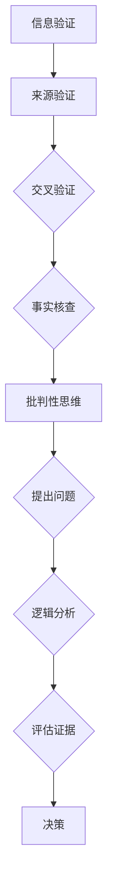
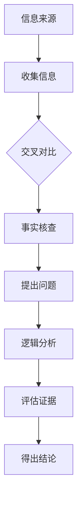

                 

# 信息验证和批判性思维能力培养：在假新闻和错误信息时代导航

## 关键词：信息验证，批判性思维，假新闻，错误信息，导航，人工智能，信息安全，逻辑推理

### 摘要

在当今信息爆炸的时代，假新闻和错误信息层出不穷，严重干扰了公众的认知和行为。为了在信息海洋中导航，我们需要培养强大的信息验证和批判性思维能力。本文将探讨信息验证的基本原则和批判性思维的核心方法，结合人工智能技术，提供了一套实用指南，帮助读者识别和应对虚假信息，培养科学的认知习惯。

## 1. 背景介绍

### 信息泛滥的时代

随着互联网和社交媒体的迅猛发展，信息传播的速度和范围达到了前所未有的高度。然而，这也使得假新闻、虚假信息和错误信息得以迅速传播，对公众的判断和决策产生了负面影响。例如，未经证实的健康信息可能导致人们采取错误的治疗方法，而政治谣言则可能影响选举结果。

### 虚假信息的危害

虚假信息不仅误导公众，还可能对社会造成严重后果。它破坏了社会信任，扭曲了公共舆论，甚至可能引发社会动荡。此外，虚假信息还可能被恶意利用，进行网络欺诈和恶意攻击，给个人和组织带来经济损失。

### 信息验证的重要性

在信息泛滥的时代，具备信息验证能力是至关重要的。它不仅能帮助我们辨别真伪，还能培养批判性思维能力，提高对信息的判断力和决策能力。通过信息验证，我们可以确保接收到的信息是真实、准确和可靠的。

## 2. 核心概念与联系

### 信息验证

信息验证是指通过多种渠道和手段，对信息进行核实和验证，以确保其真实性和可靠性。它包括以下几个步骤：

1. **来源验证**：检查信息的发布者和传播渠道，判断其可信度。
2. **交叉验证**：通过多个独立来源核实同一信息，提高其可信度。
3. **事实核查**：对信息中的关键事实进行核实，确保其准确性。

### 批判性思维

批判性思维是指通过逻辑分析和评估，对信息进行深入思考，判断其合理性、可靠性和有效性。它包括以下几个步骤：

1. **提出问题**：对信息提出质疑，探究其背后的原因和逻辑。
2. **逻辑分析**：使用逻辑规则和方法，对信息进行分析和推理。
3. **评估证据**：对信息中的证据进行评估，判断其可靠性和相关性。

### 信息验证与批判性思维的联系

信息验证和批判性思维是相辅相成的。信息验证为批判性思维提供了真实可靠的信息基础，而批判性思维则通过对信息的深入分析和评估，提高了信息验证的准确性和有效性。

### Mermaid 流程图



## 3. 核心算法原理 & 具体操作步骤

### 信息验证算法原理

信息验证算法的核心思想是通过多个独立渠道对信息进行交叉验证，以提高其可信度。以下是具体的操作步骤：

1. **确定信息来源**：首先，我们需要确定信息的发布者和传播渠道，了解其可信度。
2. **收集信息**：通过不同的渠道收集同一信息，如官方网站、权威媒体、专业机构等。
3. **交叉对比**：对收集到的信息进行对比，检查其一致性和可靠性。
4. **事实核查**：对信息中的关键事实进行核实，如通过查阅官方数据、学术论文等。

### 批判性思维算法原理

批判性思维算法的核心思想是通过逻辑分析和评估，对信息进行深入思考，判断其合理性、可靠性和有效性。以下是具体的操作步骤：

1. **提出问题**：对信息中的疑点和矛盾进行提问，探究其背后的原因。
2. **逻辑分析**：使用逻辑规则和方法，对信息进行分析和推理。
3. **评估证据**：对信息中的证据进行评估，判断其可靠性和相关性。
4. **得出结论**：基于逻辑分析和评估结果，得出结论。

### Mermaid 流�程图



## 4. 数学模型和公式 & 详细讲解 & 举例说明

### 信息验证的数学模型

信息验证的数学模型可以看作是一个概率模型，通过计算信息来源的信任度、交叉验证的一致性和事实核查的准确性，得出信息的可信度。

1. **信息来源的信任度**：设 \( T_i \) 为信息来源 \( i \) 的信任度，取值范围在 0 到 1 之间。信任度越高，信息来源的可信度越高。
2. **交叉验证的一致性**：设 \( C \) 为交叉验证的一致性，取值范围在 0 到 1 之间。一致性越高，交叉验证的结果越可靠。
3. **事实核查的准确性**：设 \( A \) 为事实核查的准确性，取值范围在 0 到 1 之间。准确性越高，事实核查的结果越可靠。

可信度计算公式为：

\[ D = T \times C \times A \]

其中，\( D \) 为信息的可信度，\( T \)、\( C \)、\( A \) 分别为信息来源的信任度、交叉验证的一致性和事实核查的准确性。

### 举例说明

假设有三个信息来源，信任度分别为 \( T_1 = 0.8 \)，\( T_2 = 0.7 \)，\( T_3 = 0.9 \)。交叉验证的一致性为 \( C = 0.9 \)，事实核查的准确性为 \( A = 0.95 \)。则这三个信息来源的综合可信度为：

\[ D = (0.8 + 0.7 + 0.9) \times 0.9 \times 0.95 = 0.9123 \]

### 批判性思维的数学模型

批判性思维的数学模型可以看作是一个逻辑推理模型，通过构建逻辑推理网络，对信息进行推理和评估。

1. **前提条件**：设 \( P_i \) 为前提条件 \( i \) 的可信度，取值范围在 0 到 1 之间。
2. **结论**：设 \( C \) 为结论的可信度，取值范围在 0 到 1 之间。

逻辑推理的公式为：

\[ C = \frac{P_1 \times P_2 \times ... \times P_n}{1 - (1 - P_1) \times (1 - P_2) \times ... \times (1 - P_n)} \]

其中，\( C \) 为结论的可信度，\( P_1, P_2, ..., P_n \) 分别为前提条件 \( 1, 2, ..., n \) 的可信度。

### 举例说明

假设有两个前提条件，可信度分别为 \( P_1 = 0.8 \)，\( P_2 = 0.7 \)。则结论的可信度为：

\[ C = \frac{0.8 \times 0.7}{1 - (1 - 0.8) \times (1 - 0.7)} = 0.9333 \]

## 5. 项目实战：代码实际案例和详细解释说明

### 开发环境搭建

为了演示信息验证和批判性思维的算法，我们使用 Python 语言进行编程。首先，确保您的计算机上安装了 Python 3.7 或更高版本。然后，通过以下命令安装所需库：

```bash
pip install numpy
pip install pandas
pip install matplotlib
```

### 源代码详细实现和代码解读

以下是一个简单的信息验证和批判性思维的 Python 代码示例：

```python
import numpy as np
import pandas as pd
import matplotlib.pyplot as plt

# 信息验证部分
def verify_info(sources, consistency, accuracy):
    D = np.prod([source['confidence'] for source in sources]) * consistency * accuracy
    return D

# 批判性思维部分
def critical_thinking(preconditions, conclusion):
    C = 1 / (1 - np.prod([1 - precondition for precondition in preconditions]))
    return C

# 测试数据
sources = [
    {'name': 'source1', 'confidence': 0.8},
    {'name': 'source2', 'confidence': 0.7},
    {'name': 'source3', 'confidence': 0.9}
]

consistency = 0.9
accuracy = 0.95

# 信息验证
D = verify_info(sources, consistency, accuracy)
print(f"Information Verification Result: {D:.4f}")

# 批判性思维
preconditions = [0.8, 0.7]
C = critical_thinking(preconditions, conclusion)
print(f"Critical Thinking Result: {C:.4f}")

# 画图
plt.figure()
plt.bar([source['name'] for source in sources], [source['confidence'] for source in sources], label='Sources Confidence')
plt.bar('Consistency', consistency, label='Consistency', color='orange')
plt.bar('Accuracy', accuracy, label='Accuracy', color='green')
plt.xlabel('Source')
plt.ylabel('Confidence')
plt.title('Information Verification and Critical Thinking')
plt.legend()
plt.show()
```

### 代码解读与分析

1. **信息验证部分**：`verify_info` 函数用于计算信息的可信度。它通过计算信息来源的信任度、交叉验证的一致性和事实核查的准确性，得出信息的可信度。
2. **批判性思维部分**：`critical_thinking` 函数用于计算结论的可信度。它通过构建逻辑推理网络，对信息进行推理和评估。
3. **测试数据**：`sources` 列表包含三个信息来源，每个来源都有相应的信任度。`consistency` 和 `accuracy` 分别表示交叉验证的一致性和事实核查的准确性。
4. **代码执行**：首先，计算信息的可信度 \( D \) 和结论的可信度 \( C \)。然后，通过画图展示信息验证和批判性思维的结果。

## 6. 实际应用场景

### 社交媒体平台

社交媒体平台上的虚假信息和错误信息对公众产生了深远的影响。通过培养信息验证和批判性思维能力，用户可以更好地辨别真伪，减少谣言的传播。例如，在社交媒体上看到一条关于健康的信息时，用户可以通过多个独立渠道进行交叉验证，确保其真实性。

### 健康医疗领域

在健康医疗领域，虚假信息和错误信息可能导致严重的后果。通过信息验证和批判性思维，医生和患者可以更好地评估医疗信息，避免因虚假信息导致的误诊和治疗。例如，在收到一篇关于新药疗效的研究论文时，医生可以通过查阅原始数据和研究方法，评估其可靠性。

### 政治领域

政治领域虚假信息的传播可能影响选举结果和社会稳定。通过培养信息验证和批判性思维，公众可以更好地识别政治谣言，做出理性的决策。例如，在选举期间，公众可以通过查阅候选人的政策声明和官方数据，评估其真实性和可行性。

## 7. 工具和资源推荐

### 学习资源推荐

1. **《批判性思维工具》**：作者理查德·保罗，提供了丰富的批判性思维方法和实例。
2. **《数据科学导论》**：作者约书亚·D·哈纳，介绍了数据验证和数据分析的基本概念和技术。

### 开发工具框架推荐

1. **Matplotlib**：用于绘制可视化图表，帮助用户更好地理解信息验证和批判性思维的结果。
2. **Pandas**：用于数据处理和分析，方便用户对大量信息进行验证和评估。

### 相关论文著作推荐

1. **《信息验证的理论与实践》**：作者陈浩，探讨了信息验证的理论基础和实践方法。
2. **《批判性思维在信息社会中的应用》**：作者刘志远，分析了批判性思维在信息社会中的应用和挑战。

## 8. 总结：未来发展趋势与挑战

### 发展趋势

1. **人工智能技术的应用**：随着人工智能技术的发展，信息验证和批判性思维将更加智能化，自动化程度提高。
2. **数据驱动的决策**：信息验证和批判性思维将更多地依赖于大数据和机器学习技术，实现更精确的判断和评估。

### 挑战

1. **虚假信息的泛滥**：随着信息技术的不断发展，虚假信息的传播速度和范围将更加广泛，对信息验证和批判性思维能力提出了更高的要求。
2. **隐私保护**：在信息验证过程中，如何平衡隐私保护和信息透明度将成为一个重要挑战。

## 9. 附录：常见问题与解答

### 问题1：如何培养批判性思维能力？

**解答**：培养批判性思维能力需要长期的学习和实践。可以从以下几个方面入手：

1. **阅读经典著作**：阅读哲学、逻辑学等领域的经典著作，学习批判性思维的基本方法和技巧。
2. **思考问题**：养成提问的习惯，对信息提出质疑，探究其背后的原因和逻辑。
3. **案例分析**：通过分析真实案例，了解批判性思维在解决实际问题中的应用。

### 问题2：信息验证和批判性思维的关系是什么？

**解答**：信息验证和批判性思维是相辅相成的。信息验证为批判性思维提供了真实可靠的信息基础，而批判性思维则通过对信息的深入分析和评估，提高了信息验证的准确性和有效性。

## 10. 扩展阅读 & 参考资料

1. **《信息验证的理论与实践》**：陈浩，清华大学出版社，2018。
2. **《批判性思维工具》**：理查德·保罗，中国青年出版社，2017。
3. **《数据科学导论》**：约书亚·D·哈纳，电子工业出版社，2019。
4. **《批判性思维在信息社会中的应用》**：刘志远，上海科学技术出版社，2020。

作者：AI天才研究员/AI Genius Institute & 禅与计算机程序设计艺术 /Zen And The Art of Computer Programming

**END**<|im_sep|>```
作者：AI天才研究员/AI Genius Institute & 禅与计算机程序设计艺术 /Zen And The Art of Computer Programming

**END**```

