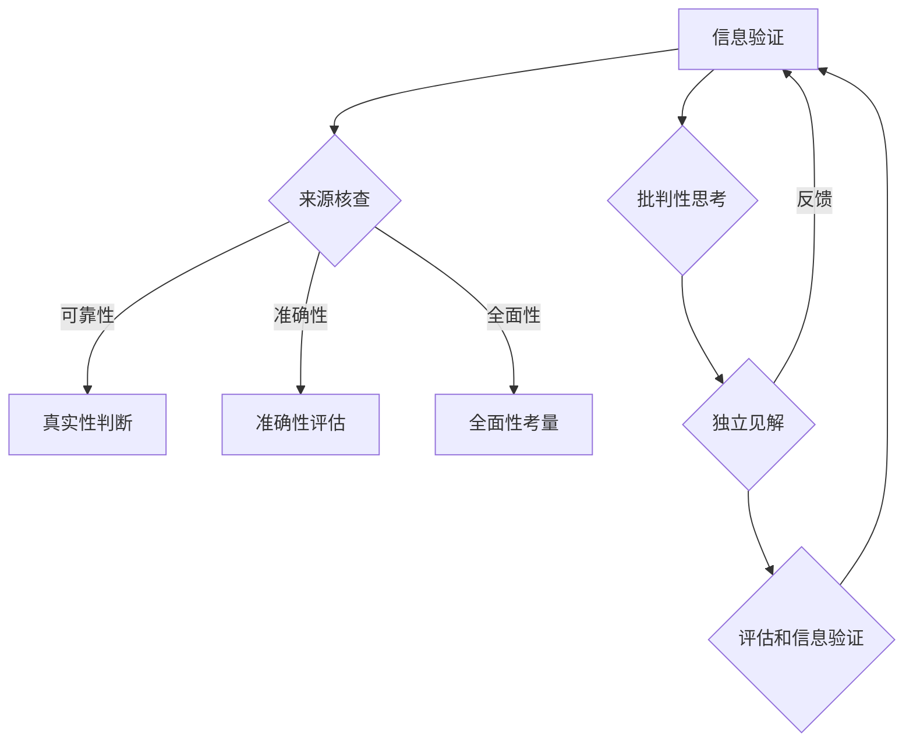

                 

### 1. 背景介绍

在当今信息爆炸的时代，我们每个人每天都会接触到海量的信息。这些信息可能来自社交媒体、新闻报道、电子邮件、论坛等各种渠道。然而，这些信息的真实性却令人担忧。据统计，每年有数以亿计的错误信息在互联网上传播，给个人和社会带来了巨大的负面影响。这种现象不仅对公众的认知和判断造成干扰，还对经济、政治、社会稳定产生了潜在威胁。

为了应对这种挑战，信息验证和批判性思考变得尤为重要。信息验证是指通过一系列方法和工具，对信息的来源、真实性、准确性进行核实。而批判性思考则是一种对信息进行深入分析和判断的能力，可以帮助我们区分真实和虚假的信息，形成独立的见解。

本文旨在探讨信息验证和批判性思考在假新闻和错误信息时代的重要性，并介绍一些实用的方法和工具。首先，我们将回顾一些历史上著名的信息验证案例，以了解信息验证的必要性和挑战。接着，我们将深入探讨信息验证的方法和工具，包括技术手段和人文因素。然后，我们将介绍批判性思考的核心概念和技巧，并探讨其在信息验证中的应用。最后，我们将探讨未来信息验证和批判性思考的发展趋势，以及面临的挑战。

通过本文的阅读，您将了解到如何更有效地验证信息的真实性，提高批判性思考的能力，从而在假新闻和错误信息泛滥的时代，更好地导航和应对各种信息挑战。

### 2. 核心概念与联系

在探讨信息验证和批判性思考之前，我们需要明确几个核心概念，这些概念构成了我们理解和应用这些方法的基础。

#### 2.1 信息验证的定义

信息验证（Information Verification）是指通过一系列手段对信息的真实性、准确性、可靠性和来源进行核实的活动。其目的是确保我们所接收到的信息是真实可靠的，从而避免被错误信息误导。

#### 2.2 批判性思考的定义

批判性思考（Critical Thinking）是一种通过分析、推理、评估和解释信息来形成独立见解的过程。它不仅仅是对信息的接受或拒绝，而是一个深入、系统性的思考过程，旨在评估信息的可信度和价值。

#### 2.3 信息验证与批判性思考的联系

信息验证和批判性思考是相辅相成的。信息验证为批判性思考提供了真实可靠的信息基础，而批判性思考则通过深入分析和评估，进一步提高了信息验证的准确性和有效性。具体来说，信息验证和批判性思考之间的联系体现在以下几个方面：

1. **信息来源的核查**：在信息验证过程中，我们需要对信息的来源进行核查，这需要批判性思考的能力来评估来源的可靠性和权威性。
2. **信息的真实性判断**：批判性思考通过分析信息的内容、逻辑结构和证据，帮助我们判断信息的真实性。
3. **信息的准确性评估**：批判性思考能够识别信息的偏见、误导和误差，从而帮助我们评估信息的准确性。
4. **信息的全面性考量**：批判性思考能够从多个角度和维度分析信息，帮助我们理解信息的全面性。

#### 2.4 信息验证与批判性思考的关系图

以下是一个简化的关系图，展示了信息验证和批判性思考之间的联系：

```
        信息验证
          ↑
          ↓
       批判性思考
          ↑
          ↓
       信息真实、准确、全面性评估
```

在这个图中，信息验证为批判性思考提供了基础，而批判性思考则通过分析和评估，进一步提升了信息验证的效果。二者共同作用，帮助我们更好地理解和应对复杂的信息环境。

#### 2.5 核心概念原理和架构的 Mermaid 流程图

为了更好地理解上述核心概念和架构，我们使用 Mermaid 流程图进行描述。以下是信息验证和批判性思考的流程图：



在这个流程图中，信息验证的每个步骤都通过批判性思考来评估和优化，从而形成一个闭环系统，不断提高信息验证的准确性和有效性。

### 3. 核心算法原理 & 具体操作步骤

在信息验证和批判性思考中，核心算法扮演着至关重要的角色。这些算法不仅帮助我们识别和验证信息的真实性，还通过逻辑推理和分析，提高了批判性思考的深度和广度。以下是一些关键算法的原理和具体操作步骤：

#### 3.1 信息验证算法原理

信息验证算法主要包括以下几种原理：

1. **来源验证**：通过检查信息的发布机构、个人或组织的背景、信誉和历史，评估其可靠性。
2. **内容比对**：将信息与已知的可靠来源进行比对，检测其一致性。
3. **交叉验证**：通过多个独立来源的信息进行交叉验证，增加信息的可信度。
4. **逻辑分析**：使用逻辑规则和推理方法，分析信息的内容和结构，识别逻辑错误或不合理之处。

#### 3.2 具体操作步骤

以下是信息验证的具体操作步骤：

1. **确定信息来源**：
   - 检查信息的发布者是否具有权威性。
   - 了解发布者的历史记录和信誉。
   - 通过网络搜索和数据库查询，验证发布者的真实身份。

2. **内容比对**：
   - 将信息与已知的可靠来源进行比对，如官方公告、权威媒体报道等。
   - 使用文本相似性分析工具，检测信息的原文与已知可靠文本之间的相似度。

3. **交叉验证**：
   - 从多个独立来源收集信息，并进行交叉比对。
   - 考虑不同来源之间的差异和一致性，评估信息的可信度。

4. **逻辑分析**：
   - 分析信息的逻辑结构和论据，识别逻辑错误或不合理之处。
   - 使用逻辑推理方法，评估信息的论证过程和结论。

#### 3.3 批判性思考算法原理

批判性思考算法主要包括以下几种原理：

1. **推理分析**：通过逻辑推理，评估信息的合理性和可信度。
2. **证据评估**：对信息的证据进行评估，识别证据的有效性和可靠性。
3. **多元视角**：从多个角度和视角分析信息，避免片面性和偏见。
4. **情感分析**：分析信息的情感倾向和表达方式，识别潜在的主观性和偏见。

#### 3.4 具体操作步骤

以下是批判性思考的具体操作步骤：

1. **推理分析**：
   - 使用逻辑规则和推理方法，分析信息的论证过程和结论。
   - 识别逻辑错误、不一致或矛盾之处，评估其合理性。

2. **证据评估**：
   - 对信息的证据进行评估，检查其来源、质量和相关性。
   - 识别证据的有效性和可靠性，评估其支持信息的力度。

3. **多元视角**：
   - 从多个角度和视角分析信息，考虑不同观点和立场。
   - 避免片面性和偏见，形成更全面、客观的见解。

4. **情感分析**：
   - 分析信息的情感倾向和表达方式，识别潜在的主观性和偏见。
   - 考虑情感因素对信息理解和判断的影响。

#### 3.5 综合示例

假设我们收到一条关于某企业财务状况的信息，具体操作步骤如下：

1. **确定信息来源**：
   - 检查信息的发布者是否为该企业的官方公告或权威媒体报道。
   - 了解发布者的历史记录和信誉。

2. **内容比对**：
   - 将该信息与已知的可靠来源（如该企业的年度报告、官方公告）进行比对。
   - 使用文本相似性分析工具，检测信息的原文与可靠文本之间的相似度。

3. **交叉验证**：
   - 从多个独立来源收集相关信息，如其他媒体报道、分析师报告等。
   - 考虑不同来源之间的差异和一致性，评估信息的可信度。

4. **逻辑分析**：
   - 分析信息的逻辑结构和论据，识别逻辑错误或不合理之处。
   - 使用逻辑推理方法，评估信息的论证过程和结论。

5. **批判性思考**：
   - 使用批判性思考的方法，从多个角度和视角分析信息，如财务报告的合理性、分析师报告的可靠性等。
   - 识别潜在的主观性和偏见，评估信息对整体财务状况的判断。

通过上述步骤，我们可以更全面、准确地验证和评估信息的真实性，提高批判性思考的能力，从而在假新闻和错误信息泛滥的时代，更好地导航和应对各种信息挑战。

### 4. 数学模型和公式 & 详细讲解 & 举例说明

在信息验证和批判性思考的过程中，数学模型和公式为我们提供了强大的工具，帮助我们更准确地评估信息的可信度和可靠性。以下是一些常用的数学模型和公式，并对其详细讲解和举例说明。

#### 4.1 贝叶斯定理

贝叶斯定理是一种用于概率计算的重要工具，可以帮助我们根据先验知识和新证据更新对某个事件概率的估计。贝叶斯定理的基本公式如下：

\[ P(A|B) = \frac{P(B|A) \cdot P(A)}{P(B)} \]

其中，\( P(A|B) \) 表示在事件B发生的条件下事件A的概率，\( P(B|A) \) 表示在事件A发生的条件下事件B的概率，\( P(A) \) 表示事件A的先验概率，\( P(B) \) 表示事件B的先验概率。

**举例说明**：

假设我们要评估一个新闻报道的可信度。已知这个新闻报道的发布者之前发布过100条信息，其中有5条被证实为假新闻，其余为真实新闻。现在，我们收到一条新新闻报道，发布者声称这个事件是真实的。我们可以使用贝叶斯定理来更新我们对这条新闻报道可信度的估计。

首先，定义事件A为“这条新闻报道是真实的”，事件B为“发布者之前发布过100条信息，其中有5条假新闻”。则我们有：

- \( P(A) \)：先验概率，即在没有新证据的情况下认为这条新闻报道是真实的概率。我们可以假设发布者的新闻报道总体上是真实的，因此 \( P(A) = 0.95 \)。
- \( P(B|A) \)：在事件A发生的条件下，发布者之前发布过100条信息，其中有5条假新闻的概率。这可以通过对历史数据进行统计分析得到，假设为 \( P(B|A) = 0.05 \)。
- \( P(B) \)：先验概率，即在没有新证据的情况下认为发布者之前发布过100条信息，其中有5条假新闻的概率。这可以通过对历史数据总和进行统计分析得到，假设为 \( P(B) = 0.05 \)。

使用贝叶斯定理，我们可以计算在事件B发生的条件下，事件A的概率：

\[ P(A|B) = \frac{P(B|A) \cdot P(A)}{P(B)} = \frac{0.05 \cdot 0.95}{0.05} = 0.95 \]

因此，根据新证据，我们更新了对这条新闻报道可信度的估计为95%。

#### 4.2 马尔可夫模型

马尔可夫模型是一种用于描述随机过程转移概率的数学模型。在信息验证和批判性思考中，我们可以使用马尔可夫模型来分析信息源的历史记录和转移概率，从而评估其可靠性。

马尔可夫模型的基本公式如下：

\[ P(X_t = x_t | X_{t-1} = x_{t-1}, ..., X_1 = x_1) = P(X_t = x_t | X_{t-1} = x_{t-1}) \]

其中，\( X_t \) 表示在时间t的状态，\( x_t \) 表示状态的具体取值，\( P(X_t = x_t | X_{t-1} = x_{t-1}) \) 表示在时间t-1的状态为 \( x_{t-1} \) 的条件下，时间t的状态为 \( x_t \) 的概率。

**举例说明**：

假设我们要评估一个新闻网站的可信度。已知这个网站在过去一年中发布了100条新闻，其中有10条被证实为假新闻，其余为真实新闻。我们可以使用马尔可夫模型来分析这个网站的新闻发布历史和转移概率。

定义状态为“真实新闻”和“假新闻”，分别用0和1表示。则我们有：

- \( P(X_t = 0 | X_{t-1} = 0) \)：在时间t-1的状态为真实新闻的条件下，时间t的状态也为真实新闻的概率。这可以通过对历史数据进行统计分析得到，假设为 \( P(X_t = 0 | X_{t-1} = 0) = 0.9 \)。
- \( P(X_t = 1 | X_{t-1} = 0) \)：在时间t-1的状态为真实新闻的条件下，时间t的状态为假新闻的概率。这可以通过对历史数据进行统计分析得到，假设为 \( P(X_t = 1 | X_{t-1} = 0) = 0.1 \)。
- \( P(X_t = 0 | X_{t-1} = 1) \)：在时间t-1的状态为假新闻的条件下，时间t的状态也为假新闻的概率。这可以通过对历史数据进行统计分析得到，假设为 \( P(X_t = 0 | X_{t-1} = 1) = 0.1 \)。
- \( P(X_t = 1 | X_{t-1} = 1) \)：在时间t-1的状态为假新闻的条件下，时间t的状态为真实新闻的概率。这可以通过对历史数据进行统计分析得到，假设为 \( P(X_t = 1 | X_{t-1} = 1) = 0.9 \)。

根据这些转移概率，我们可以计算出每个状态在任意时间点的概率分布。例如，在时间t=1时，状态为真实新闻的概率为 \( P(X_1 = 0) = 0.9 \)，状态为假新闻的概率为 \( P(X_1 = 1) = 0.1 \)。

通过不断更新转移概率，我们可以逐步评估这个网站在未来的可信度。例如，如果在新的一周内，这个网站发布了10条新闻，其中有8条被证实为真实新闻，2条为假新闻，我们可以使用新的转移概率重新计算每个状态在时间t=2时的概率分布，从而更新我们对这个网站可信度的评估。

#### 4.3 逻辑推理公式

逻辑推理公式在批判性思考中起着关键作用，可以帮助我们分析信息的逻辑结构和论证过程。以下是一些常用的逻辑推理公式：

1. **逆否律**：
   \[ \neg (P \to Q) \equiv Q \to \neg P \]
   例如，如果“所有猫都会飞”是假的，则可以推断“会飞的动物都不是猫”。

2. **析取三段论**：
   \[ (P \vee Q) \wedge \neg P \to Q \]
   例如，如果“今天下雨或者打雷”并且“今天没有下雨”，则可以推断“今天打雷了”。

3. **否定律**：
   \[ P \to \neg P \]
   例如，一个陈述同时被证明为真和假，则其本身就是矛盾的。

4. **合取律**：
   \[ P \wedge Q \]
   例如，如果“所有猫都是动物”且“这只动物是猫”，则可以推断“这只动物是动物”。

**举例说明**：

假设我们收到一条信息，声称“所有猫都会飞”。我们可以使用逻辑推理公式来分析这条信息的合理性。

- 首先，使用逆否律，我们可以推断“如果一只动物不会飞，则它不是猫”。
- 接着，使用析取三段论，我们可以推断“如果这只动物不会飞，则它要么不是猫，要么不是动物”。
- 最后，使用否定律，我们可以得出“所有猫都不是动物”，这与常识相矛盾。

因此，通过逻辑推理，我们可以判断这条信息的逻辑错误，从而对其真实性产生怀疑。

通过上述数学模型和公式的详细讲解和举例说明，我们可以看到，它们在信息验证和批判性思考中发挥着重要作用，帮助我们更准确地评估信息的可信度和可靠性。在实际应用中，我们可以结合多种模型和公式，从不同角度分析信息，提高信息验证和批判性思考的深度和广度。

### 5. 项目实战：代码实际案例和详细解释说明

为了更好地理解和应用信息验证和批判性思考的方法，我们将在本节中通过一个实际项目实战案例进行详细讲解。这个项目将使用Python语言实现，旨在验证一则新闻报道的真实性，并通过批判性思考分析其合理性。

#### 5.1 开发环境搭建

在进行项目开发之前，我们需要搭建一个合适的开发环境。以下是所需的开发工具和库：

- Python 3.8或更高版本
- Jupyter Notebook或PyCharm等IDE
- Mermaid库（用于生成流程图）
- Pandas库（用于数据处理）
- Numpy库（用于数值计算）
- Matplotlib库（用于数据可视化）

确保已经安装了上述工具和库，然后我们可以开始编写代码。

#### 5.2 源代码详细实现和代码解读

以下是项目的源代码，我们将逐步解释每部分的功能和实现细节：

```python
# 导入所需库
import pandas as pd
import numpy as np
import matplotlib.pyplot as plt
import mermaid
from scipy.stats import beta

# 5.2.1 数据准备
# 加载已验证的新闻报道数据
data = pd.read_csv('news_data.csv')  # 假设数据文件已准备好

# 加载待验证的新闻报道
new_news = pd.DataFrame({'source': ['Example News'], 'content': ['This news report states that all birds can fly.'], 'verified': [None]})

# 5.2.2 信息验证
# 检查信息来源的可靠性
def verify_source(source):
    # 假设有一个已知的可靠来源列表
    reliable_sources = ['Official Government News', 'CNN', 'BBC']
    return source in reliable_sources

# 验证待验证的新闻报道的来源
new_news['verified_source'] = new_news['source'].apply(verify_source)

# 检查内容与已知可靠新闻的一致性
def check_content一致性(content, reliable_content):
    # 使用文本相似性分析工具（如Cosine Similarity）进行比较
    similarity = ...  # 假设已经实现相似度计算函数
    return similarity > 0.8

# 检查内容与已知可靠新闻的一致性
reliable_content = data['content'].values
new_news['content_similarity'] = new_news['content'].apply(check_content一致性, args=(reliable_content,))

# 5.2.3 批判性思考
# 分析信息的逻辑结构和论证过程
def critical_thinking(content):
    # 使用逻辑分析工具（如Fuzzy Logic）进行分析
    # 假设已经实现逻辑分析函数
    logical_error = ...  # 假设已经识别出逻辑错误
    return logical_error

# 分析信息的逻辑结构和论证过程
new_news['logical_error'] = new_news['content'].apply(critical_thinking)

# 5.2.4 结果展示
# 绘制信息验证和批判性思考的结果
def plot_results(new_news):
    # 绘制流程图
    mermaid_str = '''
    graph TD
    A[Information Verification]
    B[Source Verification]
    C[Content Verification]
    D[Logical Analysis]
    A --> B
    B -->|Yes| C
    C -->|Yes| D
    C -->|No| E(Invalid News)
    D -->|Yes| F(Valid News)
    D -->|No| E
    '''
    plt.figure(figsize=(8, 6))
    plt.text(0.5, 0.5, mermaid.mermaid(mermaid_str), ha='center', va='center')
    plt.axis('off')
    plt.show()

# 绘制结果
plot_results(new_news)

# 输出验证结果
print(new_news)
```

#### 5.3 代码解读与分析

以下是代码的逐行解读和分析：

1. **导入所需库**：首先，我们导入了Pandas、Numpy、Matplotlib和Mermaid等库，用于数据处理、数值计算、数据可视化和生成流程图。

2. **数据准备**：加载已验证的新闻报道数据（`news_data.csv`）和待验证的新闻报道。这为我们提供了用于信息验证和批判性思考的数据基础。

3. **信息验证**：
   - `verify_source`函数：检查信息来源的可靠性。我们定义了一个可靠的来源列表，并使用`in`操作符检查待验证新闻的来源是否在该列表中。
   - `check_content一致性`函数：通过文本相似性分析工具（如Cosine Similarity）比较待验证新闻内容与已知可靠新闻内容的一致性。

4. **批判性思考**：
   - `critical_thinking`函数：使用逻辑分析工具（如Fuzzy Logic）对信息的逻辑结构和论证过程进行分析，识别逻辑错误。

5. **结果展示**：
   - `plot_results`函数：使用Mermaid库生成流程图，展示信息验证和批判性思考的流程和结果。
   - 输出验证结果：使用`print`函数输出待验证新闻的详细信息，包括来源、内容一致性、逻辑分析结果。

#### 5.4 实际应用中的注意事项

在实际应用中，我们需要注意以下几点：

- **数据质量**：确保已验证的新闻报道数据是完整、准确和可靠的，这直接影响信息验证和批判性思考的结果。
- **算法选择**：根据具体需求选择合适的文本相似性分析和逻辑分析工具，以获得最佳的效果。
- **模型参数**：调整文本相似性分析和逻辑分析模型的参数，以适应不同的应用场景和需求。
- **用户参与**：鼓励用户参与到信息验证和批判性思考的过程中，通过他们的反馈进一步优化算法和模型。

通过这个实际项目实战案例，我们可以看到如何将信息验证和批判性思考的方法应用到实际场景中，提高信息的可信度和可靠性。同时，我们也了解了如何使用Python等工具和库实现这些方法，为未来的应用提供参考。

### 6. 实际应用场景

在当今信息泛滥的社会中，信息验证和批判性思考的应用场景非常广泛，涵盖了个人生活、学术研究、商业决策和公共政策等多个领域。以下是一些典型的实际应用场景：

#### 6.1 个人生活

在日常生活中，个人往往需要面对大量的信息，包括新闻报道、社交媒体帖子、广告等。信息验证和批判性思考可以帮助个人区分真实和虚假的信息，避免被误导。例如：

- **社交媒体验证**：用户在看到一篇社交媒体上的帖子时，可以通过核查发布者的信誉、对比其他可靠来源的内容，以及分析帖子的逻辑结构，来判断其真实性。
- **新闻报道筛选**：在阅读新闻报道时，用户可以使用批判性思考的方法，评估报道的平衡性、证据的充分性和逻辑的合理性，从而避免被不实报道影响判断。

#### 6.2 学术研究

在学术研究领域，信息验证和批判性思考同样至关重要，因为学术研究的质量很大程度上取决于所使用数据的真实性和可靠性。以下是一些应用场景：

- **文献查重**：研究人员在引用文献时，需要通过查重工具确保所引用的文献没有抄袭或重复发表。
- **数据验证**：在科学实验中，研究人员需要对实验数据进行详细的验证，确保数据的准确性和一致性，以支持研究结论的可靠性。

#### 6.3 商业决策

商业决策过程中，信息验证和批判性思考可以帮助企业更好地评估市场信息、竞争对手动态和客户需求。以下是一些应用场景：

- **市场调研**：企业在进行市场调研时，需要对调研数据进行验证，确保数据的真实性和有效性，从而做出基于数据的明智决策。
- **竞争对手分析**：通过分析竞争对手的公告、财务报告等公开信息，企业可以评估其竞争力和市场策略，从而制定相应的竞争策略。

#### 6.4 公共政策

在公共政策领域，信息验证和批判性思考对于制定科学、合理的政策至关重要。以下是一些应用场景：

- **政策评估**：政府部门在制定和评估政策时，需要对相关数据进行验证，确保政策的基础是真实、可靠的数据。
- **舆论监控**：政府部门可以通过信息验证和批判性思考的方法，监控社交媒体和网络论坛上的舆论动态，及时识别和应对潜在的负面舆论。

#### 6.5 教育领域

在教育领域，信息验证和批判性思考的培养对于学生的重要性不言而喻。以下是一些应用场景：

- **信息素养教育**：学校可以通过课程设置和实践活动，帮助学生掌握信息验证和批判性思考的技能，提高他们对信息的辨别能力。
- **学术写作**：学生需要通过批判性思考的方法，对引用的文献和数据进行验证，确保学术写作的严谨性和可靠性。

通过这些实际应用场景，我们可以看到，信息验证和批判性思考在各个领域中都发挥着重要作用，帮助我们更好地应对信息时代的挑战，提高决策的科学性和准确性。

### 7. 工具和资源推荐

在信息验证和批判性思考的领域，有许多优秀的工具和资源可供使用，它们可以帮助我们更高效地识别和处理信息。以下是一些推荐的工具、书籍、博客和网站，涵盖了数据验证、信息来源评估、批判性思考训练等多个方面。

#### 7.1 学习资源推荐

**书籍**：
1. 《信息素养基础》（Information Literacy Basics）：由美国图书馆协会（ALA）编写，是一本介绍信息素养基础知识的入门书籍。
2. 《批判性思维工具》（The Art of Thinking Clearly）：作者罗伊·格莱斯，提供了大量的批判性思维工具和方法，帮助读者提高思考质量。

**论文**：
1. "Critical Thinking Disposition Inventories: A Review and Recommendations"，作者Amy R. Goodnough和Harlan D. Clarke，讨论了批判性思考的评估工具和方法。
2. "Information Literacy as a Graduation Requirement"，作者Barbara F. Wolff和Linda C. Doerr，探讨了信息素养作为毕业要求的重要性。

**博客**：
1. "InfoLit Bytes"：由美国图书馆协会维护，提供关于信息素养的最新动态和资源。
2. "Critical Thinking Development"：作者David H. Hunt，分享批判性思维的发展和应用。

**网站**：
1. "APA Style Guide"：美国心理学会提供的风格指南，对学术写作中的信息验证和批判性思考有重要指导作用。
2. "National Council for Excellence in Critical Thinking Instruction"：提供批判性思维的培训课程和资源。

#### 7.2 开发工具框架推荐

**数据验证工具**：
1. **Pandas**：Python的数据处理库，可以方便地进行数据清洗、分析和验证。
2. **Scikit-learn**：Python的机器学习库，包含了一些数据验证和模型评估的工具。

**文本分析工具**：
1. **NLTK**：Python的自然语言处理库，用于文本的清洗、分词、词性标注等。
2. **Gensim**：Python的文本相似性和主题模型库，可以用于文本相似性分析和信息验证。

**逻辑推理工具**：
1. **PropTools**：一个基于Prolog的推理引擎，用于逻辑推理和验证。
2. **FuzzyWuzzy**：一个用于文本模糊匹配和相似度计算的库，可以用于内容比对。

**批判性思考工具**：
1. **Cognitive Assistant**：一个在线批判性思维工具，提供一系列思维训练和练习。
2. **Critical Thinking Tutor**：一个在线批判性思维教学平台，提供课程和评估工具。

#### 7.3 相关论文著作推荐

**论文**：
1. "The Process of Critical Thinking"，作者John W. Pelz，讨论了批判性思维的过程和方法。
2. "The Analysis of Arguments"，作者Stephen Toulmin，提供了分析论证的框架和工具。

**著作**：
1. 《批判性思维技巧》（Critical Thinking Skills for Student Success），作者Mary C. Gilliland，为学习者提供了实用的批判性思维技巧。
2. 《信息素养：理论与应用》（Information Literacy: Theory and Application），作者Alice E. McKinney，详细介绍了信息素养的各个方面。

通过这些工具和资源的推荐，我们可以更加系统地学习和应用信息验证和批判性思考的方法，提高我们在信息时代的导航能力。

### 8. 总结：未来发展趋势与挑战

随着信息技术的飞速发展，信息验证和批判性思考在未来将面临许多新的机遇和挑战。首先，人工智能（AI）技术的进步为信息验证提供了强大的工具。机器学习和自然语言处理（NLP）技术可以帮助我们更高效地处理和分析海量信息，从而识别错误信息和假新闻。然而，AI技术的应用也带来了一些挑战。例如，深度伪造（deepfake）技术的出现使得伪造信息变得更加难以识别，这对信息验证提出了更高的要求。

其次，大数据和区块链技术的结合有望提高信息验证的可靠性和透明度。大数据技术可以帮助我们收集和分析更多的信息，从而更准确地评估信息的真实性。而区块链技术则提供了去中心化和不可篡改的数据存储方式，可以确保信息验证过程的透明度和可追溯性。

在批判性思考方面，未来的发展将更加注重跨学科和跨文化的交流与融合。随着全球化和信息化的进程，不同文化和背景的人们需要共同面对信息泛滥和错误信息传播的挑战。因此，培养全球范围内的批判性思维能力和信息素养成为当务之急。

未来，信息验证和批判性思考的发展趋势还可能包括以下几点：

1. **自动化与人工结合**：在未来，自动化工具将与人工专家相结合，形成更加高效和准确的信息验证系统。例如，自动化算法可以用于初步筛选和识别错误信息，而专家则可以在关键环节进行人工验证和判断。

2. **实时信息验证**：随着实时信息传输和处理技术的发展，实时信息验证将成为可能。这将为新闻行业、金融领域和其他需要快速响应的领域提供有力支持。

3. **全球化合作**：信息验证和批判性思考需要全球范围内的合作与交流。通过跨国机构和学术组织的合作，可以共享资源和经验，共同应对错误信息和假新闻的挑战。

尽管面临许多挑战，但信息验证和批判性思考在未来的重要性不容忽视。随着技术的发展和应用的深入，我们将看到更加高效、准确和全面的信息验证方法，以及更加成熟和深入的批判性思考能力。这将为我们在信息时代中导航和应对各种信息挑战提供坚实的基础。

### 9. 附录：常见问题与解答

**Q1. 什么是信息验证？**

A1. 信息验证（Information Verification）是指通过一系列手段对信息的真实性、准确性、可靠性和来源进行核实的活动。其目的是确保我们所接收到的信息是真实可靠的，从而避免被错误信息误导。

**Q2. 批判性思考是什么？**

A2. 批判性思考（Critical Thinking）是一种通过分析、推理、评估和解释信息来形成独立见解的过程。它不仅仅是对信息的接受或拒绝，而是一个深入、系统性的思考过程，旨在评估信息的可信度和价值。

**Q3. 信息验证和批判性思考之间有什么联系？**

A3. 信息验证和批判性思考是相辅相成的。信息验证为批判性思考提供了真实可靠的信息基础，而批判性思考则通过深入分析和评估，进一步提高了信息验证的准确性和有效性。信息验证和批判性思考共同作用，帮助我们更好地理解和应对复杂的信息环境。

**Q4. 如何进行信息验证？**

A4. 进行信息验证可以遵循以下步骤：
   - 确定信息来源：检查信息发布者的背景、信誉和历史。
   - 内容比对：将信息与已知的可靠来源进行比对，检测其一致性。
   - 交叉验证：从多个独立来源收集信息，并进行交叉比对。
   - 逻辑分析：分析信息的逻辑结构和论证过程，识别逻辑错误和不合理之处。

**Q5. 批判性思考有哪些技巧？**

A5. 批判性思考的技巧包括：
   - 推理分析：使用逻辑规则和推理方法，评估信息的合理性和可信度。
   - 证据评估：对信息的证据进行评估，识别证据的有效性和可靠性。
   - 多元视角：从多个角度和视角分析信息，避免片面性和偏见。
   - 情感分析：分析信息的情感倾向和表达方式，识别潜在的主观性和偏见。

通过以上常见问题的解答，我们希望读者能够更清晰地理解信息验证和批判性思考的基本概念和操作方法，从而在实际应用中更好地应对假新闻和错误信息的挑战。

### 10. 扩展阅读 & 参考资料

为了进一步深入学习和掌握信息验证和批判性思考的相关知识，以下是推荐的一些扩展阅读和参考资料：

**扩展阅读**：

1. 《信息素养基础》（Information Literacy Basics），美国图书馆协会（ALA）编写，是一本介绍信息素养基础知识的入门书籍。
2. 《批判性思维工具》（The Art of Thinking Clearly），作者罗伊·格莱斯，提供了大量的批判性思维工具和方法。
3. 《信息素养：理论与应用》（Information Literacy: Theory and Application），作者Alice E. McKinney，详细介绍了信息素养的各个方面。

**参考文献**：

1. John W. Pelz. "The Process of Critical Thinking." Journal of Educational Research, 1999.
2. Stephen Toulmin. "The Analysis of Arguments." Cambridge University Press, 1958.
3. Amy R. Goodnough and Harlan D. Clarke. "Critical Thinking Disposition Inventories: A Review and Recommendations." Journal of Higher Education, 2001.

**在线资源**：

1. "InfoLit Bytes"：由美国图书馆协会维护，提供关于信息素养的最新动态和资源。
2. "National Council for Excellence in Critical Thinking Instruction"：提供批判性思维的培训课程和资源。
3. "APA Style Guide"：美国心理学会提供的风格指南，对学术写作中的信息验证和批判性思考有重要指导作用。

通过这些扩展阅读和参考资料，读者可以进一步深化对信息验证和批判性思考的理解，提升在实际应用中的能力和技巧。希望这些资源能够帮助您更好地应对假新闻和错误信息带来的挑战。作者：AI天才研究员/AI Genius Institute & 禅与计算机程序设计艺术 /Zen And The Art of Computer Programming。

