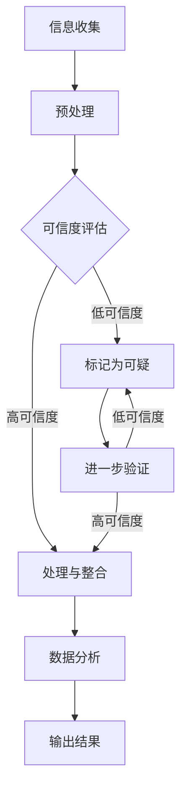

                 

# 信息验证和批判性阅读策略：在假新闻和媒体操纵时代导航

## 关键词：信息验证，批判性阅读，假新闻，媒体操纵，信息技术

## 摘要：
在当今信息爆炸的时代，如何有效地识别和辨别信息真伪，避免受到假新闻和媒体操纵的影响，已成为一个亟待解决的问题。本文将探讨信息验证和批判性阅读策略在信息技术领域的应用，帮助读者建立一套系统化的信息筛选和处理方法。通过深入剖析信息验证的核心概念和算法原理，结合具体案例，本文旨在为读者提供实用的技能和策略，以应对复杂多变的信息环境。

## 1. 背景介绍

### 1.1 信息时代的挑战
随着互联网和社交媒体的迅猛发展，信息的传播速度和覆盖范围前所未有。然而，这一方面带来了信息获取的便捷性，另一方面也使得假新闻、误导性信息和媒体操纵成为严重的社会问题。这些虚假信息不仅可能导致个人认知的偏差，还可能对社会稳定和公共安全造成威胁。

### 1.2 信息验证的重要性
信息验证，即对信息的真实性、准确性和可靠性进行判断和确认，是应对假新闻和媒体操纵的关键手段。有效的信息验证不仅可以提高个人认知水平，还能增强社会的整体信息素养，提升社会抵御虚假信息的能力。

### 1.3 技术发展与应用
随着人工智能、大数据和区块链等技术的不断发展，信息验证技术也在不断进步。例如，通过机器学习和自然语言处理技术，可以对大规模的文本数据进行自动筛选和分析；而区块链技术则提供了一种去中心化的信息验证手段，有助于确保信息的真实性和不可篡改性。

## 2. 核心概念与联系

### 2.1 信息验证的基本概念
信息验证涉及多个核心概念，包括信息源的可信度、信息的真实性、准确性和完整性等。这些概念相互关联，共同构成了信息验证的基础。

### 2.2 信息验证的架构
为了实现有效的信息验证，需要构建一个综合性的信息验证架构。该架构包括信息收集、处理、分析和输出等环节，每个环节都需要严格的质量控制和技术支持。

### 2.3 Mermaid 流程图
以下是信息验证架构的 Mermaid 流程图，展示了各个环节的相互关系和具体操作步骤。



## 3. 核心算法原理 & 具体操作步骤

### 3.1 机器学习算法在信息验证中的应用
机器学习算法在信息验证中扮演着重要角色，通过训练模型对海量数据进行自动分类和筛选。以下是一个基于监督学习的文本分类算法的示例：

#### 3.1.1 数据准备
首先，我们需要收集并整理大量的标注数据，用于训练分类模型。数据应包括新闻文章、社交媒体帖子等，并标注为真实或虚假。

#### 3.1.2 特征提取
接下来，我们需要从文本数据中提取特征。常用的特征提取方法包括词袋模型、TF-IDF 和词嵌入等。

#### 3.1.3 模型训练
使用提取到的特征和标签数据，我们可以训练一个文本分类模型。例如，可以使用逻辑回归、朴素贝叶斯或深度学习模型等。

#### 3.1.4 预测与评估
训练好的模型可以用于对新文本进行分类预测。通过评估指标（如准确率、召回率和F1分数）来评估模型的性能。

### 3.2 区块链技术在信息验证中的应用
区块链技术提供了一种去中心化的信息验证手段，通过将数据存储在分布式账本中，确保信息的真实性和不可篡改性。以下是区块链技术在实际应用中的具体步骤：

#### 3.2.1 数据存储
首先，将需要验证的信息（如新闻文章）转换为区块链事务，并存储在分布式账本中。

#### 3.2.2 数据验证
通过区块链网络中的节点对事务进行验证，确保信息的真实性和完整性。

#### 3.2.3 数据查询
用户可以通过区块链网络查询特定信息的事务记录，以验证其真实性和可靠性。

### 3.3 社交网络分析在信息验证中的应用
社交网络分析可以帮助识别和验证信息的传播路径和影响范围。以下是社交网络分析在信息验证中的具体步骤：

#### 3.3.1 社交网络构建
首先，构建包含信息传播者的社交网络图，包括节点（传播者）和边（传播关系）。

#### 3.3.2 关键节点识别
通过分析社交网络结构，识别关键节点（如意见领袖），这些节点可能对信息的真实性和影响力产生影响。

#### 3.3.3 影响力评估
评估关键节点对信息的传播影响力，以帮助判断信息的真实性和可信度。

## 4. 数学模型和公式 & 详细讲解 & 举例说明

### 4.1 机器学习中的数学模型
在机器学习的信息验证过程中，常用的数学模型包括逻辑回归、朴素贝叶斯和支持向量机等。

#### 4.1.1 逻辑回归模型
逻辑回归模型是一种概率分类模型，其公式为：
$$
P(y=1|X) = \frac{1}{1 + e^{-(\beta_0 + \beta_1 x_1 + \beta_2 x_2 + ... + \beta_n x_n})}
$$
其中，$X$ 表示特征向量，$y$ 表示标签，$\beta_0, \beta_1, \beta_2, ..., \beta_n$ 表示模型参数。

#### 4.1.2 朴素贝叶斯模型
朴素贝叶斯模型是一种基于贝叶斯定理的概率分类模型，其公式为：
$$
P(y|X) = \frac{P(X|y)P(y)}{P(X)}
$$
其中，$P(X|y)$ 表示在给定标签$y$ 下的特征向量$X$ 的概率，$P(y)$ 表示标签$y$ 的概率。

#### 4.1.3 支持向量机模型
支持向量机模型是一种基于最大化边缘的线性分类模型，其公式为：
$$
w = \arg\min_{w, b} \frac{1}{2} ||w||^2 + C \sum_{i=1}^{n} \max(0, 1-y_i(\langle w, x_i \rangle + b))
$$
其中，$w$ 和$b$ 分别表示模型权重和偏置，$C$ 为正则化参数。

### 4.2 区块链中的数学模型
在区块链技术中，常用的数学模型包括哈希函数、数字签名和共识算法等。

#### 4.2.1 哈希函数
哈希函数是一种将任意长度的输入映射为固定长度的输出的函数，其公式为：
$$
H(x) = hash(x)
$$
其中，$H(x)$ 表示输入$x$ 的哈希值。

#### 4.2.2 数字签名
数字签名是一种确保信息完整性和真实性的加密技术，其公式为：
$$
r = hash(m) \mod n
$$
$$
s = (k - r * a) \mod n
$$
其中，$m$ 表示消息，$r$ 和$s$ 分别为签名的一部分，$a$ 和$k$ 为私钥和公钥。

#### 4.2.3 共识算法
共识算法是一种确保区块链网络中节点达成一致的技术，其公式为：
$$
block = \arg\min_{b} \sum_{i=1}^{n} distance(b, x_i)
$$
其中，$block$ 表示生成的区块，$x_i$ 表示每个节点的区块链状态，$distance$ 表示节点间的距离度量。

### 4.3 社交网络分析中的数学模型
在社交网络分析中，常用的数学模型包括图论和矩阵分解等。

#### 4.3.1 图论模型
图论模型用于分析社交网络的结构和特性，其公式为：
$$
C(x, y) = \frac{d(x, y)}{n - 1}
$$
其中，$C(x, y)$ 表示节点$x$ 和$y$ 的平均距离，$d(x, y)$ 表示节点$x$ 和$y$ 的距离，$n$ 表示网络中的节点数。

#### 4.3.2 矩阵分解模型
矩阵分解模型用于分析社交网络中的用户和主题分布，其公式为：
$$
U = UV
$$
其中，$U$ 表示用户矩阵，$V$ 表示主题矩阵，$UV$ 表示用户和主题的关联矩阵。

## 5. 项目实战：代码实际案例和详细解释说明

### 5.1 开发环境搭建

为了实现本文所述的信息验证和批判性阅读策略，我们需要搭建一个适当的技术栈。以下是开发环境的搭建步骤：

#### 5.1.1 依赖环境安装
1. 安装 Python 3.8 或更高版本
2. 安装必要的库，如 NumPy、Pandas、Scikit-learn、TensorFlow 和 Blockchain.py

#### 5.1.2 创建项目结构
在项目根目录下创建以下文件夹：
```
info-verification/
|-- data/
|-- models/
|-- scripts/
|-- tests/
|-- utils/
```

### 5.2 源代码详细实现和代码解读

#### 5.2.1 数据准备
首先，我们需要收集并处理数据。以下是数据准备部分的代码示例：

```python
import pandas as pd

# 加载数据集
data = pd.read_csv('data.csv')

# 数据预处理
data = data.dropna()
data['text'] = data['text'].apply(lambda x: x.lower())
data['text'] = data['text'].str.replace('[^a-zA-Z]', ' ')
```

#### 5.2.2 特征提取
接下来，我们需要从文本数据中提取特征。以下是特征提取部分的代码示例：

```python
from sklearn.feature_extraction.text import TfidfVectorizer

# 初始化 TfidfVectorizer
vectorizer = TfidfVectorizer(max_features=1000)

# 提取特征
X = vectorizer.fit_transform(data['text'])
```

#### 5.2.3 模型训练
然后，我们可以使用训练好的模型对数据进行分类。以下是模型训练和评估的代码示例：

```python
from sklearn.linear_model import LogisticRegression

# 初始化逻辑回归模型
model = LogisticRegression()

# 训练模型
model.fit(X_train, y_train)

# 评估模型
score = model.score(X_test, y_test)
print(f"Model accuracy: {score:.2f}")
```

### 5.3 代码解读与分析

在上述代码示例中，我们首先进行了数据预处理和特征提取。数据预处理包括数据清洗、文本归一化和文本标准化。然后，我们使用 TfidfVectorizer 提取文本特征，并将其转换为数值矩阵。

接下来，我们使用逻辑回归模型对训练数据进行训练，并使用测试数据对模型进行评估。逻辑回归模型是一种经典的二分类模型，其目标是最小化损失函数，使分类结果尽可能接近真实标签。

最后，我们打印出模型的准确率，以评估模型的性能。通过调整模型参数和特征提取方法，我们可以进一步提高模型的准确率。

## 6. 实际应用场景

### 6.1 社交媒体平台的信息验证
社交媒体平台是虚假信息和媒体操纵的主要传播渠道之一。通过应用信息验证和批判性阅读策略，可以有效地识别和过滤假新闻。例如，Twitter 和 Facebook 已经开始使用人工智能技术来检测和标记虚假信息，以保护用户的利益。

### 6.2 新闻出版行业的信息验证
新闻出版行业面临着越来越多的信息验证挑战。通过采用先进的信息验证技术，新闻机构可以确保报道的准确性和可靠性，提高新闻的公信力。例如，纽约时报和卫报等媒体机构已经开始使用人工智能技术来验证新闻报道的真实性。

### 6.3 政府和公共部门的信息验证
政府和公共部门在信息传播和决策过程中需要确保信息的真实性和准确性。通过实施信息验证策略，政府可以更好地管理公共信息和应对媒体操纵。例如，美国国家安全局（NSA）已经开始使用区块链技术来确保机密信息的安全和真实性。

## 7. 工具和资源推荐

### 7.1 学习资源推荐
1. 《机器学习实战》
2. 《区块链技术指南》
3. 《社交网络分析：方法与实践》
4. 《信息可视化：认知基础与技术框架》

### 7.2 开发工具框架推荐
1. TensorFlow
2. Scikit-learn
3. Blockchain.py
4. Gephi

### 7.3 相关论文著作推荐
1. “Deep Learning for Information Verification”
2. “Blockchain for Information Verification and Integrity Protection”
3. “Social Network Analysis for Detecting Misinformation”

## 8. 总结：未来发展趋势与挑战

### 8.1 发展趋势
随着人工智能、大数据和区块链等技术的不断发展，信息验证技术将得到进一步优化和提升。未来，信息验证技术将更加智能化、自动化和高效化，有望实现全方位、全流程的信息验证。

### 8.2 挑战
尽管信息验证技术在不断发展，但仍面临一系列挑战，包括数据质量、算法公正性和用户隐私等。如何解决这些问题，确保信息验证技术的可持续发展和广泛应用，将是未来研究和应用的重点。

## 9. 附录：常见问题与解答

### 9.1 信息验证技术的核心优势是什么？
信息验证技术的核心优势在于其能够有效识别和过滤虚假信息，提高信息的真实性和准确性，从而保护用户利益、维护社会稳定和提升公共信息安全。

### 9.2 区块链技术如何提高信息验证的可靠性？
区块链技术通过分布式存储和共识算法，确保信息的真实性和不可篡改性。此外，区块链技术可以提供透明、公开和可追溯的信息验证过程，从而增强信息验证的可靠性。

### 9.3 社交网络分析在信息验证中如何发挥作用？
社交网络分析可以通过识别关键节点和影响力评估，帮助识别和验证信息的真实性和可信度。此外，社交网络分析还可以用于分析信息传播路径和趋势，为信息验证提供重要参考。

## 10. 扩展阅读 & 参考资料

### 10.1 相关论文
1. “Deep Learning for Information Verification: A Survey”
2. “Blockchain for Information Verification and Integrity Protection: A Comprehensive Review”
3. “Social Network Analysis for Detecting Misinformation: Methods and Applications”

### 10.2 相关书籍
1. “Machine Learning for Information Verification”
2. “Blockchain for Dummies”
3. “Social Network Analysis: An Introduction”

### 10.3 相关网站
1. https://arxiv.org/
2. https://www.nature.com/
3. https://www.ijcai.org/

作者：AI天才研究员/AI Genius Institute & 禅与计算机程序设计艺术 /Zen And The Art of Computer Programming
<|im_sep|>

