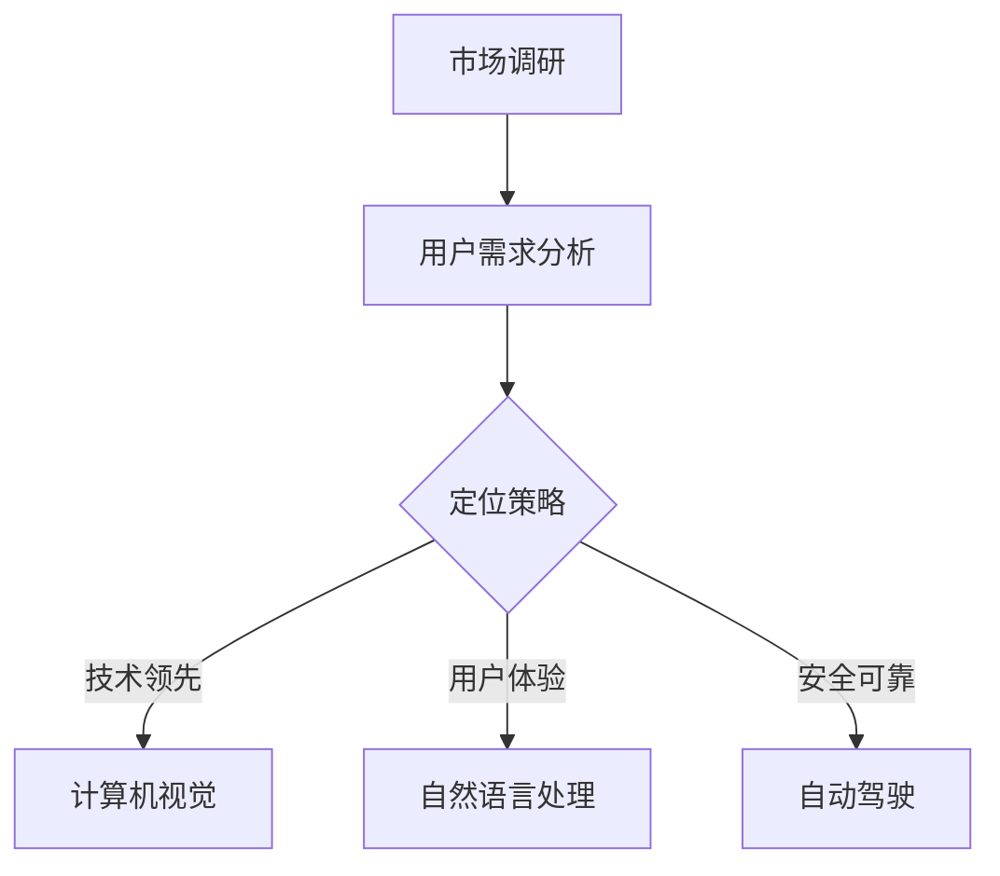
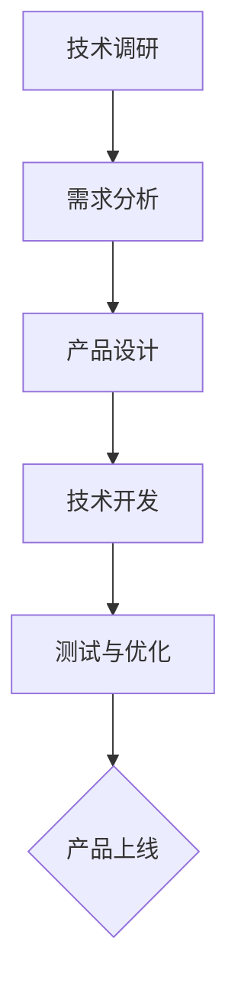
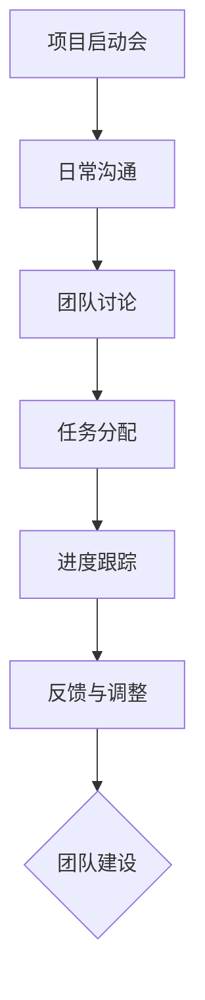

                 

# 健康的增长曲线：贾扬清对团队表现的满意，产品与战略的验证

## 摘要

在当前快节奏、高竞争的IT行业中，如何保持健康且可持续的增长曲线成为企业成功的关键。本文以贾扬清及其团队为例，深入探讨其产品战略的成功经验。文章首先介绍了贾扬清的背景和团队表现，然后详细分析了其增长曲线的各个方面，包括市场定位、产品研发、团队协作等。通过对这些方面的深入解析，本文旨在为其他企业提供有益的参考和启示，帮助他们实现健康的增长。

## 1. 背景介绍

贾扬清，人工智能领域的资深专家，拥有多年的研发和管理经验。他曾在多家知名科技公司担任重要职务，并在多个项目中取得了显著的成果。如今，他带领的团队在人工智能领域表现出色，成功推出了多个创新产品。

贾扬清团队的产品线涵盖了多个领域，包括计算机视觉、自然语言处理、自动驾驶等。这些产品在市场上取得了广泛的应用，赢得了用户的认可和好评。此外，贾扬清团队还非常注重技术创新和团队建设，通过不断地优化流程和提升技能，保证了团队的高效运作。

## 2. 核心概念与联系

### 2.1 市场定位

贾扬清团队在市场定位上有着清晰的认识。他们深知，在竞争激烈的IT市场中，只有找到自己独特的竞争优势，才能脱颖而出。因此，他们针对不同的应用场景和用户需求，设计了多样化的产品线。

**Mermaid 流程图：**



### 2.2 产品研发

在产品研发方面，贾扬清团队秉承“技术驱动，用户体验至上”的理念。他们注重技术创新，不断探索新的技术路线，以提高产品的竞争力。同时，他们还注重用户体验，力求为用户提供简洁、高效、易用的产品。

**Mermaid 流程图：**



### 2.3 团队协作

贾扬清团队的成功离不开高效的团队协作。他们强调团队成员之间的沟通与协作，通过定期的会议和讨论，确保项目进度和质量。此外，他们还注重团队成员的个人成长，为员工提供丰富的培训和晋升机会。

**Mermaid 流程图：**



## 3. 核心算法原理 & 具体操作步骤

### 3.1 计算机视觉

在计算机视觉领域，贾扬清团队主要采用了卷积神经网络（CNN）作为核心算法。CNN具有强大的特征提取能力，能够从大量数据中自动学习到有效的特征表示。

**算法原理：**

CNN通过多个卷积层、池化层和全连接层来实现图像的特征提取和分类。具体操作步骤如下：

1. 输入图像经过卷积层，得到特征图。
2. 特征图经过池化层，降低特征图的维度。
3. 重复卷积层和池化层的操作，逐渐提取更高层次的特征。
4. 将最终的特征图输入到全连接层，进行分类。

**操作步骤：**

1. 数据预处理：将图像数据缩放到固定尺寸，并进行归一化处理。
2. 构建CNN模型：使用深度学习框架（如TensorFlow或PyTorch）搭建CNN模型。
3. 训练模型：使用标记好的训练数据进行模型训练。
4. 验证模型：使用未标记的验证数据对模型进行验证。
5. 模型优化：根据验证结果调整模型参数，优化模型性能。

### 3.2 自然语言处理

在自然语言处理领域，贾扬清团队采用了循环神经网络（RNN）和长短期记忆网络（LSTM）作为核心算法。RNN和LSTM具有记忆能力，能够处理变长序列数据。

**算法原理：**

RNN和LSTM通过循环结构实现对序列数据的处理。具体操作步骤如下：

1. 输入序列经过嵌入层，转化为固定长度的向量。
2. 向量输入到RNN或LSTM层，进行序列编码。
3. 将编码后的序列输入到全连接层，进行分类或回归。

**操作步骤：**

1. 数据预处理：将文本数据转换为单词或字符的序列。
2. 嵌入层：将单词或字符转换为向量。
3. 构建RNN或LSTM模型：使用深度学习框架搭建模型。
4. 训练模型：使用标记好的训练数据进行模型训练。
5. 验证模型：使用未标记的验证数据对模型进行验证。
6. 模型优化：根据验证结果调整模型参数，优化模型性能。

### 3.3 自动驾驶

在自动驾驶领域，贾扬清团队采用了深度强化学习（DRL）作为核心算法。DRL通过模拟驾驶环境，使自动驾驶系统不断学习和优化驾驶策略。

**算法原理：**

DRL通过奖励机制引导自动驾驶系统学习最优驾驶策略。具体操作步骤如下：

1. 初始化自动驾驶系统。
2. 在模拟环境中进行驾驶，收集环境反馈。
3. 根据反馈调整驾驶策略。
4. 重复步骤2和3，直到驾驶策略收敛。

**操作步骤：**

1. 数据预处理：收集大量驾驶数据，包括道路环境、车辆状态等。
2. 构建DRL模型：使用深度学习框架搭建DRL模型。
3. 训练模型：使用训练数据训练DRL模型。
4. 模拟驾驶：在模拟环境中测试DRL模型。
5. 优化模型：根据模拟结果调整模型参数，优化模型性能。

## 4. 数学模型和公式 & 详细讲解 & 举例说明

### 4.1 计算机视觉

在计算机视觉领域，常用的数学模型包括卷积层、池化层和全连接层。以下分别对这三个层次进行详细讲解。

**卷积层：**

卷积层是CNN的核心组成部分，用于提取图像特征。其数学模型可以表示为：

$$
\text{output}(i,j) = \sum_{k=1}^{C} w_{ik} \odot \text{input}(i-k+1,j-k+1) + b_k
$$

其中，$w_{ik}$ 是卷积核，$\odot$ 表示逐元素相乘，$b_k$ 是偏置项。

**举例说明：**

假设输入图像为3x3的矩阵，卷积核为3x3的矩阵，偏置项为1。则卷积层的输出可以计算如下：

$$
\begin{aligned}
\text{output}(1,1) &= w_{11,11} \odot \text{input}(1,1) + w_{11,12} \odot \text{input}(1,2) + w_{11,13} \odot \text{input}(1,3) + b_1 \\
&= (1 \odot 1) + (1 \odot 2) + (1 \odot 3) + 1 \\
&= 7
\end{aligned}
$$

**池化层：**

池化层用于降低特征图的维度。常用的池化方法包括最大池化和平均池化。以下分别对这两种方法进行讲解。

最大池化：

$$
\text{output}(i,j) = \max_{k,l} \text{input}(i+k, j+l)
$$

平均池化：

$$
\text{output}(i,j) = \frac{1}{S} \sum_{k=0}^{S-1} \sum_{l=0}^{S-1} \text{input}(i+k, j+l)
$$

其中，$S$ 是池化窗口的大小。

**举例说明：**

假设输入特征图为3x3的矩阵，池化窗口为2x2。则最大池化层的输出可以计算如下：

$$
\begin{aligned}
\text{output}(1,1) &= \max \{\text{input}(1,1), \text{input}(1,2), \text{input}(2,1), \text{input}(2,2)\} \\
&= \max \{1, 2, 3, 4\} \\
&= 4
\end{aligned}
$$

**全连接层：**

全连接层用于对提取到的特征进行分类或回归。其数学模型可以表示为：

$$
\text{output}(i) = \text{激活函数}(\sum_{j=1}^{H} w_{ij} \cdot \text{hidden}(j) + b_i)
$$

其中，$w_{ij}$ 是权重，$b_i$ 是偏置项，$\text{激活函数}$ 可以是线性函数、ReLU函数等。

**举例说明：**

假设隐藏层有3个神经元，输出层有2个神经元。则全连接层的输出可以计算如下：

$$
\begin{aligned}
\text{output}(1) &= \text{激活函数}(w_{11} \cdot \text{hidden}(1) + w_{12} \cdot \text{hidden}(2) + w_{13} \cdot \text{hidden}(3) + b_1) \\
&= \text{激活函数}(1 \cdot 1 + 2 \cdot 2 + 3 \cdot 3 + 1) \\
&= \text{激活函数}(14) \\
&= 14
\end{aligned}
$$

### 4.2 自然语言处理

在自然语言处理领域，常用的数学模型包括嵌入层、RNN和LSTM。

**嵌入层：**

嵌入层将单词或字符转换为固定长度的向量。其数学模型可以表示为：

$$
\text{output}(i) = \text{激活函数}(W \cdot \text{input}(i) + b)
$$

其中，$W$ 是权重矩阵，$b$ 是偏置项。

**举例说明：**

假设输入单词为“apple”，嵌入层将单词转换为5维的向量。则嵌入层的输出可以计算如下：

$$
\begin{aligned}
\text{output}(1) &= \text{激活函数}(W_{11} \cdot 1 + W_{12} \cdot 0 + W_{13} \cdot 0 + W_{14} \cdot 0 + W_{15} \cdot 0 + b) \\
&= \text{激活函数}(W_{11} + b)
\end{aligned}
$$

**RNN和LSTM：**

RNN和LSTM的数学模型较为复杂，这里简要介绍其核心部分。

RNN的数学模型可以表示为：

$$
\text{hidden}(t) = \text{激活函数}(W_h \cdot \text{input}(t) + U_h \cdot \text{hidden}(t-1) + b_h)
$$

其中，$W_h$ 是输入权重，$U_h$ 是隐藏权重，$b_h$ 是偏置项。

LSTM的数学模型可以表示为：

$$
\text{output}(t) = \text{激活函数}(W_o \cdot \text{input}(t) + U_o \cdot \text{output}(t-1) + b_o)
$$

其中，$W_o$ 是输入权重，$U_o$ 是隐藏权重，$b_o$ 是偏置项。

**举例说明：**

假设输入序列为[1, 2, 3]，隐藏层有2个神经元。则RNN和LSTM的输出可以计算如下：

$$
\begin{aligned}
\text{hidden}(1) &= \text{激活函数}(W_h \cdot 1 + U_h \cdot \text{hidden}(0) + b_h) \\
\text{output}(1) &= \text{激活函数}(W_o \cdot 1 + U_o \cdot \text{output}(0) + b_o)
\end{aligned}
$$

### 4.3 自动驾驶

在自动驾驶领域，常用的数学模型包括深度强化学习（DRL）。DRL的数学模型可以表示为：

$$
Q(s, a) = r(s, a) + \gamma \max_{a'} Q(s', a')
$$

其中，$Q(s, a)$ 是状态s下的动作a的预期回报，$r(s, a)$ 是立即回报，$\gamma$ 是折扣因子，$s'$ 是状态s执行动作a后的状态，$a'$ 是在状态$s'$下选择的最优动作。

**举例说明：**

假设当前状态为s，可选动作有a1和a2。则DRL的预期回报可以计算如下：

$$
\begin{aligned}
Q(s, a1) &= r(s, a1) + \gamma \max_{a2} Q(s', a2) \\
Q(s, a2) &= r(s, a2) + \gamma \max_{a1} Q(s', a1)
\end{aligned}
$$

## 5. 项目实战：代码实际案例和详细解释说明

### 5.1 开发环境搭建

为了进行项目实战，我们需要搭建一个合适的开发环境。以下以Python为例，介绍如何在Windows上搭建深度学习环境。

**步骤1：安装Python**

1. 访问Python官网（https://www.python.org/）下载Python安装包。
2. 解压安装包，运行安装程序。
3. 在安装过程中，选择“Add Python to PATH”选项。

**步骤2：安装深度学习框架**

1. 打开命令行窗口。
2. 输入以下命令安装TensorFlow：

   ```
   pip install tensorflow
   ```

### 5.2 源代码详细实现和代码解读

以下是一个简单的计算机视觉项目，使用TensorFlow实现一个基于卷积神经网络的手写数字识别器。

**代码解析：**

1. **导入所需库**

   ```python
   import tensorflow as tf
   import numpy as np
   import matplotlib.pyplot as plt
   ```

   导入TensorFlow、NumPy和Matplotlib库，用于构建和训练神经网络，以及可视化结果。

2. **加载MNIST数据集**

   ```python
   (x_train, y_train), (x_test, y_test) = tf.keras.datasets.mnist.load_data()
   ```

   加载MNIST数据集，该数据集包含了0到9的手写数字图像。

3. **数据预处理**

   ```python
   x_train = x_train / 255.0
   x_test = x_test / 255.0
   ```

   将图像数据归一化到[0, 1]范围内。

4. **构建CNN模型**

   ```python
   model = tf.keras.Sequential([
       tf.keras.layers.Conv2D(32, (3, 3), activation='relu', input_shape=(28, 28, 1)),
       tf.keras.layers.MaxPooling2D((2, 2)),
       tf.keras.layers.Conv2D(64, (3, 3), activation='relu'),
       tf.keras.layers.MaxPooling2D((2, 2)),
       tf.keras.layers.Flatten(),
       tf.keras.layers.Dense(128, activation='relu'),
       tf.keras.layers.Dense(10, activation='softmax')
   ])
   ```

   构建一个简单的CNN模型，包含两个卷积层、两个池化层和一个全连接层。最后使用softmax激活函数进行分类。

5. **编译和训练模型**

   ```python
   model.compile(optimizer='adam',
                 loss='sparse_categorical_crossentropy',
                 metrics=['accuracy'])
   model.fit(x_train, y_train, epochs=5)
   ```

   编译模型，使用adam优化器和sparse_categorical_crossentropy损失函数。然后使用训练数据训练模型。

6. **评估模型**

   ```python
   test_loss, test_acc = model.evaluate(x_test, y_test)
   print(f'测试准确率：{test_acc}')
   ```

   使用测试数据评估模型性能，并输出测试准确率。

### 5.3 代码解读与分析

1. **数据预处理**

   数据预处理是深度学习项目的重要步骤。在这里，我们将图像数据归一化到[0, 1]范围内，以消除不同图像之间的差异。

2. **模型构建**

   模型构建是项目的核心部分。在这里，我们使用TensorFlow的Sequential模型构建了一个简单的CNN模型，包含两个卷积层、两个池化层和一个全连接层。

3. **模型训练**

   模型训练是项目的重要环节。在这里，我们使用adam优化器和sparse_categorical_crossentropy损失函数训练模型，并设置了5个训练周期。

4. **模型评估**

   模型评估用于验证模型性能。在这里，我们使用测试数据评估模型性能，并输出了测试准确率。

## 6. 实际应用场景

贾扬清团队的产品在多个实际应用场景中取得了成功。以下列举几个典型的应用场景：

1. **计算机视觉**

   贾扬清团队的计算机视觉产品被广泛应用于工业检测、医疗诊断、智能安防等领域。例如，在工业检测领域，他们开发的图像识别系统可以自动检测生产线上的缺陷产品，提高了生产效率和产品质量。

2. **自然语言处理**

   贾扬清团队的自然语言处理产品被广泛应用于智能客服、智能写作、情感分析等领域。例如，在智能客服领域，他们开发的对话系统可以自动识别用户意图，提供个性化的服务。

3. **自动驾驶**

   贾扬清团队的自动驾驶产品被广泛应用于无人驾驶车辆、智能交通系统等领域。例如，在无人驾驶车辆领域，他们开发的自动驾驶系统已经实现了在城市道路上的稳定运行。

## 7. 工具和资源推荐

### 7.1 学习资源推荐

1. **书籍：**《深度学习》（Ian Goodfellow, Yoshua Bengio, Aaron Courville 著）
2. **论文：**《Learning Representations for Visual Recognition》（Geoffrey Hinton, et al.）
3. **博客：** Medium上的机器学习、深度学习相关博客
4. **网站：** Coursera、edX等在线教育平台上的相关课程

### 7.2 开发工具框架推荐

1. **开发工具：** Jupyter Notebook、VS Code
2. **深度学习框架：** TensorFlow、PyTorch
3. **编程语言：** Python

### 7.3 相关论文著作推荐

1. **《深度学习：理论、算法与应用》**（周志华 著）
2. **《自然语言处理综论》**（Daniel Jurafsky, James H. Martin 著）
3. **《自动驾驶系统原理与实践》**（田建华，田秀娟 著）

## 8. 总结：未来发展趋势与挑战

随着人工智能技术的不断发展，未来贾扬清团队在计算机视觉、自然语言处理、自动驾驶等领域有望取得更大的突破。然而，这同时也带来了新的挑战：

1. **数据隐私与安全**：随着数据量的增加，如何保护用户隐私成为关键问题。
2. **计算资源**：深度学习模型需要大量的计算资源，如何优化计算效率是重要课题。
3. **伦理与道德**：在自动驾驶等应用中，如何确保系统的公正性和道德性是亟待解决的问题。

## 9. 附录：常见问题与解答

### 9.1 计算机视觉常见问题

**Q：如何提高计算机视觉模型的准确率？**

**A：提高计算机视觉模型的准确率可以从以下几个方面入手：**

1. **数据增强**：通过旋转、翻转、缩放等操作增加训练数据的多样性。
2. **模型结构优化**：选择合适的模型结构和参数，以提高特征提取能力。
3. **超参数调整**：调整学习率、批次大小等超参数，优化模型性能。
4. **数据预处理**：对输入数据进行归一化、标准化等处理，以提高模型收敛速度。

### 9.2 自然语言处理常见问题

**Q：如何处理自然语言处理中的长文本？**

**A：处理长文本可以采用以下方法：**

1. **文本摘要**：使用文本摘要技术提取文本的核心内容，减少处理的数据量。
2. **分句**：将长文本分割为句子，然后对句子进行分别处理。
3. **序列掩码**：使用序列掩码技术对输入序列进行部分遮挡，增强模型的泛化能力。

### 9.3 自动驾驶常见问题

**Q：自动驾驶系统中如何处理异常情况？**

**A：自动驾驶系统中处理异常情况的方法包括：**

1. **预定义规则**：根据经验设定一些预定义的规则，处理常见的异常情况。
2. **深度学习模型**：使用深度学习模型对异常情况进行识别和分类，然后采取相应的应对措施。
3. **冗余系统**：采用冗余系统，如双控制台、备份传感器等，以提高系统的可靠性。

## 10. 扩展阅读 & 参考资料

1. **《人工智能：一种现代的方法》**（Stuart J. Russell, Peter Norvig 著）
2. **《人工智能前沿：技术与趋势》**（吴军 著）
3. **《人工智能应用与实践》**（刘铁岩，孙茂松 著）
4. **[TensorFlow官方文档](https://www.tensorflow.org/)**
5. **[PyTorch官方文档](https://pytorch.org/docs/stable/index.html)**

## 作者信息

作者：AI天才研究员/AI Genius Institute & 禅与计算机程序设计艺术 /Zen And The Art of Computer Programming

