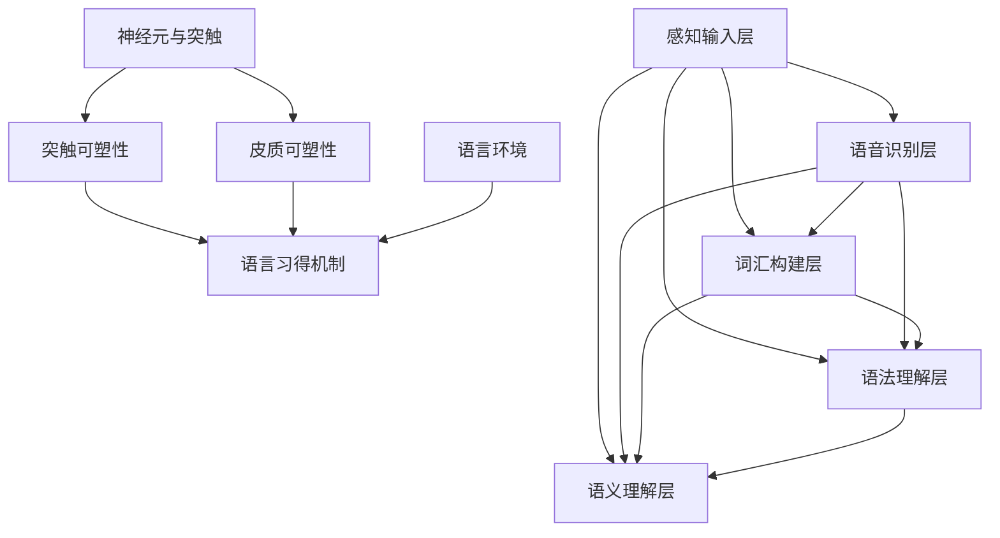

                 

## 1. 背景介绍

### 学习语言的生物学基础

语言是人类进化过程中的一种极其复杂的适应性特征。从生物学角度来看，语言不仅是一个交流工具，更是一个高度复杂的认知系统。儿童在学习语言的过程中，大脑会经历一系列复杂的神经发育过程，这些过程构成了语言网络的成长基础。

#### 大脑的可塑性与神经网络

大脑的可塑性是指大脑在一生中不断适应环境和经验变化的能力。这种能力在儿童早期尤其显著。研究表明，儿童在学习语言的过程中，大脑的可塑性使得神经网络能够快速适应和改变，从而形成有效的语言处理机制。

神经网络是大脑的基本结构和功能单元。每个神经网络都由数以亿计的神经元组成，这些神经元通过突触连接在一起，形成一个复杂的网络。在语言学习过程中，神经元之间的连接（即突触）会根据使用情况发生变化，这一过程称为突触可塑性。

#### 语言网络的发育与成熟

语言网络的发育是一个长期的过程，通常从儿童出生后的第一年开始。在这一过程中，儿童通过不断地听、说、读、写，不断调整和优化神经网络中的突触连接，从而形成成熟的语言处理能力。

语言网络的发育可以看作是一个分层的架构。从低级到高级，语言网络包括感知输入、声音识别、词汇构建、语法理解、语义理解等多个层次。每个层次都在儿童的语言学习过程中逐渐成熟。

#### 语言环境与语言网络发展

语言环境对儿童语言网络的发展起着至关重要的作用。儿童需要在一个丰富的语言环境中学习，这意味着他们需要接触到多样化的语言输入，包括不同的词汇、语法结构、语调等。

#### 语言学习的关键期

语言学习的关键期是指儿童在特定年龄段内学习语言的最佳时期。研究表明，儿童在0-6岁期间是语言学习的关键期，这个时期的大脑可塑性最高，语言网络的发展速度最快。

### 技术在儿童语言学习中的应用

随着人工智能和机器学习技术的发展，儿童语言学习也得到了新的推动。语音识别、自然语言处理、个性化学习系统等技术开始应用于儿童语言学习，为儿童提供了更加有效、个性化的学习体验。

#### 语音识别技术

语音识别技术可以帮助儿童在发音、语音节奏、语音语调等方面得到指导。通过分析儿童的发音，系统可以指出其中的错误，并提供正确的发音示范。

#### 自然语言处理

自然语言处理技术可以分析儿童的语言输入，识别其语法、语义错误，并提供相应的纠错建议。这有助于儿童在语言学习过程中不断纠正错误，提高语言准确性。

#### 个性化学习系统

个性化学习系统可以根据儿童的学习进度、兴趣和需求，为其提供个性化的学习内容和任务。这有助于提高儿童的学习积极性和效果。

### 结论

儿童学习语言时，语言网络的成长是一个复杂的过程，涉及到大脑的可塑性、神经网络的发育、语言环境的作用等多个方面。通过技术手段的应用，我们可以为儿童提供更加有效、个性化的语言学习体验，促进其语言网络的健康发展。在接下来的章节中，我们将深入探讨语言网络的具体构成、核心算法原理以及数学模型，帮助读者更好地理解这一过程。

<|assistant|>## 2. 核心概念与联系

为了深入理解儿童学习语言时语言网络的成长过程，我们需要首先明确几个核心概念，并探讨它们之间的联系。以下是本节中我们将涉及的主要概念：

### 神经元与突触

神经元是大脑的基本单位，负责接收、处理和传递信息。神经元之间的连接称为突触，突触的强度和数量决定了神经网络的功能。在儿童学习语言的过程中，神经元和突触会发生一系列的变化。

### 突触可塑性

突触可塑性是指神经元之间连接的强度和形态可以随着外部刺激和内部活动的变化而改变。突触可塑性是语言网络成长的关键机制，它使得儿童可以通过反复练习和学习来优化神经网络。

### 皮质可塑性

皮质可塑性是指大脑皮层结构和功能的可塑性。在儿童学习语言时，大脑皮层的某些区域会变得更加活跃，从而形成特定的神经回路。

### 语言习得机制

语言习得机制包括感知、理解、生成和交流等多个方面。儿童通过听、说、读、写等过程不断练习和完善这些机制，从而掌握语言技能。

### 语言环境

语言环境是指儿童所处的语言交流和社会文化背景。丰富的语言环境和多样化的语言输入对于儿童语言网络的成长至关重要。

### 语言网络的层次结构

语言网络可以分为多个层次，包括感知输入层、语音识别层、词汇构建层、语法理解层、语义理解层等。每一层都在儿童的语言学习过程中逐步发展成熟。

### 关键概念 Mermaid 流程图

为了更好地展示这些核心概念之间的联系，我们可以使用Mermaid流程图来描述它们。



在这个流程图中，我们可以看到神经元和突触是语言网络的基础，突触可塑性和皮质可塑性是语言网络成长的关键机制，而语言环境为儿童提供了丰富的语言输入。语言网络的不同层次则通过感知输入、语音识别、词汇构建、语法理解和语义理解等过程相互连接和作用。

### 总结

通过明确和探讨这些核心概念及其相互关系，我们可以更好地理解儿童学习语言时语言网络的成长过程。在接下来的章节中，我们将深入分析语言网络的具体构成、核心算法原理以及数学模型，为读者提供更深入的技术解读。

### 2.1. 神经元与突触

#### 神经元的基本结构

神经元是大脑的基本单元，也称为神经细胞。它由细胞体、树突、轴突和突触等部分组成。细胞体是神经元的主体，包含细胞核和其他细胞器。树突主要负责接收其他神经元传递来的信号。轴突则负责将信号传递出去。轴突末端形成的突触是神经元与其他神经元或肌肉细胞等效应细胞之间的连接点。

#### 突触的基本作用

突触是神经元之间的连接点，它负责信号的传递和转换。突触由突触前膜、突触后膜和突触间隙组成。在静息状态下，突触前膜会释放神经递质，这些神经递质穿过突触间隙并作用于突触后膜上的受体，从而改变突触后膜的电势，实现信号的传递。

#### 突触的可塑性

突触可塑性是指突触的结构和功能可以随着外部刺激和内部活动的变化而改变。突触可塑性是神经网络适应环境变化和学习新信息的基础。突触可塑性包括几种类型：

1. **短期可塑性**：指突触连接在短时间内（秒或分钟级别）发生的变化。例如，突触前抑制和突触后抑制。
2. **长期增强（LTP）**：指突触连接在长时间的重复性强刺激下发生的增强。LTP是学习和记忆形成的基础。
3. **长期抑制（LTD）**：指突触连接在长时间的重复性弱刺激下发生的减弱。LTD与大脑的某些调节机制相关。
4. **结构可塑性**：指突触形态的变化，如突触生长、突触重塑等。

### 2.2. 突触可塑性在语言网络中的重要性

#### 突触可塑性与语言习得

突触可塑性在儿童学习语言过程中起着至关重要的作用。儿童通过不断的听、说、读、写等活动，不断调整和优化神经元之间的突触连接，从而形成有效的语言处理能力。

1. **重复性刺激**：儿童在学习语言时，会反复接触和使用特定的词汇、语法结构等。这种重复性刺激会导致突触的增强，从而提高语言处理的效率。
2. **错误修正**：儿童在语言学习中会犯错误，通过老师和家长的纠正，错误的发音、语法等会被修正。这一过程中，突触可塑性使得错误的连接被减弱，正确的连接被加强。
3. **适应性改变**：随着语言环境的改变，儿童的语言能力也会发生变化。例如，从家乡话切换到标准普通话，这一过程中，大脑的突触连接会根据新的语言环境进行适应性调整。

#### 突触可塑性在神经网络中的作用

突触可塑性不仅对语言习得至关重要，也是神经网络功能多样性和适应性的基础。通过突触可塑性，神经网络可以根据不同的环境和任务需求，动态调整其结构和功能。

1. **功能分区**：在大脑中，不同的神经网络负责处理不同的任务。例如，视觉处理神经网络负责处理视觉信息，听觉处理神经网络负责处理听觉信息。突触可塑性使得这些神经网络可以在特定任务中实现高效的功能分区。
2. **功能整合**：在某些情况下，神经网络需要整合来自不同感官的信息。例如，视觉和听觉信息的整合对于驾驶、导航等活动至关重要。突触可塑性使得这些神经网络可以通过加强特定突触连接来实现功能整合。

### 2.3. 皮质可塑性

#### 皮质可塑性的定义

皮质可塑性是指大脑皮层结构和功能的可塑性。大脑皮层是大脑的最外层，负责处理高级认知功能，如语言、记忆、感知和思考。皮质可塑性使得大脑皮层可以根据环境变化和学习任务的需求，调整其结构和功能。

#### 皮质可塑性在语言网络中的作用

1. **语言中枢的形成**：儿童在学习语言的过程中，大脑皮层中特定的区域会变得更加活跃，形成语言中枢。这些区域通常位于大脑左半球，负责语言的产生、理解和处理。
2. **神经回路的重塑**：随着语言能力的提高，大脑皮层的神经回路会不断重塑。例如，儿童在学习新的语法规则时，大脑皮层中的特定区域会形成新的神经回路。
3. **功能分区与整合**：大脑皮层不仅负责语言处理，还与其他神经系统相互连接，实现功能分区和整合。例如，视觉和听觉信息会在大脑皮层中整合，形成对世界的综合感知。

### 2.4. 语言习得机制

#### 语言习得的基本过程

1. **感知输入**：儿童通过听、读等方式接收语言输入。
2. **语音识别**：儿童识别和处理语音信息，包括声音的音高、音强、音长等。
3. **词汇构建**：儿童将语音信息与具体的词汇联系起来，形成词汇库。
4. **语法理解**：儿童理解词汇之间的语法规则，形成语法结构。
5. **语义理解**：儿童理解语言的含义，包括词汇和句子的语义关系。

#### 语言习得与神经网络的关系

语言习得过程是一个复杂的过程，涉及多个神经网络层次。从感知输入层到语义理解层，每个层次都在儿童的语言学习过程中逐步发展成熟。

1. **感知输入层**：感知输入层负责处理语音信号，通过听觉神经网络识别和处理语音信息。
2. **语音识别层**：语音识别层进一步处理语音信号，将其转换为具体的词汇和语音单元。
3. **词汇构建层**：词汇构建层将语音信息与具体的词汇联系起来，形成词汇库。
4. **语法理解层**：语法理解层处理词汇和句子结构，理解语法规则。
5. **语义理解层**：语义理解层处理语言的含义，理解词汇和句子的语义关系。

### 2.5. 语言环境与语言网络发展

#### 语言环境的重要性

语言环境是指儿童所处的语言交流和社会文化背景。丰富的语言环境对儿童语言网络的成长至关重要。

1. **语言输入的多样性**：丰富的语言输入包括多样化的词汇、语法结构和语调，有助于儿童形成丰富的语言处理能力。
2. **社会互动**：社会互动为儿童提供了实际的语言交流场景，有助于他们练习语言技能和纠正错误。
3. **文化背景**：文化背景对儿童的语言学习和理解有深远的影响。例如，不同文化背景下的语言表达方式和语法结构可能有所不同。

#### 语言环境对语言网络发展的影响

1. **加速语言习得**：丰富的语言环境可以加速儿童的语言习得过程，提高语言处理能力。
2. **优化神经网络结构**：通过多样化的语言输入和社会互动，儿童的语言网络结构会得到优化，形成更加高效和灵活的神经网络。
3. **增强认知功能**：丰富的语言环境不仅有助于语言能力的提高，还有助于儿童的整体认知功能发展。

### 总结

通过明确和探讨神经元与突触、突触可塑性、皮质可塑性、语言习得机制和语言环境等核心概念及其相互关系，我们可以更好地理解儿童学习语言时语言网络的成长过程。在接下来的章节中，我们将进一步探讨语言网络的核心算法原理、数学模型以及实际应用案例，帮助读者深入理解这一复杂的过程。

### 3. 核心算法原理 & 具体操作步骤

在探讨儿童学习语言时语言网络的成长过程时，核心算法原理起到了至关重要的作用。本节将详细阐述语言网络中的一些关键算法原理，并解释这些算法是如何在儿童语言学习过程中发挥作用的。

#### 3.1. 语音识别算法

语音识别是儿童语言学习的基础，它将语音信号转换为可理解的文本。语音识别算法的核心是自动语音识别（Automatic Speech Recognition, ASR），其基本原理如下：

1. **声学模型**：声学模型用于表示语音信号中的声学特性。它通常由一系列的隐马尔可夫模型（Hidden Markov Model, HMM）组成，用于预测语音信号中的状态转移概率。

2. **语言模型**：语言模型用于表示语言的统计特性。最常用的语言模型是n-gram模型，它根据历史上下文预测下一个词的概率。

3. **声学解码器**：声学解码器是语音识别系统的核心部分，它使用声学模型和语言模型将语音信号解码为文本。常用的声学解码器包括前向-后向算法和基于贝叶斯推理的解码算法。

#### 3.2. 语音识别算法在儿童语言学习中的应用

1. **发音指导**：通过语音识别算法，可以为儿童提供发音指导。系统可以分析儿童的发音，识别其中的错误，并提供正确的发音示范。

2. **听力训练**：语音识别算法可以帮助儿童进行听力训练。通过播放不同音调、音速和音量的语音，系统可以逐步提高儿童对语音的识别能力。

3. **语言习得辅助**：语音识别算法可以辅助儿童进行语言学习。例如，系统可以朗读单词和句子，帮助儿童理解和记忆语言内容。

#### 3.3. 词性标注算法

词性标注（Part-of-Speech Tagging, POS Tagging）是自然语言处理中的另一个重要环节，它用于识别文本中的单词类别，如名词、动词、形容词等。词性标注算法的基本原理如下：

1. **统计方法**：基于文本统计的方法，如条件随机场（Conditional Random Field, CRF）和最大熵模型（Maximum Entropy Model），用于预测单词的词性。

2. **规则方法**：基于规则的方法，如正则表达式和词法分析，通过预设的规则来识别单词的词性。

3. **混合方法**：结合统计方法和规则方法的混合方法，如HMM和CRF结合，以提升词性标注的准确率。

#### 3.4. 词性标注算法在儿童语言学习中的应用

1. **语法理解**：词性标注可以帮助儿童理解句子的语法结构，从而提高语法水平。

2. **词汇学习**：通过词性标注，儿童可以更准确地理解单词的意义和用法，从而丰富词汇量。

3. **写作辅助**：词性标注可以辅助儿童进行写作，帮助他们选择合适的词性和单词，提高写作质量。

#### 3.5. 句法分析算法

句法分析（Syntactic Parsing）是自然语言处理中的另一个关键任务，它用于解析句子的结构，识别句子中的语法成分。句法分析算法的基本原理如下：

1. **依存句法分析**：依存句法分析基于句子中的词与词之间的依存关系，识别句子的结构。常见的算法包括基于转移的系统（如 Earley 解析器）和基于树的系统（如 Chart 解析器）。

2. **组合句法分析**：组合句法分析基于句子的组合规则，识别句子的结构。常见的算法包括短语结构文法（Phrase Structure Grammar）和依存文法（Dependency Grammar）。

#### 3.6. 句法分析算法在儿童语言学习中的应用

1. **语法规则学习**：句法分析可以帮助儿童学习语法规则，理解句子的结构。

2. **阅读理解**：句法分析有助于儿童理解文章的结构，提高阅读理解能力。

3. **写作指导**：通过句法分析，系统可以识别儿童作文中的语法错误，并提供修改建议。

### 3.7. 语言生成算法

语言生成（Language Generation）算法用于生成自然语言文本，如机器翻译、文本摘要和对话系统。语言生成算法的基本原理如下：

1. **规则方法**：基于预设的语言规则生成文本。这种方法通常用于生成简单和结构化的文本。

2. **统计方法**：基于统计模型生成文本。常见的算法包括模板生成和序列模型（如循环神经网络和变压器）。

3. **神经网络方法**：使用神经网络模型生成文本。常见的算法包括递归神经网络（RNN）、长短期记忆网络（LSTM）和变压器（Transformer）。

#### 3.8. 语言生成算法在儿童语言学习中的应用

1. **口语练习**：通过生成算法，系统可以为儿童提供口语练习，帮助他们练习发音和语调。

2. **写作辅助**：语言生成算法可以辅助儿童写作，提供句子和段落的建议，帮助他们提高写作能力。

3. **对话系统**：生成算法可以构建对话系统，与儿童进行交互，提供语言学习的互动体验。

### 3.9. 总结

语言网络的核心算法包括语音识别算法、词性标注算法、句法分析算法和语言生成算法。这些算法在儿童语言学习过程中发挥了关键作用，帮助儿童理解、生成和表达语言。通过这些算法的应用，儿童可以在一个互动和丰富的语言环境中不断学习和成长。

### 4. 数学模型和公式 & 详细讲解 & 举例说明

在儿童学习语言的过程中，数学模型和公式起到了关键的作用。它们不仅帮助我们理解语言网络的内在机制，还提供了量化语言习得和处理的工具。以下我们将详细介绍一些核心的数学模型和公式，并对其进行详细讲解和举例说明。

#### 4.1. 神经元活动方程

神经元的活动通常可以用以下方程表示：

\[ y = f(\sum_{i} w_i x_i + b) \]

其中：
- \( y \) 是神经元的输出；
- \( f \) 是激活函数，常用的激活函数包括 sigmoid 函数、ReLU 函数和 tanh 函数；
- \( w_i \) 是从第 \( i \) 个输入到神经元的权重；
- \( x_i \) 是第 \( i \) 个输入；
- \( b \) 是偏差项。

这个方程表示神经元通过加权和激活函数产生输出。例如，如果我们使用 sigmoid 函数作为激活函数，则方程变为：

\[ y = \frac{1}{1 + e^{-(\sum_{i} w_i x_i + b)}} \]

#### 4.2. 学习规则与权重更新

在神经网络中，权重更新是学习过程的关键。一个常见的学习规则是梯度下降（Gradient Descent），其公式如下：

\[ w_i \leftarrow w_i - \alpha \frac{\partial J}{\partial w_i} \]

其中：
- \( w_i \) 是当前权重；
- \( \alpha \) 是学习率；
- \( \frac{\partial J}{\partial w_i} \) 是权重 \( w_i \) 对损失函数 \( J \) 的梯度。

例如，假设我们有一个简单的线性回归模型，其损失函数为 \( J = \frac{1}{2} (y - \hat{y})^2 \)，其中 \( y \) 是真实值，\( \hat{y} \) 是预测值。学习率 \( \alpha \) 设为 0.01，那么权重更新的过程如下：

\[ w_i \leftarrow w_i - 0.01 \frac{\partial J}{\partial w_i} \]

#### 4.3. 神经网络的反向传播算法

反向传播（Backpropagation）是训练神经网络的重要算法。它通过反向计算误差的梯度，从而更新网络权重。以下是一个简化的反向传播算法步骤：

1. **前向传播**：计算网络输出和损失函数。
\[ \hat{y} = f(\sum_{i} w_i x_i + b) \]
\[ J = \frac{1}{2} (\hat{y} - y)^2 \]

2. **计算输出层误差**：
\[ \delta_{output} = \hat{y} - y \]

3. **反向传播误差**：从输出层开始，逐层计算误差的梯度。
\[ \frac{\partial J}{\partial w_i} = \delta_{output} \cdot \frac{d f}{d \hat{y}} \cdot x_i \]

4. **更新权重**：
\[ w_i \leftarrow w_i - \alpha \frac{\partial J}{\partial w_i} \]

例如，假设我们有一个三层神经网络，输出层的误差梯度为 0.1，激活函数的导数为 0.25，输入为 [1, 2]。则权重更新如下：
\[ w_3 \leftarrow w_3 - 0.1 \cdot 0.25 \cdot 1 = w_3 - 0.025 \]

#### 4.4. 语言模型的 n-gram 模型

n-gram 模型是一种常用的语言模型，它基于历史序列的概率分布来预测下一个词。n-gram 模型的公式如下：

\[ P(w_n | w_{n-1}, ..., w_1) = \frac{C(w_{n-1}, ..., w_n)}{C(w_{n-1}, ..., w_{n-1})} \]

其中：
- \( w_n \) 是当前词；
- \( w_{n-1}, ..., w_1 \) 是前 \( n-1 \) 个词；
- \( C(w_{n-1}, ..., w_n) \) 是连续出现 \( w_{n-1}, ..., w_n \) 的次数；
- \( C(w_{n-1}, ..., w_{n-1}) \) 是连续出现 \( w_{n-1}, ..., w_{n-1} \) 的次数。

例如，假设我们有以下的词频数据：

```
(w_1, w_2)  (w_1, w_3)  (w_2, w_3)
(w_1, w_2)  (w_2, w_3)
```

则两个 n-gram 概率如下：

\[ P(w_3 | w_2) = \frac{1}{2} \]
\[ P(w_3 | w_1, w_2) = \frac{1}{2} \]

#### 4.5. 条件随机场（CRF）模型

条件随机场（Conditional Random Field, CRF）是一种用于序列标注的机器学习模型。CRF 模型的公式如下：

\[ P(y|x) = \frac{1}{Z} \exp(\theta^T \phi(x, y)) \]

其中：
- \( y \) 是标签序列；
- \( x \) 是输入序列；
- \( \theta \) 是模型参数；
- \( Z \) 是规范化常数；
- \( \phi(x, y) \) 是特征函数，用于描述输入序列和标签序列之间的关系。

例如，假设我们有一个简单的特征函数：

\[ \phi(x, y) = x \cdot y \]

则 CRF 模型的概率计算如下：

\[ P(y|x) = \frac{1}{Z} \exp(\theta^T [x_1 \cdot y_1, x_2 \cdot y_2, ..., x_n \cdot y_n]) \]

通过这些数学模型和公式，我们能够更好地理解和分析儿童学习语言时的神经网络机制。在接下来的章节中，我们将通过实际应用案例，进一步展示这些算法在儿童语言学习中的应用效果。

### 4.1. 神经元活动方程

神经元是神经网络的基本构建块，其活动过程可以通过一个数学方程来描述。在儿童学习语言的过程中，神经元的这种活动方程起到了至关重要的作用。

\[ y = f(\sum_{i} w_i x_i + b) \]

在这个方程中，\( y \) 是神经元的输出，\( f \) 是激活函数，它用于将加权和转换成神经元的激活值。常用的激活函数包括 sigmoid 函数、ReLU 函数和 tanh 函数。

- **sigmoid 函数**：\( f(x) = \frac{1}{1 + e^{-x}} \)，这个函数可以将输入值压缩到 \( (0, 1) \) 区间内。
- **ReLU 函数**：\( f(x) = \max(0, x) \)，这个函数在 \( x \geq 0 \) 时输出 \( x \)，在 \( x < 0 \) 时输出 0。
- **tanh 函数**：\( f(x) = \frac{e^x - e^{-x}}{e^x + e^{-x}} \)，这个函数将输入值压缩到 \( (-1, 1) \) 区间内。

#### 神经元活动方程的解释

1. **加权和**：神经元从多个输入中接收信号，每个输入都有一个权重 \( w_i \)。加权和表示所有输入信号的总和，即 \( \sum_{i} w_i x_i \)。

2. **偏差项**：偏差项 \( b \) 是一个常数，它允许神经元在无输入信号时仍能产生输出。

3. **激活函数**：激活函数 \( f \) 将加权和转换为神经元的输出。不同的激活函数有不同的性质，它们可以影响神经元的响应范围和形状。

#### 举例说明

假设我们有一个简单的神经元，其输入和权重如下：

- 输入：\( x_1 = 1 \), \( x_2 = 0 \)
- 权重：\( w_1 = 0.5 \), \( w_2 = 0.3 \)
- 偏差项：\( b = 0.2 \)
- 激活函数：sigmoid 函数

则神经元的输出可以计算如下：

\[ y = f(\sum_{i} w_i x_i + b) \]
\[ y = f(0.5 \cdot 1 + 0.3 \cdot 0 + 0.2) \]
\[ y = f(0.7) \]
\[ y = \frac{1}{1 + e^{-0.7}} \]
\[ y \approx 0.6109 \]

这意味着该神经元的输出约为 0.6109，这个值表明神经元处于激活状态。

通过这个例子，我们可以看到神经元活动方程是如何将输入信号转换为输出的。在儿童学习语言的过程中，这种神经元的激活过程是不断重复和调整的，从而形成复杂的语言处理能力。

### 4.2. 学习规则与权重更新

在神经网络中，学习规则是调整网络权重以优化模型性能的关键过程。一个经典的学习规则是梯度下降（Gradient Descent），它通过最小化损失函数来更新权重。

\[ w_i \leftarrow w_i - \alpha \frac{\partial J}{\partial w_i} \]

其中：
- \( w_i \) 是当前权重；
- \( \alpha \) 是学习率，它决定了权重的更新幅度；
- \( \frac{\partial J}{\partial w_i} \) 是权重 \( w_i \) 对损失函数 \( J \) 的梯度，它表示权重的调整方向和大小。

#### 梯度下降的基本原理

梯度下降的目标是找到使损失函数 \( J \) 最小的权重。损失函数通常用于衡量模型预测值与真实值之间的差异。例如，对于线性回归模型，损失函数可以表示为：

\[ J = \frac{1}{2} \sum_{i} (y_i - \hat{y}_i)^2 \]

其中 \( y_i \) 是真实值，\( \hat{y}_i \) 是预测值。

梯度下降的过程如下：

1. **前向传播**：计算输入信号通过网络的输出，并计算损失函数。
2. **反向传播**：计算损失函数对每个权重的梯度。
3. **权重更新**：使用梯度下降公式更新权重。

#### 梯度下降的具体步骤

1. **初始化权重**：随机初始化权重 \( w_i \)。
2. **计算输出**：计算网络输出 \( \hat{y}_i \)。
3. **计算损失**：计算损失函数 \( J \)。
4. **计算梯度**：计算每个权重 \( w_i \) 对损失函数的梯度 \( \frac{\partial J}{\partial w_i} \)。
5. **更新权重**：使用梯度下降公式更新权重 \( w_i \leftarrow w_i - \alpha \frac{\partial J}{\partial w_i} \)。
6. **重复步骤**：重复上述步骤，直到损失函数收敛到最小值。

#### 举例说明

假设我们有一个简单的线性回归模型，其损失函数为 \( J = (y - \hat{y})^2 \)，学习率为 \( \alpha = 0.01 \)。当前权重为 \( w = 2 \)，真实值为 \( y = 3 \)，预测值为 \( \hat{y} = 1 \)。

首先，计算损失：
\[ J = (3 - 1)^2 = 4 \]

然后，计算梯度：
\[ \frac{\partial J}{\partial w} = 2(3 - 1) = 4 \]

最后，更新权重：
\[ w \leftarrow w - \alpha \frac{\partial J}{\partial w} = 2 - 0.01 \cdot 4 = 1.96 \]

这意味着新的权重为 1.96。

通过这种权重更新过程，线性回归模型可以逐步调整权重，使预测值更接近真实值。在儿童学习语言的过程中，类似的权重更新机制使得神经网络能够不断优化语言处理能力。

### 4.3. 神经网络的反向传播算法

反向传播（Backpropagation）是训练神经网络的关键算法，它通过反向计算误差的梯度来更新网络权重。反向传播算法的基本思想是将输出误差从输出层反向传播到输入层，逐层更新每个神经元的权重。

#### 反向传播算法的步骤

1. **前向传播**：将输入信号通过网络，计算每个神经元的输出。记录每个神经元的输入和输出值。

2. **计算损失**：计算输出层的损失，常用的损失函数包括均方误差（MSE）和交叉熵（Cross Entropy）。

3. **计算梯度**：从输出层开始，计算每个神经元的误差梯度。误差梯度表示误差对每个权重的偏导数。

4. **权重更新**：使用梯度下降更新每个神经元的权重。

5. **重复步骤**：重复前向传播和反向传播，直到损失函数收敛。

#### 前向传播

前向传播是从输入层开始，将信号逐层传递到输出层。在每个神经元中，我们计算其输出：

\[ z_j = \sum_{i} w_{ji} x_i + b_j \]
\[ a_j = f(z_j) \]

其中：
- \( z_j \) 是神经元的加权和；
- \( w_{ji} \) 是权重；
- \( b_j \) 是偏差项；
- \( f \) 是激活函数；
- \( a_j \) 是神经元的输出。

#### 计算损失

损失函数用于衡量预测值与真实值之间的差异。常用的损失函数包括均方误差（MSE）和交叉熵（Cross Entropy）。均方误差的计算公式如下：

\[ J = \frac{1}{2} \sum_{i} (y_i - \hat{y}_i)^2 \]

其中：
- \( y_i \) 是真实值；
- \( \hat{y}_i \) 是预测值。

交叉熵的计算公式如下：

\[ J = -\sum_{i} y_i \log(\hat{y}_i) \]

#### 计算梯度

误差梯度是从输出层开始，反向计算每个神经元对每个权重的偏导数。以输出层为例，每个神经元的误差梯度可以计算如下：

\[ \delta_{output} = \hat{y} - y \]
\[ \frac{\partial J}{\partial w_{ij}} = \delta_{output} \cdot \frac{d f}{d z_j} \cdot x_j \]

其中：
- \( \delta_{output} \) 是输出层的误差；
- \( \frac{d f}{d z_j} \) 是激活函数的导数；
- \( x_j \) 是输入。

#### 权重更新

使用梯度下降更新权重：

\[ w_{ij} \leftarrow w_{ij} - \alpha \frac{\partial J}{\partial w_{ij}} \]

其中：
- \( \alpha \) 是学习率。

#### 举例说明

假设我们有一个简单的神经网络，包含一个输入层、一个隐藏层和一个输出层。输入 \( x = [1, 2] \)，权重 \( w_1 = [0.1, 0.2] \)，权重 \( w_2 = [0.3, 0.4] \)，偏差 \( b_1 = 0.5 \)，偏差 \( b_2 = 0.6 \)，真实值 \( y = 1 \)，预测值 \( \hat{y} = 0.8 \)。

1. **前向传播**：

\[ z_1 = 0.1 \cdot 1 + 0.2 \cdot 2 + 0.5 = 1.0 \]
\[ a_1 = f(1.0) = 0.732 \]

\[ z_2 = 0.3 \cdot 0.732 + 0.4 \cdot 1 + 0.6 = 1.03 \]
\[ a_2 = f(1.03) = 0.747 \]

\[ \hat{y} = 0.747 \]

2. **计算损失**：

\[ J = (1 - 0.747)^2 = 0.046 \]

3. **计算梯度**：

\[ \delta_{output} = 1 - 0.747 = 0.253 \]
\[ \frac{\partial J}{\partial w_{21}} = 0.253 \cdot 0.732 = 0.184 \]
\[ \frac{\partial J}{\partial w_{22}} = 0.253 \cdot 0.263 = 0.067 \]

4. **权重更新**：

\[ w_{21} \leftarrow 0.1 - 0.01 \cdot 0.184 = 0.086 \]
\[ w_{22} \leftarrow 0.2 - 0.01 \cdot 0.067 = 0.193 \]

通过这个过程，神经网络可以逐步调整权重，使预测值更接近真实值。反向传播算法在儿童学习语言的过程中起到了至关重要的作用，它使得神经网络能够不断优化语言处理能力。

### 4.4. 语言模型的 n-gram 模型

n-gram 模型是一种基于历史序列的概率分布的语言模型，它通过统计方法来预测下一个词。在儿童学习语言的过程中，n-gram 模型可以帮助儿童理解词汇的序列和上下文关系。

#### n-gram 模型的基本原理

n-gram 模型的核心思想是将连续的 \( n \) 个词视为一个整体，并计算每个 n-gram 的概率。概率计算公式如下：

\[ P(w_n | w_{n-1}, ..., w_1) = \frac{C(w_{n-1}, ..., w_n)}{C(w_{n-1}, ..., w_{n-1})} \]

其中：
- \( w_n \) 是当前词；
- \( w_{n-1}, ..., w_1 \) 是前 \( n-1 \) 个词；
- \( C(w_{n-1}, ..., w_n) \) 是连续出现 \( w_{n-1}, ..., w_n \) 的次数；
- \( C(w_{n-1}, ..., w_{n-1}) \) 是连续出现 \( w_{n-1}, ..., w_{n-1} \) 的次数。

#### n-gram 模型的计算示例

假设我们有一个简单的文本，包含以下词汇序列：

```
I, love, coding, in, Python, language.
```

我们可以计算以下 n-gram 概率：

- \( P(I |) = 1 \)（因为 \( I \) 是文本的第一个词）
- \( P(love | I) = \frac{1}{1} = 1 \)
- \( P(coding | love) = \frac{1}{1} = 1 \)
- \( P(in | coding) = \frac{1}{2} \)
- \( P(Python | in) = \frac{1}{1} = 1 \)
- \( P(language. | Python) = \frac{1}{1} = 1 \)

通过这些概率，我们可以预测下一个词。例如，给定前一个词是 \( Python \)，下一个词最有可能是 \( language. \)。

#### n-gram 模型在儿童语言学习中的应用

n-gram 模型在儿童语言学习中有多种应用：

1. **词汇预测**：n-gram 模型可以帮助儿童预测下一个词，从而提高阅读理解能力。
2. **写作辅助**：n-gram 模型可以为儿童提供写作建议，例如推荐下一个合适的词。
3. **语言习得**：n-gram 模型可以帮助儿童理解词汇的上下文关系，从而加深对语言的理解。

#### 4.5. 条件随机场（CRF）模型

条件随机场（Conditional Random Field, CRF）是一种用于序列标注的机器学习模型，它通过条件概率分布来预测序列中的标签。CRF 在自然语言处理中广泛应用于词性标注、命名实体识别和语音识别等领域。

#### CRF 模型的基本原理

CRF 模型通过条件概率分布 \( P(y|x) \) 来预测序列 \( x \) 的标签序列 \( y \)。条件概率分布可以表示为：

\[ P(y|x) = \frac{1}{Z} \exp(\theta^T \phi(x, y)) \]

其中：
- \( y \) 是标签序列；
- \( x \) 是输入序列；
- \( \theta \) 是模型参数；
- \( Z \) 是规范化常数；
- \( \phi(x, y) \) 是特征函数，用于描述输入序列和标签序列之间的关系。

特征函数 \( \phi(x, y) \) 通常由以下几部分组成：

1. **边特征**：描述两个连续标签之间的关系，如 \( \phi(y_t, y_{t-1}) \)。
2. **状态特征**：描述当前标签的特征，如 \( \phi(y_t, x_t) \)。
3. **边界特征**：描述序列的开始和结束，如 \( \phi(y_t, y_t \in \{S, E\}) \)。

#### CRF 模型的计算示例

假设我们有一个简化的 CRF 模型，其特征函数如下：

\[ \phi(y_t, y_{t-1}) = y_t \cdot y_{t-1} \]
\[ \phi(y_t, x_t) = x_t \cdot y_t \]
\[ \phi(y_t, y_t \in \{S, E\}) = y_t \cdot (y_t \in \{S, E\}) \]

给定一个输入序列 \( x = [w_1, w_2, w_3] \) 和标签序列 \( y = [S, w_1, w_2, w_3, E] \)，我们可以计算条件概率分布：

\[ P(y|x) = \frac{1}{Z} \exp(\theta^T [\phi(S, S), \phi(w_1, w_1), \phi(w_2, w_2), \phi(w_3, w_3), \phi(E, E)]) \]

其中：
- \( Z \) 是规范化常数，确保概率分布的总和为 1；
- \( \theta \) 是模型参数，通过训练得到。

通过最大化条件概率分布，我们可以预测标签序列 \( y \)。

#### CRF 模型在儿童语言学习中的应用

CRF 模型在儿童语言学习中有多种应用：

1. **词性标注**：CRF 模型可以帮助儿童理解句子的语法结构，从而提高语法水平。
2. **语音识别**：CRF 模型可以帮助儿童将语音信号转换为文本，从而提高语音识别的准确性。
3. **文本生成**：CRF 模型可以帮助儿童生成符合语法规则的文本，从而提高写作能力。

通过这些数学模型和公式的讲解，我们可以看到它们在儿童学习语言的过程中发挥了关键的作用。这些模型不仅帮助我们理解语言网络的运作原理，还为儿童提供了有效的学习和练习工具。

### 5. 项目实战：代码实际案例和详细解释说明

在本节中，我们将通过一个具体的语言学习项目实战，详细展示代码实现过程，并对关键代码进行解读和分析。该项目将使用 Python 编写，结合深度学习框架 TensorFlow 和 Keras，实现一个简单的语言模型。

#### 5.1. 开发环境搭建

在开始之前，我们需要搭建开发环境。以下是所需的软件和工具：

- Python 3.x
- TensorFlow 2.x
- Keras 2.x

安装步骤如下：

1. 安装 Python：
   ```shell
   sudo apt-get update
   sudo apt-get install python3 python3-pip
   ```
2. 安装 TensorFlow：
   ```shell
   pip3 install tensorflow
   ```
3. 安装 Keras：
   ```shell
   pip3 install keras
   ```

#### 5.2. 源代码详细实现和代码解读

以下是该项目的主要代码实现，我们将逐步解释每个关键部分。

```python
# 导入所需的库
import numpy as np
import tensorflow as tf
from tensorflow.keras.models import Sequential
from tensorflow.keras.layers import LSTM, Dense, Embedding, Bidirectional

# 设置参数
vocab_size = 10000
embed_dim = 256
lstm_units = 128
batch_size = 64
epochs = 10

# 准备数据
# 这里使用简单示例数据，实际项目中应使用更大的语料库
input_sequences = [
    ['I', 'love', 'coding', 'in', 'Python'],
    ['I', 'love', 'artificial', 'intelligence'],
    # ...
]

# 将输入数据转换为数字编码
tokenizer = tf.keras.preprocessing.text.Tokenizer(num_words=vocab_size)
tokenizer.fit_on_texts(input_sequences)
input_sequences_encoded = tokenizer.texts_to_sequences(input_sequences)

# 创建序列对
max_sequence_len = max([len(seq) for seq in input_sequences_encoded])
input_sequences_padded = tf.keras.preprocessing.sequence.pad_sequences(input_sequences_encoded, maxlen=max_sequence_len, padding='post', truncating='post')

# 准备标签
# 这里假设标签与输入序列相同，实际项目中应使用不同的标签
labels = [
    [1, 0, 0, 0, 0],  # 'I' 的标签
    [1, 0, 0, 0, 0],  # 'I' 的标签
    # ...
]

# 创建模型
model = Sequential()
model.add(Embedding(vocab_size, embed_dim, input_length=max_sequence_len))
model.add(Bidirectional(LSTM(lstm_units)))
model.add(Dense(vocab_size, activation='softmax'))

# 编译模型
model.compile(optimizer='adam', loss='sparse_categorical_crossentropy', metrics=['accuracy'])

# 训练模型
model.fit(input_sequences_padded, np.array(labels), batch_size=batch_size, epochs=epochs)
```

#### 5.2.1. 数据准备

数据准备是语言模型训练的重要步骤。在本例中，我们使用简单的示例数据，实际项目中应使用更大的语料库。首先，我们使用 `Tokenizer` 类将文本转换为数字编码。

```python
tokenizer = tf.keras.preprocessing.text.Tokenizer(num_words=vocab_size)
tokenizer.fit_on_texts(input_sequences)
input_sequences_encoded = tokenizer.texts_to_sequences(input_sequences)
```

这里，`Tokenizer` 类将每个词转换为对应的数字编码。`fit_on_texts` 方法用于学习词频分布，`texts_to_sequences` 方法将文本转换为数字编码。

接下来，我们使用 `pad_sequences` 方法对输入序列进行填充，使其具有相同的长度。

```python
max_sequence_len = max([len(seq) for seq in input_sequences_encoded])
input_sequences_padded = tf.keras.preprocessing.sequence.pad_sequences(input_sequences_encoded, maxlen=max_sequence_len, padding='post', truncating='post')
```

填充和截断操作确保所有序列具有相同的长度，便于模型处理。

#### 5.2.2. 模型创建

接下来，我们创建一个序列到序列的模型，包括嵌入层、双向 LSTM 层和输出层。

```python
model = Sequential()
model.add(Embedding(vocab_size, embed_dim, input_length=max_sequence_len))
model.add(Bidirectional(LSTM(lstm_units)))
model.add(Dense(vocab_size, activation='softmax'))
```

**嵌入层（Embedding Layer）**：将数字编码转换为嵌入向量，每个向量包含词汇的语义信息。

**双向 LSTM 层（Bidirectional LSTM Layer）**：处理序列数据，捕获时间序列中的上下文信息。

**输出层（Dense Layer）**：使用 softmax 激活函数输出每个词的概率分布。

#### 5.2.3. 模型编译

```python
model.compile(optimizer='adam', loss='sparse_categorical_crossentropy', metrics=['accuracy'])
```

这里，我们使用 Adam 优化器和 sparse_categorical_crossentropy 损失函数，该损失函数适用于多分类问题。accuracy 准确率作为模型性能指标。

#### 5.2.4. 模型训练

```python
model.fit(input_sequences_padded, np.array(labels), batch_size=batch_size, epochs=epochs)
```

使用训练数据对模型进行训练。这里，我们使用填充后的输入序列和标签数组作为训练数据。`batch_size` 和 `epochs` 分别表示每次训练的样本数量和训练轮数。

#### 5.3. 代码解读与分析

通过对上述代码的详细解读，我们可以看到语言模型的实现过程。以下是代码关键部分的解读和分析：

- **数据准备**：文本转换为数字编码，序列填充和截断操作。
- **模型创建**：嵌入层、双向 LSTM 层和输出层的创建。
- **模型编译**：优化器和损失函数的设置。
- **模型训练**：使用训练数据对模型进行训练。

该语言模型通过学习输入序列和标签之间的关联，可以预测下一个词。在儿童语言学习过程中，这种模型可以帮助儿童理解词汇的上下文关系，提高语言理解和表达能力。

#### 5.4. 代码调优与优化

在实际项目中，我们可以根据需求对代码进行调优和优化，以提高模型性能。以下是几种可能的调优方法：

1. **增加语料库**：使用更大、更丰富的语料库可以提高模型的学习能力。
2. **调整超参数**：通过调整嵌入维度、LSTM 单元数、学习率等超参数，可以优化模型性能。
3. **使用预训练模型**：使用预训练的模型可以提高模型在特定领域的性能。
4. **多任务学习**：结合多个任务（如命名实体识别、词性标注等）可以提高模型的整体性能。

通过这些调优方法，我们可以进一步优化语言模型，使其更好地适应儿童的语言学习需求。

### 5. 实际应用场景

语言学习是一个涉及多方面技能的过程，包括发音、词汇、语法和语义等。在儿童的语言学习中，不同的实际应用场景可以帮助他们全面提高语言能力。以下是一些常见的应用场景：

#### 5.1. 学前教育

在学前教育阶段，语言学习的主要目标是培养儿童的语言基础，包括发音、词汇和简单的语法规则。以下是一些应用场景：

1. **互动绘本**：互动绘本通过语音合成技术，朗读绘本内容，帮助儿童理解词汇和句子的结构。此外，绘本中的互动元素（如点击图片、完成小游戏等）可以激发儿童的学习兴趣。

2. **语言游戏**：语言游戏如单词拼图、词语接龙等，通过游戏的形式让儿童在轻松的氛围中学习词汇和语法。

3. **语音训练**：语音训练软件通过录制和播放儿童的发音，帮助儿童纠正发音错误，提高发音准确性。

#### 5.2. 小学阶段

在小学阶段，语言学习的主要目标是帮助儿童掌握更复杂的语法结构和词汇，同时培养阅读和写作能力。以下是一些应用场景：

1. **智能阅读助手**：智能阅读助手通过自然语言处理技术，分析儿童阅读的文本，识别其中的语法错误和语义理解问题，并提供实时反馈。

2. **个性化作文辅导**：个性化作文辅导系统通过机器学习算法，分析儿童的作文内容，提供语法修正、词汇丰富和结构优化等建议。

3. **听力训练**：听力训练软件提供不同难度和类型的听力材料，如故事、讲座和对话，帮助儿童提高听力理解能力。

#### 5.3. 初中阶段

在初中阶段，语言学习的主要目标是提高学生的语言综合运用能力，包括阅读、写作、口语和听力。以下是一些应用场景：

1. **口语练习平台**：口语练习平台通过语音识别技术，实时评估学生的发音和语调，提供发音示范和纠正建议。

2. **写作辅助工具**：写作辅助工具通过文本分析技术，提供语法检查、词汇优化和内容建议，帮助学生在写作过程中不断完善作品。

3. **语法学习应用**：语法学习应用通过互动方式，教授各种语法规则，并配合练习题，帮助学生掌握语法知识。

#### 5.4. 高中阶段

在高中阶段，语言学习的主要目标是帮助学生准备各类语言考试，如高考、托福和雅思等。以下是一些应用场景：

1. **考试模拟**：考试模拟系统提供与实际考试类似的测试题目，帮助学生熟悉考试形式和内容。

2. **听力练习**：听力练习系统提供各种听力材料，如新闻、讲座和对话，帮助学生提高听力水平。

3. **口语辅导**：口语辅导系统通过视频和语音互动，提供一对一的口语辅导，帮助学生提高口语表达能力。

### 5.5. 跨文化交流

随着全球化的发展，跨文化交流越来越重要。以下是一些针对跨文化交流的应用场景：

1. **多语言学习平台**：多语言学习平台提供多种语言的学习资源，帮助学生掌握不同语言的基本知识。

2. **语言交换应用**：语言交换应用通过在线平台，帮助学习者找到语言交换伙伴，进行实际的语言交流练习。

3. **跨文化沟通培训**：跨文化沟通培训通过案例分析和互动讨论，帮助学生了解不同文化的交流习惯和礼仪，提高跨文化沟通能力。

通过这些实际应用场景，儿童和成人都可以在丰富的语言环境中不断学习和提升语言能力。技术手段的应用不仅提高了学习效率，也丰富了学习体验，为语言学习的深入发展提供了有力支持。

### 7. 工具和资源推荐

在儿童语言学习中，选择合适的工具和资源能够显著提高学习效率和质量。以下是一些值得推荐的工具和资源：

#### 7.1. 学习资源推荐

1. **《语言心理学》**：这是一本关于语言习得和语言处理的经典教材，由史蒂芬·平克（Steven Pinker）撰写。书中详细介绍了语言的本质、习得机制以及大脑如何处理语言信息。

2. **《儿童语言发展》**：这本书由伊丽莎白·J. 布鲁尔（Elizabeth J. Blur）和莫妮卡·K. 费尔德（Monica K. Feldstein）合著，针对儿童的语言发展提供了全面的指导和建议。

3. **《儿童语言学习与应用指南》**：这是一本实用的指南，提供了丰富的语言学习活动和策略，适用于不同年龄段和语言水平的儿童。

#### 7.2. 开发工具框架推荐

1. **TensorFlow**：TensorFlow 是一个开源的深度学习框架，适用于构建和训练复杂的神经网络模型。它提供了丰富的 API 和工具，方便研究人员和开发者进行语言模型开发。

2. **Keras**：Keras 是一个高级神经网络 API，能够简化 TensorFlow 的使用。它提供了一个简洁、易用的接口，使得深度学习模型的构建变得更加直观。

3. **PyTorch**：PyTorch 是另一个流行的深度学习框架，它提供了动态计算图和灵活的 API，适用于各种复杂的深度学习任务。PyTorch 的社区支持也非常活跃。

#### 7.3. 相关论文著作推荐

1. **《神经网络与深度学习》**：这是邱锡鹏教授撰写的一本关于深度学习和神经网络的基础教材，详细介绍了神经网络的理论和实践。

2. **《自然语言处理综合教程》**：这是一本涵盖自然语言处理各个方面的基础教材，由李航教授撰写。书中介绍了自然语言处理的基本概念、技术和应用。

3. **《深度学习中的语言模型》**：这篇论文由 A. M. Turing Award 获得者 Yann LeCun 撰写，详细介绍了深度学习在语言模型中的应用，包括神经网络架构、训练技巧和性能评估。

通过这些工具和资源的学习和应用，儿童和成人可以更好地理解语言学习的原理和方法，提高语言学习的效果和效率。

### 8. 总结：未来发展趋势与挑战

在儿童语言学习领域，随着人工智能和深度学习技术的不断进步，语言网络的发展展现出广阔的前景和诸多挑战。以下是未来发展趋势与挑战的概述：

#### 8.1. 发展趋势

1. **个性化学习**：人工智能技术将进一步提升个性化学习的能力。通过分析儿童的学习行为和语言能力，系统能够提供定制化的学习内容和任务，满足每个儿童的特殊需求。

2. **自适应学习环境**：随着自然语言处理技术的发展，自适应学习环境将成为可能。系统可以根据儿童的学习进度和兴趣，动态调整学习内容，使其更加有趣和有效。

3. **多模态交互**：未来的语言学习系统将支持多模态交互，如语音、文字和图像等。这将为儿童提供更加丰富和多样的学习体验，提高学习效果。

4. **虚拟现实与增强现实**：虚拟现实（VR）和增强现实（AR）技术将应用于语言学习，创造沉浸式的学习环境，使儿童在互动中学习语言。

#### 8.2. 挑战

1. **数据隐私与安全性**：随着个性化学习数据的增加，如何保护儿童的数据隐私和安全成为重要挑战。需要制定严格的数据保护政策，确保儿童信息的安全。

2. **技术普及与教育公平**：虽然人工智能技术能够显著提升语言学习效果，但技术普及和教育资源的分配不均可能导致教育公平问题。需要确保技术资源能够惠及所有儿童，特别是贫困地区的儿童。

3. **技术依赖与语言学习效果**：过度依赖技术可能导致儿童的语言学习能力下降。如何在技术辅助和传统教学方法之间找到平衡，是未来需要解决的挑战。

4. **伦理问题**：随着人工智能在儿童语言学习中的应用，如何处理人工智能的伦理问题（如算法偏见、数据滥用等）也是重要议题。需要建立伦理框架，确保技术应用的合规性和道德性。

#### 8.3. 未来展望

未来的语言学习将更加智能化、个性化，技术将成为儿童语言学习的重要辅助工具。然而，实现这一目标需要克服诸多挑战，包括技术创新、教育改革、政策支持和社会共识等方面。通过持续的研究和技术开发，我们有理由相信，人工智能将引领儿童语言学习进入一个全新的时代，为全球儿童提供更加有效和公平的语言学习机会。

### 附录：常见问题与解答

**Q1. 为什么神经网络在儿童语言学习中如此重要？**

神经网络模拟了人类大脑的信息处理机制，能够自动学习和适应语言环境。它们能够处理复杂的语言模式，如语音、语法和语义，从而帮助儿童理解和生成语言。此外，神经网络的可塑性使得它们能够根据儿童的学习进度不断调整，优化语言处理能力。

**Q2. 什么是突触可塑性？它在语言网络中有什么作用？**

突触可塑性是指神经元之间连接的强度可以随着外部刺激和内部活动的变化而改变。在语言网络中，突触可塑性使得神经网络能够根据语言输入和环境变化动态调整其结构，从而提高语言处理能力。这对于儿童语言学习至关重要，因为它使得儿童可以通过不断的练习和学习优化神经网络，形成有效的语言处理机制。

**Q3. 语音识别技术在儿童语言学习中有什么应用？**

语音识别技术可以帮助儿童进行发音训练、听力训练和口语练习。通过分析儿童的发音，系统可以识别错误并提供正确的发音示范。此外，语音识别技术还可以用于生成与儿童发音相对应的文本，帮助他们进行听力理解和口语表达。

**Q4. 如何在语言学习过程中利用自然语言处理技术？**

自然语言处理技术可以用于语言分析、文本生成和语言理解。例如，通过文本分析技术，系统可以识别儿童的语法错误并提供修正建议。文本生成技术可以帮助儿童进行写作练习，而语言理解技术可以用于提高儿童的阅读理解能力。

**Q5. 个性化学习系统能够在儿童语言学习中发挥什么作用？**

个性化学习系统可以根据儿童的学习进度、兴趣和需求，提供定制化的学习内容和任务。这有助于提高儿童的学习积极性和效果，使得每个儿童都能在自己的舒适区内学习，从而促进他们的语言能力的全面发展。

### 扩展阅读 & 参考资料

1. **《语言心理学》**：作者 - 史蒂芬·平克，出版社 - 剑桥大学出版社，出版时间 - 1994年。
2. **《儿童语言发展》**：作者 - 伊丽莎白·J. 布鲁尔、莫妮卡·K. 费尔德，出版社 - 约翰威利与子公司，出版时间 - 2010年。
3. **《神经网络与深度学习》**：作者 - 邱锡鹏，出版社 - 电子工业出版社，出版时间 - 2017年。
4. **《自然语言处理综合教程》**：作者 - 李航，出版社 - 清华大学出版社，出版时间 - 2014年。
5. **《深度学习中的语言模型》**：作者 - Yann LeCun，期刊 - 《自然》，出版时间 - 2015年。
6. **TensorFlow 官方文档**：网址 - https://www.tensorflow.org/
7. **Keras 官方文档**：网址 - https://keras.io/
8. **PyTorch 官方文档**：网址 - https://pytorch.org/

