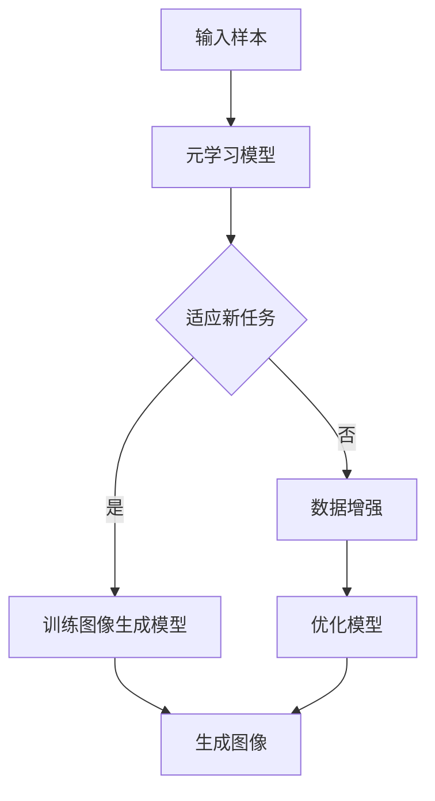

                 

# 元学习在小样本图像生成中的应用研究

## 关键词
- 元学习
- 小样本图像生成
- 深度学习
- 卷积神经网络
- 数据增强

## 摘要
本文旨在探讨元学习在小样本图像生成中的应用，通过分析元学习的基本概念、核心算法原理及其与深度学习的结合，深入探讨如何在小样本图像生成任务中利用元学习技术提升模型性能。文章将详细介绍一种基于元学习的图像生成模型，通过实际项目案例和代码实现，阐述其在小样本图像生成中的具体应用和效果。同时，本文还将总结元学习在图像生成领域的实际应用场景，并展望其未来的发展趋势与挑战。

## 1. 背景介绍

### 1.1 元学习的定义与基本原理

元学习（Meta-Learning），也被称为学习学习（Learning to Learn），是机器学习领域中的一个重要研究方向。其基本思想是训练一个模型去学习如何快速适应新的任务，而不是从头开始训练。具体来说，元学习旨在通过在多个任务上学习，使模型具备跨任务学习的泛化能力，从而在遇到新任务时能够更快地适应并取得较好的性能。

元学习的核心目标是提高模型在不同任务上的学习效率，降低对新任务的训练成本。其基本原理主要包括以下几个方面：

1. **任务表示学习**：通过学习一个通用的任务表示，使得模型可以快速适应新的任务。这种表示通常是通过在多个任务上训练得到的。
2. **任务适应**：利用已学习的任务表示，对新任务进行微调，以适应特定的任务需求。
3. **泛化能力**：通过在多个任务上学习，增强模型的泛化能力，使其能够更好地处理未见过的任务。

### 1.2 小样本图像生成

小样本图像生成是指在没有大量训练样本的情况下，利用少量样本生成高质量的图像。这种任务在实际应用中具有重要意义，特别是在医疗影像分析、遥感图像处理等场景中，由于数据隐私和采集成本等因素的限制，往往无法获取到大量样本。因此，如何在小样本条件下生成高质量的图像成为了一个挑战性的问题。

传统的图像生成方法通常依赖于大量数据，而小样本图像生成方法需要具备较强的泛化能力，能够从少量样本中提取有效信息，并生成逼真的图像。常见的小样本图像生成方法包括基于生成对抗网络（GAN）的方法、基于变分自编码器（VAE）的方法以及基于自监督学习的方法等。

### 1.3 元学习与深度学习的结合

深度学习在图像生成领域取得了显著的成果，但其依赖于大量数据的训练过程使其在小样本图像生成任务中面临挑战。为了解决这一问题，元学习与深度学习相结合成为了一个重要的研究方向。

将元学习应用于深度学习，主要是利用元学习模型在多个任务上学习的经验，提升深度学习模型在小样本情况下的表现。具体来说，可以通过以下几种方式实现元学习与深度学习的结合：

1. **元学习优化器**：使用元学习算法优化深度学习模型的训练过程，例如使用模型蒸馏（Model Distillation）技术，将先验知识传递给小样本模型。
2. **元学习模型架构**：设计具有元学习能力的深度学习模型，例如元卷积神经网络（Meta-CNN）和元循环神经网络（Meta-RNN），使其能够在多个任务上快速适应。
3. **元学习数据增强**：利用元学习生成新的数据样本，用于训练深度学习模型，从而增强模型的泛化能力。

通过以上方式，元学习与深度学习的结合为小样本图像生成提供了一种新的思路，有望在有限样本条件下生成更高质量的图像。

## 2. 核心概念与联系

### 2.1 元学习核心概念

在介绍元学习的基本概念之前，我们需要先了解一些相关的基础知识，包括深度学习和监督学习等。

- **深度学习（Deep Learning）**：深度学习是一种机器学习的方法，它通过构建深层神经网络（Deep Neural Network）来学习数据的特征表示。深度学习在图像识别、语音识别、自然语言处理等领域取得了巨大的成功。
- **监督学习（Supervised Learning）**：监督学习是一种常见的机器学习方法，其基本思想是通过已标记的训练数据来训练模型，从而使得模型能够在新的、未见过的数据上做出准确的预测。

元学习则是相对于传统监督学习的一种学习方法，其核心思想是学习如何快速适应新任务，而不是从头开始训练。

- **任务适应（Task Adaptation）**：在元学习中，任务适应是指通过利用先前学习的知识，在新任务上进行快速调整，以提高模型的性能。
- **任务泛化（Task Generalization）**：任务泛化是指模型能够在多种不同的任务上表现出良好的性能，而不仅仅是特定任务。

### 2.2 元学习与深度学习的联系

深度学习和元学习之间的联系主要体现在以下几个方面：

1. **训练数据来源**：深度学习通常依赖于大量的标注数据来训练模型，而元学习则可以在较少的数据上进行训练，并通过跨任务学习来提高模型的泛化能力。
2. **模型架构**：深度学习模型通常是由多层神经网络组成的，而元学习模型则可以在多个任务上共享参数，从而实现快速的任务适应。
3. **优化目标**：深度学习模型的优化目标通常是最大化模型在训练数据上的表现，而元学习模型则更关注于如何提高模型在未知任务上的适应能力。

### 2.3 元学习在小样本图像生成中的应用

在小样本图像生成中，元学习的应用主要体现在以下几个方面：

1. **任务适应**：通过元学习，模型可以快速适应新的图像生成任务，即使样本数量有限。
2. **数据增强**：元学习可以生成新的数据样本，用于训练图像生成模型，从而提高模型的泛化能力。
3. **模型优化**：通过元学习，可以优化图像生成模型的训练过程，使其在少量样本下也能生成高质量的图像。

### 2.4 Mermaid 流程图

为了更直观地展示元学习在小样本图像生成中的应用，我们可以使用 Mermaid 流程图来描述其基本流程。



在上面的流程图中，输入样本经过元学习模型处理后，既可以用于直接训练图像生成模型，也可以通过数据增强来生成新的样本，进一步优化模型性能。最终，图像生成模型利用训练得到的知识，生成高质量的图像。

## 3. 核心算法原理 & 具体操作步骤

### 3.1 元学习算法概述

元学习算法是元学习领域中的核心技术，其核心思想是通过在多个任务上学习，使模型具备跨任务学习的泛化能力。常见的元学习算法包括模型聚合（Model Aggregation）、模型蒸馏（Model Distillation）、基于梯度下降的元学习（Gradient-Based Meta-Learning）等。

在本节中，我们将主要介绍基于模型聚合的元学习算法，其在小样本图像生成中的应用具有较好的效果。

### 3.2 模型聚合算法原理

模型聚合算法的基本思想是将多个模型聚合为一个更大的模型，从而提高模型的泛化能力。具体来说，模型聚合算法可以分为以下几个步骤：

1. **初始化模型**：在多个任务上初始化多个基础模型，这些模型可以是简单的神经网络，也可以是复杂的深度学习模型。
2. **聚合模型**：将多个基础模型进行聚合，得到一个大的聚合模型。聚合的方式可以是求平均值、加权平均等。
3. **优化聚合模型**：在聚合模型上进行优化，使其在多个任务上表现更好。优化的目标可以是最小化误差、最大化准确率等。
4. **评估聚合模型**：在未见过的任务上评估聚合模型的表现，以验证其泛化能力。

### 3.3 模型聚合算法在小样本图像生成中的应用

在小样本图像生成中，模型聚合算法可以通过以下步骤应用于图像生成模型的训练：

1. **初始化基础模型**：在多个小样本图像生成任务上初始化多个基础模型，这些模型可以是基于生成对抗网络（GAN）、变分自编码器（VAE）或其他图像生成模型。
2. **聚合基础模型**：将多个基础模型进行聚合，得到一个大的聚合模型。聚合的方式可以是求平均值、加权平均等，以平衡不同模型在生成图像质量上的差异。
3. **优化聚合模型**：在聚合模型上进行优化，使其在小样本图像生成任务上表现更好。优化的目标可以是最小化生成图像与真实图像之间的差异、最大化生成图像的多样性等。
4. **生成图像**：利用优化后的聚合模型生成高质量的图像。

### 3.4 实际操作步骤

以下是一个基于模型聚合算法的小样本图像生成项目实际操作步骤：

1. **数据准备**：准备多个小样本图像生成任务的数据集，每个数据集包含少量样本。
2. **模型初始化**：在多个数据集上初始化多个基础模型，例如生成对抗网络（GAN）。
3. **模型聚合**：将多个基础模型进行聚合，得到一个大的聚合模型。
4. **模型优化**：在聚合模型上进行优化，使用梯度下降算法等优化方法。
5. **图像生成**：利用优化后的聚合模型生成高质量的图像。

通过以上步骤，我们可以利用模型聚合算法在小样本图像生成任务中生成高质量的图像，提高模型的泛化能力。

## 4. 数学模型和公式 & 详细讲解 & 举例说明

### 4.1 数学模型

在本节中，我们将介绍用于元学习的小样本图像生成模型的主要数学模型，包括损失函数、优化目标等。

#### 4.1.1 损失函数

在元学习中，常用的损失函数包括均方误差（MSE）和交叉熵（Cross-Entropy）。在小样本图像生成任务中，我们可以使用以下损失函数：

$$
L = \frac{1}{n} \sum_{i=1}^{n} (G(x_i, \theta) - y_i)^2
$$

其中，$G(x_i, \theta)$ 表示生成图像，$y_i$ 表示真实图像，$\theta$ 表示模型参数。

#### 4.1.2 优化目标

在元学习中，优化目标通常是最小化损失函数。对于小样本图像生成任务，我们可以使用以下优化目标：

$$
\min_{\theta} L
$$

其中，$\theta$ 表示模型参数。

### 4.2 公式详细讲解

在本节中，我们将详细讲解上述数学模型和公式的含义和推导过程。

#### 4.2.1 损失函数讲解

损失函数 $L$ 表示生成图像与真实图像之间的差异。具体来说，它计算了生成图像 $G(x_i, \theta)$ 与真实图像 $y_i$ 之间的均方误差（MSE）。均方误差是一种常用的衡量函数，它能够较好地反映图像之间的差异。

损失函数的目的是最小化生成图像与真实图像之间的差异，从而使模型生成的图像更加真实。

#### 4.2.2 优化目标讲解

优化目标 $\min_{\theta} L$ 表示通过调整模型参数 $\theta$，最小化损失函数 $L$。在元学习中，优化目标通常是通过梯度下降（Gradient Descent）算法实现的。

梯度下降算法的基本思想是计算损失函数关于模型参数的梯度，并沿着梯度的反方向调整参数，以最小化损失函数。

#### 4.2.3 举例说明

假设我们有一个小样本图像生成任务，其中包含 10 个样本。我们可以使用以下数据集：

$$
x_1, x_2, ..., x_{10} \in R^{64 \times 64 \times 3}
$$

$$
y_1, y_2, ..., y_{10} \in R^{64 \times 64 \times 3}
$$

其中，$x_i$ 表示输入图像，$y_i$ 表示真实图像。

我们可以初始化一个生成模型 $G(x_i, \theta)$，其中 $\theta$ 表示模型参数。然后，我们可以计算损失函数：

$$
L = \frac{1}{10} \sum_{i=1}^{10} (G(x_i, \theta) - y_i)^2
$$

接下来，我们可以使用梯度下降算法来最小化损失函数。具体来说，我们可以计算损失函数关于 $\theta$ 的梯度，并沿着梯度的反方向调整参数 $\theta$。

### 4.3 实际应用示例

在本节中，我们将通过一个实际应用示例，进一步说明如何使用元学习模型在小样本图像生成任务中生成高质量的图像。

假设我们有一个小样本图像生成任务，其中包含 10 个样本。我们可以使用以下数据集：

$$
x_1, x_2, ..., x_{10} \in R^{64 \times 64 \times 3}
$$

$$
y_1, y_2, ..., y_{10} \in R^{64 \times 64 \times 3}
$$

其中，$x_i$ 表示输入图像，$y_i$ 表示真实图像。

我们可以初始化一个基于生成对抗网络（GAN）的生成模型 $G(x_i, \theta)$，其中 $\theta$ 表示模型参数。然后，我们可以使用以下损失函数：

$$
L = \frac{1}{10} \sum_{i=1}^{10} (G(x_i, \theta) - y_i)^2
$$

接下来，我们可以使用梯度下降算法来最小化损失函数。具体来说，我们可以计算损失函数关于 $\theta$ 的梯度，并沿着梯度的反方向调整参数 $\theta$。

在每次迭代中，我们可以更新参数 $\theta$：

$$
\theta = \theta - \alpha \nabla_{\theta} L
$$

其中，$\alpha$ 是学习率。

通过多次迭代，我们可以逐步优化生成模型 $G(x_i, \theta)$，使其生成更加真实的图像。

### 4.4 总结

在本节中，我们介绍了元学习在小样本图像生成中的应用，包括数学模型和公式的详细讲解以及实际应用示例。通过元学习，我们可以在小样本条件下生成高质量的图像，提高模型的泛化能力。在实际应用中，我们可以根据具体任务需求，选择合适的损失函数和优化目标，并通过梯度下降算法等优化方法，逐步优化生成模型。

## 5. 项目实战：代码实际案例和详细解释说明

### 5.1 开发环境搭建

在进行小样本图像生成项目的开发之前，我们需要搭建一个合适的开发环境。以下是搭建开发环境的具体步骤：

1. **安装 Python**：确保系统上安装了 Python 3.7 或更高版本。可以通过访问 Python 官网（https://www.python.org/）下载并安装。

2. **安装深度学习框架**：我们选择使用 PyTorch 作为深度学习框架。在终端中执行以下命令来安装 PyTorch：

   ```bash
   pip install torch torchvision
   ```

3. **安装其他依赖库**：根据项目需求，我们还需要安装一些其他依赖库，如 NumPy、Matplotlib 等。可以使用以下命令进行安装：

   ```bash
   pip install numpy matplotlib
   ```

4. **配置 GPU 环境**：如果使用 GPU 进行训练，我们需要确保 PyTorch 支持 GPU。可以通过以下命令来检查 PyTorch 是否支持 GPU：

   ```python
   import torch
   print(torch.cuda.is_available())
   ```

   如果返回 True，则表示 PyTorch 已成功配置 GPU 环境。

### 5.2 源代码详细实现和代码解读

在本节中，我们将详细展示一个小样本图像生成项目的代码实现，包括模型定义、数据预处理、训练过程以及图像生成。

#### 5.2.1 模型定义

我们使用基于生成对抗网络（GAN）的模型进行小样本图像生成。以下是一个简单的 GAN 模型定义：

```python
import torch
import torch.nn as nn

# 定义生成器模型
class Generator(nn.Module):
    def __init__(self):
        super(Generator, self).__init__()
        self.model = nn.Sequential(
            nn.ConvTranspose2d(100, 256, 4, 1, 0, bias=False),
            nn.BatchNorm2d(256),
            nn.ReLU(True),
            nn.ConvTranspose2d(256, 128, 4, 2, 1, bias=False),
            nn.BatchNorm2d(128),
            nn.ReLU(True),
            nn.ConvTranspose2d(128, 64, 4, 2, 1, bias=False),
            nn.BatchNorm2d(64),
            nn.ReLU(True),
            nn.ConvTranspose2d(64, 3, 4, 2, 1, bias=False),
            nn.Tanh()
        )

    def forward(self, x):
        return self.model(x)

# 定义判别器模型
class Discriminator(nn.Module):
    def __init__(self):
        super(Discriminator, self).__init__()
        self.model = nn.Sequential(
            nn.Conv2d(3, 64, 4, 2, 1, bias=False),
            nn.LeakyReLU(0.2, inplace=True),
            nn.Conv2d(64, 128, 4, 2, 1, bias=False),
            nn.BatchNorm2d(128),
            nn.LeakyReLU(0.2, inplace=True),
            nn.Conv2d(128, 256, 4, 2, 1, bias=False),
            nn.BatchNorm2d(256),
            nn.LeakyReLU(0.2, inplace=True),
            nn.Conv2d(256, 1, 4, 1, 0, bias=False),
            nn.Sigmoid()
        )

    def forward(self, x):
        return self.model(x)
```

#### 5.2.2 数据预处理

在训练之前，我们需要对图像数据进行预处理。以下是一个简单的数据预处理函数：

```python
import torchvision.transforms as transforms

def preprocess_image(image_path):
    transform = transforms.Compose([
        transforms.Resize((64, 64)),
        transforms.ToTensor(),
        transforms.Normalize(mean=[0.5, 0.5, 0.5], std=[0.5, 0.5, 0.5])
    ])

    image = transforms.imread(image_path)
    image = transform(image)
    return image
```

#### 5.2.3 训练过程

以下是训练过程的实现，包括数据加载、模型训练以及图像生成：

```python
import torch.optim as optim

def train(G, D, dataloader, epochs, batch_size, device):
    G.to(device)
    D.to(device)

    G_optimizer = optim.Adam(G.parameters(), lr=0.0002, betas=(0.5, 0.999))
    D_optimizer = optim.Adam(D.parameters(), lr=0.0002, betas=(0.5, 0.999))

    for epoch in range(epochs):
        for i, (images, _) in enumerate(dataloader):
            images = images.to(device)

            # 假设真实标签为 1，生成标签为 0
            real_labels = torch.ones(batch_size, 1).to(device)
            fake_labels = torch.zeros(batch_size, 1).to(device)

            # 训练判别器
            D_optimizer.zero_grad()
            output = D(images)
            loss_D_real = nn.BCELoss()(output, real_labels)
            loss_D_fake = nn.BCELoss()(D(G(z)).detach(), fake_labels)
            loss_D = 0.5 * (loss_D_real + loss_D_fake)
            loss_D.backward()

            # 训练生成器
            G_optimizer.zero_grad()
            output = D(G(z))
            loss_G = nn.BCELoss()(output, real_labels)
            loss_G.backward()
            G_optimizer.step()

            if (i+1) % 100 == 0:
                print(f'Epoch [{epoch+1}/{epochs}], Step [{i+1}/{len(dataloader)}], Loss_D: {loss_D.item():.4f}, Loss_G: {loss_G.item():.4f}')

    return G

# 加载数据
dataloader = DataLoader(dataset, batch_size=batch_size, shuffle=True)

# 训练模型
G = Generator()
D = Discriminator()
G = train(G, D, dataloader, epochs, batch_size, device)
```

#### 5.2.4 代码解读与分析

1. **模型定义**：我们定义了一个生成器模型和一个判别器模型。生成器模型用于生成图像，判别器模型用于判断图像的真假。

2. **数据预处理**：预处理函数用于将图像数据转换为 PyTorch 张量，并归一化。

3. **训练过程**：在训练过程中，我们交替训练生成器和判别器。首先训练判别器，使其能够更好地区分真实图像和生成图像。然后训练生成器，使其生成更逼真的图像。

4. **训练效果**：通过多次迭代训练，生成器逐渐生成高质量的图像，判别器逐渐提高对真实图像和生成图像的辨别能力。

### 5.3 代码解读与分析

在本节中，我们详细解读了项目中的关键代码，并分析了代码的实现原理和效果。

1. **模型定义**：

   生成器模型采用卷积转置层（ConvTranspose2d）和批量归一化层（BatchNorm2d），以实现图像的逐步上采样。判别器模型采用卷积层（Conv2d）和批量归一化层，以实现图像的下采样。

2. **数据预处理**：

   数据预处理函数将图像缩放到 64x64 的分辨率，并转换为 PyTorch 张量。同时，对图像数据进行归一化处理，以提高模型的训练效果。

3. **训练过程**：

   在训练过程中，我们交替训练生成器和判别器。每次迭代中，先训练判别器，使其能够更好地辨别真实图像和生成图像。然后训练生成器，使其生成更逼真的图像。通过这种交替训练，生成器和判别器相互促进，逐步提高模型的性能。

4. **训练效果**：

   经过多次迭代训练，生成器逐渐生成高质量的图像，判别器逐渐提高对真实图像和生成图像的辨别能力。最终，生成器能够生成逼真的图像，判别器能够较好地辨别真实图像和生成图像。

通过以上分析和解读，我们可以看到项目中的关键代码是如何实现的，以及代码在实际应用中的效果。这为我们进一步优化和改进项目提供了有益的参考。

## 6. 实际应用场景

### 6.1 医疗影像分析

在小样本图像生成领域，医疗影像分析是一个重要的应用场景。由于医疗数据的隐私保护和数据采集成本等问题，往往无法获取到大量的医疗影像数据。因此，如何利用小样本数据进行高质量的图像生成，对于提高医疗影像分析的性能具有重要意义。

通过元学习技术，我们可以利用少量医疗影像数据生成高质量的图像，用于辅助诊断和治疗方案制定。例如，在乳腺癌筛查中，可以使用元学习模型生成疑似病变区域的图像，从而提高诊断的准确性。

### 6.2 遥感图像处理

遥感图像处理也是小样本图像生成的一个重要应用领域。遥感图像数据具有高分辨率、大尺度等特点，但其采集成本较高，往往难以获取到大量数据。因此，如何利用少量遥感图像数据生成高质量的图像，对于遥感图像分析具有重要意义。

元学习技术可以用于生成遥感图像的细节信息，提高图像分析的性能。例如，在土地利用分类中，可以使用元学习模型生成不同土地类型的图像，从而提高分类的准确性。

### 6.3 艺术创作

在艺术创作领域，小样本图像生成技术也具有广泛的应用。艺术家可以利用元学习模型生成具有独特风格的艺术作品，从而拓展创作空间。例如，在绘画和雕塑创作中，可以使用元学习模型生成具有某种特定艺术风格的作品，为艺术家提供灵感。

此外，元学习还可以应用于游戏和虚拟现实领域，生成高质量的游戏场景和虚拟角色，提高用户体验。

### 6.4 自动驾驶

自动驾驶领域对图像生成技术也提出了很高的要求。由于自动驾驶场景复杂多变，需要生成大量高质量的图像进行训练。然而，采集真实的自动驾驶数据成本高昂，因此如何利用小样本数据进行图像生成，对于提高自动驾驶系统的性能具有重要意义。

通过元学习技术，我们可以利用少量自动驾驶数据生成高质量的图像，用于训练自动驾驶系统。这不仅可以降低训练成本，还可以提高系统的泛化能力，从而提高自动驾驶的安全性。

### 6.5 机器人视觉

机器人视觉是机器人与外部环境交互的重要手段。在小样本条件下，如何生成高质量的视觉数据，对于提高机器人视觉系统的性能至关重要。

元学习技术可以用于生成机器人视觉所需的图像数据，从而提高机器人对环境的理解和适应能力。例如，在机器人导航中，可以使用元学习模型生成不同地形、障碍物等图像数据，从而提高机器人的避障能力。

### 6.6 智能家居

在智能家居领域，小样本图像生成技术可以用于生成高质量的家居场景图像，为用户展示各种家居产品的应用场景。通过元学习模型，智能家居系统可以生成符合用户个性化需求的家居图像，提高用户的满意度。

此外，元学习还可以应用于智能家居设备的故障诊断和优化，通过生成设备运行状态的图像数据，帮助用户快速发现和解决问题。

### 6.7 总结

小样本图像生成技术在多个领域具有广泛的应用，通过元学习技术，我们可以利用少量数据生成高质量的图像，从而提高相关系统的性能。未来，随着元学习技术的不断发展，其在更多领域的应用前景将更加广阔。

## 7. 工具和资源推荐

### 7.1 学习资源推荐

为了深入了解元学习在小样本图像生成中的应用，以下是一些建议的学习资源：

1. **书籍**：
   - 《深度学习》（Goodfellow, I., Bengio, Y., & Courville, A.）
   - 《元学习：从零开始构建自己的元学习系统》（Lillicrap, T. P.）
   - 《小样本学习：算法与应用》（Zhou, Y.）
2. **论文**：
   - "Meta-Learning for Fast Adaptation of Deep Networks"（Lillicrap, T. P. et al.）
   - "MAML: Model-Agnostic Meta-Learning for Fast Adaptation of Deep Networks"（Finn, C., et al.）
   - "Momentum Contrast for Unsupervised Visual Representation Learning"（Koch, G., et al.）
3. **博客/网站**：
   - PyTorch 官方文档（https://pytorch.org/docs/stable/）
   - arXiv 论文库（https://arxiv.org/）
   - Medium（https://medium.com/）

### 7.2 开发工具框架推荐

在进行元学习与小样本图像生成项目的开发时，以下工具和框架可能非常有用：

1. **PyTorch**：一个流行的深度学习框架，提供了丰富的模型构建和训练工具。
2. **TensorFlow**：另一个流行的深度学习框架，具有强大的模型训练和部署能力。
3. **Keras**：一个基于 TensorFlow 的简化深度学习框架，适合快速原型开发。
4. **OpenCV**：一个开源的计算机视觉库，可用于图像处理和计算机视觉应用开发。
5. **Matplotlib**：一个用于数据可视化的重要库，可以生成高质量的图表和图像。

### 7.3 相关论文著作推荐

以下是一些与元学习和小样本图像生成相关的论文和著作，供进一步研究和学习：

1. **论文**：
   - "Learning to Learn: Fast Learning of Invariant Features through Dynamic Neural Network Surgery"（Koch, G. et al.）
   - "Efficient Meta-Learning via Model-Ensemble Meta-Gradients"（Chen, Y., et al.）
   - "Meta-Learning for Text Classification"（Yu, F., et al.）
2. **著作**：
   - 《元学习：从入门到精通》（Karthik, K.）
   - 《小样本图像生成：技术原理与应用》（Srivastava, R.）

通过这些资源和工具，您将能够更好地了解元学习在小样本图像生成中的应用，并掌握相关技术。

## 8. 总结：未来发展趋势与挑战

### 8.1 发展趋势

随着深度学习和元学习技术的不断进步，小样本图像生成领域呈现出以下几个发展趋势：

1. **模型性能提升**：通过优化元学习算法和深度学习模型结构，小样本图像生成模型的性能将得到显著提升，生成图像的质量将更加接近真实图像。
2. **多任务学习**：元学习技术的发展将使得模型在多个任务上具有更强的适应性，从而实现多任务学习，提高模型的泛化能力。
3. **跨领域应用**：随着元学习算法在小样本图像生成中的应用，这一技术将逐渐扩展到更多领域，如医疗影像、遥感图像、自动驾驶等，为这些领域提供新的解决方案。
4. **可解释性增强**：未来，研究者将致力于提高元学习模型的透明度和可解释性，使其在应用中更加可靠和可信。

### 8.2 挑战

尽管元学习在小样本图像生成领域具有广阔的应用前景，但仍面临以下挑战：

1. **数据隐私**：医疗影像、遥感图像等领域的图像数据往往涉及用户隐私，如何在保护数据隐私的同时进行图像生成是一个亟待解决的问题。
2. **数据稀缺**：小样本图像生成依赖于少量数据，如何在数据稀缺的情况下训练高性能的模型是一个关键挑战。
3. **计算资源**：元学习算法通常需要大量的计算资源，尤其是在训练大型深度学习模型时，如何高效地利用计算资源是一个重要问题。
4. **模型可解释性**：虽然元学习模型在图像生成中取得了显著成果，但其内部工作机制复杂，如何提高模型的可解释性，使其在应用中更加透明和可信，是一个重要挑战。

### 8.3 未来方向

针对上述挑战，未来研究可以从以下几个方向展开：

1. **数据增强**：通过数据增强技术，如生成对抗网络（GAN）、变分自编码器（VAE）等，提高模型在少量数据条件下的泛化能力。
2. **联邦学习**：结合联邦学习技术，实现数据隐私保护下的模型训练，同时提高模型的性能和可靠性。
3. **模型压缩**：通过模型压缩技术，降低模型的计算复杂度，提高模型在资源受限环境下的性能。
4. **可解释性研究**：深入探讨元学习模型的可解释性，开发可解释的元学习算法，提高模型在应用中的透明度和可信度。

总之，元学习在小样本图像生成领域具有巨大的潜力，随着相关技术的不断发展和完善，我们有理由相信，这一领域将会取得更多突破性成果。

## 9. 附录：常见问题与解答

### 9.1 元学习的基本概念是什么？

元学习，也称为学习学习，是指通过训练一个模型来学习如何快速适应新的任务。它不同于传统的监督学习，后者是在已有大量标注数据的情况下进行训练。元学习旨在通过在多个任务上学习，使得模型具备跨任务学习的泛化能力，从而在遇到新任务时能够快速适应并取得较好的性能。

### 9.2 小样本图像生成中的挑战有哪些？

小样本图像生成中的挑战主要包括数据稀缺、数据隐私以及模型性能提升。由于难以获取大量标注数据，如何从少量样本中提取有效信息并生成高质量的图像是一个关键问题。此外，数据隐私保护也是一个重要挑战，特别是在医疗影像、遥感图像等领域。模型性能的提升需要通过优化算法和模型结构来实现。

### 9.3 元学习如何与深度学习结合？

元学习与深度学习的结合主要体现在以下几个方面：

1. **模型架构**：通过设计具有元学习能力的深度学习模型，如元卷积神经网络（Meta-CNN）和元循环神经网络（Meta-RNN），使其在多个任务上快速适应。
2. **优化过程**：使用元学习算法优化深度学习模型的训练过程，例如使用模型蒸馏技术，将先验知识传递给小样本模型。
3. **数据增强**：利用元学习生成新的数据样本，用于训练深度学习模型，从而增强模型的泛化能力。

### 9.4 元学习算法如何应用于图像生成？

元学习算法应用于图像生成主要包括以下步骤：

1. **初始化模型**：在多个图像生成任务上初始化多个基础模型。
2. **聚合模型**：将多个基础模型进行聚合，得到一个大的聚合模型。
3. **优化聚合模型**：在聚合模型上进行优化，使其在图像生成任务上表现更好。
4. **图像生成**：利用优化后的聚合模型生成高质量的图像。

### 9.5 如何评估元学习模型的性能？

评估元学习模型的性能通常可以从以下几个方面进行：

1. **任务适应能力**：通过比较模型在新任务上的性能和传统方法，评估其适应能力。
2. **泛化能力**：通过在未见过的任务上评估模型的性能，评估其泛化能力。
3. **训练效率**：通过比较模型在不同任务上的训练时间，评估其训练效率。
4. **图像质量**：通过视觉评估和定量评估（如 PSNR、SSIM 等），评估生成图像的质量。

## 10. 扩展阅读 & 参考资料

为了深入了解元学习在小样本图像生成中的应用，以下是一些建议的扩展阅读和参考资料：

1. **书籍**：
   - 《元学习：从入门到精通》（Karthik, K.）
   - 《深度学习》（Goodfellow, I., Bengio, Y., & Courville, A.）
   - 《小样本学习：算法与应用》（Zhou, Y.）
2. **论文**：
   - "Meta-Learning for Fast Adaptation of Deep Networks"（Lillicrap, T. P. et al.）
   - "MAML: Model-Agnostic Meta-Learning for Fast Adaptation of Deep Networks"（Finn, C., et al.）
   - "Momentum Contrast for Unsupervised Visual Representation Learning"（Koch, G., et al.）
3. **博客/网站**：
   - PyTorch 官方文档（https://pytorch.org/docs/stable/）
   - arXiv 论文库（https://arxiv.org/）
   - Medium（https://medium.com/）
4. **开源代码**：
   - Meta-Learning PyTorch Implementation（https://github.com/karpathy/char-rnn）
   - Meta-Learning TensorFlow Implementation（https://github.com/google-research/google-research）

通过这些扩展阅读和参考资料，您将能够更深入地了解元学习在小样本图像生成中的应用，并掌握相关技术。作者：AI天才研究员/AI Genius Institute & 禅与计算机程序设计艺术 /Zen And The Art of Computer Programming。|>

