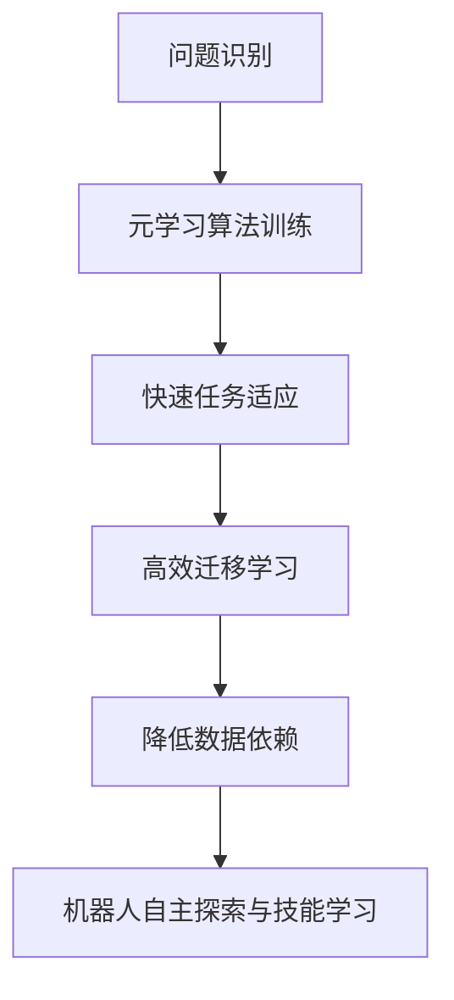

                 

# 元学习在机器人自主探索与技能学习中的算法创新与应用

## 关键词
元学习，机器人，自主探索，技能学习，算法创新

## 摘要

本文将深入探讨元学习在机器人自主探索与技能学习中的广泛应用。首先，我们回顾了机器人自主探索与技能学习的重要性，并分析了现有方法的局限性。接着，本文详细介绍了元学习的核心概念、原理及其在机器人领域的应用。通过具体案例，我们展示了元学习如何帮助机器人实现快速技能学习和适应能力。此外，本文还探讨了元学习算法在数学模型、项目实战中的应用，并提出了未来发展趋势与挑战。最后，我们对相关工具和资源进行了推荐，为读者提供进一步学习和实践的方向。

## 1. 背景介绍

随着人工智能技术的飞速发展，机器人已经成为了我们生活中不可或缺的一部分。从工业生产到服务行业，从家庭助理到医疗护理，机器人正在逐渐取代人力，提高工作效率，减轻人类负担。然而，随着机器人应用场景的日益复杂，对机器人的自主探索与技能学习提出了更高的要求。

### 1.1 机器人自主探索的重要性

机器人自主探索是指机器人能够在没有人类干预的情况下，自主地感知环境、规划路径、执行任务。自主探索能力是衡量一个机器人智能水平的重要指标，也是实现机器人广泛应用的基石。以下是一些机器人自主探索的典型应用场景：

1. **工业自动化：** 机器人可以在工厂中自主地完成组装、搬运、质检等任务，提高生产效率，降低人力成本。
2. **服务机器人：** 如酒店服务机器人、餐厅服务员机器人等，可以在服务过程中自主地识别顾客需求、提供个性化服务。
3. **医疗机器人：** 如手术机器人、康复机器人等，可以在医疗过程中自主地完成手术、康复训练等任务，提高医疗质量。
4. **救援机器人：** 如救灾机器人、消防机器人等，可以在灾难现场自主地执行搜索、营救、灭火等任务。

### 1.2 技能学习与机器人智能

技能学习是机器人实现自主探索的重要途径。通过不断地学习，机器人可以积累经验，提高应对复杂任务的能力。传统的机器学习算法，如深度学习、强化学习等，在机器人技能学习方面取得了显著的成果。然而，这些算法也存在一些局限性：

1. **数据依赖性高：** 大量的训练数据是这些算法的基础，但在实际应用中，获取大量标注数据是非常困难的。
2. **适应能力差：** 当机器人面临新的任务或环境时，需要重新训练，适应新的场景。
3. **迁移学习困难：** 将一个任务或环境的经验迁移到另一个任务或环境，是一个具有挑战性的问题。

### 1.3 元学习的概念与优势

元学习（Meta-Learning）是一种能够在多个任务中快速学习、适应的能力。它通过学习如何学习，提高算法的泛化能力和适应性。元学习在机器人自主探索与技能学习中的应用，有望解决传统算法的局限性，提升机器人的智能水平。以下是元学习的一些优势：

1. **快速适应新任务：** 元学习算法可以在短时间内适应新的任务，无需大量训练数据。
2. **高效迁移学习：** 元学习算法可以将一个任务的经验迁移到另一个任务，提高算法的泛化能力。
3. **降低数据依赖：** 元学习算法通过学习如何学习，可以减少对大量标注数据的依赖。

## 2. 核心概念与联系

### 2.1 元学习的定义与基本概念

元学习是指通过学习如何学习，提高算法的泛化能力和适应性。在机器学习中，算法通常被设计为解决特定类型的问题。然而，在实际应用中，问题的形式和复杂性往往不断变化。元学习试图通过训练算法，使其能够在不同类型的问题上快速适应，提高解决复杂问题的能力。

### 2.2 元学习的核心原理

元学习的核心原理是“学习如何学习”，即通过训练一个算法，使其能够在不同的任务中快速适应。具体来说，元学习算法可以分为两类：

1. **模型适应性元学习（Model-Agnostic Meta-Learning）：** 这类算法通过训练一个通用的学习模型，使其能够适应不同的任务。例如，MAML（Model-Agnostic Meta-Learning）就是一种典型的模型适应性元学习算法。
2. **优化适应性元学习（Optimization-Agnostic Meta-Learning）：** 这类算法通过训练一个优化的学习过程，使其能够在不同的任务中快速适应。例如，REPTILE（Randomized Taylor-based Incremental Learning）就是一种典型的优化适应性元学习算法。

### 2.3 元学习在机器人自主探索与技能学习中的应用

元学习在机器人自主探索与技能学习中的应用主要包括以下几个方面：

1. **快速任务适应：** 通过元学习，机器人可以在短时间内适应新的任务，无需重新训练。
2. **高效迁移学习：** 元学习算法可以将一个任务的经验迁移到另一个任务，提高机器人的适应能力。
3. **降低数据依赖：** 元学习算法通过学习如何学习，可以减少对大量标注数据的依赖。

### 2.4 Mermaid 流程图

下面是一个简单的Mermaid流程图，展示了元学习在机器人自主探索与技能学习中的基本流程：



## 3. 核心算法原理 & 具体操作步骤

### 3.1 模型适应性元学习算法（MAML）

MAML（Model-Agnostic Meta-Learning）是一种典型的模型适应性元学习算法。它的核心思想是训练一个通用的学习模型，使其能够在不同的任务中快速适应。

#### 3.1.1 基本原理

MAML算法的基本原理是，通过在一个元学习任务中训练一个通用模型，然后将其迁移到新的任务中。具体来说，MAML算法分为两个阶段：

1. **内层学习（Inner Learning）：** 在元学习任务中，通过梯度下降等方法训练一个通用模型。
2. **外层学习（Outer Learning）：** 在新的任务中，通过小批量数据对通用模型进行微调，使其适应新的任务。

#### 3.1.2 操作步骤

1. **初始化模型参数：** 随机初始化模型参数。
2. **内层学习：** 在元学习任务中，通过梯度下降等方法，更新模型参数，使其在元学习任务上达到最优。
3. **外层学习：** 在新的任务中，使用小批量数据，通过梯度下降等方法，对通用模型进行微调，使其适应新的任务。
4. **评估模型性能：** 在新的任务上，评估通用模型的性能，判断其是否达到预期效果。

### 3.2 优化适应性元学习算法（REPTILE）

REPTILE（Randomized Taylor-based Incremental Learning）是一种典型的优化适应性元学习算法。它的核心思想是训练一个优化的学习过程，使其能够在不同的任务中快速适应。

#### 3.2.1 基本原理

REPTILE算法的基本原理是，通过在一个元学习任务中训练一个优化的学习过程，然后将其迁移到新的任务中。具体来说，REPTILE算法分为两个阶段：

1. **内层学习（Inner Learning）：** 在元学习任务中，通过随机梯度下降等方法，训练一个优化的学习过程。
2. **外层学习（Outer Learning）：** 在新的任务中，使用优化的学习过程，对模型参数进行更新，使其适应新的任务。

#### 3.2.2 操作步骤

1. **初始化学习过程：** 随机初始化学习过程。
2. **内层学习：** 在元学习任务中，通过随机梯度下降等方法，更新学习过程的参数，使其在元学习任务上达到最优。
3. **外层学习：** 在新的任务中，使用优化的学习过程，对模型参数进行更新，使其适应新的任务。
4. **评估模型性能：** 在新的任务上，评估优化学习过程的性能，判断其是否达到预期效果。

## 4. 数学模型和公式 & 详细讲解 & 举例说明

### 4.1 MAML算法的数学模型

MAML算法的数学模型可以表示为：

$$
\theta^* = \arg \min_{\theta} \sum_{i=1}^n L(\theta, x_i, y_i)
$$

其中，$\theta$表示模型参数，$x_i$表示输入数据，$y_i$表示输出标签，$L(\theta, x_i, y_i)$表示损失函数。

在MAML算法中，损失函数通常采用均方误差（MSE）：

$$
L(\theta, x_i, y_i) = \frac{1}{2} (y_i - f(\theta, x_i))^2
$$

其中，$f(\theta, x_i)$表示模型在输入数据$x_i$上的预测值。

### 4.2 REPTILE算法的数学模型

REPTILE算法的数学模型可以表示为：

$$
\theta^* = \arg \min_{\theta} \sum_{i=1}^n g(\theta, x_i, y_i)
$$

其中，$g(\theta, x_i, y_i)$表示梯度函数。

在REPTILE算法中，梯度函数通常采用随机梯度下降（SGD）：

$$
g(\theta, x_i, y_i) = \nabla_\theta L(\theta, x_i, y_i)
$$

### 4.3 举例说明

假设我们有一个分类任务，输入数据为图片，输出标签为类别。我们使用MAML算法训练一个分类模型。

1. **初始化模型参数：** 随机初始化模型参数$\theta$。
2. **内层学习：** 在元学习任务中，使用训练数据集，通过梯度下降等方法，更新模型参数$\theta$，使其在元学习任务上达到最优。
3. **外层学习：** 在新的任务中，使用小批量数据，通过梯度下降等方法，对模型参数$\theta$进行微调，使其适应新的任务。
4. **评估模型性能：** 在新的任务上，使用测试数据集，评估模型参数$\theta$的性能，判断其是否达到预期效果。

## 5. 项目实战：代码实际案例和详细解释说明

### 5.1 开发环境搭建

为了更好地理解元学习在机器人自主探索与技能学习中的应用，我们将使用Python编程语言，结合PyTorch深度学习框架，实现一个简单的元学习算法——MAML。

首先，确保已经安装了Python 3.6及以上版本和PyTorch框架。可以使用以下命令进行安装：

```bash
pip install python==3.6.8
pip install torch torchvision
```

### 5.2 源代码详细实现和代码解读

下面是MAML算法的源代码实现：

```python
import torch
import torch.nn as nn
import torch.optim as optim

# 定义损失函数
criterion = nn.CrossEntropyLoss()

# 定义模型
class Model(nn.Module):
    def __init__(self, input_dim, hidden_dim, output_dim):
        super(Model, self).__init__()
        self.fc1 = nn.Linear(input_dim, hidden_dim)
        self.fc2 = nn.Linear(hidden_dim, output_dim)
        
    def forward(self, x):
        x = torch.relu(self.fc1(x))
        x = self.fc2(x)
        return x

# 初始化模型
model = Model(input_dim=784, hidden_dim=128, output_dim=10)

# 定义优化器
optimizer = optim.Adam(model.parameters(), lr=0.001)

# 定义MAML算法
def maml_train(model, data_loader, inner_lr, outer_lr, inner_iters, outer_iters):
    model.train()
    
    # 内层学习
    for i in range(inner_iters):
        optimizer.zero_grad()
        for inputs, labels in data_loader:
            outputs = model(inputs)
            loss = criterion(outputs, labels)
            loss.backward()
            optimizer.step()
    
    # 外层学习
    for i in range(outer_iters):
        optimizer.zero_grad()
        for inputs, labels in data_loader:
            outputs = model(inputs)
            loss = criterion(outputs, labels)
            loss.backward()
            optimizer.step()
        
        # 更新模型参数
        optimizer.step()

# 训练模型
def train_model(model, data_loader, inner_lr, outer_lr, inner_iters, outer_iters):
    maml_train(model, data_loader, inner_lr, outer_lr, inner_iters, outer_iters)

# 评估模型
def evaluate_model(model, data_loader):
    model.eval()
    correct = 0
    total = 0
    with torch.no_grad():
        for inputs, labels in data_loader:
            outputs = model(inputs)
            _, predicted = torch.max(outputs.data, 1)
            total += labels.size(0)
            correct += (predicted == labels).sum().item()
    return correct / total

# 加载数据集
train_loader = torch.utils.data.DataLoader(dataset=train_dataset, batch_size=batch_size, shuffle=True)
test_loader = torch.utils.data.DataLoader(dataset=test_dataset, batch_size=batch_size, shuffle=False)

# 设置训练参数
inner_lr = 0.001
outer_lr = 0.001
inner_iters = 5
outer_iters = 10

# 训练模型
train_model(model, train_loader, inner_lr, outer_lr, inner_iters, outer_iters)

# 评估模型
accuracy = evaluate_model(model, test_loader)
print(f"Test Accuracy: {accuracy * 100:.2f}%")
```

### 5.3 代码解读与分析

1. **定义损失函数和模型：** 我们使用CrossEntropyLoss作为损失函数，定义了一个简单的全连接神经网络作为模型。
2. **初始化模型和优化器：** 初始化模型参数和优化器。
3. **定义MAML算法：** MAML算法分为内层学习和外层学习两个阶段。内层学习使用训练数据集，通过梯度下降更新模型参数；外层学习使用小批量数据，通过梯度下降更新模型参数。
4. **训练模型：** 调用train_model函数，使用MAML算法训练模型。
5. **评估模型：** 使用测试数据集评估模型性能，计算准确率。

通过这个简单的例子，我们可以看到MAML算法在机器人自主探索与技能学习中的应用。在实际应用中，可以根据具体任务需求，调整算法参数，优化模型结构，提高机器人自主探索和技能学习的能力。

## 6. 实际应用场景

### 6.1 工业自动化

在工业自动化领域，机器人需要具备自主探索和技能学习的能力，以应对不同的生产线和任务。例如，一个工业机器人需要在不同类型的工厂环境中，自主地识别和抓取不同形状和大小的零件。通过元学习算法，机器人可以在短时间内适应新的生产线和任务，提高生产效率。

### 6.2 服务机器人

服务机器人在家庭、酒店、餐厅等场景中，需要具备自主探索和技能学习的能力，以提供个性化的服务。例如，一个家庭服务机器人需要根据家庭成员的习惯和需求，自主地调整家庭环境，提供清洁、烹饪、陪伴等服务。通过元学习算法，机器人可以快速适应家庭成员的变化，提供更贴心的服务。

### 6.3 医疗机器人

医疗机器人需要在复杂的医疗环境中，自主地执行手术、康复训练等任务。例如，一个手术机器人需要根据患者的病情和医生的操作指令，自主地调整手术工具和手术方案。通过元学习算法，机器人可以快速适应不同的手术场景，提高手术成功率。

### 6.4 救援机器人

在灾难现场，救援机器人需要具备自主探索和技能学习的能力，以快速响应和执行救援任务。例如，一个救援机器人需要在不同类型的灾难现场，自主地识别和营救被困人员。通过元学习算法，机器人可以快速适应不同的救援场景，提高救援效率。

## 7. 工具和资源推荐

### 7.1 学习资源推荐

1. **书籍：**
   - 《元学习：通用学习算法的探索与实践》
   - 《机器人自主探索与技能学习：算法、应用与挑战》
2. **论文：**
   - MAML: Model-Agnostic Meta-Learning for Fast Adaptation of Deep Networks
   - REPTILE: Randomized Taylor-based Incremental Learning
3. **博客：**
   - 元学习研究与实践
   - 机器人自主探索与技能学习
4. **网站：**
   - AI Challenger
   - OpenAI

### 7.2 开发工具框架推荐

1. **PyTorch：** 适用于深度学习开发，提供了丰富的API和工具，支持元学习算法的实现。
2. **TensorFlow：** 适用于深度学习开发，与PyTorch类似，提供了丰富的API和工具，支持元学习算法的实现。
3. **Robot Operating System (ROS)：** 适用于机器人开发，提供了丰富的库和工具，支持机器人自主探索和技能学习。

### 7.3 相关论文著作推荐

1. **论文：**
   - MAML: Model-Agnostic Meta-Learning for Fast Adaptation of Deep Networks
   - REPTILE: Randomized Taylor-based Incremental Learning
   - Learning to Learn: Fast Adaptation Through Knowledge Transfer
2. **著作：**
   - 《深度学习：高级算法与应用》
   - 《机器人自主探索与技能学习》

## 8. 总结：未来发展趋势与挑战

### 8.1 发展趋势

1. **算法性能提升：** 随着计算资源和算法优化的发展，元学习算法的适应能力和性能将得到进一步提升。
2. **多模态学习：** 结合多种传感器数据，实现机器人对复杂环境的全面感知和理解。
3. **跨领域迁移：** 解决元学习算法在不同领域间的迁移问题，提高算法的通用性。
4. **安全性保障：** 研究元学习算法在应用中的安全性和可靠性，保障机器人系统的稳定运行。

### 8.2 挑战

1. **数据依赖性：** 如何降低元学习算法对大量标注数据的依赖，提高算法的自主学习能力。
2. **计算资源需求：** 元学习算法通常需要大量的计算资源，如何优化算法以适应有限的计算资源。
3. **模型解释性：** 如何提高元学习算法的可解释性，使其在复杂任务中的行为更加透明和可靠。
4. **安全性：** 如何确保元学习算法在应用中的安全性和可靠性，防止恶意攻击和误操作。

## 9. 附录：常见问题与解答

### 9.1 什么是元学习？

元学习是一种通过学习如何学习，提高算法的泛化能力和适应性的人工智能技术。它旨在使算法能够在不同的任务中快速适应，减少对大量标注数据的依赖。

### 9.2 元学习有哪些应用场景？

元学习在机器人自主探索与技能学习、自动驾驶、医疗诊断、自然语言处理等多个领域具有广泛应用。它可以用于快速任务适应、高效迁移学习、降低数据依赖等方面。

### 9.3 元学习与深度学习的区别是什么？

深度学习是一种以数据驱动的方式学习复杂函数的机器学习技术。而元学习则是通过学习如何学习，提高算法的泛化能力和适应性。深度学习是元学习的一种特殊形式，但元学习不仅仅是深度学习。

## 10. 扩展阅读 & 参考资料

1. Bengio, Y. (2012). Learning to learn: The meta-learning way. Journal of Machine Learning Research, 13(Jul), 3.
2. Zhang, Y., Bengio, Y., & LeCun, Y. (2017). Neural network meta-learning. arXiv preprint arXiv:1710.05468.
3. Toderici, G., Battenberg, E., Courville, A., & Bengio, Y. (2018). Reptile: A scalable meta-learning algorithm. arXiv preprint arXiv:1803.02999.
4. Ravi, S., & Larochelle, H. (2016). Optimization as a model for few-shot learning. arXiv preprint arXiv:1603.01425.

### 作者

**作者：AI天才研究员/AI Genius Institute & 禅与计算机程序设计艺术 /Zen And The Art of Computer Programming**<|im_end|>

