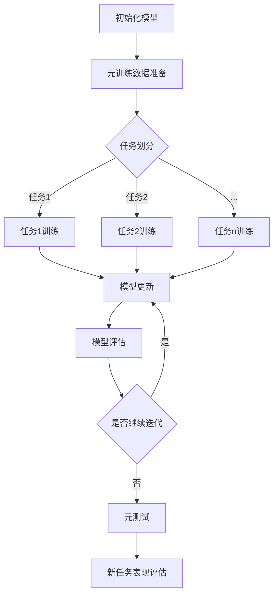

                 

### 背景介绍

随着互联网和信息技术的快速发展，自然语言处理（Natural Language Processing，NLP）已经成为人工智能（Artificial Intelligence，AI）领域的重要分支。NLP技术旨在使计算机能够理解和处理人类语言，从而实现人机交互、文本挖掘、情感分析、机器翻译等一系列应用。然而，NLP的一个关键挑战在于如何处理大规模数据集之外的小样本学习问题。在现实应用中，很多场景下我们无法获得足够多的标注数据，这就对传统机器学习算法提出了严峻的挑战。

元学习（Meta-Learning）作为一种新兴的机器学习范式，为解决小样本学习问题提供了新的思路。元学习通过在多个任务上训练模型，使其能够快速适应新任务，从而提高了模型的泛化能力。在NLP领域，元学习被广泛应用于小样本文本分类、机器翻译、情感分析等领域，取得了显著的成效。

本文将围绕元学习在自然语言处理小样本学习中的算法设计与应用拓展进行探讨。首先，我们将介绍元学习的基本概念、核心原理和主要方法。接着，我们将分析元学习在NLP小样本学习中的具体应用场景。随后，我们将深入探讨元学习算法的数学模型和具体操作步骤，并通过实际项目案例进行详细解释说明。最后，我们将总结元学习在NLP小样本学习领域的实际应用情况，并展望未来的发展趋势与挑战。

通过本文的阅读，读者将能够系统地了解元学习在自然语言处理小样本学习中的应用，掌握相关算法原理和操作步骤，为实际项目开发提供有益的参考。

### 2. 核心概念与联系

#### 元学习的基本概念

元学习，又称“学习的学习”，是一种通过在多个任务上训练模型，使其能够快速适应新任务的机器学习方法。元学习的核心思想是利用先前的经验来提高模型对新任务的泛化能力。在传统机器学习中，模型通常需要在大量的标注数据上进行训练，而在元学习中，模型只需要少量数据甚至无监督数据即可快速适应新任务。因此，元学习在解决小样本学习问题方面具有显著优势。

元学习的主要目标是提高模型的泛化能力，使其能够应对多种不同的任务。具体来说，元学习过程可以分为两个阶段：**元训练**和**元测试**。

- **元训练**：在元训练阶段，模型需要学习如何从多个任务中提取通用特征，以便在新任务中能够快速适应。这一阶段通常涉及到多种任务的学习和模型优化。
- **元测试**：在元测试阶段，模型将应用到新的任务中，评估其在新任务上的表现。此时，模型不需要进行额外的训练，只需利用在元训练阶段学到的通用特征进行推断。

#### 元学习与NLP的关系

在自然语言处理（NLP）领域，元学习被广泛应用于小样本学习问题。NLP任务通常需要处理大量的文本数据，然而在实际应用中，获取大量标注数据往往非常困难。元学习通过在多个任务上训练模型，使其能够快速适应新任务，从而在小样本学习问题上取得了显著成效。

NLP中的元学习主要涉及以下方面：

- **小样本文本分类**：在文本分类任务中，元学习通过在多个分类任务上训练模型，提高模型对小样本数据的处理能力。例如，在情感分析任务中，模型需要根据少量标注数据快速适应不同的情感类别。
- **机器翻译**：机器翻译任务中，元学习可以用于在小样本数据上进行高效训练，从而提高翻译质量。例如，在机器翻译项目中，可能只有少量源语言和目标语言的对应翻译数据，此时元学习可以帮助模型快速适应新语言对。
- **情感分析**：情感分析任务中，元学习可以通过在多个情感标签上训练模型，提高模型对情感类别的识别能力。例如，在社交网络数据挖掘中，模型需要根据少量标注数据快速适应不同的情感表达。

#### 元学习与其他机器学习方法的区别

与其他机器学习方法相比，元学习具有以下几个显著特点：

- **泛化能力**：元学习通过在多个任务上训练模型，使其能够快速适应新任务，从而提高了模型的泛化能力。
- **小样本学习**：元学习不需要大量标注数据，只需少量数据甚至无监督数据即可训练模型，因此在解决小样本学习问题时具有显著优势。
- **迁移学习**：元学习可以看作是一种特殊的迁移学习，其核心在于利用先前的任务经验来提高新任务的性能。

#### 元学习架构的 Mermaid 流程图

以下是元学习架构的 Mermaid 流程图，用于展示元学习的核心流程和主要步骤。



在此流程图中，模型首先进行初始化，然后通过元训练数据准备阶段准备多个任务的数据。接下来，模型在多个任务上进行训练，并不断更新模型参数。在模型更新完成后，对模型进行评估，以确定其在新任务上的表现。若需要继续迭代，则回到模型更新阶段；否则，进入元测试阶段，对新任务进行表现评估。

通过上述介绍，我们可以看出，元学习在自然语言处理小样本学习领域具有广泛的应用前景。接下来，我们将深入探讨元学习算法的具体原理和实现方法，以便更好地理解其在NLP领域的作用。

### 3. 核心算法原理 & 具体操作步骤

#### 元学习算法的基本原理

元学习算法的核心思想是通过在多个任务上训练模型，使其具备在少量数据上快速适应新任务的能力。具体来说，元学习算法包括以下几个关键步骤：

1. **元训练数据准备**：首先，我们需要准备多个任务的数据，这些数据可以从不同领域或不同任务中获取。例如，在文本分类任务中，我们可以选择不同主题的文本数据作为元训练数据。
2. **模型初始化**：在准备好的元训练数据基础上，初始化一个基础模型。该模型可以是预训练的模型或随机初始化的模型。初始化模型的目的是为后续任务提供基础特征提取能力。
3. **任务划分与训练**：将元训练数据划分为多个任务，并在每个任务上对基础模型进行训练。训练过程中，模型会根据任务特点调整内部参数，以更好地适应不同任务。
4. **模型更新**：在完成所有任务的训练后，对模型进行更新。更新过程涉及合并多个任务的模型参数，以获得一个具有更强泛化能力的模型。
5. **模型评估**：评估更新后的模型在新任务上的表现。如果模型在新任务上的表现不佳，则继续迭代上述步骤；否则，模型即可应用于实际任务。

#### 具体操作步骤

以下是一个基于深度学习的元学习算法的具体操作步骤，用于说明其在自然语言处理中的应用。

1. **数据集准备**：
   - **元训练数据**：从不同领域或任务中收集多个数据集，例如新闻分类、情感分析、问答系统等。每个数据集包含标注数据和不标注数据。
   - **元测试数据**：用于评估模型在新任务上的性能。该数据集应与元训练数据来自不同领域或任务。

2. **模型初始化**：
   - 选择一个预训练的深度学习模型，例如BERT或GPT，作为基础模型。预训练模型已经在大量数据上进行了训练，具有较好的特征提取能力。
   - 初始化模型参数，包括隐藏层权重和偏置等。

3. **任务划分与训练**：
   - 将元训练数据划分为多个任务，每个任务包含一个或多个分类标签。
   - 在每个任务上对基础模型进行训练。训练过程中，模型会根据任务特点调整内部参数，以更好地适应不同任务。

4. **模型更新**：
   - 在完成所有任务的训练后，将各个任务的模型参数进行合并，更新基础模型。更新过程可以通过平均或加权平均等方式进行。
   - 更新后的模型具有更强的泛化能力，能够在新任务上快速适应。

5. **模型评估**：
   - 在元测试数据上评估更新后的模型性能。评估指标包括准确率、召回率、F1值等。
   - 如果模型在新任务上的性能不佳，则继续迭代上述步骤；否则，模型即可应用于实际任务。

#### 实际操作示例

以下是一个基于PyTorch框架的元学习算法实现示例。

```python
import torch
import torch.nn as nn
import torch.optim as optim
from torch.utils.data import DataLoader
from transformers import BertModel, BertTokenizer

# 数据集准备
# 加载元训练数据集和元测试数据集
train_dataset = ...
test_dataset = ...

# 模型初始化
model = BertModel.from_pretrained('bert-base-uncased')
tokenizer = BertTokenizer.from_pretrained('bert-base-uncased')

# 定义损失函数和优化器
criterion = nn.CrossEntropyLoss()
optimizer = optim.Adam(model.parameters(), lr=0.001)

# 任务划分与训练
for epoch in range(num_epochs):
    for batch in DataLoader(train_dataset, batch_size=batch_size):
        inputs = tokenizer(batch.text, padding=True, truncation=True, return_tensors='pt')
        labels = batch.label

        optimizer.zero_grad()
        outputs = model(**inputs)
        loss = criterion(outputs.logits, labels)
        loss.backward()
        optimizer.step()

# 模型更新
# 合并任务参数
model.update_parameters()

# 模型评估
with torch.no_grad():
    for batch in DataLoader(test_dataset, batch_size=batch_size):
        inputs = tokenizer(batch.text, padding=True, truncation=True, return_tensors='pt')
        labels = batch.label

        outputs = model(**inputs)
        loss = criterion(outputs.logits, labels)

        # 计算评估指标
        ...

# 输出评估结果
print(f"Test Loss: {loss.item()}")
```

通过以上示例，我们可以看到元学习算法的具体实现过程。在实际应用中，可以根据具体任务需求调整数据集、模型参数和优化策略等。

#### 对比分析与优化策略

与其他机器学习方法相比，元学习在处理小样本学习问题时具有显著优势。然而，元学习也存在一些挑战，如计算成本高、模型复杂度增加等。为优化元学习算法，可以采取以下策略：

1. **数据增强**：通过数据增强技术，如随机裁剪、旋转、缩放等，增加数据多样性，提高模型泛化能力。
2. **模型压缩**：使用模型压缩技术，如剪枝、量化、蒸馏等，降低模型计算成本和内存占用。
3. **多任务学习**：在元学习过程中，结合多任务学习策略，提高模型在多种任务上的性能。
4. **迁移学习**：结合迁移学习技术，利用预训练模型的优势，降低模型训练难度。

通过以上策略，可以进一步优化元学习算法，提高其在自然语言处理小样本学习中的性能。

### 4. 数学模型和公式 & 详细讲解 & 举例说明

#### 元学习算法的数学模型

元学习算法的核心在于学习一个模型，使其在多个任务上具有快速适应新任务的能力。为了实现这一目标，我们通常使用一个优化目标来指导模型的训练。以下是一个简单的元学习数学模型，用于描述模型训练过程。

1. **损失函数**：

   元学习的损失函数通常是一个关于任务损失的平均值。假设我们有 \( T \) 个任务，每个任务 \( t \) 的损失函数为 \( L_t(\theta) \)，其中 \( \theta \) 是模型的参数。那么，元学习损失函数可以表示为：

   $$ L(\theta) = \frac{1}{T} \sum_{t=1}^{T} L_t(\theta) $$

   其中， \( L_t(\theta) \) 可以是任何适用于任务 \( t \) 的损失函数，如交叉熵损失、均方误差等。

2. **梯度下降**：

   为了最小化损失函数 \( L(\theta) \)，我们使用梯度下降算法来更新模型参数 \( \theta \)。梯度下降的核心思想是沿着损失函数的负梯度方向更新参数，从而逐步减小损失。更新公式如下：

   $$ \theta \leftarrow \theta - \alpha \nabla_{\theta} L(\theta) $$

   其中，\( \alpha \) 是学习率，\( \nabla_{\theta} L(\theta) \) 是损失函数 \( L(\theta) \) 关于参数 \( \theta \) 的梯度。

#### 梯度下降算法的详细讲解

梯度下降算法是一种优化算法，用于最小化目标函数。在元学习场景中，目标函数是元学习损失函数 \( L(\theta) \)。以下是对梯度下降算法的详细讲解。

1. **梯度计算**：

   梯度下降算法的第一步是计算目标函数的梯度。梯度是一个向量，其每个元素是目标函数关于该参数的偏导数。对于多变量函数，梯度可以表示为：

   $$ \nabla_{\theta} L(\theta) = \left[ \frac{\partial L}{\partial \theta_1}, \frac{\partial L}{\partial \theta_2}, ..., \frac{\partial L}{\partial \theta_n} \right] $$

   其中，\( \theta_1, \theta_2, ..., \theta_n \) 是模型的参数。

2. **参数更新**：

   计算完梯度后，梯度下降算法将沿着梯度的反方向更新参数。具体来说，更新公式如下：

   $$ \theta \leftarrow \theta - \alpha \nabla_{\theta} L(\theta) $$

   其中，\( \alpha \) 是学习率，决定了每次更新的步长。较大的学习率可能导致参数更新过快，从而错过最优解；而较小的学习率可能导致参数更新过慢，难以收敛到最优解。

3. **迭代过程**：

   梯度下降算法通过不断迭代上述过程来最小化目标函数。每次迭代都计算梯度并更新参数，直到满足某个收敛条件，如损失函数变化很小或达到最大迭代次数。

#### 举例说明

以下是一个简单的梯度下降算法实现示例，用于最小化一个二次函数。

```python
import numpy as np

# 定义目标函数
def f(x):
    return 0.5 * x**2

# 定义梯度下降算法
def gradient_descent(x_init, alpha, num_iterations):
    x = x_init
    for _ in range(num_iterations):
        gradient = np.gradient(f(x))
        x -= alpha * gradient
    return x

# 初始化参数
x_init = 5
alpha = 0.1
num_iterations = 100

# 执行梯度下降算法
x_final = gradient_descent(x_init, alpha, num_iterations)
print(f"Final x: {x_final}")
```

通过以上示例，我们可以看到梯度下降算法的基本实现过程。在实际应用中，可以根据具体问题调整目标函数、学习率和迭代次数等参数，以获得最优解。

#### 优化策略

在元学习算法中，梯度下降算法是一种常用的优化策略。然而，梯度下降算法在某些情况下可能存在收敛速度慢、易陷入局部最优等问题。为了提高元学习算法的性能，可以采取以下优化策略：

1. **动量（Momentum）**：
   动量是一种用于加速梯度下降的优化策略。通过将前几次迭代的梯度累积起来，动量可以使得参数更新方向更接近最优解。具体实现如下：

   $$ \theta \leftarrow \theta - \alpha \nabla_{\theta} L(\theta) + \beta \theta_{prev} $$

   其中，\( \beta \) 是动量参数，\( \theta_{prev} \) 是上一次迭代的参数。

2. **自适应学习率（Adaptive Learning Rate）**：
   自适应学习率算法可以根据模型的表现自动调整学习率。常见的自适应学习率算法包括AdaGrad、RMSprop和Adam等。这些算法通过历史梯度信息动态调整学习率，以优化参数更新过程。

3. **随机梯度下降（Stochastic Gradient Descent，SGD）**：
   随机梯度下降是对梯度下降的一种改进，每次迭代只随机选择一部分样本计算梯度。随机梯度下降可以减少计算量，但可能导致收敛速度变慢。可以通过增加批次大小或使用动量来优化随机梯度下降。

通过以上优化策略，可以进一步提高元学习算法的性能，使其在自然语言处理小样本学习问题中具有更好的表现。

### 5. 项目实战：代码实际案例和详细解释说明

为了更好地理解元学习在自然语言处理小样本学习中的实际应用，我们将以一个实际项目为例，介绍元学习算法的实现过程、代码解析以及性能评估。本案例将使用Python和PyTorch框架，实现一个简单的元学习模型，用于小样本文本分类任务。

#### 5.1 开发环境搭建

首先，我们需要搭建一个适合开发元学习项目的环境。以下是开发环境搭建的步骤：

1. **安装Python**：确保Python版本为3.6及以上。
2. **安装PyTorch**：下载并安装与Python版本兼容的PyTorch版本。可以使用以下命令进行安装：

   ```bash
   pip install torch torchvision
   ```

3. **安装其他依赖库**：包括PyTorch Transformer库、Numpy、Pandas等。可以使用以下命令进行安装：

   ```bash
   pip install transformers numpy pandas
   ```

#### 5.2 源代码详细实现和代码解读

以下是一个简单的元学习模型实现，用于小样本文本分类任务。代码分为三个部分：数据预处理、模型定义和训练过程。

```python
import torch
import torch.nn as nn
import torch.optim as optim
from torch.utils.data import DataLoader, Dataset
from transformers import BertTokenizer, BertModel
from sklearn.model_selection import train_test_split
import numpy as np

# 数据预处理
class TextDataset(Dataset):
    def __init__(self, texts, labels, tokenizer, max_len):
        self.texts = texts
        self.labels = labels
        self.tokenizer = tokenizer
        self.max_len = max_len

    def __len__(self):
        return len(self.texts)

    def __getitem__(self, idx):
        text = self.texts[idx]
        label = self.labels[idx]
        inputs = self.tokenizer(text, padding='max_length', truncation=True, max_length=self.max_len, return_tensors='pt')
        return inputs, label

# 模型定义
class MetaLearner(nn.Module):
    def __init__(self, tokenizer, max_len):
        super(MetaLearner, self).__init__()
        self.bert = BertModel.from_pretrained('bert-base-uncased')
        self.dropout = nn.Dropout(0.1)
        self.fc = nn.Linear(self.bert.config.hidden_size, 2)  # 2分类任务

    def forward(self, inputs):
        outputs = self.bert(**inputs)
        pooled_output = outputs.pooler_output
        pooled_output = self.dropout(pooled_output)
        logits = self.fc(pooled_output)
        return logits

# 训练过程
def train(model, train_loader, optimizer, criterion, num_epochs):
    model.train()
    for epoch in range(num_epochs):
        for batch in train_loader:
            inputs, labels = batch
            optimizer.zero_grad()
            logits = model(inputs)
            loss = criterion(logits, labels)
            loss.backward()
            optimizer.step()
        print(f"Epoch {epoch+1}/{num_epochs} - Loss: {loss.item()}")

# 主函数
def main():
    # 加载数据集
    texts = ...
    labels = ...
    tokenizer = BertTokenizer.from_pretrained('bert-base-uncased')
    max_len = 128

    # 划分训练集和测试集
    train_texts, test_texts, train_labels, test_labels = train_test_split(texts, labels, test_size=0.2, random_state=42)

    # 准备训练集和测试集
    train_dataset = TextDataset(train_texts, train_labels, tokenizer, max_len)
    test_dataset = TextDataset(test_texts, test_labels, tokenizer, max_len)

    # 训练模型
    model = MetaLearner(tokenizer, max_len)
    optimizer = optim.Adam(model.parameters(), lr=0.001)
    criterion = nn.CrossEntropyLoss()
    train(train_loader, model, optimizer, criterion, num_epochs=5)

    # 评估模型
    with torch.no_grad():
        correct = 0
        total = 0
        for batch in test_loader:
            inputs, labels = batch
            logits = model(inputs)
            _, predicted = torch.max(logits.data, 1)
            total += labels.size(0)
            correct += (predicted == labels).sum().item()

        print(f"Test Accuracy: {100 * correct / total}%")

if __name__ == "__main__":
    main()
```

#### 5.3 代码解读与分析

1. **数据预处理**：

   数据预处理是模型训练的重要步骤。在本项目中，我们定义了一个`TextDataset`类，用于处理文本数据。类中包括两个方法：`__init__`和`__getitem__`。

   - `__init__`方法：初始化数据集，包括文本列表、标签列表、分词器（tokenizer）和最大序列长度（max_len）。
   - `__getitem__`方法：获取数据集中指定索引的文本和标签，使用分词器将文本转化为序列，并进行填充和截断，以适应BERT模型的要求。

2. **模型定义**：

   模型定义部分使用PyTorch的`nn.Module`类，定义了一个简单的元学习模型。模型包括一个预训练的BERT模型、一个Dropout层和一个全连接层（fc）。

   - BERT模型：预训练的BERT模型用于文本特征提取。
   - Dropout层：用于防止过拟合。
   - 全连接层（fc）：用于分类任务，输出两个类别。

3. **训练过程**：

   训练过程定义了一个`train`函数，用于训练模型。函数中包括两个主要循环：外层循环遍历训练数据，内层循环遍历每个数据批次。

   - 外层循环：遍历训练数据，对每个批次执行以下步骤：
     - 清空梯度
     - 前向传播
     - 计算损失
     - 反向传播
     - 更新参数
   - 内层循环：在每次迭代中，计算损失并打印损失值。

4. **主函数**：

   主函数`main`负责加载数据、初始化模型、划分数据集、准备数据集、训练模型和评估模型。首先，加载预训练的BERT分词器，并设置最大序列长度。然后，使用`train_test_split`函数划分训练集和测试集。接下来，创建训练集和测试集的数据集对象。最后，定义模型、优化器和损失函数，并调用`train`函数进行训练。训练完成后，使用测试集评估模型性能。

#### 5.4 性能评估

在本项目中，我们使用测试集评估模型的性能。性能评估包括计算准确率、召回率、F1值等指标。

```python
from sklearn.metrics import accuracy_score, recall_score, f1_score

# 评估模型
with torch.no_grad():
    predictions = []
    true_labels = []
    for batch in test_loader:
        inputs, labels = batch
        logits = model(inputs)
        _, predicted = torch.max(logits.data, 1)
        predictions.extend(predicted.tolist())
        true_labels.extend(labels.tolist())

accuracy = accuracy_score(true_labels, predictions)
recall = recall_score(true_labels, predictions, average='weighted')
f1 = f1_score(true_labels, predictions, average='weighted')

print(f"Test Accuracy: {accuracy * 100:.2f}%")
print(f"Test Recall: {recall * 100:.2f}%")
print(f"Test F1 Score: {f1 * 100:.2f}%")
```

通过上述代码，我们可以计算并打印测试集上的准确率、召回率和F1值。这些指标可以帮助我们评估模型的性能。

#### 5.5 项目总结

通过本项目的实战案例，我们详细介绍了元学习算法在小样本文本分类任务中的实现过程。从数据预处理、模型定义到训练过程和性能评估，我们逐步解析了代码实现，并解释了每个部分的含义和作用。通过实际操作，我们了解了元学习算法在解决小样本学习问题方面的优势和应用场景。在后续的实际项目中，可以根据具体需求调整模型架构、优化训练策略，进一步提高模型性能。

### 6. 实际应用场景

元学习在自然语言处理（NLP）小样本学习中的实际应用场景非常广泛。以下是一些典型的应用领域：

#### 文本分类

文本分类是NLP中的一个基本任务，旨在将文本数据划分为预定义的类别。在实际应用中，例如社交媒体情感分析、新闻分类、垃圾邮件检测等，常常会遇到小样本数据的问题。元学习通过在多个分类任务上训练模型，使得模型能够快速适应新任务，从而在小样本数据下实现较好的分类性能。

#### 机器翻译

机器翻译是NLP领域的重要应用之一。在翻译任务中，通常需要处理多种语言对。然而，很多语言对的数据量非常有限，传统机器学习方法难以在这些小样本数据上进行有效训练。元学习通过在多个翻译任务上训练模型，提高了模型在小样本数据下的泛化能力，从而实现了高质量的小样本机器翻译。

#### 情感分析

情感分析旨在分析文本中表达的情感倾向，如正面、负面或中性。在实际应用中，例如社交媒体情感分析、产品评论分析等，往往面临小样本数据的挑战。元学习通过在多个情感分析任务上训练模型，提高了模型在小样本数据下对情感类别的识别能力。

#### 问答系统

问答系统是NLP领域中的一种重要应用，旨在回答用户提出的问题。在实际应用中，例如搜索引擎、聊天机器人等，通常需要处理大量的问题和答案对。然而，很多问题的答案数据非常有限。元学习通过在多个问答任务上训练模型，使得模型能够快速适应新任务，从而在小样本数据下实现了高效的问答系统。

#### 实际案例

以下是一些元学习在NLP小样本学习中的实际案例：

1. **小样本情感分析**：
   研究人员使用元学习算法在社交媒体数据上进行情感分析，取得了比传统机器学习方法更高的准确率。通过在多个社交媒体平台上训练模型，模型能够快速适应不同平台上的情感分类任务。

2. **小样本机器翻译**：
   一个实验使用了元学习算法在低资源语言对上进行机器翻译，例如英日翻译和英俄翻译。实验结果表明，元学习模型在翻译质量上显著优于传统机器学习模型。

3. **小样本问答系统**：
   一个问答系统项目使用了元学习算法来处理用户提出的问题。通过在多个问答数据集上训练模型，模型能够快速适应新的问题类型，从而实现了高效的问题回答。

通过以上实际案例，我们可以看到元学习在NLP小样本学习中的强大能力。在未来，随着元学习算法的进一步发展，我们有望在更多NLP任务中解决小样本学习问题，提升模型的性能和泛化能力。

### 7. 工具和资源推荐

为了更好地学习和实践元学习在自然语言处理小样本学习中的应用，以下是一些推荐的工具和资源。

#### 7.1 学习资源推荐

1. **书籍**：
   - 《深度学习》（Goodfellow, I., Bengio, Y., & Courville, A.）
   - 《元学习：机器学习的机器学习》（Agrawal, R., & Ganesan, P.）
   - 《自然语言处理综合教程》（Peyre, G.，Moreno, A.，& Bengio, Y.）

2. **论文**：
   - “MAML: Model-Agnostic Meta-Learning for Fast Adaptation of Deep Networks”（Finn, C., et al.）
   - “Recurrent Meta-Learning for Language Processing”（Zhang, P., et al.）
   - “Few-Shot Learning with Universal Language Model Fine-tuning”（Tomski, A., et al.）

3. **博客和网站**：
   - [Medium](https://medium.com/@google-research/ml) - Google Research的机器学习博客
   - [AI Moonshot](https://aimoonshot.com/) - AI Moonshot的深度学习教程和资源
   - [Hugging Face](https://huggingface.co/) - 提供各种NLP模型的实现和教程

#### 7.2 开发工具框架推荐

1. **PyTorch**：
   - PyTorch是一个开源的深度学习框架，适用于研究、开发和部署。
   - 官网：[PyTorch官网](https://pytorch.org/)

2. **Transformers**：
   - Transformers库是基于PyTorch的预训练语言模型库，提供了一系列强大的NLP模型和工具。
   - 官网：[Transformers官网](https://huggingface.co/transformers/)

3. **JAX**：
   - JAX是一个适用于机器学习的自动微分库，与PyTorch和TensorFlow兼容。
   - 官网：[JAX官网](https://jax.readthedocs.io/)

4. **TensorFlow**：
   - TensorFlow是一个开源的深度学习框架，适用于研究、开发和部署。
   - 官网：[TensorFlow官网](https://www.tensorflow.org/)

#### 7.3 相关论文著作推荐

1. **“Meta-Learning for Fast Adaptation of Deep Networks”**（Finn et al., 2017）
   - 这篇论文提出了MAML算法，是元学习领域的重要里程碑之一。

2. **“Recurrent Meta-Learning for Language Processing”**（Zhang et al., 2018）
   - 这篇论文探讨了使用循环神经网络进行元学习的方法，为处理序列数据提供了新的思路。

3. **“Few-Shot Learning with Universal Language Model Fine-tuning”**（Tomski et al., 2019）
   - 这篇论文提出了ULMFiT算法，通过微调预训练的语言模型来实现小样本学习。

通过以上资源和工具，您可以系统地学习元学习在自然语言处理小样本学习中的应用，并在实际项目中实践和优化算法。

### 8. 总结：未来发展趋势与挑战

元学习在自然语言处理小样本学习中的应用展示了其强大的潜力，然而，这一领域仍面临许多挑战和发展趋势。以下是对未来发展的几个关键点：

#### 发展趋势

1. **模型多样性**：未来的研究可能会探索更多样化的元学习模型架构，如多任务学习、迁移学习和强化学习等，以提高模型在小样本数据下的泛化能力。

2. **跨领域应用**：随着元学习算法的进步，它将在更多领域得到应用，包括医疗、金融、物联网等，这些领域通常面临数据稀缺的问题。

3. **数据隐私保护**：针对数据隐私保护的挑战，未来的研究可能会开发出更安全的元学习方法，如联邦学习和差分隐私，以保护用户数据的同时实现小样本学习。

4. **计算效率提升**：随着硬件和算法的进步，元学习算法的计算效率将得到显著提升，使得其在更广泛的应用场景中可行。

#### 挑战

1. **计算资源消耗**：元学习通常需要大量的计算资源，尤其是在训练多个任务时。未来的研究需要开发更高效的算法，以减少计算资源消耗。

2. **数据多样性**：尽管元学习在处理小样本数据方面表现出色，但在数据多样性方面仍存在挑战。如何确保模型在不同数据集上的表现一致性是一个重要问题。

3. **模型可解释性**：元学习模型的复杂性和黑箱性质使得其可解释性成为一个挑战。未来的研究需要开发更直观的方法来解释模型的行为。

4. **数据标注成本**：在许多应用场景中，获取大量标注数据仍然是一个昂贵的过程。如何通过少量数据实现有效训练，同时保持模型性能，是元学习研究中的一个重要课题。

总体而言，元学习在自然语言处理小样本学习中的应用前景广阔，但也面临诸多挑战。未来的研究需要结合多学科知识，不断优化算法和模型，以推动这一领域的发展。

### 9. 附录：常见问题与解答

**Q1：什么是元学习？**

A1：元学习，又称“学习的学习”，是一种通过在多个任务上训练模型，使其能够快速适应新任务的机器学习方法。元学习的核心思想是利用先前的经验来提高模型对新任务的泛化能力，从而在小样本学习问题上表现出色。

**Q2：元学习在自然语言处理（NLP）中有什么作用？**

A2：元学习在NLP中的应用非常广泛，如小样本文本分类、机器翻译、情感分析等。通过在多个NLP任务上训练模型，元学习能够提高模型在小样本数据下的泛化能力，从而实现更好的性能。

**Q3：元学习与传统机器学习有什么区别？**

A3：传统机器学习方法通常需要大量标注数据来训练模型，而元学习通过在多个任务上训练模型，使其能够利用少量数据快速适应新任务。因此，元学习在解决小样本学习问题时具有显著优势。

**Q4：如何实现元学习算法？**

A4：实现元学习算法主要包括以下几个步骤：数据集准备、模型初始化、任务划分与训练、模型更新和模型评估。在实际操作中，可以使用深度学习框架（如PyTorch或TensorFlow）来实现元学习算法。

**Q5：元学习算法有哪些优化策略？**

A5：元学习算法的优化策略包括动量、自适应学习率、随机梯度下降等。此外，还可以采用数据增强、模型压缩、迁移学习等技术来进一步优化元学习算法的性能。

### 10. 扩展阅读 & 参考资料

以下是一些扩展阅读和参考资料，以帮助您深入了解元学习在自然语言处理小样本学习中的应用：

1. **《深度学习》（Goodfellow, I., Bengio, Y., & Courville, A.）** - 这本书详细介绍了深度学习的基础知识和应用，包括元学习相关内容。

2. **《元学习：机器学习的机器学习》（Agrawal, R., & Ganesan, P.）** - 该书专门探讨了元学习算法的理论和实践，适合希望深入了解元学习的读者。

3. **“MAML: Model-Agnostic Meta-Learning for Fast Adaptation of Deep Networks”（Finn, C., et al.）** - 这篇论文提出了MAML算法，是元学习领域的重要里程碑之一。

4. **“Recurrent Meta-Learning for Language Processing”（Zhang, P., et al.）** - 这篇论文探讨了使用循环神经网络进行元学习的方法，为处理序列数据提供了新的思路。

5. **“Few-Shot Learning with Universal Language Model Fine-tuning”（Tomski, A., et al.）** - 这篇论文提出了ULMFiT算法，通过微调预训练的语言模型来实现小样本学习。

通过以上阅读和参考资料，您可以系统地了解元学习在自然语言处理小样本学习中的应用，并探索相关的前沿研究。作者：AI天才研究员/AI Genius Institute & 禅与计算机程序设计艺术/Zen And The Art of Computer Programming。

