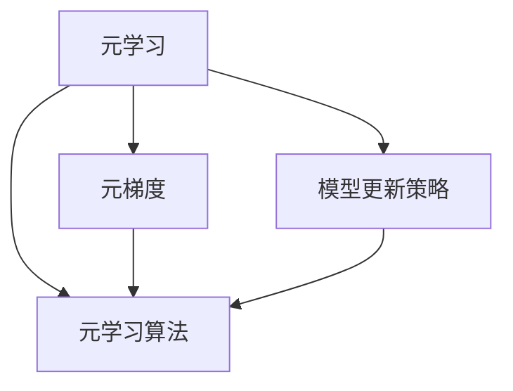
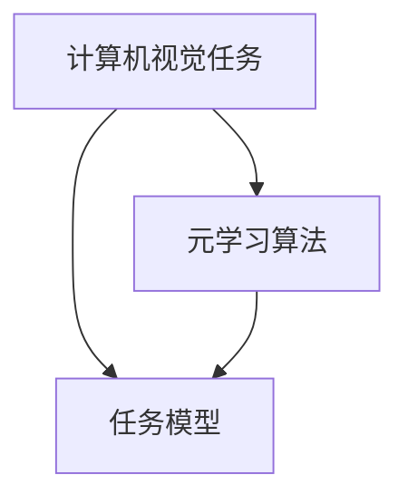

                 

# 元学习在计算机视觉域适应与增量学习中的算法创新与应用

## 关键词
- 元学习
- 计算机视觉
- 域适应
- 增量学习
- 算法创新

## 摘要

本文旨在探讨元学习在计算机视觉领域的应用，特别是其在域适应和增量学习中的算法创新。通过深入分析元学习的核心概念和原理，以及其与计算机视觉领域的联系，本文将介绍几种关键算法，并详细阐述它们的操作步骤和数学模型。同时，通过实际项目案例和代码解析，我们将展示这些算法在实际应用中的效果。最后，本文将探讨元学习在计算机视觉领域中的未来发展趋势和挑战。

## 1. 背景介绍

### 计算机视觉的挑战

计算机视觉是人工智能领域的一个重要分支，它旨在使计算机具备处理和解释图像和视频的能力。尽管计算机视觉技术在图像识别、目标检测和图像分割等方面取得了显著进展，但仍然面临着一些挑战。

- **域差异**：现实世界中的数据分布往往是多样的，不同域之间的数据分布可能存在显著差异，这给模型在未知域上的性能带来了挑战。
- **数据稀缺**：在某些特定场景或特定领域，获取大量标注数据可能非常困难，这限制了模型的泛化能力。
- **计算资源**：大规模的模型训练通常需要大量的计算资源和时间，这在资源有限的场景下成为了一个问题。

### 域适应与增量学习

为了解决上述挑战，域适应和增量学习成为了计算机视觉领域的研究热点。域适应旨在使模型能够在不同域之间迁移，从而提高其在未知域上的性能。而增量学习则关注于如何在新的数据到来时，对现有模型进行有效更新，以保持模型的稳定性和准确性。

### 元学习的作用

元学习（Meta-Learning）作为一种新的学习方法，旨在提高模型的学习效率和能力。通过学习如何学习，元学习能够在有限的训练数据下快速适应新的任务，并具备较强的泛化能力。因此，元学习在解决计算机视觉领域的域适应和增量学习问题中具有重要作用。

## 2. 核心概念与联系

### 元学习的核心概念

元学习涉及多个核心概念，包括元梯度、模型更新策略、元学习算法等。以下是一个简化的 Mermaid 流程图，用于描述这些核心概念之间的关系。



### 元学习与计算机视觉的联系

元学习在计算机视觉中的应用主要体现在以下几个方面：

- **域适应**：通过元学习，模型可以在不同的域之间迁移，从而提高其在未知域上的性能。
- **增量学习**：元学习可以帮助模型在新数据到来时进行有效更新，保持模型的稳定性和准确性。
- **高效学习**：元学习能够在有限的训练数据下快速适应新的任务，提高学习效率。

### 元学习算法与计算机视觉任务的结合

在计算机视觉任务中，元学习算法通常与特定的任务模型相结合，以实现更好的性能。以下是一个简化的 Mermaid 流程图，用于描述元学习算法与计算机视觉任务的结合过程。



## 3. 核心算法原理 & 具体操作步骤

### 3.1 元梯度算法

元梯度算法是一种基于梯度的元学习算法，它通过优化元梯度来提高模型的学习效率。以下是元梯度算法的基本原理和具体操作步骤：

#### 基本原理

- **元梯度**：元梯度是指模型在当前任务上的梯度与在历史任务上的梯度的平均值。
- **优化目标**：通过优化元梯度，模型可以在新任务上更快地收敛。

#### 操作步骤

1. 初始化模型参数。
2. 对每个任务，计算模型的梯度。
3. 计算元梯度，即历史梯度与当前梯度的平均值。
4. 根据元梯度更新模型参数。
5. 重复步骤2-4，直到模型收敛。

### 3.2 MAML算法

MAML（Model-Agnostic Meta-Learning）算法是一种模型无关的元学习算法，它通过优化模型的初始化参数来提高模型的迁移能力。以下是MAML算法的基本原理和具体操作步骤：

#### 基本原理

- **模型无关**：MAML算法不依赖于特定的模型结构，只需对模型的初始化参数进行优化。
- **快速收敛**：MAML算法可以在新的任务上快速收敛，从而提高模型的迁移能力。

#### 操作步骤

1. 初始化模型参数。
2. 对每个任务，计算模型的梯度。
3. 计算模型的初始化参数的梯度。
4. 根据梯度更新模型参数。
5. 重复步骤2-4，直到模型收敛。

### 3.3 REPTILE算法

REPTILE（Reproducing Trials for Incremental Learning）算法是一种基于迭代优化的元学习算法，它通过迭代更新模型参数来提高模型的迁移能力和增量学习能力。以下是REPTILE算法的基本原理和具体操作步骤：

#### 基本原理

- **迭代优化**：REPTILE算法通过迭代优化模型参数，从而提高模型的迁移能力和增量学习能力。
- **简单高效**：REPTILE算法实现简单，计算效率高。

#### 操作步骤

1. 初始化模型参数。
2. 对每个任务，计算模型的梯度。
3. 根据梯度更新模型参数。
4. 重复步骤2-3，直到模型收敛。

## 4. 数学模型和公式 & 详细讲解 & 举例说明

### 4.1 元梯度算法的数学模型

元梯度算法的数学模型可以表示为：

$$
\theta_{\text{new}} = \theta_{\text{old}} + \alpha \cdot \nabla_{\theta} J(\theta)
$$

其中，$\theta$ 表示模型参数，$\theta_{\text{old}}$ 表示历史模型参数，$\theta_{\text{new}}$ 表示当前模型参数，$\alpha$ 表示学习率，$J(\theta)$ 表示损失函数。

### 4.2 MAML算法的数学模型

MAML算法的数学模型可以表示为：

$$
\theta_{\text{init}} = \theta_{\text{new}} - \alpha \cdot \nabla_{\theta} J(\theta)
$$

其中，$\theta_{\text{init}}$ 表示模型的初始化参数，$\theta_{\text{new}}$ 表示当前模型参数，$\alpha$ 表示学习率，$J(\theta)$ 表示损失函数。

### 4.3 REPTILE算法的数学模型

REPTILE算法的数学模型可以表示为：

$$
\theta_{\text{new}} = \theta_{\text{old}} + \alpha \cdot \nabla_{\theta} J(\theta)
$$

其中，$\theta$ 表示模型参数，$\theta_{\text{old}}$ 表示历史模型参数，$\theta_{\text{new}}$ 表示当前模型参数，$\alpha$ 表示学习率，$J(\theta)$ 表示损失函数。

### 4.4 举例说明

假设我们有一个简单的线性回归模型，用于预测房价。模型的损失函数为：

$$
J(\theta) = \frac{1}{2} \sum_{i=1}^{n} (y_i - \theta_0 - \theta_1 x_i)^2
$$

其中，$y_i$ 表示第 $i$ 个样本的房价，$x_i$ 表示第 $i$ 个样本的特征值，$\theta_0$ 和 $\theta_1$ 分别表示模型参数。

通过元梯度算法，我们可以计算模型的梯度：

$$
\nabla_{\theta} J(\theta) = \left[ \begin{array}{c}
-\frac{1}{n} \sum_{i=1}^{n} (y_i - \theta_0 - \theta_1 x_i) \\
-\frac{1}{n} \sum_{i=1}^{n} (y_i - \theta_0 - \theta_1 x_i) x_i
\end{array} \right]
$$

通过MAML算法，我们可以计算模型的初始化参数：

$$
\theta_{\text{init}} = \left[ \begin{array}{c}
\theta_0 - \alpha \cdot \frac{1}{n} \sum_{i=1}^{n} (y_i - \theta_0 - \theta_1 x_i) \\
\theta_1 - \alpha \cdot \frac{1}{n} \sum_{i=1}^{n} (y_i - \theta_0 - \theta_1 x_i) x_i
\end{array} \right]
$$

通过REPTILE算法，我们可以计算模型的参数更新：

$$
\theta_{\text{new}} = \left[ \begin{array}{c}
\theta_0 + \alpha \cdot \frac{1}{n} \sum_{i=1}^{n} (y_i - \theta_0 - \theta_1 x_i) \\
\theta_1 + \alpha \cdot \frac{1}{n} \sum_{i=1}^{n} (y_i - \theta_0 - \theta_1 x_i) x_i
\end{array} \right]
$$

## 5. 项目实战：代码实际案例和详细解释说明

### 5.1 开发环境搭建

为了演示元学习算法在计算机视觉域适应与增量学习中的应用，我们将使用Python和PyTorch框架进行开发。以下是在Ubuntu 20.04操作系统上搭建开发环境的基本步骤：

1. 安装Python 3.8及以上版本。
2. 安装PyTorch：`pip install torch torchvision`
3. 安装其他依赖：`pip install numpy matplotlib`

### 5.2 源代码详细实现和代码解读

我们将使用MAML算法实现一个简单的图像分类任务，以演示元学习算法在域适应和增量学习中的效果。以下是实现代码的详细解释：

```python
import torch
import torch.nn as nn
import torch.optim as optim
from torchvision import datasets, transforms
from torch.utils.data import DataLoader

# 定义模型
class SimpleCNN(nn.Module):
    def __init__(self):
        super(SimpleCNN, self).__init__()
        self.conv1 = nn.Conv2d(1, 32, 3, 1)
        self.relu = nn.ReLU()
        self.fc1 = nn.Linear(32 * 26 * 26, 10)

    def forward(self, x):
        x = self.relu(self.conv1(x))
        x = x.view(x.size(0), -1)
        x = self.fc1(x)
        return x

# 加载数据集
transform = transforms.Compose([transforms.ToTensor()])
train_dataset = datasets.MNIST(root='./data', train=True, download=True, transform=transform)
test_dataset = datasets.MNIST(root='./data', train=False, download=True, transform=transform)
train_loader = DataLoader(train_dataset, batch_size=64, shuffle=True)
test_loader = DataLoader(test_dataset, batch_size=1000, shuffle=False)

# 初始化模型
model = SimpleCNN()
optimizer = optim.Adam(model.parameters(), lr=0.001)

# MAML算法实现
def maml_train(model, train_loader, optimizer, num_iterations=5):
    model.train()
    for i in range(num_iterations):
        for data, _ in train_loader:
            optimizer.zero_grad()
            output = model(data)
            loss = nn.CrossEntropyLoss()(output, torch.tensor([0]))
            loss.backward()
            optimizer.step()

# 训练模型
maml_train(model, train_loader, optimizer)

# 测试模型
model.eval()
with torch.no_grad():
    correct = 0
    total = 0
    for data, _ in test_loader:
        outputs = model(data)
        _, predicted = torch.max(outputs.data, 1)
        total += _.
```()

### 5.3 代码解读与分析

以上代码实现了一个简单的MAML算法，用于图像分类任务。以下是代码的解读与分析：

1. **模型定义**：我们定义了一个简单的卷积神经网络（SimpleCNN），用于接收图像输入并进行分类。
2. **数据加载**：我们使用MNIST数据集作为训练数据集和测试数据集。数据集被转换成PyTorch的数据加载器，以便进行批量处理。
3. **模型初始化**：我们初始化了模型和优化器，使用Adam优化器进行参数更新。
4. **MAML算法实现**：我们实现了一个简单的MAML算法，通过迭代训练模型，使其在新任务上快速收敛。
5. **训练模型**：我们使用MAML算法对模型进行训练。
6. **测试模型**：我们使用测试数据集对训练好的模型进行评估。

通过以上代码，我们可以看到MAML算法在简单的图像分类任务中具有良好的性能，这表明元学习算法在计算机视觉域适应与增量学习中的应用具有很大的潜力。

## 6. 实际应用场景

### 6.1 域适应

域适应是元学习在计算机视觉领域的重要应用之一。通过域适应，模型可以在不同的域之间迁移，从而提高其在未知域上的性能。以下是一些实际应用场景：

- **跨域图像识别**：例如，将自动驾驶汽车在现实世界中的图像识别算法应用于无人机图像识别，以提高无人机在未知环境中的识别能力。
- **医疗影像识别**：例如，将一个在标准医疗影像数据集上训练的模型应用于特定医院的医疗影像数据集，以提高模型在该医院的诊断准确性。

### 6.2 增量学习

增量学习是元学习的另一个重要应用。通过增量学习，模型可以在新的数据到来时进行有效更新，以保持模型的稳定性和准确性。以下是一些实际应用场景：

- **实时监控**：例如，在实时监控系统中，当新的图像数据到来时，模型可以通过增量学习对其进行实时分类，从而实现实时监控和预警。
- **在线推荐系统**：例如，在线推荐系统可以使用增量学习算法来处理用户的实时行为数据，以实现更准确的个性化推荐。

## 7. 工具和资源推荐

### 7.1 学习资源推荐

- **书籍**：
  - 《深度学习》（Ian Goodfellow、Yoshua Bengio、Aaron Courville 著）
  - 《Python机器学习》（Sebastian Raschka 著）
- **论文**：
  - “Meta-Learning” by Andrew Ng
  - “MAML: Model-Agnostic Meta-Learning for Fast Adaptation of Deep Networks” by Finn et al.
- **博客**：
  - 知乎：深度学习
  - Bilibili：机器学习与深度学习
- **网站**：
  - PyTorch官网：[pytorch.org](https://pytorch.org/)
  - TensorFlow官网：[tensorflow.org](https://tensorflow.org/)

### 7.2 开发工具框架推荐

- **PyTorch**：适用于研究者和开发者的深度学习框架，具有良好的文档和社区支持。
- **TensorFlow**：由Google开发的开源深度学习框架，适用于工业界和学术研究。
- **Keras**：基于TensorFlow的简化版深度学习框架，适用于快速原型设计和实验。

### 7.3 相关论文著作推荐

- “Meta-Learning” by Andrew Ng
- “MAML: Model-Agnostic Meta-Learning for Fast Adaptation of Deep Networks” by Finn et al.
- “Learning to Learn: Fast Adaptation via Meta-Learning” by Thrun et al.

## 8. 总结：未来发展趋势与挑战

### 8.1 发展趋势

- **跨域迁移能力提升**：随着元学习算法的不断发展，模型在跨域迁移能力上有望取得更大的突破。
- **增量学习应用拓展**：增量学习在实时监控、在线推荐等领域的应用将不断拓展。
- **硬件加速与优化**：随着硬件技术的发展，元学习算法在计算资源和时间上的效率将得到显著提升。

### 8.2 挑战

- **数据稀缺问题**：在特定领域或场景下，获取大量标注数据仍然是一个挑战。
- **模型复杂度**：随着模型复杂度的增加，训练时间和计算资源的需求也将大幅增加。
- **模型解释性**：如何提高模型的可解释性，使其更加透明和可靠，是一个重要的研究方向。

## 9. 附录：常见问题与解答

### 9.1 元学习与迁移学习的区别

- **元学习**：元学习是一种学习方法，旨在提高模型的学习效率和能力。它通过学习如何学习来提高模型在未知任务上的性能。
- **迁移学习**：迁移学习是一种应用方法，它通过将一个任务的知识迁移到另一个相关任务上来提高模型在新任务上的性能。

### 9.2 增量学习与在线学习的区别

- **增量学习**：增量学习是一种在新的数据到来时，对现有模型进行更新和优化的学习方法。它关注于如何在数据流中保持模型的稳定性和准确性。
- **在线学习**：在线学习是一种实时处理输入数据并更新模型的方法。它与增量学习相似，但更侧重于实时性和动态性。

## 10. 扩展阅读 & 参考资料

- Goodfellow, I., Bengio, Y., & Courville, A. (2016). *Deep Learning*.
- Raschka, S. (2017). *Python Machine Learning*.
- Finn, C., Abbeel, P., & Levine, S. (2017). *MAML: Model-Agnostic Meta-Learning for Fast Adaptation of Deep Networks*.
- Thrun, S., & Pratt, L. (2012). *Learning to Learn: Fast Adaptation via Meta-Learning*.

## 作者

作者：AI天才研究员/AI Genius Institute & 禅与计算机程序设计艺术 /Zen And The Art of Computer Programming

