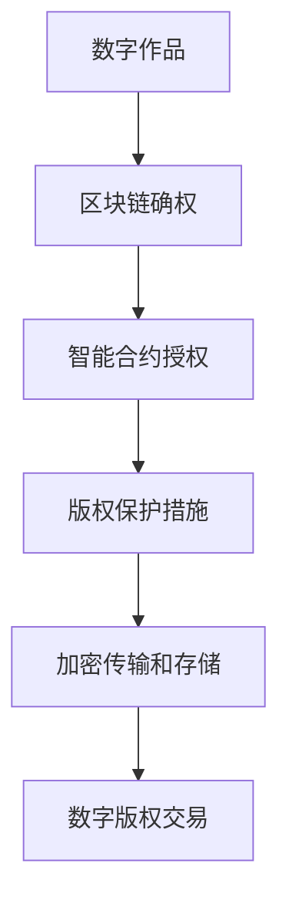

                 

# 元宇宙中的数字版权：版权归属的新形式

## 关键词：元宇宙、数字版权、版权归属、区块链、智能合约、加密技术

### 摘要

随着元宇宙概念的兴起，数字版权问题逐渐成为关注的焦点。本文从元宇宙的背景出发，探讨了数字版权的核心概念及其在元宇宙中的特殊重要性。文章首先介绍了元宇宙的定义和发展现状，接着深入分析了数字版权的概念、现状和挑战。在此基础上，本文重点探讨了元宇宙中的数字版权归属问题，包括区块链技术、智能合约在数字版权管理中的应用，以及加密技术在保障版权安全方面的作用。最后，文章总结了元宇宙数字版权的未来发展趋势与挑战，为读者提供了关于数字版权的新思考方向。

## 1. 背景介绍

### 1.1 元宇宙的定义与发展

元宇宙（Metaverse）是一个虚拟的、三维的、可交互的数字世界，它将结合现实与虚拟，通过互联网连接各种设备和平台，为用户提供沉浸式的体验。元宇宙不仅是一个虚拟空间，更是一个由各种虚拟资产、服务和用户构成的经济生态系统。

元宇宙的概念最早可以追溯到1992年，尼尔·斯蒂芬森（Neal Stephenson）在他的科幻小说《雪崩》（Snow Crash）中提出了“元宇宙”这一概念。近年来，随着区块链、虚拟现实（VR）、增强现实（AR）等技术的快速发展，元宇宙逐渐从概念走向现实。

当前，元宇宙的发展已经取得了显著成果。例如，Facebook（现为Meta）在2021年宣布将其公司名称更改为Meta，标志着其对元宇宙的重视和投入。此外，微软、谷歌、腾讯等科技巨头也在积极布局元宇宙领域，推出了一系列相关产品和服务。

### 1.2 数字版权的概念与现状

数字版权，是指数字作品在数字环境下所享有的权利。与传统版权相比，数字版权具有更高的复制性和传播性，使得版权保护面临更大的挑战。

在数字版权领域，一些知名平台如谷歌图书、微软的OneDrive等已经积累了大量的数字内容。然而，数字版权问题仍然存在诸多挑战。一方面，数字作品的创作和传播速度远超传统版权管理的速度，使得版权纠纷频发；另一方面，一些不法分子利用数字技术的便利性，进行盗版、侵权等非法活动。

近年来，随着数字版权意识的提高，越来越多的国家和地区开始加强对数字版权的保护。例如，美国在2017年通过了《数字千年版权法案》（DMCA），欧盟也出台了《版权指令》（Copyright Directive），旨在加强对数字版权的保护。

## 2. 核心概念与联系

### 2.1 元宇宙中的数字版权

在元宇宙中，数字版权问题变得更加复杂。首先，元宇宙中的虚拟资产（如虚拟土地、虚拟物品等）也属于数字版权的范畴。其次，元宇宙中的用户互动和创作活动，如虚拟演唱会、虚拟展览等，也涉及到数字版权问题。

元宇宙中的数字版权问题主要包括以下几个方面：

1. **版权归属**：在元宇宙中，如何确定数字作品的版权归属成为一个重要问题。这涉及到元宇宙平台、内容创作者、用户等多方利益，需要建立一套明确的版权归属机制。

2. **版权保护**：在元宇宙中，如何有效地保护数字版权，防止盗版、侵权等非法活动，是一个亟待解决的问题。

3. **版权交易**：在元宇宙中，如何方便地实现数字版权的交易和流转，也是一个重要的研究方向。

### 2.2 区块链技术

区块链技术是元宇宙中数字版权管理的重要工具。区块链具有去中心化、不可篡改、透明等特点，可以有效地保障数字版权的安全性。

区块链在元宇宙数字版权管理中的应用主要包括以下几个方面：

1. **版权确权**：利用区块链技术，可以为数字作品创建一个唯一的数字身份，确保版权归属的明确性。

2. **版权保护**：通过区块链技术，可以实现数字版权的自动追踪和监控，及时发现和防止侵权行为。

3. **版权交易**：基于区块链的去中心化特性，可以简化数字版权的交易流程，提高交易效率。

### 2.3 智能合约

智能合约是一种自动执行的合同，它基于区块链技术，可以在不依赖第三方的情况下，实现自动执行和验证。智能合约在元宇宙数字版权管理中具有重要作用。

智能合约在元宇宙数字版权管理中的应用主要包括以下几个方面：

1. **版权授权**：通过智能合约，可以自动化地实现数字版权的授权和许可，确保授权行为的合法性和有效性。

2. **版权保护**：利用智能合约，可以自动触发版权保护措施，如限制侵权行为的执行，降低侵权风险。

3. **版权交易**：基于智能合约的数字版权交易，可以减少中介环节，提高交易透明度和安全性。

### 2.4 加密技术

加密技术是保障数字版权安全的重要手段。通过加密技术，可以确保数字作品在传输和存储过程中的安全性，防止未经授权的访问和篡改。

加密技术在元宇宙数字版权管理中的应用主要包括以下几个方面：

1. **版权保护**：利用加密技术，可以为数字作品创建一个加密的数字签名，确保版权归属的合法性和唯一性。

2. **版权认证**：通过加密技术，可以为数字版权提供一种可信的认证方式，确保数字版权的合法性和有效性。

3. **版权交易**：基于加密技术的数字版权交易，可以确保交易过程中的信息安全，降低交易风险。

### 2.5 Mermaid 流程图

以下是一个关于元宇宙中数字版权管理的 Mermaid 流程图：



在这个流程图中，数字作品首先通过区块链技术进行确权，然后利用智能合约实现授权和保护，最后通过加密技术保障传输和存储过程中的安全，最终实现数字版权的交易。

## 3. 核心算法原理 & 具体操作步骤

### 3.1 区块链技术原理

区块链技术是一种分布式数据库技术，它通过加密算法和共识机制，确保数据的不可篡改性和可靠性。区块链的基本原理包括以下几方面：

1. **区块**：区块链由一系列按时间顺序排列的区块组成。每个区块包含一定数量的交易记录，以及一个时间戳和一个哈希值。

2. **链**：每个区块通过其哈希值与上一个区块连接，形成一个链式数据结构，确保数据的不可篡改性。

3. **加密算法**：区块链使用哈希函数对数据进行加密，确保数据在传输和存储过程中的安全性。

4. **共识机制**：区块链通过共识机制（如工作量证明、权益证明等）来确保所有参与者对数据的认可和一致性。

### 3.2 智能合约原理

智能合约是一种基于区块链的自动执行合同。它通过编程语言（如Solidity）编写，并在区块链上执行。智能合约的基本原理包括以下几方面：

1. **代码**：智能合约的代码是公开的，所有参与者都可以查看和验证。

2. **执行**：智能合约在区块链上执行，遵循代码中的逻辑规则。

3. **不可篡改**：智能合约的代码和状态一旦上链，就不可篡改，确保合约执行的公正性和可信度。

4. **事件**：智能合约在执行过程中可以触发事件，通知其他合约或参与者。

### 3.3 具体操作步骤

以下是一个关于元宇宙中数字版权管理的具体操作步骤：

1. **数字作品确权**：
   - 内容创作者使用区块链技术对数字作品进行确权，生成一个唯一的数字身份。
   - 数字作品的信息（如作品名称、作者、创建时间等）存储在区块链上，确保版权归属的明确性。

2. **智能合约授权**：
   - 内容创作者通过智能合约，将数字作品的授权权限分配给用户。
   - 智能合约定义了授权的具体规则，如授权类型、授权期限等。

3. **版权保护措施**：
   - 智能合约触发版权保护措施，如监控侵权行为、限制侵权行为的执行等。
   - 版权保护措施基于区块链技术的不可篡改性和加密技术，确保版权保护的有效性。

4. **数字版权交易**：
   - 用户通过智能合约，实现数字版权的交易。
   - 交易过程中，智能合约自动执行交易规则，确保交易的合法性和安全性。

## 4. 数学模型和公式 & 详细讲解 & 举例说明

### 4.1 数学模型

在元宇宙中的数字版权管理中，可以使用以下数学模型：

1. **哈希函数**：哈希函数是确保数据安全的重要工具。常见的哈希函数有MD5、SHA-256等。哈希函数将输入的数据映射为一个固定长度的字符串，确保数据的唯一性和不可篡改性。

2. **椭圆曲线加密**：椭圆曲线加密（Elliptic Curve Cryptography，ECC）是一种高效且安全的加密算法。它基于椭圆曲线的数学特性，可以提供更高的安全性和更短的密钥长度。

3. **智能合约代码**：智能合约的代码是使用特定编程语言（如Solidity）编写的。智能合约代码中可以包含各种数学公式和逻辑判断，用于实现版权管理的各种功能。

### 4.2 详细讲解

1. **哈希函数**：
   哈希函数是一种将任意长度的数据映射为固定长度字符串的算法。在数字版权管理中，哈希函数用于确保数据的唯一性和不可篡改性。

   例如，使用SHA-256哈希函数对数字作品进行哈希计算，生成一个唯一的哈希值。该哈希值存储在区块链上，作为数字作品的数字身份。

   $$
   \text{SHA-256}(\text{数字作品}) = \text{哈希值}
   $$

2. **椭圆曲线加密**：
   椭圆曲线加密是一种基于椭圆曲线数学特性的加密算法。在数字版权管理中，椭圆曲线加密用于保障版权信息的机密性和完整性。

   例如，使用椭圆曲线加密算法对版权信息进行加密，生成一个加密后的版权信息。该加密信息存储在区块链上，确保版权信息的机密性和不可篡改性。

   $$
   \text{ECC}(\text{版权信息}) = \text{加密后的版权信息}
   $$

3. **智能合约代码**：
   智能合约代码是使用特定编程语言（如Solidity）编写的。智能合约代码中可以包含各种数学公式和逻辑判断，用于实现版权管理的各种功能。

   例如，以下是一个简单的智能合约代码示例，用于实现数字作品的授权功能：

   ```solidity
   // SPDX-License-Identifier: MIT
   pragma solidity ^0.8.0;

   contract CopyrightManagement {
       // 定义版权信息结构体
       struct Copyright {
           address owner;
           string title;
           string description;
           uint256 creationTime;
       }

       // 定义版权信息映射表
       mapping(uint256 => Copyright) public copyrights;

       // 定义版权授权函数
       function authorizeCopyright(uint256 id, address owner, string memory title, string memory description) public {
           // 检查版权信息是否存在
           require(copyrights[id].owner == address(0), "Copyright already exists");

           // 创建版权信息
           copyrights[id] = Copyright({
               owner: owner,
               title: title,
               description: description,
               creationTime: block.timestamp
           });

           // 触发版权授权事件
           emit CopyrightAuthorized(id, owner, title, description);
       }
   }
   ```

### 4.3 举例说明

以下是一个关于元宇宙中数字版权管理的过程示例：

1. **数字作品确权**：
   - 内容创作者使用区块链技术对数字作品进行确权，生成一个唯一的哈希值（例如，`0x1234567890abcdef1234567890abcdef1234567890`）。
   - 内容创作者将数字作品和哈希值上传到区块链，确保版权归属的明确性。

2. **智能合约授权**：
   - 内容创作者通过智能合约，将数字作品的授权权限分配给用户A（例如，`0xabcdef1234567890abcdef1234567890abcdef1234`）。
   - 智能合约代码中定义了授权的具体规则，如授权类型（读、写、执行等）、授权期限等。

3. **版权保护措施**：
   - 智能合约触发版权保护措施，如监控用户A的侵权行为。
   - 如果用户A尝试进行侵权行为，智能合约将自动限制用户A的操作，并通知内容创作者。

4. **数字版权交易**：
   - 用户B（例如，`0x1234567890abcdef1234567890abcdef1234567890`）通过智能合约购买用户A的数字作品授权。
   - 智能合约自动执行交易规则，确保交易的合法性和安全性。

## 5. 项目实战：代码实际案例和详细解释说明

### 5.1 开发环境搭建

为了实现元宇宙中的数字版权管理，我们需要搭建以下开发环境：

1. **区块链平台**：选择一个区块链平台，如Ethereum或Hyperledger Fabric。本文以Ethereum为例，使用Go语言进行开发。
2. **智能合约开发工具**：安装Ethereum开发工具，如Geth或Truffle。
3. **前端开发工具**：安装一个前端开发框架，如React或Vue.js。
4. **编程语言**：掌握Go语言和JavaScript或TypeScript。

### 5.2 源代码详细实现和代码解读

以下是一个简单的元宇宙数字版权管理项目的源代码示例：

#### 5.2.1 智能合约（Ethereum）

```solidity
// SPDX-License-Identifier: MIT
pragma solidity ^0.8.0;

// 定义版权信息结构体
struct Copyright {
    address owner;
    string title;
    string description;
    bool isAuthorized;
}

// 定义版权管理合约
contract CopyrightManagement {
    // 定义版权信息映射表
    mapping(uint256 => Copyright) public copyrights;

    // 定义版权授权事件
    event CopyrightAuthorized(uint256 id, address owner, string title, string description);

    // 定义版权撤销事件
    event CopyrightRevoked(uint256 id, address owner, string title, string description);

    // 定义授权函数
    function authorizeCopyright(uint256 id, string memory title, string memory description) public {
        require(copyrights[id].owner == address(0), "Copyright already exists");

        copyrights[id] = Copyright({
            owner: msg.sender,
            title: title,
            description: description,
            isAuthorized: true
        });

        emit CopyrightAuthorized(id, msg.sender, title, description);
    }

    // 定义撤销授权函数
    function revokeCopyright(uint256 id) public {
        require(copyrights[id].owner == msg.sender, "Not the owner");

        copyrights[id].isAuthorized = false;

        emit CopyrightRevoked(id, msg.sender, copyrights[id].title, copyrights[id].description);
    }
}
```

#### 5.2.2 前端代码（React）

```jsx
import React, { useEffect, useState } from 'react';
import CopyrightManagement from './CopyrightManagement.json';

const App = () => {
    const [title, setTitle] = useState('');
    const [description, setDescription] = useState('');
    const [id, setId] = useState('');
    const [contract, setContract] = useState(null);

    useEffect(() => {
        const provider = new ethers.providers.JsonRpcProvider('https://mainnet.infura.io/v3/your_project_id');
        const contract = new ethers.Contract('0xAddressOfYourContract', CopyrightManagement.abi, provider);
        setContract(contract);
    }, []);

    const handleAuthorize = async () => {
        if (contract) {
            await contract.authorizeCopyright(id, title, description);
        }
    };

    const handleRevoke = async () => {
        if (contract) {
            await contract.revokeCopyright(id);
        }
    };

    return (
        <div>
            <h1>元宇宙数字版权管理</h1>
            <input type="text" value={title} onChange={(e) => setTitle(e.target.value)} placeholder="标题" />
            <input type="text" value={description} onChange={(e) => setDescription(e.target.value)} placeholder="描述" />
            <input type="text" value={id} onChange={(e) => setId(e.target.value)} placeholder="ID" />
            <button onClick={handleAuthorize}>授权</button>
            <button onClick={handleRevoke}>撤销授权</button>
        </div>
    );
};

export default App;
```

#### 5.2.3 代码解读

1. **智能合约**：该智能合约定义了一个版权信息结构体，以及授权和撤销授权的函数。版权信息存储在区块链上，通过事件记录授权和撤销授权的操作。
2. **前端代码**：前端代码连接到区块链上的版权管理合约，提供用户界面，使用户可以授权或撤销授权。

## 6. 实际应用场景

元宇宙中的数字版权管理具有广泛的应用场景，包括以下几个方面：

1. **虚拟商品**：在元宇宙中，虚拟商品（如虚拟服装、虚拟家具等）的版权管理尤为重要。通过数字版权管理技术，可以确保虚拟商品的所有权和合法性，防止盗版和侵权行为。
2. **虚拟演唱会**：虚拟演唱会的版权管理涉及到音乐作品的版权保护。通过数字版权管理技术，可以为音乐作品创建一个唯一的数字身份，确保版权归属的明确性，防止侵权行为。
3. **虚拟展览**：虚拟展览中的版权管理涉及到艺术作品、照片等作品的版权保护。通过数字版权管理技术，可以为艺术作品创建一个唯一的数字身份，确保版权归属的明确性，防止侵权行为。
4. **虚拟教育**：虚拟教育中的版权管理涉及到教材、课程等内容的版权保护。通过数字版权管理技术，可以为教材、课程等内容创建一个唯一的数字身份，确保版权归属的明确性，防止侵权行为。

## 7. 工具和资源推荐

### 7.1 学习资源推荐

1. **《区块链技术指南》**：这是一本关于区块链技术的基础教程，涵盖了区块链的基本原理、应用场景和开发方法。
2. **《智能合约开发指南》**：这是一本关于智能合约开发的入门书籍，介绍了智能合约的基本原理、开发工具和编程技巧。
3. **《区块链与版权保护》**：这是一本关于区块链在版权保护领域应用的书籍，探讨了区块链技术在版权管理中的应用场景和实践案例。

### 7.2 开发工具框架推荐

1. **Truffle**：Truffle是一个流行的以太坊开发框架，提供了智能合约的编写、测试和部署工具。
2. **Hardhat**：Hardhat是一个强大的以太坊开发框架，提供了高效的智能合约开发和调试工具。
3. **Ethers.js**：Ethers.js是一个JavaScript库，用于与以太坊区块链交互，提供了方便的方法进行智能合约的调用和事件监听。

### 7.3 相关论文著作推荐

1. **《区块链与数字版权保护》**：该论文探讨了区块链技术在数字版权保护中的应用，分析了区块链技术在版权管理中的优势和应用前景。
2. **《智能合约与数字版权管理》**：该论文研究了智能合约在数字版权管理中的应用，提出了基于智能合约的数字版权保护方案。
3. **《虚拟现实与元宇宙》**：该论文综述了虚拟现实和元宇宙技术的发展现状和未来趋势，分析了元宇宙对数字版权管理的影响。

## 8. 总结：未来发展趋势与挑战

### 8.1 发展趋势

1. **区块链技术的普及**：随着区块链技术的不断成熟，越来越多的企业将采用区块链技术进行数字版权管理，提高版权保护效率。
2. **智能合约的应用**：智能合约在数字版权管理中的应用将更加广泛，为版权交易、授权和管理提供更高效的解决方案。
3. **加密技术的进步**：加密技术在保障数字版权安全方面的作用将得到进一步提升，为数字版权提供更强大的保护。

### 8.2 挑战

1. **版权归属的确定**：在元宇宙中，如何确定数字作品的版权归属仍然是一个挑战，需要建立一套完善的版权归属机制。
2. **版权保护的力度**：在元宇宙中，如何提高数字版权保护的力度，防止盗版和侵权行为，是一个重要的课题。
3. **法律法规的完善**：随着元宇宙的发展，现有的法律法规可能无法完全适应数字版权管理的需求，需要不断完善和更新。

## 9. 附录：常见问题与解答

### 9.1 问题1：什么是元宇宙？

答：元宇宙是一个虚拟的、三维的、可交互的数字世界，它将结合现实与虚拟，通过互联网连接各种设备和平台，为用户提供沉浸式的体验。

### 9.2 问题2：区块链技术在数字版权管理中有什么作用？

答：区块链技术可以确保数字版权的归属明确、不可篡改，提高版权保护效率，同时方便数字版权的交易和流转。

### 9.3 问题3：智能合约在数字版权管理中有哪些应用？

答：智能合约可以自动化地实现数字版权的授权、保护和管理，提高版权交易的安全性和效率。

### 9.4 问题4：加密技术在保障数字版权安全方面有哪些作用？

答：加密技术可以确保数字作品在传输和存储过程中的安全性，防止未经授权的访问和篡改。

## 10. 扩展阅读 & 参考资料

1. **《元宇宙：概念、技术与应用》**：该书详细介绍了元宇宙的概念、技术和应用，包括数字版权管理等内容。
2. **《区块链与数字版权保护》**：该论文探讨了区块链技术在数字版权保护中的应用，分析了区块链技术在版权管理中的优势和应用前景。
3. **《智能合约与数字版权管理》**：该论文研究了智能合约在数字版权管理中的应用，提出了基于智能合约的数字版权保护方案。
4. **《加密技术与数字版权保护》**：该论文分析了加密技术在保障数字版权安全方面的作用，探讨了加密技术在数字版权管理中的应用。

---

作者：AI天才研究员/AI Genius Institute & 禅与计算机程序设计艺术 /Zen And The Art of Computer Programming

