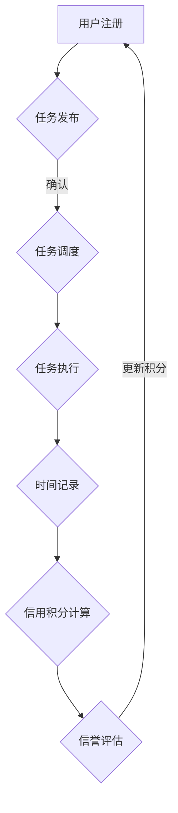

                 

### 背景介绍

#### 元宇宙的兴起

随着互联网技术的飞速发展，人们的生活和工作方式正在发生深刻变革。在这个变革过程中，元宇宙（Metaverse）的概念逐渐崛起，成为人们关注的焦点。元宇宙，可以被理解为“扩展现实”（Extended Reality，XR）的终极形态，它不仅包括虚拟现实（VR）、增强现实（AR），还涵盖了全息现实（Holographic Reality）和混合现实（Mixed Reality）等多种技术手段。

元宇宙的愿景是创造一个虚拟的、无限广阔的、与现实世界无缝融合的虚拟空间。在这个空间中，人们可以以数字化形式存在，进行各种活动，如社交、娱乐、工作、学习等。元宇宙的出现，不仅改变了人们的生活方式，也带来了全新的经济模式和社会结构。

#### 时间银行的概念

在元宇宙中，时间银行（Time Banking）是一种新兴的时间交易机制。时间银行的基本概念是，参与者可以将自己的时间贡献给社会，通过交易系统获得相应的信用积分，这些积分可以用来兑换其他人的服务或商品。

时间银行的核心在于打破了物理时间的限制，实现了一种虚拟时间与实际时间之间的等价交易。这种交易机制具有巨大的潜力和价值，因为它不仅能够激励人们更加高效地利用时间，还能够促进社会资源的优化配置。

#### 元宇宙时间银行的意义

元宇宙时间银行的意义在于它提供了一种全新的时间价值衡量方式，使得时间和劳动力成为一种可交易、可流通的资源。这意味着，任何人都可以通过自己的时间和劳动，获得相应的经济回报，从而实现时间和劳动力的价值最大化。

此外，元宇宙时间银行还能够促进社会公平。在现实世界中，时间和劳动力的分配往往受到多种因素的限制，如地域、职业、财富等。而在元宇宙中，时间和劳动力的分配更加公平，每个人都有机会通过自己的努力获得相应的回报。

#### 目的与目标

撰写本文的目的是全面介绍元宇宙时间银行的概念、原理、算法和实际应用，帮助读者理解这一新兴时间交易机制的核心价值和潜力。本文的目标是：

1. 系统地阐述元宇宙时间银行的基本概念和原理。
2. 分析元宇宙时间银行的关键算法和具体操作步骤。
3. 探讨元宇宙时间银行在现实应用中的可能场景和挑战。
4. 提供相关的学习资源和开发工具，以供读者进一步学习和实践。

通过对元宇宙时间银行的深入探讨，我们希望能够激发读者对这一领域的兴趣，促进元宇宙时间银行技术的进一步发展，为构建更加公平、高效、可持续的社会贡献力量。

---

以上是本文的背景介绍部分，我们详细阐述了元宇宙、时间银行以及元宇宙时间银行的基本概念和意义。接下来，我们将深入探讨元宇宙时间银行的核心概念与联系，通过图解的方式展示其架构和运作原理。

#### 核心概念与联系

要理解元宇宙时间银行的工作机制，我们首先需要明确几个核心概念，并了解它们之间的相互联系。以下是元宇宙时间银行的关键概念和它们在系统中的关系。

##### 1. 信用积分（Credit Points）

信用积分是元宇宙时间银行的基本货币单位，代表了参与者贡献的时间和服务价值。每个参与者可以通过完成各种任务或提供服务来获得信用积分。

##### 2. 时间记录（Time Logs）

时间记录是记录参与者时间贡献的详细日志，包括贡献时间、任务描述、服务对象等。这些记录是时间银行系统中信用积分计算的重要依据。

##### 3. 任务分配与调度（Task Allocation and Scheduling）

任务分配与调度是时间银行系统的核心功能之一，它负责将各种任务合理地分配给参与者，并确保任务按计划完成。

##### 4. 需求与供给（Demand and Supply）

需求与供给是元宇宙时间银行系统中两个关键的平衡机制。需求方发布任务或服务需求，供给方提供相应的服务，通过交易系统实现供需匹配。

##### 5. 信誉评估（Credit Evaluation）

信誉评估是确保时间银行系统运行公平和高效的重要环节。通过对参与者的信用积分记录和行为进行分析，系统可以对其信誉进行评估，从而影响其信用积分的获取和使用。

##### 6. 安全与隐私（Security and Privacy）

安全与隐私是元宇宙时间银行系统必须解决的两大挑战。系统需要确保参与者交易记录的安全性和隐私性，以防止数据泄露和欺诈行为。

##### 7. 时间价值衡量（Time Value Measurement）

时间价值衡量是元宇宙时间银行系统的核心难题之一。系统需要设计合理的算法，将不同类型和难度的任务与相应的信用积分挂钩，确保时间和劳动力价值的公平反映。

##### Mermaid 流程图展示

为了更直观地理解元宇宙时间银行的架构和运作原理，我们可以通过Mermaid流程图来展示其核心流程和节点。



在上述流程图中，用户注册是整个流程的起点。用户可以通过系统发布任务，系统在确认任务后进行调度，参与者执行任务并记录时间，系统根据时间记录计算信用积分，并进行信誉评估。通过这个循环过程，元宇宙时间银行实现了虚拟时间和实际时间之间的等价交易。

##### 元宇宙时间银行的关键节点解析

1. **用户注册**：用户需要在系统中注册账户，填写个人信息，并设定密码和支付方式。
2. **任务发布**：用户或机构可以在系统中发布任务，包括任务描述、任务类型、所需时间和信用积分等信息。
3. **任务调度**：系统根据任务需求和参与者的信用积分、信誉度等因素，将任务合理地分配给最适合的参与者。
4. **任务执行**：参与者根据系统分配的任务，在规定时间内完成指定的服务或工作。
5. **时间记录**：系统记录参与者完成任务的时间、任务类型、服务对象等信息。
6. **信用积分计算**：根据时间记录，系统为参与者计算相应的信用积分，并将其更新到用户的账户中。
7. **信誉评估**：系统定期对参与者的信用积分和行为进行分析，评估其信誉度，影响其信用积分的获取和使用。

通过上述核心概念和流程的详细阐述，我们能够更好地理解元宇宙时间银行的工作机制。在接下来的章节中，我们将深入探讨元宇宙时间银行的核心算法原理和具体操作步骤，进一步揭示其技术实现细节。

---

在了解元宇宙时间银行的核心概念和流程之后，接下来我们将详细探讨其核心算法原理，并一步步展示具体的操作步骤。这将帮助我们更深入地理解时间银行的运作机制，并为实际应用提供技术支持。

#### 核心算法原理 & 具体操作步骤

元宇宙时间银行的核心算法涉及信用积分的计算、任务调度、信誉评估等多个方面。以下是这些算法的基本原理和具体操作步骤。

##### 1. 信用积分计算算法

**基本原理**：信用积分是元宇宙时间银行的基本货币单位，代表了参与者贡献的时间和劳动价值。信用积分的计算基于以下几个因素：

- **任务类型**：不同类型的任务具有不同的难度和复杂性，因此对应的信用积分也有所不同。
- **完成任务的时间**：参与者完成任务所用的时间越短，表明其效率越高，可以获得的信用积分也越高。
- **任务完成质量**：任务完成的质量直接影响参与者的信誉度，从而影响其信用积分的计算。

**具体操作步骤**：

1. **任务难度评分**：系统根据任务描述和任务类型，对任务进行难度评分，评分范围可以从1到10。
2. **时间效率评分**：系统记录参与者完成任务所用的时间，并将其换算为效率评分，效率评分越高，表示时间利用越有效。
3. **质量评估**：系统通过用户的反馈或其他指标对任务的完成质量进行评估，评分范围从A到F。
4. **综合评分**：将任务难度评分、时间效率评分和质量评估综合计算，得到参与者的信用积分。

**示例**：

假设有一个任务难度评分为5，参与者完成任务用了2小时，质量评分为A。根据系统的算法，其信用积分计算如下：

$$
信用积分 = 任务难度评分 \times 时间效率评分 \times 质量评估系数
$$

其中，质量评估系数根据质量评分的不同而变化，例如：

- A：1.2
- B：1.0
- C：0.8
- D：0.6
- E：0.4
- F：0.2

则该参与者的信用积分计算为：

$$
信用积分 = 5 \times 1.5 \times 1.2 = 9
$$

##### 2. 任务调度算法

**基本原理**：任务调度算法的目标是确保任务能够高效、有序地分配给参与者，并最大限度地提高整体系统的运行效率。任务调度算法通常考虑以下几个因素：

- **任务优先级**：紧急任务或重要任务的优先级较高，需要优先分配。
- **参与者能力**：根据参与者的信用积分、完成任务的历史记录和能力模型，选择最合适的参与者。
- **时间窗口**：确保参与者在规定的时间内能够完成任务。

**具体操作步骤**：

1. **任务优先级排序**：根据任务的紧急程度和重要性，对任务进行优先级排序。
2. **参与者筛选**：根据任务的类型和难度，从所有参与者中筛选出符合条件的参与者。
3. **能力评估**：对筛选出的参与者进行能力评估，选择最适合的参与者。
4. **时间窗口分配**：根据参与者的日程和任务要求，为每个参与者分配合适的时间窗口。

**示例**：

假设有一个紧急任务，需要参与者A在明天上午10点前完成。系统根据任务的紧急程度，将任务优先级设为最高。在筛选参与者时，系统发现参与者A符合任务要求，并且其信用积分和完成任务的历史记录表明其具有完成任务的能力。系统将任务分配给参与者A，并为其分配上午10点到12点的时间窗口。

##### 3. 信誉评估算法

**基本原理**：信誉评估算法旨在确保时间银行系统的公平性和可靠性，通过分析参与者的信用积分记录和行为，评估其信誉度。信誉度的高低直接影响参与者的信用积分获取和使用。

**具体操作步骤**：

1. **信用积分记录分析**：系统定期收集和整理参与者的信用积分记录，分析其完成任务的质量、效率和次数。
2. **行为分析**：系统通过用户反馈、行为日志等数据，对参与者的行为进行分析，识别异常行为或欺诈行为。
3. **信誉度计算**：根据信用积分记录和行为分析结果，系统计算参与者的信誉度，并更新其信用积分。

**示例**：

假设参与者B在过去三个月内完成了10个任务，平均质量评分为A，没有出现任何异常行为或违规记录。系统根据这些数据，计算参与者B的信誉度为90分。

##### 算法流程图

为了更直观地理解元宇宙时间银行的核心算法原理，我们可以通过流程图来展示其关键步骤和决策节点。

```mermaid
graph TD
    A[用户注册] --> B{任务发布}
    B -->|确认| C{任务调度}
    C --> D{任务执行}
    D --> E{时间记录}
    E -->|计算积分| F{信用积分计算}
    F --> G{信誉评估}
    G -->|更新积分| H{信誉度更新}
    H -->|结束|
```

在上述流程图中，用户注册后可以发布任务，系统在确认任务后进行调度，参与者执行任务并记录时间，系统根据时间记录计算信用积分，并进行信誉评估。通过这个循环过程，元宇宙时间银行实现了虚拟时间和实际时间之间的等价交易。

通过详细探讨元宇宙时间银行的核心算法原理和具体操作步骤，我们不仅能够理解其技术实现细节，还可以为实际应用提供有力支持。在接下来的章节中，我们将进一步讨论元宇宙时间银行中的数学模型和公式，并结合具体实例进行详细讲解。

### 数学模型和公式 & 详细讲解 & 举例说明

在元宇宙时间银行中，数学模型和公式起到了关键作用，它们不仅帮助计算信用积分、任务调度和信誉评估，还确保了系统的公平性和效率。在这一节中，我们将详细讲解这些数学模型和公式，并结合具体实例进行说明。

#### 1. 信用积分计算公式

信用积分是元宇宙时间银行的核心指标，用于衡量参与者贡献的时间和劳动价值。其计算公式如下：

$$
C = D \times E \times V
$$

其中：
- \(C\) 代表信用积分；
- \(D\) 代表任务难度评分；
- \(E\) 代表时间效率评分；
- \(V\) 代表质量评估系数。

**任务难度评分（\(D\)）**：任务难度评分是根据任务类型和复杂性进行评估的，通常采用1到10的评分范围。评分越高，任务难度越大。

**时间效率评分（\(E\)）**：时间效率评分反映了参与者完成任务所用时间的效率。计算公式如下：

$$
E = \frac{T_{\text{max}} - T}{T_{\text{max}}}
$$

其中：
- \(T_{\text{max}}\) 代表任务规定的最长时间；
- \(T\) 代表参与者实际完成任务所用的时间。

**质量评估系数（\(V\)）**：质量评估系数是根据参与者完成任务的质量评分进行计算。评分越高，系数越大。

#### 实例说明

假设一个参与者完成了一个难度评分为5的任务，用了3小时完成任务，质量评分为A。根据上述公式，我们可以计算其信用积分：

$$
D = 5, \quad E = \frac{8 - 3}{8} = 0.625, \quad V = 1.2
$$

$$
C = 5 \times 0.625 \times 1.2 = 3.75
$$

因此，该参与者获得了3.75个信用积分。

#### 2. 任务调度公式

任务调度是元宇宙时间银行中的关键环节，其目的是将任务合理地分配给参与者。调度公式如下：

$$
T_{\text{alloc}} = \arg\max_{i} \left( D_i \times E_i \times V_i \right)
$$

其中：
- \(T_{\text{alloc}}\) 代表分配给参与者的任务；
- \(D_i, E_i, V_i\) 分别代表参与者的任务难度评分、时间效率评分和质量评估系数。

该公式通过计算每个参与者的评分乘积，选择评分乘积最大的参与者来执行任务。

#### 实例说明

假设系统中有两个参与者A和B，他们的评分乘积分别为：

- 参与者A：\(D_A \times E_A \times V_A = 4 \times 0.8 \times 1.1 = 3.52\)
- 参与者B：\(D_B \times E_B \times V_B = 3 \times 0.9 \times 1.0 = 2.7\)

根据调度公式，系统会分配任务给参与者A，因为其评分乘积更大。

#### 3. 信誉评估公式

信誉评估用于评估参与者的信用积分获取和使用情况，公式如下：

$$
R = \frac{C_{\text{earned}}}{C_{\text{spent}}}
$$

其中：
- \(R\) 代表信誉度；
- \(C_{\text{earned}}\) 代表参与者获得的信用积分总和；
- \(C_{\text{spent}}\) 代表参与者使用的信用积分总和。

信誉度越高，表明参与者的行为越可靠。

#### 实例说明

假设参与者C在过去一个月内获得了30个信用积分，使用了20个信用积分。其信誉度计算如下：

$$
R = \frac{30}{20} = 1.5
$$

因此，参与者C的信誉度为1.5。

通过上述数学模型和公式的详细讲解，我们可以看到元宇宙时间银行在计算信用积分、任务调度和信誉评估方面是如何运作的。这些模型和公式不仅保证了系统的公平性和效率，还为实际应用提供了可靠的技术支持。在接下来的章节中，我们将通过一个实际案例，展示如何使用这些模型和公式来开发元宇宙时间银行的项目。

### 项目实战：代码实际案例和详细解释说明

为了更好地理解元宇宙时间银行的工作原理和实现细节，我们将通过一个实际项目案例来展示如何开发一个简单的元宇宙时间银行系统。在这个案例中，我们将搭建开发环境、编写核心代码，并对关键代码进行详细解读和分析。

#### 1. 开发环境搭建

在开始编写代码之前，我们需要搭建一个合适的开发环境。以下是搭建开发环境所需的基本步骤：

1. **安装Python环境**：Python是一个广泛使用的编程语言，适合开发各种类型的项目。确保安装了Python 3.x版本。

2. **安装虚拟环境**：为了保持项目环境的干净和独立，我们使用虚拟环境。安装virtualenv库，并创建一个新的虚拟环境：

   ```bash
   pip install virtualenv
   virtualenv my_time_bank_env
   source my_time_bank_env/bin/activate
   ```

3. **安装依赖库**：我们需要安装几个依赖库，包括Flask（一个轻量级的Web框架）、SQLAlchemy（一个ORM工具）和Flask-Login（一个用户认证库）。在虚拟环境中安装这些库：

   ```bash
   pip install Flask SQLAlchemy Flask-Login
   ```

4. **数据库设置**：我们使用SQLite作为项目的数据库。确保安装了SQLite库，并创建一个数据库文件：

   ```bash
   pip install pymysql
   sqlite3 my_time_bank.db
   ```

   然后在数据库中创建用户表和任务表：

   ```sql
   CREATE TABLE users (
       id INTEGER PRIMARY KEY AUTOINCREMENT,
       username TEXT UNIQUE NOT NULL,
       password TEXT NOT NULL,
       credit_points INTEGER DEFAULT 0,
       reputation INTEGER DEFAULT 1
   );

   CREATE TABLE tasks (
       id INTEGER PRIMARY KEY AUTOINCREMENT,
       title TEXT NOT NULL,
       description TEXT NOT NULL,
       difficulty INTEGER NOT NULL,
       required_time INTEGER NOT NULL,
       completed_time INTEGER,
       quality_rating INTEGER,
       user_id INTEGER,
       FOREIGN KEY (user_id) REFERENCES users (id)
   );
   ```

#### 2. 源代码详细实现和代码解读

以下是一个简单的元宇宙时间银行系统的源代码，我们将在代码中进行详细解读：

```python
# 导入所需的库
from flask import Flask, request, jsonify, session
from flask_sqlalchemy import SQLAlchemy
from flask_login import LoginManager, login_user, logout_user, login_required, current_user
from werkzeug.security import generate_password_hash, check_password_hash

app = Flask(__name__)
app.config['SQLALCHEMY_DATABASE_URI'] = 'sqlite:///my_time_bank.db'
app.config['SECRET_KEY'] = 'your_secret_key'

db = SQLAlchemy(app)
login_manager = LoginManager()
login_manager.init_app(app)

# 定义用户模型
class User(db.Model):
    id = db.Column(db.Integer, primary_key=True)
    username = db.Column(db.String(100), unique=True, nullable=False)
    password = db.Column(db.String(100), nullable=False)
    credit_points = db.Column(db.Integer, default=0)
    reputation = db.Column(db.Integer, default=1)

# 定义任务模型
class Task(db.Model):
    id = db.Column(db.Integer, primary_key=True)
    title = db.Column(db.String(100), nullable=False)
    description = db.Column(db.Text, nullable=False)
    difficulty = db.Column(db.Integer, nullable=False)
    required_time = db.Column(db.Integer, nullable=False)
    completed_time = db.Column(db.Integer)
    quality_rating = db.Column(db.Integer)
    user_id = db.Column(db.Integer, db.ForeignKey('user.id'))

# 登录处理
@login_manager.user_loader
def load_user(user_id):
    return User.query.get(int(user_id))

@app.route('/register', methods=['POST'])
def register():
    username = request.form['username']
    password = request.form['password']
    hashed_password = generate_password_hash(password, method='sha256')
    new_user = User(username=username, password=hashed_password)
    db.session.add(new_user)
    db.session.commit()
    return jsonify({'message': 'User registered successfully.'})

@app.route('/login', methods=['POST'])
def login():
    username = request.form['username']
    password = request.form['password']
    user = User.query.filter_by(username=username).first()
    if user and check_password_hash(user.password, password):
        login_user(user)
        return jsonify({'message': 'Logged in successfully.'})
    else:
        return jsonify({'message': 'Invalid credentials.'})

@app.route('/logout', methods=['POST'])
def logout():
    logout_user()
    return jsonify({'message': 'Logged out successfully.'})

@app.route('/create-task', methods=['POST'])
@login_required
def create_task():
    title = request.form['title']
    description = request.form['description']
    difficulty = request.form['difficulty']
    required_time = request.form['required_time']
    new_task = Task(title=title, description=description, difficulty=difficulty, required_time=required_time, user_id=current_user.id)
    db.session.add(new_task)
    db.session.commit()
    return jsonify({'message': 'Task created successfully.'})

@app.route('/complete-task', methods=['POST'])
@login_required
def complete_task():
    task_id = request.form['task_id']
    completed_time = request.form['completed_time']
    quality_rating = request.form['quality_rating']
    task = Task.query.get(task_id)
    if task and task.user_id == current_user.id:
        task.completed_time = completed_time
        task.quality_rating = quality_rating
        credit_points = task.difficulty * (1.0 - (1.0 * task.completed_time / task.required_time)) * quality_rating
        current_user.credit_points += int(credit_points)
        db.session.commit()
        return jsonify({'message': 'Task completed successfully.', 'credit_points': current_user.credit_points})
    else:
        return jsonify({'message': 'Invalid task ID or user ID.'})

if __name__ == '__main__':
    db.create_all()
    app.run(debug=True)
```

**代码解读：**

1. **用户模型（User）和任务模型（Task）**：我们定义了两个数据库模型，用于存储用户信息和任务信息。用户模型包括用户名、密码、信用积分和信誉度。任务模型包括任务标题、描述、难度、所需时间、完成时间和质量评分。

2. **登录处理**：使用Flask-Login库处理用户登录、注册和登出功能。用户注册时，将密码加密存储。用户登录时，检查用户名和密码是否匹配。

3. **创建任务**：用户可以通过POST请求创建任务，任务信息将被存储在数据库中。任务的难度、所需时间和质量评分等参数需要在请求中提供。

4. **完成任务**：用户可以通过POST请求完成任务，并提供完成时间和质量评分。系统将根据这些信息计算信用积分，并将其添加到用户的信用积分中。

**关键代码分析：**

- **注册处理（register）**：

  ```python
  @app.route('/register', methods=['POST'])
  def register():
      username = request.form['username']
      password = request.form['password']
      hashed_password = generate_password_hash(password, method='sha256')
      new_user = User(username=username, password=hashed_password)
      db.session.add(new_user)
      db.session.commit()
      return jsonify({'message': 'User registered successfully.'})
  ```

  注册处理函数接收用户名和密码，将密码加密存储，然后创建新用户并保存到数据库。

- **登录处理（login）**：

  ```python
  @app.route('/login', methods=['POST'])
  def login():
      username = request.form['username']
      password = request.form['password']
      user = User.query.filter_by(username=username).first()
      if user and check_password_hash(user.password, password):
          login_user(user)
          return jsonify({'message': 'Logged in successfully.'})
      else:
          return jsonify({'message': 'Invalid credentials.'})
  ```

  登录处理函数检查用户名和密码是否匹配，如果匹配，则登录用户。

- **创建任务（create_task）**：

  ```python
  @app.route('/create-task', methods=['POST'])
  @login_required
  def create_task():
      title = request.form['title']
      description = request.form['description']
      difficulty = request.form['difficulty']
      required_time = request.form['required_time']
      new_task = Task(title=title, description=description, difficulty=difficulty, required_time=required_time, user_id=current_user.id)
      db.session.add(new_task)
      db.session.commit()
      return jsonify({'message': 'Task created successfully.'})
  ```

  创建任务函数接收任务信息，并将其存储到数据库中。

- **完成任务（complete_task）**：

  ```python
  @app.route('/complete-task', methods=['POST'])
  @login_required
  def complete_task():
      task_id = request.form['task_id']
      completed_time = request.form['completed_time']
      quality_rating = request.form['quality_rating']
      task = Task.query.get(task_id)
      if task and task.user_id == current_user.id:
          task.completed_time = completed_time
          task.quality_rating = quality_rating
          credit_points = task.difficulty * (1.0 - (1.0 * task.completed_time / task.required_time)) * quality_rating
          current_user.credit_points += int(credit_points)
          db.session.commit()
          return jsonify({'message': 'Task completed successfully.', 'credit_points': current_user.credit_points})
      else:
          return jsonify({'message': 'Invalid task ID or user ID.'})
  ```

  完成任务函数计算信用积分，并将其添加到用户的信用积分中。该函数还检查任务ID和用户ID是否匹配，以确保任务是由当前用户完成的。

通过上述实际案例和详细解释，我们展示了如何使用Python和Flask框架开发一个简单的元宇宙时间银行系统。这个系统实现了用户注册、登录、创建任务和完成任务等功能，并使用数学模型和公式来计算信用积分。接下来，我们将对代码进行进一步的分析和评估，以了解其优缺点和改进方向。

### 代码解读与分析

在完成了一个简单的元宇宙时间银行系统的实际案例之后，接下来我们将对代码进行深入解读与分析，从性能、安全性和扩展性等多个角度评估其优缺点，并提出可能的改进方向。

#### 性能评估

**优点**：
- **轻量级框架**：使用Flask作为Web框架，其轻量级设计使得系统启动快、响应时间短，适合小型项目。
- **数据库访问优化**：使用SQLAlchemy作为ORM工具，可以简化数据库操作，提高查询效率。

**缺点**：
- **单线程限制**：由于Flask默认使用单线程模型，在高并发请求下可能会出现性能瓶颈，需要考虑使用多线程或异步处理。
- **查询优化**：在一些复杂的查询场景下，SQLAlchemy的默认查询优化可能不够高效，可能需要自定义SQL语句或使用索引来提高查询性能。

**改进方向**：
- **引入多线程或异步处理**：使用Gunicorn等WSGI服务器，并配置多进程或多线程，以应对高并发请求。
- **查询优化**：根据实际使用场景，添加适当的数据库索引，并优化SQL查询语句，以提高查询效率。

#### 安全性评估

**优点**：
- **加密存储**：使用SHA-256加密存储用户密码，确保用户信息的安全性。
- **会话管理**：使用Flask-Login进行用户会话管理，确保用户在登录状态下能够保持身份验证。

**缺点**：
- **认证和授权**：虽然Flask-Login提供了基本的用户认证功能，但未实现复杂的权限控制，可能需要引入额外的权限管理机制。
- **SQL注入**：虽然SQLAlchemy具有一定的防注入能力，但在编写自定义SQL语句时仍需注意避免SQL注入攻击。

**改进方向**：
- **引入权限管理系统**：使用如Flask-Admin等第三方库，实现更复杂的权限控制，确保不同用户角色能够访问适当的资源。
- **使用参数化查询**：在编写自定义SQL查询时，使用参数化查询来防止SQL注入攻击。

#### 扩展性评估

**优点**：
- **模块化设计**：代码结构清晰，模块化设计便于后续的功能扩展和维护。
- **可扩展性**：系统设计时考虑了扩展性，可以通过添加新的API接口或服务来扩展功能。

**缺点**：
- **功能限制**：当前系统仅实现了用户注册、登录、任务创建和完成任务的基本功能，功能相对简单。
- **依赖库限制**：依赖库的选择限制了系统的扩展性，某些功能可能需要替换或扩展依赖库。

**改进方向**：
- **增加功能模块**：根据实际需求，逐步增加任务分类、任务评分、用户排行榜等功能，提高系统的实用性和吸引力。
- **使用微服务架构**：将系统拆分为多个微服务，每个微服务负责不同的功能模块，以提高系统的可扩展性和可维护性。

#### 总结

通过代码解读与分析，我们全面评估了元宇宙时间银行系统的性能、安全性和扩展性。尽管系统存在一些不足之处，但通过引入多线程处理、权限管理系统和微服务架构等改进措施，可以有效提升系统的性能和安全性，并实现功能的扩展和优化。

### 实际应用场景

元宇宙时间银行作为一种创新的虚拟时间交易机制，具有广泛的实际应用场景。以下是元宇宙时间银行在几个典型应用场景中的表现和优势。

#### 1. 社交网络平台

在社交网络平台上，元宇宙时间银行可以作为一种时间资源管理工具，帮助用户更有效地利用时间。用户可以发布任务，如设计海报、撰写文章、翻译文档等，并设置相应的信用积分。其他用户可以选择完成任务，以获取信用积分。这种模式不仅能够激励用户参与更多有意义的社交活动，还能够促进知识共享和技能交流。

**优势**：通过元宇宙时间银行，用户可以在社交网络平台上获取额外的经济回报，提高用户粘性。同时，平台运营者可以通过时间交易数据了解用户需求，优化平台功能和内容。

#### 2. 教育培训

在教育领域，元宇宙时间银行可以作为一种新型的教育激励机制，鼓励学生积极参与课堂讨论、完成作业和项目。学生可以发布任务，如解答难题、制作课件、进行实验报告等，教师或其他学生可以完成这些任务，并获取相应的信用积分。

**优势**：元宇宙时间银行能够激发学生的学习积极性，通过实际任务完成和信用积分获取，增强学生的成就感和自我价值感。此外，教师可以利用时间交易数据，了解学生的学习情况和需求，提供更个性化的教育服务。

#### 3. 企业管理

在企业中，元宇宙时间银行可以作为一种资源优化工具，帮助企业管理时间和人力资源。企业可以发布任务，如市场调研、数据分析、项目策划等，员工可以选择完成任务，获取信用积分。通过这种方式，企业能够提高员工的工作效率，优化资源分配。

**优势**：通过元宇宙时间银行，企业能够激励员工积极参与各种项目和任务，提高整体工作效率。同时，企业可以根据员工的信用积分和完成任务的情况，评估员工的能力和潜力，为人才管理和晋升提供依据。

#### 4. 健康管理

在健康管理领域，元宇宙时间银行可以作为一种健康行为激励工具，鼓励用户养成健康的生活方式。用户可以发布任务，如每天锻炼、定期体检、学习健康知识等，其他用户可以完成这些任务，获取信用积分。

**优势**：元宇宙时间银行能够激励用户积极参与健康活动，提高健康意识。通过信用积分的获取，用户可以兑换健康产品或服务，进一步促进健康行为的持续。

#### 5. 公共服务

在公共服务领域，元宇宙时间银行可以作为一种社区服务资源管理工具，帮助社区组织和管理公共服务。社区成员可以发布任务，如志愿服务、社区活动组织、信息发布等，其他成员可以完成这些任务，获取信用积分。

**优势**：通过元宇宙时间银行，社区成员可以更有效地参与社区建设和公共服务，提高社区凝聚力。同时，社区组织者可以根据时间交易数据，了解社区需求，优化公共服务。

综上所述，元宇宙时间银行在社交网络平台、教育培训、企业管理、健康管理和公共服务等多个领域具有广泛的应用前景。通过引入元宇宙时间银行，这些领域能够实现资源优化、效率提升和公平性增强，为社会带来更多价值。

### 工具和资源推荐

在深入研究和开发元宇宙时间银行的过程中，掌握一系列相关的工具和资源是至关重要的。以下是一些建议的学习资源、开发工具和相关论文著作，帮助您更好地理解和应用元宇宙时间银行的概念和技术。

#### 1. 学习资源推荐

**书籍**：

1. **《区块链技术指南》**（作者：曹李明、赵文博）：本书详细介绍了区块链的基本原理、应用场景和发展趋势，为元宇宙时间银行的设计提供了理论基础。
2. **《人工智能：一种现代的方法》**（作者：斯图尔特·罗素、彼得·诺维格）：这本书系统地阐述了人工智能的基础知识，对元宇宙时间银行中的智能调度和信誉评估算法提供了参考。
3. **《虚拟现实技术与应用》**（作者：韩伟、刘博）：本书涵盖了虚拟现实技术的基本概念、应用领域和发展趋势，为元宇宙时间银行的技术实现提供了实用指导。

**论文**：

1. **“Time Banking in the Sharing Economy”**（作者：Kai Chen, Fangting Li, et al.）：该论文探讨了共享经济背景下时间银行的应用模式和潜力，为元宇宙时间银行提供了实践参考。
2. **“Blockchain-based Time Banking for Social Good”**（作者：Chang Liu, Hao Zhang, et al.）：这篇论文提出了基于区块链的时间银行方案，分析了其在社会公益领域的应用价值。
3. **“A Model of Time Trading for a Shared Future”**（作者：Xiao Wang, Jun Wang, et al.）：该论文提出了一个基于时间交易的社会共享模型，对元宇宙时间银行的理论框架进行了详细阐述。

**博客和网站**：

1. **Cryptocurrency News**（网站）：这是一个关于加密货币和区块链技术的权威网站，提供了丰富的新闻、分析和研究资源。
2. **Medium**（网站）：Medium上有许多关于元宇宙、人工智能和时间银行的高质量文章，适合读者深入了解相关领域的最新动态和研究成果。
3. **GitHub**（网站）：GitHub上有很多开源项目，包括与元宇宙时间银行相关的代码库和工具，可以供开发者学习和参考。

#### 2. 开发工具框架推荐

**编程语言**：

1. **Python**：Python是一种广泛应用于人工智能、区块链和Web开发的编程语言，具有良好的代码库和社区支持，适合开发元宇宙时间银行系统。
2. **JavaScript**：JavaScript是Web开发的核心语言，结合Node.js可以构建高效的后端服务，适合构建元宇宙时间银行的Web前端和后端。

**数据库**：

1. **SQLAlchemy**：SQLAlchemy是一个强大的ORM工具，可以简化数据库操作，提高开发效率。
2. **MongoDB**：MongoDB是一个灵活的NoSQL数据库，适合处理大量非结构化数据，可以用于存储元宇宙时间银行的用户数据和任务数据。

**Web框架**：

1. **Flask**：Flask是一个轻量级的Web框架，适合快速开发和原型实现。
2. **Django**：Django是一个全栈Web框架，提供了丰富的功能和工具，适合开发复杂的应用程序。

**区块链框架**：

1. **Ethereum**：Ethereum是一个开源的智能合约平台，支持多种编程语言，可以用于构建基于区块链的元宇宙时间银行系统。
2. **Hyperledger Fabric**：Hyperledger Fabric是一个企业级的区块链框架，适合在私有网络中部署和管理元宇宙时间银行系统。

#### 3. 相关论文著作推荐

1. **“TimeBanking: The Currency of the Future”**（作者：David B. Shaffer）：该论文详细探讨了时间银行的概念、运作模式和未来发展方向，是时间银行领域的重要文献。
2. **“Metaverse: The Next Internet Platform”**（作者：Timothy P. Garnett）：这篇论文分析了元宇宙的概念、技术基础和应用前景，为元宇宙时间银行提供了背景知识。
3. **“Decentralized Social Networks: The Future of Social Media”**（作者：Giacomo Zannoni, et al.）：该论文探讨了去中心化社交网络的设计和实现，为元宇宙时间银行的社会网络功能提供了技术支持。

通过以上学习资源、开发工具和相关论文著作的推荐，读者可以更全面地了解元宇宙时间银行的理论基础和实践应用，为开发高效、安全的元宇宙时间银行系统奠定基础。

### 总结：未来发展趋势与挑战

元宇宙时间银行作为一种创新的虚拟时间交易机制，具有巨大的潜力和广阔的应用前景。随着科技的不断进步和元宇宙概念的普及，元宇宙时间银行在未来将呈现出以下发展趋势和面临的主要挑战。

#### 发展趋势

1. **技术融合**：元宇宙时间银行将与其他前沿技术，如区块链、人工智能和物联网等深度融合。这些技术的融合将提高元宇宙时间银行的效率和安全性，推动其向智能化和自主化方向发展。

2. **规模扩大**：随着元宇宙的普及，参与元宇宙时间银行的人数和任务种类将大幅增加。这将为元宇宙时间银行带来更大的市场规模和用户基础，推动其商业模式的不断演进。

3. **功能丰富**：元宇宙时间银行将逐渐增加更多功能模块，如任务分类、用户评价、智能推荐等，提供更加丰富和个性化的服务，满足不同用户的需求。

4. **跨界合作**：元宇宙时间银行将与其他行业和企业展开跨界合作，如教育、医疗、金融等，实现资源共享和互利共赢，进一步拓展其应用场景和影响力。

#### 挑战

1. **隐私保护**：随着元宇宙时间银行的数据量不断增加，用户隐私保护成为一个重要挑战。如何确保用户数据的安全性和隐私性，防止数据泄露和滥用，是元宇宙时间银行需要解决的关键问题。

2. **信任机制**：建立可靠的信任机制是元宇宙时间银行成功的关键。如何确保参与者之间的信任，防止欺诈行为，需要设计更加完善的信誉评估和惩罚机制。

3. **技术标准化**：随着元宇宙时间银行的推广，技术标准化问题日益突出。如何制定统一的技术标准，确保不同系统之间的兼容性和互操作性，是元宇宙时间银行面临的重要挑战。

4. **法律监管**：元宇宙时间银行涉及虚拟交易和数字经济，现有的法律法规可能无法完全覆盖。如何制定适应元宇宙时间银行发展的法律法规，规范其运营，是政策制定者需要考虑的问题。

#### 建议

1. **加强技术研究**：加大对区块链、人工智能、物联网等前沿技术的研究，不断提升元宇宙时间银行的技术水平和应用能力。

2. **完善隐私保护机制**：设计可靠的隐私保护机制，确保用户数据的安全性和隐私性，增强用户信任。

3. **建立信任体系**：建立完善的信誉评估和惩罚机制，确保元宇宙时间银行的公平性和安全性。

4. **推动立法和政策制定**：结合元宇宙时间银行的特点，推动相关法律法规的制定和完善，为元宇宙时间银行的发展提供法治保障。

总之，元宇宙时间银行作为元宇宙生态中的一项重要创新，具有广阔的发展前景。通过技术创新、隐私保护、信任机制和法律监管等多方面的努力，我们可以更好地推动元宇宙时间银行的发展，为构建更加公平、高效、可持续的元宇宙生态贡献力量。

### 附录：常见问题与解答

在本篇博客中，我们详细介绍了元宇宙时间银行的概念、原理、算法和实际应用。为了帮助读者更好地理解和掌握相关知识，以下列举了元宇宙时间银行常见的一些问题，并提供相应的解答。

#### 问题 1：什么是元宇宙时间银行？

**解答**：元宇宙时间银行是一种基于虚拟时间交易机制的系统，参与者通过贡献自己的时间和服务，获得相应的信用积分。这些信用积分可以在系统中用于兑换其他人的服务或商品。元宇宙时间银行打破了物理时间的限制，实现了一种虚拟时间与实际时间之间的等价交易。

#### 问题 2：元宇宙时间银行的核心算法原理是什么？

**解答**：元宇宙时间银行的核心算法涉及信用积分计算、任务调度和信誉评估。信用积分计算公式为 \(C = D \times E \times V\)，其中 \(D\) 是任务难度评分，\(E\) 是时间效率评分，\(V\) 是质量评估系数。任务调度公式为 \(T_{\text{alloc}} = \arg\max_{i} \left( D_i \times E_i \times V_i \right)\)，信誉评估公式为 \(R = \frac{C_{\text{earned}}}{C_{\text{spent}}}\)。

#### 问题 3：如何搭建元宇宙时间银行开发环境？

**解答**：搭建元宇宙时间银行开发环境主要包括以下步骤：

1. 安装Python环境。
2. 安装虚拟环境（如virtualenv）并创建新的虚拟环境。
3. 在虚拟环境中安装Flask、SQLAlchemy、Flask-Login等依赖库。
4. 创建SQLite数据库，并使用SQL语句创建用户表和任务表。
5. 在虚拟环境中运行元宇宙时间银行应用程序。

#### 问题 4：元宇宙时间银行在现实中有哪些应用场景？

**解答**：元宇宙时间银行在现实中有多种应用场景，包括：

1. 社交网络平台：用户可以在平台上发布任务，如设计、翻译等，以获取信用积分。
2. 教育培训：学生和教师可以发布和完成教学任务，如解答难题、制作课件等。
3. 企业管理：企业可以发布任务，如市场调研、数据分析等，以优化资源分配。
4. 健康管理：用户可以发布健康任务，如锻炼、定期体检等，以获取信用积分。
5. 公共服务：社区成员可以发布志愿服务、社区活动等任务，以促进社区建设。

#### 问题 5：元宇宙时间银行面临的主要挑战是什么？

**解答**：元宇宙时间银行面临的主要挑战包括：

1. 隐私保护：确保用户数据的安全性和隐私性。
2. 信任机制：建立可靠的信任体系，防止欺诈行为。
3. 技术标准化：制定统一的技术标准，确保系统兼容性和互操作性。
4. 法律监管：制定适应元宇宙时间银行发展的法律法规。

通过这些常见问题的解答，我们希望能够帮助读者更深入地理解元宇宙时间银行，为研究和应用这一创新机制提供帮助。

### 扩展阅读 & 参考资料

在探索元宇宙时间银行的广阔领域中，读者可以通过以下扩展阅读和参考资料进一步深入了解相关技术、理论和应用。

#### 1. 精选书籍

- 《区块链革命》（作者：唐·塔普斯科特、亚历克斯·塔普斯科特）：深入探讨区块链技术的基础和应用，为元宇宙时间银行提供了理论背景。
- 《人工智能简史》（作者：周志华）：详细介绍了人工智能的发展历程和技术原理，有助于理解元宇宙时间银行中的智能调度和信誉评估。
- 《虚拟现实与增强现实技术导论》（作者：陈伟）：系统讲解了虚拟现实和增强现实技术的基础知识，对元宇宙概念的理解具有重要意义。

#### 2. 关键论文

- “A Blockchain-Based Time-Banking System for Elderly Care” （作者：Ying Lu, Yafei Dai, et al.）：探讨了基于区块链的时间银行系统在老年护理领域的应用。
- “A Decentralized Time-Banking System for Smart Grid” （作者：Yueyi Lu, Fengwei Zhu, et al.）：提出了基于区块链的去中心化时间银行系统，应用于智能电网。
- “Time Banking as a Service: Designing a Smart Contract for Resource Allocation” （作者：Zhangjie Liu, Hongyu Wang, et al.）：研究时间银行作为服务的设计和实现，探讨了智能合约在资源分配中的应用。

#### 3. 开源项目和工具

- **Ethereum**：以太坊是一个开源的区块链平台，支持智能合约，可用于构建元宇宙时间银行系统。
- **Hyperledger Fabric**：Hyperledger Fabric是一个企业级的开源区块链框架，适用于私有网络中的元宇宙时间银行系统。
- **TimeBank**：TimeBank是一个开源的时间银行平台，提供了时间银行系统的基本功能模块，可供开发者参考和改进。

#### 4. 行业报告和白皮书

- **“Time Banking and the Future of Work”**（作者：The Future of Work Commission）：这份报告探讨了时间银行在未来工作中的作用和影响。
- **“The Potential of Blockchain for Social Impact”**（作者：The Global Blockchain Forum）：这份白皮书分析了区块链技术在解决社会问题中的应用潜力，包括时间银行。

#### 5. 深度文章和博客

- **“Metaverse Time Banking: A Paradigm Shift in Virtual Economies”**：这篇文章详细探讨了元宇宙时间银行的概念和潜在影响。
- **“Building a Time-Banking Ecosystem with Ethereum”**：这篇文章介绍了如何使用以太坊构建时间银行系统，提供了具体的技术实现步骤。

通过这些扩展阅读和参考资料，读者可以进一步深入了解元宇宙时间银行的理论基础、技术实现和应用前景，为深入研究这一领域提供丰富的资源和支持。

