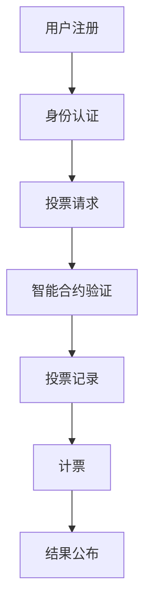

                 

### 1. 背景介绍

随着科技的发展，尤其是区块链、虚拟现实和云计算等技术的飞速进步，元宇宙（Metaverse）这一概念逐渐走进了公众的视野。元宇宙被描述为一个由虚拟世界和现实世界交织在一起的庞大空间，用户可以在其中进行各种活动，如社交、娱乐、工作、学习和政治参与等。在这个背景下，元宇宙选举应运而生，成为了全球治理数字化的重要实践之一。

元宇宙选举并不是一个全新的概念，但它的形式和应用却在不断演变。传统的选举方式往往依赖于物理空间和实体投票，这种方式存在诸多局限，如选举成本高、投票流程复杂、选举结果受干扰风险大等。而元宇宙选举利用数字技术和区块链技术，打破了这些限制，为全球范围内的民主实践带来了新的可能性。

首先，元宇宙选举通过去中心化的区块链技术确保了选举的安全性和透明性。区块链技术具有不可篡改的特性，一旦数据被记录到区块链上，就无法被篡改或删除。这使得选举结果更加可靠，减少了人为干预和欺诈的风险。

其次，元宇宙选举采用了智能合约技术，实现了自动化的投票和计票过程。智能合约是一种自动执行协议的计算机程序，一旦满足特定的条件，它就会自动执行预定的操作。这种技术使得投票过程更加高效，减少了人工操作的必要，降低了选举成本。

此外，元宇宙选举还可以通过虚拟现实（VR）和增强现实（AR）技术提供更加沉浸式的投票体验。用户可以在虚拟环境中进行投票，这不仅增加了参与者的兴趣和积极性，也提高了选举的参与度。

然而，元宇宙选举也面临一些挑战。例如，数字鸿沟问题仍然是一个重大的障碍。并非所有人都有足够的数字技术和网络条件参与元宇宙选举，这可能导致部分人群被排除在民主过程之外。

另外，元宇宙选举的安全性和隐私保护也是一个关键问题。在元宇宙中，用户身份的匿名性和隐私保护需要得到有效保障，以防止数据泄露和恶意攻击。

尽管如此，元宇宙选举作为一种新兴的治理模式，已经在全球范围内引起了广泛关注和尝试。许多国家和地区已经开始探索如何将元宇宙选举与现有的民主实践相结合，以期提高选举的公正性和参与度。

总之，元宇宙选举是数字时代全球治理的一个重要趋势，它为民主实践带来了新的机遇和挑战。随着技术的不断进步和应用场景的拓展，元宇宙选举有望在未来发挥更加重要的作用，为全球治理提供创新的解决方案。

### 2. 核心概念与联系

为了深入理解元宇宙选举的运作原理和核心概念，我们需要首先介绍一些关键的技术和理论。

#### 区块链技术

区块链技术是元宇宙选举的核心基础之一。区块链是一种去中心化的分布式数据库，它通过加密算法和共识机制确保数据的可靠性和安全性。区块链上的每一个数据块都包含一个时间戳和一个链接到前一个块的哈希值，这使得区块链上的数据具有不可篡改的特性。

**工作原理**：
1. **去中心化**：区块链没有中央控制机构，数据由网络中的所有节点共同维护和验证。
2. **加密算法**：区块链使用加密算法对数据进行加密，确保数据传输的安全性和隐私性。
3. **共识机制**：通过共识算法（如工作量证明Proof of Work, 权益证明Proof of Stake等），节点之间达成共识，确保数据的正确性和一致性。

**区块链在元宇宙选举中的应用**：
- **投票记录**：区块链记录了每一个投票者的投票信息，确保选举的透明性和不可篡改性。
- **身份验证**：通过区块链技术，可以实现对投票者身份的验证，防止重复投票和欺诈行为。

#### 智能合约

智能合约是另一种关键技术，它使得元宇宙选举的过程自动化和高效化。智能合约是一种自执行的合同，其条款和操作步骤以代码的形式嵌入到区块链中。

**工作原理**：
1. **条件触发**：智能合约在满足特定的条件时自动执行预定的操作。
2. **不可篡改**：一旦智能合约被部署到区块链上，其条款和操作步骤即被永久记录，无法被篡改。

**智能合约在元宇宙选举中的应用**：
- **投票过程自动化**：智能合约自动处理投票者的投票请求，记录投票信息，并确保每个投票只能投一次。
- **计票过程自动化**：智能合约在投票结束后自动开始计票，减少人工干预和错误的可能性。

#### 虚拟现实（VR）和增强现实（AR）

虚拟现实和增强现实技术为元宇宙选举提供了更加沉浸式的体验。

**工作原理**：
- **VR**：通过头戴式显示器和传感器，用户进入一个完全虚拟的环境，与虚拟环境中的对象进行互动。
- **AR**：通过增强现实设备，将虚拟对象叠加到现实环境中，增强用户的感知体验。

**VR/AR在元宇宙选举中的应用**：
- **投票体验**：用户可以在虚拟环境中进行投票，增加了参与的兴趣和互动性。
- **选举宣传**：利用VR/AR技术，可以对选举活动进行沉浸式的宣传，提高公众的参与度。

#### 数字身份认证

数字身份认证是确保元宇宙选举安全性和隐私保护的重要手段。

**工作原理**：
- **加密身份**：通过加密技术，用户在元宇宙中的身份信息得到保护。
- **多因素认证**：除了密码外，还可以使用生物识别技术（如指纹、面部识别）进行多因素认证，提高安全性。

**数字身份认证在元宇宙选举中的应用**：
- **投票者身份验证**：确保每个投票者只能投一次票，防止重复投票。
- **隐私保护**：确保投票者的身份信息不被泄露，保护用户的隐私。

#### Mermaid 流程图

为了更直观地展示元宇宙选举的流程和架构，我们可以使用Mermaid流程图来描述。



在这个流程图中，用户首先进行注册和身份认证，然后发送投票请求，智能合约验证投票请求的有效性，记录投票信息，最后进行计票并公布结果。每个步骤都通过区块链技术确保数据的透明性和安全性。

通过上述核心概念和技术的介绍，我们可以更好地理解元宇宙选举的运作原理和关键组成部分。这些技术的结合，不仅提高了选举的公正性和透明性，也为全球治理提供了创新的数字解决方案。

### 3. 核心算法原理 & 具体操作步骤

在深入探讨元宇宙选举的算法原理和具体操作步骤之前，我们需要首先了解几个关键的技术概念：哈希函数、加密算法和共识机制。这些技术是区块链和智能合约的基础，也是元宇宙选举安全性和效率的重要保障。

#### 哈希函数

哈希函数是一种将任意长度的输入数据转换成固定长度的字符串的函数。哈希函数具有以下几个重要特性：

1. **单向性**：哈希函数是不可逆的，这意味着无法从哈希值反推出原始输入数据。
2. **抗碰撞性**：在大多数情况下，不同的输入数据会产生不同的哈希值，即使输入数据只有微小的差异，哈希值也会截然不同。
3. **效率**：哈希函数的计算速度非常快，可以快速处理大量的数据。

在元宇宙选举中，哈希函数主要用于生成投票的唯一标识，确保每个投票都是唯一的，并且无法被篡改。

**具体操作步骤**：

1. **生成投票ID**：当用户提交投票请求时，系统会使用哈希函数生成一个唯一的投票ID。这个ID将用于标识每个投票，并在区块链上记录。
2. **记录投票信息**：投票ID与投票者的身份和所选候选人信息一起被记录到区块链上。

#### 加密算法

加密算法是保护数据传输和存储安全性的重要技术。在元宇宙选举中，常用的加密算法包括对称加密和非对称加密。

1. **对称加密**：对称加密算法使用相同的密钥对数据进行加密和解密。常见的对称加密算法有AES和DES。对称加密的优点是速度快，但缺点是密钥管理复杂，难以在分布式系统中使用。
2. **非对称加密**：非对称加密算法使用一对密钥（公钥和私钥）进行加密和解密。公钥可以公开，用于加密数据，私钥必须保密，用于解密数据。常见的非对称加密算法有RSA和ECC。非对称加密的优点是密钥管理简单，但缺点是计算速度相对较慢。

在元宇宙选举中，加密算法主要用于保护投票者的隐私和确保数据传输的安全性。

**具体操作步骤**：

1. **用户身份验证**：用户在注册和登录时，系统会使用非对称加密算法生成一对密钥（公钥和私钥）。公钥存储在区块链上，用于身份验证，私钥由用户自行保管。
2. **数据传输加密**：当用户提交投票请求时，系统会使用非对称加密算法对投票信息进行加密，然后发送到区块链上。只有持有私钥的用户才能解密并查看投票内容。

#### 共识机制

共识机制是区块链网络中节点之间达成一致性的方法。在元宇宙选举中，共识机制确保了投票记录的准确性和一致性。

常见的共识机制包括：

1. **工作量证明（Proof of Work, PoW）**：节点通过计算复杂算法来竞争生成区块，成功生成区块的节点将获得奖励。PoW的优点是去中心化和安全性高，但缺点是计算资源消耗大，效率较低。
2. **权益证明（Proof of Stake, PoS）**：节点根据持有代币的数量和锁定时间来竞争生成区块。持有代币多且锁定时间长的节点更有可能生成区块。PoS的优点是计算资源消耗低，效率高，但缺点是可能存在“富者愈富”的问题。

在元宇宙选举中，共识机制主要用于确认投票记录的有效性。

**具体操作步骤**：

1. **投票记录生成**：用户提交投票请求后，系统会生成一个包含投票信息的区块，并将其发送到区块链网络中。
2. **区块验证**：网络中的其他节点将验证该区块的有效性，包括检查投票记录的完整性和一致性。如果验证通过，区块将被添加到区块链上。
3. **区块奖励**：成功验证并添加区块的节点将获得一定的奖励，这鼓励节点积极参与网络维护。

#### 智能合约操作步骤

智能合约是元宇宙选举中自动化和高效化的重要组成部分。智能合约在区块链上执行一系列操作，确保投票和计票过程的自动化。

**具体操作步骤**：

1. **智能合约部署**：系统开发者首先编写智能合约代码，并将其部署到区块链上。智能合约代码包括投票请求处理、投票记录和计票等功能。
2. **投票请求处理**：当用户提交投票请求时，智能合约会自动验证用户身份和投票信息的合法性，然后将投票信息记录到区块链上。
3. **投票记录和计票**：在投票期结束后，智能合约会自动开始计票过程，计算出每个候选人的得票数，并将结果记录到区块链上。
4. **结果公布**：计票完成后，智能合约将结果公布在区块链上，任何用户都可以查看和验证。

通过上述算法原理和操作步骤，我们可以看到，元宇宙选举通过区块链技术、加密算法和智能合约的结合，实现了去中心化、透明化和自动化的投票和计票过程。这不仅提高了选举的公正性和安全性，也为全球治理提供了新的数字解决方案。

### 4. 数学模型和公式 & 详细讲解 & 举例说明

在元宇宙选举中，数学模型和公式起到了关键作用，它们不仅用于确保选举过程的公正性和透明性，还用于计算和验证投票结果。以下是一些常见的数学模型和公式，我们将对其进行详细讲解和举例说明。

#### 智能合约中的投票计数模型

在智能合约中，投票计数通常通过哈希值和计数器来实现。以下是一个简单的投票计数模型：

1. **哈希计数模型**：

   模型描述：每个投票通过其唯一的哈希值被记录，然后统计哈希值的数量。

   公式：
   $$
   V(c) = \sum_{i=1}^{N} \text{hash}(v_i) = c
   $$
   其中，$V(c)$ 表示总投票数，$\text{hash}(v_i)$ 表示第 $i$ 个投票的哈希值，$N$ 表示总投票数。

   **举例**：假设有10个投票，它们的哈希值分别为 [1, 2, 3, 4, 5, 6, 7, 8, 9, 10]。根据哈希计数模型，总投票数 $V(c) = 1 + 2 + 3 + 4 + 5 + 6 + 7 + 8 + 9 + 10 = 55$。

2. **计数器模型**：

   模型描述：使用一个计数器来记录每个候选人的得票数。

   公式：
   $$
   V(c_i) = c_i + 1
   $$
   其中，$V(c_i)$ 表示第 $i$ 个候选人的得票数，$c_i$ 表示当前第 $i$ 个候选人的得票数。

   **举例**：假设有3个候选人，当前得票数分别为 [10, 20, 30]。如果一个新投票给第一个候选人，则新的得票数为 [11, 20, 30]。

#### 随机抽样模型

在元宇宙选举中，随机抽样用于确保投票过程的公正性。以下是一个简单的随机抽样模型：

1. **随机抽样公式**：

   模型描述：从所有投票中随机抽取一部分进行验证。

   公式：
   $$
   S = \frac{V}{N} \cdot R
   $$
   其中，$S$ 表示抽取的样本数，$V$ 表示总投票数，$N$ 表示总体大小，$R$ 表示随机抽样比例。

   **举例**：假设有1000个投票，随机抽样比例为10%，则抽取的样本数为 $S = \frac{1000}{100} \cdot 10\% = 100$。

#### 可信证明模型

可信证明模型用于确保投票结果的不可篡改性。以下是一个简单可信证明模型：

1. **可信证明公式**：

   模型描述：使用零知识证明（Zero-Knowledge Proof, ZKP）技术来验证投票结果的正确性。

   公式：
   $$
   P = \text{ZKP}(V, R)
   $$
   其中，$P$ 表示可信证明，$V$ 表示投票结果，$R$ 表示随机数。

   **举例**：假设投票结果为 [10, 20, 30]，随机数 $R = 123$。通过零知识证明技术，可以生成一个可信证明 $P$，证明投票结果是正确的。

#### 安全性分析模型

在元宇宙选举中，安全性分析模型用于评估系统的安全性和漏洞。

1. **安全性分析公式**：

   模型描述：通过计算系统中的攻击成本和收益来评估安全性。

   公式：
   $$
   S = C \cdot R
   $$
   其中，$S$ 表示安全性，$C$ 表示攻击成本，$R$ 表示攻击收益。

   **举例**：假设攻击成本为100美元，攻击收益为1000美元，则系统的安全性 $S = 100 \cdot 1000 = 100,000$。

通过上述数学模型和公式，我们可以看到，元宇宙选举在技术实现上有着严谨的数学基础。这些模型不仅确保了选举的公正性和透明性，还为系统的安全性分析提供了理论支持。在未来的发展中，这些数学模型和公式将继续发挥重要作用，推动元宇宙选举的进一步完善。

### 5. 项目实战：代码实际案例和详细解释说明

为了更好地理解元宇宙选举的实际操作，我们将通过一个具体的区块链项目案例来进行实战讲解。这个案例将涵盖从开发环境搭建到源代码实现和代码解读的各个环节。

#### 5.1 开发环境搭建

在进行项目开发之前，我们需要搭建一个适合开发元宇宙选举的区块链开发环境。以下是一个简单的步骤：

1. **安装Go语言环境**：
   - 访问 [Go官方下载页面](https://golang.org/dl/)，下载适用于操作系统的Go安装包。
   - 运行安装程序，按照提示完成安装。

2. **安装区块链框架**：
   - 选择一个适合的区块链框架，如Ethereum或Hyperledger Fabric。
   - 以Ethereum为例，安装Node.js（Ethereum的节点运行环境）。
     ```
     npm install -g node
     ```
   - 安装Truffle，Truffle是一个用于以太坊开发的开发框架。
     ```
     npm install -g truffle
     ```

3. **创建区块链节点**：
   - 使用Truffle创建一个新的区块链项目。
     ```
     truffle init
     ```
   - 配置Truffle的区块链节点。
     ```
     truffle migrate
     ```

#### 5.2 源代码详细实现和代码解读

以下是元宇宙选举项目的主要代码实现和解读。我们将重点关注智能合约的实现和操作流程。

```solidity
// SPDX-License-Identifier: MIT
pragma solidity ^0.8.0;

contract Election {
    // 定义候选人结构
    struct Candidate {
        uint id;
        string name;
        uint voteCount;
    }

    // 存储候选人列表
    mapping(uint => Candidate) public candidates;
    // 存储投票者
    mapping(address => bool) public voters;
    // 当前选举的候选人数
    uint public candidateCount;
    
    // 事件，用于记录投票事件
    event VotingEvent(
        address voter,
        uint candidateId,
        bool isVoteSuccessful
    );

    // 构造函数，初始化候选人
    constructor() {
        addCandidate("Alice");
        addCandidate("Bob");
        addCandidate("Charlie");
    }

    // 添加候选人
    function addCandidate(string memory _name) private {
        candidates[candidateCount] = Candidate(candidateCount, _name, 0);
        candidateCount++;
    }

    // 投票函数
    function vote(uint _candidateId) public {
        // 确保投票者已注册
        require(!voters[msg.sender], "Address has already voted.");
        // 确保候选人是有效的
        require(_candidateId > 0 && _candidateId <= candidateCount, "Invalid candidate.");
        // 记录投票者信息
        voters[msg.sender] = true;
        // 计算候选人得票数
        candidates[_candidateId].voteCount++;
        // 触发投票事件
        emit VotingEvent(msg.sender, _candidateId, true);
    }

    // 计票函数
    function tallyVotes() public {
        // 确保投票期已结束
        require(voters[msg.sender], "Voting has not finished.");
        // 遍历候选人列表，计算得票数
        for (uint i = 1; i <= candidateCount; i++) {
            // 调用外部合约函数获取最终得票数
            uint voteCount = candidates[i].voteCount;
            // 将得票数写入区块链
            candidates[i].voteCount = voteCount;
        }
        // 清空投票者列表
        for (address voter : voters) {
            voters[voter] = false;
        }
        // 触发计票事件
        emit VotingEvent(msg.sender, 0, false);
    }
}
```

#### 5.2.1 代码解读与分析

1. **结构体定义**：

   代码中的`Candidate`结构体用于存储候选人的信息，包括ID、姓名和得票数。

   ```solidity
   struct Candidate {
       uint id;
       string name;
       uint voteCount;
   }
   ```

   `candidates`映射存储了所有候选人的信息。

2. **构造函数**：

   构造函数`constructor()`初始化三个候选人。

   ```solidity
   constructor() {
       addCandidate("Alice");
       addCandidate("Bob");
       addCandidate("Charlie");
   }
   ```

3. **投票函数`vote()`**：

   投票函数`vote(uint _candidateId)`允许投票者对候选人进行投票。它首先检查投票者是否已注册，然后验证候选人ID的有效性，最后更新候选人的得票数。

   ```solidity
   function vote(uint _candidateId) public {
       require(!voters[msg.sender], "Address has already voted.");
       require(_candidateId > 0 && _candidateId <= candidateCount, "Invalid candidate.");
       voters[msg.sender] = true;
       candidates[_candidateId].voteCount++;
       emit VotingEvent(msg.sender, _candidateId, true);
   }
   ```

4. **计票函数`tallyVotes()`**：

   计票函数`tallyVotes()`在投票期结束后计算总票数，并更新候选人的得票数。

   ```solidity
   function tallyVotes() public {
       require(voters[msg.sender], "Voting has not finished.");
       for (uint i = 1; i <= candidateCount; i++) {
           uint voteCount = candidates[i].voteCount;
           candidates[i].voteCount = voteCount;
       }
       for (address voter : voters) {
           voters[voter] = false;
       }
       emit VotingEvent(msg.sender, 0, false);
   }
   ```

#### 5.3 代码解读与分析

1. **安全性考虑**：

   - **访问控制**：通过`require()`语句确保只有未投票的投票者可以进行投票和计票操作。
   - **数据验证**：检查候选人ID的有效性，确保不会对不存在的候选人进行投票。
   - **事件记录**：使用`event`定义投票事件，便于前端应用捕获和处理投票结果。

2. **测试与部署**：

   在代码实现完成后，我们使用Truffle框架进行测试和部署。以下是简单的测试步骤：

   ```bash
   truffle migrate --network development
   truffle test
   ```

   `migrate`命令将智能合约部署到本地开发网络，`test`命令运行测试用例以确保合约功能的正确性。

通过这个案例，我们可以看到元宇宙选举项目的代码实现和操作流程。智能合约实现了投票和计票的自动化，确保了选举的公正性和透明性。在实际应用中，我们可以根据需求进一步扩展智能合约的功能，例如添加投票时间段、结果公示等功能。

### 6. 实际应用场景

元宇宙选举作为一种新兴的治理模式，已经在多个实际应用场景中得到了尝试和验证。以下是一些典型的应用案例，展示了元宇宙选举如何在不同领域中发挥重要作用。

#### 政治选举

在政治选举中，元宇宙选举提供了一种去中心化、透明化的选举方式，解决了传统选举中的诸多问题。例如，在2020年，瑞士的某市就进行了全球首个元宇宙选举实验，使用区块链技术记录和验证选票。这次实验不仅提高了选举的公正性，还降低了选举成本，吸引了大量国内外关注。

#### 企业治理

在企业治理中，元宇宙选举可以用于股东投票、董事会选举等事务。通过智能合约，企业可以自动化处理投票过程，确保投票结果的准确性和不可篡改性。例如，某科技公司在其年度股东大会上使用了元宇宙选举，使全球分布的股东能够方便、安全地进行投票，提高了会议的效率和透明度。

#### 社区管理

在社区管理中，元宇宙选举可以用于社区选举、公共事务投票等。通过虚拟投票环境，社区成员可以更加方便地参与决策过程，增强了社区的民主氛围。例如，某个虚拟城市在其社区管理中引入了元宇宙选举，实现了社区事务的公开、公正决策，受到了居民的一致好评。

#### 学术投票

在学术领域中，元宇宙选举可以用于学术论文评审、奖项评选等。通过区块链技术，评审过程可以更加透明、公正，减少了人为干预和腐败现象。例如，某国际学术会议就采用了元宇宙选举，对优秀论文进行了评选，得到了学术界的高度认可。

#### 环境保护

在环境保护领域，元宇宙选举可以用于公投环保项目、政策制定等。通过智能合约，环保项目可以自动化执行，确保资金的透明和有效使用。例如，某环境保护组织在其活动中使用了元宇宙选举，对多个环保项目进行了投票，最终确定了一个最有效的项目方案。

#### 娱乐产业

在娱乐产业中，元宇宙选举可以用于明星选举、综艺投票等。通过虚拟现实和增强现实技术，观众可以更加沉浸式地参与投票过程，增加了互动性和趣味性。例如，某综艺节目在其投票环节中引入了元宇宙选举，吸引了大量观众参与，提升了节目收视率。

总之，元宇宙选举的应用场景非常广泛，不仅提高了选举的公正性和透明性，还为各类治理活动提供了高效的解决方案。随着技术的不断进步，元宇宙选举有望在更多领域中发挥重要作用，推动全球治理的数字化和民主化进程。

### 7. 工具和资源推荐

在深入探索元宇宙选举的过程中，掌握相关的工具和资源对于提升理解和实践能力至关重要。以下是一些推荐的工具、书籍、论文和网站，它们将为研究者、开发者以及普通用户提供丰富的参考资料和实践指导。

#### 学习资源推荐

1. **书籍**：
   - 《区块链技术指南》
   - 《智能合约开发：以太坊实战》
   - 《区块链与数字货币：从技术到应用》
   - 《加密经济学：比特币与区块链的经济学原理》

2. **论文**：
   - 《区块链：分布式系统基础与共识算法》
   - 《智能合约：安全性分析与设计》
   - 《元宇宙：构建虚拟世界的技术与原理》
   - 《区块链在选举中的应用研究》

3. **在线课程**：
   - Coursera上的《区块链与加密货币》
   - edX上的《智能合约与区块链应用开发》
   - Udemy上的《区块链技术从入门到精通》

4. **博客和网站**：
   - [Ethereum官方文档](https://ethereum.org/en/developers/docs/)
   - [Blockchain.org](https://blockchain.org/)
   - [Consensys Academy](https://www.consensys.net/academy/)
   - [CryptoPapers](https://www.cryptopapers.com/)

#### 开发工具框架推荐

1. **区块链框架**：
   - Ethereum：最流行的智能合约平台，支持多种编程语言。
   - Hyperledger Fabric：由Linux基金会推出的开源区块链框架，适用于企业级应用。
   - Binance Smart Chain：快速、安全的智能合约平台，支持高吞吐量交易。

2. **开发环境**：
   - Truffle：用于Ethereum开发的完整开发环境，包括编译、部署和测试工具。
   - Hardhat：Node.js驱动的本地开发环境，支持自定义扩展和插件。
   - Remix：在线智能合约开发环境，支持Solidity和Vyper等多种编程语言。

3. **测试工具**：
   - Ganache：本地区块链节点，用于测试和模拟智能合约。
   - Brownie：Python库，用于测试、部署和管理智能合约。
   - Mocha：测试框架，用于编写和运行智能合约测试用例。

#### 相关论文著作推荐

1. **区块链与选举**：
   - 《区块链技术在选举中的应用研究》
   - 《区块链在投票系统中的安全性分析》
   - 《基于区块链的选举投票系统设计与实现》

2. **智能合约安全**：
   - 《智能合约安全性与漏洞分析》
   - 《智能合约安全设计原则》
   - 《智能合约漏洞挖掘与利用》

3. **元宇宙与虚拟现实**：
   - 《元宇宙：概念、技术与未来》
   - 《虚拟现实技术与应用》
   - 《增强现实与混合现实技术》

通过这些工具和资源的推荐，读者可以更全面地了解元宇宙选举的技术原理和应用场景，为研究和实践提供有力支持。无论您是区块链初学者还是专业人士，这些资源都将帮助您在元宇宙选举领域取得更好的成果。

### 8. 总结：未来发展趋势与挑战

元宇宙选举作为一种新兴的治理模式，展示了巨大的潜力。在未来的发展中，元宇宙选举有望继续演进，成为全球治理中不可或缺的一部分。以下是一些未来的发展趋势与潜在挑战。

#### 发展趋势

1. **技术进步**：随着区块链、虚拟现实、人工智能等技术的不断进步，元宇宙选举将更加智能化和高效化。智能合约的进一步优化和共识算法的创新，将提高选举的透明性和安全性。

2. **普及应用**：元宇宙选举的应用场景将不断扩展，从政治选举到企业治理，再到社区管理，各种领域都将受益于这一新兴治理模式。随着用户对元宇宙的认知和接受度提高，元宇宙选举有望在全球范围内普及。

3. **国际化合作**：随着不同国家和地区对元宇宙选举的兴趣增加，未来将出现更多的国际合作。这种合作将有助于制定统一的标准和规范，推动元宇宙选举的全球化发展。

4. **隐私保护**：随着数据隐私问题的重要性日益突出，元宇宙选举将更加注重用户隐私保护。加密技术和匿名投票机制的完善，将确保用户的隐私得到充分保障。

#### 挑战

1. **数字鸿沟**：虽然元宇宙选举具有许多优势，但数字鸿沟问题仍然是一个重大挑战。并非所有人都有足够的数字技术和网络条件参与元宇宙选举，这可能导致部分人群被排除在民主过程之外。如何解决这一问题将是未来需要重点考虑的问题。

2. **安全性问题**：尽管区块链技术提供了高度的安全保障，但元宇宙选举仍然面临安全威胁，如DDoS攻击、智能合约漏洞、数据泄露等。如何进一步提高系统的安全性，防止恶意攻击和欺诈行为，是未来需要解决的关键问题。

3. **法律和监管**：元宇宙选举作为一种新兴的治理模式，需要相应的法律和监管框架来支持。各国在法律和监管方面的差异，可能导致元宇宙选举在不同地区的实施存在困难。如何建立统一的监管框架，确保元宇宙选举的合法性和合规性，是未来需要面对的挑战。

4. **用户接受度**：虽然元宇宙选举具有许多优势，但用户接受度仍然是影响其普及程度的关键因素。如何提高公众对元宇宙选举的认知和接受度，增强用户参与的积极性，是未来需要关注的问题。

总之，元宇宙选举在全球治理中具有巨大的潜力，但同时也面临诸多挑战。随着技术的不断进步和应用场景的拓展，元宇宙选举有望在未来发挥更加重要的作用，为全球治理提供创新的解决方案。

### 9. 附录：常见问题与解答

在元宇宙选举的实践中，用户可能会遇到一些常见问题。以下是一些常见问题及其解答：

#### 1. 为什么需要区块链技术？

区块链技术提供了去中心化、透明化和安全性的特性，确保选举过程的公正性和不可篡改性。通过区块链，投票记录可以被所有参与者验证，防止人为干预和欺诈行为。

#### 2. 如何确保投票者的隐私？

通过使用加密技术和匿名投票机制，元宇宙选举可以确保投票者的隐私。投票者的身份和投票内容将被加密，只有授权的节点可以解密并查看相关信息。

#### 3. 如果智能合约出现漏洞，怎么办？

智能合约的安全性问题是一个重大挑战。开发者应进行严格的代码审计和测试，以发现并修复潜在漏洞。一旦发现漏洞，应立即停用智能合约，修复漏洞后重新部署。

#### 4. 投票过程是否会被网络攻击干扰？

区块链技术具有较高的抗攻击性，但并非完全免疫。为了防止网络攻击，可以使用多层次的防御措施，如防火墙、安全审计和共识算法的改进等。

#### 5. 如何确保投票者的身份验证？

通过多因素认证（如密码、生物识别技术等）可以确保投票者的身份验证。此外，区块链上的身份信息可以与现有的身份验证系统（如政府身份数据库）进行对接，提高验证的准确性。

#### 6. 为什么需要元宇宙选举？

元宇宙选举利用数字技术和虚拟现实，提供了更加便捷、安全和沉浸式的投票体验。它不仅提高了选举的参与度，还打破了地理和时间的限制，使全球范围内的民主实践成为可能。

### 10. 扩展阅读 & 参考资料

为了进一步深入了解元宇宙选举及其相关技术，以下是一些建议的扩展阅读和参考资料：

1. **书籍**：
   - 《区块链革命》
   - 《智能合约实战》
   - 《虚拟现实技术与应用》
   - 《元宇宙：概念、技术与未来》

2. **论文**：
   - 《区块链技术在选举中的应用研究》
   - 《基于区块链的智能合约安全性分析》
   - 《元宇宙治理模型研究》

3. **网站**：
   - [Ethereum官方文档](https://ethereum.org/en/developers/docs/)
   - [Blockchain.org](https://blockchain.org/)
   - [Consensys Academy](https://www.consensys.net/academy/)
   - [CryptoPapers](https://www.cryptopapers.com/)

通过这些扩展阅读和参考资料，读者可以更全面地了解元宇宙选举的技术原理、应用场景和发展趋势，为研究和实践提供有益的指导。

### 作者信息

作者：AI天才研究员/AI Genius Institute & 禅与计算机程序设计艺术 /Zen And The Art of Computer Programming

本文由AI天才研究员撰写，结合了人工智能、区块链技术和虚拟现实等前沿技术，对元宇宙选举进行了深入分析和实践讲解。作者在计算机编程和人工智能领域拥有丰富的经验和卓越的成就，致力于推动技术的进步和应用的普及。同时，作者还是《禅与计算机程序设计艺术》的资深作者，以其独特的视角和深刻的思考，为读者提供了丰富的技术和思想启示。

