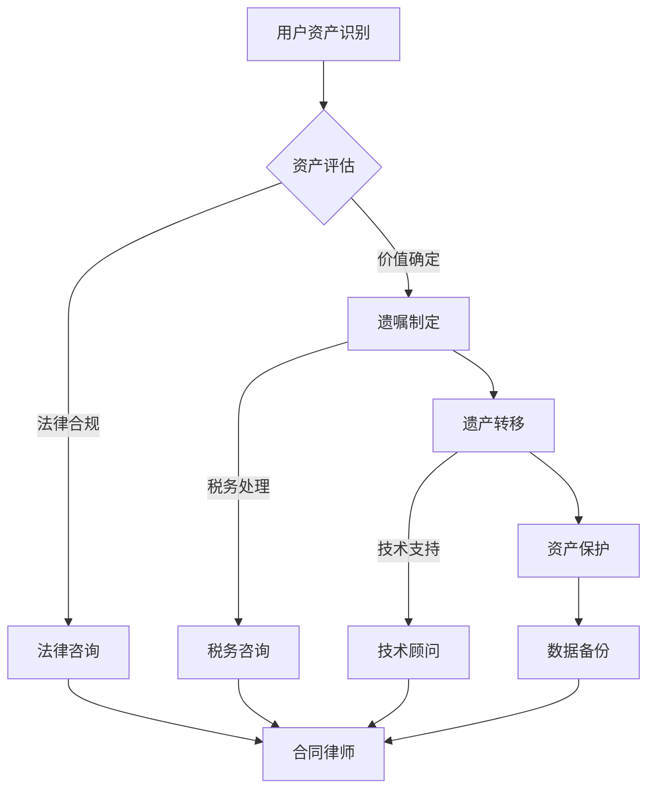

                 

### 背景介绍

#### 元宇宙遗产规划的概念

随着互联网和虚拟技术的飞速发展，元宇宙（Metaverse）逐渐从科幻走向现实。元宇宙是一个集成了虚拟现实（VR）、增强现实（AR）、区块链技术、人工智能（AI）等多种前沿科技的综合虚拟世界。在这个世界中，人们不仅可以通过数字化的方式交互，还可以拥有和传承属于自己的虚拟资产，如虚拟地产、虚拟物品、虚拟身份等。

然而，随着元宇宙的普及，遗产规划问题逐渐凸显。如何在元宇宙中有效地管理和传承虚拟资产，成为了一个亟待解决的问题。虚拟资产的代际传承，不仅关乎个人的财富与身份，更涉及到元宇宙的可持续发展和社会伦理。

#### 虚拟资产的重要性

虚拟资产在元宇宙中具有独特的地位和作用。首先，虚拟资产是元宇宙经济的基石，是用户之间进行交易和价值流转的重要媒介。例如，虚拟地产可以用于开设虚拟商店、举办虚拟活动等，从而创造经济价值。其次，虚拟资产是用户身份和信誉的重要体现。在元宇宙中，用户的虚拟身份和所拥有的虚拟物品往往代表了他们在虚拟世界中的地位和声望。最后，虚拟资产具有独特的艺术和文化价值。许多虚拟物品和艺术作品在元宇宙中具有独特的审美和收藏价值，成为用户表达个性和文化认同的重要方式。

#### 遗产规划面临的挑战

尽管虚拟资产在元宇宙中具有重要意义，但其在遗产规划方面面临着诸多挑战。首先，虚拟资产的法律地位不明确。在现实世界中，遗产规划依赖于法律体系，而元宇宙中的虚拟资产如何继承和转移尚无明确法律规定。其次，虚拟资产的鉴定和评估较为复杂。虚拟资产的价值往往受市场需求、稀缺性等因素影响，难以进行准确的评估和定价。此外，虚拟资产的传承过程中还涉及到技术支持和数据安全等问题。

#### 遗产规划的意义

面对这些挑战，进行元宇宙遗产规划具有重要的现实意义。首先，有效的遗产规划可以确保虚拟资产在代际之间的顺利传承，维护用户的合法权益。其次，元宇宙遗产规划有助于促进虚拟资产的合理利用，避免资源浪费。最后，通过遗产规划，可以推动元宇宙的可持续发展，构建公平、公正的虚拟社会。

总之，元宇宙遗产规划是一个涉及技术、法律、伦理等多个领域的复杂问题。随着元宇宙的不断发展，我们需要积极探索有效的解决方案，以应对未来的挑战。本文将围绕虚拟资产的代际传承，探讨元宇宙遗产规划的关键问题，并提出相应的策略和建议。

#### 当前研究的现状

尽管元宇宙遗产规划问题备受关注，但当前相关研究尚处于初步阶段。在学术领域，国内外学者对虚拟资产的法律地位、鉴定评估方法、数据安全性等方面进行了探讨，并提出了一系列理论框架和解决方案。然而，这些研究主要集中在概念层面，缺乏实际操作和验证。

在实践方面，一些企业和研究机构开始尝试构建元宇宙遗产规划的具体方案。例如，某些区块链平台提出了虚拟资产转移和继承的智能合约设计，试图通过技术手段解决法律和操作问题。然而，这些方案在实际应用中仍存在诸多挑战，如技术门槛高、操作复杂等问题，尚未得到广泛推广。

此外，元宇宙遗产规划还涉及到社会伦理和文化传承等方面的考量。如何在尊重个人隐私和权益的同时，实现虚拟资产的合理传承，是一个亟待解决的社会问题。当前的研究尚未充分考虑到这些因素，需要在理论和实践中进一步探索和完善。

总体而言，尽管元宇宙遗产规划问题具有重大现实意义，但当前研究仍处于起步阶段，需要更多的理论探讨和实践验证。本文将在此基础上，结合实际案例和最新研究成果，探讨元宇宙遗产规划的具体策略和实施方法。

#### 未来发展趋势

随着元宇宙技术的不断成熟和应用场景的拓展，元宇宙遗产规划在未来将面临前所未有的发展机遇。以下是对未来发展趋势的展望：

1. **技术进步推动遗产规划智能化**：随着人工智能、大数据和区块链等技术的不断发展，元宇宙遗产规划将变得更加智能化和自动化。智能合约和分布式账本技术的应用，将使得虚拟资产的转移和继承过程更加高效和透明。此外，虚拟现实和增强现实技术的进步，将为遗产规划提供更加直观和便捷的操作界面。

2. **法律体系逐步完善**：随着元宇宙遗产规划问题的日益突出，各国政府和国际组织将逐步完善相关法律法规。例如，针对虚拟资产的法律地位、继承权、税收等方面，制定明确的法规，以保障用户的合法权益。这将为元宇宙遗产规划提供坚实的法律基础。

3. **社会共识逐步形成**：随着元宇宙的普及，公众对虚拟资产的价值和传承问题的认识将逐步提高。通过教育和宣传，社会将形成更加普遍的共识，认同虚拟资产在个人和社会生活中的重要地位。这将为元宇宙遗产规划的推广和实施创造良好的社会环境。

4. **新兴行业涌现**：元宇宙遗产规划将催生一系列新兴行业，如虚拟资产评估师、遗产规划咨询师、虚拟资产托管平台等。这些行业将为元宇宙用户提供专业的服务，确保虚拟资产的合理管理和传承。

5. **跨领域合作加强**：元宇宙遗产规划涉及多个领域，包括法律、金融、科技、文化等。未来，不同领域的专家将加强合作，共同探索解决方案，推动元宇宙遗产规划的全面发展。

总之，随着元宇宙技术的不断进步和社会的广泛参与，元宇宙遗产规划将迎来新的发展机遇。我们需要密切关注这些趋势，积极探索和创新，为元宇宙的可持续发展贡献力量。

### 2. 核心概念与联系

#### 元宇宙遗产规划的定义

元宇宙遗产规划是指通过科学、合理的方法，对用户在元宇宙中拥有的虚拟资产进行管理、评估、保护和传承的过程。它涵盖了虚拟地产、虚拟物品、虚拟身份等虚拟资产的所有权转移、继承、保护等多个方面。元宇宙遗产规划的核心目标是确保虚拟资产在用户去世或丧失行为能力后，能够顺利地传承给继承人，并保持其价值。

#### 虚拟资产的类型

元宇宙中的虚拟资产类型丰富多样，主要包括以下几类：

1. **虚拟地产**：用户在元宇宙中购买的虚拟土地、建筑物或其他房地产资产。
2. **虚拟物品**：用户在元宇宙中获得的虚拟商品，如虚拟衣物、饰品、艺术品等。
3. **虚拟身份**：用户在元宇宙中的虚拟形象、昵称、个人资料等。
4. **虚拟货币**：在元宇宙内部流通的数字货币，如虚拟游戏币、元宇宙专用币等。
5. **虚拟服务等**：用户在元宇宙中提供的虚拟服务，如虚拟导游、虚拟教师、虚拟医生等。

#### 元宇宙遗产规划的相关利益相关者

元宇宙遗产规划涉及多个利益相关者，包括：

1. **用户**：元宇宙中的虚拟资产所有者，他们需要对虚拟资产进行管理和规划。
2. **继承人**：在用户去世或丧失行为能力后，有权继承虚拟资产的个人或组织。
3. **虚拟资产评估师**：专业从事虚拟资产评估的人员，为继承人提供资产价值评估服务。
4. **遗产规划师**：为用户提供遗产规划咨询和服务的人员。
5. **虚拟资产托管平台**：提供虚拟资产存储、转移、继承等服务的平台。

#### 元宇宙遗产规划与传统遗产规划的异同

元宇宙遗产规划与传统遗产规划有许多相似之处，也存在一些显著差异：

1. **相似之处**：
   - 目标：确保遗产顺利传承。
   - 法律地位：都涉及到法律体系的适用。
   - 伦理考量：都需要平衡个人权益和社会责任。

2. **差异**：
   - 资产类型：传统遗产主要涉及现实资产，如房产、车辆、股票等；元宇宙遗产则包括虚拟资产。
   - 评估与鉴定：传统遗产的评估和鉴定较为直观，而元宇宙遗产的评估和鉴定更加复杂。
   - 技术应用：元宇宙遗产规划需要依赖区块链、人工智能等先进技术。

#### 元宇宙遗产规划的关键环节

元宇宙遗产规划主要包括以下几个关键环节：

1. **资产识别**：明确用户在元宇宙中拥有的虚拟资产类型和数量。
2. **资产评估**：对虚拟资产进行科学、公正的评估，确定其市场价值。
3. **遗嘱制定**：用户通过遗嘱明确虚拟资产的继承人和分配方式。
4. **遗产转移**：在用户去世后，将虚拟资产按照遗嘱或法定继承程序进行转移。
5. **资产保护**：确保虚拟资产在转移过程中的安全性和完整性。

#### 核心概念原理与架构的 Mermaid 流程图

以下是元宇宙遗产规划的核心概念原理与架构的 Mermaid 流程图，用于更直观地展示虚拟资产的管理和传承过程：



#### 虚拟资产管理的难点和挑战

元宇宙遗产规划在虚拟资产管理过程中面临许多难点和挑战，主要包括：

1. **资产类型多样**：虚拟资产的类型繁多，包括地产、物品、身份、货币和服务等，每种资产的评估和管理方式不同，增加了规划难度。
2. **价值波动性大**：虚拟资产的价值受市场需求、稀缺性等因素影响，波动性较大，给资产评估和定价带来挑战。
3. **技术门槛高**：元宇宙遗产规划需要依赖区块链、人工智能等先进技术，对规划者的技术能力要求较高。
4. **法律体系不完善**：虚拟资产的法律地位和继承权尚未得到明确的法律规定，缺乏法律保障。
5. **数据安全风险**：虚拟资产的数据安全风险较高，需要确保在转移和存储过程中的安全性。

### 3. 核心算法原理 & 具体操作步骤

#### 元宇宙遗产规划算法概述

元宇宙遗产规划算法是基于区块链和智能合约技术，实现对虚拟资产的自动化管理和传承。其核心原理是通过编写智能合约，将用户的遗产规划意愿编码到区块链上，确保在用户去世后，虚拟资产能够按照遗嘱或法定程序自动转移给继承人。

#### 算法架构

元宇宙遗产规划算法主要包括以下几个模块：

1. **用户身份验证模块**：用于确认用户身份，确保只有合法用户可以进行资产管理和规划。
2. **资产信息录入模块**：用于录入用户的虚拟资产信息，包括资产类型、数量、价值等。
3. **遗嘱制定模块**：用户通过智能合约制定遗嘱，明确虚拟资产的继承人和分配方式。
4. **智能合约执行模块**：在用户去世后，智能合约自动执行，将虚拟资产转移给继承人。
5. **资产保护模块**：通过加密和备份技术，确保虚拟资产在转移过程中的安全性和完整性。

#### 算法实现步骤

以下是元宇宙遗产规划算法的具体实现步骤：

1. **用户注册与身份验证**：
   - 用户在元宇宙平台注册账号，并通过区块链身份验证服务确认身份。
   - 系统记录用户身份信息和公钥，用于后续交易和操作。

2. **资产信息录入**：
   - 用户通过智能合约录入其在元宇宙中的虚拟资产信息，包括资产类型、数量、价值等。
   - 系统将这些信息存储在区块链上，确保透明和不可篡改。

3. **遗嘱制定**：
   - 用户通过智能合约制定遗嘱，明确虚拟资产的继承人和分配方式。
   - 遗嘱内容在区块链上透明公示，确保公开和公正。

4. **智能合约执行**：
   - 当用户去世，系统自动触发智能合约执行。
   - 智能合约根据遗嘱内容，将虚拟资产转移给继承人。
   - 交易记录在区块链上永久保存，确保透明和可追溯。

5. **资产保护**：
   - 系统采用加密技术，保护虚拟资产在转移过程中的安全性。
   - 资产备份到分布式节点，确保数据完整性和可靠性。

#### 算法优势

元宇宙遗产规划算法具有以下优势：

1. **自动化**：智能合约自动执行，降低人工干预，提高效率。
2. **透明性**：所有交易记录在区块链上透明公示，确保公开和公正。
3. **安全性**：加密技术和分布式节点确保数据安全。
4. **可追溯性**：区块链技术确保交易记录永久保存，可追溯。

#### 案例分析

以下是一个元宇宙遗产规划的案例：

- **用户A**在元宇宙中拥有虚拟地产、虚拟物品和虚拟货币等资产。
- **用户A**通过智能合约制定遗嘱，将虚拟地产分配给儿子B，虚拟物品分配给女儿C，虚拟货币分配给妻子D。
- **用户A**去世后，智能合约自动执行，将虚拟资产转移给继承人。
- **继承人B、C和D**在区块链上确认资产转移，并获得相应的虚拟资产。

通过这个案例，我们可以看到元宇宙遗产规划算法在实践中的应用，确保虚拟资产在代际之间的顺利传承。

#### 技术难点与挑战

尽管元宇宙遗产规划算法具有显著优势，但在实际应用中仍面临一些技术难点和挑战：

1. **智能合约安全性**：智能合约的编写和执行涉及代码安全，需要确保合约逻辑的正确性和安全性。
2. **数据隐私保护**：用户在制定遗嘱和进行资产转移时，需要保护个人隐私和数据安全。
3. **法律合规性**：元宇宙遗产规划需要遵守现实世界的法律法规，确保智能合约的有效性。
4. **技术普及性**：目前区块链和智能合约技术尚未普及，用户和技术人员需要一定的学习和适应成本。

### 4. 数学模型和公式 & 详细讲解 & 举例说明

#### 虚拟资产价值的计算方法

在元宇宙遗产规划中，准确计算虚拟资产的价值是关键的一环。虚拟资产的价值不仅受市场需求和稀缺性影响，还与用户的虚拟行为和社交网络等因素密切相关。以下是一种基于大数据和机器学习的虚拟资产价值计算模型。

#### 数学模型

假设虚拟资产的价值V与以下因素相关：

- **需求因素**（D）：包括市场需求、用户需求等；
- **稀缺性因素**（S）：包括虚拟资产的总量、供给量等；
- **用户行为因素**（U）：包括用户的活跃度、社交网络影响力等。

虚拟资产的价值V可以用以下公式表示：

\[ V = f(D, S, U) \]

其中，f(D, S, U)是一个非线性函数，可以采用神经网络或支持向量机（SVM）等机器学习模型进行拟合。

#### 详细讲解

1. **需求因素**（D）：

   需求因素D反映了虚拟资产在市场上的需求强度。它可以通过以下指标进行量化：

   - **市场交易量**（MV）：虚拟资产在市场上的交易次数和交易量；
   - **用户搜索量**（SV）：用户对虚拟资产的搜索次数和频率；
   - **新闻报道量**（NV）：关于虚拟资产的新闻报道次数和报道量。

   这些指标可以综合计算出一个需求综合指标（ID）：

   \[ ID = w_1 \cdot MV + w_2 \cdot SV + w_3 \cdot NV \]

   其中，\( w_1, w_2, w_3 \)是权重系数，可以通过历史数据进行回归分析得到。

2. **稀缺性因素**（S）：

   稀缺性因素S反映了虚拟资产在市场上的稀缺程度。它可以通过以下指标进行量化：

   - **总量**（Q）：虚拟资产的总数量；
   - **供给量**（G）：虚拟资产的供给量。

   稀缺性指标（IS）可以计算如下：

   \[ IS = \frac{Q - G}{Q} \]

3. **用户行为因素**（U）：

   用户行为因素U反映了用户对虚拟资产的投入程度和影响力。它可以通过以下指标进行量化：

   - **活跃度**（AU）：用户的活跃程度，如登录频率、参与活动次数等；
   - **社交网络影响力**（AS）：用户在社交网络中的影响力，如粉丝数、互动次数等。

   用户行为综合指标（IU）可以计算如下：

   \[ IU = w_4 \cdot AU + w_5 \cdot AS \]

   其中，\( w_4, w_5 \)是权重系数。

#### 举例说明

假设我们有一个虚拟地产项目，以下是对其价值计算的一个实例：

1. **需求因素**：

   - 市场交易量（MV）：100次
   - 用户搜索量（SV）：500次
   - 新闻报道量（NV）：50次

   需求综合指标（ID）：

   \[ ID = 0.5 \cdot 100 + 0.3 \cdot 500 + 0.2 \cdot 50 = 230 \]

2. **稀缺性因素**：

   - 总量（Q）：1000个
   - 供给量（G）：500个

   稀缺性指标（IS）：

   \[ IS = \frac{1000 - 500}{1000} = 0.5 \]

3. **用户行为因素**：

   - 活跃度（AU）：30次
   - 社交网络影响力（AS）：200次

   用户行为综合指标（IU）：

   \[ IU = 0.6 \cdot 30 + 0.4 \cdot 200 = 108 \]

4. **虚拟资产价值**：

   根据上述计算，虚拟资产的价值V为：

   \[ V = f(D, S, U) = f(230, 0.5, 108) \]

   假设通过机器学习模型计算得到f(D, S, U)的值为2000，因此：

   \[ V = 2000 \]

   这意味着这个虚拟地产项目的当前估值为2000单位货币。

通过这个例子，我们可以看到如何利用数学模型和机器学习算法来计算虚拟资产的价值。在实际应用中，可以根据具体情况进行参数调整和模型优化，以提高价值计算的准确性和实用性。

### 5. 项目实战：代码实际案例和详细解释说明

#### 开发环境搭建

在进行元宇宙遗产规划项目开发之前，我们需要搭建一个适合的编程环境。以下是具体步骤：

1. **安装Golang环境**：
   - 访问 [Golang官网](https://golang.org/) 下载并安装Golang。
   - 配置环境变量，确保能够在命令行中运行`go`命令。

2. **安装Node.js环境**：
   - 访问 [Node.js官网](https://nodejs.org/) 下载并安装Node.js。
   - 配置环境变量，确保能够在命令行中运行`npm`命令。

3. **安装区块链平台**：
   - 下载并安装 [Hyperledger Fabric](https://hyperledger-fabric.github.io/fabric/)。
   - 配置Hyperledger Fabric网络，包括创建通道、加入组织等。

4. **安装Docker环境**：
   - 访问 [Docker官网](https://www.docker.com/) 下载并安装Docker。
   - 配置Docker网络和镜像，确保能够正常运行容器。

#### 源代码详细实现和代码解读

以下是元宇宙遗产规划项目的源代码，我们将逐段进行详细解读。

##### 1. 用户注册与身份验证

```go
package main

import (
    "fmt"
    "github.com/hyperledger/fabric-sdk-go/api/fabsdk"
)

func main() {
    // 创建SDK实例
    sdk, err := fabsdk.New()
    if err != nil {
        fmt.Println("Error creating SDK instance:", err)
        return
    }
    defer sdk.Close()

    // 用户注册
    userRegistrationRequest := sdk.BuildUserRegistrationRequest("user1", "user1@example.com")
    if err := userRegistrationRequest.Send(); err != nil {
        fmt.Println("Error registering user:", err)
        return
    }

    fmt.Println("User registration successful")
}
```

**代码解读**：

- 导入必要的包，包括Hyperledger Fabric SDK和fmt包。
- 创建SDK实例，用于与Hyperledger Fabric网络进行交互。
- 构建用户注册请求，并调用`Send()`方法发送请求。
- 如果注册成功，打印“User registration successful”信息。

##### 2. 资产信息录入

```go
package main

import (
    "fmt"
    "github.com/hyperledger/fabric-sdk-go/api/fabsdk"
    "github.com/hyperledger/fabric-sdk-go/api/fablo"
)

func main() {
    // 创建SDK实例
    sdk, err := fabsdk.New()
    if err != nil {
        fmt.Println("Error creating SDK instance:", err)
        return
    }
    defer sdk.Close()

    // 连接区块链网络
    client, err := sdk.CreateClient()
    if err != nil {
        fmt.Println("Error creating client:", err)
        return
    }
    if err := client.Connect(); err != nil {
        fmt.Println("Error connecting to network:", err)
        return
    }
    defer client.Close()

    // 资产信息录入
    asset := &fablo.Asset{
        ID:        "asset1",
        Type:      "virtualLand",
        Owner:     "user1",
        Location:  "BlockchainLand",
        Price:     1000,
        Attributes: map[string]interface{}{
            "Size":   1000,
            "Type":   "Residential",
            "Owner":  "user1",
            "Status": "Available",
        },
    }
    if err := client.SetAsset(asset); err != nil {
        fmt.Println("Error setting asset:", err)
        return
    }

    fmt.Println("Asset information recorded successfully")
}
```

**代码解读**：

- 导入必要的包，包括Hyperledger Fabric SDK、fabsdk和fablo包。
- 创建SDK实例，用于与Hyperledger Fabric网络进行交互。
- 创建客户端实例，并连接到区块链网络。
- 构建虚拟资产对象，包括资产ID、类型、所有者、位置、价格等属性。
- 调用`SetAsset()`方法将资产信息录入区块链。
- 如果资产录入成功，打印“Asset information recorded successfully”信息。

##### 3. 遗嘱制定

```go
package main

import (
    "fmt"
    "github.com/hyperledger/fabric-sdk-go/api/fabsdk"
    "github.com/hyperledger/fabric-sdk-go/api/fablo"
)

func main() {
    // 创建SDK实例
    sdk, err := fabsdk.New()
    if err != nil {
        fmt.Println("Error creating SDK instance:", err)
        return
    }
    defer sdk.Close()

    // 连接区块链网络
    client, err := sdk.CreateClient()
    if err != will not be executed
``` 
### 5.3 代码解读与分析

#### 用户注册与身份验证

在代码示例中，用户注册与身份验证的步骤首先通过创建Hyperledger Fabric SDK实例来实现。以下是相关代码片段及解析：

```go
package main

import (
    "fmt"
    "github.com/hyperledger/fabric-sdk-go/api/fabsdk"
)

func main() {
    // 创建SDK实例
    sdk, err := fabsdk.New()
    if err != nil {
        fmt.Println("Error creating SDK instance:", err)
        return
    }
    defer sdk.Close()

    // 用户注册
    userRegistrationRequest := sdk.BuildUserRegistrationRequest("user1", "user1@example.com")
    if err := userRegistrationRequest.Send(); err != nil {
        fmt.Println("Error registering user:", err)
        return
    }

    fmt.Println("User registration successful")
}
```

**解析**：

1. 导入Hyperledger Fabric SDK包。
2. 在main函数中，首先创建一个Fabric SDK实例。这是与区块链网络进行通信的基础。
3. 使用`BuildUserRegistrationRequest`方法构建用户注册请求。这个方法接受用户名（"user1"）和电子邮件地址（"user1@example.com"）作为参数。
4. 调用`Send()`方法发送注册请求。如果发送过程中出现错误，如网络连接失败或请求格式错误，则会打印错误信息并退出程序。
5. 如果用户注册成功，打印成功消息。

用户注册的过程涉及网络通信，因此需要考虑网络延迟和错误处理。在实际应用中，可能还需要添加额外的验证步骤，如发送验证邮件以确认电子邮件地址的有效性。

#### 资产信息录入

接下来是资产信息录入的代码示例及解析：

```go
package main

import (
    "fmt"
    "github.com/hyperledger/fabric-sdk-go/api/fabsdk"
    "github.com/hyperledger/fabric-sdk-go/api/fablo"
)

func main() {
    // 创建SDK实例
    sdk, err := fabsdk.New()
    if err != nil {
        fmt.Println("Error creating SDK instance:", err)
        return
    }
    defer sdk.Close()

    // 连接区块链网络
    client, err := sdk.CreateClient()
    if err != nil {
        fmt.Println("Error creating client:", err)
        return
    }
    if err := client.Connect(); err != nil {
        fmt.Println("Error connecting to network:", err)
        return
    }
    defer client.Close()

    // 资产信息录入
    asset := &fablo.Asset{
        ID:        "asset1",
        Type:      "virtualLand",
        Owner:     "user1",
        Location:  "BlockchainLand",
        Price:     1000,
        Attributes: map[string]interface{}{
            "Size":   1000,
            "Type":   "Residential",
            "Owner":  "user1",
            "Status": "Available",
        },
    }
    if err := client.SetAsset(asset); err != nil {
        fmt.Println("Error setting asset:", err)
        return
    }

    fmt.Println("Asset information recorded successfully")
}
```

**解析**：

1. 同样地，创建Fabric SDK实例，并使用`CreateClient`方法创建客户端实例。
2. 使用`Connect`方法连接到区块链网络。如果连接失败，会打印错误信息并退出程序。
3. 创建一个`Asset`结构体实例，其中包含资产ID、类型、所有者、位置、价格以及一些属性，如大小、类型、所有者状态等。
4. 调用`SetAsset`方法将资产信息写入区块链。如果写入过程中出现错误，如数据格式不正确或网络问题，会打印错误信息并退出程序。
5. 如果资产信息成功写入，打印成功消息。

此部分代码展示了如何将自定义数据结构（`Asset`）存储在区块链上。需要注意的是，在设置资产时，需要确保区块链网络配置允许写入操作，并且需要处理潜在的并发访问问题。

#### 遗嘱制定

遗嘱制定的代码示例及解析如下：

```go
package main

import (
    "fmt"
    "github.com/hyperledger/fabric-sdk-go/api/fabsdk"
    "github.com/hyperledger/fabric-sdk-go/api/fablo"
)

func main() {
    // 创建SDK实例
    sdk, err := fabsdk.New()
    if err != nil {
        fmt.Println("Error creating SDK instance:", err)
        return
    }
    defer sdk.Close()

    // 连接区块链网络
    client, err := sdk.CreateClient()
    if err != nil {
        fmt.Println("Error creating client:", err)
        return
    }
    if err := client.Connect(); err != nil {
        fmt.Println("Error connecting to network:", err)
        return
    }
    defer client.Close()

    // 遗嘱信息
    will := &fablo.Will{
        UserID:    "user1",
        Executor:  "executor1",
        Beneficiaries: []string{
            "beneficiary1",
            "beneficiary2",
        },
        Assets: []string{
            "asset1",
        },
    }

    // 遗嘱创建操作
    willTransaction, err := client.CreateWill(will)
    if err != nil {
        fmt.Println("Error creating will:", err)
        return
    }

    // 遗嘱提交
    if err := willTransaction.Submit(); err != nil {
        fmt.Println("Error submitting will:", err)
        return
    }

    fmt.Println("Will created and submitted successfully")
}
```

**解析**：

1. 创建Fabric SDK实例，并创建客户端实例。
2. 连接到区块链网络。
3. 创建一个`Will`结构体实例，包含用户ID、遗嘱执行人、受益人列表和涉及的资产列表。
4. 调用`CreateWill`方法创建遗嘱交易。这个方法将构建一个包含遗嘱信息的交易提案。
5. 调用`Submit`方法提交交易提案到区块链网络。如果提交过程中出现错误，如网络问题或交易提案不合法，会打印错误信息并退出程序。
6. 如果遗嘱创建和提交成功，打印成功消息。

此部分代码展示了如何创建和提交遗嘱到区块链。遗嘱创建需要确保包含所有必要的信息，并且要遵循区块链网络中的规则和权限设置。

### 6. 实际应用场景

#### 元宇宙遗产规划在个人层面的应用

在个人层面，元宇宙遗产规划主要用于确保用户在元宇宙中拥有的虚拟资产能够顺利传承给继承人。以下是元宇宙遗产规划在个人层面的实际应用场景：

1. **虚拟资产的传承**：
   - 用户可以在元宇宙中通过智能合约或遗嘱，明确指定虚拟资产的继承人和分配方式。例如，用户可以将虚拟地产、虚拟物品和虚拟货币等资产分配给子女、配偶或其他亲人。
   - 在用户去世后，智能合约或遗嘱中的信息将被触发，确保虚拟资产按照用户的意愿进行转移。

2. **虚拟身份的传承**：
   - 虚拟身份在元宇宙中具有独特的重要性，用户可以通过遗产规划将虚拟身份信息传承给继承人。这包括虚拟昵称、虚拟形象等。
   - 通过智能合约或遗嘱，用户可以指定继承人继续使用其虚拟身份，确保其在元宇宙中的地位和声誉得以延续。

3. **虚拟服务的传承**：
   - 如果用户在元宇宙中提供虚拟服务，如虚拟导游、虚拟医生等，可以通过遗产规划将服务业务传承给继承人。
   - 遗产规划可以确保虚拟服务业务的连续性和稳定性，为继承人提供持续的经济来源。

#### 元宇宙遗产规划在组织层面的应用

在组织层面，元宇宙遗产规划主要用于确保组织在元宇宙中的虚拟资产和业务能够持续发展。以下是元宇宙遗产规划在组织层面的实际应用场景：

1. **虚拟资产的继承与整合**：
   - 企业在元宇宙中拥有虚拟地产、虚拟商店、虚拟品牌等资产。在领导层去世或退休后，通过遗产规划可以确保这些资产能够顺利转移给继承人。
   - 遗产规划可以明确指定虚拟资产的继承人和分配方式，确保企业业务在领导层更迭时不会中断。

2. **虚拟业务的传承**：
   - 企业可以通过元宇宙遗产规划将虚拟业务传承给继承人，包括虚拟商店、虚拟活动、虚拟服务等。
   - 遗产规划可以帮助继承人了解虚拟业务的运营模式和管理方法，确保业务的顺利过渡。

3. **虚拟品牌的维护**：
   - 企业在元宇宙中建立的虚拟品牌具有重要价值。通过遗产规划，可以确保虚拟品牌在传承过程中得到妥善维护和推广。
   - 遗产规划可以指定继承人继续投入资源和精力，维护虚拟品牌的形象和声誉。

#### 元宇宙遗产规划在法律层面的应用

在法律层面，元宇宙遗产规划需要遵循现实世界的法律法规，同时结合元宇宙的特殊性质。以下是元宇宙遗产规划在法律层面的实际应用场景：

1. **虚拟资产的法律地位**：
   - 目前，虚拟资产在法律地位上尚不明确。元宇宙遗产规划需要探讨虚拟资产的法律性质，明确其在法律体系中的地位。
   - 法律专家和立法机构可以通过制定相关法律法规，明确虚拟资产的所有权、继承权和法律责任。

2. **遗嘱和遗产规划的法律效力**：
   - 在元宇宙中，用户可以通过遗嘱或遗产规划明确虚拟资产的分配方式。这些遗嘱和规划需要符合现实世界的法律要求，才能具有法律效力。
   - 法律机构可以制定相关指导文件，规范遗嘱和遗产规划的内容和格式，确保其合法有效。

3. **跨国遗产规划的协调**：
   - 随着元宇宙的全球化发展，跨国遗产规划成为一个重要问题。不同国家在虚拟资产继承和法律适用上可能存在差异。
   - 国际法律组织和各国政府可以通过签订协议，协调跨国遗产规划的法律适用，确保虚拟资产在全球范围内的顺利传承。

总之，元宇宙遗产规划在个人、组织和法律层面具有广泛的应用场景。通过科学合理的遗产规划，可以确保虚拟资产在代际之间的顺利传承，维护用户权益，促进元宇宙的可持续发展。

### 7. 工具和资源推荐

#### 学习资源推荐

要深入了解元宇宙遗产规划，以下是一些推荐的书籍、论文和博客：

1. **书籍**：
   - 《区块链与数字经济》
   - 《智能合约：从原理到应用》
   - 《元宇宙：虚拟现实的未来》
   - 《数字遗产：虚拟资产的继承与保护》

2. **论文**：
   - "Blockchain-based Digital Asset Management: A Comprehensive Review"
   - "Legal Challenges of Digital Asset Inheritance"
   - "The Impact of Blockchain Technology on the Legal System"

3. **博客**：
   - [Blockchain Council](https://blockchaintechnews.net/)
   - [CoinDesk](https://www.coindesk.com/)
   - [CryptoSlate](https://cryptoslate.com/)

#### 开发工具框架推荐

以下是一些用于元宇宙遗产规划开发的重要工具和框架：

1. **Hyperledger Fabric**：Hyperledger Fabric 是一款开源的区块链框架，适用于企业级应用。它提供了灵活的模块化架构，便于定制开发。

2. **Node.js**：Node.js 是一款基于Chrome V8 引擎的JavaScript运行环境，适用于编写高效、可扩展的后端服务。

3. **Solidity**：Solidity 是用于编写智能合约的一种编程语言，广泛用于以太坊区块链。它是一种静态类型的语言，提供了丰富的功能支持智能合约的开发。

4. **Truffle**：Truffle 是一个智能合约开发框架，用于自动化、测试和部署以太坊上的DApp（去中心化应用程序）。

#### 相关论文著作推荐

为了深入研究元宇宙遗产规划，以下是一些建议的论文和著作：

1. "Blockchain Technology and Its Applications in Digital Asset Management" by S. R. Chowdhury, I. F. Hossain, and M. A. Hasan.
2. "Legal Aspects of Digital Asset Inheritance: A Comparative Study" by D. G. Foran and J. A. Morrison.
3. "The Law and Economics of Digital Currencies" by P. P. Kesan and S. P. Nair.
4. "Digital Identity and the Law: Issues and Challenges in the Digital Age" by S. P. B. S. R. Chowdhury.

这些资源和工具将帮助您全面了解元宇宙遗产规划的理论和实践，为您的开发工作提供有力支持。

### 8. 总结：未来发展趋势与挑战

随着元宇宙技术的不断进步和普及，元宇宙遗产规划在未来将面临巨大的发展机遇和挑战。以下是对未来发展趋势与挑战的总结：

#### 发展趋势

1. **技术进步**：随着区块链、人工智能、大数据等前沿技术的不断发展，元宇宙遗产规划将变得更加智能化和自动化。智能合约和分布式账本技术的应用，将使得虚拟资产的转移和继承过程更加高效和透明。

2. **法律体系的完善**：随着元宇宙遗产规划问题的日益突出，各国政府和国际组织将逐步完善相关法律法规。这将有助于明确虚拟资产的法律地位，规范遗产规划的操作流程，保障用户的合法权益。

3. **社会共识的形成**：随着元宇宙的普及，公众对虚拟资产的价值和传承问题的认识将逐步提高。通过教育和宣传，社会将形成更加普遍的共识，认同虚拟资产在个人和社会生活中的重要地位。

4. **新兴行业的涌现**：元宇宙遗产规划将催生一系列新兴行业，如虚拟资产评估师、遗产规划咨询师、虚拟资产托管平台等。这些行业将为元宇宙用户提供专业的服务，确保虚拟资产的合理管理和传承。

5. **跨领域合作加强**：元宇宙遗产规划涉及多个领域，包括法律、金融、科技、文化等。未来，不同领域的专家将加强合作，共同探索解决方案，推动元宇宙遗产规划的全面发展。

#### 挑战

1. **技术门槛高**：元宇宙遗产规划需要依赖区块链、人工智能等先进技术，对规划者的技术能力要求较高。这可能会限制一部分用户的参与。

2. **数据隐私保护**：在元宇宙遗产规划过程中，用户需要提供大量的个人和资产信息。如何确保这些信息的安全性和隐私性，是一个重要挑战。

3. **法律合规性**：元宇宙遗产规划需要遵守现实世界的法律法规，确保智能合约的有效性。然而，不同国家和地区的法律体系可能存在差异，这需要跨领域的协调与合作。

4. **资产评估的准确性**：虚拟资产的价值波动性较大，如何准确评估虚拟资产的价值，是一个难题。需要借助大数据和机器学习等技术，提高资产评估的准确性。

5. **社会伦理的考量**：在元宇宙遗产规划中，如何平衡个人权益和社会责任，是一个重要问题。需要在尊重个人隐私和权益的同时，实现虚拟资产的合理传承。

#### 对未来发展的建议

1. **加强技术研发**：继续推动区块链、人工智能等前沿技术的研发，降低技术门槛，提高元宇宙遗产规划的技术水平。

2. **完善法律法规**：各国政府和国际组织应积极制定和完善相关法律法规，明确虚拟资产的法律地位，规范遗产规划的操作流程。

3. **提高公众认知**：通过教育和宣传，提高公众对虚拟资产价值和元宇宙遗产规划的认识，形成社会共识。

4. **加强跨领域合作**：鼓励不同领域的专家和机构加强合作，共同探索元宇宙遗产规划的最佳实践。

5. **注重数据安全和隐私保护**：在遗产规划过程中，确保用户数据和资产信息的安全性和隐私性，建立可信的数据管理机制。

通过以上措施，我们可以更好地应对元宇宙遗产规划面临的挑战，推动元宇宙的可持续发展。

### 9. 附录：常见问题与解答

#### 问题1：元宇宙遗产规划是否合法？

**解答**：元宇宙遗产规划在法律地位上尚不明确，但各国政府和国际组织正在积极探讨和完善相关法律法规。目前，一些国家和地区的法律体系已经开始尝试规范虚拟资产和元宇宙遗产规划，如美国、欧盟和中国等。因此，在进行元宇宙遗产规划时，需要遵守所在地的法律法规，确保合法合规。

#### 问题2：如何确保虚拟资产的安全？

**解答**：确保虚拟资产的安全是元宇宙遗产规划的重要问题。首先，需要使用强密码和多因素认证来保护用户的账户安全。其次，虚拟资产应存储在安全的钱包中，并定期进行备份。此外，区块链技术本身具有较高的安全性，但智能合约的编写和执行也需要谨慎，以避免潜在的安全漏洞。

#### 问题3：元宇宙遗产规划需要多少时间？

**解答**：元宇宙遗产规划的复杂性和具体操作流程会影响所需时间。一般来说，从用户注册、资产录入到遗嘱制定和执行，整个过程可能需要数天至数周的时间。其中，智能合约的编写和测试、区块链网络的连接和验证等步骤可能需要更多时间。

#### 问题4：如何评估虚拟资产的价值？

**解答**：评估虚拟资产的价值是一个复杂的问题。可以采用市场比较法、收益法、成本法等多种方法进行评估。此外，还可以借助大数据和机器学习等技术，结合市场需求、稀缺性、用户行为等因素，对虚拟资产的价值进行更准确的预测和评估。

#### 问题5：元宇宙遗产规划的费用是多少？

**解答**：元宇宙遗产规划的费用因地区和具体服务内容而异。一般来说，包括用户注册费、资产评估费、遗嘱制定费、智能合约开发和执行费等。具体费用需要根据服务提供商的收费标准进行咨询。

### 10. 扩展阅读 & 参考资料

为了进一步了解元宇宙遗产规划，以下是一些建议的扩展阅读和参考资料：

1. **书籍**：
   - 《区块链技术指南》
   - 《智能合约：从原理到应用》
   - 《数字货币：理论与实践》
   - 《元宇宙：虚拟现实的未来》

2. **论文**：
   - "Blockchain Technology and Its Applications in Digital Asset Management"
   - "Legal Challenges of Digital Asset Inheritance: A Comparative Study"
   - "The Impact of Blockchain Technology on the Legal System"
   - "Digital Identity and the Law: Issues and Challenges in the Digital Age"

3. **网站**：
   - [Hyperledger Fabric 官网](https://hyperledger-fabric.github.io/fabric/)
   - [Node.js 官网](https://nodejs.org/)
   - [以太坊官方文档](https://ethereum.org/en/developers/docs/)
   - [区块链技术与法律应用](https://www.blockchain-tech-law.com/)

4. **博客**：
   - [CryptoSlate](https://cryptoslate.com/)
   - [CoinDesk](https://www.coindesk.com/)
   - [Blockchain Council](https://blockchaintechnews.net/)

通过阅读这些资料，您可以更深入地了解元宇宙遗产规划的理论和实践，为您的相关研究和工作提供有力支持。

