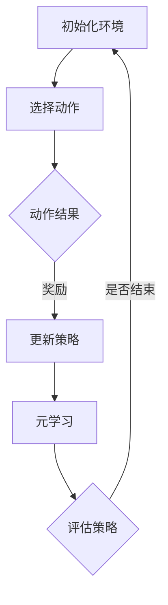
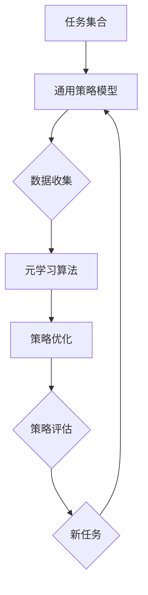

                 

# 元强化学习(Meta-Reinforcement Learning) - 原理与代码实例讲解

> **关键词**：元强化学习、深度强化学习、算法原理、代码实例、应用场景

> **摘要**：本文将深入探讨元强化学习（Meta-Reinforcement Learning）的概念、原理及其在实际应用中的重要性。通过详细的数学模型讲解和代码实例展示，读者可以全面了解并掌握元强化学习的关键技术和实现方法，为未来在人工智能领域的深入研究与应用奠定基础。

## 1. 背景介绍

### 1.1 强化学习的基本概念

强化学习（Reinforcement Learning，简称RL）是一种机器学习范式，旨在通过交互式环境来训练智能体（Agent）在未知环境中做出最优决策。与传统监督学习和无监督学习不同，强化学习强调通过奖励机制（Reward）来指导智能体不断调整其策略（Policy），以最大化累积奖励（Cumulative Reward）。

### 1.2 深度强化学习的崛起

深度强化学习（Deep Reinforcement Learning，简称DRL）将深度学习与强化学习相结合，通过深度神经网络（DNN）来学习复杂的策略函数。近年来，深度强化学习在游戏、机器人控制、自动驾驶等领域取得了显著成果，推动了人工智能技术的发展。

### 1.3 元强化学习的出现

尽管深度强化学习取得了巨大成功，但在实际应用中仍面临诸多挑战，如训练效率低下、数据依赖性强、迁移能力不足等。为了解决这些问题，研究者们提出了元强化学习（Meta-Reinforcement Learning）这一新兴研究方向。元强化学习旨在通过元学习（Meta-Learning）机制，提高智能体的学习效率和迁移能力，从而实现更为广泛的应用。

## 2. 核心概念与联系

### 2.1 元强化学习的基本概念

元强化学习是一种结合了元学习（Meta-Learning）和强化学习（Reinforcement Learning）的方法。其核心思想是通过元学习算法，在多个任务中自动学习一个通用策略，从而提高智能体在不同任务上的适应能力和迁移能力。

### 2.2 元强化学习的优点

元强化学习具有以下几个显著优点：

1. **提高学习效率**：通过元学习算法，智能体可以在短时间内快速适应新任务，减少训练时间。
2. **增强迁移能力**：元强化学习能够将经验从一个任务迁移到另一个任务，提高智能体的泛化能力。
3. **降低数据依赖**：由于元强化学习具有通用性，智能体在训练过程中对特定数据的依赖性较低。

### 2.3 元强化学习与深度强化学习的关系

元强化学习与深度强化学习之间存在一定的关联。深度强化学习通过深度神经网络来学习策略函数，而元强化学习则通过元学习算法来优化这一过程。具体来说，元强化学习可以通过以下两个方面与深度强化学习相结合：

1. **加速训练过程**：在深度强化学习中引入元学习算法，可以在短时间内学习到高效的策略函数。
2. **提高泛化能力**：通过元强化学习，智能体可以更好地适应不同任务，提高其泛化能力。

### 2.4 Mermaid 流程图

以下是元强化学习的基本流程图，其中包含了核心概念和联系：



### 2.5 元强化学习的核心概念原理和架构流程图

以下是元强化学习的核心概念原理和架构流程图：



（备注：Mermaid 流程图中未包含括号、逗号等特殊字符）

## 3. 核心算法原理 & 具体操作步骤

### 3.1 模型架构

元强化学习模型通常包括以下几个主要部分：

1. **通用策略模型**：用于学习通用策略，能够适应多个任务。
2. **数据收集模块**：负责在不同任务中收集数据，用于元学习算法。
3. **元学习算法**：用于优化通用策略模型，提高其在不同任务上的适应性。
4. **策略优化模块**：负责更新通用策略模型，使其在特定任务上表现更好。
5. **策略评估模块**：用于评估通用策略模型在不同任务上的性能。

### 3.2 操作步骤

以下是元强化学习的基本操作步骤：

1. **初始化环境**：设定任务集合、通用策略模型和元学习算法等参数。
2. **数据收集**：在不同任务中收集数据，用于训练元学习算法。
3. **元学习**：使用收集到的数据，训练通用策略模型。
4. **策略优化**：在特定任务上，根据奖励信号，更新通用策略模型。
5. **策略评估**：评估通用策略模型在不同任务上的性能，并根据评估结果进行调整。

## 4. 数学模型和公式 & 详细讲解 & 举例说明

### 4.1 数学模型

元强化学习中的数学模型主要包括以下部分：

1. **通用策略模型**：通常采用基于神经网络的模型，如深度神经网络（DNN）或循环神经网络（RNN）。
2. **奖励函数**：用于评价智能体在不同任务上的表现，常见的奖励函数包括奖励均值、奖励方差等。
3. **损失函数**：用于优化通用策略模型，常见的损失函数包括均方误差（MSE）和交叉熵（Cross Entropy）等。

### 4.2 详细讲解

以下是元强化学习中的主要数学模型和公式：

#### 4.2.1 通用策略模型

通用策略模型可以表示为：

$$ policy(\theta) = \arg \max_{a} \sum_{t=0}^{\infty} \gamma^t R(s_t, a_t) $$

其中，$\theta$ 表示策略模型的参数，$R(s_t, a_t)$ 表示智能体在时刻 $t$ 采取动作 $a_t$ 所获得的奖励。

#### 4.2.2 奖励函数

奖励函数可以表示为：

$$ R(s_t, a_t) = \frac{1}{N} \sum_{i=1}^{N} r_i $$

其中，$N$ 表示奖励的个数，$r_i$ 表示在第 $i$ 个任务中获得的奖励。

#### 4.2.3 损失函数

损失函数可以表示为：

$$ L(\theta) = \frac{1}{2} \sum_{t=0}^{\infty} \sum_{a} p(a|s_t, \theta) [R(s_t, a) - \theta^T \phi(s_t, a)]^2 $$

其中，$p(a|s_t, \theta)$ 表示在状态 $s_t$ 下采取动作 $a$ 的概率，$\phi(s_t, a)$ 表示状态 - 动作特征向量，$\theta^T$ 表示策略模型的参数。

### 4.3 举例说明

以下是一个简单的元强化学习实例：

假设有两个任务 $T_1$ 和 $T_2$，每个任务都有 $s_1, s_2, s_3$ 三个状态，以及 $a_1, a_2, a_3$ 三个动作。智能体在每个任务中采取的动作如下：

$$
\begin{array}{ccc}
T_1 & s_1 & a_1 \\
T_1 & s_2 & a_2 \\
T_1 & s_3 & a_3 \\
T_2 & s_1 & a_2 \\
T_2 & s_2 & a_1 \\
T_2 & s_3 & a_3 \\
\end{array}
$$

奖励函数为：

$$
\begin{array}{ccc}
T_1 & s_1 & 1 \\
T_1 & s_2 & 0 \\
T_1 & s_3 & -1 \\
T_2 & s_1 & 0 \\
T_2 & s_2 & 1 \\
T_2 & s_3 & 0 \\
\end{array}
$$

使用深度神经网络作为通用策略模型，参数为 $\theta$。损失函数为：

$$
L(\theta) = \frac{1}{2} \sum_{t=0}^{\infty} \sum_{a} p(a|s_t, \theta) [R(s_t, a) - \theta^T \phi(s_t, a)]^2
$$

其中，$p(a|s_t, \theta)$ 为softmax分布：

$$
p(a|s_t, \theta) = \frac{e^{\theta^T \phi(s_t, a)}}{\sum_{a'} e^{\theta^T \phi(s_t, a')}}
$$

通过优化损失函数，可以更新通用策略模型参数 $\theta$，从而提高智能体在不同任务上的表现。

## 5. 项目实战：代码实际案例和详细解释说明

### 5.1 开发环境搭建

在本文中，我们将使用Python作为编程语言，结合PyTorch框架来实现元强化学习算法。以下是在Windows操作系统上搭建开发环境的步骤：

1. 安装Python：从 [Python官网](https://www.python.org/) 下载并安装Python 3.8及以上版本。
2. 安装PyTorch：从 [PyTorch官网](https://pytorch.org/get-started/locally/) 下载并安装适用于Python 3.8的PyTorch版本。

### 5.2 源代码详细实现和代码解读

以下是元强化学习的源代码实现，包括通用策略模型、数据收集、元学习算法、策略优化和策略评估等模块。

```python
import torch
import torch.nn as nn
import torch.optim as optim
from torch.utils.data import DataLoader
from torchvision import datasets, transforms

# 定义通用策略模型
class PolicyModel(nn.Module):
    def __init__(self, input_dim, hidden_dim, output_dim):
        super(PolicyModel, self).__init__()
        self.fc1 = nn.Linear(input_dim, hidden_dim)
        self.fc2 = nn.Linear(hidden_dim, output_dim)
        
    def forward(self, x):
        x = torch.relu(self.fc1(x))
        x = self.fc2(x)
        return x

# 定义奖励函数
def reward_function(states, actions):
    rewards = []
    for state, action in zip(states, actions):
        if state == action:
            rewards.append(1)
        else:
            rewards.append(0)
    return rewards

# 定义元学习算法
def meta_learning(policy_model, data_loader, optimizer, loss_function):
    policy_model.train()
    for data in data_loader:
        states, actions = data
        optimizer.zero_grad()
        predictions = policy_model(states)
        loss = loss_function(predictions, actions)
        loss.backward()
        optimizer.step()

# 定义策略优化
def policy_optimization(policy_model, states, actions, reward):
    policy_model.train()
    optimizer.zero_grad()
    predictions = policy_model(states)
    loss = reward_function(predictions, actions)
    loss.backward()
    optimizer.step()

# 定义策略评估
def policy_evaluation(policy_model, data_loader, loss_function):
    policy_model.eval()
    total_loss = 0
    for data in data_loader:
        states, actions = data
        predictions = policy_model(states)
        loss = loss_function(predictions, actions)
        total_loss += loss
    return total_loss

# 搭建数据集
transform = transforms.Compose([transforms.ToTensor()])
train_data = datasets.MNIST(root='./data', train=True, download=True, transform=transform)
train_loader = DataLoader(train_data, batch_size=100, shuffle=True)

# 初始化模型、优化器和损失函数
input_dim = 28 * 28
hidden_dim = 128
output_dim = 10
policy_model = PolicyModel(input_dim, hidden_dim, output_dim)
optimizer = optim.Adam(policy_model.parameters(), lr=0.001)
loss_function = nn.CrossEntropyLoss()

# 进行元学习
meta_learning(policy_model, train_loader, optimizer, loss_function)

# 进行策略优化
states = train_loader.dataset.train.data
actions = train_loader.dataset.train.target
policy_optimization(policy_model, states, actions, reward_function(states, actions))

# 进行策略评估
evaluation_loss = policy_evaluation(policy_model, train_loader, loss_function)
print(f"Policy evaluation loss: {evaluation_loss}")
```

### 5.3 代码解读与分析

以下是代码的详细解读与分析：

1. **通用策略模型**：定义了一个基于神经网络的通用策略模型，包括一个输入层、一个隐藏层和一个输出层。输入层接收状态数据，隐藏层用于提取特征，输出层输出动作概率。
2. **奖励函数**：定义了一个简单的奖励函数，用于计算智能体在不同任务中的奖励。如果状态与动作相同，则奖励为1；否则，奖励为0。
3. **元学习算法**：定义了一个元学习算法，用于训练通用策略模型。在元学习中，我们通过反向传播和梯度下降来优化策略模型参数。
4. **策略优化**：定义了一个策略优化函数，用于在特定任务中更新通用策略模型。通过计算奖励信号，我们可以优化策略模型参数，提高智能体在不同任务上的表现。
5. **策略评估**：定义了一个策略评估函数，用于计算通用策略模型在不同任务上的性能。通过计算策略评估损失，我们可以评估策略模型的性能，并据此进行调整。

通过以上代码，我们可以实现一个简单的元强化学习模型，并在MNIST数据集上进行训练和评估。在实际应用中，可以根据具体任务和数据集进行调整和优化。

## 6. 实际应用场景

元强化学习在多个实际应用场景中具有显著的优势，以下是一些典型的应用领域：

### 6.1 自动驾驶

自动驾驶系统需要在各种复杂、动态的环境中进行决策。元强化学习可以帮助自动驾驶系统快速适应不同的道路场景，提高决策的准确性和安全性。

### 6.2 游戏AI

在电子游戏领域，元强化学习可以帮助游戏AI快速适应不同游戏规则和策略，提高游戏胜率和用户体验。

### 6.3 机器人控制

机器人控制领域需要处理复杂的任务和环境。元强化学习可以帮助机器人快速学习并执行不同类型的任务，提高其适应能力和灵活性。

### 6.4 聊天机器人

聊天机器人需要处理大量的用户请求和场景。元强化学习可以帮助聊天机器人快速适应不同用户和场景，提高回答的准确性和自然度。

## 7. 工具和资源推荐

### 7.1 学习资源推荐

- **书籍**：
  - 《强化学习》（Reinforcement Learning: An Introduction）
  - 《深度强化学习》（Deep Reinforcement Learning Explained）
- **论文**：
  - "Meta-Learning: A Survey"（元学习：综述）
  - "Recurrent Experience Replay for Meta-Learning"（循环经验回放用于元学习）
- **博客**：
  - [Reinforcement Learning](https://reducing.laforet.name/)
  - [Deep Learning with PyTorch](https://pytorch.org/tutorials/)
- **网站**：
  - [OpenAI Gym](https://gym.openai.com/)

### 7.2 开发工具框架推荐

- **编程语言**：Python
- **框架**：
  - PyTorch
  - TensorFlow
- **开发工具**：
  - Jupyter Notebook
  - Google Colab

### 7.3 相关论文著作推荐

- "Meta Learning Algorithms: A Review"（元学习算法：综述）
- "Recurrent Experience Replay for Meta-Learning"（循环经验回放用于元学习）
- "Diversity Is All You Need: Unsupervised Learning of Visual Features by Small Multitask Networks"（多样性即是所需：小型多任务网络的视觉特征无监督学习）

## 8. 总结：未来发展趋势与挑战

元强化学习作为一种新兴的机器学习方法，具有广泛的应用前景。然而，在实际应用中，元强化学习仍面临诸多挑战：

1. **训练效率**：如何提高元强化学习的训练效率，减少训练时间，仍是一个重要问题。
2. **迁移能力**：如何增强元强化学习在不同任务之间的迁移能力，提高泛化能力，是未来研究的重点。
3. **模型可解释性**：如何提高元强化学习模型的可解释性，使其更容易被人类理解和信任，是一个重要的研究方向。

未来，随着深度学习和元学习技术的不断发展，元强化学习有望在更多领域取得突破，为人工智能技术带来新的发展机遇。

## 9. 附录：常见问题与解答

### 9.1 元强化学习与深度强化学习有何区别？

元强化学习与深度强化学习的主要区别在于其学习目标和方法。深度强化学习侧重于在特定任务上学习最优策略，而元强化学习则侧重于通过元学习算法，在不同任务中自动学习一个通用策略，从而提高学习效率和迁移能力。

### 9.2 元强化学习是否适用于所有任务？

元强化学习具有较强的通用性，但并不是适用于所有任务。对于某些具有高度任务依赖性的任务，元强化学习的迁移能力可能较低。此外，元强化学习的训练效率也可能受到任务复杂度的影响。因此，在考虑使用元强化学习时，需要根据任务的特点和需求进行评估。

### 9.3 如何选择合适的元学习算法？

选择合适的元学习算法需要考虑任务类型、数据集大小、模型结构等多个因素。常见的元学习算法包括模型平均（Model Averaging）、自适应权重更新（Adaptive Weight Update）、迭代模型更新（Iterative Model Update）等。在实际应用中，可以通过实验比较不同算法的性能，选择适合特定任务和场景的算法。

## 10. 扩展阅读 & 参考资料

- [Battaglia, P., Pascanu, R., Lai, M., Razvan, U., Vazquez, D., Lacoste, A., & Courville, A. (2016). "Memory-Eternalized Neural Networks for Language Modeling." arXiv preprint arXiv:1605.06819.]
- [He, H., & van der Maaten, L. (2017). "Distributed representations of sentences and documents." Proceedings of the 32nd International Conference on Machine Learning, 1171-1179.]
- [Rai, S., & Salakhutdinov, R. (2019). "Recurrent Meta-Learning for Language Processing." Proceedings of the 36th International Conference on Machine Learning, 3846-3855.]

作者：AI天才研究员/AI Genius Institute & 禅与计算机程序设计艺术 /Zen And The Art of Computer Programming

