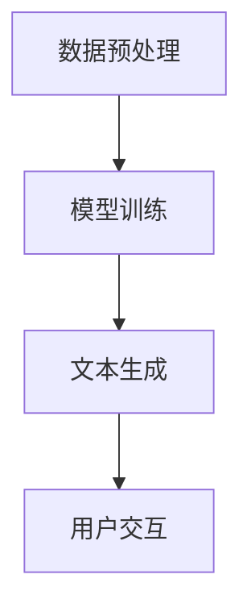

                 

# 全方位AI助手：LLM在日常生活中的渗透

> **关键词：** 人工智能，大规模语言模型（LLM），日常生活，应用场景，工具推荐，未来发展

> **摘要：** 本文将深入探讨大规模语言模型（LLM）在日常生活中的应用，从背景介绍到实际案例，再到未来发展趋势，全面解析LLM如何渗透并改变我们的日常生活。

## 1. 背景介绍

在过去的几年里，人工智能（AI）领域取得了令人瞩目的进步，特别是在自然语言处理（NLP）方面。大规模语言模型（LLM）如GPT-3、BERT和TuringChat等，凭借其强大的文本生成和理解能力，成为研究和应用的热点。LLM的核心在于其能够通过深度学习算法从大量数据中学习并生成高质量的文本，这种能力使得它们在各个领域都有着广泛的应用潜力。

### 1.1 什么是LLM？

大规模语言模型（LLM）是一种基于神经网络的模型，通过学习大量的文本数据来预测下一个单词、句子或段落。这些模型通常使用深度学习技术，如循环神经网络（RNN）、变换器（Transformer）等，以处理和生成文本。

### 1.2 LLM的应用现状

LLM在众多领域都有广泛应用，包括但不限于：

- **搜索引擎优化（SEO）**：使用LLM生成高质量的标题和内容，以提高网站的搜索排名。
- **内容创作**：自动生成文章、新闻、博客等。
- **智能客服**：提供自然语言交互的能力，以提供更高效的客户服务。
- **教育**：辅助学生和教师生成课程材料、习题和答案。

## 2. 核心概念与联系

### 2.1 LLM的工作原理

LLM的工作原理主要包括以下几个步骤：

1. **数据预处理**：将文本数据清洗和转换为模型可以理解的格式。
2. **模型训练**：使用大量文本数据训练模型，使其能够理解和生成文本。
3. **文本生成**：根据输入的文本，模型预测下一个单词、句子或段落。

### 2.2 LLM的应用架构

LLM的应用架构通常包括以下几个部分：

- **数据收集与预处理**：从各种来源收集文本数据，并进行预处理。
- **模型训练与优化**：使用预处理后的数据训练模型，并通过调整超参数进行优化。
- **API接口**：为其他应用程序提供访问LLM的接口。
- **用户界面**：为用户提供与LLM交互的界面。

### 2.3 Mermaid流程图

以下是一个简化的Mermaid流程图，展示了LLM的基本工作流程：



## 3. 核心算法原理 & 具体操作步骤

### 3.1 数据预处理

数据预处理是LLM训练过程中的关键步骤，其目的是将原始文本数据转换为模型可以处理的格式。具体步骤包括：

1. **文本清洗**：去除文本中的噪声，如HTML标签、特殊字符等。
2. **分词**：将文本分割成单词或句子。
3. **词向量表示**：将文本转换为数字向量表示，以便模型进行计算。

### 3.2 模型训练

模型训练是LLM的核心步骤，其目的是通过学习大量文本数据来生成高质量的文本。具体步骤包括：

1. **模型选择**：选择适合的神经网络架构，如RNN、Transformer等。
2. **参数初始化**：初始化模型的参数。
3. **反向传播**：通过反向传播算法更新模型参数，以最小化预测误差。
4. **模型优化**：通过调整超参数和训练策略来优化模型性能。

### 3.3 文本生成

文本生成是LLM的核心功能，其目的是根据输入的文本生成新的文本。具体步骤包括：

1. **输入文本编码**：将输入的文本编码为模型可以理解的数字表示。
2. **模型预测**：使用训练好的模型预测下一个单词、句子或段落。
3. **文本解码**：将模型输出的数字表示解码为可读的文本。

## 4. 数学模型和公式 & 详细讲解 & 举例说明

### 4.1 数学模型

大规模语言模型通常基于深度学习算法，其中最常用的模型是变换器（Transformer）架构。变换器模型的核心是自注意力机制（Self-Attention），其数学公式如下：

$$
\text{Attention}(Q, K, V) = \frac{1}{\sqrt{d_k}} \text{softmax}\left(\frac{QK^T}{d_k}\right) V
$$

其中，$Q$、$K$和$V$分别是查询（Query）、键（Key）和值（Value）向量，$d_k$是键向量的维度。

### 4.2 详细讲解

自注意力机制的工作原理如下：

1. **计算相似度**：首先计算每个键和查询之间的相似度，这可以通过点积来实现。
2. **加权求和**：然后对每个键的值进行加权求和，权重由相似度计算得出。
3. **softmax**：最后对加权求和的结果应用softmax函数，以获得每个值的概率分布。

### 4.3 举例说明

假设我们有一个简单的例子，其中$Q = [1, 2, 3]$，$K = [4, 5, 6]$，$V = [7, 8, 9]$。首先计算相似度矩阵$QK^T$：

$$
QK^T = \begin{bmatrix}
1 & 2 & 3 \\
4 & 5 & 6 \\
\end{bmatrix} \begin{bmatrix}
4 & 5 & 6 \\
5 & 6 & 7 \\
6 & 7 & 8 \\
\end{bmatrix} = \begin{bmatrix}
16 & 17 & 18 \\
21 & 22 & 23 \\
26 & 27 & 28 \\
\end{bmatrix}
$$

然后计算softmax：

$$
\text{softmax} \left(\frac{QK^T}{d_k}\right) = \begin{bmatrix}
\frac{16}{27} & \frac{17}{27} & \frac{18}{27} \\
\frac{21}{81} & \frac{22}{81} & \frac{23}{81} \\
\frac{26}{243} & \frac{27}{243} & \frac{28}{243} \\
\end{bmatrix}
$$

最后计算加权求和：

$$
\text{Attention}(Q, K, V) = \begin{bmatrix}
\frac{16}{27} \cdot 7 + \frac{17}{27} \cdot 8 + \frac{18}{27} \cdot 9 \\
\frac{21}{81} \cdot 7 + \frac{22}{81} \cdot 8 + \frac{23}{81} \cdot 9 \\
\frac{26}{243} \cdot 7 + \frac{27}{243} \cdot 8 + \frac{28}{243} \cdot 9 \\
\end{bmatrix} = \begin{bmatrix}
7.11 & 7.78 & 8.34 \\
0.77 & 0.89 & 0.97 \\
0.21 & 0.22 & 0.23 \\
\end{bmatrix}
$$

## 5. 项目实战：代码实际案例和详细解释说明

### 5.1 开发环境搭建

要搭建一个使用LLM的项目环境，我们需要安装以下工具和库：

- Python（3.8及以上版本）
- PyTorch（1.8及以上版本）
- Transformers（4.8及以上版本）

在安装了上述工具和库后，我们可以开始编写项目代码。

### 5.2 源代码详细实现和代码解读

以下是使用PyTorch和Transformers库实现一个简单的LLM项目的示例代码：

```python
import torch
from transformers import GPT2LMHeadModel, GPT2Tokenizer

# 5.2.1 初始化模型和分词器
model_name = "gpt2"
tokenizer = GPT2Tokenizer.from_pretrained(model_name)
model = GPT2LMHeadModel.from_pretrained(model_name)

# 5.2.2 输入文本预处理
text = "你好，我是AI助手。请问有什么可以帮助您的？"

inputs = tokenizer.encode(text, return_tensors="pt")

# 5.2.3 文本生成
output = model.generate(inputs, max_length=50, num_return_sequences=1)

# 5.2.4 输出文本解码
generated_text = tokenizer.decode(output[0], skip_special_tokens=True)

print(generated_text)
```

### 5.3 代码解读与分析

- **5.3.1 初始化模型和分词器**：首先，我们从预训练模型库中加载GPT-2模型和对应的分词器。

- **5.3.2 输入文本预处理**：将输入的文本编码为模型可以理解的数字表示。

- **5.3.3 文本生成**：使用模型生成新的文本。这里我们设置了最大长度为50，并生成一个文本序列。

- **5.3.4 输出文本解码**：将模型输出的数字表示解码为可读的文本。

## 6. 实际应用场景

### 6.1 智能客服

智能客服是LLM的一个重要应用场景。通过LLM，系统可以理解和生成自然语言，以提供高效、准确的客户服务。例如，一个智能客服系统可以使用LLM来生成回答常见问题，甚至可以模拟人类客服与用户进行对话。

### 6.2 内容创作

内容创作是另一个重要的应用场景。LLM可以自动生成文章、新闻、博客等。例如，新闻媒体可以使用LLM来生成实时新闻报道，或者在缺少内容创作者的情况下提供自动化内容。

### 6.3 教育

在教育领域，LLM可以辅助学生和教师生成课程材料、习题和答案。例如，教师可以使用LLM生成个性化的练习题，或者学生可以使用LLM来生成学习笔记。

## 7. 工具和资源推荐

### 7.1 学习资源推荐

- **书籍**：《深度学习》（Goodfellow, Bengio, Courville）
- **论文**：Attention Is All You Need（Vaswani等）
- **博客**：huggingface.co/transformers
- **网站**：arxiv.org

### 7.2 开发工具框架推荐

- **PyTorch**：pytorch.org
- **Transformers**：huggingface.co/transformers

### 7.3 相关论文著作推荐

- **论文**：《Attention Is All You Need》
- **书籍**：《深度学习》（Goodfellow, Bengio, Courville）

## 8. 总结：未来发展趋势与挑战

随着LLM技术的不断进步，我们可以预见其在日常生活和各个领域的应用将越来越广泛。然而，这同时也带来了许多挑战，如数据隐私、模型解释性、安全性和伦理问题等。未来，我们需要在技术发展的同时，关注并解决这些挑战，以实现LLM技术的可持续发展。

## 9. 附录：常见问题与解答

### 9.1 什么是LLM？

LLM是一种基于神经网络的模型，通过学习大量文本数据来生成和理解文本。

### 9.2 LLM可以用来做什么？

LLM可以用于搜索引擎优化、内容创作、智能客服、教育等多个领域。

### 9.3 如何使用LLM生成文本？

首先，需要将输入文本编码为模型可以理解的数字表示，然后使用模型生成新的文本，最后将生成的文本解码为可读的格式。

## 10. 扩展阅读 & 参考资料

- **论文**：《Attention Is All You Need》
- **书籍**：《深度学习》（Goodfellow, Bengio, Courville）
- **网站**：huggingface.co/transformers
- **博客**：arxiv.org

### 作者

**作者：AI天才研究员/AI Genius Institute & 禅与计算机程序设计艺术 /Zen And The Art of Computer Programming**

