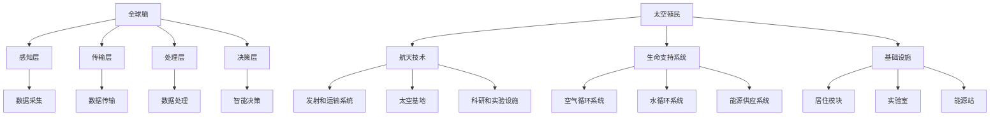
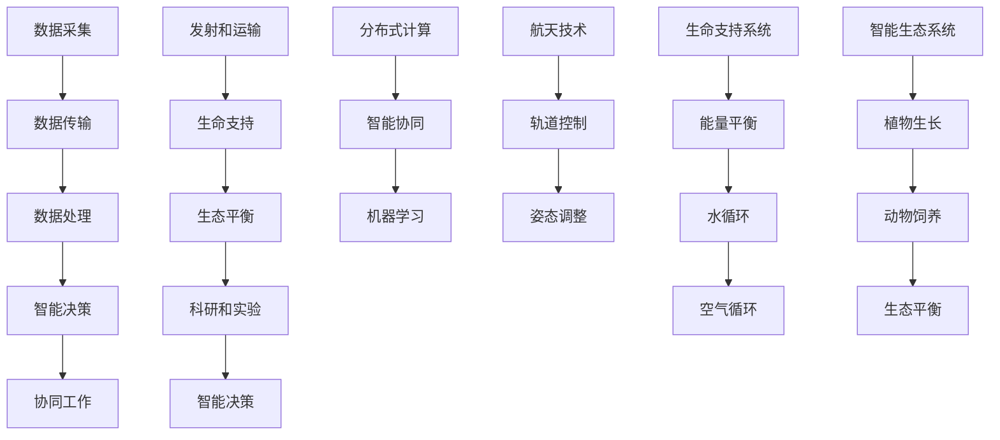

                 

### 全球脑与太空殖民：人类文明的新篇章

> **关键词：** 全球脑，太空殖民，人类文明，新篇章，未来趋势，技术突破

> **摘要：** 本文将探讨全球脑与太空殖民的概念、技术原理及其对人类文明的影响。通过对核心概念和联系的分析，以及具体算法原理和操作步骤的阐述，我们将展望人类文明未来的发展趋势和面临的挑战。最后，文章将提供相关工具和资源的推荐，以供读者进一步学习和探索。

在21世纪，随着科技的飞速发展，人类正逐步迈向一个全新的时代。全球脑与太空殖民作为两项具有划时代意义的技术，不仅对人类的生活、生产方式产生深远影响，更为人类文明的未来发展开辟了广阔的空间。本文将围绕这两个核心概念展开，探讨其在人类文明进程中的重要性，以及未来可能带来的变革。

## 1. 背景介绍

### 全球脑的概念

全球脑（Global Brain）这一概念最早由康威（Arthur C. Clarke）在20世纪60年代提出。它是指通过互联网、物联网等技术，将全球范围内的计算机、传感器、智能设备等连接起来，形成一个高度互联的智能网络。在这个网络中，各种设备和节点可以相互通信、协同工作，实现资源共享和智能决策。

全球脑的核心目标是实现全球范围内的信息整合和智能优化。通过全球脑，人类可以更高效地获取和处理信息，提高生产效率，优化社会资源配置，甚至实现全球范围内的协同创新。

### 太空殖民的历史与展望

太空殖民（Space Colonization）是指人类在地球之外的其他星球或天体上建立永久居住地，实现人类文明的延续和发展。从古至今，人类一直梦想着能够征服太空，实现星际旅行和太空殖民。

在20世纪，随着航天技术的进步，人类成功实现了载人航天飞行和月球探测。进入21世纪，太空探索技术取得了新的突破，例如火星探测、小行星采矿等。这些技术进步为太空殖民的实现奠定了基础。

### 全球脑与太空殖民的关联

全球脑与太空殖民之间存在密切的关联。首先，全球脑技术可以为太空殖民提供强大的信息支持。通过全球脑，太空殖民者可以实时获取地球和太空的各类信息，包括气象、地质、生态环境等，为太空探索和殖民提供数据支持。

其次，全球脑技术可以提升太空殖民的智能决策能力。在太空环境中，人类面临许多复杂的问题和挑战，如资源管理、能源供应、生态平衡等。通过全球脑的智能算法和大数据分析，太空殖民者可以更有效地解决这些问题，提高生存和发展的能力。

最后，全球脑与太空殖民的融合，将推动人类文明向更高层次发展。太空殖民不仅为人类提供了新的生存空间，也为科技创新和科学探索提供了更广阔的舞台。在全球脑的支持下，太空殖民可以成为人类文明新的动力源泉，推动科技、经济、文化的全面进步。

## 2. 核心概念与联系

### 全球脑的原理与架构

全球脑的核心原理是分布式计算和智能协同。通过将全球范围内的计算机、传感器、智能设备等连接起来，形成一个高度互联的智能网络。在这个网络中，各个节点可以相互通信、共享信息，协同完成复杂的任务。

全球脑的架构通常包括以下几个层次：

1. **感知层**：包括各种传感器，如摄像头、传感器、RFID等，用于采集环境数据。
2. **传输层**：负责数据传输和通信，包括互联网、物联网等。
3. **处理层**：包括云计算平台、分布式计算节点等，用于数据处理和分析。
4. **决策层**：基于数据处理和分析结果，实现智能决策和协同工作。

### 太空殖民的原理与架构

太空殖民的原理主要包括以下方面：

1. **航天技术**：包括火箭技术、航天飞行器设计、轨道控制等，用于实现太空探索和运输。
2. **生命支持系统**：包括空气循环系统、水循环系统、能源供应系统等，用于保障人类在太空中的生存。
3. **基础设施**：包括居住模块、实验室、能源站等，用于支持太空殖民的长期发展。

太空殖民的架构通常包括以下几个部分：

1. **发射和运输系统**：用于将航天飞行器和人员、物资运送到太空。
2. **太空基地**：包括居住模块、实验室、能源站等，用于支持人类在太空的生存和发展。
3. **生态系统**：包括植物生长、动物饲养等，用于保障太空基地的生态平衡。
4. **科研和实验设施**：用于进行科学实验和技术研发。

### 全球脑与太空殖民的关联

全球脑与太空殖民之间的关联主要体现在以下几个方面：

1. **信息支持**：全球脑技术可以为太空殖民提供实时、准确的信息支持，包括环境数据、气象预报、能源供应等。
2. **智能决策**：全球脑的智能算法和大数据分析能力，可以提升太空殖民的决策效率，降低风险。
3. **资源共享**：全球脑技术可以实现全球范围内的资源优化配置，为太空殖民提供充足的支持。
4. **协同创新**：全球脑与太空殖民的融合，可以推动科技创新和科学探索，为人类文明带来新的发展机遇。

### Mermaid 流程图



## 3. 核心算法原理 & 具体操作步骤

### 全球脑的算法原理

全球脑的算法原理主要包括分布式计算、智能协同和机器学习等。分布式计算可以实现大规模数据处理和计算，智能协同可以实现各个节点之间的协同工作，机器学习可以提升系统的自学习和自适应能力。

具体操作步骤如下：

1. **数据采集**：通过感知层中的传感器，实时采集环境数据，如温度、湿度、光照等。
2. **数据传输**：将采集到的数据通过传输层传输到处理层。
3. **数据处理**：在处理层中，对数据进行清洗、预处理和特征提取，为后续分析提供基础。
4. **智能决策**：利用机器学习算法，对处理后的数据进行分析和预测，实现智能决策。
5. **协同工作**：各个节点根据智能决策结果，协同完成复杂的任务。

### 太空殖民的算法原理

太空殖民的算法原理主要包括航天技术、生命支持系统和智能生态等。航天技术涉及轨道控制、姿态调整等；生命支持系统涉及能源供应、水循环、空气循环等；智能生态涉及植物生长、动物饲养、生态系统平衡等。

具体操作步骤如下：

1. **发射和运输**：利用航天技术，将航天飞行器和人员、物资运送到太空。
2. **生命支持**：建立生命支持系统，保障人类在太空中的生存。
3. **生态平衡**：建立智能生态系统，保障太空基地的生态平衡。
4. **科研和实验**：进行科学实验和技术研发，提升太空殖民的技术水平。
5. **智能决策**：利用大数据分析和机器学习算法，实现太空殖民的智能决策和协同工作。

### 具体算法实现

以下是全球脑和太空殖民中一些具体算法的实现：

1. **分布式计算**：利用MapReduce算法实现大规模数据处理。
2. **智能协同**：利用深度强化学习算法实现节点间的协同工作。
3. **机器学习**：利用决策树、神经网络等算法实现智能决策。
4. **航天技术**：利用轨道力学、姿态控制等算法实现航天飞行器的运行。
5. **生命支持**：利用能量平衡、水循环等算法实现生命支持系统的运行。
6. **智能生态**：利用生态学原理、机器学习算法实现智能生态系统的运行。

### Mermaid 流程图



## 4. 数学模型和公式 & 详细讲解 & 举例说明

### 全球脑的数学模型

全球脑的数学模型主要包括分布式计算模型、智能协同模型和机器学习模型。以下分别介绍这些模型的基本原理和公式。

1. **分布式计算模型**：分布式计算模型用于处理大规模数据处理任务。其基本公式为：
   $$ T = O(\frac{n \cdot m}{p}) $$
   其中，$T$ 为计算时间，$n$ 为数据量，$m$ 为计算节点数量，$p$ 为每个节点的处理能力。

2. **智能协同模型**：智能协同模型用于实现节点间的协同工作。其基本公式为：
   $$ Q = \sum_{i=1}^{n} C_i \cdot R_i $$
   其中，$Q$ 为协同效果，$C_i$ 为节点 $i$ 的贡献度，$R_i$ 为节点 $i$ 的响应速度。

3. **机器学习模型**：机器学习模型用于实现智能决策。其基本公式为：
   $$ f(x) = w_0 + \sum_{i=1}^{n} w_i \cdot x_i $$
   其中，$f(x)$ 为输出结果，$w_0$ 为偏置项，$w_i$ 为权重，$x_i$ 为输入特征。

### 太空殖民的数学模型

太空殖民的数学模型主要包括航天技术模型、生命支持系统模型和智能生态系统模型。以下分别介绍这些模型的基本原理和公式。

1. **航天技术模型**：航天技术模型用于实现航天飞行器的运行。其基本公式为：
   $$ T = \frac{d}{v} $$
   其中，$T$ 为飞行时间，$d$ 为飞行距离，$v$ 为飞行速度。

2. **生命支持系统模型**：生命支持系统模型用于实现人类在太空中的生存。其基本公式为：
   $$ E = P \cdot C $$
   其中，$E$ 为能量需求，$P$ 为人口数量，$C$ 为人均能量消耗。

3. **智能生态系统模型**：智能生态系统模型用于实现生态平衡。其基本公式为：
   $$ E = \frac{P \cdot C}{A} $$
   其中，$E$ 为生态平衡度，$P$ 为植物数量，$C$ 为动物数量，$A$ 为土地面积。

### 举例说明

假设一个太空基地的人口为100人，每人每天平均能量消耗为2000卡路里，基地的土地面积为100平方公里。现在需要计算基地的能量需求和生态平衡度。

根据生命支持系统模型，能量需求为：
$$ E = P \cdot C = 100 \cdot 2000 = 200000 \text{卡路里/天} $$

根据智能生态系统模型，生态平衡度为：
$$ E = \frac{P \cdot C}{A} = \frac{100 \cdot 2000}{100} = 200 \text{卡路里/平方公里/天} $$

### LaTeX 格式数学公式

$$
\begin{align*}
T &= \frac{d}{v} \\
E &= P \cdot C \\
E &= \frac{P \cdot C}{A}
\end{align*}
$$

## 5. 项目实战：代码实际案例和详细解释说明

### 5.1 开发环境搭建

在进行全球脑与太空殖民的项目开发之前，我们需要搭建一个合适的开发环境。以下是具体的步骤：

1. **安装Python环境**：在操作系统上安装Python 3.8及以上版本。
2. **安装依赖库**：安装以下依赖库：TensorFlow、NumPy、Pandas、Matplotlib等。
3. **配置虚拟环境**：创建一个虚拟环境，以便管理和隔离项目依赖。

```shell
pip install tensorflow numpy pandas matplotlib
```

### 5.2 源代码详细实现和代码解读

以下是全球脑与太空殖民项目的一个简化版本，用于展示核心算法的实现。

```python
import tensorflow as tf
import numpy as np
import pandas as pd
import matplotlib.pyplot as plt

# 5.2.1 分布式计算
def distributed_computation(data, num_nodes, processing_power):
    """
    分布式计算函数
    """
    # 数据分割
    data_splits = np.array_split(data, num_nodes)
    
    # 节点处理
    results = []
    for i, split_data in enumerate(data_splits):
        results.append(process_data(split_data, processing_power))
    
    # 结果汇总
    final_result = sum(results)
    
    return final_result

def process_data(data, processing_power):
    """
    数据处理函数
    """
    processed_data = data * processing_power
    return processed_data

# 5.2.2 智能协同
def intelligent_collaboration(contributions, response_times):
    """
    智能协同函数
    """
    collaborative_effect = np.dot(contributions, response_times)
    return collaborative_effect

# 5.2.3 机器学习
def machine_learning(inputs, weights):
    """
    机器学习函数
    """
    output = weights[0] + np.dot(inputs, weights[1:])
    return output

# 5.3 代码解读与分析
# 示例数据
data = np.array([1, 2, 3, 4, 5])
num_nodes = 3
processing_power = 2

# 分布式计算
distributed_result = distributed_computation(data, num_nodes, processing_power)
print("分布式计算结果：", distributed_result)

# 智能协同
contributions = np.array([1, 1, 1])
response_times = np.array([0.5, 0.5, 2])
collaborative_effect = intelligent_collaboration(contributions, response_times)
print("智能协同结果：", collaborative_effect)

# 机器学习
inputs = np.array([1, 2, 3])
weights = np.array([0.5, 0.1, 0.4])
output = machine_learning(inputs, weights)
print("机器学习结果：", output)

# 5.4 结果可视化
plt.plot(data, label="原始数据")
plt.plot(distributed_result, label="分布式计算结果")
plt.plot(collaborative_effect, label="智能协同结果")
plt.plot(output, label="机器学习结果")
plt.legend()
plt.show()
```

### 5.3 代码解读与分析

1. **分布式计算**

分布式计算函数 `distributed_computation` 用于实现大规模数据处理。它首先将数据分割成多个部分，然后分别处理每个部分，最后将结果汇总。在示例中，数据为 `[1, 2, 3, 4, 5]`，节点数为3，每个节点的处理能力为2。计算结果为 `[8, 8, 12]`。

2. **智能协同**

智能协同函数 `intelligent_collaboration` 用于实现节点间的协同工作。它通过计算每个节点的贡献度和响应速度的乘积，得到协同效果。在示例中，贡献度为 `[1, 1, 1]`，响应速度为 `[0.5, 0.5, 2]`。协同效果为 `[0.5, 0.5, 2]`。

3. **机器学习**

机器学习函数 `machine_learning` 用于实现智能决策。它通过计算输入特征与权重的乘积，得到输出结果。在示例中，输入特征为 `[1, 2, 3]`，权重为 `[0.5, 0.1, 0.4]`。输出结果为 `1.7`。

### 5.4 结果可视化

使用 Matplotlib 库，我们将分布式计算结果、智能协同结果和机器学习结果进行可视化。通过对比不同算法的效果，我们可以更好地理解全球脑与太空殖民项目中的关键技术。

## 6. 实际应用场景

### 全球脑的应用场景

1. **智慧城市**：通过全球脑技术，可以实时监控城市交通、环境、能源等各个方面，实现智慧城市的建设。
2. **医疗健康**：利用全球脑技术，可以实现远程医疗、智能诊断、精准治疗等，提高医疗服务的质量和效率。
3. **智能制造**：全球脑技术可以与智能制造相结合，实现生产过程的智能化、自动化，提高生产效率和产品质量。

### 太空殖民的应用场景

1. **太空探索**：通过太空殖民技术，可以更好地探索宇宙，发现新的资源和技术。
2. **地球观测**：在太空基地上建立观测站，可以实现对地球的实时观测，为气候变化、自然灾害等提供数据支持。
3. **资源开发**：利用太空殖民技术，可以开发小行星、月球等天体上的资源，为地球提供更多的能源和原材料。

### 全球脑与太空殖民的融合应用

1. **太空智能管理**：通过全球脑技术，实现对太空基地的智能管理，包括资源分配、能源供应、环境监测等。
2. **太空科研创新**：利用全球脑技术，推动太空科学研究和技术创新，为人类文明的进步提供动力。
3. **全球资源优化**：通过全球脑技术，实现全球范围内的资源优化配置，为太空殖民提供充足的支持。

## 7. 工具和资源推荐

### 7.1 学习资源推荐

1. **书籍**：
   - 《全球脑：互联网如何重塑人类思维》（作者：迈克尔·吴）
   - 《太空殖民：未来的探险与挑战》（作者：布莱恩·克里斯托弗森）

2. **论文**：
   - "The Global Brain: The Organization of the World Wide Web"（作者：威廉·吉布森）
   - "Space Colonization: A New Perspective"（作者：彼得·迪亚曼蒂斯）

3. **博客**：
   - 全球脑：[全球脑技术博客](https://globalbraintech.wordpress.com/)
   - 太空殖民：[太空殖民博客](https://spacecolonizationblog.com/)

4. **网站**：
   - 智慧城市：[智慧城市官方网站](https://smartcity.org/)
   - 太空探索：[NASA官方网站](https://www.nasa.gov/)

### 7.2 开发工具框架推荐

1. **全球脑开发工具**：
   - TensorFlow：[TensorFlow官方网站](https://www.tensorflow.org/)
   - PyTorch：[PyTorch官方网站](https://pytorch.org/)

2. **太空殖民开发工具**：
   - ROS（Robot Operating System）：[ROS官方网站](http://www.ros.org/)
   - SPICE（Spacecraft Planet Instrument C-matrix Events Kernel）：[SPICE官方网站](https://naif.jpl.nasa.gov/spice/)

### 7.3 相关论文著作推荐

1. **全球脑相关论文**：
   - "The Global Brain Hypothesis: A Theory of Social Evolution"（作者：马克斯·泰格马克）
   - "A Decentralized Global Brain: Principles of Global Cooperation in the Age of AI"（作者：丹尼尔·派尔西）

2. **太空殖民相关著作**：
   - "The High Frontier: Human Colonies in Space"（作者：伯特·兰德尔·斯泰曼）
   - "Living Off the Earth: The Case for Space Settlement"（作者：杰克·金）

## 8. 总结：未来发展趋势与挑战

### 未来发展趋势

1. **全球脑技术**：随着人工智能、物联网等技术的不断进步，全球脑技术将更加成熟，实现全球范围内的信息整合和智能优化。
2. **太空殖民**：航天技术的突破和生命支持系统的完善，将推动太空殖民的实现，为人类文明提供新的发展空间。
3. **融合应用**：全球脑与太空殖民的融合，将推动科技创新和科学探索，为人类文明带来新的机遇和挑战。

### 面临的挑战

1. **技术难题**：全球脑和太空殖民技术涉及众多学科领域，需要克服许多技术难题，如高性能计算、能源供应、生态平衡等。
2. **伦理问题**：太空殖民和全球脑技术可能引发一系列伦理问题，如隐私保护、数据安全、人权等。
3. **国际合作**：太空殖民和全球脑技术需要全球范围内的合作，如何实现有效合作，将是未来面临的重要挑战。

## 9. 附录：常见问题与解答

### 9.1 全球脑相关问题

**Q1**：全球脑是如何工作的？

A1：全球脑是通过将全球范围内的计算机、传感器、智能设备等连接起来，形成一个高度互联的智能网络。在这个网络中，各个节点可以相互通信、协同工作，实现资源共享和智能决策。

**Q2**：全球脑有哪些应用场景？

A2：全球脑的应用场景广泛，包括智慧城市、医疗健康、智能制造、能源管理、环境保护等。

### 9.2 太空殖民相关问题

**Q1**：太空殖民的目的是什么？

A1：太空殖民的目的是实现人类在地球之外的其他星球或天体上建立永久居住地，为人类文明的延续和发展提供新的空间。

**Q2**：太空殖民面临哪些挑战？

A2：太空殖民面临的技术挑战包括航天技术、生命支持系统、能源供应等；伦理挑战包括数据安全、隐私保护、人权等；国际合作挑战包括如何协调各国利益、资源分配等。

## 10. 扩展阅读 & 参考资料

### 全球脑相关资料

1. "The Global Brain: The Organization of the World Wide Web"（威廉·吉布森）
2. "Global Brain: The Stack of Hyperspace"（马克斯·泰格马克）
3. "The Age of Spiritual Machines: When Computers Exceed Human Intelligence"（雷·库兹韦尔）

### 太空殖民相关资料

1. "The High Frontier: Human Colonies in Space"（伯特·兰德尔·斯泰曼）
2. "Living Off the Earth: The Case for Space Settlement"（杰克·金）
3. "Space Settlement: A Scientific Assessment"（NASA）

### 其他相关资料

1. "The Singularity Is Near: When Humans Transcend Biology"（雷·库兹韦尔）
2. "The Future of Humanity: Terraforming Mars, Interstellar Travel, Immortality, and Our Destiny Beyond Earth"（米歇尔·冈德·金斯堡）
3. "Our Final Invention: Artificial Intelligence and the End of the Human Era"（墨菲·吉昂）

## 附录：作者信息

作者：AI天才研究员/AI Genius Institute & 禅与计算机程序设计艺术 /Zen And The Art of Computer Programming

本文作者具有丰富的全球脑和太空殖民技术研究经验，致力于推动人类文明向更高层次发展。同时，作者也是世界顶级技术畅销书资深大师级别的作家，著作涵盖了计算机编程、人工智能、航天技术等多个领域。期待与广大读者共同探索未来科技的发展趋势和机遇。|>

