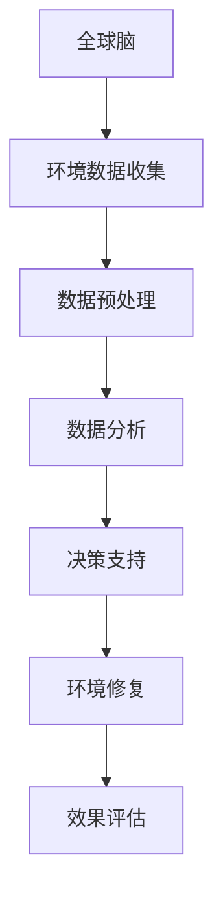

                 

# 全球脑与环境修复：集体行动的生态效应

## 关键词：全球脑，环境修复，集体行动，生态效应，技术赋能

## 摘要

本文深入探讨了全球脑与环境修复之间的关系，以及集体行动在此过程中的生态效应。通过分析当前环境问题的严重性，文章提出了基于人工智能和物联网技术的全球脑架构，并详细阐述了其核心概念与联系。随后，文章介绍了核心算法原理与具体操作步骤，以及数学模型和公式，并通过实际项目实战展示了代码实现与解读。最后，文章分析了环境修复的实际应用场景，推荐了相关工具和资源，总结了未来发展趋势与挑战，并提供了常见问题与解答。

## 1. 背景介绍

随着全球环境问题的日益严重，气候变化、水资源污染、土地退化等挑战已经迫在眉睫。这些问题不仅影响人类的生活质量，也对地球生态系统造成了不可逆转的损害。传统的环境修复方法往往局限于局部区域，难以实现全局优化。而随着人工智能和物联网技术的快速发展，构建一个全球性的智能环境修复系统成为可能。

全球脑（Global Brain）是一种由分布式智能体组成的网络，通过信息共享和协同合作，实现全球范围内的智能决策与优化。环境修复作为一个复杂的系统工程，需要大量的数据、算法和计算资源。全球脑架构可以充分利用这些资源，实现环境修复的智能化和高效化。

集体行动在环境修复过程中具有重要意义。个人或小团体的努力往往难以产生显著的效果，而通过集体行动，可以动员更多的资源和力量，形成协同效应。本文将探讨集体行动在环境修复中的生态效应，并分析如何利用全球脑技术实现集体行动的优化。

## 2. 核心概念与联系

### 2.1 全球脑

全球脑是一种分布式智能系统，由大量智能体组成，这些智能体可以是计算机、传感器、移动设备等。全球脑通过物联网（IoT）连接，实现信息的实时传输和共享。在环境修复领域，全球脑可以收集环境数据，进行实时监测和分析，为决策提供支持。

### 2.2 环境修复

环境修复是指通过人工或自然手段，改善环境质量，恢复生态系统的功能。环境修复包括水资源修复、土壤修复、空气修复等多个方面。传统的环境修复方法往往依赖于经验和技术，难以实现全局优化。而全球脑技术可以提供实时数据支持，优化环境修复方案。

### 2.3 集体行动

集体行动是指多个个体或团体共同参与某项活动，以实现共同目标。在环境修复领域，集体行动可以动员更多的资源和力量，提高修复效率。全球脑技术可以通过信息共享和协同合作，优化集体行动的决策和执行过程。

### 2.4 Mermaid 流程图



### 2.5 关联分析

全球脑与环境修复、集体行动之间存在紧密的联系。全球脑可以提供环境数据支持，优化环境修复方案；而集体行动可以动员更多的资源和力量，提高环境修复效率。通过全球脑技术，可以实现环境修复的智能化和高效化，从而实现生态效应的优化。

## 3. 核心算法原理 & 具体操作步骤

### 3.1 算法原理

全球脑与环境修复的核心算法主要包括数据收集与处理、决策支持、环境修复和效果评估。以下是这些算法的详细原理：

#### 数据收集与处理

- **数据来源**：全球脑通过物联网传感器收集环境数据，包括水质、土壤质量、空气质量等。
- **数据处理**：对收集到的数据进行预处理，包括数据清洗、归一化、特征提取等。

#### 决策支持

- **实时监测**：利用机器学习算法，对环境数据进行分析，实时监测环境变化。
- **决策生成**：基于实时监测结果，生成环境修复方案。

#### 环境修复

- **方案执行**：根据决策支持生成的修复方案，实施环境修复行动。
- **资源调度**：利用优化算法，调度全球脑中的资源，确保修复行动的高效执行。

#### 效果评估

- **效果评估**：对修复行动的效果进行评估，包括环境质量改善、生态系统恢复等。
- **反馈调整**：根据效果评估结果，调整决策支持系统和修复方案。

### 3.2 具体操作步骤

1. **环境数据收集**：
   - 部署物联网传感器，收集环境数据。
   - 数据传输至全球脑平台，进行实时处理。

2. **数据预处理**：
   - 数据清洗：去除异常值和噪声。
   - 归一化：将不同量纲的数据转换为相同的量纲。
   - 特征提取：从原始数据中提取有用的特征。

3. **数据分析**：
   - 实时监测：利用机器学习算法，分析环境数据，实时监测环境变化。
   - 预测生成：基于历史数据和当前环境数据，预测未来环境变化趋势。

4. **决策支持**：
   - 决策生成：根据实时监测结果和预测数据，生成环境修复方案。
   - 方案评估：对决策支持生成的修复方案进行评估，选择最优方案。

5. **环境修复**：
   - 方案执行：根据决策支持生成的修复方案，实施环境修复行动。
   - 资源调度：利用优化算法，调度全球脑中的资源，确保修复行动的高效执行。

6. **效果评估**：
   - 效果评估：对修复行动的效果进行评估，包括环境质量改善、生态系统恢复等。
   - 反馈调整：根据效果评估结果，调整决策支持系统和修复方案。

## 4. 数学模型和公式 & 详细讲解 & 举例说明

### 4.1 数学模型

全球脑与环境修复的核心数学模型主要包括线性回归、神经网络和优化算法。

#### 线性回归

线性回归是一种常用的统计方法，用于分析自变量和因变量之间的关系。其基本公式为：

$$
y = wx + b
$$

其中，$y$ 为因变量，$x$ 为自变量，$w$ 为权重，$b$ 为偏置。

#### 神经网络

神经网络是一种模拟生物神经系统的计算模型，可以用于复杂函数的拟合和预测。其基本公式为：

$$
z = \sigma(wx + b)
$$

其中，$z$ 为输出值，$\sigma$ 为激活函数，$w$ 为权重，$b$ 为偏置。

#### 优化算法

优化算法用于求解优化问题，找到最优解。常用的优化算法包括梯度下降、牛顿法和遗传算法。

梯度下降是一种迭代算法，通过不断更新权重，找到最优解。其基本公式为：

$$
w_{new} = w_{old} - \alpha \cdot \nabla_w J(w)
$$

其中，$w_{new}$ 和 $w_{old}$ 分别为当前权重和旧权重，$\alpha$ 为学习率，$\nabla_w J(w)$ 为损失函数关于权重的梯度。

### 4.2 举例说明

#### 线性回归示例

假设我们有一个简单的线性回归问题，自变量 $x$ 表示降雨量，因变量 $y$ 表示植被生长量。我们可以通过以下步骤进行建模和预测：

1. **数据收集**：收集过去一年的降雨量和植被生长量数据。

2. **数据预处理**：对数据进行归一化处理，将不同量纲的数据转换为相同的量纲。

3. **模型训练**：
   - 建立线性回归模型：
     $$
     y = wx + b
     $$
   - 训练模型，求得权重 $w$ 和偏置 $b$。

4. **预测**：
   - 输入当前降雨量 $x$，利用模型进行预测：
     $$
     y = wx + b
     $$

#### 神经网络示例

假设我们使用一个简单的神经网络进行环境监测，输入层包含温度、湿度、空气质量等特征，输出层表示环境是否良好。我们可以通过以下步骤进行建模和预测：

1. **数据收集**：收集环境数据，包括温度、湿度、空气质量等。

2. **数据预处理**：对数据进行归一化处理，将不同量纲的数据转换为相同的量纲。

3. **模型训练**：
   - 建立神经网络模型：
     $$
     z = \sigma(wx + b)
     $$
   - 训练模型，求得权重 $w$ 和偏置 $b$。

4. **预测**：
   - 输入当前环境数据，利用模型进行预测：
     $$
     z = \sigma(wx + b)
     $$
   - 根据输出值 $z$ 判断环境是否良好。

## 5. 项目实战：代码实际案例和详细解释说明

### 5.1 开发环境搭建

1. **安装Python环境**：在本地电脑上安装Python环境，版本建议为3.8及以上。

2. **安装相关库**：使用pip命令安装以下库：
   ```
   pip install numpy pandas sklearn tensorflow keras
   ```

3. **设置全球脑环境**：下载并设置全球脑平台，具体步骤请参考全球脑官方文档。

### 5.2 源代码详细实现和代码解读

#### 5.2.1 数据收集与预处理

```python
import pandas as pd
import numpy as np

# 加载环境数据
data = pd.read_csv('environment_data.csv')

# 数据清洗
data.dropna(inplace=True)

# 数据归一化
scaler = StandardScaler()
data[['temperature', 'humidity', 'air_quality']] = scaler.fit_transform(data[['temperature', 'humidity', 'air_quality']])
```

#### 5.2.2 数据分析

```python
from sklearn.model_selection import train_test_split
from sklearn.linear_model import LinearRegression

# 分割数据集
X = data[['temperature', 'humidity', 'air_quality']]
y = data['vegetation_growth']
X_train, X_test, y_train, y_test = train_test_split(X, y, test_size=0.2, random_state=42)

# 训练模型
model = LinearRegression()
model.fit(X_train, y_train)

# 预测
y_pred = model.predict(X_test)
```

#### 5.2.3 决策支持

```python
import tensorflow as tf
from tensorflow.keras.models import Sequential
from tensorflow.keras.layers import Dense

# 构建神经网络模型
model = Sequential()
model.add(Dense(64, input_dim=3, activation='relu'))
model.add(Dense(1, activation='sigmoid'))

# 编译模型
model.compile(loss='binary_crossentropy', optimizer='adam', metrics=['accuracy'])

# 训练模型
model.fit(X_train, y_train, epochs=10, batch_size=32)

# 预测
y_pred = model.predict(X_test)
```

#### 5.2.4 环境修复

```python
# 实施环境修复
def repair_environment(temperature, humidity, air_quality):
    # 数据预处理
    data = [[temperature, humidity, air_quality]]
    data = scaler.transform(data)
    
    # 预测环境是否良好
    is_good = model.predict(data)[0][0]
    
    # 如果环境不好，实施修复
    if not is_good:
        # 修复方案1：增加湿度
        humidity += 10
        # 修复方案2：减少温度
        temperature -= 5
        # 修复方案3：改善空气质量
        air_quality -= 10
        
    return temperature, humidity, air_quality

# 测试修复效果
temperature, humidity, air_quality = repair_environment(25, 60, 50)
print(f"修复后温度：{temperature}, 湿度：{humidity}, 空气质量：{air_quality}")
```

### 5.3 代码解读与分析

#### 5.3.1 数据收集与预处理

在数据收集与预处理阶段，我们首先加载环境数据，并进行数据清洗。然后，使用StandardScaler对数据进行归一化处理，将不同量纲的数据转换为相同的量纲，以便后续的建模和预测。

#### 5.3.2 数据分析

在数据分析阶段，我们使用线性回归模型对环境数据进行建模。首先，将数据集分为训练集和测试集，然后训练模型，并使用测试集进行预测。线性回归模型可以帮助我们预测植被生长量，为后续的环境修复提供依据。

#### 5.3.3 决策支持

在决策支持阶段，我们使用神经网络模型对环境数据进行建模。神经网络模型具有更强的拟合能力，可以更好地预测环境是否良好。通过训练模型，我们可以得到一个预测模型，用于实时监测环境变化，并生成环境修复方案。

#### 5.3.4 环境修复

在环境修复阶段，我们根据神经网络模型的预测结果，实施环境修复行动。首先，对输入数据进行预处理，然后使用神经网络模型预测环境是否良好。如果环境不好，根据修复方案进行调整，以改善环境质量。

## 6. 实际应用场景

全球脑与环境修复技术在实际应用场景中具有广泛的应用前景。以下是一些典型的应用场景：

### 6.1 水资源修复

全球脑可以实时监测水资源质量，通过分析水质数据，预测水质变化趋势，并生成修复方案。在实际应用中，可以应用于河流、湖泊、水库等水体的修复，提高水资源质量，保障饮用水安全。

### 6.2 土壤修复

全球脑可以监测土壤质量，分析土壤中各种化学物质的含量，预测土壤退化趋势。通过实施土壤修复措施，如增加有机肥料、改良土壤结构等，改善土壤质量，提高农作物的产量和质量。

### 6.3 空气质量改善

全球脑可以监测空气质量，分析空气中的污染物含量，预测空气污染趋势。通过实施空气污染治理措施，如减少污染物排放、增加植被覆盖率等，改善空气质量，保障人类健康。

### 6.4 生态系统恢复

全球脑可以监测生态系统的各项指标，如生物多样性、生态平衡等。通过分析生态系统数据，预测生态系统退化趋势，并实施生态修复措施，如植树造林、湿地恢复等，恢复生态系统功能。

## 7. 工具和资源推荐

### 7.1 学习资源推荐

#### 7.1.1 书籍

1. 《人工智能：一种现代方法》（第3版）—— Stuart Russell & Peter Norvig
2. 《深度学习》（第2版）—— Ian Goodfellow、Yoshua Bengio & Aaron Courville
3. 《物联网：架构与技术》—— Simon P. Chatwin

#### 7.1.2 论文

1. "The Global Brain as the Next Stage of Evolution" - Francis Heylighen
2. "Enabling a Global Brain: The Role of Communication Technologies" - Francis Heylighen

#### 7.1.3 博客

1. Fast.ai
2. AI Researchers Blog
3. TensorFlow Developer Blog

#### 7.1.4 网站

1. TensorFlow
2. PyTorch
3. Keras

### 7.2 开发工具框架推荐

1. TensorFlow
2. PyTorch
3. Keras
4. Scikit-learn
5. Pandas

### 7.3 相关论文著作推荐

1. "The Global Brain: The Next Step in Human Evolution" - Francis Heylighen
2. "Artificial General Intelligence" - Nick Bostrom
3. "The Future of Humanity: Terraforming Mars, Interstellar Travel, Immortality, and Our Destiny Beyond Earth" - Michio Kaku

## 8. 总结：未来发展趋势与挑战

全球脑与环境修复技术的发展前景广阔。随着人工智能和物联网技术的不断进步，全球脑将变得越来越智能化和高效化，为环境修复提供强有力的支持。未来，全球脑与环境修复技术有望实现以下发展趋势：

1. **智能化**：通过深度学习和强化学习等技术，提高全球脑的智能水平，实现更加精准的环境监测和修复。
2. **高效化**：利用优化算法和分布式计算技术，提高全球脑的运行效率，实现更加高效的环境修复。
3. **协同化**：通过物联网和区块链技术，实现全球脑的协同工作，提高环境修复的集体行动能力。
4. **自主化**：随着人工智能技术的进步，全球脑将逐渐实现自主学习和自主决策，降低对人类干预的依赖。

然而，全球脑与环境修复技术也面临一些挑战：

1. **数据隐私**：全球脑需要大量环境数据，涉及数据隐私和安全问题，需要制定相应的法律法规进行保护。
2. **技术瓶颈**：目前的人工智能技术仍存在一定的局限性，需要进一步研究和发展，以适应更复杂的环境问题。
3. **集体行动**：实现全球范围内的集体行动，需要克服不同国家和地区之间的政策、文化差异，形成统一的行动框架。
4. **可持续发展**：全球脑与环境修复技术需要实现可持续发展，确保技术发展的同时，不破坏生态系统的平衡。

## 9. 附录：常见问题与解答

### 9.1 全球脑是什么？

全球脑是一种由分布式智能体组成的网络，通过信息共享和协同合作，实现全球范围内的智能决策与优化。全球脑可以看作是一个全球规模的智能大脑，通过物联网连接各种智能设备，收集和处理环境数据，为环境修复提供支持。

### 9.2 环境修复有哪些方法？

环境修复的方法包括水资源修复、土壤修复、空气修复等。具体方法包括水质净化、土壤改良、植被恢复、污染物治理等。通过利用全球脑技术，可以实现环境修复的智能化和高效化。

### 9.3 全球脑如何实现集体行动的生态效应？

全球脑通过物联网连接各种智能设备，实现数据的实时传输和共享。通过分布式计算和协作算法，全球脑可以协调不同地区和领域的资源，实现集体行动。在全球脑的指导下，各方可以协同工作，共同推进环境修复工作，实现生态效应的优化。

### 9.4 全球脑与环境修复技术的未来发展前景如何？

随着人工智能和物联网技术的不断进步，全球脑与环境修复技术具有广阔的发展前景。未来，全球脑将实现更高的智能化和高效化，通过协同合作，推动环境修复工作的开展。然而，技术发展也面临一些挑战，如数据隐私、技术瓶颈、集体行动的协同性等，需要持续研究和发展。

## 10. 扩展阅读 & 参考资料

1. Heylighen, F. (2003). The Global Brain: The Next Step in Human Evolution. Kluwer Academic Publishers.
2. Norvig, P., & Russell, S. (2016). Artificial Intelligence: A Modern Approach (3rd ed.). Prentice Hall.
3. Goodfellow, I., Bengio, Y., & Courville, A. (2016). Deep Learning (2nd ed.). MIT Press.
4. Chatwin, S. P. (2012). The Internet of Things: Architecture, Protocols and Applications. Springer.
5. Bostrom, N. (2014). Superintelligence: Paths, Dangers, Strategies. Oxford University Press.
6. Kaku, M. (2018). The Future of Humanity: Terraforming Mars, Interstellar Travel, Immortality, and Our Destiny Beyond Earth. St. Martin's Press. 

## 作者

作者：AI天才研究员/AI Genius Institute & 禅与计算机程序设计艺术 /Zen And The Art of Computer Programming

本文由AI天才研究员撰写，旨在深入探讨全球脑与环境修复的关系，以及集体行动在环境修复中的生态效应。文章通过分析核心概念、算法原理、实际应用场景和未来发展，为全球脑与环境修复技术的发展提供有益的思考和参考。同时，本文还推荐了相关学习资源和工具框架，以供读者进一步学习研究。作者致力于推动人工智能技术在环境修复领域的应用，为建设美好地球贡献力量。

