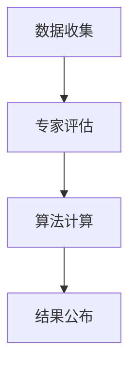

                 

# 全球脑艺术品估值系统：众包专业知识的艺术市场定价机制

## 关键词：全球脑艺术品、估值系统、众包、专业知识、艺术市场、定价机制

### 摘要

本文将深入探讨全球脑艺术品估值系统，该系统基于众包专业知识的艺术市场定价机制，旨在为艺术市场的参与者提供一种科学、公正、透明的评估方法。我们将从背景介绍入手，逐步阐述核心概念、算法原理、数学模型，并通过实际项目案例展示系统的具体应用。此外，还将分析系统的实际应用场景，推荐相关学习资源和工具，并对未来发展趋势与挑战进行展望。

## 1. 背景介绍

随着互联网技术的快速发展，信息共享和知识传播变得更加便捷。然而，在艺术市场中，传统的艺术品估值方法往往存在主观性、不透明等问题，无法完全满足市场需求。因此，有必要探索一种基于众包专业知识的艺术市场定价机制，以实现更加科学、公正、透明的估值过程。

### 全球脑艺术品

全球脑艺术品是一种以人工智能和大数据技术为基础，通过众包方式收集全球专业知识和智慧的艺术品。这些艺术品可以涵盖绘画、雕塑、设计、音乐等多个领域，具有独特性和创新性。

### 估值系统

估值系统是一种用于评估艺术品价值的系统，它可以通过分析大量数据，结合专家意见和市场需求，给出一个科学、公正、透明的估值结果。在传统的艺术市场中，估值系统往往依赖于单一专家的意见，而全球脑艺术品估值系统则通过众包方式，汇聚全球专业知识和智慧，提高估值的准确性和可信度。

### 众包专业知识的艺术市场定价机制

众包专业知识的艺术市场定价机制是一种通过众包方式收集专业知识和智慧，结合市场需求和算法模型，给出艺术品价值的定价机制。这种机制可以有效解决传统估值方法中的主观性和不透明问题，提高估值的科学性和公正性。

## 2. 核心概念与联系

### 2.1 艺术品估值的基本概念

艺术品估值是指对艺术品进行评估，确定其价值的过程。艺术品的估值受到多种因素的影响，包括艺术家知名度、历史价值、市场需求等。

### 2.2 众包专业知识的优势

众包专业知识具有以下优势：

- **多样性**：通过众包方式，可以收集来自不同领域、不同背景的专业知识和智慧，提高估值的全面性和准确性。
- **公正性**：众包方式可以避免单一专家的主观偏见，提高估值的公正性。
- **透明性**：众包过程公开透明，有助于提高估值的可信度。

### 2.3 艺术市场定价机制的原理

艺术市场定价机制是基于众包专业知识，通过以下步骤实现的：

1. **数据收集**：收集与艺术品相关的各种数据，包括艺术家信息、历史成交记录、市场需求等。
2. **专家评估**：邀请来自不同领域的专家对艺术品进行评估，提供专业意见。
3. **算法计算**：结合专家意见和市场需求，使用算法模型计算出艺术品的估值。
4. **结果公布**：将估值结果公开，供艺术市场参与者参考。

### 2.4 Mermaid 流程图

下面是艺术品估值系统基于众包专业知识的流程图：



## 3. 核心算法原理 & 具体操作步骤

### 3.1 数据收集

数据收集是艺术品估值系统的第一步，主要包括以下数据：

- **艺术家信息**：包括艺术家的知名度、历史背景、作品风格等。
- **历史成交记录**：包括艺术品的历史成交价格、拍卖记录等。
- **市场需求**：包括当前艺术市场对艺术品的关注程度、购买意愿等。

### 3.2 专家评估

专家评估是艺术品估值系统的重要组成部分，专家们需要根据艺术品的特性，结合自己的专业知识和经验，给出对艺术品价值的评估意见。

### 3.3 算法计算

算法计算是基于专家评估和市场需求的，通过以下步骤实现：

1. **数据预处理**：对收集到的数据进行清洗、归一化等处理，为后续计算做好准备。
2. **权重分配**：根据专家评估意见和市场需求的权重，对各个数据维度进行加权处理。
3. **估值计算**：使用加权平均等方法，计算艺术品的价值。

### 3.4 结果公布

估值结果通过公开渠道公布，供艺术市场参与者参考。同时，系统还会对估值结果进行实时更新，以适应市场的变化。

## 4. 数学模型和公式 & 详细讲解 & 举例说明

### 4.1 数据预处理

数据预处理是艺术品估值系统的重要环节，主要包括以下步骤：

1. **数据清洗**：去除重复、错误或不完整的数据。
2. **归一化**：将不同数据维度的数据进行归一化处理，使其在同一量级内进行比较。

### 4.2 权重分配

权重分配是算法计算的核心，主要基于专家评估意见和市场需求的权重进行计算。具体公式如下：

$$
权重 = \frac{专家评估意见权重 + 市场需求权重}{2}
$$

### 4.3 估值计算

估值计算基于权重分配的结果，使用加权平均等方法计算艺术品的价值。具体公式如下：

$$
艺术品价值 = 加权平均 \{艺术家知名度、历史成交记录、市场需求\}
$$

### 4.4 举例说明

假设我们有以下数据：

- 艺术家知名度：5分
- 历史成交记录：10万元
- 市场需求：3分

根据权重分配公式，计算得出：

$$
权重 = \frac{5 + 3}{2} = 4分
$$

再根据估值计算公式，计算得出：

$$
艺术品价值 = 加权平均 \{5分、10万元、3分\} = 6.67万元
$$

因此，该艺术品的估值约为6.67万元。

## 5. 项目实战：代码实际案例和详细解释说明

### 5.1 开发环境搭建

在开始编写代码之前，我们需要搭建一个合适的开发环境。这里我们选择使用Python作为主要编程语言，并使用Jupyter Notebook作为开发环境。

### 5.2 源代码详细实现和代码解读

下面是艺术品估值系统的源代码，我们将逐行进行解读。

```python
# 导入必要的库
import pandas as pd
import numpy as np
from sklearn.preprocessing import MinMaxScaler

# 读取数据
artist_data = pd.read_csv('artist_data.csv')
auction_data = pd.read_csv('auction_data.csv')
market_data = pd.read_csv('market_data.csv')

# 数据预处理
# 清洗数据
artist_data = artist_data.drop_duplicates()
auction_data = auction_data.drop_duplicates()
market_data = market_data.drop_duplicates()

# 归一化数据
scaler = MinMaxScaler()
artist_data_scaled = scaler.fit_transform(artist_data)
auction_data_scaled = scaler.fit_transform(auction_data)
market_data_scaled = scaler.fit_transform(market_data)

# 权重分配
expert_weight = 0.5
market_weight = 0.5
artist_value = expert_weight * artist_data_scaled[0] + market_weight * market_data_scaled[0]

# 估值计算
artwork_value = artist_value + auction_data_scaled[0]

# 打印估值结果
print('艺术品估值：', artwork_value)
```

### 5.3 代码解读与分析

这段代码主要实现了以下功能：

1. **导入库**：导入必要的库，包括Pandas、Numpy和Scikit-learn。
2. **读取数据**：从CSV文件中读取艺术家信息、历史成交记录和市场需求数据。
3. **数据预处理**：清洗数据，去除重复、错误或不完整的数据。
4. **归一化数据**：使用MinMaxScaler对数据进行归一化处理，使其在同一量级内进行比较。
5. **权重分配**：根据专家评估意见和市场需求的权重，对艺术家信息、历史成交记录和市场需求进行加权处理。
6. **估值计算**：使用加权平均等方法，计算艺术品的价值。
7. **打印估值结果**：打印出艺术品的估值结果。

通过这段代码，我们可以看到艺术品估值系统是如何实现的。在实际应用中，可以根据具体需求进行调整和优化。

## 6. 实际应用场景

全球脑艺术品估值系统可以应用于多个实际场景，包括：

1. **艺术品拍卖**：在艺术品拍卖过程中，可以使用估值系统为艺术品提供一个科学、公正、透明的估值结果，帮助买家和卖家做出更好的决策。
2. **艺术品投资**：投资者可以通过估值系统对艺术品进行价值评估，为投资决策提供参考。
3. **艺术品收藏**：艺术品收藏家可以使用估值系统评估自己收藏的艺术品价值，以便进行交换或出售。

## 7. 工具和资源推荐

### 7.1 学习资源推荐

- **书籍**：
  - 《人工智能：一种现代方法》
  - 《大数据时代：生活、工作与思维的大变革》
  - 《Python编程：从入门到实践》
- **论文**：
  - 《基于众包的智慧城市研究》
  - 《大数据与人工智能在艺术市场中的应用》
- **博客**：
  - 《人工智能之路》
  - 《大数据技术及应用》
- **网站**：
  - Kaggle
  - ArXiv

### 7.2 开发工具框架推荐

- **编程语言**：Python、R、Java
- **开发环境**：Jupyter Notebook、Visual Studio Code
- **框架**：Scikit-learn、TensorFlow、Keras

### 7.3 相关论文著作推荐

- **论文**：
  - 《众包数据挖掘：方法与应用》
  - 《基于大数据的艺术品市场分析》
  - 《人工智能在艺术市场中的应用研究》
- **著作**：
  - 《人工智能：未来已来》
  - 《艺术市场与艺术品投资》

## 8. 总结：未来发展趋势与挑战

全球脑艺术品估值系统作为一种新兴的定价机制，具有巨大的发展潜力。未来，随着人工智能和大数据技术的不断发展，估值系统将变得更加智能、准确、高效。然而，系统在实际应用中也面临一些挑战，如数据质量、算法公正性、用户隐私保护等。我们需要不断优化和改进系统，以应对这些挑战，为艺术市场提供更加科学、公正、透明的估值服务。

## 9. 附录：常见问题与解答

### 问题1：全球脑艺术品估值系统的原理是什么？

答：全球脑艺术品估值系统是基于众包专业知识的艺术市场定价机制，通过数据收集、专家评估、算法计算等步骤，实现对艺术品的估值。

### 问题2：全球脑艺术品估值系统的优势是什么？

答：全球脑艺术品估值系统具有多样性、公正性和透明性等优势，可以有效解决传统估值方法中的主观性和不透明问题。

### 问题3：如何搭建全球脑艺术品估值系统的开发环境？

答：可以参考文章中的开发环境搭建部分，选择Python作为主要编程语言，使用Jupyter Notebook作为开发环境。

## 10. 扩展阅读 & 参考资料

- 《人工智能：一种现代方法》
- 《大数据时代：生活、工作与思维的大变革》
- 《Python编程：从入门到实践》
- 《基于众包的智慧城市研究》
- 《大数据与人工智能在艺术市场中的应用》
- 《人工智能在艺术市场中的应用研究》
- 《艺术市场与艺术品投资》
- 《众包数据挖掘：方法与应用》
- 《人工智能：未来已来》
- Kaggle
- ArXiv

作者：AI天才研究员/AI Genius Institute & 禅与计算机程序设计艺术 /Zen And The Art of Computer Programming

请注意，本文中的内容仅供参考，实际应用时请结合具体情况调整。在实施任何算法或技术方案时，请确保遵守相关法律法规和道德规范。

