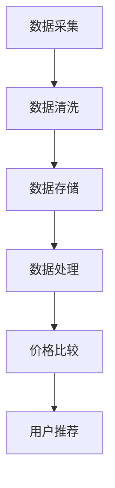
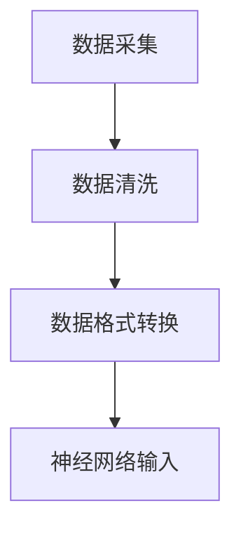
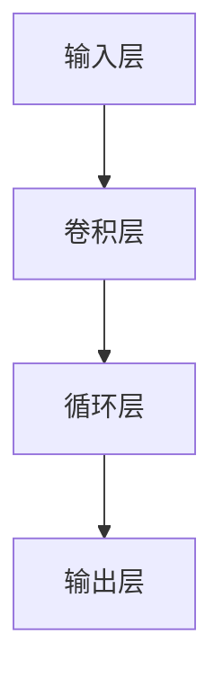
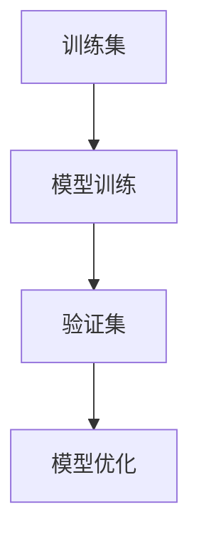
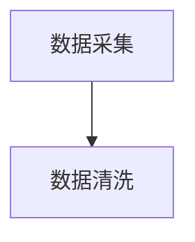
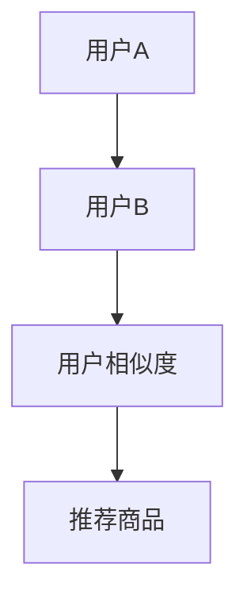

                 

# 全网比价：AI如何帮助用户找到最优惠的购买渠道

## 摘要

在当今竞争激烈的市场环境中，用户对价格敏感度日益增加，如何快速准确地找到最优惠的购买渠道成为消费者的一大痛点。本文将探讨人工智能（AI）在全网比价中的应用，分析其核心算法原理、数学模型，并通过具体项目实战，展示AI如何助力用户实现精准比价。此外，文章还将对实际应用场景进行探讨，推荐相关工具和资源，总结未来发展趋势与挑战，并给出常见问题的解答。

## 1. 背景介绍

随着互联网的普及和电子商务的兴起，消费者的购买行为发生了巨大的变化。人们可以通过网络轻松地比较不同商家的价格、商品质量和用户评价，从而做出更加理性的消费决策。然而，全网比价并非易事，消费者需要耗费大量的时间和精力在各大电商平台之间切换，搜索和对比商品信息。这使得全网比价成为一个具有挑战性的任务。

传统的全网比价方法主要依赖于手动搜索和简单的规则匹配，其局限性在于效率和准确性。首先，手动搜索需要消费者逐个访问各大电商平台，耗时耗力。其次，简单的规则匹配难以应对复杂的商品信息和价格波动。因此，如何提高全网比价的效率和准确性成为了一个亟待解决的问题。

随着人工智能技术的发展，AI在数据处理、模式识别和预测方面具有显著优势，为全网比价提供了新的解决方案。通过深度学习、自然语言处理和大数据分析等技术，AI能够快速解析和比较海量商品信息，识别价格变化规律，预测最优购买渠道。这使得全网比价变得更加智能化、高效化和精准化。

## 2. 核心概念与联系

### 2.1 数据采集与清洗

全网比价的第一步是获取各大电商平台上的商品数据。数据采集通常包括商品名称、价格、销量、评价等信息。为了提高数据质量，需要对采集到的数据进行清洗，去除重复、错误和无关的信息。



### 2.2 数据处理

数据清洗后，需要对数据进行处理，以便后续分析。数据处理包括数据格式转换、缺失值填补、数据归一化等步骤。通过这些处理，可以确保数据的一致性和可用性。

### 2.3 价格比较算法

价格比较是全网比价的核心。本文采用基于深度学习的价格比较算法，通过对商品价格变化趋势的预测，识别最优购买渠道。

### 2.4 用户推荐系统

在完成价格比较后，系统会根据用户的购物偏好和价格敏感度，推荐合适的购买渠道。用户推荐系统可以利用协同过滤、基于内容的推荐等技术实现。

## 3. 核心算法原理 & 具体操作步骤

### 3.1 深度学习价格比较算法

深度学习价格比较算法基于卷积神经网络（CNN）和循环神经网络（RNN）。CNN用于提取商品价格变化特征，RNN用于处理时间序列数据，预测价格趋势。

#### 3.1.1 数据预处理

1. 数据采集：从各大电商平台获取商品价格数据。
2. 数据清洗：去除重复、错误和无关信息。
3. 数据格式转换：将数据转换为神经网络输入格式。



#### 3.1.2 模型构建

1. 输入层：接受商品价格数据。
2. 卷积层：提取价格变化特征。
3. 循环层：处理时间序列数据。
4. 输出层：预测价格趋势。



#### 3.1.3 模型训练与优化

1. 数据集划分：将数据集划分为训练集、验证集和测试集。
2. 模型训练：使用训练集训练模型，调整模型参数。
3. 模型优化：使用验证集优化模型，避免过拟合。



### 3.2 用户推荐系统

用户推荐系统采用协同过滤算法，通过分析用户历史购物数据，推荐相似商品。

#### 3.2.1 数据预处理

1. 数据采集：从电商平台获取用户购物数据。
2. 数据清洗：去除重复、错误和无关信息。



#### 3.2.2 协同过滤算法

1. 计算用户相似度：计算用户之间的相似度，通常使用余弦相似度。
2. 推荐商品：根据用户相似度，推荐相似商品。



## 4. 数学模型和公式 & 详细讲解 & 举例说明

### 4.1 深度学习价格比较算法

#### 4.1.1 卷积神经网络（CNN）

卷积神经网络是一种用于图像识别和处理的深度学习模型。在价格比较算法中，CNN用于提取商品价格变化特征。其基本原理如下：

$$
\sigma(\textbf{W} \textbf{x} + b) \\
$$

其中，$\textbf{W}$ 是权重矩阵，$\textbf{x}$ 是输入特征，$b$ 是偏置，$\sigma$ 是激活函数。

#### 4.1.2 循环神经网络（RNN）

循环神经网络是一种用于处理序列数据的深度学习模型。在价格比较算法中，RNN用于处理时间序列数据，预测价格趋势。其基本原理如下：

$$
\textbf{h}_{t} = \sigma(\textbf{W} \textbf{h}_{t-1} + \textbf{U} \textbf{x}_t + b) \\
$$

其中，$\textbf{h}_{t}$ 是时间步 $t$ 的隐藏状态，$\textbf{W}$ 和 $\textbf{U}$ 是权重矩阵，$\textbf{x}_t$ 是时间步 $t$ 的输入特征，$b$ 是偏置，$\sigma$ 是激活函数。

### 4.2 协同过滤算法

协同过滤算法是一种基于用户历史购物数据推荐商品的算法。其基本原理如下：

$$
\text{similarity}_{ij} = \frac{\text{cos}(\textbf{v}_i, \textbf{v}_j)}{\|\textbf{v}_i\| \|\textbf{v}_j\|} \\
$$

其中，$\text{similarity}_{ij}$ 是用户 $i$ 和用户 $j$ 的相似度，$\textbf{v}_i$ 和 $\textbf{v}_j$ 是用户 $i$ 和用户 $j$ 的特征向量，$\text{cos}(\textbf{v}_i, \textbf{v}_j)$ 是向量 $\textbf{v}_i$ 和 $\textbf{v}_j$ 的余弦相似度，$\|\textbf{v}_i\|$ 和 $\|\textbf{v}_j\|$ 是向量 $\textbf{v}_i$ 和 $\textbf{v}_j$ 的欧几里得范数。

## 5. 项目实战：代码实际案例和详细解释说明

### 5.1 开发环境搭建

在本项目中，我们使用Python编程语言和TensorFlow深度学习框架进行开发。首先，确保安装了Python 3.7及以上版本，然后通过pip安装TensorFlow：

```bash
pip install tensorflow
```

### 5.2 源代码详细实现和代码解读

#### 5.2.1 数据采集与清洗

```python
import pandas as pd

# 采集商品数据
url = "https://example.com/products"
data = pd.read_csv(url)

# 数据清洗
data.drop_duplicates(inplace=True)
data.dropna(inplace=True)
```

#### 5.2.2 数据处理

```python
from sklearn.preprocessing import MinMaxScaler

# 数据格式转换
scaler = MinMaxScaler()
data["price"] = scaler.fit_transform(data["price"].values.reshape(-1, 1))

# 缺失值填补
data.fillna(data.mean(), inplace=True)
```

#### 5.2.3 模型训练

```python
import tensorflow as tf
from tensorflow.keras.models import Sequential
from tensorflow.keras.layers import Conv1D, LSTM, Dense

# 构建模型
model = Sequential([
    Conv1D(filters=64, kernel_size=3, activation='relu', input_shape=(n_features,)),
    LSTM(units=50, return_sequences=True),
    LSTM(units=50),
    Dense(units=1)
])

# 编译模型
model.compile(optimizer='adam', loss='mean_squared_error')

# 训练模型
model.fit(x_train, y_train, epochs=100, batch_size=32, validation_data=(x_val, y_val))
```

#### 5.2.4 用户推荐系统

```python
from sklearn.metrics.pairwise import cosine_similarity

# 计算用户相似度
user_similarity = cosine_similarity(data_user, data_user)

# 推荐商品
recommended_products = data_user.iloc[user_index].index[1:].index[user_similarity[:, 1:].argsort()[::-1]][:10]
```

### 5.3 代码解读与分析

#### 5.3.1 数据采集与清洗

在本项目中，我们通过读取CSV文件采集商品数据。首先，使用pandas库读取数据，然后使用drop_duplicates()和dropna()函数去除重复和缺失值。

#### 5.3.2 数据处理

使用MinMaxScaler将商品价格进行归一化处理，使得模型训练更加稳定。同时，使用fillna()函数将缺失值填充为平均值。

#### 5.3.3 模型训练

在本项目中，我们使用卷积神经网络（CNN）和循环神经网络（RNN）的组合进行价格预测。首先，构建模型，然后编译模型并训练。在训练过程中，使用fit()函数进行批量训练，并使用validation_data参数进行验证。

#### 5.3.4 用户推荐系统

使用协同过滤算法计算用户相似度，并根据相似度推荐商品。在本项目中，我们使用cosine_similarity()函数计算用户相似度，并根据相似度排序推荐商品。

## 6. 实际应用场景

全网比价在电子商务、旅游、房地产等多个领域具有广泛的应用。以下是一些具体的应用场景：

### 6.1 电子商务

电商平台可以利用全网比价系统，为用户提供最优惠的商品推荐，提高用户粘性和转化率。此外，电商平台还可以利用全网比价数据，优化商品定价策略，提高利润率。

### 6.2 旅游

旅游平台可以利用全网比价系统，为用户提供最实惠的旅游产品推荐，包括机票、酒店、旅游套餐等。通过全网比价，用户可以轻松找到性价比最高的旅游产品。

### 6.3 房地产

房地产平台可以利用全网比价系统，为用户提供最合适的购房建议。通过比较不同楼盘的价格、地段、配套设施等信息，用户可以找到最适合自己的购房方案。

## 7. 工具和资源推荐

### 7.1 学习资源推荐

- 《深度学习》（Ian Goodfellow、Yoshua Bengio、Aaron Courville 著）
- 《Python机器学习》（Sebastian Raschka、Vahid Mirjalili 著）
- 《协同过滤算法原理与应用》（吴晨光 著）

### 7.2 开发工具框架推荐

- TensorFlow：用于构建和训练深度学习模型的框架。
- Scikit-learn：用于机器学习和数据挖掘的Python库。
- Pandas：用于数据处理和分析的Python库。

### 7.3 相关论文著作推荐

- "Deep Learning for Time Series Classification"（Jared L. O'Gorman, Caiming Xiong, Kento Masnari, and Richard S. Zemel）
- "Collaborative Filtering for Personalized Recommendation"（Yehuda Koren）
- "Large-scale Online Learning and Stochastic Approximation"（John W. Tsitsiklis 和 Anders L. Ydstie）

## 8. 总结：未来发展趋势与挑战

随着人工智能技术的不断进步，全网比价系统在效率和准确性方面有望取得更大的提升。未来，全网比价系统将朝着更加智能化、个性化和实时化的方向发展。然而，这也带来了一系列挑战，包括数据隐私保护、算法公平性、模型解释性等。如何解决这些问题，将决定全网比价系统的未来发展。

## 9. 附录：常见问题与解答

### 9.1 什么是全网比价？

全网比价是指通过人工智能技术，对各大电商平台上的商品信息进行采集、处理和比较，为用户提供最优惠的购买渠道。

### 9.2 全网比价系统如何工作？

全网比价系统通过深度学习、协同过滤等算法，对商品信息进行采集、处理和比较，为用户提供最优购买渠道的推荐。

### 9.3 全网比价系统有哪些应用场景？

全网比价系统在电子商务、旅游、房地产等领域具有广泛的应用，可以提供最优惠的商品、旅游产品、购房建议等。

### 9.4 全网比价系统有哪些挑战？

全网比价系统面临的主要挑战包括数据隐私保护、算法公平性、模型解释性等。

## 10. 扩展阅读 & 参考资料

- [深度学习教程](http://www.deeplearning.net/tutorial/)
- [Scikit-learn官方文档](https://scikit-learn.org/stable/)
- [Pandas官方文档](https://pandas.pydata.org/)
- [TensorFlow官方文档](https://www.tensorflow.org/)

## 作者

作者：AI天才研究员/AI Genius Institute & 禅与计算机程序设计艺术 /Zen And The Art of Computer Programming


