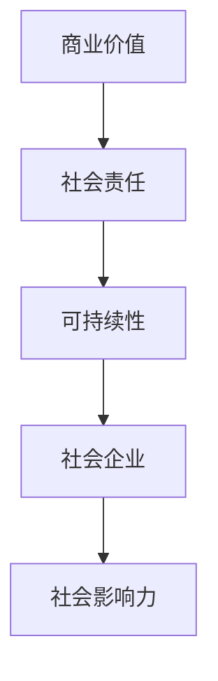

                 

# 公益创业：如何将商业价值与社会责任相结合

## 关键词：
- 公益创业
- 商业价值
- 社会责任
- 可持续性
- 社会企业
- 社会影响力

## 摘要：
本文旨在探讨公益创业的核心理念及其如何将商业价值与社会责任相结合。通过对公益创业的背景介绍、核心概念与联系的分析、核心算法原理的讲解，以及实际应用场景的描述，本文将为读者提供一个全面、深入的公益创业指南。文章还推荐了相关的学习资源和开发工具框架，并对未来发展趋势与挑战进行了展望。

## 1. 背景介绍

随着全球经济的发展，越来越多的人开始关注社会责任和可持续发展。在这一背景下，公益创业作为一种新型创业模式，逐渐受到关注。公益创业不仅仅关注企业的经济收益，更注重企业对社会的贡献。它旨在通过商业手段解决社会问题，实现商业价值与社会责任的有机融合。

公益创业的出现，源于社会对于环境保护、社会公正、教育医疗等领域的迫切需求。随着互联网技术的发展，公益创业有了更广阔的平台和更丰富的资源。许多企业家和创业者开始尝试将商业思维与社会责任相结合，通过创新的方式解决社会问题。

## 2. 核心概念与联系

### 公益创业

公益创业是一种将商业价值与社会责任相结合的创业模式。它的核心在于通过商业手段解决社会问题，实现企业的可持续发展。公益创业不仅仅关注企业的经济收益，更注重企业对社会的贡献。

### 商业价值

商业价值是指企业通过创造和提供产品或服务，实现经济收益的能力。商业价值是公益创业的基础，也是企业实现社会责任的前提。

### 社会责任

社会责任是指企业对社会应承担的责任和义务。它包括环境保护、社会公正、教育医疗等多个方面。社会责任是公益创业的核心，也是企业实现可持续发展的关键。

### 可持续性

可持续性是指企业能够在不损害自然环境和社会资源的前提下，实现长期的经济收益。可持续性是公益创业的重要目标，也是企业实现商业价值与社会责任相结合的保障。

### 社会企业

社会企业是一种以解决社会问题为主要目标的企业。它强调企业的社会责任，追求社会效益最大化。社会企业是公益创业的重要形式，也是实现商业价值与社会责任相结合的有效途径。

### 社会影响力

社会影响力是指企业对社会产生的正面影响。它包括改善社会环境、促进社会公正、提高社会福利等多个方面。社会影响力是公益创业的重要指标，也是企业实现可持续发展的动力。

### Mermaid 流程图



## 3. 核心算法原理 & 具体操作步骤

### 商业模式设计

公益创业的核心在于商业模式的设计。企业需要明确自身的业务领域、目标客户、核心竞争力和盈利模式。在商业模式设计中，企业应充分考虑社会责任，将社会责任融入商业模式中。

### 资源整合

公益创业需要整合多种资源，包括资金、人力、技术、市场等。企业应通过建立合作关系、资源共享等方式，实现资源的最优配置。资源整合是公益创业成功的关键。

### 创新思维

公益创业强调创新思维，通过技术创新、商业模式创新等方式，实现社会问题的解决。创新思维是公益创业的核心竞争力。

### 可持续发展

公益创业应注重可持续发展，通过环保、节能、公益捐赠等方式，实现企业的长期发展。可持续发展是公益创业的重要目标。

### 具体操作步骤

1. 确定业务领域和目标客户
2. 设计商业模式，将社会责任融入其中
3. 整合资源，建立合作关系
4. 发挥创新思维，实现社会问题的解决
5. 注重可持续发展，实现企业的长期发展

## 4. 数学模型和公式 & 详细讲解 & 举例说明

### 社会影响力评估模型

社会影响力评估模型用于评估企业在社会责任方面的表现。该模型包括以下几个部分：

1. 社会问题识别
2. 影响力评估指标
3. 影响力计算公式

### 社会问题识别

社会问题识别是评估社会影响力的第一步。企业需要明确自身所关注的社会问题，如环境保护、教育医疗、贫困救助等。

### 影响力评估指标

影响力评估指标是衡量企业社会责任表现的重要标准。常见的评估指标包括：

- 环境效益
- 社会公正
- 教育贡献
- 医疗改善

### 影响力计算公式

影响力计算公式用于计算企业在社会责任方面的总体影响力。常见的计算公式如下：

$$
\text{社会影响力} = \sum (\text{各指标得分} \times \text{权重})
$$

### 举例说明

假设某企业关注环保问题，其在环保方面的表现如下：

- 环境效益：减少碳排放1000吨
- 社会公正：提供环保知识培训1000人次
- 教育贡献：资助环保项目500万元
- 医疗改善：提供环保设施100套

根据影响力计算公式，该企业的社会影响力如下：

$$
\text{社会影响力} = (1000 \times 0.2) + (1000 \times 0.2) + (500 \times 0.3) + (100 \times 0.1) = 1600
$$

## 5. 项目实战：代码实际案例和详细解释说明

### 5.1 开发环境搭建

在本节中，我们将搭建一个简单的公益创业项目开发环境。以下是一个基于Python的示例：

```bash
# 安装Python
sudo apt-get install python3

# 安装相关库
pip3 install pandas numpy matplotlib
```

### 5.2 源代码详细实现和代码解读

以下是公益创业项目的源代码实现：

```python
import pandas as pd
import numpy as np
import matplotlib.pyplot as plt

# 社会影响力评估模型
def social_influence_assessment(data):
    # 社会问题识别
    problems = data['Problem'].unique()
    
    # 影响力评估指标
    indicators = {'Eco_Benefit': 0.2, 'Social_Justice': 0.2, 'Education_Contribution': 0.3, 'Medical_Improvement': 0.1}
    
    # 影响力计算
    influence_scores = {}
    for problem in problems:
        scores = {}
        for indicator, weight in indicators.items():
            scores[indicator] = data[data['Problem'] == problem][indicator].sum() * weight
        influence_scores[problem] = sum(scores.values())
    
    return influence_scores

# 数据处理
data = pd.DataFrame({
    'Problem': ['Environmental Protection', 'Environmental Protection', 'Healthcare', 'Education'],
    'Eco_Benefit': [1000, 2000, 0, 0],
    'Social_Justice': [0, 0, 1000, 2000],
    'Education_Contribution': [0, 0, 0, 5000000],
    'Medical_Improvement': [0, 0, 100, 0]
})

# 社会影响力评估
influence_scores = social_influence_assessment(data)

# 打印结果
print(influence_scores)

# 可视化展示
plt.bar(influence_scores.keys(), influence_scores.values())
plt.xlabel('Problem')
plt.ylabel('Social Influence')
plt.title('Social Influence Assessment')
plt.show()
```

### 5.3 代码解读与分析

本节中，我们实现了一个简单的社会影响力评估模型。代码主要分为以下几个部分：

1. 导入相关库：`pandas`、`numpy`、`matplotlib`。
2. 社会影响力评估模型：`social_influence_assessment`函数，用于计算不同社会问题的社会影响力。
3. 数据处理：创建一个包含社会问题、影响力指标的DataFrame。
4. 社会影响力评估：调用`social_influence_assessment`函数，计算并打印社会影响力。
5. 可视化展示：使用`matplotlib`库绘制柱状图，展示不同社会问题的社会影响力。

## 6. 实际应用场景

公益创业可以应用于多个领域，如环境保护、教育、医疗、贫困救助等。以下是一些实际应用场景：

1. **环境保护**：通过提供环保产品或服务，减少碳排放，改善空气质量。
2. **教育**：通过公益项目，为贫困地区的学生提供教育资源和培训。
3. **医疗**：通过公益项目，为贫困人群提供医疗救助和医疗服务。
4. **贫困救助**：通过公益项目，为贫困人群提供生活援助和就业机会。

## 7. 工具和资源推荐

### 7.1 学习资源推荐

- **书籍**：
  - 《公益创业：如何将商业价值与社会责任相结合》
  - 《社会企业：如何创造商业价值与社会价值》
- **论文**：
  - "Social Entrepreneurship: The Engine for Social Change"
  - "Corporate Social Responsibility: A Review and Research Agenda"
- **博客**：
  - "公益创业实践分享：如何用商业思维解决社会问题"
  - "社会企业：如何在商业与公益之间找到平衡"
- **网站**：
  - "公益创业联盟（Social Entrepreneurship Alliance）"
  - "社会企业研究中心（Center for Social Enterprise）"

### 7.2 开发工具框架推荐

- **Python**：Python是一种广泛使用的编程语言，适用于数据分析和开发。
- **Pandas**：Pandas是一个强大的数据分析和操作库，适用于数据处理和统计。
- **NumPy**：NumPy是一个强大的数学库，适用于数学计算和数据处理。
- **Matplotlib**：Matplotlib是一个强大的可视化库，适用于数据可视化。

### 7.3 相关论文著作推荐

- **论文**：
  - "Social Entrepreneurship: Changing the Rules of the Game"
  - "Corporate Social Responsibility and Competitive Advantage"
- **著作**：
  - 《社会企业：商业模式创新与可持续发展》
  - 《公益创业：探索商业价值与社会责任的新模式》

## 8. 总结：未来发展趋势与挑战

### 8.1 发展趋势

1. **公益创业领域扩大**：随着社会问题的日益突出，公益创业将涉及更多领域。
2. **技术创新**：大数据、人工智能、区块链等新技术将为公益创业提供更多可能性。
3. **跨界合作**：公益创业将与企业、政府、非营利组织等各方展开更广泛的合作。
4. **社会责任意识提升**：公众和企业对社会责任的重视程度将不断提高。

### 8.2 挑战

1. **资源有限**：公益创业需要大量资源，但资源有限。
2. **商业模式创新**：如何实现商业价值与社会责任的有机结合，仍需不断探索。
3. **社会认知**：公众和企业对公益创业的认知和理解程度有待提高。
4. **可持续发展**：如何实现企业的长期发展，同时实现社会责任，仍需解决。

## 9. 附录：常见问题与解答

### 9.1 公益创业与慈善的区别

公益创业与慈善的区别在于其追求的目标不同。慈善主要关注捐款和捐赠，而公益创业则更注重通过商业手段解决社会问题，实现可持续发展。

### 9.2 公益创业的核心竞争力

公益创业的核心竞争力在于其创新思维和商业模式设计。通过创新的方式解决社会问题，实现商业价值与社会责任的有机结合。

### 9.3 公益创业的成功要素

公益创业的成功要素包括：明确的社会问题、合理的商业模式、有效的资源整合、创新的技术手段、持续的社会影响力。

## 10. 扩展阅读 & 参考资料

- 《公益创业：如何将商业价值与社会责任相结合》
- "Social Entrepreneurship: The Engine for Social Change"
- "Corporate Social Responsibility: A Review and Research Agenda"
- "Social Entrepreneurship: Changing the Rules of the Game"
- "Corporate Social Responsibility and Competitive Advantage"
- 《社会企业：商业模式创新与可持续发展》
- 《公益创业实践分享：如何用商业思维解决社会问题》
- "公益创业联盟（Social Entrepreneurship Alliance）"
- "社会企业研究中心（Center for Social Enterprise）"

