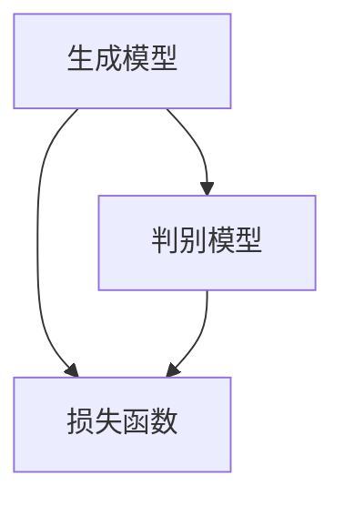

                 

## 1. 背景介绍

内容生成(Content Generation)是近年来人工智能领域的一个热点研究方向。它的核心目标是利用算法和技术，自动生成具有特定风格和内容的信息，如图像、文本、音频等。随着深度学习技术的不断发展，内容生成已经从传统的规则驱动方法，向数据驱动方法（如生成对抗网络GANs、变分自编码器VAEs等）转变。

内容生成技术不仅有着广泛的应用前景，如虚拟现实、增强现实、游戏开发、图像编辑、音乐创作等，也在数据科学和自然语言处理领域发挥着重要作用。例如，自然语言生成(NLG)技术可以用于自动生成新闻、报告、邮件等文本内容，辅助人类进行文本创作。

本文将详细探讨内容生成的原理，包括核心概念、算法原理、数学模型以及具体实现案例。我们将使用逻辑清晰、结构紧凑、简单易懂的专业技术语言，帮助读者全面了解内容生成技术，并掌握其实际应用。

### 关键词：内容生成、深度学习、生成对抗网络GANs、变分自编码器VAEs、自然语言生成NLG、图像生成、音频生成

### 摘要：

本文旨在介绍内容生成技术的原理、核心算法、数学模型及其在实际应用中的实现。通过详细阐述内容生成的背景、核心概念、算法原理、数学模型以及具体实现案例，读者可以全面了解内容生成技术的最新进展，掌握其应用技巧，并为未来的研究提供方向。本文关键词包括内容生成、深度学习、生成对抗网络GANs、变分自编码器VAEs、自然语言生成NLG、图像生成、音频生成。

## 2. 核心概念与联系

在探讨内容生成之前，我们需要了解一些核心概念，包括生成模型、判别模型、损失函数等。这些概念是理解内容生成技术的基础，同时也是搭建内容生成系统的关键组成部分。

### 2.1 生成模型（Generator）

生成模型是内容生成技术的核心组件，它的作用是根据某种概率分布生成新的数据样本。生成模型通常是一个神经网络，其输入可以是随机噪声或者其他辅助信息，输出则是生成的新数据样本。常见的生成模型有生成对抗网络（GANs）和变分自编码器（VAEs）。

#### 2.1.1 生成对抗网络（GANs）

生成对抗网络（GANs）是由Ian Goodfellow等人于2014年提出的一种生成模型。GANs由两个神经网络组成：生成器（Generator）和判别器（Discriminator）。生成器的任务是生成尽可能真实的数据样本，而判别器的任务是区分真实数据和生成数据。在训练过程中，生成器和判别器相互竞争，生成器不断优化自己的生成能力，而判别器则不断加强自己的判断能力。这种对抗训练机制使得生成器能够生成高质量的数据样本。

#### 2.1.2 变分自编码器（VAEs）

变分自编码器（VAEs）是另一种生成模型，由Diederik P. Kingma和Max Welling于2013年提出。VAEs的目标是学习数据的概率分布，并通过采样生成新的数据样本。VAEs包含一个编码器（Encoder）和一个解码器（Decoder）。编码器将输入数据映射到一个潜在空间，解码器则从潜在空间中采样并重构输入数据。

### 2.2 判别模型（Discriminator）

判别模型是另一个核心组件，其作用是区分真实数据和生成数据。在生成对抗网络（GANs）中，判别模型是一个二分类神经网络，输入是一个数据样本，输出是一个概率值，表示该样本是真实的还是生成的。判别模型的目标是尽可能准确地判断输入数据是真实数据还是生成数据。

### 2.3 损失函数（Loss Function）

损失函数是评估模型性能的重要工具，其作用是衡量模型预测结果与真实结果之间的差异。在内容生成中，损失函数用于评估生成模型和判别模型的性能。常见的损失函数有均方误差（MSE）、交叉熵（Cross-Entropy）等。

#### 2.3.1 均方误差（MSE）

均方误差（MSE）是一种常用的损失函数，用于衡量模型预测结果与真实结果之间的差异。MSE的公式如下：

\[ 
MSE = \frac{1}{n}\sum_{i=1}^{n}(y_i - \hat{y}_i)^2 
\]

其中，\( y_i \)表示真实值，\( \hat{y}_i \)表示预测值，\( n \)表示样本数量。

#### 2.3.2 交叉熵（Cross-Entropy）

交叉熵（Cross-Entropy）是另一种常用的损失函数，用于衡量模型预测结果与真实结果之间的差异。交叉熵的公式如下：

\[ 
H(y, \hat{y}) = -\sum_{i=1}^{n} y_i \log(\hat{y}_i) 
\]

其中，\( y \)表示真实概率分布，\( \hat{y} \)表示预测概率分布。

### 2.4 Mermaid 流程图

为了更直观地展示生成模型、判别模型和损失函数之间的关系，我们可以使用Mermaid流程图进行描述。以下是生成模型、判别模型和损失函数的Mermaid流程图：



在这个流程图中，生成模型、判别模型和损失函数构成了一个整体，生成模型生成数据样本，判别模型判断数据样本的真实性，损失函数评估模型的性能。通过这个过程，我们可以更好地理解内容生成技术的基本原理和实现方法。

## 3. 核心算法原理 & 具体操作步骤

在了解内容生成的核心概念之后，我们需要深入探讨生成对抗网络（GANs）和变分自编码器（VAEs）这两种核心算法的原理及其具体操作步骤。

### 3.1 生成对抗网络（GANs）的原理与步骤

#### 3.1.1 GANs的原理

生成对抗网络（GANs）由生成器和判别器两个部分组成。生成器的任务是生成尽可能真实的数据样本，判别器的任务是区分真实数据和生成数据。在训练过程中，生成器和判别器相互竞争，生成器不断优化自己的生成能力，而判别器则不断加强自己的判断能力。这种对抗训练机制使得生成器能够生成高质量的数据样本。

GANs的原理可以简单概括为以下三个步骤：

1. **生成器生成假样本**：生成器从随机噪声或其他辅助信息中生成假样本。

2. **判别器判断真伪**：判别器接收真实数据和生成数据，判断它们是真实的还是生成的。

3. **优化生成器和判别器**：通过反向传播和梯度下降算法，同时优化生成器和判别器。

#### 3.1.2 GANs的具体操作步骤

下面是GANs的具体操作步骤：

1. **初始化生成器和判别器**：随机初始化生成器和判别器的参数。

2. **生成假样本**：生成器从随机噪声或其他辅助信息中生成假样本。

3. **判别器判断真伪**：判别器接收真实数据和生成数据，分别计算它们的概率。

4. **计算损失函数**：根据判别器的输出，计算生成器和判别器的损失函数。

5. **反向传播和梯度下降**：通过反向传播算法，计算生成器和判别器的梯度，并使用梯度下降算法更新参数。

6. **迭代训练**：重复上述步骤，直到生成器生成的假样本足够真实，判别器无法区分真实数据和生成数据。

### 3.2 变分自编码器（VAEs）的原理与步骤

#### 3.2.1 VAEs的原理

变分自编码器（VAEs）是一种生成模型，其目标是通过编码器学习数据的概率分布，并通过解码器生成新的数据样本。VAEs包含编码器和解码器两个部分，编码器将输入数据映射到一个潜在空间，解码器从潜在空间中采样并重构输入数据。

VAEs的原理可以简单概括为以下三个步骤：

1. **编码器将输入映射到潜在空间**：编码器将输入数据映射到一个潜在空间，潜在空间中的每个点表示输入数据的一个可能分布。

2. **从潜在空间中采样**：解码器从潜在空间中采样，生成新的数据样本。

3. **重构输入数据**：解码器将采样得到的新数据样本重构为输入数据。

#### 3.2.2 VAEs的具体操作步骤

下面是VAEs的具体操作步骤：

1. **初始化编码器和解码器**：随机初始化编码器和解码器的参数。

2. **编码器将输入映射到潜在空间**：编码器将输入数据映射到一个潜在空间，得到潜在空间中的表示。

3. **从潜在空间中采样**：解码器从潜在空间中采样，生成新的数据样本。

4. **解码器重构输入数据**：解码器将采样得到的新数据样本重构为输入数据。

5. **计算损失函数**：根据重构的数据样本和输入数据，计算编码器和解码器的损失函数。

6. **反向传播和梯度下降**：通过反向传播算法，计算编码器和解码器的梯度，并使用梯度下降算法更新参数。

7. **迭代训练**：重复上述步骤，直到编码器和解码器生成的数据样本足够真实。

### 3.3 GANs与VAEs的比较

生成对抗网络（GANs）和变分自编码器（VAEs）都是内容生成技术中的核心算法，它们各自有着不同的优势和特点。

**GANs的优势：**

- GANs可以生成高质量、多样性的数据样本，特别是在图像和音频生成领域表现突出。
- GANs的训练过程具有很强的竞争性，使得生成器和判别器都能够在训练过程中不断优化。

**GANs的劣势：**

- GANs的训练过程不稳定，容易出现模式崩溃（mode collapse）和梯度消失（梯度消失）等问题。
- GANs的训练过程需要大量的计算资源，训练时间较长。

**VAEs的优势：**

- VAEs可以生成具有良好可解释性的数据样本，特别是在文本生成和音频生成领域表现较好。
- VAEs的训练过程相对稳定，不容易出现模式崩溃和梯度消失等问题。

**VAEs的劣势：**

- VAEs生成的数据样本质量相对较低，特别是在图像和音频生成领域，VAEs生成的样本可能缺乏细节和多样性。

通过比较GANs和VAEs，我们可以根据具体应用场景选择合适的算法。例如，在图像和音频生成领域，GANs通常是一个更好的选择；而在文本生成和音频生成领域，VAEs则具有优势。

## 4. 数学模型和公式 & 详细讲解 & 举例说明

为了更好地理解内容生成技术中的数学模型和公式，我们将详细讲解生成对抗网络（GANs）和变分自编码器（VAEs）中的关键数学模型，并给出具体的例子来说明这些公式的应用。

### 4.1 生成对抗网络（GANs）的数学模型

生成对抗网络（GANs）的核心在于生成器和判别器的对抗训练。下面是GANs中的主要数学模型和公式：

#### 4.1.1 生成器和判别器的损失函数

生成器 \( G \) 的目标是生成尽可能真实的数据样本 \( x_g \)，判别器 \( D \) 的目标是区分真实数据样本 \( x_r \) 和生成数据样本 \( x_g \)。生成器和判别器的损失函数如下：

\[ 
L_G = -\log(D(x_r)) - \log(1 - D(x_g)) 
\]

\[ 
L_D = -\log(D(x_r)) - \log(1 - D(x_g)) 
\]

其中，\( D \) 表示判别器的输出概率，当 \( D(x_r) \) 接近 1 时，表示输入的是真实数据；当 \( D(x_g) \) 接近 0 时，表示输入的是生成数据。

#### 4.1.2 反向传播和梯度下降

在训练过程中，生成器和判别器通过反向传播算法和梯度下降算法不断优化参数。对于生成器 \( G \) 的梯度更新如下：

\[ 
\Delta \theta_G = -\alpha \frac{\partial L_G}{\partial \theta_G} 
\]

对于判别器 \( D \) 的梯度更新如下：

\[ 
\Delta \theta_D = -\alpha \frac{\partial L_D}{\partial \theta_D} 
\]

其中，\( \alpha \) 表示学习率。

### 4.2 变分自编码器（VAEs）的数学模型

变分自编码器（VAEs）的核心在于编码器 \( \text{Encoder} \) 和解码器 \( \text{Decoder} \) 的组合。下面是VAEs中的主要数学模型和公式：

#### 4.2.1 编码器和解码器的损失函数

编码器 \( \text{Encoder} \) 的目标是学习数据的概率分布 \( p(z|x) \)，解码器 \( \text{Decoder} \) 的目标是根据编码器生成的潜在空间中的样本 \( z \) 重构输入数据 \( x \)。VAEs的损失函数包括两部分：重构损失和KL散度损失。

重构损失：

\[ 
L_{\text{recon}} = -\sum_{i=1}^{N} \log p(x|\theta) 
\]

KL散度损失：

\[ 
L_{\text{KL}} = \sum_{i=1}^{N} D_{\text{KL}}(\hat{p}_z || p_z) 
\]

其中，\( N \) 表示数据样本数量，\( \hat{p}_z \) 表示编码器生成的潜在空间中的样本分布，\( p_z \) 表示真实数据的概率分布。

#### 4.2.2 反向传播和梯度下降

在训练过程中，VAEs通过反向传播算法和梯度下降算法同时优化编码器和解码器的参数。对于编码器 \( \text{Encoder} \) 的梯度更新如下：

\[ 
\Delta \theta_{\text{Encoder}} = -\alpha \frac{\partial L_{\text{total}}}{\partial \theta_{\text{Encoder}}} 
\]

对于解码器 \( \text{Decoder} \) 的梯度更新如下：

\[ 
\Delta \theta_{\text{Decoder}} = -\alpha \frac{\partial L_{\text{total}}}{\partial \theta_{\text{Decoder}}} 
\]

其中，\( L_{\text{total}} \) 表示总的损失函数，包括重构损失和KL散度损失。

### 4.3 举例说明

为了更好地理解GANs和VAEs的数学模型，我们可以通过一个简单的例子来说明这些公式在实际中的应用。

#### 4.3.1 GANs的例子

假设我们使用GANs生成图像。生成器的输入是随机噪声 \( z \)，输出是生成图像 \( x_g \)。判别器的输入是真实图像 \( x_r \) 和生成图像 \( x_g \)，输出是判别结果 \( D(x_r) \) 和 \( D(x_g) \)。

1. **生成器生成图像**：

\[ 
x_g = G(z) 
\]

2. **判别器判断图像**：

\[ 
D(x_r) = \frac{1}{1 + \exp(-\theta_D (x_r))} 
\]

\[ 
D(x_g) = \frac{1}{1 + \exp(-\theta_D (x_g))} 
\]

3. **计算损失函数**：

\[ 
L_G = -\log(D(x_g)) 
\]

\[ 
L_D = -\log(D(x_r)) 
\]

4. **反向传播和梯度下降**：

使用反向传播算法和梯度下降算法更新生成器和判别器的参数。

#### 4.3.2 VAEs的例子

假设我们使用VAEs生成图像。编码器的输入是图像 \( x \)，输出是潜在空间中的样本 \( z \)。解码器的输入是潜在空间中的样本 \( z \)，输出是重构图像 \( x' \)。

1. **编码器生成潜在空间中的样本**：

\[ 
z = \text{Encoder}(x) 
\]

2. **解码器重构图像**：

\[ 
x' = \text{Decoder}(z) 
\]

3. **计算损失函数**：

\[ 
L_{\text{recon}} = -\sum_{i=1}^{N} \log p(x'|\theta) 
\]

\[ 
L_{\text{KL}} = \sum_{i=1}^{N} D_{\text{KL}}(\hat{p}_z || p_z) 
\]

4. **反向传播和梯度下降**：

使用反向传播算法和梯度下降算法更新编码器和解码器的参数。

通过这两个例子，我们可以看到GANs和VAEs的数学模型在实际应用中的具体实现。了解这些数学模型和公式，有助于我们更好地理解内容生成技术的原理，并为实际应用提供指导。

## 5. 项目实战：代码实际案例和详细解释说明

为了更好地理解内容生成技术的实际应用，我们将通过一个具体的Python项目来展示生成对抗网络（GANs）和变分自编码器（VAEs）的代码实现，并进行详细解释。

### 5.1 开发环境搭建

在开始项目实战之前，我们需要搭建一个Python开发环境，并安装必要的库。以下是在Ubuntu 20.04系统上搭建开发环境的步骤：

1. **安装Python 3**：

   ```bash
   sudo apt update
   sudo apt install python3
   ```

2. **安装Anaconda**：

   ```bash
   wget https://repo.anaconda.com/archive/Anaconda3-2022.05-Linux-x86_64.sh
   bash Anaconda3-2022.05-Linux-x86_64.sh
   ```

3. **创建虚拟环境**：

   ```bash
   conda create -n content_generation python=3.8
   conda activate content_generation
   ```

4. **安装必要的库**：

   ```bash
   conda install numpy pytorch torchvision
   ```

### 5.2 源代码详细实现和代码解读

下面是生成对抗网络（GANs）和变分自编码器（VAEs）的Python代码实现。我们将逐行解释代码的每个部分，以便读者更好地理解。

#### 5.2.1 生成对抗网络（GANs）的代码实现

```python
import torch
import torch.nn as nn
import torch.optim as optim
from torch.utils.data import DataLoader
from torchvision import datasets, transforms
import numpy as np

# 定义生成器网络
class Generator(nn.Module):
    def __init__(self):
        super(Generator, self).__init__()
        self.main = nn.Sequential(
            nn.ConvTranspose2d(100, 256, 4, 1, 0, bias=False),
            nn.BatchNorm2d(256),
            nn.ReLU(True),
            nn.ConvTranspose2d(256, 128, 4, 2, 1, bias=False),
            nn.BatchNorm2d(128),
            nn.ReLU(True),
            nn.ConvTranspose2d(128, 64, 4, 2, 1, bias=False),
            nn.BatchNorm2d(64),
            nn.ReLU(True),
            nn.ConvTranspose2d(64, 3, 4, 2, 1, bias=False),
            nn.Tanh()
        )

    def forward(self, input):
        return self.main(input)

# 定义判别器网络
class Discriminator(nn.Module):
    def __init__(self):
        super(Discriminator, self).__init__()
        self.main = nn.Sequential(
            nn.Conv2d(3, 64, 4, 2, 1, bias=False),
            nn.LeakyReLU(0.2, inplace=True),
            nn.Conv2d(64, 128, 4, 2, 1, bias=False),
            nn.BatchNorm2d(128),
            nn.LeakyReLU(0.2, inplace=True),
            nn.Conv2d(128, 256, 4, 2, 1, bias=False),
            nn.BatchNorm2d(256),
            nn.LeakyReLU(0.2, inplace=True),
            nn.Conv2d(256, 1, 4, 1, 0, bias=False),
            nn.Sigmoid()
        )

    def forward(self, input):
        return self.main(input)

# 初始化生成器和判别器
generator = Generator()
discriminator = Discriminator()

# 定义损失函数和优化器
criterion = nn.BCELoss()
optimizer_G = optim.Adam(generator.parameters(), lr=0.0002, betas=(0.5, 0.999))
optimizer_D = optim.Adam(discriminator.parameters(), lr=0.0002, betas=(0.5, 0.999))

# 加载训练数据
transform = transforms.Compose([
    transforms.Resize(64),
    transforms.ToTensor(),
    transforms.Normalize((0.5, 0.5, 0.5), (0.5, 0.5, 0.5)),
])
train_loader = DataLoader(datasets.ImageFolder(root='./data/train', transform=transform), batch_size=64, shuffle=True)

# 训练模型
for epoch in range(100):
    for i, data in enumerate(train_loader, 0):
        # 训练判别器
        optimizer_D.zero_grad()
        real_images = data
        batch_size = real_images.size(0)
        labels = torch.full((batch_size,), 1, device=device)
        output = discriminator(real_images).view(-1)
        errD_real = criterion(output, labels)
        errD_real.backward()

        # 训练生成器
        noise = torch.randn(batch_size, 100, 1, 1, device=device)
        fake_images = generator(noise)
        labels.fill_(0)
        output = discriminator(fake_images).view(-1)
        errD_fake = criterion(output, labels)
        errD_fake.backward()

        optimizer_D.step()

        # 训练生成器
        optimizer_G.zero_grad()
        labels.fill_(1)
        output = discriminator(fake_images).view(-1)
        errG = criterion(output, labels)
        errG.backward()
        optimizer_G.step()

        # 打印训练进度
        if i % 100 == 0:
            print(f'[{epoch}/{100}] [{i}/{len(train_loader)}] Loss_D: {errD_real+errD_fake:.4f} Loss_G: {errG:.4f}')
```

**代码解释：**

1. **定义生成器网络**：

   生成器网络由多个卷积转置层（ConvTranspose2d）组成，用于将随机噪声转换为生成图像。每个卷积转置层后面都跟着批量归一化（BatchNorm2d）、ReLU激活函数和卷积转置层。最后一层卷积转置层后接一个Tanh激活函数，用于将生成图像映射到 \([-1, 1]\) 的范围。

2. **定义判别器网络**：

   判别器网络由多个卷积层（Conv2d）组成，用于将输入图像区分成真实图像和生成图像。每个卷积层后面都跟着批量归一化（BatchNorm2d）、LeakyReLU激活函数和卷积层。最后一层卷积层后接一个Sigmoid激活函数，用于将输出映射到 \([0, 1]\) 的范围。

3. **定义损失函数和优化器**：

   我们使用二元交叉熵损失函数（BCELoss）作为损失函数，并使用Adam优化器（Adam）来优化生成器和判别器的参数。

4. **加载训练数据**：

   我们使用 torchvision 中的 ImageFolder 加载训练数据，并对数据进行预处理，包括图像缩放、转换为Tensor以及归一化。

5. **训练模型**：

   在每个epoch中，我们首先训练判别器，然后训练生成器。在每个步骤中，我们计算损失函数，并使用反向传播算法和梯度下降算法更新参数。

#### 5.2.2 变分自编码器（VAEs）的代码实现

```python
import torch
import torch.nn as nn
import torch.optim as optim
from torch.utils.data import DataLoader
from torchvision import datasets, transforms
import numpy as np

# 定义编码器网络
class Encoder(nn.Module):
    def __init__(self):
        super(Encoder, self).__init__()
        self.main = nn.Sequential(
            nn.Conv2d(3, 64, 4, 2, 1),
            nn.LeakyReLU(0.2, inplace=True),
            nn.Conv2d(64, 128, 4, 2, 1),
            nn.BatchNorm2d(128),
            nn.LeakyReLU(0.2, inplace=True),
            nn.Conv2d(128, 256, 4, 2, 1),
            nn.BatchNorm2d(256),
            nn.LeakyReLU(0.2, inplace=True),
            nn.Conv2d(256, 512, 4, 2, 1),
            nn.BatchNorm2d(512),
            nn.LeakyReLU(0.2, inplace=True),
            nn.Linear(512 * 4 * 4, 1024),
            nn.LeakyReLU(0.2, inplace=True),
            nn.Linear(1024, 100)
        )

    def forward(self, x):
        x = self.main(x)
        x = x.view(x.size(0), 100)
        return x

# 定义解码器网络
class Decoder(nn.Module):
    def __init__(self):
        super(Decoder, self).__init__()
        self.main = nn.Sequential(
            nn.Linear(100, 1024),
            nn.LeakyReLU(0.2, inplace=True),
            nn.Linear(1024, 512 * 4 * 4),
            nn.LeakyReLU(0.2, inplace=True),
            nn.BatchNorm2d(512),
            nn.LeakyReLU(0.2, inplace=True),
            nn.ConvTranspose2d(512, 256, 4, 2, 1),
            nn.LeakyReLU(0.2, inplace=True),
            nn.ConvTranspose2d(256, 128, 4, 2, 1),
            nn.LeakyReLU(0.2, inplace=True),
            nn.ConvTranspose2d(128, 64, 4, 2, 1),
            nn.LeakyReLU(0.2, inplace=True),
            nn.ConvTranspose2d(64, 3, 4, 2, 1),
            nn.Tanh()
        )

    def forward(self, z):
        z = z.view(z.size(0), 512, 4, 4)
        z = self.main(z)
        return z

# 初始化编码器和解码器
encoder = Encoder()
decoder = Decoder()

# 定义损失函数和优化器
criterion = nn.BCELoss()
optimizer_E = optim.Adam(encoder.parameters(), lr=0.0002)
optimizer_D = optim.Adam(decoder.parameters(), lr=0.0002)

# 加载训练数据
transform = transforms.Compose([
    transforms.Resize(64),
    transforms.ToTensor(),
    transforms.Normalize((0.5, 0.5, 0.5), (0.5, 0.5, 0.5)),
])
train_loader = DataLoader(datasets.ImageFolder(root='./data/train', transform=transform), batch_size=64, shuffle=True)

# 训练模型
for epoch in range(100):
    for i, data in enumerate(train_loader, 0):
        # 前向传播
        x, _ = data
        x = x.to(device)
        z = encoder(x)
        x_recon = decoder(z)

        # 计算损失函数
        recon_loss = criterion(x_recon, x)
        k

