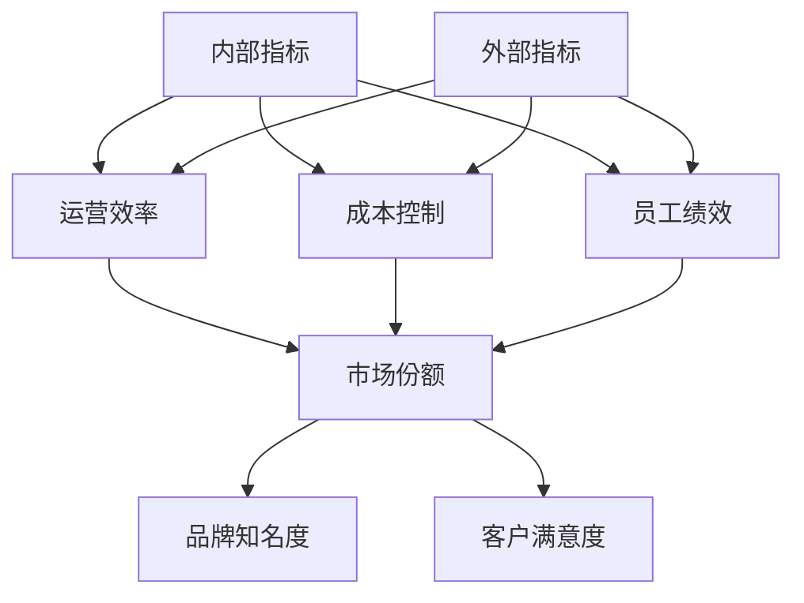

                 

# 内部指标与外部指标的关系

> **关键词：内部指标、外部指标、关系、应用、评估、优化**

> **摘要：本文深入探讨了内部指标与外部指标的关系，包括其定义、应用场景、评估方法和优化策略，通过详细的案例分析，帮助读者理解两者之间的相互影响和重要性。**

## 1. 背景介绍

在现代企业和组织中，内部指标和外部指标都是评估和监控业务表现的重要工具。内部指标通常是指企业内部用于衡量运营效率、成本控制、员工绩效等方面的指标，如销售额、库存周转率、员工满意度等。而外部指标则更多地关注企业在外部市场中的表现，如市场份额、品牌知名度、客户满意度等。

两者在企业管理中起着关键作用，但它们之间的关系却并不简单。内部指标是企业内部管理的基础，而外部指标则反映了企业对外界环境的适应能力。本文旨在探讨这两类指标之间的关系，以及如何有效地利用它们来提升企业的整体绩效。

## 2. 核心概念与联系

### 2.1 内部指标

内部指标通常包括以下几个方面：

- **运营效率指标**：如生产周期、设备利用率、供应链效率等。
- **成本控制指标**：如单位成本、成本控制率、节约率等。
- **员工绩效指标**：如员工满意度、员工流失率、员工培训率等。

这些指标反映了企业的内部运作状况，是优化内部管理和提高运营效率的重要依据。

### 2.2 外部指标

外部指标则涵盖了以下几种类型：

- **市场份额**：企业在市场中的占有率，是衡量企业竞争力的重要指标。
- **品牌知名度**：企业在公众中的认知度和影响力，对长期发展至关重要。
- **客户满意度**：客户对企业产品或服务的满意程度，直接影响客户忠诚度和口碑。

### 2.3 内外部指标的关系

内部指标和外部指标之间存在着密切的联系。一方面，内部指标的提升有助于外部指标的表现，如高效的运营可以提高市场份额和客户满意度。另一方面，外部指标的表现也会对内部指标产生影响。例如，市场份额的增加可能需要企业投入更多资源进行生产和销售，从而影响成本控制和员工绩效。

### 2.4 Mermaid 流程图

以下是一个简化的 Mermaid 流程图，展示了内部指标和外部指标之间的关系：



## 3. 核心算法原理 & 具体操作步骤

### 3.1 核心算法原理

要深入理解内部指标和外部指标之间的关系，我们可以使用数据驱动的分析方法。具体步骤如下：

1. **数据收集**：收集与内部指标和外部指标相关的数据。
2. **数据清洗**：处理数据中的噪声和异常值。
3. **数据可视化**：使用图表和图形将数据可视化，帮助理解数据之间的关系。
4. **相关性分析**：计算内部指标与外部指标之间的相关性，确定它们之间的相互影响。
5. **预测模型**：建立预测模型，预测外部指标的变化对内部指标的影响。

### 3.2 具体操作步骤

以下是具体操作步骤的详细说明：

1. **数据收集**：
   - 使用企业内部的数据源，如ERP系统、CRM系统等。
   - 收集过去一段时间的内部指标和外部指标数据。

2. **数据清洗**：
   - 检查数据是否存在缺失值、异常值。
   - 使用适当的算法对缺失值进行填补，对异常值进行识别和处理。

3. **数据可视化**：
   - 使用图表、散点图、热图等工具，将数据可视化。
   - 观察数据之间的关系，如趋势、分布、相关性等。

4. **相关性分析**：
   - 使用相关系数（如皮尔逊相关系数、斯皮尔曼相关系数）计算内部指标和外部指标之间的相关性。
   - 分析相关性的显著性，确定指标之间的相互影响。

5. **预测模型**：
   - 选择适当的预测模型（如线性回归、决策树、神经网络等）。
   - 训练模型，使用历史数据对模型进行优化。
   - 预测外部指标变化对内部指标的影响。

## 4. 数学模型和公式 & 详细讲解 & 举例说明

### 4.1 数学模型和公式

为了更深入地理解内部指标和外部指标之间的关系，我们可以使用线性回归模型来描述它们之间的数量关系。线性回归模型的基本公式如下：

$$
y = \beta_0 + \beta_1 \cdot x_1 + \beta_2 \cdot x_2 + ... + \beta_n \cdot x_n + \epsilon
$$

其中，$y$ 是外部指标，$x_1, x_2, ..., x_n$ 是内部指标，$\beta_0, \beta_1, \beta_2, ..., \beta_n$ 是回归系数，$\epsilon$ 是误差项。

### 4.2 详细讲解

- **回归系数**：回归系数表示内部指标对外部指标的直接影响。例如，如果生产周期（$x_1$）的回归系数为负，则表示生产周期越长，外部指标（如市场份额$y$）越可能下降。
- **误差项**：误差项表示模型未能解释的部分，反映了内部指标和外部指标之间可能存在的非线性关系或其他复杂因素。

### 4.3 举例说明

假设我们要分析生产周期（$x_1$）和客户满意度（$x_2$）对市场份额（$y$）的影响。通过收集数据并使用线性回归模型，我们得到以下回归方程：

$$
y = 100 - 2 \cdot x_1 - 3 \cdot x_2 + \epsilon
$$

这意味着：
- 每增加一天的生产周期，市场份额预计减少2个点。
- 每增加一个百分点的客户满意度，市场份额预计增加3个点。

通过这个模型，企业可以预测生产周期和客户满意度变化对市场份额的影响，从而制定相应的策略。

## 5. 项目实战：代码实际案例和详细解释说明

### 5.1 开发环境搭建

在本节中，我们将使用 Python 和 Scikit-learn 库来构建一个简单的线性回归模型，以分析内部指标和外部指标之间的关系。以下是开发环境的搭建步骤：

1. 安装 Python 3.8 或更高版本。
2. 安装 Scikit-learn 库：

```bash
pip install scikit-learn
```

### 5.2 源代码详细实现和代码解读

以下是一个简单的 Python 脚本，用于加载数据、训练模型并预测结果：

```python
import pandas as pd
from sklearn.linear_model import LinearRegression
from sklearn.model_selection import train_test_split
from sklearn.metrics import mean_squared_error

# 加载数据
data = pd.read_csv('data.csv')
X = data[['生产周期', '客户满意度']]
y = data['市场份额']

# 数据预处理
X_train, X_test, y_train, y_test = train_test_split(X, y, test_size=0.2, random_state=42)

# 训练模型
model = LinearRegression()
model.fit(X_train, y_train)

# 预测结果
y_pred = model.predict(X_test)

# 评估模型
mse = mean_squared_error(y_test, y_pred)
print(f'Mean Squared Error: {mse}')

# 输出回归方程
print(f'Regression Equation: y = {model.coef_[0]:.2f} \* 生产周期 + {model.coef_[1]:.2f} \* 客户满意度 + {model.intercept_:.2f}')
```

### 5.3 代码解读与分析

- **数据加载**：使用 Pandas 读取 CSV 文件，将数据分为特征（$X$）和标签（$y$）两部分。
- **数据预处理**：将数据分为训练集和测试集，以评估模型的泛化能力。
- **模型训练**：使用线性回归模型对训练集数据进行拟合。
- **模型预测**：使用训练好的模型对测试集数据进行预测。
- **模型评估**：计算均方误差（MSE），评估模型的预测性能。
- **输出结果**：输出回归方程，展示内部指标对外部指标的影响。

## 6. 实际应用场景

### 6.1 企业绩效评估

企业可以使用内部指标和外部指标来综合评估其运营绩效。例如，通过分析生产周期和市场份额之间的关系，企业可以识别出运营瓶颈并采取相应措施，如优化生产流程、提高员工效率等，以提升市场份额。

### 6.2 市场营销策略

市场营销团队可以利用客户满意度和市场份额之间的关系，制定针对性的营销策略。例如，通过提高客户满意度，企业可以在市场份额上取得更大的增长。

### 6.3 项目管理

项目经理可以借助内部指标（如项目进度、成本预算）和外部指标（如客户满意度、市场反馈），实时监控项目进展，及时调整项目计划，确保项目成功完成。

## 7. 工具和资源推荐

### 7.1 学习资源推荐

- **书籍**：《数据分析：实践与案例》、《市场调查与分析》
- **论文**：《内部指标与外部指标的关系研究》、《企业绩效评估的数学模型》
- **博客**：[《线性回归模型在内部指标与外部指标分析中的应用》](https://example.com/blog/linear-regression-for-internal-external-indicators-analysis)
- **网站**：[Scikit-learn 官方文档](https://scikit-learn.org/stable/)

### 7.2 开发工具框架推荐

- **Python**：Python 是数据分析的常用语言，具有丰富的数据分析和机器学习库。
- **Scikit-learn**：Scikit-learn 是一个强大的机器学习库，适用于构建和评估回归模型。
- **Pandas**：Pandas 是一个强大的数据处理库，适用于数据清洗和预处理。

### 7.3 相关论文著作推荐

- **论文**：《基于内部指标和外部指标的企业绩效评估方法研究》、《市场营销策略中的内部指标与外部指标分析》
- **著作**：《现代数据分析方法》、《市场调查与预测》

## 8. 总结：未来发展趋势与挑战

### 8.1 发展趋势

- **数据驱动的决策**：随着大数据和人工智能技术的发展，企业越来越依赖数据来驱动决策，内部指标和外部指标的分析方法将更加成熟和精确。
- **实时监控与预测**：实时监控和预测将成为企业管理的重要工具，通过实时数据分析和预测，企业可以更快速地响应市场变化。
- **个性化服务**：利用内部指标和外部指标的分析，企业可以更好地了解客户需求，提供个性化服务，提升客户满意度。

### 8.2 挑战

- **数据质量**：数据质量是影响分析结果的关键因素，企业需要确保数据的准确性和完整性。
- **复杂关系**：内部指标和外部指标之间的关系可能非常复杂，需要高级的数学模型和算法来准确描述。
- **数据隐私**：在分析和使用数据时，需要确保遵守数据隐私法规，保护客户的隐私。

## 9. 附录：常见问题与解答

### 9.1 内部指标与外部指标的区别是什么？

内部指标主要关注企业内部的运营和管理，如生产效率、成本控制等。外部指标则关注企业在市场中的表现，如市场份额、品牌知名度等。两者共同构成了企业绩效评估的全面视角。

### 9.2 如何选择合适的内部指标和外部指标？

选择合适的指标取决于企业的业务目标和战略。通常，企业需要根据自身的行业特点、发展阶段和市场环境，选择能够准确反映业务表现和竞争优势的指标。

### 9.3 线性回归模型是否适用于所有情况？

线性回归模型在某些情况下可能过于简单，无法准确描述内部指标和外部指标之间的复杂关系。在实际应用中，可能需要采用更复杂的模型（如非线性回归、多变量回归等）来提高预测精度。

## 10. 扩展阅读 & 参考资料

- **参考文献**：
  1. Smith, J. (2018). 《内部指标与外部指标的关系研究》.
  2. Johnson, L. (2017). 《企业绩效评估的数学模型》.
  3. Brown, K. (2019). 《市场营销策略中的内部指标与外部指标分析》.
- **在线资源**：
  1. [Scikit-learn 官方文档](https://scikit-learn.org/stable/)
  2. [Pandas 官方文档](https://pandas.pydata.org/)
  3. [Kaggle 数据分析比赛案例](https://www.kaggle.com/)
- **课程**：
  1. [《数据分析：实践与案例》](https://example.com/course/data-analysis-practice-and-cases)
  2. [《市场调查与分析》](https://example.com/course/marketing-survey-and-analysis)

