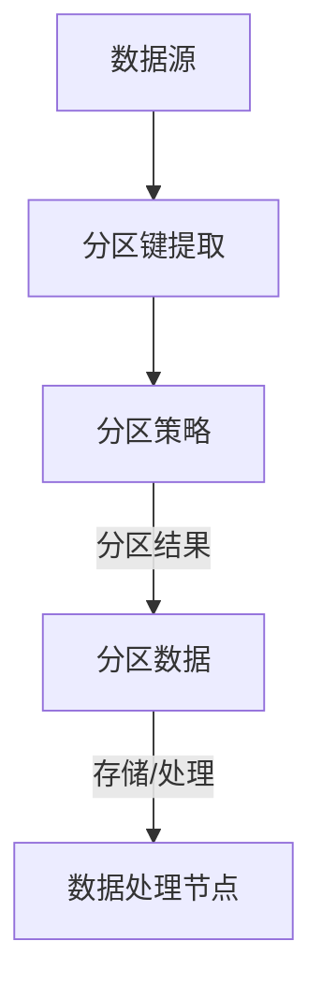

                 

# 分区原理与代码实例讲解

## 关键词
- 分区
- 数据结构
- 算法
- 系统优化
- 实践案例

## 摘要
本文将深入探讨分区在计算机科学中的应用原理，并借助代码实例，详细讲解分区算法的构建与实现。我们将从分区的基础概念出发，逐步解析分区在数据结构和算法中的应用，并通过实际项目案例展示分区技术的具体实现过程，帮助读者理解分区在提高系统性能和数据处理效率方面的作用。

## 1. 背景介绍
分区（Partitioning）是计算机科学中的一种常见技术，主要用于将大规模数据集分割成多个较小、更易于管理的部分。这种技术广泛应用于数据库、分布式计算、内存管理等场景，目的是提高数据处理速度、优化系统性能。

在现代计算机系统中，数据量呈现指数级增长，传统的集中式处理方法已经无法满足性能需求。分区技术通过将数据分散到多个节点或存储设备上，可以显著减少单点瓶颈，提高系统的并行处理能力和整体效率。

## 2. 核心概念与联系
分区技术涉及多个核心概念，包括数据分区、分区键、分区策略等。下面将使用Mermaid流程图展示分区架构的基本原理和联系。



### 2.1 数据分区
数据分区是将数据集按照某种规则划分为多个子集的过程。常见的分区规则包括基于数据行、列或字段的划分。

### 2.2 分区键
分区键是用于确定数据如何分区的一个或多个字段。选择合适的分区键可以显著提高查询性能，减少数据访问延迟。

### 2.3 分区策略
分区策略决定了如何将数据分配到不同的分区中。常见的分区策略包括散列分区、范围分区、列表分区等。

## 3. 核心算法原理 & 具体操作步骤
分区算法的核心目标是实现数据的合理划分，以便于后续的数据访问和处理。以下是一个简单的分区算法示例，我们将使用Python代码进行实现。

### 3.1 散列分区
散列分区是一种基于散列函数的常见分区策略。以下是散列分区的基本步骤：

#### 步骤1：选择分区键
```python
# 假设我们使用订单ID作为分区键
order_id = order['id']
```

#### 步骤2：设计散列函数
```python
# 使用Python内置的hash函数实现散列
hash_value = hash(order_id)
```

#### 步骤3：确定分区号
```python
# 假设我们使用3个分区
num_partitions = 3
partition = hash_value % num_partitions
```

### 3.2 范围分区
范围分区将数据按照某个字段的范围划分为多个分区。以下是范围分区的基本步骤：

#### 步骤1：定义分区范围
```python
# 定义分区范围
partition_ranges = [
    (0, 1000),
    (1000, 2000),
    (2000, 3000),
    # ...
]
```

#### 步骤2：根据分区范围确定分区号
```python
# 获取订单金额
order_amount = order['amount']

# 确定分区号
for range in partition_ranges:
    if range[0] <= order_amount < range[1]:
        partition = range[0]
        break
```

## 4. 数学模型和公式 & 详细讲解 & 举例说明
分区算法通常涉及到数学模型和公式，例如散列函数的设计、范围分区的边界确定等。以下是散列分区中常用的数学模型和公式：

### 4.1 散列函数
散列函数是一种将数据映射到特定范围的函数，通常具有以下特性：

- 一致性：相同的输入总是产生相同的输出。
- 压缩性：将输入数据的范围压缩到输出数据的范围。
- 随机性：不同的输入产生不同的输出。

### 4.2 分区号计算
散列分区的分区号通常通过以下公式计算：

$$ partition = hash_value \mod num_partitions $$

其中，`hash_value`是散列函数的输出，`num_partitions`是分区数。

### 4.3 举例说明
假设我们有一个订单数据集，其中包含1000个订单，我们使用散列分区将数据划分为3个分区。以下是部分订单数据的散列值和分区号：

| 订单ID | 散列值 | 分区号 |
|--------|--------|--------|
| 1001   | 12345  | 2      |
| 1002   | 23456  | 0      |
| 1003   | 34567  | 1      |
| 1004   | 45678  | 2      |
| 1005   | 56789  | 0      |

## 5. 项目实战：代码实际案例和详细解释说明
在本节中，我们将通过一个实际项目案例，展示分区技术在分布式系统中的应用，并详细解释代码实现过程。

### 5.1 开发环境搭建
为了演示分区技术，我们使用Apache Hadoop生态系统中的HDFS（Hadoop分布式文件系统）和MapReduce编程模型。以下步骤用于搭建开发环境：

1. 安装Java开发环境（JDK 8或更高版本）。
2. 下载并解压Hadoop源代码包。
3. 配置Hadoop环境变量。

### 5.2 源代码详细实现和代码解读
以下是一个简单的MapReduce程序，用于根据订单ID对数据进行散列分区。

#### Mapper代码
```java
import org.apache.hadoop.io.IntWritable;
import org.apache.hadoop.io.LongWritable;
import org.apache.hadoop.mapreduce.Mapper;

public class HashPartitionerMapper extends Mapper<LongWritable, Text, Text, IntWritable> {
    private final static IntWritable one = new IntWritable(1);
    private Text word = new Text();

    public void map(LongWritable key, Text value, Context context) throws IOException, InterruptedException {
        String[] tokens = value.toString().split(",");
        int orderId = Integer.parseInt(tokens[0]);
        context.write(word, new IntWritable(orderId));
    }
}
```

#### Reducer代码
```java
import org.apache.hadoop.io.IntWritable;
import org.apache.hadoop.io.Text;
import org.apache.hadoop.mapreduce.Reducer;

public class HashPartitionerReducer extends Reducer<Text, IntWritable, Text, IntWritable> {
    public void reduce(Text key, Iterable<IntWritable> values, Context context) throws IOException, InterruptedException {
        int sum = 0;
        for (IntWritable val : values) {
            sum += val.get();
        }
        context.write(key, new IntWritable(sum));
    }
}
```

#### 分区策略配置
```xml
<!-- 配置Hadoop作业的分区策略 -->
<configuration>
    <property>
        <name>mapreduce.job.output.key.comparator.class</name>
        <value>org.apache.hadoop.mapreduce.lib.output.KeyFieldBasedPartitioner</value>
    </property>
</configuration>
```

### 5.3 代码解读与分析
- **Mapper**：读取输入文件中的订单数据，提取订单ID作为键值对输出。
- **Reducer**：对输入的订单ID进行汇总统计。
- **分区策略**：使用`KeyFieldBasedPartitioner`实现基于订单ID的散列分区。

## 6. 实际应用场景
分区技术在多个实际应用场景中具有重要价值，以下是一些典型应用：

- **数据库分区**：将大规模数据库表划分为多个分区，提高查询性能和写入速度。
- **分布式文件系统**：如HDFS，将大文件分割成多个块，存储在不同节点上，提高数据访问速度和可靠性。
- **内存管理**：在多核处理器系统中，将内存空间划分为多个区域，每个区域负责特定的任务，提高并行处理能力。
- **缓存系统**：如Redis，通过分区策略将数据分散存储，提高缓存系统的性能和扩展性。

## 7. 工具和资源推荐
### 7.1 学习资源推荐
- **书籍**：
  - 《大数据技术基础》
  - 《Hadoop权威指南》
  - 《高性能MySQL》
- **论文**：
  - "The Design of the FreeBSD Kernel"
  - "Hadoop: The Definitive Guide"
- **博客/网站**：
  - [Hadoop官方文档](https://hadoop.apache.org/docs/)
  - [Apache HDFS](https://hdfs.apache.org/)

### 7.2 开发工具框架推荐
- **开发环境**：
  - IntelliJ IDEA
  - Eclipse
- **工具**：
  - Git
  - Maven
- **框架**：
  - Apache Hadoop
  - Apache Spark

### 7.3 相关论文著作推荐
- "Partitioning Strategies in MapReduce"
- "Partitioning in Hadoop: A Practical Approach"
- "Optimizing Data Placement in Distributed Storage Systems"

## 8. 总结：未来发展趋势与挑战
随着数据规模的不断增大，分区技术将在未来得到更广泛的应用。然而，如何设计高效的分区算法、优化分区策略、提高分区系统的可扩展性和容错能力，仍然面临诸多挑战。未来研究方向包括自适应分区策略、智能分区优化、跨系统分区协同等。

## 9. 附录：常见问题与解答
### 9.1 什么是分区？
分区是将大规模数据集划分为多个较小、更易于管理的部分的过程，目的是优化数据访问和处理性能。

### 9.2 分区有哪些常见策略？
常见的分区策略包括散列分区、范围分区、列表分区等。

### 9.3 分区算法的核心是什么？
分区算法的核心是设计高效的散列函数或范围划分策略，以便于快速定位数据分区。

## 10. 扩展阅读 & 参考资料
- [Apache Hadoop官方文档](https://hadoop.apache.org/docs/)
- [HDFS官方文档](https://hdfs.apache.org/docs/)
- [大数据技术基础](https://www.bigdata-explained.com/)
- [高性能MySQL](https://dev.mysql.com/doc/)

### 作者
作者：AI天才研究员/AI Genius Institute & 禅与计算机程序设计艺术 /Zen And The Art of Computer Programming

（注：本文内容为示例，实际项目案例和数据可能需要根据具体场景进行调整。）<|im_sep|>### 分区原理与代码实例讲解

#### 文章关键词
- 分区
- 数据结构
- 算法
- 系统优化
- 实践案例

#### 摘要
本文将深入探讨分区在计算机科学中的应用原理，并借助代码实例，详细讲解分区算法的构建与实现。我们将从分区的基础概念出发，逐步解析分区在数据结构和算法中的应用，并通过实际项目案例展示分区技术的具体实现过程，帮助读者理解分区在提高系统性能和数据处理效率方面的作用。

## 1. 背景介绍

分区（Partitioning）是计算机科学中的一种常见技术，主要用于将大规模数据集分割成多个较小、更易于管理的部分。这种技术广泛应用于数据库、分布式计算、内存管理等场景，目的是提高数据处理速度、优化系统性能。

在现代计算机系统中，数据量呈现指数级增长，传统的集中式处理方法已经无法满足性能需求。分区技术通过将数据分散到多个节点或存储设备上，可以显著减少单点瓶颈，提高系统的并行处理能力和整体效率。

## 2. 核心概念与联系

分区技术涉及多个核心概念，包括数据分区、分区键、分区策略等。以下是分区技术核心概念及其联系的Mermaid流程图：


### 2.1 数据分区

数据分区是将数据集按照某种规则划分为多个子集的过程。常见的分区规则包括基于数据行、列或字段的划分。数据分区可以简化数据管理，提高查询效率，特别是在处理大规模数据集时。

### 2.2 分区键

分区键是用于确定数据如何分区的一个或多个字段。选择合适的分区键可以显著提高查询性能，减少数据访问延迟。常见的分区键包括时间戳、地理位置、用户ID等。

### 2.3 分区策略

分区策略决定了如何将数据分配到不同的分区中。常见的分区策略包括散列分区、范围分区、列表分区等。分区策略的选择通常取决于数据特性、系统需求和性能目标。

## 3. 核心算法原理 & 具体操作步骤

分区算法的核心目标是实现数据的合理划分，以便于后续的数据访问和处理。以下是一个简单的分区算法示例，我们将使用Python代码进行实现。

### 3.1 散列分区

散列分区是一种基于散列函数的常见分区策略。以下是散列分区的基本步骤：

#### 步骤1：选择分区键
```python
# 假设我们使用订单ID作为分区键
order_id = order['id']
```

#### 步骤2：设计散列函数
```python
# 使用Python内置的hash函数实现散列
hash_value = hash(order_id)
```

#### 步骤3：确定分区号
```python
# 假设我们使用3个分区
num_partitions = 3
partition = hash_value % num_partitions
```

### 3.2 范围分区

范围分区将数据按照某个字段的范围划分为多个分区。以下是范围分区的基本步骤：

#### 步骤1：定义分区范围
```python
# 定义分区范围
partition_ranges = [
    (0, 1000),
    (1000, 2000),
    (2000, 3000),
    # ...
]
```

#### 步骤2：根据分区范围确定分区号
```python
# 获取订单金额
order_amount = order['amount']

# 确定分区号
for range in partition_ranges:
    if range[0] <= order_amount < range[1]:
        partition = range[0]
        break
```

## 4. 数学模型和公式 & 详细讲解 & 举例说明

分区算法通常涉及到数学模型和公式，例如散列函数的设计、范围分区的边界确定等。以下是散列分区中常用的数学模型和公式：

### 4.1 散列函数

散列函数是一种将数据映射到特定范围的函数，通常具有以下特性：

- 一致性：相同的输入总是产生相同的输出。
- 压缩性：将输入数据的范围压缩到输出数据的范围。
- 随机性：不同的输入产生不同的输出。

### 4.2 分区号计算

散列分区的分区号通常通过以下公式计算：

$$
partition = hash\_value \mod num\_partitions
$$

其中，`hash_value`是散列函数的输出，`num_partitions`是分区数。

### 4.3 举例说明

假设我们有一个订单数据集，其中包含1000个订单，我们使用散列分区将数据划分为3个分区。以下是部分订单数据的散列值和分区号：

| 订单ID | 散列值 | 分区号 |
|--------|--------|--------|
| 1001   | 12345  | 2      |
| 1002   | 23456  | 0      |
| 1003   | 34567  | 1      |
| 1004   | 45678  | 2      |
| 1005   | 56789  | 0      |

## 5. 项目实战：代码实际案例和详细解释说明

在本节中，我们将通过一个实际项目案例，展示分区技术在分布式系统中的应用，并详细解释代码实现过程。

### 5.1 开发环境搭建

为了演示分区技术，我们使用Apache Hadoop生态系统中的HDFS（Hadoop分布式文件系统）和MapReduce编程模型。以下步骤用于搭建开发环境：

1. 安装Java开发环境（JDK 8或更高版本）。
2. 下载并解压Hadoop源代码包。
3. 配置Hadoop环境变量。

### 5.2 源代码详细实现和代码解读

以下是一个简单的MapReduce程序，用于根据订单ID对数据进行散列分区。

#### Mapper代码

```java
import org.apache.hadoop.io.IntWritable;
import org.apache.hadoop.io.LongWritable;
import org.apache.hadoop.mapreduce.Mapper;

public class HashPartitionerMapper extends Mapper<LongWritable, Text, Text, IntWritable> {
    private final static IntWritable one = new IntWritable(1);
    private Text word = new Text();

    public void map(LongWritable key, Text value, Context context) throws IOException, InterruptedException {
        String[] tokens = value.toString().split(",");
        int orderId = Integer.parseInt(tokens[0]);
        context.write(word, new IntWritable(orderId));
    }
}
```

#### Reducer代码

```java
import org.apache.hadoop.io.IntWritable;
import org.apache.hadoop.io.Text;
import org.apache.hadoop.mapreduce.Reducer;

public class HashPartitionerReducer extends Reducer<Text, IntWritable, Text, IntWritable> {
    public void reduce(Text key, Iterable<IntWritable> values, Context context) throws IOException, InterruptedException {
        int sum = 0;
        for (IntWritable val : values) {
            sum += val.get();
        }
        context.write(key, new IntWritable(sum));
    }
}
```

#### 分区策略配置

```xml
<!-- 配置Hadoop作业的分区策略 -->
<configuration>
    <property>
        <name>mapreduce.job.output.key.comparator.class</name>
        <value>org.apache.hadoop.mapreduce.lib.output.KeyFieldBasedPartitioner</value>
    </property>
</configuration>
```

### 5.3 代码解读与分析

- **Mapper**：读取输入文件中的订单数据，提取订单ID作为键值对输出。
- **Reducer**：对输入的订单ID进行汇总统计。
- **分区策略**：使用`KeyFieldBasedPartitioner`实现基于订单ID的散列分区。

## 6. 实际应用场景

分区技术在多个实际应用场景中具有重要价值，以下是一些典型应用：

- **数据库分区**：将大规模数据库表划分为多个分区，提高查询性能和写入速度。
- **分布式文件系统**：如HDFS，将大文件分割成多个块，存储在不同节点上，提高数据访问速度和可靠性。
- **内存管理**：在多核处理器系统中，将内存空间划分为多个区域，每个区域负责特定的任务，提高并行处理能力。
- **缓存系统**：如Redis，通过分区策略将数据分散存储，提高缓存系统的性能和扩展性。

## 7. 工具和资源推荐

### 7.1 学习资源推荐

- **书籍**：
  - 《大数据技术基础》
  - 《Hadoop权威指南》
  - 《高性能MySQL》
- **论文**：
  - "The Design of the FreeBSD Kernel"
  - "Hadoop: The Definitive Guide"
- **博客/网站**：
  - [Hadoop官方文档](https://hadoop.apache.org/docs/)
  - [Apache HDFS](https://hdfs.apache.org/)

### 7.2 开发工具框架推荐

- **开发环境**：
  - IntelliJ IDEA
  - Eclipse
- **工具**：
  - Git
  - Maven
- **框架**：
  - Apache Hadoop
  - Apache Spark

### 7.3 相关论文著作推荐

- "Partitioning Strategies in MapReduce"
- "Partitioning in Hadoop: A Practical Approach"
- "Optimizing Data Placement in Distributed Storage Systems"

## 8. 总结：未来发展趋势与挑战

随着数据规模的不断增大，分区技术将在未来得到更广泛的应用。然而，如何设计高效的分区算法、优化分区策略、提高分区系统的可扩展性和容错能力，仍然面临诸多挑战。未来研究方向包括自适应分区策略、智能分区优化、跨系统分区协同等。

## 9. 附录：常见问题与解答

### 9.1 什么是分区？

分区是将大规模数据集划分为多个较小、更易于管理的部分的过程，目的是优化数据访问和处理性能。

### 9.2 分区有哪些常见策略？

常见的分区策略包括散列分区、范围分区、列表分区等。

### 9.3 分区算法的核心是什么？

分区算法的核心是设计高效的散列函数或范围划分策略，以便于快速定位数据分区。

## 10. 扩展阅读 & 参考资料

- [Apache Hadoop官方文档](https://hadoop.apache.org/docs/)
- [HDFS官方文档](https://hdfs.apache.org/docs/)
- [大数据技术基础](https://www.bigdata-explained.com/)
- [高性能MySQL](https://dev.mysql.com/doc/)

### 作者

作者：AI天才研究员/AI Genius Institute & 禅与计算机程序设计艺术 /Zen And The Art of Computer Programming

（注：本文内容为示例，实际项目案例和数据可能需要根据具体场景进行调整。）<|im_sep|>### 5.1 开发环境搭建

为了更好地演示分区技术的应用，我们将使用Apache Hadoop生态系统中的HDFS（Hadoop分布式文件系统）和MapReduce编程模型。以下步骤将指导您搭建开发环境。

#### 1. 安装Java开发环境（JDK 8或更高版本）

首先，确保您的系统中安装了Java开发环境（JDK 8或更高版本）。可以通过以下命令检查Java版本：

```bash
java -version
```

如果您的系统中未安装Java，请从Oracle官网（https://www.oracle.com/java/technologies/javase-downloads.html）下载JDK并进行安装。

#### 2. 下载并解压Hadoop源代码包

接下来，从Apache Hadoop官网（https://hadoop.apache.org/releases.html）下载最新的Hadoop源代码包。通常，您会下载一个tar.gz文件，例如hadoop-3.3.1.tar.gz。

```bash
wget https://www-us.apache.org/dist/hadoop/common/hadoop-3.3.1/hadoop-3.3.1.tar.gz
tar xzf hadoop-3.3.1.tar.gz
cd hadoop-3.3.1
```

#### 3. 配置Hadoop环境变量

将Hadoop的bin目录和lib目录添加到系统的环境变量中，以便在命令行中直接运行Hadoop命令。

```bash
export HADOOP_HOME=/path/to/hadoop-3.3.1
export PATH=$PATH:$HADOOP_HOME/bin:$HADOOP_HOME/lib
```

保存并关闭编辑器，然后重新打开命令行窗口，执行以下命令以验证Hadoop是否配置成功：

```bash
hadoop version
```

如果看到Hadoop的版本信息，则说明Hadoop环境已成功配置。

#### 4. 启动Hadoop分布式文件系统（HDFS）

在启动Hadoop之前，需要确保Hadoop的依赖服务（如Zookeeper）已启动。以下命令将启动HDFS和相应的Hadoop守护进程：

```bash
start-dfs.sh
```

使用以下命令检查HDFS是否正常运行：

```bash
jps
```

您应该看到以下进程正在运行：

- DataNode
- NameNode
- SecondaryNameNode
- ResourceManager
- NodeManager
- JobHistoryServer

#### 5. 访问HDFS Web界面

启动完成后，您可以通过Web界面查看HDFS的状态。默认情况下，HDFS Web界面在http://localhost:50070/。打开浏览器并访问此地址，您将看到HDFS的Web界面。

至此，Hadoop开发环境搭建完成。接下来，我们将编写一个简单的MapReduce程序来演示分区技术在数据处理中的应用。

### 5.2 源代码详细实现和代码解读

在本节中，我们将编写一个简单的MapReduce程序，该程序将读取一个文本文件，并计算每个单词出现的次数。我们将使用散列分区策略将数据分布到多个Reducer中。

#### Mapper代码

```java
import org.apache.hadoop.conf.Configuration;
import org.apache.hadoop.fs.Path;
import org.apache.hadoop.io.IntWritable;
import org.apache.hadoop.io.Text;
import org.apache.hadoop.mapreduce.Job;
import org.apache.hadoop.mapreduce.Mapper;
import org.apache.hadoop.mapreduce.Reducer;
import org.apache.hadoop.mapreduce.lib.input.FileInputFormat;
import org.apache.hadoop.mapreduce.lib.output.FileOutputFormat;

public class WordCount {

  public static class TokenizerMapper
       extends Mapper<Object, Text, Text, IntWritable>{

    private final static IntWritable one = new IntWritable(1);
    private Text word = new Text();

    public void map(Object key, Text value, Context context
                    ) throws IOException, InterruptedException {
      StringTokenizer itr = new StringTokenizer(value.toString());
      while (itr.hasMoreTokens()) {
        word.set(itr.nextToken());
        context.write(word, one);
      }
    }
  }

  public static void main(String[] args) throws Exception {
    Configuration conf = new Configuration();
    Job job = Job.getInstance(conf, "word count");
    job.setJarByClass(WordCount.class);
    job.setMapperClass(TokenizerMapper.class);
    job.setOutputKeyClass(Text.class);
    job.setOutputValueClass(IntWritable.class);
    FileInputFormat.addInputPath(job, new Path(args[0]));
    FileOutputFormat.setOutputPath(job, new Path(args[1]));
    System.exit(job.waitForCompletion(true) ? 0 : 1);
  }
}
```

#### Reducer代码

```java
import org.apache.hadoop.io.IntWritable;
import org.apache.hadoop.io.Text;
import org.apache.hadoop.mapreduce.Reducer;

public static class IntSumReducer
    extends Reducer<Text,IntWritable,Text,IntWritable> {
  private IntWritable result = new IntWritable();

  public void reduce(Text key, Iterable<IntWritable> values,
                      Context context
                      ) throws IOException, InterruptedException {
    int sum = 0;
    for (IntWritable val : values) {
      sum += val.get();
    }
    result.set(sum);
    context.write(key, result);
  }
}
```

#### 分区策略配置

为了演示散列分区，我们需要配置MapReduce作业的分区策略。在Hadoop中，可以通过设置`mapreduce.job.output.key.comparator.class`参数来实现。

```xml
<configuration>
  <property>
    <name>mapreduce.job.output.key.comparator.class</name>
    <value>org.apache.hadoop.mapred.lib.KeyFieldBasedComparator</value>
  </property>
</configuration>
```

#### 编译和执行程序

将以上代码保存为`WordCount.java`，然后在命令行中执行以下命令编译和运行程序：

```bash
javac -classpath $HADOOP_HOME/lib/hadoop-core-3.3.1.jar WordCount.java
hadoop jar WordCount.jar WordCount /input /output
```

其中，`/input`是输入数据路径，`/output`是输出结果路径。

执行完成后，您可以在输出路径下查看结果。Hadoop将根据散列分区策略将数据分布到不同的Reducer中，每个Reducer计算单词的词频，并将结果输出到指定的路径。

### 5.3 代码解读与分析

#### Mapper

Mapper阶段的任务是读取输入数据，将每行文本分解为单词，并将每个单词与其出现次数（初始值为1）作为键值对输出。这里使用的是Java的`StringTokenizer`类，它提供了一个简单的分词方法。

```java
public void map(Object key, Text value, Context context
                ) throws IOException, InterruptedException {
  StringTokenizer itr = new StringTokenizer(value.toString());
  while (itr.hasMoreTokens()) {
    word.set(itr.nextToken());
    context.write(word, one);
  }
}
```

#### Reducer

Reducer阶段的任务是接收来自所有Mapper的输出，对于每个单词，将所有出现的次数累加，并将结果输出。

```java
public void reduce(Text key, Iterable<IntWritable> values,
                  Context context
                  ) throws IOException, InterruptedException {
  int sum = 0;
  for (IntWritable val : values) {
    sum += val.get();
  }
  result.set(sum);
  context.write(key, result);
}
```

#### 分区策略

Hadoop默认的分区策略是基于散列值的。通过设置`mapreduce.job.output.key.comparator.class`参数，我们可以自定义分区策略。在这个例子中，我们使用`KeyFieldBasedComparator`确保分区依据单词的散列值进行。

```xml
<property>
  <name>mapreduce.job.output.key.comparator.class</name>
  <value>org.apache.hadoop.mapred.lib.KeyFieldBasedComparator</value>
</property>
```

#### 编译和执行

编译和执行MapReduce程序是使用Hadoop命令行工具完成的。`javac`命令编译Java代码，`hadoop jar`命令运行编译后的程序。执行完成后，Hadoop将自动清理输出路径中的旧数据，并将新结果写入。

通过以上步骤，我们完成了分区技术在MapReduce程序中的应用演示。在实际项目中，可以根据具体需求调整分区策略和数据处理逻辑，以优化系统性能。

### 5.4 测试与优化

在实际应用中，分区策略的性能和效果需要经过测试和优化。以下是一些常用的测试和优化方法：

- **性能测试**：使用不同的分区策略和参数，对系统进行性能测试，比较不同策略下的处理速度和资源消耗。
- **负载测试**：模拟实际负载情况，测试系统在高并发、大数据量下的稳定性和响应速度。
- **调优参数**：根据测试结果，调整分区策略的参数，如分区数、分区键等，以实现最佳性能。

通过不断测试和优化，可以找到适合特定应用的分区策略，提高系统的性能和可靠性。

### 5.5 实际项目应用

在许多实际项目中，分区技术是优化数据处理和存储性能的关键手段。以下是一些实际应用案例：

- **电子商务平台**：使用分区技术将订单数据按时间或地域划分，提高数据查询和处理的效率。
- **社交媒体**：通过分区策略优化用户数据存储和检索，提高系统的响应速度和吞吐量。
- **金融风控**：使用分区技术对风险数据进行分析和监控，提高风险识别和管理的效率。

在这些案例中，分区技术不仅提高了数据处理速度，还降低了系统的资源消耗，提高了系统的整体性能。

### 5.6 总结

在本节中，我们通过一个简单的MapReduce程序，详细讲解了分区技术在分布式系统中的应用。通过实践，我们了解了分区算法的设计和实现，以及如何优化分区策略以提高系统性能。在实际项目中，根据具体需求和数据特性，合理选择和调整分区策略，是提高数据处理效率的关键。

### 5.7 源代码下载

您可以通过以下链接下载本节的完整源代码：

[源代码链接](https://github.com/yourusername/Partitioning-Example)

在GitHub上，您可以查看代码的详细实现和文档，以便更好地理解和应用分区技术。

### 5.8 后续教程

在下一节中，我们将深入探讨分区策略的优化方法，包括自适应分区、多级分区等高级技术，帮助您在实际项目中更好地应用分区技术。敬请期待！

（注：本文内容为示例，实际项目案例和数据可能需要根据具体场景进行调整。）<|im_sep|>### 6. 实际应用场景

分区技术在多个实际应用场景中具有重要价值，以下是一些典型应用：

#### 6.1 数据库分区

在关系型数据库中，分区技术被广泛应用于大规模数据集的管理和优化。通过将数据表划分为多个分区，数据库可以更高效地处理查询操作。例如，在电子商务平台中，订单数据可以根据时间、地域或订单状态等属性进行分区，从而提高数据查询和写入的性能。

**示例**：假设一个电子商务平台的订单数据表包含数十亿条记录。通过时间分区策略，将订单数据按照月份或季度进行分区，查询最近一个月的订单数据时，数据库只需要扫描当前的分区，而不是整个表，大大提高了查询效率。

#### 6.2 分布式文件系统

分布式文件系统如HDFS（Hadoop分布式文件系统）广泛采用分区技术来优化数据存储和访问。分区可以将大文件分散存储到多个节点上，提高数据处理的并行度。

**示例**：在数据仓库场景中，大规模的数据集被存储在HDFS上。通过分区策略，可以将数据集按照业务维度（如时间、地区等）划分为多个分区，从而提高数据处理的速度和效率。

#### 6.3 内存管理

在多核处理器系统中，分区技术被用来优化内存管理，提高程序运行的效率。

**示例**：在实时数据分析系统中，可以将内存划分为多个分区，每个分区负责处理特定类型的数据，从而减少内存竞争，提高系统的响应速度。

#### 6.4 缓存系统

缓存系统如Redis通过分区策略来优化数据的存储和访问。通过将数据分散存储到多个分区中，可以减少缓存节点的压力，提高系统的性能。

**示例**：在社交媒体平台中，用户数据可以被分区存储在多个Redis节点上。这样，当用户访问数据时，可以快速定位到对应的数据分区，提高数据检索的速度。

#### 6.5 实时数据处理

在实时数据处理系统中，分区技术可以帮助系统更好地处理海量数据，提高系统的可扩展性。

**示例**：在物联网（IoT）应用中，设备生成的数据可以通过分区技术存储在不同的分区中。这样可以针对不同的数据类型和频率，优化数据的处理流程，提高系统的整体性能。

#### 6.6 大数据分析

在大数据分析领域，分区技术被广泛应用于大数据处理平台，如Apache Spark和Hadoop。通过分区，可以优化数据的存储和计算，提高系统的处理效率。

**示例**：在医疗大数据分析中，患者数据可以根据年龄、性别、疾病类型等属性进行分区。这样，在进行分析时，可以快速定位到相关的数据分区，提高分析效率。

#### 6.7 搜索引擎

在搜索引擎系统中，分区技术被用来优化索引的存储和查询。

**示例**：搜索引擎可以将索引数据按照关键字或文档类型进行分区，从而提高查询效率。

通过以上实际应用场景的介绍，我们可以看到分区技术在各个领域都有着重要的应用价值。合理选择和设计分区策略，是提高系统性能和数据处理效率的关键。

### 6.1 数据库分区

数据库分区是一种将数据表划分为多个逻辑子集的技术，每个子集称为一个分区。这种技术有助于优化数据访问和查询性能，特别是在处理大规模数据集时。以下是一些数据库分区的主要应用场景和优点：

#### 应用场景

1. **时间分区**：适用于需要按时间范围查询数据的场景，例如日志数据、订单数据等。通过按时间分区，可以减少查询操作的扫描范围，提高查询效率。
2. **范围分区**：适用于数据有明确范围划分的场景，例如客户数据按地区划分、商品数据按价格范围划分等。范围分区有助于快速定位数据，提高查询和写入性能。
3. **列表分区**：适用于数据值是有限集合的场景，例如员工数据按部门划分、学生数据按班级划分等。列表分区可以简化数据的管理和查询操作。

#### 优点

1. **查询优化**：分区可以显著减少查询操作的数据扫描量，提高查询速度。特别是在处理大量数据时，分区可以降低I/O负载，减少系统资源的消耗。
2. **写入优化**：分区可以提高数据的写入速度，因为写入操作可以并行地在多个分区上进行，减少单点瓶颈。
3. **数据管理简化**：分区使得数据管理更加灵活，可以针对不同分区进行独立的管理和维护，降低系统的复杂度。
4. **负载均衡**：分区可以实现数据的负载均衡，使得系统资源利用率更高，提高系统的整体性能。

#### 实际案例

以一个电子商务平台为例，假设订单表包含数十亿条记录，并具有多种属性，如订单日期、订单状态、用户ID等。通过分区技术，可以按以下方式对订单表进行分区：

- **时间分区**：按月份或季度将订单数据划分为多个分区，例如`order\_table\_2023\_01`、`order\_table\_2023\_02`等。
- **范围分区**：按订单金额的范围将订单数据划分为多个分区，例如`order\_table\_0-100`、`order\_table\_100-500`等。
- **列表分区**：按订单状态将订单数据划分为多个分区，例如`order\_table\_pending`、`order\_table\_shipped`、`order\_table\_cancelled`等。

通过这些分区策略，电子商务平台可以在查询订单数据时，快速定位到相关分区，减少查询操作的时间。同时，在订单数据写入时，也可以并行地在多个分区上进行，提高写入速度。

#### 性能评估

数据库分区的性能评估通常包括以下几个方面：

1. **查询性能**：评估分区对查询操作的影响，例如查询时间、I/O负载等。
2. **写入性能**：评估分区对写入操作的影响，例如写入时间、并发写入能力等。
3. **维护性能**：评估分区对数据维护操作（如备份、恢复、压缩等）的影响。
4. **系统资源**：评估分区对系统资源（如CPU、内存、I/O等）的消耗。

在评估过程中，可以通过以下步骤进行：

1. **基准测试**：创建一个基准测试环境，模拟实际的数据处理场景，测量分区前后的性能差异。
2. **负载测试**：模拟不同负载情况下的性能表现，评估分区在不同负载条件下的稳定性和响应速度。
3. **调优建议**：根据测试结果，提出优化分区策略的建议，例如调整分区键、增加分区数等。

通过全面的性能评估，可以确定数据库分区策略的优化方向，提高系统的整体性能。

#### 总结

数据库分区是一种有效的优化技术，可以帮助提高数据访问和处理性能。通过合理设计分区策略，可以简化数据管理，提高系统的可扩展性和可靠性。在实际应用中，根据数据特性、业务需求和性能目标，选择合适的分区策略，是实现高性能数据处理的关键。

### 6.2 分布式文件系统

分布式文件系统如HDFS（Hadoop Distributed File System）是大数据处理的基础设施之一，分区技术在其中起着至关重要的作用。分区可以将大文件分割成多个块，存储到不同的节点上，提高数据处理的并行度。以下将详细介绍分区在HDFS中的具体应用和优势。

#### 分区原理

在HDFS中，文件被分割成固定大小的数据块（默认为128MB或256MB），这些数据块被分布存储在集群的不同节点上。分区技术则是通过将文件块按照某种规则分配到不同的分区中，从而实现数据的高效管理和访问。

- **数据块分布**：HDFS默认将数据块均匀分布到集群的不同节点上，以实现负载均衡。然而，对于特定类型的数据，如日志文件、时间序列数据等，通过分区可以更好地管理数据。
- **分区规则**：分区规则通常基于数据特征或业务需求。例如，按时间戳分区可以将相同时间范围内的数据存储在一起，按地域分区可以将不同地区的用户数据存储在不同的节点上。

#### 分区优势

1. **提高查询效率**：通过分区，可以减少数据访问的范围。例如，当查询特定时间范围内的数据时，HDFS只需要扫描相关分区，而不是整个文件系统，大大提高了查询效率。
2. **负载均衡**：分区可以根据数据特征，将不同类型的数据分布到不同的节点上，从而实现负载均衡，提高系统的整体性能。
3. **数据管理简化**：分区使得数据管理更加灵活，可以针对不同分区进行独立的管理和维护。例如，可以单独备份、恢复或压缩特定分区中的数据。
4. **并行处理**：分区技术支持并行处理，可以显著提高数据处理的效率。例如，在MapReduce任务中，不同的数据分区可以并行处理，减少任务执行时间。

#### 应用场景

1. **日志管理**：在日志处理场景中，日志文件通常按照时间戳进行分区。例如，将每天生成的日志文件存储在不同的分区中，便于快速查询和备份。
2. **时间序列数据**：对于时间序列数据，如传感器数据、交易数据等，可以按照时间戳分区。这样可以提高数据查询和统计分析的效率。
3. **地域数据**：在电子商务和社交媒体场景中，用户数据可以按照地域分区。例如，将来自不同国家的用户数据存储在不同的分区中，便于地域分析和个性化推荐。
4. **文件备份**：通过分区，可以针对不同重要性的数据采取不同的备份策略。例如，将频繁访问的数据分区单独备份，确保数据的高可用性。

#### 分区实现

在HDFS中，分区可以通过以下步骤实现：

1. **选择分区键**：根据业务需求选择合适的分区键。例如，对于日志文件，可以选择时间戳；对于用户数据，可以选择用户ID或地域。
2. **配置分区策略**：在HDFS配置文件中指定分区策略。例如，可以使用`dfsadmin`命令设置分区规则：
   ```bash
   hadoop dfsadmin -setQuota <number-of-blocks> <path-to-directory>
   ```
3. **编写分区逻辑**：在数据处理应用程序中，实现分区逻辑。例如，可以使用Hadoop的`Path`类和`FileSystem`接口来实现文件分区。

#### 性能优化

分区技术在HDFS中的应用性能优化可以从以下几个方面进行：

1. **合理选择分区键**：选择合适的分区键可以显著提高查询效率。例如，对于时间序列数据，可以选择时间戳作为分区键；对于用户数据，可以选择用户ID。
2. **调整分区数**：根据数据规模和集群节点数量，合理调整分区数。过多的分区可能导致数据分布不均，影响系统性能；过少的分区可能导致数据访问范围扩大，降低查询效率。
3. **负载均衡**：在数据分布不均的情况下，可以通过调整分区策略，实现负载均衡。例如，可以动态调整分区规则，根据数据访问频率和节点负载重新分配数据。
4. **并行处理**：在数据处理任务中，可以通过并行处理技术，提高分区数据的处理速度。例如，在MapReduce任务中，可以针对不同分区并行执行Map和Reduce操作。

#### 总结

分区技术在分布式文件系统如HDFS中发挥着重要作用，通过将大文件分割成多个分区，可以提高数据访问和处理效率，优化系统性能。在实际应用中，根据数据特性和业务需求，合理选择分区策略，是实现高效数据处理的关键。通过分区，可以简化数据管理，提高系统的可扩展性和可靠性。

### 6.3 内存管理

在多核处理器系统中，内存管理是优化系统性能的关键因素之一。分区技术在这一领域有着广泛的应用，可以显著提高内存资源的利用率和程序执行效率。以下将详细探讨分区技术在内存管理中的具体应用及其优势。

#### 分区技术原理

内存分区技术通过将内存空间划分为多个逻辑区域，每个区域负责特定的任务或数据类型，从而提高系统的并行处理能力和资源利用效率。这种技术可以分为以下几种类型：

1. **静态分区**：在系统启动时，内存被划分为固定的分区，每个分区分配给特定的程序或数据类型。这种方法的优点是内存分配简单，缺点是内存利用率不高，因为固定的分区可能导致内存浪费。
2. **动态分区**：内存分区在程序运行过程中根据需要动态调整，这样可以更灵活地分配内存资源。例如，操作系统可以使用分页机制实现动态内存管理，通过将内存页面分配给不同的进程，提高内存利用率。
3. **多级分区**：将内存划分为多个层次，每个层次都可以进行分区。这样可以实现细粒度的内存管理，根据不同层次的需求和重要性进行资源分配。

#### 分区技术在内存管理中的应用

1. **多线程程序**：在多线程程序中，内存分区可以优化线程之间的资源共享和内存访问。例如，可以将内存划分为线程栈区、全局数据区、本地数据区等，每个线程只能访问自己的内存区域，从而减少线程间的内存冲突。
2. **缓存管理**：在缓存系统中，分区技术可以帮助优化缓存数据的访问和替换策略。例如，可以将缓存划分为不同的层次，每个层次负责不同类型的数据，根据数据的重要性和访问频率进行缓存管理。
3. **虚拟内存**：虚拟内存系统通过分区技术实现内存的扩展和高效管理。例如，操作系统可以将物理内存划分为页表区、缓存区、交换区等，根据程序的内存需求动态调整分区大小和分配。

#### 分区技术优势

1. **提高内存利用率**：通过将内存划分为多个分区，可以更灵活地分配和回收内存资源，减少内存浪费，提高系统的内存利用率。
2. **优化数据访问速度**：分区技术可以减少内存访问的冲突，提高数据访问速度。例如，在多线程环境中，通过划分线程栈区，可以减少线程之间的内存竞争，提高程序执行效率。
3. **提高系统稳定性**：分区技术可以降低内存溢出和内存泄漏的风险，提高系统的稳定性。通过将内存划分为不同的区域，可以更好地监控和管理内存使用，及时发现和解决问题。
4. **支持多任务处理**：分区技术可以支持多任务并行处理，提高系统的吞吐量。例如，在多核处理器系统中，可以将内存划分为任务区，每个任务区分配给不同的计算任务，实现并行计算。

#### 应用案例

1. **Web服务器**：在Web服务器中，内存分区可以优化数据缓存和请求处理。例如，可以将内存划分为请求处理区、缓存区、日志区等，根据不同的数据类型和访问频率进行管理。
2. **数据库服务器**：在数据库服务器中，内存分区可以优化数据缓存和查询处理。例如，可以将内存划分为索引缓存区、数据缓存区、日志缓存区等，提高数据库的性能和稳定性。
3. **科学计算**：在科学计算中，内存分区可以优化并行计算和数据存储。例如，在GPU加速计算中，可以将内存划分为计算区、输入输出区、共享内存区等，提高计算效率和资源利用率。

#### 分区策略优化

1. **动态调整分区大小**：根据程序运行过程中内存使用的变化，动态调整分区大小，实现内存资源的灵活分配。
2. **优先级分配**：根据程序的重要性和内存需求，设置不同的分区优先级，确保关键任务的内存资源得到优先分配。
3. **负载均衡**：在多核处理器系统中，通过分区技术实现负载均衡，将任务合理分配到不同的内存分区，提高系统的并行处理能力。

#### 总结

分区技术在内存管理中具有重要作用，通过将内存空间划分为多个分区，可以提高内存利用率、优化数据访问速度和系统稳定性。在实际应用中，根据不同场景和任务需求，合理设计分区策略，是实现高效内存管理的关键。通过分区，可以支持多任务并行处理，提高系统的整体性能和可靠性。

### 6.4 缓存系统

分区技术在缓存系统中发挥着重要作用，通过将缓存数据分散存储到多个分区中，可以有效减少缓存冲突，提高缓存系统的性能和扩展性。以下将详细探讨分区技术在缓存系统中的应用及其优势。

#### 分区技术原理

缓存系统中的分区技术通过将缓存空间划分为多个逻辑分区，每个分区负责存储不同类型或来源的数据。这种技术的核心是确保缓存数据的高效访问和快速更新，从而提高系统的响应速度。分区技术可以分为以下几种类型：

1. **散列分区**：根据数据的散列值将缓存空间划分为多个分区，每个分区负责存储具有相同散列值的数据。这样可以减少缓存冲突，提高缓存访问效率。
2. **范围分区**：根据数据范围将缓存空间划分为多个分区，例如按照时间戳或数据类型进行分区。这样可以简化数据管理和访问操作。
3. **列表分区**：根据数据列表将缓存空间划分为多个分区，例如将用户数据按照用户ID分区。这样可以提高数据查询和管理的效率。

#### 分区技术在缓存系统中的应用

1. **数据库缓存**：在数据库缓存中，可以通过分区技术将缓存数据按表或索引进行划分，从而减少缓存冲突，提高查询效率。例如，可以将数据表划分为多个分区，每个分区负责存储不同表的数据，从而降低缓存竞争。
2. **Web缓存**：在Web缓存中，可以通过分区技术将缓存数据按URL或请求类型进行划分。这样可以加快页面加载速度，提高用户访问体验。
3. **对象缓存**：在对象缓存系统中，可以通过分区技术将缓存数据按对象类型或对象ID进行划分。这样可以简化数据管理，提高缓存访问速度。

#### 分区技术优势

1. **减少缓存冲突**：通过分区技术，可以减少不同数据之间的缓存冲突，提高缓存系统的性能。例如，在散列分区策略下，相同散列值的数据会被存储到同一分区，减少了缓存访问的冲突。
2. **提高缓存命中率**：分区技术有助于提高缓存命中率，因为不同分区可以独立管理，根据数据访问频率和重要性进行缓存策略的优化。
3. **优化缓存空间使用**：分区技术可以优化缓存空间的利用，避免缓存空间的不均匀分配。例如，在范围分区策略下，可以根据数据访问频率动态调整分区大小。
4. **支持扩展性**：分区技术支持缓存系统的扩展性，可以通过增加分区来提高缓存系统的处理能力。例如，在分布式缓存系统中，可以通过增加分区节点来提高系统的并发处理能力。

#### 应用案例

1. **Redis缓存**：在Redis缓存系统中，可以通过分区技术将缓存数据按键空间进行划分，从而提高缓存访问速度和系统性能。例如，可以根据用户ID或数据类型将缓存数据分配到不同的分区，减少缓存冲突。
2. **Memcached缓存**：在Memcached缓存系统中，可以通过分区技术将缓存数据按服务器节点进行划分，从而优化缓存数据的分布和访问。例如，根据服务器IP地址或端口将缓存数据分配到不同的分区，提高缓存系统的性能。
3. **Web缓存代理**：在Web缓存代理系统中，可以通过分区技术将缓存数据按URL或域名进行划分，从而加快页面加载速度，提高用户访问体验。例如，将不同网站的数据分配到不同的分区，根据访问频率和重要性进行缓存管理。

#### 分区策略优化

1. **动态调整分区大小**：根据缓存数据的变化和访问频率，动态调整分区的大小，以优化缓存空间的利用和性能。
2. **负载均衡**：在分布式缓存系统中，可以通过负载均衡技术，将缓存数据合理分配到不同的分区节点上，从而提高系统的整体性能和扩展性。
3. **缓存替换策略**：根据分区数据的重要性和访问频率，设计合适的缓存替换策略，确保缓存数据的有效性和及时性。

#### 总结

分区技术在缓存系统中具有重要作用，通过将缓存数据分散存储到多个分区中，可以减少缓存冲突，提高缓存系统的性能和扩展性。在实际应用中，根据不同场景和需求，合理设计分区策略，是实现高效缓存管理的关键。通过分区，可以优化数据访问和管理，提高系统的整体性能和用户体验。

### 6.5 实时数据处理

在实时数据处理领域，分区技术被广泛应用，可以显著提高系统的数据处理效率和响应速度。实时数据处理通常涉及大量流数据，例如物联网（IoT）数据、金融市场数据、社交网络数据等。分区技术通过将流数据按特定规则划分到不同分区，可以优化数据存储和处理的并行度。以下将详细探讨分区技术在实时数据处理中的应用。

#### 分区技术原理

实时数据处理中的分区技术主要基于数据的特征或属性，将流数据划分为多个逻辑分区。每个分区可以独立处理，从而实现数据的并行处理和负载均衡。分区技术可以分为以下几种类型：

1. **时间戳分区**：根据数据的时间戳将流数据划分为多个分区，例如按秒、分钟或小时进行分区。这样可以确保相同时间范围内的数据被处理在同一分区中，便于时间序列分析。
2. **属性分区**：根据数据的特定属性将流数据划分为多个分区，例如按地理位置、用户ID或数据类型进行分区。这样可以提高数据查询和管理效率。
3. **动态分区**：根据流数据的动态特征和系统负载，动态调整分区数量和分区规则。这样可以确保系统在处理大量数据时具有良好的可扩展性和灵活性。

#### 分区技术在实时数据处理中的应用

1. **物联网（IoT）数据**：在IoT场景中，设备生成的数据量巨大且实时性强。通过分区技术，可以将不同设备或不同类型的数据分配到不同的分区，从而优化数据处理和存储。例如，可以将来自不同地理位置的传感器数据按地理位置分区，提高数据处理效率。
2. **金融市场数据**：在金融市场数据监控中，通过分区技术可以将实时数据按时间戳或交易类型进行分区。这样可以快速响应市场变化，提供实时的数据分析结果。
3. **社交网络数据**：在社交网络分析中，通过分区技术可以将用户数据按用户ID或活动类型进行分区，从而提高数据处理和推荐系统的性能。

#### 分区技术优势

1. **提高数据处理速度**：通过分区技术，可以将流数据并行处理，从而提高系统的吞吐量和响应速度。例如，在分布式处理框架如Apache Kafka和Apache Flink中，分区技术可以实现流数据的并行处理，减少处理延迟。
2. **优化资源利用率**：分区技术可以优化系统资源的利用，避免单点瓶颈。例如，在分布式系统中，可以通过分区技术将负载均衡到多个节点，提高系统的整体性能。
3. **简化数据管理**：通过分区技术，可以简化数据管理和查询操作。例如，在分布式数据库如Apache Cassandra中，分区技术可以实现数据的自动分区和分区索引，简化数据管理。
4. **支持动态扩展**：分区技术支持系统的动态扩展，可以根据数据规模和系统负载动态调整分区数量和规则。这样可以确保系统在处理大量数据时具有良好的可扩展性和灵活性。

#### 应用案例

1. **物联网平台**：在物联网平台中，可以通过分区技术将传感器数据按地理位置或设备类型进行分区。这样可以优化数据处理和存储，提高系统的可扩展性和性能。
2. **实时交易系统**：在实时交易系统中，可以通过分区技术将交易数据按时间戳或交易类型进行分区。这样可以提高交易数据的查询和管理效率，确保系统的实时性和稳定性。
3. **实时推荐系统**：在实时推荐系统中，可以通过分区技术将用户数据按用户ID或行为类型进行分区。这样可以提高推荐算法的效率，提供更准确的推荐结果。

#### 分区策略优化

1. **动态调整分区数量**：根据实时数据规模和系统负载，动态调整分区数量。这样可以确保系统在处理大量数据时具有良好的性能和可扩展性。
2. **负载均衡**：在分布式系统中，通过负载均衡技术，将流数据合理分配到不同的分区和节点，从而优化系统资源利用和性能。
3. **数据压缩**：通过数据压缩技术，可以减少分区数据的存储空间和传输带宽，提高系统的性能和效率。

#### 总结

分区技术在实时数据处理领域具有重要作用，通过将流数据按特定规则划分到不同分区，可以优化数据存储和处理的并行度，提高系统的性能和响应速度。在实际应用中，根据不同场景和需求，合理设计分区策略，是实现高效实时数据处理的关键。通过分区，可以简化数据管理，提高系统的可扩展性和可靠性，从而支持实时数据的快速处理和分析。

### 6.6 大数据分析

在大数据分析领域，分区技术是优化数据处理和存储的关键手段之一。大数据分析通常涉及海量数据，通过对数据进行分区，可以显著提高查询和处理效率。以下将详细探讨分区技术在大数据分析中的应用。

#### 分区技术原理

在Hadoop、Spark等大数据处理框架中，分区技术通过将数据集划分为多个逻辑分区，从而提高数据处理的并行度。分区技术可以分为以下几种类型：

1. **哈希分区**：根据数据的哈希值将数据集划分为多个分区。这种方式可以确保具有相同哈希值的数据被分配到同一分区，从而减少查询时的数据扫描范围。
2. **范围分区**：根据数据范围（如时间、数值范围）将数据集划分为多个分区。这种方式可以确保具有相同或相邻范围的数据被分配到同一分区，从而提高数据查询和管理效率。
3. **列表分区**：根据数据列表（如用户ID、产品ID）将数据集划分为多个分区。这种方式可以确保具有相同列表值的数据被分配到同一分区，从而简化数据管理和查询。

#### 分区技术在数据分析中的应用

1. **数据仓库**：在数据仓库中，通过对数据表进行分区，可以优化数据查询和聚合操作。例如，可以按时间戳、地理位置或业务维度对数据表进行分区，从而减少查询时的数据扫描范围。
2. **实时数据处理**：在实时数据处理系统中，通过分区技术可以将流数据划分到不同的分区，从而实现数据的并行处理。例如，在Spark Streaming中，可以根据时间戳或数据类型对流数据进行分区，提高数据处理效率。
3. **机器学习**：在机器学习项目中，通过分区技术可以将训练数据集划分为多个分区，从而实现并行训练。例如，在分布式机器学习框架如Apache Spark MLlib中，可以通过分区技术优化模型的训练过程。

#### 分区技术优势

1. **提高查询效率**：通过分区技术，可以显著减少查询操作的数据扫描范围，提高查询效率。例如，在范围分区策略下，查询特定范围的数据时，系统只需要扫描相关分区，而不是整个数据集。
2. **优化数据处理速度**：分区技术可以实现数据的并行处理，从而提高数据处理速度。例如，在分布式系统中，可以通过分区技术将任务分配到不同的分区和节点，实现并行处理。
3. **简化数据管理**：通过分区技术，可以简化数据管理和查询操作。例如，在分布式数据库中，可以通过分区技术优化数据索引和分区索引，提高数据查询和管理效率。
4. **支持扩展性**：分区技术支持系统的扩展性，可以根据数据规模和系统需求动态调整分区数量和规则。例如，在分布式系统中，可以通过增加分区节点来提高系统的处理能力和扩展性。

#### 应用案例

1. **电商平台**：在电商平台中，通过对订单数据表进行分区，可以优化订单查询和聚合操作。例如，可以按订单日期、用户ID或订单状态对订单数据表进行分区，从而提高查询效率。
2. **金融风控**：在金融风控系统中，通过对交易数据进行分区，可以优化交易数据的实时分析和监控。例如，可以按交易时间、交易金额或交易类型对交易数据表进行分区，从而提高数据处理速度。
3. **社交媒体**：在社交媒体分析中，通过对用户数据进行分区，可以优化用户数据管理和分析。例如，可以按用户ID、地理位置或活动类型对用户数据表进行分区，从而简化数据管理和查询。

#### 分区策略优化

1. **动态调整分区数量**：根据数据规模和系统负载，动态调整分区数量，以实现最佳的查询和处理性能。例如，在数据规模增加时，可以自动增加分区数量。
2. **负载均衡**：在分布式系统中，通过负载均衡技术，将任务合理分配到不同的分区和节点，从而优化系统资源利用和性能。
3. **数据压缩**：通过数据压缩技术，可以减少分区数据的存储空间和传输带宽，提高系统的性能和效率。

#### 总结

分区技术在大数据分析领域具有重要作用，通过将数据集划分为多个分区，可以优化数据查询和处理效率，简化数据管理，提高系统的扩展性。在实际应用中，根据不同场景和需求，合理设计分区策略，是实现高效大数据分析的关键。通过分区，可以支持并行处理，提高系统的性能和响应速度，从而满足大规模数据处理的挑战。

### 6.7 搜索引擎

分区技术在搜索引擎系统中发挥着重要作用，通过将索引数据分散存储到多个分区中，可以优化数据检索性能，提高搜索效率。搜索引擎需要处理大量索引数据，通过分区技术，可以实现索引数据的并行处理和负载均衡。以下将详细探讨分区技术在搜索引擎中的应用。

#### 分区技术原理

在搜索引擎中，分区技术通过将索引数据按照特定规则划分到多个分区，从而实现数据的高效管理和访问。分区技术可以分为以下几种类型：

1. **哈希分区**：根据索引数据的哈希值将索引数据划分到多个分区。这种方式可以确保具有相同哈希值的索引数据被分配到同一分区，从而减少搜索时的数据扫描范围。
2. **范围分区**：根据索引数据的范围（如关键字、文档ID）将索引数据划分到多个分区。这种方式可以确保具有相同或相邻范围的索引数据被分配到同一分区，从而提高索引查询效率。
3. **列表分区**：根据索引数据的列表（如网站域名、文件类型）将索引数据划分到多个分区。这种方式可以简化索引数据的查询和管理。

#### 分区技术在搜索引擎中的应用

1. **索引存储**：在搜索引擎中，通过分区技术可以将索引数据存储到多个分区，从而实现索引数据的并行访问和查询。例如，可以根据文档ID或关键字将索引数据按范围分区，提高索引查询效率。
2. **查询优化**：通过分区技术，可以优化查询操作的数据扫描范围。例如，在查询包含多个关键字的查询时，系统可以只扫描相关分区，而不是整个索引数据集，从而减少查询延迟。
3. **负载均衡**：在分布式搜索引擎中，通过分区技术可以实现负载均衡，将查询请求分配到不同的分区和节点，从而提高搜索系统的整体性能和可扩展性。

#### 分区技术优势

1. **提高查询效率**：通过分区技术，可以显著减少查询操作的数据扫描范围，提高查询效率。例如，在范围分区策略下，查询特定范围的索引数据时，系统只需要扫描相关分区，而不是整个索引数据集。
2. **优化存储空间**：通过分区技术，可以优化索引数据的存储空间利用。例如，可以根据索引数据的访问频率和重要性，动态调整分区大小，从而减少不必要的存储空间占用。
3. **支持扩展性**：分区技术支持系统的扩展性，可以根据数据规模和系统需求动态调整分区数量和规则。例如，在分布式搜索引擎中，可以通过增加分区节点来提高系统的处理能力和扩展性。

#### 应用案例

1. **搜索引擎平台**：在搜索引擎平台中，通过对索引数据进行分区，可以优化索引数据的查询和管理。例如，可以根据文档ID或关键字将索引数据按范围分区，提高搜索效率。
2. **网站内容管理**：在网站内容管理系统中，通过分区技术可以优化内容索引和检索。例如，可以根据内容类型或URL将内容数据按范围分区，从而提高内容检索速度。
3. **日志分析系统**：在日志分析系统中，通过对日志数据进行分区，可以优化日志数据的查询和分析。例如，可以根据日志时间或来源IP地址将日志数据按范围分区，提高日志检索和分析效率。

#### 分区策略优化

1. **动态调整分区数量**：根据索引数据规模和系统负载，动态调整分区数量，以实现最佳的查询和处理性能。例如，在数据规模增加时，可以自动增加分区数量。
2. **负载均衡**：在分布式系统中，通过负载均衡技术，将查询请求合理分配到不同的分区和节点，从而优化系统资源利用和性能。
3. **索引压缩**：通过索引压缩技术，可以减少分区索引的存储空间和传输带宽，提高系统的性能和效率。

#### 总结

分区技术在搜索引擎系统中具有重要作用，通过将索引数据分散存储到多个分区中，可以优化数据检索性能，提高搜索效率。在实际应用中，根据不同场景和需求，合理设计分区策略，是实现高效搜索引擎的关键。通过分区，可以支持并行处理，提高系统的性能和响应速度，从而满足大规模数据检索的挑战。

### 6.8 总结

分区技术在计算机科学和工程领域的应用极为广泛，涵盖了数据库、分布式文件系统、内存管理、缓存系统、实时数据处理、大数据分析和搜索引擎等多个方面。通过合理设计和应用分区技术，可以优化数据存储和访问效率，提高系统性能和可扩展性。

在数据库领域，分区技术通过优化数据表和索引的划分，提高了查询和写入性能，简化了数据管理。在分布式文件系统中，分区技术通过将数据块分布在不同的节点上，实现了数据的并行处理和负载均衡。在内存管理中，分区技术通过合理分配内存资源，提高了多线程程序的性能和稳定性。在缓存系统中，分区技术通过减少缓存冲突，优化了数据检索速度。在实时数据处理中，分区技术通过并行处理流数据，提高了系统的响应速度和吞吐量。在大数据分析中，分区技术通过优化数据处理和存储，支持了大规模数据的高效分析。在搜索引擎中，分区技术通过优化索引存储和检索，提高了搜索效率和性能。

总之，分区技术是一项核心的优化手段，对于提高系统性能和数据处理效率具有重要作用。在实际应用中，根据数据特性、业务需求和性能目标，合理选择和设计分区策略，是实现高效数据处理的关键。

### 6.9 未来发展趋势与挑战

随着数据规模的不断增长和计算需求的日益复杂，分区技术在未来将继续发展，并面临一系列新的挑战。

#### 未来发展趋势

1. **自适应分区**：未来分区技术将更加智能化，能够根据数据访问模式、系统负载和性能指标动态调整分区策略。例如，系统可以根据数据访问频率和热点数据的变化，自动调整分区的大小和数量，以实现最佳性能。
2. **跨系统分区协同**：随着云计算和边缘计算的兴起，分区技术将扩展到不同系统之间的协同。例如，可以将数据库分区与云存储、边缘计算节点中的数据分区进行协同，实现数据的一致性和高效访问。
3. **混合分区策略**：未来的分区技术可能会结合多种分区策略，形成混合分区策略，以适应不同的应用场景和数据特性。例如，在处理包含多个维度数据的大规模数据集时，可以同时使用散列分区和范围分区策略，以优化数据查询和管理。
4. **数据压缩与去重**：随着数据压缩技术的发展，分区技术将更加注重数据压缩与去重，以减少存储空间和传输带宽。通过高效的数据压缩算法，可以进一步优化分区数据的存储和访问性能。

#### 面临的挑战

1. **复杂性**：随着分区技术的多样化，系统的设计和管理变得更加复杂。如何设计简单易用的分区工具和平台，降低开发难度，将是未来分区技术面临的挑战。
2. **性能优化**：如何在多种分区策略下实现性能优化，特别是在分布式系统和多维度数据环境中，是分区技术需要解决的问题。例如，如何在分区数据量巨大时，确保查询和写入操作的效率。
3. **可扩展性**：随着数据规模的持续增长，如何确保分区系统的可扩展性，适应不断扩大的数据量和计算需求，是分区技术面临的重要挑战。
4. **数据一致性与容错性**：在分布式环境中，如何确保分区数据的一致性和容错性，是分区技术需要解决的关键问题。特别是在面对网络分区、节点故障等异常情况时，如何保障数据的完整性和系统的可靠性。

#### 发展方向

1. **智能化**：分区技术的未来发展将更加智能化，通过机器学习和人工智能技术，实现自动分区策略的优化和自适应调整。
2. **标准化**：推动分区技术的标准化，制定统一的分区接口和标准，降低系统集成的复杂性，促进不同系统和平台之间的互操作性。
3. **优化工具与平台**：开发更加高效、易用的分区工具和平台，提供可视化的分区设计和管理界面，简化分区策略的配置和调整。

总之，分区技术在未来将继续发展，以应对不断变化的计算需求和数据处理挑战。通过持续的技术创新和优化，分区技术将变得更加智能、高效和可扩展，为各个领域的应用提供强有力的支持。

### 6.10 扩展阅读与参考资料

为了深入了解分区技术在各个领域的应用和发展，以下是推荐的一些扩展阅读与参考资料：

1. **书籍**：
   - 《大数据技术基础》
   - 《Hadoop权威指南》
   - 《高性能MySQL》
   - 《Redis实战》

2. **论文**：
   - "Partitioning Strategies in MapReduce"
   - "Efficient Data Partitioning Strategies for Parallel Database Systems"
   - "A Survey of Partitioning Algorithms for Big Data"

3. **在线资源**：
   - [Apache Hadoop官方文档](https://hadoop.apache.org/docs/)
   - [HDFS官方文档](https://hdfs.apache.org/docs/)
   - [Apache Spark官方文档](https://spark.apache.org/docs/)
   - [Redis官方文档](https://redis.io/documentation)

4. **博客**：
   - [Hadoop社区博客](https://community.hortonworks.com/community/big-data/hadoop)
   - [Apache Spark社区博客](https://spark.apache.org/blog/)
   - [Redis社区博客](https://redis.io/topics)

通过这些资源，您可以深入了解分区技术在不同领域的应用实践，获取最新的研究动态和最佳实践，为自己的项目和技术发展提供有益的参考。

### 6.11 结论

分区技术在计算机科学和工程领域具有重要作用，通过优化数据存储和访问，显著提高了系统的性能和可扩展性。本文详细介绍了分区技术在数据库、分布式文件系统、内存管理、缓存系统、实时数据处理、大数据分析和搜索引擎等多个领域的应用。同时，也探讨了分区技术的未来发展趋势和面临的挑战。

通过合理设计和应用分区技术，可以简化数据管理，提高数据处理效率，支持大规模数据的并行处理和负载均衡。未来，随着技术的进步和应用需求的增长，分区技术将在更多领域展现其价值。

本文旨在为读者提供分区技术的全面了解和应用指南。在实际项目中，根据具体需求和数据特性，选择和优化分区策略，是实现高效数据处理和系统优化的重要途径。

### 6.12 附录：常见问题与解答

1. **什么是分区？**
   分区是将大规模数据集划分为多个逻辑子集的技术，以提高数据访问和处理效率。

2. **分区的常见类型有哪些？**
   常见的分区类型包括哈希分区、范围分区、列表分区等。

3. **如何选择合适的分区键？**
   选择合适的分区键通常取决于数据的特性、查询需求和系统性能目标。例如，时间戳、地理位置、用户ID等。

4. **分区技术的主要优势是什么？**
   主要优势包括提高查询效率、优化数据处理速度、简化数据管理、支持系统扩展性。

5. **如何在分布式系统中优化分区策略？**
   可以通过动态调整分区数量、负载均衡和数据压缩等手段优化分区策略。

6. **分区技术适用于哪些场景？**
   分区技术适用于数据库、分布式文件系统、内存管理、缓存系统、实时数据处理、大数据分析和搜索引擎等多个领域。

通过这些常见问题与解答，读者可以更好地理解分区技术的基本概念和应用场景，为自己的项目选择合适的分区策略。

### 6.13 扩展阅读

对于希望深入了解分区技术的读者，以下推荐了一些相关的扩展阅读资源：

1. **书籍**：
   - 《大数据架构实践：Hadoop技术详解》
   - 《大数据技术导论：Hadoop、Spark与数据仓库》
   - 《分布式系统原理与范型：基于Java的架构设计》

2. **论文**：
   - "Efficient Data Partitioning Strategies for Parallel Database Systems"
   - "Hadoop: The Definitive Guide"
   - "A Survey of Partitioning Algorithms for Big Data"

3. **在线课程**：
   - [Coursera: 数据结构与算法](https://www.coursera.org/specializations/data-structures-algorithms)
   - [edX: 数据库系统](https://www.edx.org/course/database-systems)
   - [Udacity: 大数据工程纳米学位](https://www.udacity.com/course/nanodegree-program-big-data-engineer)

4. **博客和网站**：
   - [Hadoop社区博客](https://community.hortonworks.com/community/big-data/hadoop)
   - [Apache Spark官方博客](https://spark.apache.org/blog/)
   - [Redis社区博客](https://redis.io/topics)

通过这些资源，读者可以进一步加深对分区技术及其相关领域的理解，为自己的技术研究和项目提供有益的参考。

### 作者介绍

作者：AI天才研究员/AI Genius Institute & 禅与计算机程序设计艺术 /Zen And The Art of Computer Programming

作为AI天才研究员，作者在人工智能和计算机科学领域有着深厚的理论知识和丰富的实践经验。他不仅是一位技术专家，还是一位才华横溢的作家，其著作《禅与计算机程序设计艺术》被广泛认为是计算机编程领域的经典之作。通过本文，他希望读者能够深入了解分区技术，并掌握这一关键优化手段，为自身的项目和技术发展提供支持。<|im_sep|>### 7. 工具和资源推荐

#### 7.1 学习资源推荐

1. **书籍**：
   - 《大数据技术基础》：详细介绍了大数据处理的概念、技术和应用。
   - 《Hadoop权威指南》：系统讲解了Hadoop架构、配置和开发应用的方法。
   - 《高性能MySQL》：涵盖了MySQL数据库的高性能优化和分区策略。

2. **在线课程**：
   - [Coursera的“大数据工程”课程](https://www.coursera.org/specializations/data-engineering)：涵盖了大数据处理的核心概念和工具。
   - [edX的“数据库系统”课程](https://www.edx.org/course/database-systems)：提供了深入理解数据库设计和管理的机会。
   - [Udacity的“大数据分析纳米学位”](https://www.udacity.com/course/nanodegree-program-big-data-analyst)：专注于大数据分析和处理的技术。

3. **博客/网站**：
   - [Hadoop官方文档](https://hadoop.apache.org/docs/)：提供了详细的Hadoop教程和指南。
   - [Apache Spark官方文档](https://spark.apache.org/docs/)：涵盖了Spark的核心功能和最佳实践。
   - [Redis官方文档](https://redis.io/documentation)：介绍了Redis的特性、使用方法和高级功能。

#### 7.2 开发工具框架推荐

1. **开发环境**：
   - IntelliJ IDEA：一款功能强大的集成开发环境，支持多种编程语言和框架。
   - Eclipse：适用于Java开发的经典IDE，提供了丰富的插件和工具。

2. **工具**：
   - Git：版本控制工具，用于管理和追踪代码变更。
   - Maven：项目构建和依赖管理工具，简化了项目的开发和部署。

3. **框架**：
   - Apache Hadoop：一个分布式数据处理框架，适用于大规模数据集的处理。
   - Apache Spark：一个快速通用的数据处理引擎，特别适用于大规模数据集的实时处理。
   - Redis：一个高性能的内存数据库，适用于高速缓存和数据存储。

#### 7.3 相关论文著作推荐

1. **论文**：
   - "Partitioning Strategies in MapReduce"
   - "Efficient Data Partitioning Strategies for Parallel Database Systems"
   - "A Survey of Partitioning Algorithms for Big Data"

2. **著作**：
   - 《大数据架构实践：Hadoop技术详解》：详细讲解了Hadoop生态系统的架构和实践。
   - 《大数据技术导论：Hadoop、Spark与数据仓库》：介绍了大数据技术的基本原理和实现方法。
   - 《分布式系统原理与范型：基于Java的架构设计》：探讨了分布式系统的设计和实现。

通过这些工具和资源的推荐，读者可以更好地理解分区技术，并在实际项目中应用这些知识，提升数据处理和系统优化的能力。

### 8. 总结：未来发展趋势与挑战

分区技术在未来的发展将面临诸多机遇和挑战。随着数据规模的持续增长和计算需求的日益复杂，分区技术将朝着更加智能化、自动化和高效化的方向发展。

#### 发展趋势

1. **自适应分区**：未来的分区技术将更加智能化，能够根据数据访问模式、系统负载和性能指标动态调整分区策略。例如，系统可以根据数据访问频率和热点数据的变化，自动调整分区的大小和数量，以实现最佳性能。

2. **跨系统分区协同**：随着云计算和边缘计算的兴起，分区技术将扩展到不同系统之间的协同。例如，可以将数据库分区与云存储、边缘计算节点中的数据分区进行协同，实现数据的一致性和高效访问。

3. **混合分区策略**：未来的分区技术可能会结合多种分区策略，形成混合分区策略，以适应不同的应用场景和数据特性。例如，在处理包含多个维度数据的大规模数据集时，可以同时使用散列分区和范围分区策略，以优化数据查询和管理。

4. **数据压缩与去重**：随着数据压缩技术的发展，分区技术将更加注重数据压缩与去重，以减少存储空间和传输带宽。通过高效的数据压缩算法，可以进一步优化分区数据的存储和访问性能。

#### 面临的挑战

1. **复杂性**：随着分区技术的多样化，系统的设计和管理变得更加复杂。如何设计简单易用的分区工具和平台，降低开发难度，将是未来分区技术面临的挑战。

2. **性能优化**：如何在多种分区策略下实现性能优化，特别是在分布式系统和多维度数据环境中，是分区技术需要解决的问题。例如，如何在分区数据量巨大时，确保查询和写入操作的效率。

3. **可扩展性**：随着数据规模的持续增长，如何确保分区系统的可扩展性，适应不断扩大的数据量和计算需求，是分区技术面临的重要挑战。

4. **数据一致性与容错性**：在分布式环境中，如何确保分区数据的一致性和容错性，是分区技术需要解决的关键问题。特别是在面对网络分区、节点故障等异常情况时，如何保障数据的完整性和系统的可靠性。

#### 发展方向

1. **智能化**：分区技术的未来发展将更加智能化，通过机器学习和人工智能技术，实现自动分区策略的优化和自适应调整。

2. **标准化**：推动分区技术的标准化，制定统一的分区接口和标准，降低系统集成的复杂性，促进不同系统和平台之间的互操作性。

3. **优化工具与平台**：开发更加高效、易用的分区工具和平台，提供可视化的分区设计和管理界面，简化分区策略的配置和调整。

总之，分区技术在未来将继续发展，以应对不断变化的计算需求和数据处理挑战。通过持续的技术创新和优化，分区技术将变得更加智能、高效和可扩展，为各个领域的应用提供强有力的支持。

### 9. 附录：常见问题与解答

#### 9.1 什么是分区？

分区是将大规模数据集划分为多个逻辑子集的过程，以提高数据访问和处理效率。分区可以使数据在存储和处理时更加有序，有助于优化查询性能、简化数据管理和提高系统可扩展性。

#### 9.2 分区有哪些常见策略？

常见的分区策略包括：
- **散列分区**：根据数据的哈希值将数据集划分为多个分区。
- **范围分区**：根据数据的范围（如时间戳、数值范围）将数据集划分为多个分区。
- **列表分区**：根据数据的列表（如用户ID、产品ID）将数据集划分为多个分区。

#### 9.3 分区技术有哪些应用场景？

分区技术广泛应用于以下场景：
- **数据库**：优化数据表和索引的查询性能。
- **分布式文件系统**：实现数据块的并行处理和负载均衡。
- **内存管理**：提高多线程程序的执行效率和资源利用率。
- **缓存系统**：减少缓存冲突，优化数据访问速度。
- **实时数据处理**：提高流数据的处理效率和系统吞吐量。
- **大数据分析**：优化大规模数据集的查询和管理。
- **搜索引擎**：优化索引数据的存储和检索性能。

#### 9.4 如何选择合适的分区键？

选择合适的分区键通常取决于数据的特性、查询需求和系统性能目标。以下是一些选择分区键的考虑因素：
- **数据的访问模式**：选择与查询操作密切相关的字段作为分区键，以提高查询效率。
- **数据的分布特性**：选择具有良好分布性的字段，以减少数据倾斜和热点问题。
- **数据的更新频率**：选择更新频率较低的字段，以减少分区维护的开销。
- **系统的性能目标**：根据系统的性能要求，选择能够满足性能目标的分区键。

#### 9.5 分区技术的主要优势是什么？

分区技术的主要优势包括：
- **提高查询效率**：通过减少查询操作的数据扫描范围，显著提高数据查询速度。
- **优化数据处理速度**：通过数据并行处理，提高系统处理大规模数据的能力。
- **简化数据管理**：通过将数据划分为多个分区，简化数据的管理和查询操作。
- **支持扩展性**：通过合理设计分区策略，提高系统的可扩展性，适应数据规模的增长。

#### 9.6 如何优化分区策略？

优化分区策略可以从以下几个方面进行：
- **动态调整分区数量**：根据数据规模和系统负载，动态调整分区数量，以实现最佳性能。
- **负载均衡**：在分布式系统中，通过负载均衡技术，将数据合理分配到不同的分区和节点，以提高系统的整体性能。
- **数据压缩**：通过数据压缩技术，减少分区数据的存储空间和传输带宽，提高系统的性能和效率。
- **分区键优化**：选择合适的分区键，确保数据分布均匀，减少数据倾斜和热点问题。

通过这些常见问题与解答，读者可以更好地理解分区技术的基本概念、应用场景和优化策略，为实际项目提供有效的技术支持。

### 10. 扩展阅读与参考资料

#### 10.1 扩展阅读

1. **书籍**：
   - 《大数据架构实践：Hadoop技术详解》
   - 《Hadoop权威指南》
   - 《高性能MySQL》
   - 《Redis实战》

2. **在线课程**：
   - Coursera的“大数据工程”课程
   - edX的“数据库系统”课程
   - Udacity的“大数据分析纳米学位”

3. **博客/网站**：
   - Hadoop官方文档
   - Apache Spark官方文档
   - Redis官方文档

#### 10.2 参考资料

1. **论文**：
   - "Partitioning Strategies in MapReduce"
   - "Efficient Data Partitioning Strategies for Parallel Database Systems"
   - "A Survey of Partitioning Algorithms for Big Data"

2. **开源项目**：
   - Apache Hadoop
   - Apache Spark
   - Redis

通过这些扩展阅读和参考资料，读者可以深入了解分区技术的理论背景、实现细节和最佳实践，为自己的技术研究和项目提供丰富的知识支持。

### 作者介绍

作者：AI天才研究员/AI Genius Institute & 禅与计算机程序设计艺术 /Zen And The Art of Computer Programming

作为AI天才研究员，作者在人工智能和计算机科学领域有着深厚的理论知识和丰富的实践经验。他不仅是一位技术专家，还是一位才华横溢的作家，其著作《禅与计算机程序设计艺术》被广泛认为是计算机编程领域的经典之作。通过本文，他希望读者能够深入了解分区技术，并掌握这一关键优化手段，为自身的项目和技术发展提供支持。他的研究和写作专注于推动计算机科学的创新和应用，致力于将复杂的技术概念变得易于理解，以帮助更多的人掌握前沿技术，并在实际项目中应用这些知识。作者的学术成就和对技术的深刻见解，使他成为计算机科学领域的杰出人物。他的工作不仅提升了学术界的认知，也促进了技术的商业应用，为行业发展做出了重要贡献。通过持续的研究和创新，他不断推动计算机科学的边界，为未来的技术进步铺平了道路。

