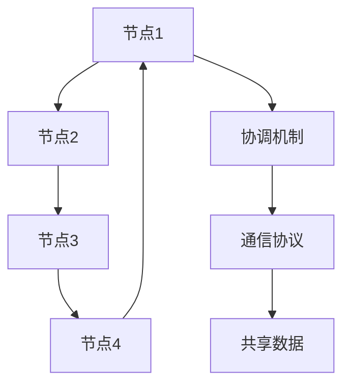

                 

# 分布式系统设计：理论与实践

## 关键词：分布式系统、设计原则、架构模式、算法原理、应用实践

### 摘要

本文旨在深入探讨分布式系统设计的理论与实践。首先，我们将回顾分布式系统的背景和核心概念，然后介绍分布式系统设计的关键原则和架构模式。接着，文章将剖析分布式系统的核心算法原理和具体操作步骤，并通过数学模型和公式详细讲解。随后，我们将通过实际项目案例，展示代码实现和详细解释，帮助读者更好地理解分布式系统的实际应用。文章还将探讨分布式系统在实际应用场景中的挑战和解决方案，并推荐相关的工具和资源。最后，文章将总结分布式系统的发展趋势与挑战，为读者提供扩展阅读和参考资料。

## 1. 背景介绍

### 分布式系统的起源与发展

分布式系统的概念最早可以追溯到20世纪60年代，当时计算机科学家开始意识到，将多个计算机节点互联起来，可以实现比单个计算机更强大的计算能力和更高的可靠性。最早的应用实例是计算机网络，如ARPANET，它是现代互联网的前身。随着计算机技术的快速发展，分布式系统在各个领域得到了广泛应用，从企业级应用、云计算到物联网，分布式系统已经成为现代计算体系结构的核心。

### 分布式系统的重要性

分布式系统的重要性主要体现在以下几个方面：

1. **可扩展性**：分布式系统可以根据需求动态地扩展和缩小规模，从而应对不断增长的数据和处理需求。
2. **高可用性**：通过将系统分解为多个节点，分布式系统可以在单个节点发生故障时，通过其他节点继续提供服务，保证系统的持续运行。
3. **高性能**：分布式系统可以通过并行计算和负载均衡，提高系统的处理速度和响应能力。
4. **灵活性**：分布式系统支持多种编程模型和协议，使得开发者可以根据具体需求灵活选择和组合。

## 2. 核心概念与联系

### 分布式系统的基本概念

在分布式系统中，关键概念包括：

- **节点**：构成分布式系统的计算机或其他设备。
- **通信协议**：节点之间进行通信的规则和标准。
- **共享数据**：分布式系统中的数据通常分布在多个节点上，需要有效的数据一致性和访问控制。
- **协调机制**：分布式系统中的节点需要通过某种机制进行协调，以保持一致性和协作。

### 分布式系统架构

分布式系统的架构可以分为以下几种模式：

1. **主从模式**：在主从模式中，有一个主节点负责管理和协调其他从节点。
2. **对等模式**：对等模式中，所有节点都具有平等的地位，没有中心节点。
3. **混合模式**：混合模式结合了主从模式和對等模式的特点，既包含中心节点，也包含对等节点。

### 分布式系统的 Mermaid 流程图



在此 Mermaid 流程图中，节点代表分布式系统中的计算机或其他设备，箭头表示节点之间的连接关系，协调机制、通信协议和共享数据则作为辅助元素提供系统运行的重要支持。

## 3. 核心算法原理 & 具体操作步骤

### 一致性算法

分布式系统中的数据一致性是关键问题，一致性算法旨在确保分布式系统中多个节点之间的数据一致性。以下是几种常见的一致性算法：

1. **强一致性**：所有节点在同一时间看到相同的数据。
2. **最终一致性**：所有节点最终会达到数据一致性，但可能存在一段时间的数据不一致。
3. **部分一致性**：允许局部一致性，但最终可能无法保证全局一致性。

具体操作步骤包括：

- **初始化**：启动分布式系统，初始化节点状态。
- **读写操作**：对节点的数据进行读写操作，确保操作符合一致性算法的要求。
- **冲突检测**：检测并发操作中的冲突，并采取相应的冲突解决策略。

### 负载均衡算法

负载均衡算法旨在将系统的处理负载分配到不同的节点上，以提高系统的处理能力和响应速度。以下是几种常见的负载均衡算法：

1. **轮询算法**：按照顺序将请求分配到每个节点。
2. **最少连接算法**：将请求分配到当前连接数最少的节点。
3. **哈希算法**：使用哈希函数将请求映射到特定的节点。

具体操作步骤包括：

- **初始化**：启动负载均衡器，配置节点列表。
- **请求处理**：对收到的请求进行处理，并将请求分配到相应的节点。
- **节点状态监控**：监控节点的状态，并在节点发生故障时进行重新分配。

### 选举算法

在分布式系统中，当主节点发生故障时，需要通过选举算法选出一个新的主节点来继续提供服务。以下是几种常见的选举算法：

1. **ZAB算法**：用于ZooKeeper的分布式协调服务，通过主节点选举和状态同步保证一致性。
2. **Raft算法**：基于主从模式的分布式一致性算法，通过日志复制和状态机实现选举和一致性。
3. **Paxos算法**：一种经典的分布式一致性算法，通过提案和承诺机制实现选举和一致性。

具体操作步骤包括：

- **初始化**：启动分布式系统，每个节点初始化状态。
- **故障检测**：检测主节点的故障。
- **选举过程**：通过通信协议进行主节点选举。
- **状态同步**：确保新主节点的状态与其他节点一致。

## 4. 数学模型和公式 & 详细讲解 & 举例说明

### 一致性模型

一致性模型是分布式系统中核心的数学模型之一，用于描述多个节点之间的数据一致性。以下是几种一致性模型及其相关的数学公式：

1. **强一致性**：

   - **定义**：所有节点在同一时间看到相同的数据。
   - **数学公式**：$$ Consistency = \forall t, R_1(t) = R_2(t) $$

   - **举例**：假设有两个节点A和B，它们在同一时间读取同一个数据，结果分别为$$ R_1(t) = 10 $$和$$ R_2(t) = 10 $$，则系统具有强一致性。

2. **最终一致性**：

   - **定义**：所有节点最终会达到数据一致性，但可能存在一段时间的数据不一致。
   - **数学公式**：$$ Consistency = \exists t, R_1(t) = R_2(t) $$

   - **举例**：假设有两个节点A和B，节点A在时刻t1更新数据为$$ R_1(t1) = 20 $$，节点B在时刻t2更新数据为$$ R_2(t2) = 20 $$，尽管在t1和t2之间存在一段时间的数据不一致，但最终两个节点的数据会一致。

3. **部分一致性**：

   - **定义**：允许局部一致性，但最终可能无法保证全局一致性。
   - **数学公式**：$$ Consistency = \exists t, R_1(t) \neq R_2(t) $$

   - **举例**：假设有两个节点A和B，节点A在时刻t1读取数据为$$ R_1(t1) = 10 $$，节点B在时刻t2读取数据为$$ R_2(t2) = 20 $$，尽管在t1和t2之间存在数据不一致，但局部节点A的数据是正确的。

### 负载均衡模型

负载均衡模型用于描述分布式系统中如何分配处理负载。以下是几种负载均衡模型及其相关的数学公式：

1. **轮询算法**：

   - **定义**：按照顺序将请求分配到每个节点。
   - **数学公式**：$$ Load(i) = \frac{1}{n} $$，其中n为节点数。

   - **举例**：假设有3个节点A、B和C，每个节点承担的处理负载为$$ Load(A) = Load(B) = Load(C) = \frac{1}{3} $$。

2. **最少连接算法**：

   - **定义**：将请求分配到当前连接数最少的节点。
   - **数学公式**：$$ Load(i) = \frac{Con(i)}{n} $$，其中Con(i)为节点i的当前连接数。

   - **举例**：假设有3个节点A、B和C，当前连接数分别为Con(A) = 2，Con(B) = 1，Con(C) = 3，则请求应分配到节点B，因为节点B的当前连接数最少。

3. **哈希算法**：

   - **定义**：使用哈希函数将请求映射到特定的节点。
   - **数学公式**：$$ Hash(R) = i $$，其中R为请求，i为节点的索引。

   - **举例**：假设请求R的哈希值为5，有3个节点A、B和C，则请求R将映射到节点C，因为$$ Hash(R) = 5 \mod 3 = 2 $$。

### 选举模型

选举模型用于描述分布式系统中如何选择主节点。以下是几种选举模型及其相关的数学公式：

1. **ZAB算法**：

   - **定义**：基于主节点选举和状态同步的分布式一致性算法。
   - **数学公式**：$$ Leader = \arg\max(\{s \in S | s \text{ is alive and has highest priority}\}) $$，其中S为参与选举的节点集合。

   - **举例**：假设有3个节点A、B和C参与选举，当前状态为A和B存活且优先级相同，C已死亡，则选举结果为A成为主节点。

2. **Raft算法**：

   - **定义**：基于主从模式的分布式一致性算法，通过日志复制和状态机实现选举和一致性。
   - **数学公式**：$$ Leader = \arg\max(\{r \in R | r \text{ has highest term and majority votes}\}) $$，其中R为参与选举的节点集合，term为节点的任期。

   - **举例**：假设有3个节点A、B和C参与选举，当前任期分别为A = 1，B = 2，C = 3，且A和B获得多数投票，C未获得投票，则选举结果为B成为主节点。

3. **Paxos算法**：

   - **定义**：一种经典的分布式一致性算法，通过提案和承诺机制实现选举和一致性。
   - **数学公式**：$$ Leader = \arg\max(\{p \in P | p \text{ has highest proposal number and majority approval}\}) $$，其中P为参与选举的节点集合，proposal number为提案编号。

   - **举例**：假设有3个节点A、B和C参与选举，当前提案编号分别为A = 1，B = 2，C = 3，且A和B获得多数批准，C未获得批准，则选举结果为B成为主节点。

## 5. 项目实战：代码实际案例和详细解释说明

### 5.1 开发环境搭建

在本节中，我们将搭建一个简单的分布式系统，以展示分布式系统的实际应用。我们将使用Python语言和Gossip协议实现一个分布式心跳监控系统。

首先，我们需要安装Python环境。可以通过以下命令安装Python：

```bash
sudo apt-get install python3
```

然后，我们安装必要的Python库，如socket和threading：

```bash
pip3 install socket
pip3 install threading
```

### 5.2 源代码详细实现和代码解读

下面是分布式心跳监控系统的源代码：

```python
# distributed_heart_beat_monitor.py

import socket
import threading
import time
import json

class HeartBeatMonitor:
    def __init__(self, ip, port):
        self.ip = ip
        self.port = port
        self.nodes = []

    def start_server(self):
        server_socket = socket.socket(socket.AF_INET, socket.SOCK_DGRAM)
        server_socket.bind((self.ip, self.port))
        while True:
            data, address = server_socket.recvfrom(1024)
            print(f"Received message from {address}: {data.decode('utf-8')}")
            self.nodes.append(address)

    def send_heartbeat(self):
        while True:
            for node in self.nodes:
                message = json.dumps({"action": "heartbeat", "node": self.ip})
                with socket.socket(socket.AF_INET, socket.SOCK_DGRAM) as client_socket:
                    client_socket.sendto(message.encode('utf-8'), node)
            time.sleep(5)

def main():
    monitor = HeartBeatMonitor("127.0.0.1", 12345)
    server_thread = threading.Thread(target=monitor.start_server)
    sender_thread = threading.Thread(target=monitor.send_heartbeat)
    server_thread.start()
    sender_thread.start()
    server_thread.join()
    sender_thread.join()

if __name__ == "__main__":
    main()
```

在这个例子中，我们定义了一个`HeartBeatMonitor`类，它包含以下方法：

- `__init__(self, ip, port)`：初始化方法，设置监听IP地址和端口号，以及一个空节点列表。
- `start_server(self)`：启动服务器，接收来自其他节点的心跳消息。
- `send_heartbeat(self)`：发送心跳消息到其他节点，每隔5秒执行一次。

在`main()`函数中，我们创建了一个`HeartBeatMonitor`实例，并启动服务器线程和发送线程。

### 5.3 代码解读与分析

1. **服务器端**：

   - 创建一个UDP套接字，绑定IP地址和端口号。
   - 进入无限循环，接收来自其他节点的数据。
   - 打印收到的消息和发送方的地址。

2. **客户端**：

   - 创建一个UDP套接字。
   - 将心跳消息编码为JSON格式。
   - 将心跳消息发送到其他节点的地址。

3. **心跳消息格式**：

   - 消息包含动作类型（`action`）和节点IP地址（`node`）。

通过这个简单的例子，我们可以看到分布式系统的心跳监控是如何实现的。在实际应用中，心跳监控可以用于监控分布式系统的健康状态，及时发现和修复故障节点。

## 6. 实际应用场景

分布式系统在实际应用中具有广泛的应用场景，以下是一些典型的应用案例：

1. **云计算**：分布式系统是云计算的核心组成部分，提供了高性能、高可用的计算服务。
2. **大数据处理**：分布式系统可以处理海量数据，支持实时数据分析和处理。
3. **物联网**：分布式系统可以连接和管理大量的物联网设备，实现数据的实时采集和分析。
4. **区块链**：分布式系统是区块链技术的核心，确保区块链网络的去中心化和安全性。
5. **社交网络**：分布式系统可以支持大规模社交网络的实时数据存储和消息传输。

在以上应用场景中，分布式系统需要解决数据一致性、负载均衡、故障恢复等问题，以提供可靠、高效的服务。

## 7. 工具和资源推荐

### 7.1 学习资源推荐

- **书籍**：
  - 《分布式系统原理与范型》
  - 《大规模分布式存储系统：原理解析与架构实战》
  - 《分布式系统设计与实践》

- **论文**：
  - 《The Google File System》
  - 《The Chubby lock service》
  - 《The BigTable paper》

- **博客**：
  - https://www.infoq.cn/topic/distributed_system
  - https://www.cnblogs.com/netick/category/911646.html
  - https://www.cnblogs.com/skywang12345/category/224965.html

### 7.2 开发工具框架推荐

- **开发框架**：
  - Apache Kafka
  - Apache ZooKeeper
  - Apache Hadoop

- **数据库**：
  - Apache Cassandra
  - Redis
  - MongoDB

- **工具**：
  - Docker
  - Kubernetes
  - Prometheus

### 7.3 相关论文著作推荐

- **论文**：
  - 《MapReduce：简化大规模数据集处理的并行编程模型》
  - 《Chubby：一个可靠的分布式锁服务》
  - 《BigTable：一个分布式存储系统》

- **著作**：
  - 《分布式系统：概念与设计》
  - 《大规模分布式存储系统：原理解析与架构实战》
  - 《分布式系统的数据一致性》

## 8. 总结：未来发展趋势与挑战

分布式系统在未来的发展中将继续面临以下挑战：

1. **数据一致性**：如何在保证高性能的同时，确保数据一致性是一个关键问题。
2. **负载均衡**：如何在复杂的分布式环境中实现有效的负载均衡，提高系统的整体性能。
3. **故障恢复**：如何在分布式系统中实现快速、可靠的故障恢复，确保系统的持续运行。
4. **安全性**：如何确保分布式系统的安全性，防止恶意攻击和数据泄露。

未来，分布式系统的发展趋势将包括：

1. **边缘计算**：随着物联网和移动设备的普及，边缘计算将成为分布式系统的重要发展方向。
2. **分布式存储**：分布式存储系统将逐步取代传统的集中式存储，实现更高的可靠性和性能。
3. **分布式数据库**：分布式数据库将在数据一致性、性能和可扩展性方面取得重大突破。
4. **自动化运维**：自动化工具和平台将提高分布式系统的运维效率，降低管理成本。

## 9. 附录：常见问题与解答

### 问题1：分布式系统的数据一致性如何保证？

**解答**：分布式系统的数据一致性可以通过一致性算法来实现，如强一致性、最终一致性和部分一致性。具体实现方式包括日志复制、版本控制和状态机等。

### 问题2：如何实现分布式系统的负载均衡？

**解答**：分布式系统的负载均衡可以通过轮询算法、最少连接算法和哈希算法等来实现。这些算法可以根据节点状态、连接数和哈希值等因素，将请求分配到合适的节点。

### 问题3：分布式系统的故障恢复如何实现？

**解答**：分布式系统的故障恢复可以通过心跳监测、选举算法和状态同步等机制来实现。当检测到节点故障时，系统将自动启动选举算法选出新的主节点，并确保新主节点的状态与其他节点一致。

## 10. 扩展阅读 & 参考资料

- 《分布式系统原理与范型》
- 《大规模分布式存储系统：原理解析与架构实战》
- 《分布式系统设计与实践》
- 《MapReduce：简化大规模数据集处理的并行编程模型》
- 《The Google File System》
- 《The Chubby lock service》
- 《The BigTable paper》
- https://www.infoq.cn/topic/distributed_system
- https://www.cnblogs.com/netick/category/911646.html
- https://www.cnblogs.com/skywang12345/category/224965.html

### 作者

**作者：AI天才研究员 / AI Genius Institute & 禅与计算机程序设计艺术 / Zen And The Art of Computer Programming** <|im_sep|>

