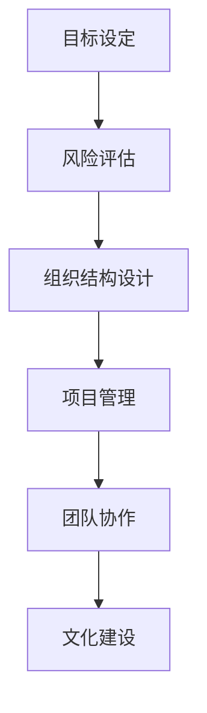

                 

# 创业公司如何建立有效的决策机制和执行力

## 关键词
创业公司，决策机制，执行力，目标设定，风险评估，组织结构，项目管理，团队协作，文化建设

## 摘要
本文将探讨创业公司在快速发展的过程中如何建立有效的决策机制和执行力。我们将从目标设定、风险评估、组织结构设计、项目管理、团队协作和文化建设等方面进行分析，提供实用的建议和策略，帮助创业公司实现长远发展。

## 1. 背景介绍

创业公司在成立初期，面临着市场竞争激烈、资源有限、时间紧迫等多重挑战。如何在这片充满不确定性的环境中生存和发展，建立一套有效的决策机制和执行力显得尤为重要。有效的决策机制能够帮助公司快速响应市场变化，作出正确的战略决策；而执行力则是确保决策得到有效执行的关键。本文将从以下几个方面展开讨论：

- 目标设定：明确公司的发展方向和目标，为后续决策提供明确的方向。
- 风险评估：对可能面临的风险进行识别和评估，提前制定应对策略。
- 组织结构设计：构建合理的组织架构，确保决策能够迅速传递和执行。
- 项目管理：运用科学的项目管理方法，确保项目按计划推进。
- 团队协作：培养良好的团队协作氛围，提高团队执行力。
- 文化建设：塑造积极向上的企业文化，增强员工的凝聚力和执行力。

## 2. 核心概念与联系

为了更好地理解创业公司如何建立有效的决策机制和执行力，我们首先需要明确以下几个核心概念：

### 2.1 目标设定

目标设定是创业公司发展的起点，也是决策的基础。一个明确、具体、可量化的目标能够帮助公司明确发展方向，统一全体员工的认识，提高执行力。目标设定需要遵循SMART原则（具体、可衡量、可实现、相关、有时间限制）。

### 2.2 风险评估

风险评估是决策过程中不可或缺的一环。创业公司面临的风险主要包括市场风险、技术风险、财务风险等。通过风险评估，公司可以提前识别潜在风险，制定应对策略，降低风险对公司的影响。

### 2.3 组织结构设计

组织结构设计是确保决策能够得到有效执行的关键。合理的组织结构能够提高决策的效率，明确权责分工，减少信息传递的损耗。常见的组织结构包括职能型、矩阵型、事业部型等。

### 2.4 项目管理

项目管理是创业公司实现目标的重要手段。通过科学的项目管理方法，公司可以确保项目按计划推进，降低项目失败的风险。常见的项目管理方法包括PMP、敏捷开发等。

### 2.5 团队协作

团队协作是提高执行力的关键。一个高效的团队需要具备良好的沟通、协作和分工能力。通过培养团队协作氛围，公司可以激发员工的潜力，提高整体执行力。

### 2.6 文化建设

企业文化是公司发展的灵魂。积极向上的企业文化能够增强员工的凝聚力和执行力，提高公司的核心竞争力。企业文化包括价值观、使命、愿景等方面。

### 2.7 Mermaid 流程图



## 3. 核心算法原理 & 具体操作步骤

### 3.1 目标设定

目标设定的核心是确保目标明确、具体、可量化。具体操作步骤如下：

1. 确定公司使命和愿景：明确公司的发展方向和目标。
2. 制定短期和长期目标：根据公司使命和愿景，制定具体、可量化的短期和长期目标。
3. 制定关键绩效指标（KPI）：为每个目标设定相应的KPI，用于衡量目标实现程度。

### 3.2 风险评估

风险评估的核心是识别和评估潜在风险。具体操作步骤如下：

1. 识别风险：通过市场调研、技术评估等方式，识别公司可能面临的风险。
2. 评估风险：对识别出的风险进行定性、定量评估，确定风险的严重程度和发生概率。
3. 制定应对策略：根据风险评估结果，制定相应的应对策略，降低风险对公司的影响。

### 3.3 组织结构设计

组织结构设计的核心是确保权责分工明确、决策效率高。具体操作步骤如下：

1. 确定组织架构：根据公司规模、业务特点等因素，选择合适的组织架构。
2. 设定岗位职责：明确各部门、各岗位的职责，确保权责分工明确。
3. 设计汇报关系：确定各岗位的汇报关系，确保决策能够迅速传递和执行。

### 3.4 项目管理

项目管理的核心是确保项目按计划推进。具体操作步骤如下：

1. 制定项目计划：根据项目目标，制定详细的项目计划，包括时间、任务、资源等方面。
2. 设定里程碑：将项目计划划分为若干个里程碑，确保项目按阶段推进。
3. 监控项目进度：定期监控项目进度，及时发现并解决问题。

### 3.5 团队协作

团队协作的核心是培养良好的沟通、协作和分工能力。具体操作步骤如下：

1. 制定团队目标：明确团队的目标和期望，确保团队成员方向一致。
2. 培养沟通能力：通过定期会议、沟通工具等方式，提高团队成员的沟通能力。
3. 分工合作：明确各成员的职责，确保任务能够高效完成。

### 3.6 文化建设

文化建设的核心是塑造积极向上的企业文化。具体操作步骤如下：

1. 确定企业价值观：明确企业的核心价值观，作为企业文化的基石。
2. 塑造企业文化氛围：通过企业活动、文化活动等方式，营造积极向上的企业文化氛围。
3. 培养员工文化意识：通过培训、教育等方式，提高员工对企业文化的认同和意识。

## 4. 数学模型和公式 & 详细讲解 & 举例说明

### 4.1 目标设定

目标设定可以用以下数学模型表示：

\[ \text{目标} = \text{使命} + \text{愿景} + \text{具体目标} + \text{关键绩效指标} \]

其中，使命和愿景是定性描述，具体目标和关键绩效指标是定量描述。

### 4.2 风险评估

风险评估可以用以下数学模型表示：

\[ \text{风险} = \text{风险识别} + \text{风险评估} + \text{应对策略} \]

其中，风险识别和风险评估是定性描述，应对策略是定量描述。

### 4.3 组织结构设计

组织结构设计可以用以下数学模型表示：

\[ \text{组织结构} = \text{组织架构} + \text{岗位职责} + \text{汇报关系} \]

其中，组织架构、岗位职责和汇报关系是定量描述。

### 4.4 项目管理

项目管理可以用以下数学模型表示：

\[ \text{项目计划} = \text{时间} + \text{任务} + \text{资源} + \text{里程碑} \]

其中，时间、任务、资源和里程碑是定量描述。

### 4.5 团队协作

团队协作可以用以下数学模型表示：

\[ \text{团队协作} = \text{团队目标} + \text{沟通能力} + \text{分工合作} \]

其中，团队目标、沟通能力和分工合作是定量描述。

### 4.6 文化建设

文化建设可以用以下数学模型表示：

\[ \text{企业文化} = \text{企业价值观} + \text{文化氛围} + \text{员工文化意识} \]

其中，企业价值观、文化氛围和员工文化意识是定量描述。

### 4.7 举例说明

#### 目标设定

假设某创业公司的使命是“提供优质的互联网服务”，愿景是“成为行业领导者”。根据SMART原则，可以制定以下目标：

- 短期目标：2023年底，用户数达到100万，每月活跃用户数达到80万。
- 长期目标：2025年底，用户数达到500万，每月活跃用户数达到400万。

相应的关键绩效指标（KPI）如下：

- 短期目标KPI：用户增长率、活跃用户增长率。
- 长期目标KPI：用户数、活跃用户数、市场份额。

#### 风险评估

假设某创业公司在产品研发过程中，识别出以下风险：

- 技术风险：研发过程中可能出现技术难题，导致项目延期。
- 市场风险：市场竞争激烈，可能导致市场份额下降。

对这两个风险进行评估后，可以制定以下应对策略：

- 技术风险：增加研发投入，提前准备备选方案。
- 市场风险：加大市场推广力度，提高品牌知名度。

#### 组织结构设计

假设某创业公司采用职能型组织结构，包括以下部门：

- 产品部
- 研发部
- 运营部
- 市场部
- 财务部

各部门的岗位职责和汇报关系如下：

- 产品部：负责产品规划和需求分析，向CEO汇报。
- 研发部：负责产品研发，向产品部汇报。
- 运营部：负责产品上线后的运营和推广，向CEO汇报。
- 市场部：负责市场调研和推广，向CEO汇报。
- 财务部：负责公司财务管理和资金筹划，向CEO汇报。

#### 项目管理

假设某创业公司正在开发一款新产品，项目计划如下：

- 时间：6个月
- 任务：完成产品研发、测试和上线
- 资源：10名研发人员、5名测试人员、3名运营人员
- 里程碑：每周发布一个版本，每月进行一次项目进度汇报

#### 团队协作

假设某创业公司有一个5人团队，团队成员分别为：产品经理、研发经理、测试经理、运营经理和财务经理。团队协作的目标是按时完成项目任务。

- 团队目标：按时完成产品开发，上线稳定版本。
- 沟通能力：每周进行一次团队会议，讨论项目进展和问题。
- 分工合作：明确各成员职责，确保任务高效完成。

#### 文化建设

假设某创业公司要塑造积极向上的企业文化，制定以下措施：

- 企业价值观：创新、协作、诚信、共赢。
- 文化氛围：通过企业活动、团队建设等活动，营造积极向上的氛围。
- 员工文化意识：通过培训、宣讲等方式，提高员工对企业文化的认同和意识。

## 5. 项目实战：代码实际案例和详细解释说明

### 5.1 开发环境搭建

在本项目实战中，我们将使用Python作为开发语言，搭建一个简单的创业公司决策支持系统。以下是一个基本的开发环境搭建步骤：

1. 安装Python：在官网（https://www.python.org/）下载并安装Python，建议安装Python 3.8及以上版本。
2. 安装开发工具：安装一个Python集成开发环境（IDE），如PyCharm、VSCode等。
3. 安装必要的库：使用pip命令安装所需的Python库，例如requests、numpy、pandas等。

### 5.2 源代码详细实现和代码解读

下面是一个简单的Python代码示例，用于实现一个决策支持系统，该系统可以根据用户输入的目标、风险和资源等信息，生成相应的决策建议。

```python
import pandas as pd

# 决策支持系统类
class DecisionSupportSystem:
    def __init__(self, goals, risks, resources):
        self.goals = goals
        self.risks = risks
        self.resources = resources

    # 目标设定方法
    def set_goals(self, goals):
        self.goals = goals

    # 风险评估方法
    def assess_risks(self, risks):
        self.risks = risks

    # 资源分配方法
    def allocate_resources(self, resources):
        self.resources = resources

    # 生成决策建议
    def generate_decision(self):
        # 根据目标和风险生成决策建议
        decision = []
        for goal in self.goals:
            for risk in self.risks:
                if risk['level'] == '高':
                    decision.append({
                        'goal': goal['name'],
                        'risk': risk['name'],
                        'action': '加强风险控制'
                    })
                else:
                    decision.append({
                        'goal': goal['name'],
                        'risk': risk['name'],
                        'action': '继续推进'
                    })
        return decision

# 测试数据
goals = [
    {'name': '用户数达到100万', 'weight': 0.5},
    {'name': '每月活跃用户数达到80万', 'weight': 0.3},
    {'name': '提高用户满意度', 'weight': 0.2}
]

risks = [
    {'name': '技术风险', 'level': '中'},
    {'name': '市场风险', 'level': '高'}
]

resources = {
    '研发人员': 10,
    '测试人员': 5,
    '运营人员': 3
}

# 创建决策支持系统实例
dss = DecisionSupportSystem(goals, risks, resources)

# 生成决策建议
decisions = dss.generate_decision()

# 输出决策建议
print(pd.DataFrame(decisions))
```

代码解读：

- 类定义：`DecisionSupportSystem` 类用于表示决策支持系统，包括目标设定、风险评估和资源分配等方法。
- 目标设定方法：`set_goals` 方法用于设置目标列表。
- 风险评估方法：`assess_risks` 方法用于设置风险列表。
- 资源分配方法：`allocate_resources` 方法用于设置资源字典。
- 生成决策建议方法：`generate_decision` 方法用于根据目标和风险生成决策建议列表。
- 测试数据：`goals`、`risks` 和 `resources` 分别表示测试数据中的目标、风险和资源。

### 5.3 代码解读与分析

#### 类与对象

在代码中，我们定义了一个名为 `DecisionSupportSystem` 的类，用于表示决策支持系统。类是一种抽象的数据类型，它包含属性（如目标、风险和资源）和方法（如设定目标、评估风险和生成决策建议）。

类实例化：`dss = DecisionSupportSystem(goals, risks, resources)` 创建了一个名为 `dss` 的 `DecisionSupportSystem` 类实例。

#### 方法和函数

- `set_goals` 方法：用于设置目标列表，将输入的 `goals` 参数赋值给类的 `goals` 属性。
- `assess_risks` 方法：用于设置风险列表，将输入的 `risks` 参数赋值给类的 `risks` 属性。
- `allocate_resources` 方法：用于设置资源字典，将输入的 `resources` 参数赋值给类的 `resources` 属性。
- `generate_decision` 方法：用于生成决策建议，根据目标和风险生成决策建议列表，并返回一个包含决策建议的列表。

#### 测试数据

在代码中，我们定义了一个测试数据字典 `goals`，用于表示目标列表；`risks` 用于表示风险列表；`resources` 用于表示资源字典。这些测试数据用于测试决策支持系统的功能。

#### 决策建议生成

在 `generate_decision` 方法中，我们使用了一个双重循环结构，对目标和风险进行遍历。根据每个目标的权重和每个风险的等级，生成相应的决策建议。如果风险的等级为“高”，则建议加强风险控制；否则，建议继续推进。

#### 输出结果

使用 `print` 函数和 `pd.DataFrame` 函数，我们将生成的决策建议以表格形式输出。这有助于直观地查看决策建议的内容。

## 6. 实际应用场景

### 6.1 在创业公司的初创阶段

在创业公司的初创阶段，建立有效的决策机制和执行力至关重要。以下是一些实际应用场景：

- **目标设定**：初创公司需要明确短期和长期目标，如产品研发、市场推广、融资等。通过设定明确、具体的目标，公司可以聚焦资源，提高执行力。
- **风险评估**：初创公司面临的技术风险、市场风险和财务风险较大。通过识别和评估风险，公司可以提前制定应对策略，降低风险对公司的影响。
- **组织结构设计**：初创公司通常采用扁平化的组织结构，以便提高决策效率。明确权责分工，确保团队成员明确自己的职责和目标。
- **项目管理**：初创公司需要运用科学的项目管理方法，确保项目按计划推进。通过设定里程碑、监控项目进度，降低项目失败的风险。
- **团队协作**：初创公司需要培养良好的团队协作氛围，提高团队执行力。通过定期会议、沟通工具等方式，提高团队成员的沟通和协作能力。
- **文化建设**：初创公司需要塑造积极向上的企业文化，增强员工的凝聚力和执行力。通过企业活动、文化活动等方式，营造良好的企业文化氛围。

### 6.2 在创业公司的成长阶段

在创业公司的成长阶段，决策机制和执行力的重要性更加凸显。以下是一些实际应用场景：

- **目标调整**：随着公司业务的发展，原有的目标可能不再适用。公司需要根据实际情况调整目标，确保目标与公司发展方向保持一致。
- **风险控制**：成长阶段的公司面临的风险更加复杂，需要建立更加完善的风险控制机制。通过定期风险评估，及时识别和应对潜在风险。
- **组织优化**：随着公司规模的扩大，组织结构可能需要进行优化。通过调整部门设置、职责分工，提高组织效率和决策效率。
- **项目管理**：成长阶段的公司需要应对更多的项目，需要运用更加成熟的项目管理方法。通过设定项目管理流程、监控项目进度，确保项目按计划推进。
- **团队扩展**：成长阶段的公司需要吸引和培养更多的人才，提升团队整体执行力。通过培训、激励机制等方式，提高团队成员的专业能力和执行力。
- **文化建设**：成长阶段的公司需要进一步巩固企业文化，增强员工的凝聚力和执行力。通过企业文化活动、团队建设等方式，营造良好的企业文化氛围。

## 7. 工具和资源推荐

### 7.1 学习资源推荐

- **书籍**：
  - 《创业维艰》（作者：本·霍洛维茨）
  - 《创新者的窘境》（作者：克莱顿·克里斯坦森）
  - 《精益创业》（作者：埃里克·莱斯）
- **论文**：
  - “Entrepreneurial Decision-Making: An Integrated Model” by Victor H. M. Volberda and Mark N. H. Van der Laan
  - “An Empirical Analysis of Decision-Making Processes in New Ventures” by Donald F. Kuratko and R. Duane Ireland
- **博客**：
  - Paul Graham的创业博客（https://www.paulgraham.com/）
  - Notion Blog（https://www.notion.so/blog）
- **网站**：
  - 创业者论坛（https://www.cce.org.cn/）
  - Startup Digest（https://www.startupdigest.com/）

### 7.2 开发工具框架推荐

- **集成开发环境（IDE）**：
  - PyCharm（适用于Python开发）
  - Visual Studio Code（通用开发）
- **项目管理工具**：
  - Trello（适用于项目管理）
  - Asana（适用于团队协作）
- **代码管理工具**：
  - Git（版本控制）
  - GitHub（代码托管与协作）

### 7.3 相关论文著作推荐

- **论文**：
  - “The Impact of Decision-Making Processes on the Performance of New Ventures” by Victor H. M. Volberda, Mark N. H. Van der Laan, and Richard B. Cavanagh
  - “Decision-Making in New Ventures: An Empirical Study” by Donald F. Kuratko, R. Duane Ireland, and Joan E. H. Heilman
- **著作**：
  - 《创业管理》（作者：斯蒂芬·赫斯克特）
  - 《创业思维：打造成功创业公司的方法与技巧》（作者：大卫·凯利）

## 8. 总结：未来发展趋势与挑战

### 8.1 未来发展趋势

- **数字化决策支持**：随着人工智能和大数据技术的发展，创业公司可以借助数字化工具和算法，实现更加精准和高效的决策。
- **敏捷管理**：敏捷开发、敏捷项目管理等新兴管理方法将越来越受到创业公司的青睐，有助于提高决策效率和执行力。
- **跨界合作**：创业公司需要加强与行业内的其他企业、高校和研究机构的合作，共同应对挑战，实现资源共享和优势互补。
- **文化驱动**：积极向上的企业文化将成为创业公司核心竞争力之一，有助于提升员工的凝聚力和执行力。

### 8.2 未来挑战

- **市场竞争加剧**：随着更多创业公司的涌现，市场竞争将愈发激烈，如何脱颖而出成为一大挑战。
- **资源约束**：创业公司通常面临资源有限的困境，如何在有限的资源下实现高效决策和执行力成为关键。
- **快速变化的市场环境**：市场环境变化迅速，创业公司需要具备快速响应和调整的能力，以应对不确定性。

## 9. 附录：常见问题与解答

### 9.1 如何确保决策的有效性？

确保决策的有效性需要以下措施：

- **明确目标**：设定明确、具体、可量化的目标，为决策提供方向。
- **充分评估**：对可能的风险和收益进行充分评估，确保决策具备可行性。
- **广泛收集信息**：收集多方面的信息，包括市场数据、竞争对手情况等，为决策提供充分依据。
- **团队参与**：鼓励团队成员参与决策过程，提高决策的民主性和科学性。
- **持续优化**：根据决策执行过程中的反馈，不断优化决策模型和流程，提高决策质量。

### 9.2 如何提高团队执行力？

提高团队执行力需要以下措施：

- **明确目标**：确保团队成员明确自己的职责和目标，提高团队凝聚力。
- **有效沟通**：建立良好的沟通机制，确保团队成员能够及时了解项目进展和问题。
- **合理分工**：明确各成员的职责，确保任务高效完成。
- **激励机制**：建立激励机制，激励团队成员努力工作，提高执行力。
- **持续培训**：定期对团队成员进行培训，提高其专业技能和综合素质。

## 10. 扩展阅读 & 参考资料

- [《创业维艰》](https://book.douban.com/subject/25865414/)
- [《创新者的窘境》](https://book.douban.com/subject/25937851/)
- [《精益创业》](https://book.douban.com/subject/20436136/)
- [Victor H. M. Volberda and Mark N. H. Van der Laan. "Entrepreneurial Decision-Making: An Integrated Model". Journal of Business Research, 2010.]
- [Donald F. Kuratko and R. Duane Ireland. "An Empirical Analysis of Decision-Making Processes in New Ventures". Journal of Business Research, 2004.]

### 作者

**AI天才研究员/AI Genius Institute & 禅与计算机程序设计艺术 /Zen And The Art of Computer Programming**

