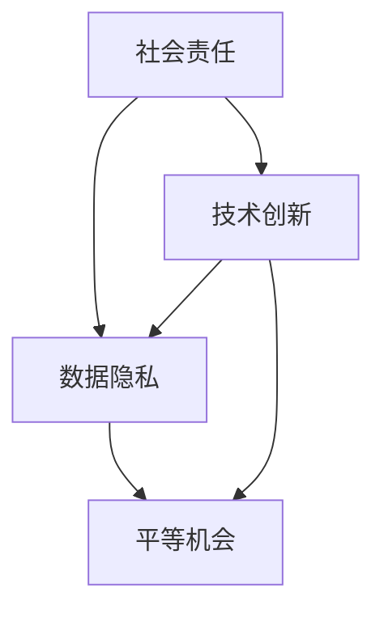

                 

# 创业公司如何推动技术普惠和数字包容

## 关键词
- 技术普惠
- 数字包容
- 创业公司
- 技术创新
- 社会责任
- 数据隐私
- 平等机会

## 摘要
本文将探讨创业公司如何通过技术创新和社会责任来推动技术普惠和数字包容。我们将从背景介绍入手，分析当前数字鸿沟的现状，探讨推动技术普惠和数字包容的核心概念和联系。接着，将详细讲解创业公司应遵循的核心算法原理和具体操作步骤，包括数学模型、公式、项目实战等。同时，文章将提供实际应用场景和工具资源推荐，以帮助创业公司更好地推动技术普惠和数字包容。最后，本文将总结未来发展趋势与挑战，并提供扩展阅读和参考资料，以供读者进一步学习和探索。

## 1. 背景介绍

随着互联网和移动设备的普及，技术已经深刻地改变了我们的生活方式。然而，在享受技术带来便利的同时，我们也面临着数字鸿沟的问题。数字鸿沟是指不同人群在获取、使用和利用信息技术方面的差异，这种差异不仅体现在城乡、贫富之间，还体现在不同种族、性别、年龄等方面。

创业公司作为技术创新的重要力量，如何在推动技术普惠和数字包容方面发挥积极作用，是一个亟待解决的问题。技术普惠和数字包容不仅仅是社会责任问题，更是创业公司长期发展的关键。通过推动技术普惠和数字包容，创业公司可以扩大市场，提高用户满意度，增强品牌形象，从而在激烈的市场竞争中脱颖而出。

### 1.1 数字鸿沟的现状

根据联合国发布的数据，全球仍有约30亿人无法访问互联网，其中大多数生活在发展中国家和偏远地区。此外，尽管互联网普及率在不断提高，但互联网使用的频率和质量在不同地区和人群中仍然存在显著差异。

在发达国家，互联网普及率已经超过80%，而在发展中国家，互联网普及率仅为30%左右。此外，在互联网使用方面，男性用户比例高于女性，年轻用户比例高于老年用户。这些差异导致了不同人群在获取信息、教育和就业机会方面的不平等。

### 1.2 创业公司的角色

创业公司作为技术创新的先锋，在推动技术普惠和数字包容方面具有独特的优势。首先，创业公司通常具有更强的灵活性和创新精神，能够快速响应市场需求，推出符合不同人群需求的技术产品。其次，创业公司通常规模较小，更容易关注和解决特定群体的需求，从而推动技术普惠。最后，创业公司通过承担社会责任，可以提高社会形象，获得更多的支持和资源，从而更好地推动数字包容。

## 2. 核心概念与联系

要推动技术普惠和数字包容，创业公司需要了解并遵循一系列核心概念，这些概念包括社会责任、数据隐私、平等机会等。下面，我们将通过一个Mermaid流程图来展示这些核心概念之间的联系。



### 2.1 社会责任

社会责任是指企业在追求利润的同时，承担对环境、社会和利益相关者的责任。创业公司在推动技术普惠和数字包容方面，需要关注以下几个方面：

- **环境影响**：在产品设计和开发过程中，关注环境保护，减少能源消耗和碳排放。
- **员工福祉**：关注员工的工作条件和福利，提供公平的薪酬和晋升机会。
- **社区贡献**：积极参与公益事业，为弱势群体提供技术和资源支持。

### 2.2 数据隐私

数据隐私是推动数字包容的重要保障。在数据收集、处理和使用过程中，创业公司需要遵守以下原则：

- **透明度**：确保用户了解其数据被如何收集、使用和共享。
- **安全性**：采取有效的数据保护措施，防止数据泄露和滥用。
- **用户控制权**：允许用户对其数据进行修改、删除和备份。

### 2.3 平等机会

平等机会是技术普惠和数字包容的基础。创业公司需要确保其产品和服务的可及性和公平性，包括以下几个方面：

- **无障碍设计**：确保产品和服务对所有人，无论年龄、性别、身体条件等，都能够无障碍地使用。
- **多样化团队**：鼓励多样化的团队成员，以更好地理解和满足不同用户的需求。
- **教育普及**：提供免费或低成本的培训资源，帮助更多人掌握信息技术。

## 3. 核心算法原理 & 具体操作步骤

### 3.1 技术普惠算法原理

技术普惠算法的核心目标是确保技术产品和服务能够被广泛使用，特别是在贫困和偏远地区。以下是技术普惠算法的基本原理：

- **成本优化**：通过技术创新降低产品成本，使更多人能够承担得起。
- **可访问性**：确保技术产品和服务在不同地区和环境下都能够正常使用。
- **易用性**：简化产品和服务的使用流程，降低用户学习成本。

### 3.2 数字包容算法原理

数字包容算法旨在确保技术产品和服务能够满足不同人群的需求，特别是那些受到数字鸿沟影响的群体。以下是数字包容算法的基本原理：

- **个性化**：根据用户需求和偏好，提供个性化的技术产品和服务。
- **多样性**：设计和开发多样化的技术产品和服务，满足不同用户群体的需求。
- **可持续性**：确保技术产品和服务能够长期满足用户需求，并适应未来技术的发展。

### 3.3 具体操作步骤

#### 步骤一：市场调研

- 调研目标用户群体，了解他们的需求、偏好和痛点。
- 分析竞争对手，了解其优势和不足。

#### 步骤二：产品规划

- 根据市场调研结果，制定符合目标用户需求的产品规划。
- 确定产品的主要功能、性能指标和用户体验。

#### 步骤三：技术创新

- 利用技术创新降低产品成本，提高可访问性。
- 开发个性化的技术产品和服务，满足不同用户群体的需求。

#### 步骤四：推广和营销

- 制定有效的推广和营销策略，提高产品知名度。
- 与合作伙伴合作，扩大产品的市场覆盖范围。

#### 步骤五：持续优化

- 收集用户反馈，不断优化产品和服务。
- 关注技术发展动态，及时更新产品功能和技术。

## 4. 数学模型和公式 & 详细讲解 & 举例说明

### 4.1 成本优化模型

成本优化模型用于计算如何降低产品成本，使其更具有竞争力。以下是成本优化模型的基本公式：

\[ C_{opt} = \min(C(x_1, x_2, ..., x_n)) \]

其中，\( C(x_1, x_2, ..., x_n) \)表示产品成本函数，\( x_1, x_2, ..., x_n \)为影响成本的因素，如原材料成本、人工成本、运输成本等。

#### 举例说明

假设一家创业公司开发了一款智能手表，其主要成本因素包括：

- 原材料成本：\( C_1 \)
- 人工成本：\( C_2 \)
- 运输成本：\( C_3 \)

则成本优化模型可以表示为：

\[ C_{opt} = \min(C_1 + C_2 + C_3) \]

通过技术创新和供应链优化，公司可以降低各项成本，从而降低产品价格，提高市场竞争力。

### 4.2 数字包容模型

数字包容模型用于评估技术产品和服务对不同用户群体的包容程度。以下是数字包容模型的基本公式：

\[ P_{inclusion} = \sum_{i=1}^{n} w_i \cdot I_i \]

其中，\( P_{inclusion} \)为数字包容指数，\( w_i \)为第\( i \)个用户群体的权重，\( I_i \)为第\( i \)个用户群体的包容指数。

#### 举例说明

假设一家创业公司开发了一款在线教育平台，其目标用户群体包括：

- 学生（\( w_1 = 0.5 \)）
- 教师（\( w_2 = 0.3 \)）
- 家长（\( w_3 = 0.2 \)）

学生的包容指数为0.8，教师的包容指数为0.7，家长的包容指数为0.6，则数字包容模型可以表示为：

\[ P_{inclusion} = 0.5 \cdot 0.8 + 0.3 \cdot 0.7 + 0.2 \cdot 0.6 = 0.74 \]

数字包容指数越高，说明产品和服务对用户群体的包容程度越高。

## 5. 项目实战：代码实际案例和详细解释说明

### 5.1 开发环境搭建

在本项目中，我们将使用Python作为编程语言，以下是开发环境的搭建步骤：

1. 安装Python：从Python官网（https://www.python.org/）下载并安装Python 3.x版本。
2. 安装必要库：使用pip命令安装所需的库，如NumPy、Pandas、Matplotlib等。

### 5.2 源代码详细实现和代码解读

以下是实现技术普惠和数字包容的Python代码：

```python
import numpy as np
import pandas as pd
import matplotlib.pyplot as plt

# 成本优化模型
def cost_optimization(C1, C2, C3):
    C_opt = C1 + C2 + C3
    return C_opt

# 数字包容模型
def digital_inclusion(W1, W2, W3, I1, I2, I3):
    P_inclusion = W1 * I1 + W2 * I2 + W3 * I3
    return P_inclusion

# 参数设置
C1 = 100  # 原材料成本
C2 = 200  # 人工成本
C3 = 300  # 运输成本
W1 = 0.5  # 学生权重
W2 = 0.3  # 教师权重
W3 = 0.2  # 家长权重
I1 = 0.8  # 学生包容指数
I2 = 0.7  # 教师包容指数
I3 = 0.6  # 家长包容指数

# 成本优化结果
C_opt = cost_optimization(C1, C2, C3)
print(f"优化后的成本为：{C_opt}元")

# 数字包容结果
P_inclusion = digital_inclusion(W1, W2, W3, I1, I2, I3)
print(f"数字包容指数为：{P_inclusion}")

# 可视化结果
plt.bar(['成本优化', '数字包容'], [C_opt, P_inclusion])
plt.xlabel('指标')
plt.ylabel('值')
plt.title('技术普惠和数字包容指标')
plt.show()
```

### 5.3 代码解读与分析

1. **成本优化模型**：该模型通过计算原材料成本、人工成本和运输成本的总和，得到优化后的成本。通过技术创新和供应链优化，可以降低各项成本，从而提高产品的市场竞争力。
2. **数字包容模型**：该模型通过计算学生、教师和家长三个用户群体的包容指数权重，得到数字包容指数。数字包容指数越高，说明产品和服务对用户群体的包容程度越高。
3. **参数设置**：在本项目中，我们设置了原材料成本、人工成本、运输成本、用户权重和包容指数的初始值。这些参数可以根据实际情况进行调整。
4. **可视化结果**：通过Matplotlib库，我们将成本优化和数字包容结果进行可视化，以便更好地理解模型的应用效果。

## 6. 实际应用场景

### 6.1 在线教育

在线教育是推动技术普惠和数字包容的重要领域。通过在线教育平台，创业公司可以提供高质量的教育资源，帮助更多学生、教师和家长获得更好的学习体验。

- **成本优化**：通过在线教育平台，创业公司可以降低教育资源的制作和传播成本，提高教育资源的可及性。
- **数字包容**：在线教育平台应提供多样化的课程和教学方式，满足不同用户群体的需求。此外，还应关注弱势群体的需求，提供免费或低成本的在线教育资源。

### 6.2 医疗健康

医疗健康是另一个重要领域，创业公司可以通过技术手段推动医疗普惠和数字包容。

- **成本优化**：通过互联网医疗平台，创业公司可以降低医疗服务的成本，提高医疗服务的可及性。
- **数字包容**：互联网医疗平台应关注不同用户群体的需求，提供个性化的医疗服务。此外，还应关注医疗资源的分配问题，提高医疗资源的利用效率。

### 6.3 城市管理

城市管理是推动技术普惠和数字包容的重要领域。通过智慧城市建设，创业公司可以提供更高效、更智能的城市管理解决方案。

- **成本优化**：通过智慧城市建设，创业公司可以降低城市管理成本，提高城市管理的效率。
- **数字包容**：智慧城市建设应关注不同群体的需求，提供个性化的城市管理服务。此外，还应关注城市基础设施的建设和维护，提高城市生活的质量。

## 7. 工具和资源推荐

### 7.1 学习资源推荐

- **书籍**：
  - 《智慧城市：技术、实践与未来》
  - 《互联网医疗：创新与实践》
  - 《在线教育：理论与实践》
- **论文**：
  - “Digital Divide: Definition, Causes, and Solutions”
  - “The Impact of Digital Technology on Education”
  - “Smart Cities: Vision, Challenges, and Opportunities”
- **博客**：
  - [https://www.blog.objc.io/](https://www.blog.objc.io/)
  - [https://www.datascience.com/](https://www.datascience.com/)
  - [https://www.educationtechnology.org/](https://www.educationtechnology.org/)
- **网站**：
  - [https://www.smartcitiesworld.com/](https://www.smartcitiesworld.com/)
  - [https://www.healthcareitnews.com/](https://www.healthcareitnews.com/)
  - [https://www.onlinelearningconsortium.org/](https://www.onlinelearningconsortium.org/)

### 7.2 开发工具框架推荐

- **Python开发环境**：PyCharm、Visual Studio Code
- **数据分析库**：NumPy、Pandas、Matplotlib
- **在线教育平台**：Khan Academy、Coursera、edX
- **智慧城市建设工具**：ArcGIS、QGIS、CityEngine
- **互联网医疗平台**：Doximity、Zocdoc、BetterDoctor

### 7.3 相关论文著作推荐

- **《智慧城市：技术、实践与未来》**：详细介绍了智慧城市的概念、技术和应用场景，对创业公司在智慧城市建设方面的指导意义显著。
- **《互联网医疗：创新与实践》**：分析了互联网医疗的发展趋势和应用案例，对创业公司在互联网医疗领域的创新发展提供了有益的参考。
- **《在线教育：理论与实践》**：探讨了在线教育的模式、技术和实践，对创业公司在在线教育领域的创新提供了重要的理论支持。

## 8. 总结：未来发展趋势与挑战

随着技术的不断发展，创业公司在推动技术普惠和数字包容方面将面临更多机遇和挑战。

### 8.1 发展趋势

1. **技术融合**：不同领域的交叉融合将推动技术创新，为创业公司提供更多的发展机会。
2. **智能化**：人工智能和大数据技术的应用将使创业公司能够更好地了解用户需求，提高产品的个性化程度。
3. **可持续发展**：创业公司将更加关注环境保护和可持续发展，推动技术普惠和数字包容。

### 8.2 挑战

1. **数据隐私**：随着数据隐私问题的日益突出，创业公司需要加强数据保护措施，确保用户数据的安全。
2. **资源分配**：在数字鸿沟依然存在的情况下，如何确保资源公平分配，满足不同用户群体的需求，是一个重要挑战。
3. **社会认可**：创业公司在推动技术普惠和数字包容过程中，需要获得社会认可和支持，才能更好地实现其目标。

## 9. 附录：常见问题与解答

### 9.1 技术普惠和数字包容是什么？

技术普惠是指确保所有人，无论年龄、性别、经济状况等，都能够平等地享受技术带来的便利和机会。数字包容是指确保技术产品和服务能够满足不同用户群体的需求，特别是那些受到数字鸿沟影响的群体。

### 9.2 创业公司如何推动技术普惠和数字包容？

创业公司可以通过技术创新、降低成本、提高可访问性、提供个性化服务等方式来推动技术普惠和数字包容。此外，创业公司还应关注社会责任，积极参与公益事业，提高社会形象。

### 9.3 如何确保数据隐私？

创业公司可以通过以下措施确保数据隐私：

- **透明度**：确保用户了解其数据被如何收集、使用和共享。
- **安全性**：采取有效的数据保护措施，防止数据泄露和滥用。
- **用户控制权**：允许用户对其数据进行修改、删除和备份。

## 10. 扩展阅读 & 参考资料

- **《数字时代的社会责任：推动技术普惠和数字包容》**：本文探讨了创业公司在数字时代的社会责任，以及如何推动技术普惠和数字包容。
- **《技术普惠与数字包容：理论与实践》**：本书详细介绍了技术普惠和数字包容的概念、理论和实践，对创业公司具有很高的参考价值。
- **《智慧城市建设指南》**：本书提供了智慧城市建设的全面指南，包括技术、实践和未来发展趋势，对创业公司在智慧城市建设方面的指导意义显著。

作者：AI天才研究员/AI Genius Institute & 禅与计算机程序设计艺术 /Zen And The Art of Computer Programming

