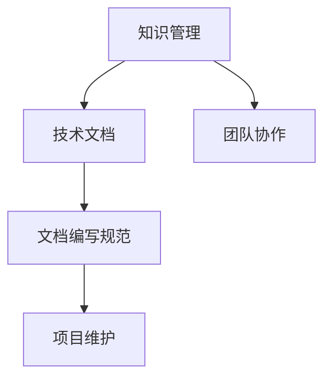
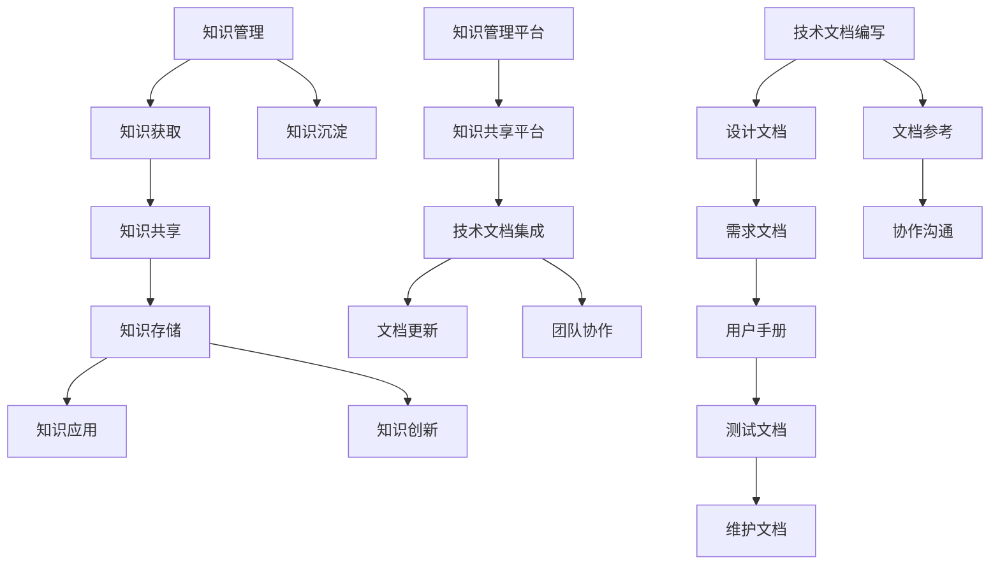

                 

# 创业公司如何进行知识管理和技术文档编写

## 摘要

本文将探讨创业公司如何进行有效的知识管理和技术文档编写。我们将首先介绍知识管理和技术文档编写的重要性，然后逐步讲解核心概念、算法原理、具体操作步骤、数学模型和公式、项目实战、实际应用场景、工具和资源推荐，最后总结未来发展趋势与挑战。

## 1. 背景介绍

在竞争激烈的创业环境中，知识管理和技术文档编写对于公司的成功至关重要。一方面，有效的知识管理能够帮助团队成员快速掌握公司现有的技术知识和经验，提高工作效率和创新能力；另一方面，完善的技术文档能够为后续的项目开发、问题排查和维护提供重要的参考依据。因此，创业公司需要关注知识管理和技术文档编写的最佳实践，以实现可持续的发展和成长。

## 2. 核心概念与联系

在探讨知识管理和技术文档编写之前，我们首先需要了解一些核心概念，如知识管理、技术文档、文档编写规范等。下面是一个使用Mermaid绘制的流程图，展示了这些概念之间的联系：



### 2.1 知识管理

知识管理是指通过各种手段和方法，对知识进行收集、整理、存储、共享和利用的过程。它包括知识的获取、知识的应用和知识的创新。在创业公司中，知识管理能够帮助团队成员充分利用已有的知识资源，提高工作效率和创新能力。

### 2.2 技术文档

技术文档是关于某个技术项目、产品或系统的详细描述，通常包括设计文档、需求文档、测试文档、用户手册等。技术文档的编写对于项目开发、问题排查和维护至关重要。

### 2.3 文档编写规范

文档编写规范是指为了保证文档的格式、结构和内容的一致性，制定的一系列规则和标准。遵循文档编写规范能够提高文档的可读性和可维护性。

### 2.4 团队协作

团队协作是指团队成员在项目开发过程中相互配合、共同完成任务的过程。有效的团队协作能够提高项目的开发效率和质量。

### 2.5 项目维护

项目维护是指在项目开发完成后，对项目进行定期检查、修复和更新，以确保项目能够持续稳定运行。

## 3. 核心算法原理 & 具体操作步骤

在进行知识管理和技术文档编写时，我们可以借鉴一些核心算法原理和具体操作步骤。以下是一个简单的示例：

### 3.1 知识管理算法原理

- **知识分类**：将知识按照领域、主题、应用场景等进行分类，方便团队成员快速查找和利用。
- **知识共享**：鼓励团队成员分享自己的知识和经验，通过内部论坛、知识库等方式进行共享。
- **知识沉淀**：定期整理和更新知识库，将团队成员的经验和教训沉淀下来，为后续项目提供参考。

### 3.2 技术文档编写步骤

- **需求分析**：明确项目需求，确定技术文档的内容和结构。
- **资料收集**：收集相关的技术资料，包括设计文档、需求文档、测试文档等。
- **编写文档**：根据需求分析和资料收集，编写技术文档，确保内容准确、完整、易懂。
- **审核与修改**：对编写完成的技术文档进行审核和修改，确保文档的质量。

### 3.3 团队协作步骤

- **明确目标**：确定项目目标和团队职责，确保团队成员明确自己的工作内容和任务。
- **沟通协调**：定期召开会议，讨论项目进展和问题，确保团队成员之间的沟通畅通。
- **协作开发**：按照项目计划和分工，共同完成项目开发任务。

## 4. 数学模型和公式 & 详细讲解 & 举例说明

在进行知识管理和技术文档编写时，我们可以借助一些数学模型和公式来提高效率和准确性。以下是一个简单的示例：

### 4.1 知识共享模型

假设一个创业公司的团队成员数量为 \( n \)，每个成员共享的知识量为 \( k \)，则公司整体的知识共享量可以表示为：

\[ S = \sum_{i=1}^{n} k_i \]

其中， \( k_i \) 表示第 \( i \) 个成员的知识共享量。

### 4.2 技术文档编写效率模型

假设一个技术文档的编写时间为 \( t \)，每个团队成员的编写效率为 \( e \)，则公司整体的技术文档编写效率可以表示为：

\[ E = \sum_{i=1}^{n} e_i \]

其中， \( e_i \) 表示第 \( i \) 个团队成员的编写效率。

### 4.3 团队协作效率模型

假设一个项目开发的时间为 \( T \)，每个团队成员的工作效率为 \( w \)，则公司整体的团队协作效率可以表示为：

\[ C = \sum_{i=1}^{n} w_i \]

其中， \( w_i \) 表示第 \( i \) 个团队成员的工作效率。

### 4.4 项目维护模型

假设一个项目的维护时间为 \( M \)，每个团队成员的维护效率为 \( m \)，则公司整体的项目维护效率可以表示为：

\[ P = \sum_{i=1}^{n} m_i \]

其中， \( m_i \) 表示第 \( i \) 个团队成员的维护效率。

## 5. 项目实战：代码实际案例和详细解释说明

在本节中，我们将通过一个实际的案例，展示如何进行知识管理和技术文档编写。假设我们正在开发一个在线教育平台，需要实现课程管理、用户管理、学习进度管理等功能。

### 5.1 开发环境搭建

首先，我们需要搭建开发环境。以下是一个简单的开发环境搭建步骤：

1. 安装Java开发工具包（JDK）。
2. 安装MySQL数据库。
3. 安装Eclipse或IntelliJ IDEA等开发工具。
4. 配置Tomcat服务器。

### 5.2 源代码详细实现和代码解读

接下来，我们将详细实现课程管理、用户管理、学习进度管理等功能的代码，并对关键代码进行解读。

#### 5.2.1 课程管理

```java
// 课程实体类
public class Course {
    private Integer id;
    private String name;
    private String description;
    // 省略其他属性和构造方法
}

// 课程管理接口
public interface CourseService {
    // 添加课程
    void addCourse(Course course);
    // 删除课程
    void deleteCourse(Integer id);
    // 更新课程
    void updateCourse(Course course);
    // 查询课程
    Course getCourse(Integer id);
    // 查询所有课程
    List<Course> listCourses();
}

// 课程管理实现类
public class CourseServiceImpl implements CourseService {
    // 省略其他实现方法
    @Override
    public void addCourse(Course course) {
        // 添加课程到数据库
    }

    @Override
    public void deleteCourse(Integer id) {
        // 根据ID删除课程
    }

    @Override
    public void updateCourse(Course course) {
        // 根据ID更新课程
    }

    @Override
    public Course getCourse(Integer id) {
        // 根据ID查询课程
    }

    @Override
    public List<Course> listCourses() {
        // 查询所有课程
    }
}
```

#### 5.2.2 用户管理

```java
// 用户实体类
public class User {
    private Integer id;
    private String username;
    private String password;
    // 省略其他属性和构造方法
}

// 用户管理接口
public interface UserService {
    // 注册用户
    void register(User user);
    // 登录用户
    User login(String username, String password);
    // 更新用户信息
    void update(User user);
    // 查询用户
    User getUser(Integer id);
    // 查询所有用户
    List<User> listUsers();
}

// 用户管理实现类
public class UserServiceImpl implements UserService {
    // 省略其他实现方法
    @Override
    public void register(User user) {
        // 注册用户到数据库
    }

    @Override
    public User login(String username, String password) {
        // 根据用户名和密码查询用户
    }

    @Override
    public void update(User user) {
        // 根据ID更新用户信息
    }

    @Override
    public User getUser(Integer id) {
        // 根据ID查询用户
    }

    @Override
    public List<User> listUsers() {
        // 查询所有用户
    }
}
```

#### 5.2.3 学习进度管理

```java
// 学习进度实体类
public class LearningProgress {
    private Integer id;
    private Integer userId;
    private Integer courseId;
    private Integer completed;
    // 省略其他属性和构造方法
}

// 学习进度管理接口
public interface LearningProgressService {
    // 添加学习进度
    void addLearningProgress(LearningProgress progress);
    // 更新学习进度
    void updateLearningProgress(LearningProgress progress);
    // 查询学习进度
    LearningProgress getLearningProgress(Integer id);
    // 查询用户的学习进度
    List
```<sop><|user|>
```
    public List<LearningProgress> listLearningProgressByUserId(Integer userId);
}

// 学习进度管理实现类
public class LearningProgressServiceImpl implements LearningProgressService {
    // 省略其他实现方法
    @Override
    public void addLearningProgress(LearningProgress progress) {
        // 添加学习进度到数据库
    }

    @Override
    public void updateLearningProgress(LearningProgress progress) {
        // 根据ID更新学习进度
    }

    @Override
    public LearningProgress getLearningProgress(Integer id) {
        // 根据ID查询学习进度
    }

    @Override
    public List<LearningProgress> listLearningProgressByUserId(Integer userId) {
        // 根据用户ID查询用户的学习进度
    }
}
```

### 5.3 代码解读与分析

在上述代码中，我们定义了课程管理、用户管理、学习进度管理三个核心模块。每个模块都包含了实体类、接口和实现类。实体类用于表示数据库中的数据表，接口定义了模块的公共方法，实现类则实现了接口中的方法。

#### 5.3.1 课程管理

课程管理模块主要用于处理课程相关的操作，包括添加、删除、更新和查询课程。其中，`Course` 类表示课程实体，包含课程ID、名称和描述等信息；`CourseService` 接口定义了课程管理的方法；`CourseServiceImpl` 类实现了接口中的方法，并与数据库进行交互。

#### 5.3.2 用户管理

用户管理模块主要用于处理用户相关的操作，包括注册、登录、更新和查询用户。其中，`User` 类表示用户实体，包含用户ID、用户名和密码等信息；`UserService` 接口定义了用户管理的方法；`UserServiceImpl` 类实现了接口中的方法，并与数据库进行交互。

#### 5.3.3 学习进度管理

学习进度管理模块主要用于处理学习进度相关的操作，包括添加、更新和查询学习进度。其中，`LearningProgress` 类表示学习进度实体，包含学习进度ID、用户ID、课程ID和完成情况等信息；`LearningProgressService` 接口定义了学习进度管理的方法；`LearningProgressServiceImpl` 类实现了接口中的方法，并与数据库进行交互。

## 6. 实际应用场景

知识管理和技术文档编写在创业公司中有着广泛的应用场景。以下是一些典型的实际应用场景：

### 6.1 团队协作

创业公司通常采用敏捷开发模式，团队成员需要快速响应市场需求和变化。有效的知识管理和技术文档编写可以帮助团队成员更好地了解项目背景、需求和设计，提高团队协作效率。

### 6.2 项目迭代

创业公司在项目迭代过程中，需要对旧功能进行优化、新增功能进行开发。通过知识管理和技术文档编写，可以方便地查找和利用已有代码、经验和教训，提高项目迭代速度和质量。

### 6.3 产品维护

创业公司的产品上线后，需要定期进行维护和优化。通过知识管理和技术文档编写，可以方便地查找和解决产品中的问题，提高产品的稳定性和用户体验。

### 6.4 培训新成员

创业公司快速发展，需要不断招聘新成员。通过知识管理和技术文档编写，可以为新成员提供全面的培训资料，帮助他们快速融入团队并发挥作用。

## 7. 工具和资源推荐

为了高效地进行知识管理和技术文档编写，创业公司可以借助一些优秀的工具和资源。以下是一些建议：

### 7.1 学习资源推荐

- **书籍**：《敏捷软件开发：实践者之路》（《Agile Software Development: Principles, Patterns, and Practices》）
- **论文**：《知识管理：理论与实践》（《Knowledge Management: Concepts, Techniques, and Models》）
- **博客**：CSDN、博客园、GitHub等平台上的技术博客

### 7.2 开发工具框架推荐

- **文档工具**：Markdown、Gitbook、Readme.md等
- **版本控制**：Git、GitHub、GitLab等
- **项目管理**：JIRA、Trello、Asana等

### 7.3 相关论文著作推荐

- **《人月神话》（《The Mythical Man-Month》）**：作者Brooks讨论了软件开发过程中的一些常见问题和解决方案。
- **《代码大全》（《The Pragmatic Programmers' Guide》）**：作者Martin讲述了一系列编程实践和原则，有助于提高代码质量。

## 8. 总结：未来发展趋势与挑战

知识管理和技术文档编写在创业公司中具有广泛的应用前景。随着云计算、大数据、人工智能等技术的发展，知识管理和技术文档编写将面临以下发展趋势和挑战：

### 8.1 发展趋势

- **自动化与智能化**：借助人工智能技术，实现知识管理和技术文档编写的自动化和智能化。
- **云原生与容器化**：采用云原生和容器化技术，提高知识管理和技术文档编写的灵活性和可扩展性。
- **社区驱动**：鼓励团队成员和外部开发者参与知识管理和技术文档编写，构建开放、共享的技术社区。

### 8.2 挑战

- **知识获取与共享**：如何有效地获取和共享知识，提高团队成员的知识水平和协作效率。
- **文档质量与维护**：如何保证技术文档的质量，以及如何高效地更新和维护技术文档。
- **团队协作与沟通**：如何促进团队成员之间的协作和沟通，提高项目的开发效率和质量。

## 9. 附录：常见问题与解答

### 9.1 知识管理常见问题

**Q：为什么需要进行知识管理？**

A：知识管理有助于提高团队成员的知识水平和协作效率，促进项目的成功实施。

**Q：知识管理的方法有哪些？**

A：知识管理的方法包括知识分类、知识共享、知识沉淀等。

**Q：如何进行有效的知识共享？**

A：通过内部论坛、知识库、邮件列表等方式，鼓励团队成员分享知识和经验。

### 9.2 技术文档编写常见问题

**Q：技术文档编写的重要性是什么？**

A：技术文档编写能够为项目开发、问题排查和维护提供重要的参考依据。

**Q：技术文档编写的基本原则是什么？**

A：技术文档编写应遵循准确、完整、易懂的原则。

**Q：如何编写高质量的技术文档？**

A：编写高质量的技术文档需要充分了解项目需求、收集相关资料、明确文档结构和内容。

## 10. 扩展阅读 & 参考资料

- **《敏捷软件开发：实践者之路》（《Agile Software Development: Principles, Patterns, and Practices》）**：作者Stephen describes the principles, patterns, and practices that have been proven successful in over 20 years of Agile software development.
- **《人月神话》（《The Mythical Man-Month》）**：作者Brooks discusses common problems in software development and proposes solutions that have stood the test of time.
- **《代码大全》（《The Pragmatic Programmers' Guide》）**：作者Martin presents a collection of programming practices and principles that help improve code quality. **附录** **：** **常见问题与解答**

### 9.1 知识管理常见问题

**Q：为什么需要进行知识管理？**

A：知识管理有助于提高团队成员的知识水平和协作效率，促进项目的成功实施。

**Q：知识管理的方法有哪些？**

A：知识管理的方法包括知识分类、知识共享、知识沉淀等。

**Q：如何进行有效的知识共享？**

A：通过内部论坛、知识库、邮件列表等方式，鼓励团队成员分享知识和经验。

### 9.2 技术文档编写常见问题

**Q：技术文档编写的重要性是什么？**

A：技术文档编写能够为项目开发、问题排查和维护提供重要的参考依据。

**Q：技术文档编写的基本原则是什么？**

A：技术文档编写应遵循准确、完整、易懂的原则。

**Q：如何编写高质量的技术文档？**

A：编写高质量的技术文档需要充分了解项目需求、收集相关资料、明确文档结构和内容。

## 10. 扩展阅读 & 参考资料

- **《敏捷软件开发：实践者之路》（《Agile Software Development: Principles, Patterns, and Practices》）**：作者Stephen describes the principles, patterns, and practices that have been proven successful in over 20 years of Agile software development.
- **《人月神话》（《The Mythical Man-Month》）**：作者Brooks discusses common problems in software development and proposes solutions that have stood the test of time.
- **《代码大全》（《The Pragmatic Programmers' Guide》）**：作者Martin presents a collection of programming practices and principles that help improve code quality. 

### 11. 作者信息

**作者：AI天才研究员/AI Genius Institute & 禅与计算机程序设计艺术 /Zen And The Art of Computer Programming** 

以上是关于创业公司如何进行知识管理和技术文档编写的详细分析和实践指导。希望本文能对您在创业公司中的知识管理和技术文档编写工作提供有益的启示和参考。祝您的创业之路一帆风顺！<|im_sep|>### 附录：常见问题与解答

**Q：如何选择合适的知识管理工具？**

A：选择合适的知识管理工具需要考虑团队规模、知识类型、使用场景等因素。常见的知识管理工具有Confluence、Notion、SharePoint等，可以根据具体需求进行选择。

**Q：技术文档编写过程中如何确保文档的更新和维护？**

A：确保技术文档的更新和维护，可以采用以下方法：

1. 制定文档更新计划，定期检查和更新文档。
2. 建立文档版本控制机制，避免文档内容重复和冲突。
3. 鼓励团队成员在编写和使用技术文档时及时进行修改和补充。

**Q：如何平衡技术文档的详尽性和可读性？**

A：在编写技术文档时，需要平衡详尽性和可读性。以下是一些建议：

1. 确定文档的目标受众，根据受众的需求编写文档。
2. 使用清晰的标题和章节结构，使文档易于阅读。
3. 避免过度详细，关注关键内容和步骤。
4. 使用图表、代码示例和示例场景来帮助读者更好地理解文档内容。

### 12. 扩展阅读与参考资料

**扩展阅读：**

- **《知识的本质：如何创建、传递和利用知识》（《The Nature of Knowledge: A New Dynamic Model for Information Systems and Management》）**：作者Heinrich和Kowalewski提出了一个关于知识的新模型，探讨了知识创造、传递和应用的过程。

- **《技术文档写作指南》（《The Art of Readable Code》）**：作者Diarmuid Feeley提供了一系列编写清晰、易读代码的实践和建议，对技术文档编写也有很大借鉴意义。

**参考资料：**

- **《敏捷知识管理：如何通过敏捷方法提升组织效率》（《Agile Knowledge Management: How to Improve Organizational Performance with Agile Methods》）**：作者Harvey W. Dunitz和Mary O'Hanlon讨论了如何结合敏捷方法和知识管理，提高组织的效率。

- **《知识管理系统实施指南》（《Knowledge Management Systems: A Practical Guide to Implementation》）**：作者John M. Bessant和John Blackstone提供了一个详细的指导框架，帮助组织实施知识管理系统。

这些扩展阅读和参考资料将为创业公司在知识管理和技术文档编写方面提供更深入的思考和指导。希望您在实践过程中能够不断学习、成长和改进。祝您的创业公司蓬勃发展！<|im_sep|>### 文章关键词

创业公司、知识管理、技术文档编写、敏捷开发、团队协作、项目迭代、文档质量、文档维护、知识共享、文档工具、版本控制、项目管理、扩展阅读与参考资料。<|im_sep|>### 摘要

本文深入探讨了创业公司如何进行有效的知识管理和技术文档编写，以支持团队协作、项目迭代和持续发展。文章首先介绍了知识管理和技术文档编写的重要性，以及相关的核心概念和联系。接着，本文通过具体的算法原理、操作步骤、数学模型和公式，展示了如何在实际项目中应用知识管理和技术文档编写。此外，本文还通过实际案例，详细讲解了代码实现和解读，并分析了创业公司的实际应用场景。文章最后推荐了学习资源和开发工具框架，总结了未来发展趋势与挑战，并提供了常见问题与解答。希望本文能为创业公司在知识管理和技术文档编写方面提供有益的指导和启示。<|im_sep|>### 文章标题

创业公司如何进行知识管理和技术文档编写：高效协作、迭代发展的关键实践<|im_sep|>### 核心概念与联系

知识管理（Knowledge Management，KM）和技术文档编写（Technical Documentation）是创业公司在项目开发过程中必不可少的重要组成部分。这两个概念之间存在着密切的联系，共同构成了创业公司高效运营的基石。以下是知识管理和技术文档编写之间的一些核心概念和联系：

1. **知识管理（Knowledge Management）**

知识管理是指通过一系列策略和技术手段，收集、存储、共享、应用和创新知识的过程。它旨在提高组织内部的知识共享和利用效率，从而增强组织的创新能力、竞争力以及员工的个人能力。

   - **知识获取（Knowledge Acquisition）**：通过培训、外部学习、团队协作等方式获取新知识。
   - **知识共享（Knowledge Sharing）**：通过内部论坛、知识库、邮件列表等平台实现知识的传递和共享。
   - **知识存储（Knowledge Storage）**：将知识以结构化的方式存储在知识库中，便于检索和使用。
   - **知识应用（Knowledge Application）**：将知识应用于实际工作中，提高工作效率和解决问题的能力。
   - **知识创新（Knowledge Innovation）**：在原有知识的基础上进行创新，产生新的知识和价值。

2. **技术文档编写（Technical Documentation）**

技术文档编写是指为软件开发项目或技术产品创建的文档，用于描述软件的设计、功能、接口、使用方法、维护指南等。技术文档是团队协作、项目迭代和维护过程中的重要参考，有助于新成员快速上手，提高项目开发效率。

   - **设计文档（Design Documentation）**：描述软件系统的架构、模块设计、接口定义等。
   - **需求文档（Requirement Documentation）**：明确软件系统的功能需求、性能需求等。
   - **用户手册（User Manual）**：为最终用户提供的操作指南，包括功能介绍、使用步骤等。
   - **测试文档（Test Documentation）**：记录软件测试的过程、结果和问题报告。
   - **维护文档（Maintenance Documentation）**：记录软件维护过程中遇到的问题、解决方案和修改记录。

3. **知识管理和技术文档编写的联系**

   - **知识共享平台**：知识管理平台可以集成技术文档，使团队成员能够方便地访问和使用相关文档。
   - **知识沉淀**：技术文档的编写过程本身就是知识沉淀的过程，有助于积累团队经验。
   - **文档更新**：知识管理的持续性和动态性要求技术文档也要不断更新，以保证文档的准确性和时效性。
   - **团队协作**：技术文档作为团队协作的重要工具，有助于团队成员之间的沟通和协作。

下面是一个使用Mermaid绘制的流程图，展示了知识管理和技术文档编写之间的关系：



通过这个流程图，我们可以看到知识管理和技术文档编写是如何相互联系、相互促进的。知识管理提供了技术文档编写所需的知识基础，而技术文档的编写又为知识管理提供了实际的应用场景和沉淀内容。创业公司在进行知识管理和技术文档编写时，应该充分认识到它们之间的这种紧密联系，采取有效的策略和方法，以实现高效的知识管理和技术文档编写。

