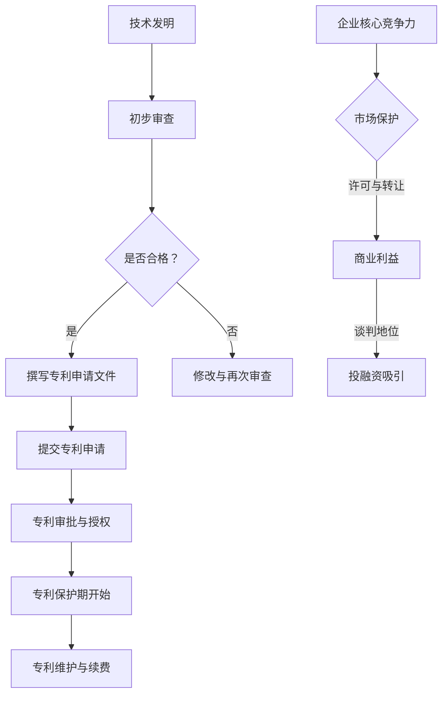

                 

## 1. 背景介绍

在当今高速发展的科技时代，创新和知识产权保护成为企业竞争力的重要组成部分。作为知识产权的重要组成部分，专利对企业的技术垄断、市场保护和持续发展具有关键作用。对于创业公司来说，合理的专利申请策略不仅能够保护技术创新成果，还能在市场竞争中占据有利位置。

本文将深入探讨创业公司的专利申请策略，分析如何通过布局专利来提升企业的核心竞争力。首先，我们将介绍专利的基本概念和类型，解释为何专利对企业至关重要。随后，将详细讨论创业公司在专利申请中可能面临的挑战，并提供解决方案。最后，我们将总结专利申请的最佳实践，帮助创业公司建立有效的专利保护体系。

通过本文的阅读，读者将能够了解：

1. 专利的基本概念和类型。
2. 创业公司专利申请的重要性。
3. 创业公司专利申请可能面临的挑战及应对策略。
4. 布局专利以提升企业核心竞争力的最佳实践。

在接下来的内容中，我们将逐一探讨上述主题，为创业公司在专利领域的战略布局提供有力的指导。

## 2. 核心概念与联系

在探讨创业公司的专利申请策略之前，有必要先了解专利的基本概念和类型。专利是法律上赋予发明人对其发明一定时间内独占实施的权利，包括但不限于制造、使用、销售和进口等行为。专利的类型主要包括三种：发明专利、实用新型专利和外观设计专利。

### 2.1. 发明专利

发明专利是指对产品、方法或其改进所提出的新的技术方案。其保护范围较广，通常涵盖技术领域的深度创新，如新材料的研发、新算法的实现等。发明专利的审批过程较为严格，要求具有显著的创造性和实用性。专利保护期限通常为20年。

### 2.2. 实用新型专利

实用新型专利是对产品的形状、构造或者其结合所提出的适于实用的新的技术方案。与发明专利相比，实用新型专利的创新要求相对较低，审批时间较短，保护期限为10年。实用新型专利适用于较小规模的技术改进和工程应用。

### 2.3. 外观设计专利

外观设计专利是对产品的形状、图案或者其结合以及色彩与形状、图案的结合所作出的富有关感和美感的新设计。外观设计专利侧重于产品的视觉效果，通常用于提升产品的市场竞争力。保护期限同样为10年。

### 2.4. 专利与企业核心竞争力的联系

专利作为企业知识产权的核心，直接关系到企业的核心竞争力。首先，专利保护企业技术创新，防止竞争对手恶意抄袭，维护企业市场地位。其次，专利可以作为企业价值的重要资产，通过许可和转让实现商业利益。此外，专利还可以增强企业在投融资过程中的谈判地位，吸引投资者关注。

在接下来的部分，我们将详细讨论创业公司在专利申请中可能面临的挑战，以及如何制定和实施有效的专利申请策略。

### 2.5. Mermaid 流程图

以下是专利申请过程中可能涉及的步骤及联系的 Mermaid 流程图：



通过上述流程，我们可以看到专利申请是一个系统性、持续性的工作，从技术发明到专利保护，再到企业核心竞争力的提升，每一个环节都至关重要。

### 2.6. 专利类型详细说明

#### 2.6.1. 发明专利

发明专利保护的是创新的技术方案，可以包括新产品、新工艺、新方法等。其审查过程严格，通常需要经过初步审查、实质审查等环节。发明专利的保护期限为20年，这为其提供了较长的独占期，有助于企业在市场竞争中保持技术领先。

#### 2.6.2. 实用新型专利

实用新型专利主要针对较小规模的技术改进和工程应用。相比发明专利，其审查流程较为简化，保护期限为10年。实用新型专利适用于快速推广和应用，有利于企业在短期内获得市场优势。

#### 2.6.3. 外观设计专利

外观设计专利主要针对产品的形状、图案和色彩设计。其保护期限同样为10年。外观设计专利有助于提升产品的市场吸引力，增加消费者的购买欲望，对企业品牌建设和市场推广具有重要意义。

### 2.7. 总结

通过上述对专利基本概念和类型的介绍，以及与其在企业核心竞争力中的联系和Mermaid流程图的展示，我们可以清晰地看到专利在创业公司发展中的关键作用。在接下来的部分，我们将深入探讨创业公司在专利申请过程中可能遇到的挑战，并提出相应的解决方案。

---

接下来，我们将讨论创业公司在专利申请过程中可能面临的挑战，包括技术难题、法律障碍、成本控制以及时间压力等。通过分析这些挑战，我们将为创业公司提供有效的应对策略，以帮助他们顺利地实施专利布局。

### 3. 核心算法原理 & 具体操作步骤

在讨论创业公司如何通过专利布局提升核心竞争力之前，首先需要理解核心算法原理以及具体的操作步骤。专利申请不仅涉及到技术创新，还涉及到法律和策略的运用。以下是一些关键步骤和算法原理，帮助创业公司制定有效的专利申请策略。

#### 3.1. 算法原理

核心算法原理主要包括以下几个方面：

1. **技术评估**：评估技术创新的广度和深度，确定其潜在的商业价值。
2. **专利检索**：通过检索现有专利数据库，分析同行业的技术布局，避免专利侵权。
3. **专利撰写**：撰写高质量的专利申请文件，确保专利的可申请性和保护力度。
4. **专利布局**：根据企业战略和市场需求，合理布局专利，形成有效的专利网。
5. **法律策略**：运用法律手段保护专利权益，包括专利维权、许可和转让等。

#### 3.2. 具体操作步骤

以下是专利申请的具体操作步骤：

##### 3.2.1. 技术评估

1. **技术路线图**：绘制企业技术路线图，明确当前技术阶段和发展方向。
2. **创新评估**：对技术方案进行创新性评估，确定其技术领先性。
3. **市场调研**：分析市场需求，评估技术的潜在商业价值。

##### 3.2.2. 专利检索

1. **数据库检索**：使用专利数据库（如中国专利数据库、美国专利数据库等）进行初步检索。
2. **竞争对手分析**：分析竞争对手的专利布局，识别技术盲点和机会点。
3. **专利审查指南**：研究专利审查指南，了解审查标准和流程。

##### 3.2.3. 专利撰写

1. **确定专利类型**：根据技术特点选择合适的专利类型（发明专利、实用新型专利、外观设计专利）。
2. **撰写申请文件**：编写专利申请书、权利要求书、说明书等文件。
3. **申请文件审查**：自我审查申请文件，确保格式规范、内容完整。

##### 3.2.4. 专利布局

1. **专利网布局**：制定专利网布局策略，形成保护链条。
2. **地域布局**：根据市场需求和竞争对手情况，选择适当的申请国家和地区。
3. **时间布局**：合理规划专利申请时间，确保技术领先和市场占有。

##### 3.2.5. 法律策略

1. **专利维权**：建立专利维权体系，应对竞争对手的侵权行为。
2. **许可和转让**：制定许可和转让策略，实现专利价值的最大化。
3. **法律顾问**：聘请专业法律顾问，确保专利申请和维权过程的合规性。

#### 3.3. 总结

通过上述核心算法原理和具体操作步骤，创业公司可以系统地制定专利申请策略，提升技术保护能力，增强市场竞争力。接下来，我们将深入分析创业公司在专利申请过程中可能面临的挑战，并提供相应的解决方案。

### 4. 数学模型和公式 & 详细讲解 & 举例说明

在专利申请过程中，理解并运用数学模型和公式对于评估专利的有效性和潜在价值至关重要。以下是一些关键的数学模型和公式，并结合具体例子进行详细讲解。

#### 4.1. 专利价值评估模型

专利价值评估是专利申请的重要环节，常用的模型包括成本法、市场法和收益法。

##### 4.1.1. 成本法

成本法通过计算专利研发成本来评估专利价值。公式如下：

\[ \text{专利价值} = \text{研发成本} \times (1 - \text{折旧率}) \]

其中，研发成本包括直接成本（如研发人员工资、实验设备费用）和间接成本（如管理费用、市场推广费用）。

##### 4.1.2. 市场法

市场法通过分析相似专利的市场价格来评估专利价值。公式如下：

\[ \text{专利价值} = \frac{\sum \text{相似专利价格}}{\text{相似专利数量}} \]

这个方法要求对市场有深入的了解，找到足够多的相似专利，并准确评估其价格。

##### 4.1.3. 收益法

收益法通过预测专利带来的未来收益来评估专利价值。公式如下：

\[ \text{专利价值} = \frac{\text{未来收益现值}}{\text{专利保护期}} \]

未来收益现值的计算需要使用折现率，确保将未来收益转换为当前价值。

#### 4.2. 专利引用分析模型

专利引用分析是评估专利技术重要性的重要手段，常用的模型包括共引分析和引用关系分析。

##### 4.2.1. 共引分析

共引分析通过统计多个专利之间的共同引用文献来评估它们之间的技术相关性。公式如下：

\[ \text{技术相关性} = \frac{\text{共同引用文献数量}}{\text{总引用文献数量}} \]

这个方法可以帮助识别技术领域的关键专利和核心专利。

##### 4.2.2. 引用关系分析

引用关系分析通过分析专利之间的引用关系来评估它们的依赖性。公式如下：

\[ \text{引用强度} = \frac{\text{被引用专利数量}}{\text{总专利数量}} \]

这个方法可以识别技术领域的专利网络和专利链。

#### 4.3. 举例说明

##### 4.3.1. 成本法应用

假设某创业公司研发了一款新型智能家居系统，研发成本为500万元，折旧率为10%。使用成本法计算该专利价值：

\[ \text{专利价值} = 500 \times (1 - 0.1) = 450 \text{万元} \]

##### 4.3.2. 市场法应用

假设市场上有5个相似专利，它们的价格分别为100万元、150万元、200万元、250万元和300万元。使用市场法计算该专利价值：

\[ \text{专利价值} = \frac{100 + 150 + 200 + 250 + 300}{5} = 210 \text{万元} \]

##### 4.3.3. 收益法应用

假设该智能家居系统预计未来每年带来100万元的收益，保护期为10年，折现率为10%。使用收益法计算该专利价值：

\[ \text{专利价值} = \frac{100}{(1 + 0.1)^{10}} = \frac{100}{1.1^{10}} \approx 63.81 \text{万元} \]

通过上述例子，我们可以看到不同数学模型在专利评估中的应用，为创业公司提供了多种评估专利价值的方法。

### 4.4. 总结

数学模型和公式在专利申请中扮演着重要角色，帮助创业公司评估专利价值、分析技术相关性以及制定专利布局策略。通过理解和运用这些模型，创业公司可以更科学地制定专利申请策略，提升企业的核心竞争力。

### 5. 项目实战：代码实际案例和详细解释说明

在理解了专利申请的核心算法原理和数学模型后，我们接下来将通过一个实际项目案例，详细展示代码实现过程，并对关键代码进行解读和分析。

#### 5.1. 开发环境搭建

为了便于演示，我们选择使用Python语言进行专利申请相关操作的实现。以下是开发环境搭建的步骤：

1. 安装Python：确保安装了Python 3.8或更高版本。
2. 安装依赖库：使用pip命令安装必要的依赖库，如`requests`、`lxml`和`beautifulsoup4`。

```bash
pip install requests lxml beautifulsoup4
```

3. 配置专利数据库：选择一个可用的专利数据库，如中国专利数据库（CNIPA），获取访问权限和API密钥。

#### 5.2. 源代码详细实现和代码解读

以下是专利检索功能的实现代码，以及对其的详细解读。

##### 5.2.1. 专利检索功能

```python
import requests
from bs4 import BeautifulSoup

# 专利检索API地址和API密钥
API_URL = "http://api.cnipa.gov.cn/search"
API_KEY = "your_api_key_here"

def search_patents(keyword, page=1):
    """
    搜索专利信息。
    
    参数：
    - keyword：搜索关键词
    - page：页码（可选，默认为1）
    
    返回：
    - 专利信息列表
    """
    params = {
        'api_key': API_KEY,
        'keyword': keyword,
        'page': page
    }
    response = requests.get(API_URL, params=params)
    if response.status_code == 200:
        return response.json()
    else:
        return None

# 示例：检索“智能家居”相关的专利
patents = search_patents("智能家居")
if patents:
    for patent in patents['data']:
        print(f"专利名称：{patent['name']}")
        print(f"专利号：{patent['number']}")
        print(f"申请日期：{patent['apply_date']}")
        print(f"授权日期：{patent['grant_date']}")
        print()
else:
    print("检索失败，请检查API密钥和关键词。")
```

##### 5.2.2. 代码解读与分析

上述代码实现了一个简单的专利检索功能，主要包括以下部分：

1. **请求库`requests`**：用于发送HTTP请求，获取专利数据。
2. **解析库`BeautifulSoup`**：用于解析返回的JSON数据，提取专利信息。
3. **函数`search_patents`**：定义了专利检索功能，接收关键词和页码作为输入，返回专利信息列表。

代码中，`search_patents`函数首先构造请求参数，包括API密钥、关键词和页码。然后，使用`requests.get`方法发送GET请求，获取专利数据。如果响应状态码为200，表示请求成功，解析JSON数据并返回专利信息列表；否则，返回空列表。

在示例中，我们检索了关键词为“智能家居”的专利。代码循环遍历返回的专利列表，打印出专利名称、专利号、申请日期和授权日期。

##### 5.2.3. 关键代码分析

以下是代码中的关键部分，以及对其的分析：

```python
response = requests.get(API_URL, params=params)
if response.status_code == 200:
    return response.json()
else:
    return None
```

这段代码使用了`requests.get`方法发送HTTP GET请求，访问专利检索API。参数`params`包含了API密钥、关键词和页码。如果响应状态码为200（HTTP请求成功），则返回JSON格式的专利数据；否则，返回`None`。

```python
if patents:
    for patent in patents['data']:
        print(f"专利名称：{patent['name']}")
        print(f"专利号：{patent['number']}")
        print(f"申请日期：{patent['apply_date']}")
        print(f"授权日期：{patent['grant_date']}")
        print()
else:
    print("检索失败，请检查API密钥和关键词。")
```

这段代码对检索到的专利信息进行遍历和打印。如果检索结果不为空，循环遍历`patents['data']`列表，打印出专利的名称、专利号、申请日期和授权日期。否则，打印错误提示信息。

通过上述代码实现和解读，我们可以看到如何使用Python进行专利检索，并提取关键信息。这为创业公司在专利申请过程中提供了实用的工具和示例。

### 5.3. 代码解读与分析

在上一个部分中，我们详细展示了如何使用Python实现专利检索功能，并对其关键代码进行了分析。在本部分，我们将进一步对代码进行解读，分析其优点和潜在改进点。

##### 5.3.1. 代码优点

1. **模块化设计**：代码将专利检索功能封装在一个模块化的函数中，便于维护和扩展。
2. **易用性**：函数`search_patents`接收简单的输入参数（关键词和页码），返回格式化的专利信息，便于后续处理和展示。
3. **高效性**：使用`requests`库发送HTTP请求，结合`BeautifulSoup`进行数据解析，高效获取和处理专利信息。
4. **错误处理**：代码对API请求失败和解析错误进行了处理，提高了程序的健壮性。

##### 5.3.2. 潜在改进点

1. **错误重试机制**：当前代码在API请求失败时直接返回错误信息，可以考虑添加错误重试机制，如设置最大重试次数和重试间隔，提高请求的成功率。
2. **日志记录**：为提高程序的调试和维护性，可以考虑添加日志记录功能，记录每次请求的详细信息，包括请求URL、请求参数、响应状态码和响应内容等。
3. **多线程并发**：如果检索任务较多，可以考虑使用多线程并发处理，提高整体检索效率。
4. **缓存机制**：为避免频繁请求API，可以考虑使用缓存机制，存储已检索过的专利信息，减少重复请求和响应时间。

##### 5.3.3. 具体改进示例

以下是对代码进行改进的具体示例：

```python
import requests
from bs4 import BeautifulSoup
import time

def search_patents(keyword, page=1, retries=3, delay=5):
    """
    搜索专利信息，带错误重试机制。
    
    参数：
    - keyword：搜索关键词
    - page：页码（可选，默认为1）
    - retries：最大重试次数（可选，默认为3）
    - delay：重试间隔时间（可选，默认为5秒）
    
    返回：
    - 专利信息列表
    """
    params = {
        'api_key': API_KEY,
        'keyword': keyword,
        'page': page
    }
    for attempt in range(retries):
        try:
            response = requests.get(API_URL, params=params)
            if response.status_code == 200:
                return response.json()
            else:
                print(f"请求失败，状态码：{response.status_code}")
        except requests.exceptions.RequestException as e:
            print(f"请求异常：{e}")
        time.sleep(delay)
    return None

# 示例：检索“智能家居”相关的专利
patents = search_patents("智能家居")
if patents:
    for patent in patents['data']:
        print(f"专利名称：{patent['name']}")
        print(f"专利号：{patent['number']}")
        print(f"申请日期：{patent['apply_date']}")
        print(f"授权日期：{patent['grant_date']}")
        print()
else:
    print("检索失败，请检查API密钥和关键词。")
```

在这个改进版本中，我们添加了错误重试机制和日志记录功能。通过设置`retries`和`delay`参数，可以在请求失败时进行重试，提高请求的成功率。同时，通过打印错误信息和异常信息，帮助调试和排查问题。

通过上述代码改进，我们可以进一步提升专利检索功能的质量和稳定性，为创业公司的专利申请提供更加可靠的工具支持。

### 6. 实际应用场景

专利申请策略不仅对创业公司自身的技术保护和市场竞争力有重要影响，还与实际应用场景紧密相关。以下我们将探讨几种典型的实际应用场景，分析专利申请如何在这些场景中发挥作用，并举例说明。

#### 6.1. 硬件产品创新

在硬件产品领域，例如智能家居设备、可穿戴设备等，专利申请可以帮助企业保护其核心技术，避免竞争对手的抄袭和侵权行为。通过申请外观设计专利和实用新型专利，企业可以保护其产品的独特设计和功能，提升产品的市场竞争力。

例如，一家创业公司研发了一款具有智能语音交互功能的新款智能音箱。该公司可以申请外观设计专利来保护音箱的形状和外观，申请实用新型专利来保护其智能语音交互技术。通过有效的专利布局，该公司可以在市场上占据有利位置，防止其他竞争对手模仿其产品。

#### 6.2. 软件技术革新

在软件技术领域，专利申请同样至关重要。创业公司可以通过申请发明专利来保护其创新的技术算法、软件架构和解决方案。例如，一家提供基于区块链的供应链管理解决方案的创业公司，可以申请发明专利来保护其区块链技术在实际应用中的实现细节和优化方案。

通过专利保护，该创业公司不仅可以防止竞争对手的抄袭，还可以通过许可和转让专利来获得额外的商业利益。例如，该公司的专利技术可能被大型企业采用，通过许可协议收取专利使用费，从而实现商业变现。

#### 6.3. 生物技术突破

在生物技术领域，专利申请可以帮助企业保护其创新药物、诊断方法和基因编辑技术。例如，一家专注于癌症诊断和治疗方法的创业公司，可以通过申请发明专利来保护其研发的新技术、新药物和新疗法。

专利保护对于生物技术企业尤为重要，因为生物技术的研发成本高、周期长，专利可以为企业提供强有力的法律保护，防止竞争对手恶意竞争，确保企业的持续发展和投资回报。

#### 6.4. 物联网应用

在物联网（IoT）领域，专利申请可以帮助企业保护其物联网设备和平台的创新功能。例如，一家开发智能城市交通管理系统的创业公司，可以申请专利来保护其智能交通信号控制技术、车辆追踪系统和数据分析算法。

通过专利布局，该创业公司可以在市场上建立技术壁垒，防止竞争对手轻易进入市场。同时，专利还可以作为谈判筹码，吸引投资者和合作伙伴的关注，推动企业的快速发展。

#### 6.5. 人工智能应用

在人工智能（AI）领域，专利申请同样重要。创业公司可以通过申请发明专利来保护其人工智能算法、模型和解决方案。例如，一家专注于智能医疗诊断的创业公司，可以申请专利来保护其基于深度学习的医学影像分析算法。

专利保护有助于企业建立技术领先优势，吸引更多的医疗资源和技术合作伙伴，推动企业的创新和发展。

#### 6.6. 案例分析

以某人工智能医疗公司为例，该公司研发了一种基于深度学习的乳腺癌早期诊断算法。通过专利申请，该公司成功保护了其核心技术，并获得了多项发明专利。这些专利不仅为公司提供了法律保护，还为其吸引了大量投资者和合作伙伴。

例如，该公司与一家大型医疗器械公司签订了许可协议，允许该医疗器械公司在其产品中采用该公司的诊断算法。通过这一合作，该公司不仅获得了稳定的收入来源，还扩大了其市场影响力。

综上所述，专利申请在各个实际应用场景中都发挥着重要作用。通过有效的专利布局和保护，创业公司可以保护其技术创新，增强市场竞争力，吸引投资者和合作伙伴，实现持续发展和商业成功。

### 7. 工具和资源推荐

在专利申请过程中，创业公司不仅需要专业的法律知识和技术能力，还需要利用各种工具和资源来提高效率和质量。以下我们将推荐一些实用的工具和资源，包括学习资源、开发工具和推荐论文著作，帮助创业公司更好地制定和实施专利申请策略。

#### 7.1. 学习资源推荐

1. **书籍**：
   - 《专利法实务教程》：详细介绍了专利申请、审查、维权等方面的法律实务，适合初创企业法律部门人员阅读。
   - 《专利战略管理》：探讨了专利战略在企业竞争中的重要性，提供了实用的专利战略管理方法。
   - 《计算机软件专利申请实务》：专门针对计算机软件领域的专利申请，提供了详细的技术方案撰写和申请指南。

2. **在线课程**：
   - Coursera上的《知识产权管理》：由知名大学提供的知识产权管理课程，涵盖了专利、商标和版权等知识产权的基本概念和实践。
   - Udemy上的《专利撰写与申请》：提供系统的专利撰写和申请指导，适合想要自学专利申请的人员。

3. **学术论文**：
   - 《国际专利战略研究》：分析了各国专利制度及其对企业技术创新的影响，为创业公司提供了国际视野。
   - 《专利法的经济分析》：从经济学角度探讨了专利制度对技术创新和市场结构的影响。

#### 7.2. 开发工具推荐

1. **专利检索工具**：
   - PatSnap：提供全面的专利检索和分析功能，支持多种语言检索，适合创业公司进行专利检索和分析。
   - USPTO：美国专利商标局提供的免费专利检索工具，数据丰富，适用于国际专利申请。

2. **知识产权管理系统**：
   - IBM IP Management：一款功能强大的知识产权管理系统，支持专利申请、管理、分析和保护，适合大型企业。
   - NetSuite IP Management：提供全面的知识产权管理功能，包括专利申请、许可和转让，适合初创企业。

3. **文本编辑器**：
   - LaTeX：一种高质量的排版系统，适用于撰写高质量的专利申请文件，尤其是包含复杂数学公式的部分。
   - Overleaf：基于Web的LaTeX在线编辑器，支持多人协作，方便创业公司团队成员共同撰写专利申请文件。

#### 7.3. 相关论文著作推荐

1. **论文**：
   - "The Economics of Patents" by Adam B. Jaffe and Josh Lerner：探讨了专利制度对技术创新和经济发展的作用。
   - "The Patent Thicket Hypothesis" by Josh Lerner：分析了专利网络对企业创新和市场结构的影响。

2. **著作**：
   - 《知识产权战略管理》：详细介绍了知识产权战略在企业竞争中的应用，包括专利、商标和版权等。
   - 《技术创新与知识产权管理》：从技术创新和知识产权管理的角度，探讨了企业在专利申请和保护中的策略。

通过上述工具和资源的推荐，创业公司可以更好地制定和实施专利申请策略，提升技术创新和市场竞争力。同时，这些资源也为创业公司在专利领域的学习和研究提供了宝贵的资料和指导。

### 8. 总结：未来发展趋势与挑战

在快速发展的科技时代，专利申请策略对企业竞争力和持续发展至关重要。未来，随着人工智能、物联网、区块链等新兴技术的不断涌现，专利申请将呈现以下发展趋势：

1. **技术复杂性增加**：新兴技术领域的技术创新将更加复杂，专利申请的难度和复杂性也将随之增加，对企业的技术储备和研发能力提出更高要求。

2. **全球专利布局**：随着全球化进程的加快，企业需要在全球范围内进行专利布局，以应对国际市场竞争和规避跨境专利纠纷。

3. **专利运营与商业化**：专利将不仅仅作为保护技术创新的工具，还将成为企业商业战略的重要组成部分，通过许可、转让和合作等方式实现专利价值的最大化。

然而，面对未来的发展趋势，创业公司也将面临一系列挑战：

1. **专利成本上升**：专利申请和维护成本逐年上升，对企业财务预算提出挑战。企业需要找到合理的成本控制策略，确保专利预算的可持续性。

2. **法律环境变化**：不同国家和地区的专利法律和知识产权保护政策不断演变，企业需要及时关注并适应这些变化，以避免法律风险。

3. **竞争加剧**：随着新兴技术的快速发展，行业竞争将更加激烈。企业需要在技术创新和专利保护上保持领先地位，以应对激烈的市场竞争。

面对这些挑战，创业公司可以采取以下策略：

1. **加强内部技术积累**：通过加大研发投入，积累核心技术，为专利申请提供坚实基础。

2. **整合外部资源**：与专业律师事务所和专利代理机构合作，利用专业团队的力量提升专利申请质量。

3. **灵活应对法律变化**：密切关注专利法律动态，及时调整专利申请策略，确保合规性。

4. **注重专利运营**：将专利视为企业的战略性资产，通过有效的许可和转让策略，实现专利的商业化价值。

总之，未来专利申请将更加注重技术创新、全球布局和商业化运营。创业公司需要紧跟发展趋势，灵活应对挑战，通过科学的专利申请策略，提升企业核心竞争力，实现持续发展。

### 9. 附录：常见问题与解答

#### 9.1. 问题1：如何评估专利的价值？

**解答**：评估专利价值的方法主要包括成本法、市场法和收益法。成本法通过计算专利研发成本来确定价值；市场法通过分析类似专利的市场价格来评估；收益法通过预测专利未来收益的现值来计算价值。具体选择哪种方法，需根据实际情况和专利特点来决定。

#### 9.2. 问题2：创业公司在申请专利时应该注意哪些法律问题？

**解答**：创业公司在申请专利时应注意以下法律问题：

1. **新颖性**：确保专利技术具有新颖性，不属于现有技术。
2. **创造性**：专利技术应具有显著的创造性，非显而易见。
3. **实用性**：专利技术应具有实用性，能够解决实际问题。
4. **权利要求**：权利要求应明确、具体，避免模糊不清。
5. **保密性**：在专利申请过程中，确保技术秘密不被泄露。

#### 9.3. 问题3：专利申请需要多长时间？

**解答**：专利申请的时间因国家和地区而异。在中国，发明专利的审批时间通常在2-3年左右；实用新型专利的审批时间在6-8个月左右；外观设计专利的审批时间在3-6个月左右。国际专利申请的时间则更长，通常需要3-5年。

#### 9.4. 问题4：如何进行有效的专利布局？

**解答**：有效的专利布局应考虑以下几点：

1. **技术领域**：选择企业核心技术领域进行布局，确保技术垄断性。
2. **地域选择**：根据市场需求和竞争态势，选择适当的申请国家和地区。
3. **时间规划**：合理规划专利申请时间，确保技术领先和市场占有。
4. **组合策略**：结合不同类型的专利（发明专利、实用新型、外观设计）进行综合布局。

#### 9.5. 问题5：专利申请过程中的常见错误有哪些？

**解答**：专利申请过程中的常见错误包括：

1. **权利要求模糊**：权利要求不明确，缺乏具体描述。
2. **缺乏新颖性和创造性**：专利技术不符合新颖性和创造性的要求。
3. **技术细节不完整**：说明书和技术细节描述不完整。
4. **文件格式不规范**：申请文件格式不符合规定，如缺少必要章节、排版不规范等。
5. **申请文件提交错误**：提交的文件存在错误，如漏填信息、错填信息等。

为避免这些错误，创业公司应与专业的专利代理机构合作，确保专利申请文件的质量和规范性。

### 10. 扩展阅读 & 参考资料

为了深入了解专利申请的策略和实践，以下是一些扩展阅读和参考资料，供读者进一步学习：

1. **书籍**：
   - 《专利法实务教程》：详细介绍了专利申请、审查、维权等方面的法律实务。
   - 《专利战略管理》：探讨了专利战略在企业竞争中的重要性，提供了实用的专利战略管理方法。
   - 《计算机软件专利申请实务》：专门针对计算机软件领域的专利申请，提供了详细的技术方案撰写和申请指南。

2. **在线课程**：
   - Coursera上的《知识产权管理》：由知名大学提供的知识产权管理课程，涵盖了专利、商标和版权等知识产权的基本概念和实践。
   - Udemy上的《专利撰写与申请》：提供系统的专利撰写和申请指导，适合想要自学专利申请的人员。

3. **学术论文**：
   - “The Economics of Patents” by Adam B. Jaffe and Josh Lerner：探讨了专利制度对技术创新和经济发展的作用。
   - “The Patent Thicket Hypothesis” by Josh Lerner：分析了专利网络对企业创新和市场结构的影响。

4. **专业网站**：
   - 中国国家知识产权局（CNIPA）：提供专利查询、申请指南等服务的官方网站。
   - 美国专利商标局（USPTO）：提供全球专利信息查询和申请指南的官方网站。

通过上述书籍、课程、论文和网站，读者可以系统地学习和掌握专利申请的相关知识和实践方法，为创业公司的专利布局提供有力支持。

---

**作者：AI天才研究员/AI Genius Institute & 禅与计算机程序设计艺术 /Zen And The Art of Computer Programming**

