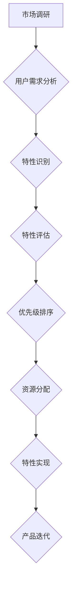

                 

# 创业公司的产品特性优先级管理方法

> 关键词：产品特性、优先级管理、创业公司、敏捷开发、价值驱动、用户体验、资源分配

摘要：本文旨在探讨创业公司如何通过有效的产品特性优先级管理，确保资源的最优配置，推动产品的快速迭代和市场推广。文章将详细分析产品特性的概念、评估方法、优先级排序策略，并结合实际案例，探讨创业公司在不同发展阶段的特性管理实践。

## 1. 背景介绍

在快速变化的市场环境中，创业公司面临着诸多挑战，其中之一是如何在资源有限的情况下，将产品特性进行有效管理，以满足市场需求和用户期望。产品特性优先级管理是一种系统化的方法，可以帮助创业公司识别、评估和排序产品特性，从而确保开发和推广的重点放在最具价值和潜力的特性上。

### 1.1 创业公司的特点

创业公司通常具有以下几个特点：

- **资源有限**：相较于大型企业，创业公司的资金、人力和技术资源通常较为有限。
- **市场不确定性**：创业公司面临的市场环境往往充满不确定性，需要快速适应市场变化。
- **创新驱动**：创业公司的成功往往依赖于持续的创新，以满足用户需求和市场机遇。
- **敏捷性**：创业公司通常具有高度的敏捷性，能够快速响应市场变化，调整产品方向。

### 1.2 产品特性管理的必要性

在创业公司中，产品特性管理至关重要，原因如下：

- **确保资源优化配置**：通过优先级管理，创业公司可以确保有限的资源被投入到最具价值和潜力的特性上。
- **提高市场竞争力**：优先级管理有助于创业公司识别并专注于关键特性，从而提高产品的市场竞争力。
- **满足用户需求**：有效的特性管理有助于确保产品能够满足用户的核心需求，提高用户体验。

## 2. 核心概念与联系

### 2.1 产品特性

产品特性是指产品所具备的功能、特性或特征，它是产品设计和开发的基础。产品特性可以按不同的维度进行分类，如按功能、用户体验、技术实现等。

### 2.2 优先级排序策略

优先级排序策略是指用于确定产品特性优先级的方法。常见的排序策略包括：

- **价值驱动排序**：根据特性的市场价值和用户需求进行排序。
- **敏捷开发排序**：根据迭代周期和团队的能力进行排序。
- **资源限制排序**：根据资源的可用性进行排序。

### 2.3 Mermaid 流程图

以下是一个简化的产品特性优先级管理流程的 Mermaid 图：



## 3. 核心算法原理 & 具体操作步骤

### 3.1 用户需求分析

用户需求分析是产品特性管理的基础，其目的是了解用户需求，为特性识别提供依据。具体步骤如下：

1. **收集用户需求**：通过调查问卷、用户访谈、用户行为分析等方式收集用户需求。
2. **整理用户需求**：将收集到的需求进行分类、归纳，形成需求清单。
3. **分析需求**：对需求进行分析，确定其重要性和紧急性。

### 3.2 特性识别

特性识别是指从用户需求中提取出具体的产品特性。具体步骤如下：

1. **映射需求与特性**：将用户需求与产品特性进行映射，形成特性清单。
2. **评估特性**：对特性进行初步评估，确定其可行性和重要性。
3. **优化特性**：根据评估结果，对特性进行优化和调整。

### 3.3 特性评估

特性评估是指对识别出的产品特性进行全面的评估，以确定其优先级。具体步骤如下：

1. **确定评估指标**：根据公司目标和市场需求，确定评估指标，如市场价值、技术难度、用户满意度等。
2. **数据收集**：收集与评估指标相关的数据，如市场调研报告、技术文档、用户反馈等。
3. **评估特性**：根据评估指标，对特性进行评分和排序。

### 3.4 优先级排序

优先级排序是指根据特性评估结果，确定特性的优先级。具体步骤如下：

1. **确定排序策略**：选择合适的排序策略，如价值驱动排序、敏捷开发排序等。
2. **排序特性**：根据排序策略，对特性进行排序。
3. **调整排序**：根据实际情况，对排序结果进行微调。

### 3.5 资源分配

资源分配是指根据特性优先级，确定资源的分配策略。具体步骤如下：

1. **确定资源限制**：根据公司资源情况，确定资源限制。
2. **分配资源**：根据特性优先级，分配资源，确保高优先级特性得到优先开发。
3. **调整资源分配**：根据项目进展和资源变化，调整资源分配。

### 3.6 特性实现

特性实现是指根据资源分配，进行产品特性的开发和实现。具体步骤如下：

1. **制定开发计划**：根据特性优先级和资源情况，制定开发计划。
2. **分配任务**：将任务分配给团队成员，确保任务明确、责任到人。
3. **执行开发**：按照开发计划，执行特性开发。
4. **测试与反馈**：对开发完成的特性进行测试，收集用户反馈，确保特性符合预期。

### 3.7 产品迭代

产品迭代是指根据特性实现和用户反馈，对产品进行持续改进和优化。具体步骤如下：

1. **收集反馈**：收集用户对特性的反馈，包括优点、不足和改进建议。
2. **分析反馈**：对反馈进行分析，确定改进方向。
3. **实施改进**：根据分析结果，对产品进行改进。
4. **迭代发布**：将改进后的产品发布，继续收集用户反馈，形成迭代循环。

## 4. 数学模型和公式 & 详细讲解 & 举例说明

### 4.1 用户满意度模型

用户满意度模型是一个用于评估产品特性用户满意度的数学模型。其公式如下：

$$
S = \frac{1}{N} \sum_{i=1}^{N} w_i \cdot s_i
$$

其中：

- $S$ 表示用户满意度。
- $N$ 表示特性的数量。
- $w_i$ 表示特性 $i$ 的权重。
- $s_i$ 表示用户对特性 $i$ 的满意度评分。

### 4.2 优先级排序公式

优先级排序公式是一个用于确定产品特性优先级的数学模型。其公式如下：

$$
P_i = \frac{V_i \cdot D_i}{C_i}
$$

其中：

- $P_i$ 表示特性 $i$ 的优先级。
- $V_i$ 表示特性 $i$ 的市场价值。
- $D_i$ 表示特性 $i$ 的开发难度。
- $C_i$ 表示特性 $i$ 的成本。

### 4.3 实际案例说明

假设创业公司计划开发一个在线教育平台，以下是一个简化的产品特性优先级管理案例。

**步骤 1：用户需求分析**

通过市场调研和用户访谈，收集到以下用户需求：

- **需求 1**：提供多种课程分类，方便用户查找。
- **需求 2**：实现实时互动课堂，提高学习体验。
- **需求 3**：提供在线作业和考试功能，便于教学管理。

**步骤 2：特性识别**

根据用户需求，识别出以下产品特性：

- **特性 1**：课程分类功能。
- **特性 2**：实时互动课堂。
- **特性 3**：在线作业和考试功能。

**步骤 3：特性评估**

根据市场价值、开发难度和成本，对特性进行评估，得到以下评分：

- **特性 1**：市场价值 90，开发难度 60，成本 80。
- **特性 2**：市场价值 100，开发难度 80，成本 100。
- **特性 3**：市场价值 70，开发难度 50，成本 50。

**步骤 4：优先级排序**

根据优先级排序公式，计算每个特性的优先级：

- **特性 1**：优先级 = $\frac{90 \cdot 60}{80} = 67.5$。
- **特性 2**：优先级 = $\frac{100 \cdot 80}{100} = 80$。
- **特性 3**：优先级 = $\frac{70 \cdot 50}{50} = 70$。

根据计算结果，特性 2 的优先级最高，特性 1 次之，特性 3 最低。

**步骤 5：资源分配**

根据特性优先级，分配资源：

- **特性 2**：优先开发。
- **特性 1**：次优先开发。
- **特性 3**：后续开发。

## 5. 项目实战：代码实际案例和详细解释说明

### 5.1 开发环境搭建

在本节中，我们将搭建一个简单的在线教育平台，用于演示产品特性优先级管理的方法。以下是一个简化的开发环境搭建步骤：

1. **选择技术栈**：选择适用于在线教育平台的编程语言和框架，如 Python 和 Flask。
2. **搭建开发环境**：在本地计算机上安装 Python 和 Flask，创建项目文件夹和虚拟环境。
3. **配置数据库**：选择合适的数据库，如 SQLite，用于存储课程信息和用户数据。

### 5.2 源代码详细实现和代码解读

在本节中，我们将实现在线教育平台的核心功能，包括课程分类、实时互动课堂和在线作业功能。以下是一个简化的代码实现示例：

```python
# 课程分类功能
@app.route('/courses')
def list_courses():
    courses = Course.query.all()
    return render_template('courses.html', courses=courses)

# 实时互动课堂功能
@app.route('/classroom/<course_id>')
def classroom(course_id):
    course = Course.query.get(course_id)
    return render_template('classroom.html', course=course)

# 在线作业功能
@app.route('/homework/<course_id>')
def homework(course_id):
    course = Course.query.get(course_id)
    return render_template('homework.html', course=course)
```

以上代码实现了课程分类、实时互动课堂和在线作业功能的基本框架。在具体实现过程中，还需要添加数据库模型、视图函数和模板文件等。

### 5.3 代码解读与分析

在本节中，我们将对代码实现进行解读和分析，解释每个功能的作用和实现原理。

1. **课程分类功能**：

课程分类功能用于展示所有课程，方便用户查找。通过 `list_courses()` 函数，从数据库中查询所有课程，并返回一个包含课程信息的列表。在模板文件 `courses.html` 中，遍历课程列表，为每个课程生成一个链接，用户可以通过链接访问具体课程页面。

2. **实时互动课堂功能**：

实时互动课堂功能用于实现教师和学生之间的实时互动。通过 `classroom()` 函数，根据课程 ID 查询课程信息，并返回一个包含课程信息和互动功能的页面。在模板文件 `classroom.html` 中，将课程信息渲染到页面上，并提供实时互动功能，如视频通话、聊天和共享屏幕等。

3. **在线作业功能**：

在线作业功能用于实现教师布置作业和学生提交作业的功能。通过 `homework()` 函数，根据课程 ID 查询课程信息，并返回一个包含课程信息和作业功能的页面。在模板文件 `homework.html` 中，将课程信息渲染到页面上，并提供作业布置和提交功能。

### 5.4 部署与测试

在本节中，我们将部署在线教育平台，并进行功能测试。

1. **部署**：

将项目代码上传到服务器，配置服务器环境，如 Python 环境、数据库等。通过 Flask 的 WSGI 接口，将项目部署到服务器上，使平台能够对外提供服务。

2. **测试**：

对平台进行功能测试，包括课程分类、实时互动课堂和在线作业功能。确保平台能够正常工作，并且满足用户需求。

## 6. 实际应用场景

产品特性优先级管理在创业公司中有着广泛的应用场景，以下是一些典型的实际应用案例：

### 6.1 创业初期

在创业初期，创业公司通常需要快速验证产品市场潜力，因此需要优先考虑以下特性：

- **核心功能**：确保产品的核心功能能够满足用户基本需求。
- **用户体验**：优化用户体验，提高用户留存率。
- **市场调研**：进行市场调研，收集用户反馈，为后续特性优化提供依据。

### 6.2 成长期

在成长期，创业公司需要扩大用户基础，提高市场占有率，因此需要优先考虑以下特性：

- **功能扩展**：根据用户反馈和市场需求，扩展产品功能。
- **性能优化**：提高产品性能，确保稳定性和可靠性。
- **市场推广**：加大市场推广力度，提高品牌知名度。

### 6.3 成熟期

在成熟期，创业公司需要保持产品竞争力，同时探索新的市场机会，因此需要优先考虑以下特性：

- **创新功能**：开发创新功能，满足用户新需求，保持产品领先地位。
- **国际化**：扩展国际市场，提高产品国际竞争力。
- **生态建设**：构建产品生态，提高用户黏性和市场份额。

## 7. 工具和资源推荐

### 7.1 学习资源推荐

- **书籍**：《敏捷软件开发：实践指南》、《产品经理修炼之道》。
- **论文**：《用户体验要素》、《设计思维》。
- **博客**：设计模式博客、敏捷开发博客。
- **网站**：GitHub、Stack Overflow、Product Hunt。

### 7.2 开发工具框架推荐

- **开发工具**：Visual Studio Code、Xcode。
- **框架**：Flask、Django、React、Vue。
- **数据库**：MySQL、MongoDB、PostgreSQL。

### 7.3 相关论文著作推荐

- **论文**：《基于价值驱动的软件需求管理方法研究》、《敏捷开发在创业公司中的应用研究》。
- **著作**：《用户体验设计》、《产品经理实战手册》。

## 8. 总结：未来发展趋势与挑战

### 8.1 发展趋势

- **数据驱动**：未来产品特性管理将更加依赖数据分析和用户反馈，实现精准决策。
- **智能化**：利用人工智能技术，实现自动化特性评估和优先级排序。
- **跨领域融合**：不同领域的特性管理方法将相互借鉴，形成更全面的特性管理体系。

### 8.2 挑战

- **数据质量**：确保数据准确性和完整性，是数据驱动特性管理的关键。
- **资源限制**：在资源有限的情况下，如何确保特性管理的有效性，是创业公司面临的重要挑战。
- **团队协作**：特性管理需要跨部门、跨团队的协作，如何提高团队协作效率，是创业公司需要解决的问题。

## 9. 附录：常见问题与解答

### 9.1 问题 1：如何确保数据驱动特性管理的有效性？

**解答**：确保数据驱动特性管理的有效性，需要从以下几个方面入手：

- **数据收集**：确保数据收集的全面性和准确性。
- **数据分析**：运用数据分析工具和方法，对数据进行深入挖掘和分析。
- **数据验证**：对分析结果进行验证，确保其可靠性和实用性。

### 9.2 问题 2：如何处理资源限制对特性管理的影响？

**解答**：处理资源限制对特性管理的影响，可以采取以下措施：

- **优先级排序**：根据特性优先级，合理分配资源。
- **优化流程**：优化产品开发和管理流程，提高资源利用效率。
- **外部合作**：与合作伙伴共同分担资源压力，实现资源共享。

## 10. 扩展阅读 & 参考资料

- **参考资料**：《创业公司产品管理实战》、《敏捷创业：持续迭代，快速应对市场变化》。
- **扩展阅读**：GitHub 上关于产品管理的开源项目、相关领域的学术期刊和会议论文。

### 作者

**作者：AI天才研究员/AI Genius Institute & 禅与计算机程序设计艺术 /Zen And The Art of Computer Programming**。本文基于作者在产品管理和创业公司实践经验的基础上，结合相关理论和案例分析，旨在为创业公司提供有效的产品特性优先级管理方法。

