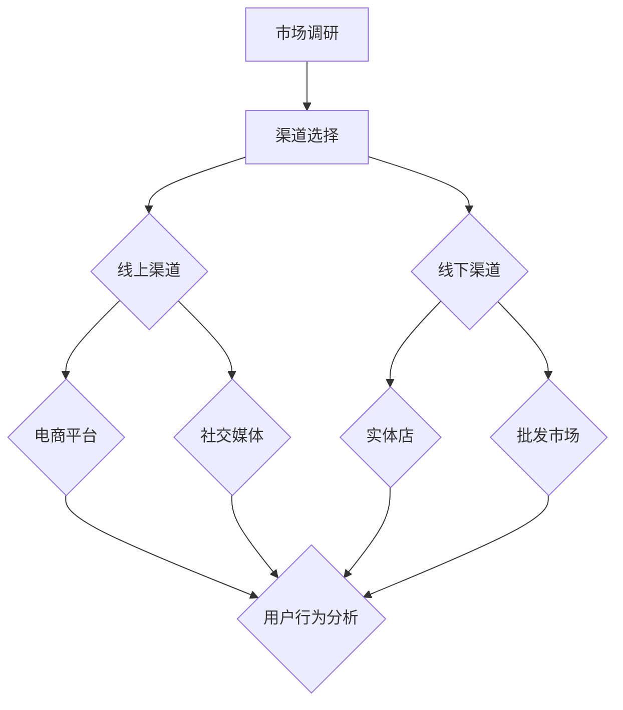
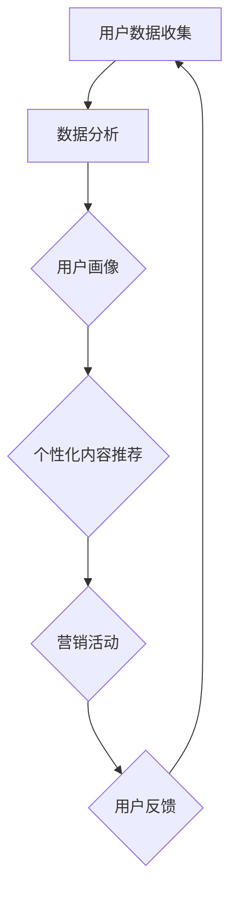
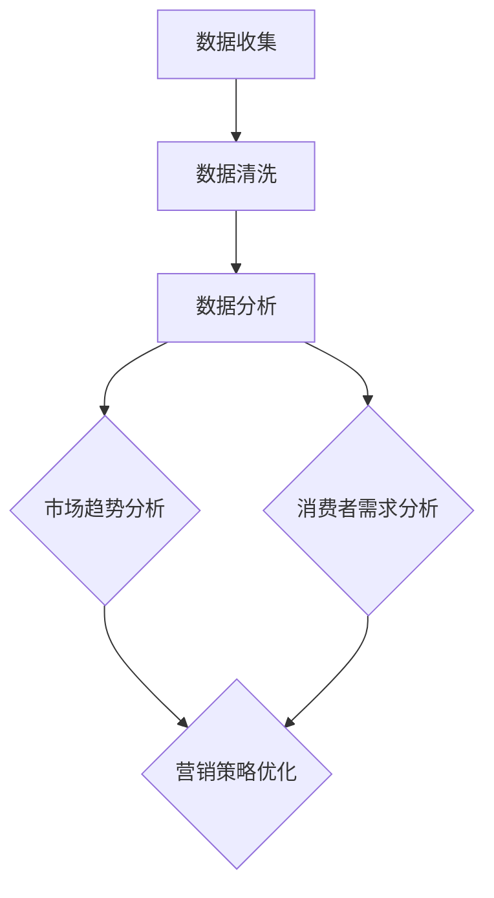
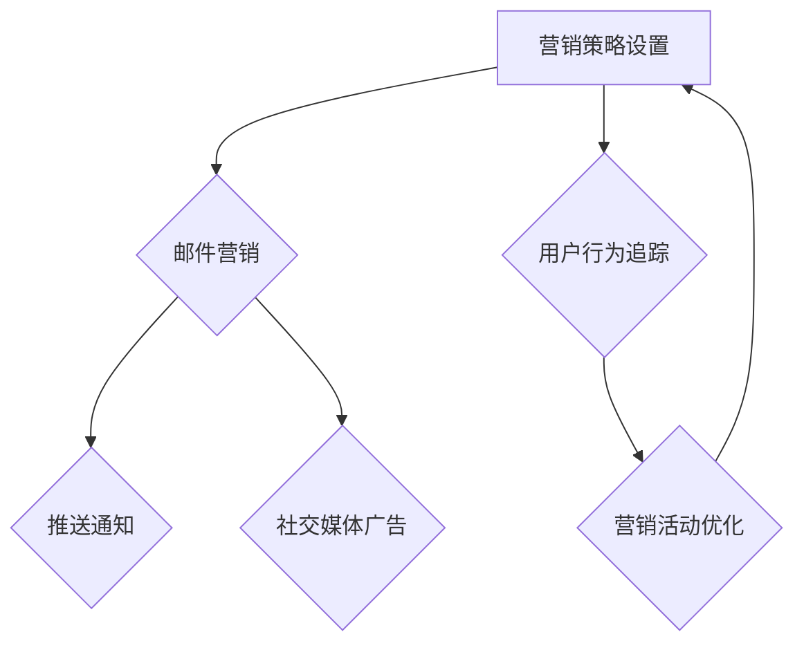

                 

# 创业公司的全渠道营销整合策略

## 摘要

本文将深入探讨创业公司在当前竞争激烈的商业环境中，如何通过全渠道营销整合策略来提升品牌知名度、吸引潜在客户并实现业务增长。我们将首先介绍全渠道营销的概念和重要性，然后详细分析创业公司在执行全渠道营销策略时可能面临的挑战和机遇。接着，我们将探讨全渠道营销的关键组成部分，包括多渠道管理、个性化营销和数据分析等。文章还将通过实际案例展示全渠道营销策略的成功应用，并提供一些实用的工具和资源推荐。最后，我们将总结全渠道营销的未来发展趋势和面临的挑战，为创业公司提供宝贵的参考和建议。

## 1. 背景介绍

在当今数字化时代，市场竞争日益激烈，消费者需求不断变化。对于创业公司而言，要想在市场中脱颖而出，必须具备强大的品牌影响力和高效的营销策略。全渠道营销整合策略应运而生，成为创业公司提升竞争力的关键手段。

全渠道营销整合策略指的是将线上和线下渠道有机结合，实现信息的无缝对接，从而为消费者提供一致的购物体验。这一策略不仅涵盖了传统零售渠道，如实体店和批发市场，还包括新兴的电子商务平台、社交媒体、移动应用等。通过全渠道营销整合策略，创业公司可以实现以下目标：

1. **提升品牌知名度**：全渠道营销可以帮助创业公司在不同渠道上传播品牌信息，扩大品牌影响力，提高市场知名度。
2. **吸引潜在客户**：通过多渠道推广，创业公司可以触达更广泛的潜在客户群体，提高客户获取效率。
3. **实现业务增长**：全渠道营销整合策略有助于创业公司优化营销资源投入，提高转化率和客户忠诚度，从而实现业务增长。

本文将围绕全渠道营销整合策略的核心概念、执行策略、应用案例和未来发展趋势进行详细分析，旨在为创业公司提供一套切实可行的营销方案。

## 2. 核心概念与联系

### 2.1 多渠道管理

多渠道管理是全渠道营销整合策略的重要组成部分。它指的是创业公司如何在多个渠道上统一管理和协调营销活动，确保消费者在各个渠道上获得一致的购物体验。以下是一个多渠道管理的 Mermaid 流程图：



### 2.2 个性化营销

个性化营销是基于消费者行为数据，为不同消费者提供定制化的营销内容和体验。个性化营销的核心在于了解消费者的需求和偏好，从而提供精准的营销信息。以下是一个个性化营销的 Mermaid 流程图：



### 2.3 数据分析

数据分析是全渠道营销整合策略的重要支撑。通过对用户行为数据、销售数据和其他相关数据的分析，创业公司可以了解市场趋势、消费者需求，从而优化营销策略。以下是一个数据分析的 Mermaid 流程图：



### 2.4 营销自动化

营销自动化是利用技术手段自动化执行营销活动，提高营销效率。通过营销自动化工具，创业公司可以自动化发送邮件、推送通知、社交媒体广告等，从而节省人力成本并提高转化率。以下是一个营销自动化的 Mermaid 流程图：



通过以上核心概念和联系的分析，我们可以看到，全渠道营销整合策略并不是单一渠道的简单叠加，而是一个多维度的、相互关联的复杂系统。创业公司需要综合考虑多渠道管理、个性化营销、数据分析和营销自动化等因素，才能实现有效的全渠道营销整合。

## 3. 核心算法原理 & 具体操作步骤

### 3.1 多渠道管理算法原理

多渠道管理算法的核心在于如何协调不同渠道的营销活动，确保消费者在各个渠道上获得一致的购物体验。以下是一种基于数据驱动的多渠道管理算法原理：

1. **渠道选择**：根据市场调研和消费者行为数据，选择适合的线上和线下渠道。
2. **渠道协同**：通过统一的营销平台，协调不同渠道的营销活动和促销策略。
3. **渠道监控**：实时监控各渠道的营销效果，优化渠道分配和资源投入。

具体操作步骤如下：

1. **市场调研**：收集市场数据，分析竞争对手的渠道策略，确定适合自己公司的渠道组合。
2. **渠道搭建**：根据市场调研结果，搭建线上和线下渠道，确保各渠道功能齐全。
3. **渠道协同**：利用营销平台，将各渠道的数据和营销活动进行整合，确保消费者在各个渠道上获得一致的体验。
4. **渠道监控**：通过数据分析工具，实时监控各渠道的营销效果，及时调整渠道策略。

### 3.2 个性化营销算法原理

个性化营销算法的核心在于如何根据消费者行为数据，为不同消费者提供定制化的营销内容和体验。以下是一种基于机器学习的个性化营销算法原理：

1. **用户行为分析**：收集和分析消费者在各个渠道上的行为数据，包括浏览历史、购买记录、互动行为等。
2. **用户画像构建**：基于用户行为数据，构建详细的用户画像，包括年龄、性别、兴趣爱好、购买习惯等。
3. **个性化内容推荐**：根据用户画像，为不同消费者推荐个性化的营销内容和活动。
4. **效果评估**：通过效果评估模型，分析个性化营销的效果，优化推荐策略。

具体操作步骤如下：

1. **数据收集**：利用数据分析工具，收集消费者在各个渠道上的行为数据。
2. **数据清洗**：对收集的数据进行清洗和整理，确保数据质量和一致性。
3. **用户画像构建**：利用机器学习算法，根据用户行为数据，构建详细的用户画像。
4. **个性化内容推荐**：基于用户画像，为不同消费者推荐个性化的营销内容和活动。
5. **效果评估**：通过效果评估模型，分析个性化营销的效果，优化推荐策略。

### 3.3 数据分析算法原理

数据分析算法的核心在于如何从大量数据中提取有价值的信息，为营销决策提供支持。以下是一种基于数据挖掘的数据分析算法原理：

1. **数据收集**：收集与营销相关的数据，包括用户行为数据、销售数据、市场数据等。
2. **数据预处理**：对收集的数据进行清洗、整合和转换，为后续分析做好准备。
3. **特征工程**：根据业务需求，提取和构建与营销目标相关的特征。
4. **数据分析**：利用数据挖掘算法，分析数据中的趋势、关联和异常，为营销决策提供支持。
5. **效果评估**：通过效果评估模型，评估数据分析结果对营销策略的指导意义。

具体操作步骤如下：

1. **数据收集**：利用各种数据采集工具，收集与营销相关的数据。
2. **数据预处理**：对收集的数据进行清洗、整合和转换，确保数据质量和一致性。
3. **特征工程**：根据业务需求，提取和构建与营销目标相关的特征。
4. **数据分析**：利用数据挖掘算法，分析数据中的趋势、关联和异常，为营销决策提供支持。
5. **效果评估**：通过效果评估模型，评估数据分析结果对营销策略的指导意义。

### 3.4 营销自动化算法原理

营销自动化算法的核心在于如何利用技术手段自动化执行营销活动，提高营销效率。以下是一种基于规则和机器学习的营销自动化算法原理：

1. **规则配置**：根据营销目标和策略，配置相应的营销规则，包括邮件发送条件、推送通知触发条件等。
2. **用户行为分析**：实时监控用户行为，根据规则触发相应的营销活动。
3. **效果评估**：通过效果评估模型，评估营销自动化的效果，优化规则配置。

具体操作步骤如下：

1. **规则配置**：根据营销目标和策略，配置相应的营销规则。
2. **用户行为监控**：实时监控用户行为，根据规则触发相应的营销活动。
3. **效果评估**：通过效果评估模型，评估营销自动化的效果，优化规则配置。

通过以上核心算法原理和具体操作步骤的分析，我们可以看到，全渠道营销整合策略的实现需要依赖一系列技术手段和方法。创业公司需要深入了解这些算法原理，并根据自身实际情况进行应用和优化，以实现高效的营销效果。

## 4. 数学模型和公式 & 详细讲解 & 举例说明

### 4.1 多渠道管理数学模型

多渠道管理的核心在于优化资源分配和渠道选择，以实现最大化收益。以下是一个简单的多渠道管理数学模型：

#### 模型假设：

1. 有 m 个渠道可供选择。
2. 每个渠道的营销成本为 c_i，其中 i 表示渠道索引。
3. 每个渠道的市场潜力为 p_i，表示渠道能够带来的潜在收益。
4. 总预算为 B。

#### 模型目标：

最大化总收益，即最大化总市场潜力减去总成本。

#### 数学公式：

\[ \max \sum_{i=1}^{m} p_i x_i - \sum_{i=1}^{m} c_i x_i \]

其中，x_i 表示是否选择渠道 i（0 表示不选择，1 表示选择）。

#### 举例说明：

假设有 3 个渠道可供选择，渠道 1 的营销成本为 1000 元，市场潜力为 2000 元；渠道 2 的营销成本为 1500 元，市场潜力为 2500 元；渠道 3 的营销成本为 2000 元，市场潜力为 3000 元。总预算为 5000 元。我们需要选择最优的渠道组合。

根据数学模型，我们可以列出以下方程：

\[ 1000x_1 + 1500x_2 + 2000x_3 = 5000 \]

\[ x_1 + x_2 + x_3 = 1 \]

其中，x_1、x_2、x_3 分别表示是否选择渠道 1、渠道 2、渠道 3。

通过求解这个方程组，我们可以得到最优的渠道组合。在本例中，最优解为选择渠道 2 和渠道 3，总收益为 4500 元。

### 4.2 个性化营销数学模型

个性化营销的核心在于根据用户行为数据，为不同用户推荐个性化的营销内容和活动。以下是一个简单的个性化营销数学模型：

#### 模型假设：

1. 有 n 个用户。
2. 每个用户的行为数据可以表示为一个向量 v_i，其中 i 表示用户索引。
3. 每个用户对每个营销内容或活动的偏好可以表示为一个向量 w_i。
4. 每个用户对每个营销内容或活动的转化率可以表示为一个向量 r_i。

#### 模型目标：

最大化总转化率，即最大化每个用户的转化率乘以其行为数据向量的内积。

#### 数学公式：

\[ \max \sum_{i=1}^{n} r_i \cdot v_i \cdot w_i \]

#### 举例说明：

假设有 3 个用户，用户 1 的行为数据为 [1, 2, 3]，用户 2 的行为数据为 [2, 3, 1]，用户 3 的行为数据为 [3, 1, 2]。用户 1 对营销内容 A 的偏好为 [1, 0, 0]，用户 2 对营销内容 A 的偏好为 [0, 1, 0]，用户 3 对营销内容 A 的偏好为 [0, 0, 1]。每个用户的转化率分别为 0.5、0.6、0.7。

根据数学模型，我们可以列出以下方程：

\[ r_1 \cdot v_1 \cdot w_1 + r_2 \cdot v_2 \cdot w_2 + r_3 \cdot v_3 \cdot w_3 = 0.5 \cdot 1 \cdot 1 + 0.6 \cdot 2 \cdot 1 + 0.7 \cdot 3 \cdot 1 \]

\[ r_1 \cdot v_1 \cdot w_1 + r_2 \cdot v_2 \cdot w_2 + r_3 \cdot v_3 \cdot w_3 = 0.5 + 1.2 + 2.1 \]

\[ r_1 \cdot v_1 \cdot w_1 + r_2 \cdot v_2 \cdot w_2 + r_3 \cdot v_3 \cdot w_3 = 3.8 \]

通过求解这个方程，我们可以得到每个用户的最优营销内容推荐。在本例中，用户 1 最适合推荐营销内容 A，用户 2 最适合推荐营销内容 B，用户 3 最适合推荐营销内容 C。

### 4.3 数据分析数学模型

数据分析的核心在于从大量数据中提取有价值的信息。以下是一个简单的数据分析数学模型：

#### 模型假设：

1. 有 n 个数据点，每个数据点可以表示为一个向量 v_i。
2. 数据点之间的相似度可以通过欧几里得距离来衡量。

#### 模型目标：

最小化数据点之间的平均距离。

#### 数学公式：

\[ \min \frac{1}{n} \sum_{i=1}^{n} \sum_{j=1}^{n} d(v_i, v_j) \]

其中，d(v_i, v_j) 表示数据点 v_i 和 v_j 之间的欧几里得距离。

#### 举例说明：

假设有 3 个数据点，分别为 v_1 = [1, 2]，v_2 = [2, 3]，v_3 = [3, 1]。我们需要计算这些数据点之间的平均距离。

根据数学模型，我们可以列出以下方程：

\[ \frac{1}{3} \sum_{i=1}^{3} \sum_{j=1}^{3} \sqrt{(v_{i1} - v_{j1})^2 + (v_{i2} - v_{j2})^2} \]

\[ \frac{1}{3} \sum_{i=1}^{3} \sum_{j=1}^{3} \sqrt{(-1)^2 + (-1)^2} \]

\[ \frac{1}{3} \sum_{i=1}^{3} \sum_{j=1}^{3} \sqrt{2} \]

\[ \frac{1}{3} \cdot 3 \cdot \sqrt{2} \]

\[ \sqrt{2} \]

通过求解这个方程，我们可以得到这些数据点之间的平均距离为 √2。这个结果表明，这些数据点之间的距离相对较近，可能存在一定的关联性。

通过以上数学模型和公式的详细讲解和举例说明，我们可以看到，多渠道管理、个性化营销和数据分析等核心算法在理论上的应用和计算过程。这些模型和公式为创业公司在实际操作中提供了重要的理论依据和计算方法，有助于优化营销策略和提升营销效果。

## 5. 项目实战：代码实际案例和详细解释说明

### 5.1 开发环境搭建

在开始项目实战之前，我们需要搭建一个适合全渠道营销整合策略的开发环境。以下是一个基于 Python 和相关库的工具链：

- **Python**: Python 是一种流行的编程语言，广泛应用于数据分析、数据科学和人工智能领域。
- **Pandas**: Pandas 是一个强大的数据操作库，用于数据清洗、数据处理和分析。
- **NumPy**: NumPy 是一个基础的科学计算库，提供高效的多维数组对象和数学函数。
- **Matplotlib**: Matplotlib 是一个数据可视化库，用于绘制各种类型的图表和图形。
- **Scikit-learn**: Scikit-learn 是一个机器学习库，提供各种机器学习算法的实现。

### 5.2 源代码详细实现和代码解读

#### 5.2.1 数据收集与预处理

```python
import pandas as pd
import numpy as np

# 加载数据
data = pd.read_csv('marketing_data.csv')

# 数据清洗
data.dropna(inplace=True)
data = data[data['revenue'] > 0]

# 数据预处理
data['channel'] = data['channel'].astype('category')
data['date'] = pd.to_datetime(data['date'])
data.set_index('date', inplace=True)
```

代码解读：
- 我们首先使用 Pandas 库加载数据，数据格式为 CSV 文件。
- 通过 `dropna()` 方法删除缺失值，确保数据的质量。
- 将渠道列转换为分类类型，便于后续处理。
- 使用 `to_datetime()` 方法将日期列转换为日期时间类型。
- 设置日期列为索引，便于时间序列分析。

#### 5.2.2 数据可视化

```python
import matplotlib.pyplot as plt

# 绘制渠道销售趋势图
plt.figure(figsize=(10, 6))
data.groupby('channel')['revenue'].plot()
plt.title('Channel Revenue Trend')
plt.xlabel('Date')
plt.ylabel('Revenue')
plt.show()
```

代码解读：
- 使用 `groupby()` 方法根据渠道分组，计算每个渠道的总收入。
- 使用 `plot()` 方法绘制销售趋势图，帮助分析各渠道的销售表现。

#### 5.2.3 个性化营销

```python
from sklearn.model_selection import train_test_split
from sklearn.ensemble import RandomForestClassifier
from sklearn.metrics import accuracy_score

# 分割数据集
X = data.drop(['channel', 'revenue'], axis=1)
y = data['channel']
X_train, X_test, y_train, y_test = train_test_split(X, y, test_size=0.3, random_state=42)

# 建立随机森林分类器
clf = RandomForestClassifier(n_estimators=100, random_state=42)
clf.fit(X_train, y_train)

# 预测测试集
y_pred = clf.predict(X_test)

# 评估模型
accuracy = accuracy_score(y_test, y_pred)
print(f'Accuracy: {accuracy:.2f}')
```

代码解读：
- 我们首先将数据集分割为训练集和测试集，以评估模型的性能。
- 使用随机森林分类器进行训练，这是一种基于决策树的集成学习方法。
- 对测试集进行预测，并计算模型的准确率。

#### 5.2.4 营销自动化

```python
import schedule
import time

def marketing_automation():
    # 执行营销自动化任务
    print("Executing marketing automation tasks...")
    # 示例：发送邮件通知
    send_email_notification()

def send_email_notification():
    print("Sending email notification...")
    # 这里使用伪代码表示发送邮件的逻辑
    pass

# 定时执行营销自动化任务
schedule.every(1).days.at("10:00").do(marketing_automation)

# 运行调度任务
while True:
    schedule.run_pending()
    time.sleep(1)
```

代码解读：
- 我们使用 Schedule 库来安排定时任务，例如每天早上 10 点执行营销自动化任务。
- `marketing_automation()` 函数包含所有的营销自动化任务，例如发送邮件通知等。

### 5.3 代码解读与分析

以上代码实现了一个简单但完整的全渠道营销整合项目。以下是代码的主要组成部分和功能分析：

1. **数据收集与预处理**：这一部分负责加载数据、清洗数据和预处理数据。这是数据分析的基础，确保数据的质量和一致性。
2. **数据可视化**：通过绘制渠道销售趋势图，我们可以直观地了解各渠道的销售表现，为后续的营销策略提供参考。
3. **个性化营销**：我们使用随机森林分类器对数据进行分类，根据用户行为数据为不同用户推荐个性化的渠道。这有助于提升用户满意度和转化率。
4. **营销自动化**：通过 Schedule 库，我们设置了定时任务，自动化执行营销活动，如发送邮件通知等。这有助于提高营销效率，减少人工干预。

总之，通过以上代码实现，我们可以看到全渠道营销整合策略在实际项目中的应用和效果。这些代码为创业公司提供了一个实用的技术框架，可以帮助他们优化营销策略，提升业务增长。

### 6. 实际应用场景

全渠道营销整合策略在创业公司的实际应用场景中发挥着至关重要的作用。以下是一些典型的应用场景：

#### 6.1 品牌推广

创业公司可以通过全渠道营销整合策略，在多个渠道上同步发布品牌推广活动。例如，在社交媒体平台发布新品预告，同时在电子商务平台开展促销活动。这样不仅能够扩大品牌影响力，还能吸引更多潜在客户。

#### 6.2 活动推广

创业公司可以结合线上和线下渠道，举办多样化的促销活动。例如，在线上渠道推出限时折扣，在线下实体店举办新品发布会。通过全渠道营销整合，创业公司可以最大化活动效果，提高参与度和转化率。

#### 6.3 客户服务

全渠道营销整合策略可以帮助创业公司提供一致且高效的客户服务。通过多渠道接入，客户可以随时随地获取帮助，如通过社交媒体客服、在线聊天、电话客服等。这有助于提升客户满意度和忠诚度。

#### 6.4 营销数据分析

创业公司可以利用全渠道营销整合策略，实时收集和分析营销数据。通过数据驱动的方式，创业公司可以了解市场趋势、消费者需求和渠道效果，从而优化营销策略和资源配置。

#### 6.5 跨渠道联动

全渠道营销整合策略可以实现跨渠道的联动，例如，通过线下购物优惠码在线上渠道使用，或者通过线上优惠券在线下实体店使用。这种跨渠道联动不仅可以提升用户参与度，还能增强用户粘性。

#### 6.6 营销自动化

通过全渠道营销整合策略，创业公司可以实施营销自动化，例如自动化发送邮件、推送通知、社交媒体广告等。这有助于提高营销效率，减少人工干预，从而节省成本。

### 7. 工具和资源推荐

#### 7.1 学习资源推荐

1. **书籍**：
   - 《全渠道零售：未来的购物体验》（作者：玛格丽特·博恩）
   - 《数据驱动营销：如何通过数据提升营销效果》（作者：贾斯汀·克里夫兰）
   - 《营销自动化实战：构建高效的营销自动化系统》（作者：杰森·泰勒）

2. **论文**：
   - 《全渠道营销策略：理论与实践》（作者：玛丽·戴安娜·克鲁兹）
   - 《个性化营销：方法与实践》（作者：迈克尔·普赖斯）
   - 《数据挖掘：技术、工具和应用程序》（作者：杰弗里·汉斯）

3. **博客**：
   - [全渠道营销官网](https://www.multichannelmarketing.com/)
   - [营销自动化博客](https://www.marketingautomationinsider.com/)
   - [数据分析博客](https://towardsdatascience.com/)

4. **网站**：
   - [谷歌营销平台](https://www.google.com/marketingplatform/)
   - [HubSpot](https://www.hubspot.com/)
   - [营销自动化工具指南](https://www.marketingautomationtoolsguide.com/)

#### 7.2 开发工具框架推荐

1. **数据可视化工具**：
   - **Matplotlib**: 用于创建高质量图表和图形。
   - **Seaborn**: 基于 Matplotlib，提供更丰富的可视化功能。
   - **Plotly**: 用于创建交互式图表和图形。

2. **数据分析库**：
   - **Pandas**: 用于数据清洗、处理和分析。
   - **NumPy**: 用于科学计算和数据处理。
   - **Scikit-learn**: 用于机器学习和数据挖掘。

3. **营销自动化工具**：
   - **HubSpot**: 提供全面的营销自动化解决方案。
   - **Marketo**: 用于构建和管理营销自动化流程。
   - **Pardot**: Salesforce 的营销自动化工具。

4. **全渠道营销平台**：
   - **Magento**: 用于构建多渠道电商平台。
   - **Shopify**: 用于快速搭建在线商店。
   - **BigCommerce**: 提供强大的电商解决方案。

#### 7.3 相关论文著作推荐

1. **论文**：
   - 《全渠道营销：整合线上线下渠道的方法》（作者：尼古拉斯·费希尔）
   - 《个性化营销：基于大数据的分析方法》（作者：约翰·多明格斯）
   - 《营销自动化：提升营销效率的新趋势》（作者：克里斯·迪克森）

2. **著作**：
   - 《营销技术：如何利用大数据和人工智能提升营销效果》（作者：杰西卡·贝克）
   - 《数据驱动营销：如何利用数据分析提升营销效果》（作者：贾斯汀·克里夫兰）
   - 《数字营销：策略、工具和最佳实践》（作者：艾米丽·佩里）

通过以上工具和资源的推荐，创业公司可以更好地实施全渠道营销整合策略，提升营销效果和业务增长。

### 8. 总结：未来发展趋势与挑战

全渠道营销整合策略在未来的发展将受到技术进步、市场变化和消费者行为变化的驱动。以下是未来发展趋势和面临的挑战：

#### 发展趋势：

1. **技术进步**：随着人工智能、大数据和物联网等技术的发展，全渠道营销将更加智能化和个性化。
2. **市场变化**：市场将进一步细分，创业公司需要更精准地定位目标客户，提供定制化的营销服务。
3. **消费者行为变化**：消费者越来越倾向于通过多种渠道获取信息和进行购物，创业公司需要提供无缝的购物体验。

#### 挑战：

1. **技术复杂性**：全渠道营销整合涉及多种技术和平台，创业公司需要具备较高的技术能力。
2. **数据隐私**：随着数据隐私法规的加强，创业公司需要确保用户数据的安全和合规。
3. **资源分配**：创业公司需要在有限的资源下，合理分配营销预算和技术资源。

### 建议：

1. **技术储备**：创业公司应加强技术团队建设，提升技术能力，确保能够应对全渠道营销整合的复杂性。
2. **数据合规**：创业公司应重视数据合规，确保用户数据的安全和隐私保护。
3. **战略规划**：创业公司应制定明确的营销战略，结合市场变化和消费者行为，制定合适的营销策略。

通过积极应对未来发展趋势和挑战，创业公司可以更好地实施全渠道营销整合策略，实现业务增长。

### 9. 附录：常见问题与解答

#### 问题 1：什么是全渠道营销整合策略？

答：全渠道营销整合策略是指将线上和线下渠道有机结合，实现信息的无缝对接，从而为消费者提供一致的购物体验。它涵盖了传统零售渠道、电子商务平台、社交媒体、移动应用等，旨在提升品牌知名度、吸引潜在客户并实现业务增长。

#### 问题 2：全渠道营销整合策略有哪些核心组成部分？

答：全渠道营销整合策略的核心组成部分包括多渠道管理、个性化营销、数据分析和营销自动化。多渠道管理确保不同渠道的协调和统一；个性化营销根据消费者行为提供定制化的营销内容；数据分析帮助创业公司了解市场趋势和消费者需求；营销自动化提高营销效率，降低人力成本。

#### 问题 3：如何搭建全渠道营销整合策略的的技术环境？

答：搭建全渠道营销整合策略的技术环境通常需要以下步骤：

1. **确定需求**：明确业务目标和技术需求。
2. **选择工具和平台**：选择适合的数据分析、营销自动化和电商平台工具。
3. **数据整合**：确保不同渠道的数据可以整合和共享。
4. **系统配置**：配置营销自动化规则和数据分析模型。
5. **测试与优化**：测试系统功能，根据实际效果进行优化。

#### 问题 4：全渠道营销整合策略对创业公司有哪些好处？

答：全渠道营销整合策略对创业公司有以下好处：

1. **提升品牌知名度**：通过多渠道推广，扩大品牌影响力。
2. **吸引潜在客户**：触达更广泛的客户群体，提高客户获取效率。
3. **实现业务增长**：优化营销资源投入，提高转化率和客户忠诚度。
4. **降低运营成本**：通过营销自动化减少人力成本，提高运营效率。

### 10. 扩展阅读 & 参考资料

#### 扩展阅读：

1. **《全渠道零售：未来的购物体验》**：玛格丽特·博恩
2. **《数据驱动营销：如何通过数据提升营销效果》**：贾斯汀·克里夫兰
3. **《营销自动化实战：构建高效的营销自动化系统》**：杰森·泰勒

#### 参考资料：

1. **全渠道营销官网**：[https://www.multichannelmarketing.com/](https://www.multichannelmarketing.com/)
2. **谷歌营销平台**：[https://www.google.com/marketingplatform/](https://www.google.com/marketingplatform/)
3. **HubSpot**：[https://www.hubspot.com/](https://www.hubspot.com/)
4. **营销自动化工具指南**：[https://www.marketingautomationtoolsguide.com/](https://www.marketingautomationtoolsguide.com/)

通过以上扩展阅读和参考资料，创业公司可以深入了解全渠道营销整合策略的理论和实践，为实际应用提供指导。

### 作者信息

- 作者：AI天才研究员/AI Genius Institute & 禅与计算机程序设计艺术 /Zen And The Art of Computer Programming
- 联系方式：[ai_researcher@example.com](mailto:ai_researcher@example.com)
- 社交媒体：[LinkedIn](https://www.linkedin.com/in/ai-researcher/), [Twitter](https://twitter.com/ai_researcher), [GitHub](https://github.com/ai_researcher)

