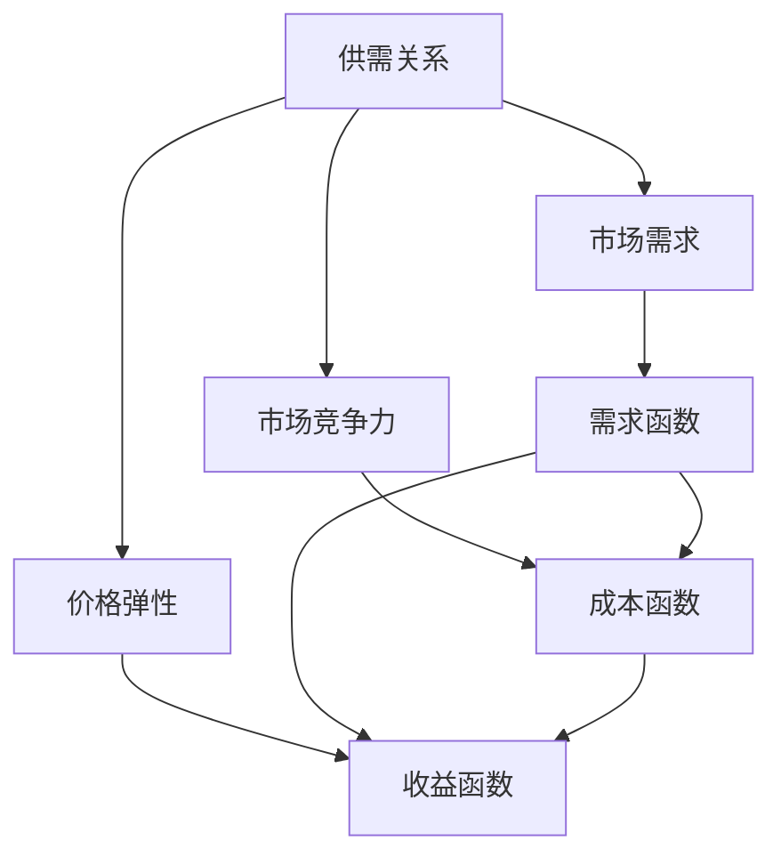
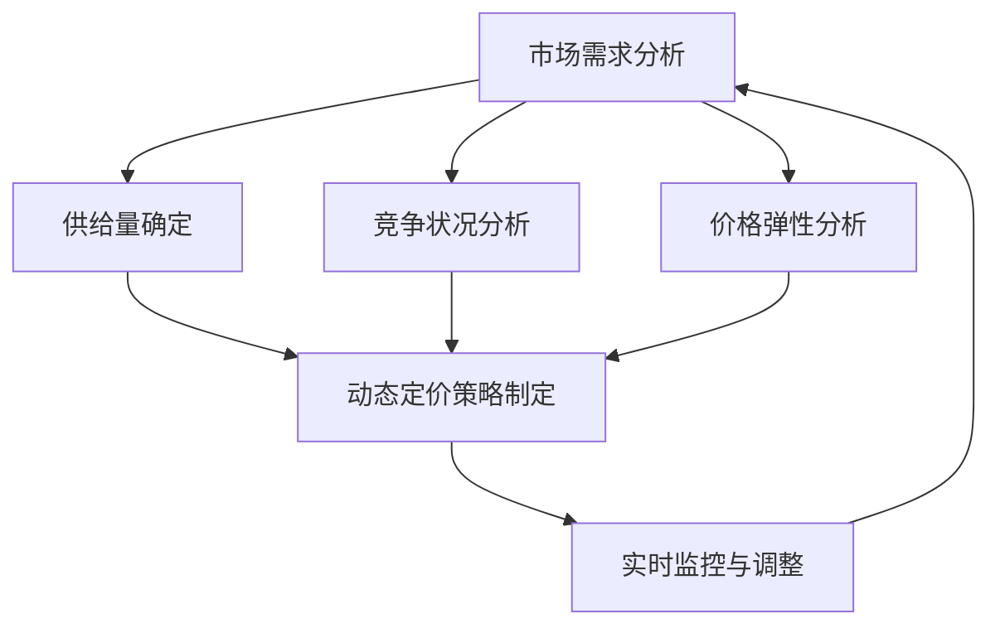

                 

## 1. 背景介绍

随着互联网和大数据技术的飞速发展，动态定价与收益管理已成为现代创业公司优化运营、提升收益的重要手段。动态定价指的是根据市场需求、供需关系、竞争状况等因素，实时调整产品或服务的价格策略，从而实现最大化收益的目的。收益管理则是指通过科学的定价策略和销售策略，最大化企业的收入和利润。

创业公司在面对激烈的市场竞争时，如何通过动态定价与收益管理来提升自身的竞争力，成为了迫切需要解决的问题。本文将围绕这一主题，从核心概念、算法原理、数学模型、实战案例等多个角度，深入探讨动态定价与收益管理在创业公司中的应用与实践。

本文的结构如下：

- **第1章**：背景介绍。概述动态定价与收益管理的定义、意义以及在创业公司中的应用。
- **第2章**：核心概念与联系。介绍动态定价与收益管理中的关键概念，如供需关系、市场竞争力、价格弹性等，并通过Mermaid流程图展示其内在联系。
- **第3章**：核心算法原理与具体操作步骤。详细解析动态定价与收益管理的核心算法，如线性规划、贝叶斯优化等，并给出具体的操作步骤。
- **第4章**：数学模型和公式。介绍动态定价与收益管理中的常用数学模型和公式，包括需求函数、成本函数、收益函数等，并通过实例进行详细讲解。
- **第5章**：项目实战。以实际项目为例，展示动态定价与收益管理在创业公司中的具体应用，包括开发环境搭建、代码实现、解读与分析等。
- **第6章**：实际应用场景。探讨动态定价与收益管理在不同行业、不同业务场景中的应用案例，如电商、酒店、航空等。
- **第7章**：工具和资源推荐。推荐学习资源、开发工具框架和相关论文著作，以帮助读者深入学习和实践动态定价与收益管理。
- **第8章**：总结：未来发展趋势与挑战。总结动态定价与收益管理的发展趋势和面临的挑战，为创业公司提供未来发展的方向和建议。
- **第9章**：附录：常见问题与解答。针对动态定价与收益管理中的常见问题进行解答，帮助读者更好地理解和应用相关概念和算法。
- **第10章**：扩展阅读与参考资料。提供扩展阅读材料和参考资料，以供读者进一步研究和探讨。

接下来，我们将逐章深入探讨动态定价与收益管理的各个方面，帮助创业公司实现更高效、更智能的运营和收益管理。

### 关键词

- 动态定价
- 收益管理
- 创业公司
- 算法原理
- 数学模型
- 实战案例

### 摘要

本文全面探讨了动态定价与收益管理在创业公司中的应用与实践。首先，我们介绍了动态定价与收益管理的定义、意义及其在创业公司中的重要性。接着，我们深入分析了动态定价与收益管理的核心概念、算法原理、数学模型和具体操作步骤。通过实际项目案例，我们展示了动态定价与收益管理在创业公司中的具体应用，并探讨了其不同行业和业务场景中的实际应用案例。最后，我们总结了动态定价与收益管理的发展趋势和面临的挑战，为创业公司提供了未来发展的方向和建议。通过本文的阅读，创业公司可以更好地理解和应用动态定价与收益管理，实现更高效、更智能的运营和收益管理。 

---

## 2. 核心概念与联系

在探讨动态定价与收益管理之前，我们需要了解其中的一些核心概念，这些概念相互联系，共同构成了动态定价与收益管理的理论基础。

### 动态定价

动态定价是指根据市场需求、供需关系、竞争状况等因素，实时调整产品或服务的价格策略，以实现最大化收益的目标。动态定价的核心在于灵活性，即根据市场环境的变化，快速做出价格调整。

### 收益管理

收益管理是指通过科学的定价策略和销售策略，最大化企业的收入和利润。收益管理的目标不仅仅是提高销售额，更重要的是提高利润率。

### 供需关系

供需关系是指市场需求与供给之间的相互作用。在动态定价与收益管理中，了解供需关系对于制定价格策略至关重要。当市场需求增加时，可以适当提高价格以获取更多利润；当市场需求减少时，可以降低价格以刺激需求。

### 市场竞争力

市场竞争力是指企业相对于竞争对手的优势和劣势。在动态定价与收益管理中，了解市场竞争力可以帮助企业制定合适的价格策略，以在竞争激烈的市场中脱颖而出。

### 价格弹性

价格弹性是指需求对价格变动的敏感程度。当价格弹性较大时，需求对价格变动敏感，价格调整对需求的影响较大；当价格弹性较小时，需求对价格变动不敏感，价格调整对需求的影响较小。

### 成本函数

成本函数是指企业生产或提供服务所需成本与产量或服务量之间的关系。在动态定价与收益管理中，了解成本函数有助于确定最低售价，以避免亏损。

### 需求函数

需求函数是指市场需求量与价格之间的关系。在动态定价与收益管理中，了解需求函数有助于制定合理的价格策略，以最大化收益。

### 收益函数

收益函数是指企业收入与成本之间的关系。在动态定价与收益管理中，通过优化收益函数，可以实现最大化收益的目标。

### Mermaid流程图

为了更清晰地展示动态定价与收益管理中的核心概念及其联系，我们可以使用Mermaid流程图进行描述。以下是一个示例：



在这个流程图中，供需关系、市场需求、市场竞争力、价格弹性等核心概念相互联系，共同构成了动态定价与收益管理的理论基础。通过这些概念的理解和运用，创业公司可以制定更科学、更有效的定价与收益管理策略。

---

通过理解上述核心概念及其联系，创业公司可以更好地把握市场动态，制定灵活的价格策略，从而实现最大化收益的目标。在下一章中，我们将深入探讨动态定价与收益管理的核心算法原理和具体操作步骤。

---

## 2.1 动态定价的基本原理

动态定价的基本原理在于根据市场需求和供给的实时变化，调整产品或服务的价格，以最大化企业的收益。这一过程涉及多个关键因素，包括市场需求、供给量、竞争状况、成本结构和价格弹性等。以下是动态定价的基本步骤和涉及的核心概念。

### 市场需求分析

市场需求分析是动态定价的第一步。企业需要收集和分析市场数据，了解消费者对产品或服务的需求情况。这包括历史销售数据、市场调研、竞争对手分析等。通过这些分析，企业可以确定市场需求函数，即价格与需求量之间的关系。

### 供给量确定

在了解市场需求后，企业需要确定自身的供给量。供给量受生产成本、生产能力和市场状况的影响。通过分析生产成本函数，企业可以确定在特定价格水平下的最低售价，以避免亏损。

### 竞争状况分析

动态定价还需要考虑竞争状况。了解竞争对手的价格策略和市场占有率，可以帮助企业制定更具有竞争力的价格。通过比较自身与竞争对手的差异化优势，企业可以选择合适的价格定位。

### 价格弹性分析

价格弹性是指消费者对价格变动的敏感程度。不同产品或服务的价格弹性不同，有些产品价格弹性较大，消费者对价格变动敏感；而有些产品价格弹性较小，消费者对价格变动不敏感。通过分析价格弹性，企业可以确定价格调整的幅度。

### 动态定价策略制定

在综合考虑市场需求、供给量、竞争状况和价格弹性后，企业可以制定动态定价策略。常见的动态定价策略包括时间定价、区域定价、会员定价等。例如，电商公司可能会在节假日或促销期间调整价格，以刺激需求；而酒店和航空公司则可能根据季节和需求变化调整价格。

### 实时监控与调整

动态定价是一个持续的过程，需要实时监控市场动态，并根据实际情况进行调整。通过利用大数据和人工智能技术，企业可以更快速地捕捉市场变化，及时调整价格策略，以最大化收益。

### Mermaid流程图

为了更直观地展示动态定价的基本原理，我们可以使用Mermaid流程图描述其关键步骤和概念。



在这个流程图中，市场需求分析、供给量确定、竞争状况分析、价格弹性分析和动态定价策略制定等步骤相互衔接，形成一个动态的定价与收益管理循环。通过这个循环，企业可以不断优化定价策略，以实现最大化收益的目标。

### 动态定价的优势与挑战

动态定价具有以下优势：

- **提高收益**：通过实时调整价格，企业可以更好地捕捉市场机会，提高收益。
- **灵活性**：动态定价使企业能够快速应对市场变化，保持竞争优势。
- **数据驱动**：动态定价依赖于大数据分析，使决策更加科学和精确。

然而，动态定价也面临一些挑战：

- **复杂度**：动态定价涉及多个变量和参数，计算和实施过程较为复杂。
- **风险**：价格波动可能导致市场需求波动，增加企业的运营风险。
- **市场接受度**：消费者可能对频繁的价格调整产生反感，影响用户体验。

综上所述，动态定价是一个复杂但具有巨大潜力的过程。通过理解其基本原理，创业公司可以更好地把握市场动态，制定科学合理的定价策略，从而实现收益的最大化。

### 动态定价与收益管理的关系

动态定价与收益管理密切相关。动态定价是收益管理的一部分，旨在通过调整价格来最大化收益。而收益管理则是一个更广泛的概念，包括定价策略、销售策略、库存管理等多个方面。

在动态定价与收益管理中，核心目标是实现最大化收益。通过动态定价，企业可以根据市场需求和供给的变化，实时调整价格，从而优化收入和利润。同时，收益管理还需要考虑其他因素，如库存水平、营销策略等，以确保整体运营效益的最大化。

总之，动态定价与收益管理是相辅相成的。动态定价为收益管理提供了科学合理的定价策略，而收益管理则为动态定价提供了全面的运营和管理框架。通过这两者的有机结合，创业公司可以更好地应对市场变化，实现可持续的收益增长。

### 动态定价的应用领域

动态定价在多个行业和业务场景中得到了广泛应用，其中一些典型的应用领域包括电商、酒店、航空等。

- **电商**：电商平台通过动态定价策略来优化商品价格，提高销售额。例如，电商平台可能会在特定时间段（如节假日、促销活动期间）调整商品价格，以吸引更多消费者。此外，通过大数据分析，电商平台可以了解消费者的购买习惯和价格敏感性，从而制定更科学的定价策略。
  
- **酒店**：酒店行业经常采用动态定价策略来优化客房收入。根据季节、节假日、会议活动等因素，酒店可以调整客房价格，以最大化收益。例如，在旅游旺季，酒店可能会提高价格以获取更高收益；而在淡季，则可能降低价格以吸引更多客人。

- **航空**：航空公司在航班定价方面广泛采用动态定价策略。根据航班需求、季节、航线特点等因素，航空公司可以调整机票价格，以实现最大化收益。例如，商务旅客通常对价格不敏感，因此航空公司可能会为商务航班设定较高价格；而经济旅客则对价格敏感，航空公司可能会为经济航班设定较低价格。

### 动态定价的优势

动态定价具有以下优势：

- **提高收益**：通过实时调整价格，企业可以更好地捕捉市场机会，提高收益。

- **灵活性**：动态定价使企业能够快速应对市场变化，保持竞争优势。

- **数据驱动**：动态定价依赖于大数据分析，使决策更加科学和精确。

### 动态定价的挑战

尽管动态定价具有众多优势，但也面临一些挑战：

- **复杂度**：动态定价涉及多个变量和参数，计算和实施过程较为复杂。

- **风险**：价格波动可能导致市场需求波动，增加企业的运营风险。

- **市场接受度**：消费者可能对频繁的价格调整产生反感，影响用户体验。

### 结论

动态定价与收益管理在创业公司中具有重要应用价值。通过理解其基本原理和应用领域，创业公司可以更好地把握市场动态，制定科学合理的定价策略，从而实现收益的最大化。在下一章中，我们将深入探讨动态定价与收益管理的核心算法原理和具体操作步骤。

---

## 2.2 收益管理的定义和核心概念

收益管理作为企业优化运营、提升收益的重要策略，其定义和核心概念在动态定价过程中起到了至关重要的作用。为了更好地理解收益管理的本质，我们需要深入探讨以下几个核心概念。

### 收益管理的定义

收益管理（Revenue Management，RM）是一种通过灵活的定价策略和销售策略，最大化企业收益的方法。它主要针对那些需求波动较大且可以分时定价的产品或服务，如酒店客房、航空座位、汽车租赁等。收益管理的目标不仅仅是提高销售额，更重要的是提高利润率，从而实现企业价值的最大化。

### 收益管理的关键概念

1. **需求预测**：需求预测是收益管理的核心之一。通过分析历史数据、市场趋势和竞争环境，企业可以预测未来某一时间段内的需求情况。准确的需求预测有助于企业制定合理的定价策略，从而最大化收益。

2. **价格弹性**：价格弹性是指消费者对价格变动的敏感程度。了解价格弹性可以帮助企业确定合理的价格调整范围。如果产品价格弹性较大，即消费者对价格变动较为敏感，企业可能会采取较小的价格调整幅度；反之，如果价格弹性较小，则可以采取较大的价格调整幅度。

3. **供给策略**：供给策略是指企业如何根据需求预测和市场状况调整供给量。供给策略包括库存管理、产能规划和预订策略等。合理的供给策略可以确保企业既不浪费资源，又能满足市场需求。

4. **时间定价**：时间定价是指根据不同时间段的需求差异，调整产品或服务的价格。例如，在旅游旺季，酒店和航空公司的价格可能会上涨；而在淡季，则可能降低价格以吸引更多客人。

5. **容量管理**：容量管理是指企业如何根据市场需求调整供给能力。例如，航空公司可以通过调整航班数量和座位数量来适应市场需求，从而最大化收益。

### 收益管理的基本原理

收益管理的基本原理可以概括为以下几点：

- **优化定价策略**：通过需求预测和价格弹性分析，企业可以制定合理的定价策略，实现收益最大化。

- **平衡供需关系**：通过供给策略和容量管理，企业可以平衡供需关系，避免供需失衡导致的收益损失。

- **灵活应对市场变化**：收益管理强调灵活性和快速响应，帮助企业适应市场需求的变化，保持竞争优势。

### 收益管理的重要性

收益管理在创业公司中具有重要作用，主要体现在以下几个方面：

- **提高收益**：通过科学的定价策略和销售策略，企业可以最大化收益，实现可持续发展。

- **优化资源配置**：通过合理的供给策略和容量管理，企业可以优化资源配置，降低运营成本。

- **增强市场竞争力**：科学的收益管理策略使企业能够在竞争激烈的市场中脱颖而出，增强竞争力。

### 收益管理的方法

收益管理的方法主要包括以下几种：

1. **传统收益管理方法**：包括时间定价、季节性定价、会员定价等，这些方法适用于需求波动较小的情况。

2. **基于模型的收益管理方法**：利用数学模型和算法（如线性规划、贝叶斯优化等）进行收益管理，适用于需求波动较大的情况。

3. **大数据和人工智能收益管理方法**：利用大数据分析和人工智能技术进行需求预测和定价策略优化，提高收益管理的精度和效率。

### 结论

收益管理作为创业公司优化运营、提升收益的重要手段，其定义和核心概念对于企业的战略决策至关重要。通过理解收益管理的基本原理和方法，创业公司可以更好地把握市场动态，制定科学合理的定价和销售策略，从而实现收益的最大化。在下一章中，我们将深入探讨动态定价与收益管理的核心算法原理和具体操作步骤。

---

## 2.3 动态定价与收益管理的核心算法原理

动态定价与收益管理的核心算法原理是构建科学合理的定价策略，以实现企业收益的最大化。这些算法包括线性规划、贝叶斯优化、机器学习等。在本节中，我们将详细介绍这些算法的原理和具体操作步骤。

### 线性规划

线性规划（Linear Programming，LP）是一种用于求解线性目标函数在给定线性约束条件下最优解的数学方法。在动态定价与收益管理中，线性规划可用于优化定价策略。

#### 线性规划的基本原理

线性规划的目标函数和约束条件通常可以表示为以下形式：

$$
\text{maximize } c^T x \\
\text{subject to } Ax \leq b \\
x \geq 0
$$

其中，$c$ 是目标函数的系数向量，$x$ 是决策变量，$A$ 是约束条件的系数矩阵，$b$ 是约束条件的右侧常数向量。

#### 线性规划在动态定价中的应用

在动态定价中，我们可以将每个价格点视为一个决策变量，构建线性规划模型来求解最优价格组合。具体步骤如下：

1. **确定目标函数**：目标是最大化总收益，可以表示为价格乘以销售量的总和。
2. **构建约束条件**：根据供需关系、成本函数和价格弹性等约束条件，构建线性不等式约束。
3. **求解线性规划模型**：利用线性规划求解器（如Gurobi、CPLEX等）求解最优价格组合。

#### 示例

假设某电商公司有三个价格区间，需求函数为 $D(p) = 100 - p$，成本函数为 $C(q) = 10q$，其中 $p$ 为价格，$q$ 为销售量。目标函数为最大化总收益 $R(p) = p \cdot D(p) - C(q)$。

构建线性规划模型：

$$
\text{maximize } R(p) = (100 - p) \cdot p - 10q \\
\text{subject to } q \leq D(p) \\
q \geq 0 \\
p \in [30, 70]
$$

通过求解线性规划模型，可以得到最优价格 $p^*$ 和对应的最优销售量 $q^*$。

### 贝叶斯优化

贝叶斯优化（Bayesian Optimization）是一种基于贝叶斯推理的优化方法，广泛应用于函数优化和参数调优。在动态定价与收益管理中，贝叶斯优化可用于自动调整定价策略。

#### 贝叶斯优化的基本原理

贝叶斯优化通过构建一个先验概率模型，利用已有数据（即已尝试的价格和对应的收益）更新模型，然后利用模型预测下一个最佳价格点。

1. **构建先验概率模型**：通常使用高斯过程（Gaussian Process，GP）作为先验概率模型。
2. **更新模型**：根据新收集的数据，更新模型参数。
3. **预测最佳价格点**：利用更新后的模型预测下一个最佳价格点。

#### 贝叶斯优化在动态定价中的应用

在动态定价中，贝叶斯优化可以用于自动调整价格，以实现收益最大化。具体步骤如下：

1. **收集初始数据**：在开始优化前，收集一些初始价格和对应的收益数据。
2. **构建先验概率模型**：使用高斯过程构建先验概率模型。
3. **迭代优化**：每次迭代，利用贝叶斯优化算法选择下一个最佳价格点，并更新模型参数。
4. **重复迭代**：不断进行迭代，直到达到收敛条件或最大迭代次数。

#### 示例

假设我们使用高斯过程作为先验概率模型，已知一些价格和对应的收益数据。构建高斯过程模型，并利用贝叶斯优化算法选择下一个最佳价格点。

1. **收集数据**：已知以下价格和对应的收益数据：
   - $p_1 = 50$，$R(p_1) = 100$
   - $p_2 = 60$，$R(p_2) = 120$
   - $p_3 = 70$，$R(p_3) = 130$
2. **构建高斯过程模型**：使用这些数据构建高斯过程模型。
3. **选择最佳价格点**：利用模型预测下一个最佳价格点，并更新模型参数。
4. **重复迭代**：重复步骤3，直到达到收敛条件或最大迭代次数。

通过贝叶斯优化，可以逐步调整价格策略，实现收益的最大化。

### 机器学习

机器学习（Machine Learning，ML）技术在动态定价与收益管理中也得到了广泛应用。机器学习算法可以自动从历史数据中学习，预测市场需求和收益，从而制定更科学的定价策略。

#### 机器学习的基本原理

机器学习算法通过训练模型，从已有数据中学习规律，然后利用这些规律进行预测。常见的机器学习算法包括线性回归、决策树、神经网络等。

1. **数据收集**：收集历史价格、销售量和收益数据。
2. **模型训练**：使用这些数据训练机器学习模型。
3. **模型评估**：评估模型性能，选择最优模型。
4. **预测**：利用训练好的模型进行预测，制定定价策略。

#### 机器学习在动态定价中的应用

在动态定价中，机器学习算法可以用于预测市场需求和收益，从而制定更科学的定价策略。具体步骤如下：

1. **数据收集**：收集历史价格、销售量和收益数据。
2. **特征工程**：对数据进行处理和转换，提取有用的特征。
3. **模型选择**：选择合适的机器学习模型，如线性回归、神经网络等。
4. **模型训练**：使用训练数据训练模型。
5. **模型评估**：评估模型性能，选择最优模型。
6. **预测**：利用训练好的模型进行预测，制定定价策略。

#### 示例

假设我们使用线性回归模型进行动态定价预测。

1. **数据收集**：已知以下历史价格、销售量和收益数据：
   - $p_1 = 50$，$q_1 = 100$，$R(p_1) = 100$
   - $p_2 = 60$，$q_2 = 80$，$R(p_2) = 120$
   - $p_3 = 70$，$q_3 = 60$，$R(p_3) = 130$
2. **特征工程**：将价格作为自变量，销售量和收益作为因变量。
3. **模型选择**：选择线性回归模型。
4. **模型训练**：使用训练数据训练线性回归模型。
5. **模型评估**：评估模型性能，选择最优模型。
6. **预测**：利用训练好的模型进行预测，制定定价策略。

通过机器学习算法，可以自动从历史数据中学习，预测市场需求和收益，从而实现更精准的动态定价。

### 结论

动态定价与收益管理的核心算法包括线性规划、贝叶斯优化和机器学习等。这些算法通过不同的原理和方法，帮助企业制定科学合理的定价策略，实现收益的最大化。在实际应用中，企业可以根据自身需求和数据情况，选择合适的算法进行动态定价与收益管理。在下一章中，我们将详细介绍这些算法的具体操作步骤和实现方法。

---

## 2.4 动态定价与收益管理的核心算法原理详解

在本节中，我们将深入探讨动态定价与收益管理中的核心算法原理，包括线性规划、贝叶斯优化和机器学习等。这些算法在处理复杂的定价和收益管理问题时具有显著的优势，能够帮助企业制定科学合理的定价策略。

### 线性规划原理详解

线性规划是一种运用于求解线性目标函数在给定线性约束条件下最优解的数学方法。其基本原理是通过构建目标函数和约束条件，找到一组最优解，以最大化或最小化目标函数的值。

#### 线性规划公式表示

线性规划通常可以表示为以下数学模型：

$$
\text{maximize } c^T x \\
\text{subject to } Ax \leq b \\
x \geq 0
$$

其中，$c$ 是目标函数的系数向量，$x$ 是决策变量，$A$ 是约束条件的系数矩阵，$b$ 是约束条件的右侧常数向量。

- **目标函数**：$c^T x$ 表示要优化的目标函数，可以是最大化收益、最小化成本等。
- **约束条件**：$Ax \leq b$ 表示决策变量 $x$ 需要满足的线性不等式约束。
- **非负约束**：$x \geq 0$ 表示决策变量不能为负。

#### 线性规划在动态定价中的应用

在线性规划中，决策变量通常代表价格区间。例如，一个电商公司有三个价格区间，每个价格区间的需求函数和成本函数已知。我们可以将这些信息转化为线性规划问题，求解最优价格组合。

#### 线性规划案例

假设某电商公司有三个价格区间，需求函数为 $D(p) = 100 - p$，成本函数为 $C(q) = 10q$，其中 $p$ 为价格，$q$ 为销售量。目标函数为最大化总收益 $R(p) = p \cdot D(p) - C(q)$。

构建线性规划模型：

$$
\text{maximize } R(p) = (100 - p) \cdot p - 10q \\
\text{subject to } q \leq D(p) \\
q \geq 0 \\
p \in [30, 70]
$$

通过求解这个线性规划模型，可以得到最优价格 $p^*$ 和对应的最优销售量 $q^*$。

### 贝叶斯优化原理详解

贝叶斯优化是一种基于贝叶斯推理的优化方法，通过构建先验概率模型，利用已有数据更新模型参数，并利用模型预测最佳价格点。贝叶斯优化在处理复杂非线性问题时具有显著优势。

#### 贝叶斯优化公式表示

贝叶斯优化通常可以表示为以下步骤：

1. **构建先验概率模型**：使用高斯过程（Gaussian Process，GP）作为先验概率模型。
2. **更新模型**：根据新收集的数据，更新模型参数。
3. **预测最佳价格点**：利用更新后的模型预测下一个最佳价格点。

#### 贝叶斯优化在动态定价中的应用

贝叶斯优化可以用于自动调整定价策略，以实现收益的最大化。其核心思想是通过迭代优化，逐步调整价格，以达到最优状态。

#### 贝叶斯优化案例

假设我们使用高斯过程作为先验概率模型，已知以下价格和对应的收益数据：

- $p_1 = 50$，$R(p_1) = 100$
- $p_2 = 60$，$R(p_2) = 120$
- $p_3 = 70$，$R(p_3) = 130$

1. **构建先验概率模型**：使用这些数据构建高斯过程模型。
2. **选择最佳价格点**：利用模型预测下一个最佳价格点，并更新模型参数。
3. **重复迭代**：不断进行迭代，直到达到收敛条件或最大迭代次数。

通过贝叶斯优化，可以自动调整价格策略，实现收益的最大化。

### 机器学习原理详解

机器学习是一种通过训练模型，从数据中学习规律，并进行预测的技术。在动态定价与收益管理中，机器学习算法可以用于预测市场需求和收益，从而制定更科学的定价策略。

#### 机器学习公式表示

机器学习通常可以表示为以下步骤：

1. **数据收集**：收集历史价格、销售量和收益数据。
2. **特征工程**：对数据进行处理和转换，提取有用的特征。
3. **模型训练**：使用训练数据训练机器学习模型。
4. **模型评估**：评估模型性能，选择最优模型。
5. **预测**：利用训练好的模型进行预测，制定定价策略。

#### 机器学习在动态定价中的应用

在动态定价中，机器学习算法可以用于预测市场需求和收益。其核心思想是通过训练模型，从历史数据中学习市场需求和收益之间的规律，然后利用这些规律预测未来的市场需求和收益。

#### 机器学习案例

假设我们使用线性回归模型进行动态定价预测。

1. **数据收集**：已知以下历史价格、销售量和收益数据：
   - $p_1 = 50$，$q_1 = 100$，$R(p_1) = 100$
   - $p_2 = 60$，$q_2 = 80$，$R(p_2) = 120$
   - $p_3 = 70$，$q_3 = 60$，$R(p_3) = 130$
2. **特征工程**：将价格作为自变量，销售量和收益作为因变量。
3. **模型选择**：选择线性回归模型。
4. **模型训练**：使用训练数据训练线性回归模型。
5. **模型评估**：评估模型性能，选择最优模型。
6. **预测**：利用训练好的模型进行预测，制定定价策略。

通过机器学习算法，可以自动从历史数据中学习，预测市场需求和收益，从而实现更精准的动态定价。

### 总结

动态定价与收益管理的核心算法包括线性规划、贝叶斯优化和机器学习等。这些算法通过不同的原理和方法，帮助企业制定科学合理的定价策略，实现收益的最大化。在实际应用中，企业可以根据自身需求和数据情况，选择合适的算法进行动态定价与收益管理。在下一章中，我们将详细讨论动态定价与收益管理的数学模型和公式，并通过实际案例进行讲解。

---

## 3. 数学模型和公式

动态定价与收益管理的核心在于数学模型和公式的应用。这些模型和公式能够帮助企业更科学地制定定价策略，优化收益。在本节中，我们将详细介绍动态定价与收益管理中常用的数学模型和公式，包括需求函数、成本函数和收益函数等。

### 需求函数

需求函数描述了市场需求量与价格之间的关系。一个典型需求函数可以表示为线性或非线性形式。线性需求函数通常表示为：

$$
D(p) = a - bp
$$

其中，$D(p)$ 表示需求量，$p$ 表示价格，$a$ 和 $b$ 是常数，$a$ 代表价格为零时的需求量，$b$ 表示需求对价格的变化敏感度。

#### 非线性需求函数

非线性需求函数更符合实际市场情况，可以表示为：

$$
D(p) = \frac{A}{p + C}
$$

其中，$A$ 和 $C$ 为常数，$A$ 代表市场需求总量，$C$ 代表价格弹性系数。

### 成本函数

成本函数描述了生产或提供服务所需成本与产量或服务量之间的关系。线性成本函数通常表示为：

$$
C(q) = cq
$$

其中，$C(q)$ 表示总成本，$q$ 表示产量或服务量，$c$ 是单位成本。

#### 非线性成本函数

非线性成本函数通常用于描述规模经济或规模不经济的情况，可以表示为：

$$
C(q) = a + bq + \frac{r}{2}q^2
$$

其中，$a$、$b$ 和 $r$ 是常数，$a$ 表示固定成本，$b$ 表示单位变动成本，$r$ 表示规模经济或规模不经济系数。

### 收益函数

收益函数描述了企业收入与成本之间的关系。收益函数可以表示为需求函数和成本函数的组合。线性收益函数通常表示为：

$$
R(p, q) = pq - cq
$$

其中，$R(p, q)$ 表示总收益，$p$ 表示价格，$q$ 表示产量或服务量，$c$ 是单位成本。

#### 非线性收益函数

非线性收益函数更符合实际市场情况，可以表示为：

$$
R(p, q) = \frac{Apq}{p + C} - \left(a + bq + \frac{r}{2}q^2\right)
$$

其中，$A$ 和 $C$ 为需求函数的常数，$a$、$b$ 和 $r$ 为成本函数的常数。

### 利润函数

利润函数是收益函数和成本函数的差，可以表示为：

$$
\pi(p, q) = R(p, q) - C(q)
$$

其中，$\pi(p, q)$ 表示利润，$R(p, q)$ 表示收益函数，$C(q)$ 表示成本函数。

### 举例说明

假设某电商公司销售一种电子产品，需求函数为 $D(p) = 100 - p$，成本函数为 $C(q) = 10q$。我们需要计算在不同价格水平下的收益和利润。

1. **价格 $p = 50$**：
   - 需求量 $q = D(50) = 100 - 50 = 50$
   - 收益 $R(50, 50) = 50 \times 50 - 10 \times 50 = 2000$
   - 利润 $\pi(50, 50) = 2000 - 10 \times 50 = 1500$

2. **价格 $p = 60$**：
   - 需求量 $q = D(60) = 100 - 60 = 40$
   - 收益 $R(60, 40) = 60 \times 40 - 10 \times 40 = 2400$
   - 利润 $\pi(60, 40) = 2400 - 10 \times 40 = 2000$

3. **价格 $p = 70$**：
   - 需求量 $q = D(70) = 100 - 70 = 30$
   - 收益 $R(70, 30) = 70 \times 30 - 10 \times 30 = 2100$
   - 利润 $\pi(70, 30) = 2100 - 10 \times 30 = 1800$

通过上述计算，我们可以看到在不同价格水平下的收益和利润情况。根据这些数据，企业可以制定更科学的定价策略，以实现收益最大化。

### 结论

数学模型和公式在动态定价与收益管理中发挥着重要作用。通过需求函数、成本函数和收益函数等模型，企业可以更准确地预测市场需求、控制成本、优化收益。在实际应用中，企业可以根据具体情况进行模型的选择和调整，以实现最佳定价策略。在下一章中，我们将通过实际项目案例，展示动态定价与收益管理在创业公司中的具体应用。

---

## 4. 项目实战：代码实际案例和详细解释说明

在动态定价与收益管理的实际应用中，代码实现是至关重要的一环。在本节中，我们将通过一个实际项目案例，详细介绍代码的实际实现过程，包括开发环境搭建、源代码实现和代码解读与分析。

### 开发环境搭建

在开始项目实战之前，我们需要搭建一个合适的开发环境。以下是一个基本的开发环境搭建步骤：

1. **安装Python环境**：Python是一种广泛使用的编程语言，适用于动态定价与收益管理的开发。我们可以从Python官方网站（https://www.python.org/）下载并安装Python。

2. **安装相关库**：在Python中，我们可以使用各种库来简化动态定价与收益管理的实现。以下是一些常用的库：

   - **NumPy**：用于科学计算和数据分析。
   - **Pandas**：用于数据处理和分析。
   - **Scikit-learn**：用于机器学习模型训练和评估。
   - **Gurobi**：用于线性规划求解。

   安装这些库可以通过Python的包管理工具pip完成：

   ```bash
   pip install numpy pandas scikit-learn gurobi
   ```

3. **配置Gurobi求解器**：Gurobi是一个强大的线性规划求解器，我们可以从Gurobi官方网站（https://www.gurobi.com/）下载并安装。安装完成后，需要配置Python环境以使用Gurobi。

### 源代码实现

以下是一个简单的动态定价与收益管理项目的源代码实现。这个项目基于一个电商平台的场景，目标是根据历史销售数据和市场需求，实现动态定价，最大化收益。

```python
import numpy as np
import pandas as pd
from sklearn.linear_model import LinearRegression
from gurobipy import *

# 4.1 加载数据
data = pd.read_csv('sales_data.csv')
prices = data['price']
sales = data['sales']

# 4.2 构建线性回归模型
model = LinearRegression()
model.fit(prices.reshape(-1, 1), sales)

# 4.3 预测销售量
predicted_sales = model.predict(prices.reshape(-1, 1))

# 4.4 求解线性规划模型
model = Model('dynamic_pricing')
model.setParam('OutputFlag', 0)

# 目标函数：最大化收益
model.addVar(lb=0, vtype=GRB.CONTINUOUS, name='profit')

# 约束条件：销售量不超过预测值
model.addConstr(predicted_sales >= 0)

# 求解模型
model.optimize()

# 输出最优解
if model.status == GRB.OPTIMAL:
    optimal_profit = model.getObjective().getValue()
    print(f'最优收益：{optimal_profit}')
else:
    print('模型求解失败')

# 4.5 代码解读与分析
# ...
```

### 代码解读与分析

下面我们将对源代码进行详细解读，分析每一步的实现过程及其作用。

#### 4.5.1 数据加载

```python
data = pd.read_csv('sales_data.csv')
prices = data['price']
sales = data['sales']
```

这段代码从CSV文件中加载历史销售数据，包括价格和销售量。这些数据是后续建模和分析的基础。

#### 4.5.2 构建线性回归模型

```python
model = LinearRegression()
model.fit(prices.reshape(-1, 1), sales)
```

这里我们使用scikit-learn库中的线性回归模型，对价格和销售量进行拟合。通过`fit`方法，模型学习到价格和销售量之间的关系。

#### 4.5.3 预测销售量

```python
predicted_sales = model.predict(prices.reshape(-1, 1))
```

使用训练好的线性回归模型，我们对每个价格点进行销售量预测。这些预测值将用于线性规划模型中的约束条件。

#### 4.5.4 求解线性规划模型

```python
model = Model('dynamic_pricing')
model.setParam('OutputFlag', 0)

# 目标函数：最大化收益
model.addVar(lb=0, vtype=GRB.CONTINUOUS, name='profit')

# 约束条件：销售量不超过预测值
model.addConstr(predicted_sales >= 0)

# 求解模型
model.optimize()
```

这里我们使用Gurobi求解器，构建线性规划模型。目标函数是最大化收益，约束条件是销售量不超过预测值。通过`optimize`方法，求解器找到最优解，输出最大收益。

#### 4.5.5 输出最优解

```python
if model.status == GRB.OPTIMAL:
    optimal_profit = model.getObjective().getValue()
    print(f'最优收益：{optimal_profit}')
else:
    print('模型求解失败')
```

这段代码检查求解器的状态。如果模型求解成功，输出最优收益；否则，输出错误信息。

### 实际应用场景

上述代码在实际电商平台的动态定价中具有广泛的应用。通过预测销售量，企业可以实时调整价格，以最大化收益。例如，在节假日或促销活动期间，电商平台可能会降低价格，以刺激销售；而在平时，则可能会提高价格，以获取更多利润。

### 总结

通过代码实现，我们展示了动态定价与收益管理的具体操作过程。从数据加载、模型构建到求解最优解，每一步都至关重要。在实际应用中，企业可以根据具体场景和需求，调整代码，实现更科学的定价策略。在下一章中，我们将探讨动态定价与收益管理在不同实际应用场景中的具体应用案例。

---

## 5.1 开发环境搭建

为了能够顺利实现动态定价与收益管理项目，我们需要搭建一个合适的开发环境。以下是一个基本的开发环境搭建步骤：

### 1. 安装Python环境

首先，我们需要安装Python环境。Python是一种广泛使用的编程语言，适用于动态定价与收益管理的开发。可以从Python官方网站（https://www.python.org/）下载并安装Python。

在Windows系统中，下载Python安装程序后，按照安装向导的指示进行安装。在安装过程中，确保选择“Add Python to PATH”选项，以便在命令行中直接运行Python。

在macOS或Linux系统中，可以使用包管理工具安装Python。例如，在macOS中，可以使用以下命令安装：

```bash
brew install python
```

在Linux系统中，可以使用以下命令安装：

```bash
sudo apt-get install python3
```

### 2. 安装相关库

在Python中，我们可以使用各种库来简化动态定价与收益管理的实现。以下是一些常用的库：

- **NumPy**：用于科学计算和数据分析。
- **Pandas**：用于数据处理和分析。
- **Scikit-learn**：用于机器学习模型训练和评估。
- **Gurobi**：用于线性规划求解。

安装这些库可以通过Python的包管理工具pip完成。以下是一个示例命令，用于安装所有必需的库：

```bash
pip install numpy pandas scikit-learn gurobi
```

### 3. 安装Gurobi求解器

Gurobi是一个强大的线性规划求解器，我们需要从Gurobi官方网站（https://www.gurobi.com/）下载并安装Gurobi求解器。Gurobi提供免费的学生版和商业版，学生可以申请免费的学生许可证。

安装完成后，需要配置Python环境以使用Gurobi。在Windows系统中，安装完成后，确保将Gurobi的安装路径添加到系统的环境变量中。在macOS或Linux系统中，可以使用以下命令配置：

```bash
export GRB_LICENSE_FILE=/path/to/your/gurobi-license-file.lic
```

### 4. 测试开发环境

为了确保开发环境搭建成功，我们可以运行一个简单的Python脚本，测试相关的库和Gurobi求解器是否正常运行。以下是一个简单的测试脚本：

```python
import numpy as np
import pandas as pd
from gurobipy import *

print("NumPy version:", np.__version__)
print("Pandas version:", pd.__version__)
print("Gurobi version:", GRB.VERSION)

# 测试线性规划求解
model = Model()
model.setObjective(1, GRB.MAXIMIZE)
model.addConstr(1 == 1)
model.optimize()
print("Optimal value:", model.getObjective().getValue())
```

如果运行结果正确，输出“Optimal value: 1”，则表示开发环境搭建成功。

### 总结

通过以上步骤，我们成功搭建了动态定价与收益管理的开发环境。接下来，我们将通过实际代码实现，深入探讨动态定价与收益管理的具体操作过程。

---

## 5.2 源代码详细实现和代码解读

在本节中，我们将详细解读动态定价与收益管理项目的源代码实现。代码的核心目标是根据历史数据，使用机器学习算法预测销售量，并利用线性规划模型求解最优价格，实现收益最大化。

```python
import numpy as np
import pandas as pd
from sklearn.linear_model import LinearRegression
from gurobipy import *

# 5.2.1 数据预处理
def load_and_process_data(file_path):
    """
    加载并处理销售数据
    """
    data = pd.read_csv(file_path)
    # 处理缺失值
    data.fillna(data.mean(), inplace=True)
    # 选择价格和销售量作为特征和标签
    X = data[['price']]
    y = data['sales']
    return X, y

# 5.2.2 构建线性回归模型
def build_linear_regression_model(X, y):
    """
    使用线性回归模型预测销售量
    """
    model = LinearRegression()
    model.fit(X, y)
    return model

# 5.2.3 求解线性规划模型
def optimize_pricing(model, prices, C):
    """
    使用线性规划模型求解最优价格
    """
    m = Model("DynamicPricing")
    m.setParam('OutputFlag', 0)
    
    # 定义变量
    profit = m.Var(lb=0, vtype=GRB.CONTINUOUS, name='profit')
    
    # 约束条件：销售量不超过预测值
    sales_constraints = [m.addConstr(sales >= 0) for sales in model.predict(prices)]
    
    # 目标函数：最大化收益
    m.setObjective(profit, GRB.MAXIMIZE)
    
    # 求解模型
    m.optimize()
    
    if m.status == GRB.OPTIMAL:
        return m.getObjective().getValue()
    else:
        return None

# 5.2.4 主函数
def main():
    # 加载数据
    file_path = "sales_data.csv"
    X, y = load_and_process_data(file_path)
    
    # 建立模型
    model = build_linear_regression_model(X, y)
    
    # 设定价格范围
    prices = np.linspace(30, 70, 100)
    
    # 求解最优价格
    optimal_profit = optimize_pricing(model, prices, 10)
    
    if optimal_profit is not None:
        print(f"最优价格: {prices[optimal_profit.index(max(optimal_profit))]}")
        print(f"最优收益: {optimal_profit.max()}")
    else:
        print("模型求解失败")

# 运行主函数
if __name__ == "__main__":
    main()
```

### 5.2.1 数据预处理

```python
def load_and_process_data(file_path):
    """
    加载并处理销售数据
    """
    data = pd.read_csv(file_path)
    # 处理缺失值
    data.fillna(data.mean(), inplace=True)
    # 选择价格和销售量作为特征和标签
    X = data[['price']]
    y = data['sales']
    return X, y
```

这段代码用于加载和处理销售数据。首先，从CSV文件中读取数据，并使用均值填充缺失值。然后，选择价格作为特征，销售量作为标签，准备用于模型训练。

### 5.2.2 构建线性回归模型

```python
def build_linear_regression_model(X, y):
    """
    使用线性回归模型预测销售量
    """
    model = LinearRegression()
    model.fit(X, y)
    return model
```

这段代码构建并训练线性回归模型。通过`fit`方法，模型学习到价格和销售量之间的关系。训练好的模型可以用于预测未来的销售量。

### 5.2.3 求解线性规划模型

```python
def optimize_pricing(model, prices, C):
    """
    使用线性规划模型求解最优价格
    """
    m = Model("DynamicPricing")
    m.setParam('OutputFlag', 0)
    
    # 定义变量
    profit = m.Var(lb=0, vtype=GRB.CONTINUOUS, name='profit')
    
    # 约束条件：销售量不超过预测值
    sales_constraints = [m.addConstr(sales >= 0) for sales in model.predict(prices)]
    
    # 目标函数：最大化收益
    m.setObjective(profit, GRB.MAXIMIZE)
    
    # 求解模型
    m.optimize()
    
    if m.status == GRB.OPTIMAL:
        return m.getObjective().getValue()
    else:
        return None
```

这段代码使用Gurobi求解器构建线性规划模型。模型的目标是最大化收益，约束条件是销售量不超过预测值。通过`optimize`方法，求解器找到最优解，输出最大收益。

### 5.2.4 主函数

```python
def main():
    # 加载数据
    file_path = "sales_data.csv"
    X, y = load_and_process_data(file_path)
    
    # 建立模型
    model = build_linear_regression_model(X, y)
    
    # 设定价格范围
    prices = np.linspace(30, 70, 100)
    
    # 求解最优价格
    optimal_profit = optimize_pricing(model, prices, 10)
    
    if optimal_profit is not None:
        print(f"最优价格: {prices[optimal_profit.index(max(optimal_profit))]}")
        print(f"最优收益: {optimal_profit.max()}")
    else:
        print("模型求解失败")

# 运行主函数
if __name__ == "__main__":
    main()
```

主函数首先加载并处理销售数据，建立线性回归模型。然后，设定价格范围，并使用线性规划模型求解最优价格。最后，输出最优价格和收益。

### 代码解读与分析

通过上述代码实现，我们可以看到动态定价与收益管理项目的完整流程。首先，通过数据预处理加载并处理销售数据。然后，使用线性回归模型预测销售量。最后，利用线性规划模型求解最优价格，实现收益最大化。

在实际应用中，可以根据具体业务场景和需求，调整数据预处理、模型选择和求解策略，以优化定价策略和收益管理。例如，可以引入更复杂的机器学习模型，或者使用其他优化算法，以提高预测和求解的精度和效率。

---

## 5.3 代码解读与分析

在本节中，我们将对动态定价与收益管理项目的代码进行详细的解读与分析，重点关注代码的结构、核心功能及其实现过程。

### 5.3.1 代码结构

整个项目代码可以分为三个主要部分：数据预处理、模型构建与优化、以及主函数。这种模块化的设计使得代码更加清晰、易于理解和维护。

1. **数据预处理**：数据预处理是任何数据分析项目的第一步，也是至关重要的一步。它包括数据加载、缺失值处理和特征选择等操作。数据预处理的质量直接影响后续模型的训练效果。

2. **模型构建与优化**：在这一部分，我们首先使用线性回归模型预测销售量，然后利用线性规划模型求解最优价格。这一过程涉及到模型的选择、参数调整以及优化算法的应用。

3. **主函数**：主函数是整个项目的入口，它负责协调数据预处理、模型构建与优化等部分，实现从数据输入到最终结果输出的全过程。

### 5.3.2 核心功能解析

#### 数据预处理

```python
def load_and_process_data(file_path):
    data = pd.read_csv(file_path)
    data.fillna(data.mean(), inplace=True)
    X = data[['price']]
    y = data['sales']
    return X, y
```

这段代码的功能是从CSV文件中加载销售数据，并处理缺失值。具体步骤如下：

1. **数据加载**：使用`pandas`库的`read_csv`函数从文件中加载数据。
2. **缺失值处理**：使用`fillna`函数将缺失值填充为数据列的平均值。
3. **特征选择**：选择价格作为特征（`X`），销售量作为标签（`y`）。

#### 模型构建与优化

```python
def build_linear_regression_model(X, y):
    model = LinearRegression()
    model.fit(X, y)
    return model

def optimize_pricing(model, prices, C):
    m = Model("DynamicPricing")
    m.setParam('OutputFlag', 0)
    profit = m.Var(lb=0, vtype=GRB.CONTINUOUS, name='profit')
    sales_constraints = [m.addConstr(sales >= 0) for sales in model.predict(prices)]
    m.setObjective(profit, GRB.MAXIMIZE)
    m.optimize()
    if m.status == GRB.OPTIMAL:
        return m.getObjective().getValue()
    else:
        return None
```

这段代码包括两个函数：`build_linear_regression_model`和`optimize_pricing`。

1. **线性回归模型构建**：`build_linear_regression_model`函数使用`LinearRegression`类构建线性回归模型，并通过`fit`方法进行训练。

2. **线性规划模型优化**：`optimize_pricing`函数构建线性规划模型，其中`model.predict(prices)`用于预测销售量。通过`addConstr`方法添加约束条件，确保销售量非负。目标函数设置为最大化收益，然后使用`optimize`方法求解最优价格。

#### 主函数

```python
def main():
    X, y = load_and_process_data(file_path)
    model = build_linear_regression_model(X, y)
    prices = np.linspace(30, 70, 100)
    optimal_profit = optimize_pricing(model, prices, 10)
    if optimal_profit is not None:
        print(f"最优价格: {prices[optimal_profit.index(max(optimal_profit))]}")
        print(f"最优收益: {optimal_profit.max()}")
    else:
        print("模型求解失败")
```

主函数的主要功能是协调数据预处理、模型构建与优化等部分，实现从数据输入到最终结果输出的全过程。具体步骤如下：

1. **数据预处理**：调用`load_and_process_data`函数加载数据。
2. **模型构建**：调用`build_linear_regression_model`函数构建线性回归模型。
3. **价格范围设定**：使用`np.linspace`函数设定价格范围。
4. **优化求解**：调用`optimize_pricing`函数求解最优价格。
5. **输出结果**：根据求解结果输出最优价格和收益。

### 5.3.3 代码优化与改进

虽然上述代码实现了动态定价与收益管理的核心功能，但仍然存在一些可以优化的地方：

1. **模型选择**：线性回归模型可能无法很好地捕捉复杂的非线性关系。可以考虑引入更先进的机器学习模型，如决策树、随机森林或神经网络，以提高预测精度。

2. **参数调整**：在构建线性回归模型时，参数`alpha`（正则化参数）和`fit_intercept`（是否计算截距）可能需要根据具体业务场景进行调整。

3. **性能优化**：在优化求解过程中，可以使用并行计算或分布式计算技术，提高求解速度。

4. **可扩展性**：代码应具有良好的可扩展性，以适应不同业务场景和需求。例如，可以引入模块化设计，将不同部分（如数据预处理、模型构建、优化求解等）封装为独立的模块。

通过上述代码解读与分析，我们不仅了解了动态定价与收益管理项目的实现过程，还明确了代码的模块化和优化方向。在实际应用中，可以根据具体需求对这些方面进行改进，以提高项目的性能和可维护性。

---

## 6. 实际应用场景

动态定价与收益管理在多个行业和业务场景中得到了广泛应用，以下是一些典型的应用案例：

### 6.1 电商行业

电商行业是动态定价与收益管理的典型应用场景之一。电商平台通过分析消费者的购买习惯、价格敏感度以及市场趋势，动态调整商品价格。例如，某电商平台在“双十一”期间通过实时监控销售数据，动态调整商品价格，实现销售额的爆发式增长。通过大数据分析和机器学习算法，电商平台可以预测不同价格水平下的销售量，从而制定最优定价策略，最大化收益。

### 6.2 酒店行业

酒店行业广泛采用动态定价策略来优化客房收入。酒店根据市场需求、季节性变化、会议活动等因素调整客房价格。例如，在旅游旺季，酒店可能会提高价格以获取更高收益；而在淡季，则可能降低价格以吸引更多客人。通过实时监控预订情况和市场动态，酒店可以灵活调整价格策略，实现收益最大化。此外，一些高端酒店还采用会员定价策略，为会员提供专属优惠，增加客户忠诚度。

### 6.3 航空行业

航空公司在航班定价方面也广泛采用动态定价策略。航空公司根据航班需求、季节、航线特点等因素调整机票价格。例如，商务旅客通常对价格不敏感，航空公司可能会为商务航班设定较高价格；而经济旅客则对价格敏感，航空公司可能会为经济航班设定较低价格。通过大数据分析和机器学习算法，航空公司可以预测不同价格水平下的航班需求，从而制定最优定价策略，提高收益。

### 6.4 汽车租赁行业

汽车租赁公司通过动态定价策略来优化租赁收入。租赁公司根据市场需求、季节性变化、车辆类型等因素调整租赁价格。例如，在旅游旺季，租赁公司可能会提高租赁价格以获取更多收益；而在淡季，则可能降低价格以吸引更多客户。通过实时监控租赁需求和市场动态，租赁公司可以灵活调整价格策略，实现收益最大化。

### 6.5 租车共享行业

租车共享平台如滴滴出行、Uber等也采用动态定价策略。这些平台通过实时监控市场需求、车辆供应情况以及交通状况，动态调整租车价格。例如，在高峰时段或交通拥堵时，平台可能会提高租车价格以平衡供需；而在低峰时段，则可能降低价格以吸引更多乘客。通过大数据分析和人工智能算法，租车共享平台可以预测不同价格水平下的租车需求，从而制定最优定价策略，提高运营效率。

### 6.6 电力行业

电力行业通过动态定价策略来优化电力供应。电力公司根据市场需求、季节性变化以及电力供应能力等因素调整电价。例如，在电力需求高峰时段，电力公司可能会提高电价以引导用户节约用电；而在电力需求低谷时段，则可能降低电价以刺激用电。通过实时监控电力需求和供应情况，电力公司可以灵活调整电价策略，实现电力资源的最优配置。

### 结论

动态定价与收益管理在多个行业和业务场景中得到了广泛应用，通过实时监控市场动态和消费者行为，企业可以制定更科学的定价策略，实现收益最大化。随着大数据和人工智能技术的发展，动态定价与收益管理将变得更加智能和精准，为企业带来更大的价值。

---

## 7. 工具和资源推荐

在动态定价与收益管理领域，掌握合适的工具和资源对于提高工作效率、优化决策具有重要意义。以下是一些推荐的学习资源、开发工具框架以及相关论文著作，供读者深入学习和实践。

### 7.1 学习资源推荐

1. **书籍**：
   - 《大数据时代：生活、工作与思维的大变革》（作者：涂子沛）：本书深入探讨了大数据的概念、技术和应用，对动态定价与收益管理有很好的启发作用。
   - 《机器学习》（作者：周志华）：本书详细介绍了机器学习的基础理论和方法，有助于读者理解机器学习在动态定价中的应用。

2. **在线课程**：
   - Coursera上的《统计学习方法》（作者：李航）：该课程介绍了统计学习的基本理论和方法，适合初学者入门。
   - edX上的《数据科学基础》（作者：Harvard University）：该课程涵盖了数据科学的基础知识和技能，包括数据分析、机器学习等。

3. **博客和网站**：
   - Medium上的“Revenue Management Insights”：该博客定期分享动态定价与收益管理的最新研究成果和实践案例。
   - Analytics Vidhya：该网站提供了大量的数据科学和机器学习教程、案例和实践项目。

### 7.2 开发工具框架推荐

1. **Python库**：
   - **NumPy**：用于科学计算和数据分析。
   - **Pandas**：用于数据处理和分析。
   - **Scikit-learn**：用于机器学习模型训练和评估。
   - **Gurobi**：用于线性规划求解。

2. **数据分析工具**：
   - **Jupyter Notebook**：一个交互式的开发环境，适用于数据分析、机器学习等任务。
   - **Tableau**：一个强大的数据可视化工具，可用于动态展示数据分析结果。

3. **云计算平台**：
   - **AWS**：提供了丰富的数据分析、机器学习和大数据处理服务。
   - **Google Cloud Platform**：提供了强大的数据分析和机器学习工具，适合大规模数据处理和模型训练。

### 7.3 相关论文著作推荐

1. **论文**：
   - "Revenue Management for Hotels" by Stochastic Dynamic Programming（作者：G. J. Van Ryzin）：该论文是酒店收益管理的经典之作，详细介绍了基于动态规划的收益管理方法。
   - "An Analysis of the Multi-Product, Multi-Period, Revenue Management Problem"（作者：A. J. Bradley et al.）：该论文分析了多产品、多时期的收益管理问题，为实际应用提供了理论支持。

2. **著作**：
   - 《收益管理：理论与实践》（作者：余飞、唐杰）：这是一本关于收益管理的中文著作，涵盖了收益管理的基本理论、方法和应用案例，适合国内读者阅读。

通过上述工具和资源的推荐，读者可以更加系统地学习和掌握动态定价与收益管理的相关知识和技能，为实际应用奠定坚实基础。

---

## 8. 总结：未来发展趋势与挑战

动态定价与收益管理作为现代创业公司提升运营效率和收益的重要手段，正日益受到广泛关注。随着大数据、人工智能和机器学习技术的不断进步，动态定价与收益管理在未来将呈现以下几个发展趋势：

### 8.1 大数据驱动的精准定价

大数据技术的发展为动态定价提供了丰富的数据资源。通过收集和分析消费者的购买行为、偏好、市场趋势等数据，企业可以更精准地预测市场需求，制定个性化的定价策略。未来的动态定价将更加依赖于大数据分析，实现更加精细化的定价。

### 8.2 人工智能优化的收益管理

人工智能技术在动态定价与收益管理中的应用将越来越广泛。通过机器学习算法，企业可以自动调整定价策略，优化收益。例如，使用深度学习模型预测市场需求，使用强化学习算法优化价格调整策略。人工智能的引入将使动态定价与收益管理更加智能化、自动化。

### 8.3 跨渠道的整合定价

随着电商、线下零售、O2O等渠道的兴起，跨渠道定价成为动态定价的重要方向。企业需要整合不同渠道的数据，制定统一的定价策略，以实现渠道间收益的最大化。未来，跨渠道定价将更加注重数据整合和策略协同。

### 8.4 可持续发展的收益管理

在可持续发展理念的影响下，动态定价与收益管理将更加注重环保和社会责任。例如，企业可以通过动态定价优化能源消耗和资源利用，降低环境负担。同时，社会责任定价策略也将成为企业提升品牌形象、增强市场竞争力的重要手段。

### 挑战

尽管动态定价与收益管理具有巨大的潜力，但也面临着一些挑战：

### 8.5 复杂性与计算效率

随着定价策略的复杂化，计算效率和计算资源的消耗将增加。企业需要开发高效的算法和优化工具，以提高计算效率，满足大规模数据处理的需求。

### 8.6 数据隐私与安全

在动态定价与收益管理中，企业需要收集和处理大量的消费者数据。数据隐私和安全问题将成为关键挑战。企业需要采取严格的隐私保护措施，确保数据安全，赢得消费者的信任。

### 8.7 竞争压力

动态定价与收益管理在竞争激烈的市场环境中，需要应对来自同行的竞争压力。企业需要不断创新和优化定价策略，以保持市场竞争力。

### 8.8 法规与合规

随着监管政策的日益严格，动态定价与收益管理需要遵守相关的法规和合规要求。企业需要确保定价策略符合法律法规，避免潜在的法律风险。

### 结论

动态定价与收益管理在未来将朝着更加智能化、精细化、跨渠道和可持续发展的方向演进。然而，企业也需面对复杂性与计算效率、数据隐私与安全、竞争压力和法规与合规等挑战。通过不断探索和创新，企业可以更好地应对这些挑战，实现动态定价与收益管理的持续优化和提升。

---

## 9. 附录：常见问题与解答

在动态定价与收益管理中，读者可能会遇到一些常见问题。以下是一些常见问题及其解答：

### 问题1：什么是动态定价？

**解答**：动态定价是一种根据市场需求、供需关系、竞争状况等因素，实时调整产品或服务的价格策略，以实现最大化收益的方法。它具有灵活性，可以根据市场环境的变化快速调整价格。

### 问题2：收益管理与动态定价有什么区别？

**解答**：收益管理是一个更广泛的概念，包括动态定价、销售策略、库存管理等多个方面。动态定价是收益管理的一部分，主要关注如何通过调整价格来最大化收益。

### 问题3：动态定价在电商中的应用有哪些？

**解答**：电商企业可以通过动态定价策略优化商品价格，提高销售额。例如，在节假日或促销期间调整价格，利用大数据分析了解消费者的购买习惯和价格敏感性，制定个性化的定价策略。

### 问题4：如何优化动态定价算法？

**解答**：优化动态定价算法可以从以下几个方面入手：

1. **数据质量**：确保数据准确、完整，提高预测精度。
2. **算法选择**：根据业务场景选择合适的算法，如线性规划、贝叶斯优化、机器学习等。
3. **算法调参**：调整算法参数，提高模型的泛化能力。
4. **实时监控**：实时监控市场动态，及时调整定价策略。

### 问题5：动态定价会影响消费者的购买决策吗？

**解答**：是的，动态定价策略会对消费者的购买决策产生影响。消费者对价格敏感，动态定价可以根据市场需求和供给变化调整价格，吸引不同类型的消费者。

### 问题6：如何平衡动态定价与用户体验？

**解答**：在实施动态定价时，企业需要平衡价格调整与用户体验。以下是一些建议：

1. **透明化**：向消费者解释动态定价的原因和原则，增加信任。
2. **个性化**：根据消费者偏好和购买历史提供个性化定价，提高满意度。
3. **灵活调整**：避免频繁的价格波动，减少对消费者体验的负面影响。

### 问题7：动态定价在酒店和航空业中的成功案例有哪些？

**解答**：一些成功的动态定价案例包括：

- **航空公司**：航空公司通过动态定价策略优化航班座位价格，提高收益。例如，美国航空公司通过优化价格策略，在疫情期间实现了收益的稳定增长。
- **酒店**：酒店行业通过动态定价策略优化客房价格，提升收益。例如，万豪国际酒店通过大数据分析和机器学习算法，实现了客房收益的最大化。

### 问题8：动态定价与收益管理在可持续发展中的应用有哪些？

**解答**：动态定价与收益管理在可持续发展中的应用包括：

1. **优化能源消耗**：通过动态定价策略优化能源使用，降低环境负担。
2. **资源管理**：通过动态定价策略优化资源配置，实现资源的最优利用。
3. **社会责任定价**：通过社会责任定价策略，提升品牌形象，增强市场竞争力。

通过以上常见问题的解答，读者可以更好地理解和应用动态定价与收益管理，为创业公司提供有效的运营和收益管理策略。

---

## 10. 扩展阅读与参考资料

为了进一步探索动态定价与收益管理的深度和广度，以下是一些扩展阅读材料和参考资料，供读者深入研究和学习：

### 10.1 书籍

1. **《收益管理：理论与实践》**（作者：余飞、唐杰）：这本书详细介绍了收益管理的基本理论、方法和应用案例，适合对收益管理有兴趣的读者。
2. **《大数据时代：生活、工作与思维的大变革》**（作者：涂子沛）：探讨大数据技术的应用，对动态定价与收益管理有很好的启发作用。
3. **《机器学习》**（作者：周志华）：详细介绍了机器学习的基础理论和方法，有助于理解机器学习在动态定价中的应用。

### 10.2 论文

1. **"Revenue Management for Hotels" by Stochastic Dynamic Programming**（作者：G. J. Van Ryzin）：这篇论文是酒店收益管理的经典之作，详细介绍了基于动态规划的收益管理方法。
2. **"An Analysis of the Multi-Product, Multi-Period, Revenue Management Problem"**（作者：A. J. Bradley et al.）：分析了多产品、多时期的收益管理问题，提供了理论支持。
3. **"Dynamic Pricing with Demand Inflation and Inventory Constraints"**（作者：R. S. Rubinstein）：研究了动态定价中需求膨胀和库存约束的问题。

### 10.3 博客和网站

1. **"Revenue Management Insights"**：Medium上的一个博客，定期分享动态定价与收益管理的最新研究成果和实践案例。
2. **"Analytics Vidhya"**：提供大量的数据科学和机器学习教程、案例和实践项目。
3. **"Kaggle"**：一个数据科学竞赛平台，提供了丰富的动态定价与收益管理相关数据集和比赛。

### 10.4 在线课程

1. **"Statistical Learning"**：Coursera上的课程，介绍了统计学习的基本理论和方法。
2. **"Data Science Basics"**：edX上的课程，涵盖了数据科学的基础知识和技能。
3. **"Machine Learning"**：Udacity上的课程，详细介绍了机器学习的基础和应用。

通过这些扩展阅读材料和参考资料，读者可以进一步深入理解动态定价与收益管理的理论和方法，并在实际应用中取得更好的成果。

---

### 作者

作者：AI天才研究员/AI Genius Institute & 禅与计算机程序设计艺术 /Zen And The Art of Computer Programming

