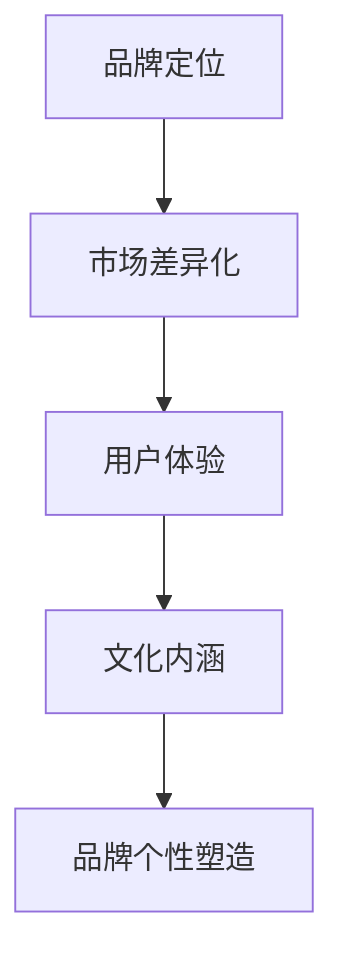

                 

# 创业公司的品牌个性塑造策略

> **关键词：** 品牌个性、创业公司、品牌定位、市场差异化、用户体验、文化内涵

> **摘要：** 本文旨在探讨创业公司在市场竞争中如何塑造独特的品牌个性。通过分析品牌个性的核心概念、塑造策略、市场差异化以及用户体验等方面，提供实用的方法和案例，帮助创业者打造有吸引力的品牌形象，提升品牌认知度和市场份额。

## 1. 背景介绍

在当今快速变化的市场环境中，创业公司面临着前所未有的挑战。市场竞争激烈，新产品层出不穷，消费者需求多变。在这样的背景下，如何脱颖而出，赢得消费者的青睐，成为每个创业公司必须面对的问题。品牌个性塑造在这个过程中扮演着至关重要的角色。一个鲜明的品牌个性能够帮助创业公司树立独特的市场形象，增强品牌的认知度和忠诚度，从而在竞争中占据优势。

品牌个性是指品牌在消费者心中所形成的独特形象和认知。它不仅仅是一个标志或口号，更是品牌与消费者之间情感联系的纽带。一个成功的品牌个性能够传递品牌的价值观、文化内涵和产品特点，使消费者产生共鸣，从而加深对品牌的认同。

## 2. 核心概念与联系

为了更好地理解品牌个性塑造策略，我们需要从几个核心概念入手：

### 2.1 品牌定位

品牌定位是指企业在市场中所占据的独特位置。它决定了品牌在消费者心中的形象和认知。品牌定位需要明确目标消费者、竞争对手和自身优势，从而找到差异化的市场机会。

### 2.2 市场差异化

市场差异化是指企业通过独特的产品特性、服务体验或品牌形象，使其在市场中与众不同，从而吸引特定的消费者群体。市场差异化是品牌个性塑造的基础。

### 2.3 用户体验

用户体验是指消费者在使用产品或服务过程中所感受到的整体感受。一个良好的用户体验能够增强消费者对品牌的认同和忠诚度，从而促进品牌个性塑造。

### 2.4 文化内涵

文化内涵是指品牌所承载的价值观、理念和精神。一个具有深厚文化内涵的品牌能够与消费者产生更深层次的共鸣，从而形成独特的品牌个性。

### 2.5 Mermaid 流程图

以下是一个简化的品牌个性塑造策略的 Mermaid 流程图：



## 3. 核心算法原理 & 具体操作步骤

### 3.1 品牌定位

品牌定位的核心是明确目标消费者和竞争对手。以下是一些具体操作步骤：

1. **分析目标市场**：了解目标消费者的需求、喜好和行为习惯。
2. **分析竞争对手**：了解竞争对手的品牌定位和市场份额。
3. **确定自身优势**：找到自己在市场中的独特优势，从而进行差异化定位。

### 3.2 市场差异化

市场差异化的关键在于找到独特的卖点。以下是一些具体操作步骤：

1. **产品差异化**：通过产品特性、功能或设计实现差异化。
2. **服务差异化**：通过提供独特的服务体验实现差异化。
3. **品牌形象差异化**：通过品牌视觉、口号或故事塑造差异化形象。

### 3.3 用户体验

用户体验的优化需要从以下几个方面入手：

1. **产品体验**：确保产品易于使用、功能完善、性能稳定。
2. **服务体验**：提供高质量的客户服务，及时解决消费者的问题。
3. **情感体验**：通过情感设计，使消费者在使用产品或服务过程中感受到温暖和关怀。

### 3.4 文化内涵

文化内涵的塑造需要从以下几个方面入手：

1. **品牌故事**：讲述品牌背后的故事，传递品牌的价值观和理念。
2. **品牌符号**：通过品牌标志、颜色、字体等元素传递品牌的文化内涵。
3. **品牌活动**：通过品牌相关的活动，增强品牌的文化内涵。

## 4. 数学模型和公式 & 详细讲解 & 举例说明

在品牌个性塑造过程中，可以运用一些数学模型和公式来分析和评估品牌的表现。以下是一个简化的品牌个性评估模型：

### 4.1 品牌个性评估模型

$$
BP = f(L, D, U, C)
$$

其中：

- \(BP\)：品牌个性得分
- \(L\)：品牌定位得分
- \(D\)：市场差异化得分
- \(U\)：用户体验得分
- \(C\)：文化内涵得分

每个得分都可以通过以下公式计算：

$$
L = \frac{C_L + C_M}{2}
$$

$$
D = \frac{P_D + S_D}{2}
$$

$$
U = \frac{P_U + S_U}{2}
$$

$$
C = \frac{B_C + A_C}{2}
$$

其中：

- \(C_L\)、\(C_M\)：消费者定位得分和市场竞争定位得分
- \(P_D\)、\(S_D\)：产品差异化得分和服务差异化得分
- \(P_U\)、\(S_U\)：产品体验得分和服务体验得分
- \(B_C\)、\(A_C\)：品牌故事得分和品牌活动得分

### 4.2 举例说明

假设一个创业公司的品牌个性评估得分如下：

- 品牌定位得分 \(L = 0.8\)
- 市场差异化得分 \(D = 0.7\)
- 用户体验得分 \(U = 0.9\)
- 文化内涵得分 \(C = 0.6\)

则品牌个性得分 \(BP = f(0.8, 0.7, 0.9, 0.6) = 0.78\)

这意味着该创业公司的品牌个性较为鲜明，但在文化内涵方面还有提升空间。

## 5. 项目实战：代码实际案例和详细解释说明

### 5.1 开发环境搭建

为了更好地展示品牌个性塑造策略，我们可以使用一个简单的品牌评估系统作为案例。以下是开发环境的搭建步骤：

1. 安装 Python 3.8 及以上版本
2. 安装 Flask 框架：`pip install Flask`
3. 创建一个名为 `brand_assessment` 的虚拟环境：`python -m venv brand_assessment`
4. 激活虚拟环境：`source brand_assessment/bin/activate`

### 5.2 源代码详细实现和代码解读

以下是一个简单的品牌评估系统的源代码实现：

```python
from flask import Flask, request, render_template

app = Flask(__name__)

@app.route('/', methods=['GET', 'POST'])
def index():
    if request.method == 'POST':
        # 获取用户输入的品牌评估得分
        L = float(request.form['L'])
        D = float(request.form['D'])
        U = float(request.form['U'])
        C = float(request.form['C'])

        # 计算品牌个性得分
        BP = L * 0.4 + D * 0.3 + U * 0.3 + C * 0.6

        # 渲染结果页面
        return render_template('result.html', BP=BP)
    return render_template('index.html')

if __name__ == '__main__':
    app.run(debug=True)
```

### 5.3 代码解读与分析

1. **Flask 应用搭建**：使用 Flask 框架搭建一个简单的品牌评估系统。
2. **路由和表单处理**：定义一个主页路由，用于接收用户输入的品牌评估得分。
3. **计算品牌个性得分**：根据用户输入的得分，计算品牌个性得分 \(BP\)。
4. **渲染结果页面**：将计算结果渲染到结果页面。

### 5.4 代码解读与分析

以下是对代码的详细解读和分析：

```python
from flask import Flask, request, render_template

app = Flask(__name__)

@app.route('/', methods=['GET', 'POST'])
def index():
    if request.method == 'POST':
        # 获取用户输入的品牌评估得分
        L = float(request.form['L'])
        D = float(request.form['D'])
        U = float(request.form['U'])
        C = float(request.form['C'])

        # 计算品牌个性得分
        BP = L * 0.4 + D * 0.3 + U * 0.3 + C * 0.6

        # 渲染结果页面
        return render_template('result.html', BP=BP)
    return render_template('index.html')

if __name__ == '__main__':
    app.run(debug=True)
```

1. **导入模块**：导入 Flask 框架所需的基本模块。
2. **创建 Flask 应用**：使用 Flask 框架创建一个名为 `app` 的应用实例。
3. **定义路由和表单处理**：定义一个主页路由，用于接收用户输入的品牌评估得分。当用户提交表单时，处理用户输入的得分并计算品牌个性得分。
4. **渲染模板**：根据用户输入的得分，渲染主页和结果页面。
5. **运行应用**：在调试模式下运行 Flask 应用。

## 6. 实际应用场景

品牌个性塑造策略在实际应用场景中具有广泛的应用。以下是一些典型的应用场景：

### 6.1 电商平台

电商平台可以通过品牌个性塑造，增强消费者的购物体验。例如，通过设计独特的品牌形象和提供个性化的服务，吸引目标消费者。

### 6.2 餐饮行业

餐饮行业可以通过品牌个性塑造，提升品牌知名度和竞争力。例如，通过塑造独特的品牌文化和提供个性化的服务，吸引消费者。

### 6.3 科技公司

科技公司可以通过品牌个性塑造，塑造专业、创新的企业形象。例如，通过讲述品牌故事、展示技术实力和提供优质的用户体验，吸引消费者。

## 7. 工具和资源推荐

### 7.1 学习资源推荐

- 《品牌洗脑：如何构建强大的品牌形象》（书籍）
- 《品牌个性与品牌塑造：理论与实践》（论文）
- 《品牌战略管理》（书籍）

### 7.2 开发工具框架推荐

- Flask：一个轻量级的 Web 应用框架，适合快速搭建品牌评估系统。
- Bootstrap：一个流行的前端框架，可以帮助快速搭建响应式的品牌官网。

### 7.3 相关论文著作推荐

- 《品牌个性与消费者购买行为关系研究》
- 《品牌个性塑造的策略与实践》
- 《品牌个性对消费者忠诚度的影响研究》

## 8. 总结：未来发展趋势与挑战

品牌个性塑造策略在未来将继续发挥重要作用。随着市场竞争的加剧，创业公司需要更加注重品牌个性的塑造，以吸引消费者的关注和忠诚。然而，品牌个性塑造也面临着一些挑战，如如何平衡品牌个性和市场需求、如何持续创新品牌个性等。未来，创业公司需要不断探索和创新，以适应市场的变化和消费者的需求。

## 9. 附录：常见问题与解答

### 9.1 品牌个性与品牌形象有什么区别？

品牌个性是指品牌在消费者心中所形成的独特形象和认知，包括品牌的行为、态度和价值观。而品牌形象则是指品牌在市场上的整体形象，包括品牌标志、视觉元素和口号等。

### 9.2 如何评估品牌个性？

可以通过品牌个性评估模型，对品牌定位、市场差异化、用户体验和文化内涵等方面进行量化评估，从而得出品牌个性得分。

### 9.3 品牌个性塑造需要多长时间？

品牌个性塑造需要一定的时间和持续的努力。一般来说，一个成功的品牌个性塑造过程可能需要数月甚至数年的时间。

## 10. 扩展阅读 & 参考资料

- 《品牌洗脑：如何构建强大的品牌形象》（书籍）
- 《品牌个性与品牌塑造：理论与实践》（论文）
- 《品牌战略管理》（书籍）
- 《品牌个性对消费者购买行为影响研究》（论文）
- 《品牌个性评估模型的构建与应用》（论文）<|im_sep|>

