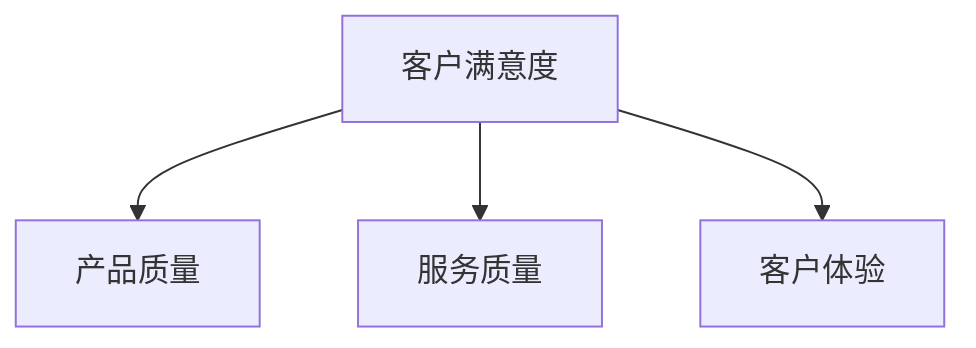
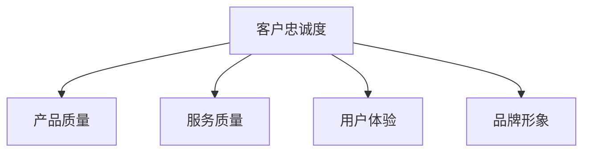
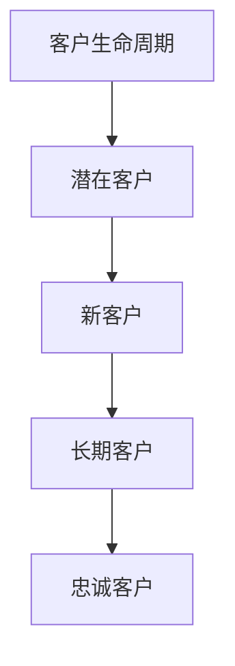

                 

# 创业公司的客户成功策略

## 摘要

在快速发展的科技行业，创业公司要想脱颖而出并保持竞争优势，客户成功策略至关重要。本文将深入探讨创业公司如何通过一系列精心设计的策略，实现客户满意度和忠诚度的提升，从而在竞争激烈的市场中站稳脚跟。我们将从背景介绍、核心概念、核心算法、数学模型、项目实战、实际应用场景、工具和资源推荐以及未来发展趋势等方面，详细分析客户成功策略的各个方面。通过本文的阅读，读者将全面了解客户成功策略的内涵和实践方法，为创业公司的持续发展提供有力支持。

## 1. 背景介绍

随着互联网的普及和科技的飞速发展，创业公司如雨后春笋般涌现。这些公司通常拥有创新的技术和独特的产品，但往往面临激烈的市场竞争和资源有限的挑战。在这样的大环境下，如何赢得客户，提高客户满意度和忠诚度，成为创业公司能否成功的关键因素。

客户成功（Customer Success）作为近年来备受关注的管理理念，强调通过满足客户需求、提升客户体验和建立长期合作关系，实现客户价值的最大化。客户成功策略不仅是企业成功的关键，更是创业公司生存和发展的基石。

本文将从以下几个方面展开讨论：

- 核心概念与联系：介绍客户成功策略中的关键概念，如客户满意度、客户忠诚度和客户生命周期等，并通过Mermaid流程图展示它们之间的联系。
- 核心算法原理与具体操作步骤：探讨如何利用数据分析、机器学习等算法，实现客户成功的量化评估和策略优化。
- 数学模型和公式：介绍客户成功策略中的相关数学模型和公式，如客户终身价值（CLV）计算方法，以及如何通过这些模型指导实际业务决策。
- 项目实战：通过实际代码案例，演示如何应用客户成功策略，实现业务增长和客户满意度的提升。
- 实际应用场景：分析不同行业和业务场景下的客户成功策略，提供具体实践案例和解决方案。
- 工具和资源推荐：介绍用于客户成功策略实施的相关工具和资源，包括数据分析工具、客户关系管理（CRM）系统等。
- 总结：总结客户成功策略的关键要素和未来发展趋势，探讨创业公司如何应对挑战，持续提升客户成功水平。

通过本文的阅读，读者将深入了解客户成功策略的内涵和实践方法，为创业公司的成功奠定坚实基础。

## 2. 核心概念与联系

在探讨客户成功策略之前，我们需要了解几个核心概念，包括客户满意度、客户忠诚度和客户生命周期。这些概念之间有着密切的联系，共同构成了客户成功策略的理论基础。

### 2.1 客户满意度

客户满意度是衡量客户对产品或服务满意程度的重要指标。它不仅反映了客户当前的使用体验，还预示了未来可能的购买行为。客户满意度通常通过问卷调查、反馈机制等方式收集数据，然后进行量化分析。

客户满意度的影响因素包括：

- 产品质量：产品功能是否完备，性能是否稳定，是影响客户满意度的重要因素。
- 服务质量：客户在购买和使用产品过程中遇到的任何问题，是否能够得到及时、专业的解决，也是影响客户满意度的重要因素。
- 客户体验：从客户接触到产品到购买、使用和售后服务的全过程，体验的优劣直接影响客户满意度。

Mermaid流程图如下：



### 2.2 客户忠诚度

客户忠诚度是客户长期使用某一品牌或产品的行为倾向。高忠诚度的客户不仅会重复购买，还会为品牌宣传、推荐新客户。客户忠诚度通常通过客户保留率、复购率、推荐率等指标衡量。

客户忠诚度的影响因素包括：

- 产品质量：高质量的产品能够确保客户长期使用，降低更换品牌的可能性。
- 服务质量：优质的售后服务能够解决客户的问题，提高客户对品牌的信任和满意度。
- 用户体验：良好的用户体验，如便捷的操作流程、友好的界面设计等，能够提升客户使用产品的愉悦感。
- 品牌形象：强大的品牌形象能够增强客户的品牌认同感和归属感。

Mermaid流程图如下：



### 2.3 客户生命周期

客户生命周期是指客户与企业建立关系的全过程，包括从潜在客户到客户、再到忠诚客户的整个过程。客户生命周期的不同阶段，客户需求和期望有所不同，企业需要采取不同的策略。

客户生命周期的阶段包括：

- 潜在客户：潜在客户是指那些对企业产品或服务有兴趣，但尚未购买的群体。
- 新客户：新客户是指刚刚购买企业产品或服务的客户。
- 长期客户：长期客户是指持续购买企业产品或服务的客户。
- 忠诚客户：忠诚客户是指高度满意并长期支持企业品牌和产品的客户。

Mermaid流程图如下：



通过上述核心概念和联系的阐述，我们可以更好地理解客户成功策略的实施方法和关键要素。接下来，我们将探讨如何利用这些概念，构建一个完整的客户成功策略框架。

## 2.1 客户满意度的计算方法

客户满意度是客户成功策略中的核心指标，它反映了客户对企业产品或服务的整体满意程度。有效的客户满意度计算方法不仅能够帮助企业管理层实时掌握客户反馈，还能够为企业提供有针对性的改进措施。以下是几种常用的客户满意度计算方法：

### 2.1.1 评分法

评分法是最简单也最直观的一种客户满意度计算方法。通常，企业会设计一个评分量表，如1-10分的评分系统，让客户对企业产品或服务进行评价。具体计算方法如下：

$$
\text{客户满意度} = \frac{\sum_{i=1}^{n} \text{客户i的评分}}{n}
$$

其中，$n$ 是参与评分的客户总数。

### 2.1.2 百分比法

百分比法是对评分法的一种补充。它通过计算客户对产品或服务的正面评价和负面评价的百分比，来衡量客户满意度。具体计算方法如下：

$$
\text{客户满意度} = \frac{\text{正面评价总数}}{\text{总评价数}} \times 100\%
$$

正面评价通常定义为对产品或服务的评分在某个特定阈值以上（例如7分以上），而负面评价则定义为低于这个阈值。

### 2.1.3 标准化评分法

标准化评分法是对评分法的一种改进。它通过将客户的评分转换为标准化的得分，来消除不同评分系统之间的差异。具体计算方法如下：

$$
\text{标准化得分} = \frac{\text{客户评分} - \text{平均评分}}{\text{评分标准差}}
$$

然后，将所有客户的标准化得分求平均值，即可得到客户满意度：

$$
\text{客户满意度} = \frac{\sum_{i=1}^{n} \text{客户i的标准化得分}}{n}
$$

### 2.1.4 聚类分析法

聚类分析法是一种基于数据挖掘的方法，它通过将客户按照满意度相似度进行分组，来识别高满意度客户和低满意度客户。具体计算方法如下：

1. 收集客户满意度数据，包括评分和购买行为等。
2. 使用聚类算法（如K-means算法），将客户数据划分为若干个类别。
3. 分析每个类别的特征，识别高满意度客户和低满意度客户。

聚类分析法能够帮助企业更准确地识别客户群体，从而制定更有针对性的客户满意度提升策略。

### 2.1.5 顾客体验评分模型

顾客体验评分模型是一种综合性的客户满意度计算方法，它结合了多个维度的数据，如产品质量、服务质量和客户体验等。具体计算方法如下：

$$
\text{客户满意度} = \frac{\sum_{i=1}^{m} w_i \cdot \text{维度i的得分}}{\sum_{i=1}^{m} w_i}
$$

其中，$w_i$ 是第 $i$ 个维度的权重，$\text{维度i的得分}$ 是第 $i$ 个维度的评分。

通过上述计算方法，企业可以全面、准确地评估客户满意度，从而为改进产品和服务提供有力支持。接下来，我们将探讨客户忠诚度的计算方法。

### 2.2 客户忠诚度的计算方法

客户忠诚度是客户成功策略中的另一个关键指标，它反映了客户对企业的长期价值和支持。有效的客户忠诚度计算方法能够帮助企业识别高价值客户，制定针对性的维护策略。以下是几种常用的客户忠诚度计算方法：

### 2.2.1 客户保留率

客户保留率是最直观的一种客户忠诚度计算方法，它衡量了在一定时间内，客户继续使用企业产品或服务的比例。具体计算方法如下：

$$
\text{客户保留率} = \frac{\text{当前时间点保留客户数}}{\text{初始客户数}} \times 100\%
$$

例如，假设一家公司在一月份有100名客户，到了三月份，有80名客户仍然在使用其产品，则三月份的客户保留率为：

$$
\text{客户保留率} = \frac{80}{100} \times 100\% = 80\%
$$

客户保留率越高，说明客户对企业的忠诚度越高。

### 2.2.2 复购率

复购率是衡量客户是否再次购买企业产品或服务的指标。它通常用于分析客户在一段时间内的重复购买行为。具体计算方法如下：

$$
\text{复购率} = \frac{\text{重复购买客户数}}{\text{总客户数}} \times 100\%
$$

例如，假设一家公司有1000名客户，在一个月内有300名客户再次购买了其产品，则该月的复购率为：

$$
\text{复购率} = \frac{300}{1000} \times 100\% = 30\%
$$

复购率越高，说明客户对企业产品的认可度越高。

### 2.2.3 推荐率

推荐率是衡量客户对品牌进行口碑传播的指标。高推荐率表明客户对品牌满意度高，愿意为企业宣传。具体计算方法如下：

$$
\text{推荐率} = \frac{\text{主动推荐客户数}}{\text{总客户数}} \times 100\%
$$

例如，假设一家公司有1000名客户，其中有200名客户在社交媒体上主动推荐了其产品，则推荐率为：

$$
\text{推荐率} = \frac{200}{1000} \times 100\% = 20\%
$$

推荐率越高，说明客户对品牌的忠诚度越高。

### 2.2.4 客户生命周期价值

客户生命周期价值（Customer Lifetime Value，CLV）是客户在整个生命周期中为企业带来的预期收益。它综合考虑了客户保留率、复购率和推荐率等因素，是衡量客户忠诚度的重要指标。具体计算方法如下：

$$
\text{CLV} = \text{年收益} \times \frac{1}{\text{客户保留率}} \times \frac{1}{(1+\text{年化收益率})^{\text{客户生命周期}}}
$$

其中，年收益是指客户每年为企业带来的收益，客户保留率和年化收益率需要根据实际情况进行估算。

例如，假设一家公司的年收益为10万元，客户保留率为80%，年化收益率为10%，客户生命周期为5年，则该客户的CLV为：

$$
\text{CLV} = 10\text{万元} \times \frac{1}{0.8} \times \frac{1}{(1+0.1)^5} = 12.92\text{万元}
$$

客户生命周期价值越高，说明客户对企业的长期价值越大。

通过上述计算方法，企业可以全面、准确地评估客户忠诚度，从而制定针对性的维护策略，提升客户满意度和忠诚度。接下来，我们将探讨客户生命周期的不同阶段及其管理策略。

### 2.3 客户生命周期的不同阶段及其管理策略

客户生命周期是指客户与企业建立关系的全过程，从潜在客户到忠诚客户的各个阶段。了解客户生命周期的不同阶段及其特点，有助于企业制定有针对性的客户成功策略，提升客户满意度和忠诚度。

#### 2.3.1 潜在客户阶段

潜在客户是指那些对企业产品或服务有兴趣，但尚未进行购买的人群。在这个阶段，客户对企业了解有限，需求尚未明确。企业需要通过营销活动、内容营销等方式，吸引潜在客户，引导其了解产品，从而提高转化率。

管理策略：

- 营销推广：通过SEO、社交媒体、广告投放等手段，提高企业品牌曝光度，吸引潜在客户。
- 内容营销：发布高质量、有价值的内容，如博客文章、视频教程、案例分析等，提升潜在客户的信任度和兴趣。
- 互动交流：建立微信群、QQ群等社群，与潜在客户进行互动交流，解答疑问，建立良好的客户关系。

#### 2.3.2 新客户阶段

新客户是指刚刚购买企业产品或服务的客户。在这个阶段，客户对企业有一定了解，但尚未完全信任。企业需要通过优质的客户服务，确保客户顺利使用产品，提升满意度，从而增加复购率。

管理策略：

- 售后服务：提供及时、专业的售后服务，解决客户在使用过程中遇到的问题，提高客户满意度。
- 个性化关怀：根据客户购买行为和需求，提供个性化的产品推荐和优惠活动，增强客户粘性。
- 客户培训：组织线上或线下培训课程，帮助客户更好地了解和使用产品，提升客户使用体验。

#### 2.3.3 长期客户阶段

长期客户是指持续购买企业产品或服务的客户。在这个阶段，客户对企业有较高的信任度和满意度，但仍有潜在的需求和改进空间。企业需要通过持续的服务和产品优化，提升客户忠诚度，保持长期合作关系。

管理策略：

- 定期沟通：定期与客户保持沟通，了解客户需求和反馈，及时调整产品和服务策略。
- 客户活动：组织线下或线上活动，如产品发布会、用户研讨会等，增强客户归属感和忠诚度。
- 跨部门协作：协调不同部门，共同关注客户需求，提供一站式解决方案，提升客户满意度。

#### 2.3.4 忠诚客户阶段

忠诚客户是指高度满意并长期支持企业品牌和产品的客户。在这个阶段，客户不仅自己持续购买，还会为企业宣传，带来新的客户。企业需要通过激励机制，维护好这些忠诚客户，促进持续增长。

管理策略：

- 会员制度：建立会员制度，为忠诚客户提供专属优惠、积分兑换等福利，增强客户粘性。
- 用户口碑：鼓励忠诚客户在社交媒体、论坛等渠道分享使用体验，提升品牌口碑。
- 定制服务：根据忠诚客户的特殊需求，提供定制化的产品和服务，提升客户满意度。

通过以上策略，企业可以有效地管理客户生命周期的各个阶段，提升客户满意度和忠诚度，从而实现持续增长。接下来，我们将探讨如何构建一个完整的客户成功策略框架。

### 2.4 客户成功策略框架的构建方法

构建一个高效的客户成功策略框架是确保企业实现长期增长和客户满意度的关键。以下是一个详细的构建方法，包括关键步骤和实施要点：

#### 2.4.1 确定目标

明确目标是对客户成功策略进行有效规划的第一步。企业需要设定具体的、可量化的目标，如提高客户满意度、降低客户流失率、增加客户生命周期价值等。目标应与企业的整体战略和业务目标相一致。

实施要点：

- 确定关键绩效指标（KPI）：选择能够衡量目标达成度的指标，如客户满意度得分、客户保留率、复购率等。
- 与业务目标对齐：确保客户成功目标与企业的整体战略和业务目标紧密相关，形成合力。

#### 2.4.2 分析客户

深入分析客户是制定有针对性策略的基础。通过收集和分析客户数据，企业可以了解客户的需求、行为和偏好，从而为策略制定提供有力支持。

实施要点：

- 数据收集：利用CRM系统、客户反馈工具等收集客户数据，包括购买行为、互动记录、反馈等。
- 数据分析：利用数据挖掘和统计分析方法，分析客户的特征和需求，识别高价值客户和潜在风险客户。
- 客户细分：根据客户特征和需求，将客户划分为不同的细分市场，为每个细分市场制定相应的策略。

#### 2.4.3 设计客户旅程

客户旅程是指客户从接触企业到购买、使用和离开的全过程。设计一个清晰、流畅的客户旅程有助于提升客户满意度和忠诚度。

实施要点：

- 创建客户旅程地图：绘制客户旅程的各个阶段，包括潜在客户、新客户、长期客户和忠诚客户等。
- 分析客户痛点：识别客户在不同阶段的痛点，如购买决策困难、产品使用不顺畅、售后服务不到位等。
- 优化客户体验：针对客户痛点，制定解决方案，优化客户旅程，提升客户满意度。

#### 2.4.4 制定策略

在明确目标和分析客户的基础上，制定具体的客户成功策略。策略应包括客户获取、客户维护和客户增长的各个方面。

实施要点：

- 制定营销策略：根据客户特征和需求，制定有针对性的营销策略，如内容营销、社交营销、广告投放等。
- 提供优质服务：确保客户在购买、使用和售后服务过程中得到优质的服务，提升客户满意度。
- 维护客户关系：建立长期稳定的客户关系，通过定期沟通、客户活动、会员制度等手段，增强客户粘性。

#### 2.4.5 实施和监控

制定策略只是第一步，实施和监控策略的执行效果至关重要。通过定期评估和调整，确保策略能够持续提升客户成功水平。

实施要点：

- 制定实施计划：明确策略实施的时间表、责任人和关键里程碑，确保策略顺利执行。
- 监控关键指标：跟踪关键绩效指标（KPI）的执行情况，及时发现问题和调整策略。
- 定期评估和调整：定期评估客户成功策略的实施效果，根据评估结果进行优化和调整。

通过以上步骤，企业可以构建一个完整的客户成功策略框架，实现客户满意度和忠诚度的持续提升。接下来，我们将探讨如何利用核心算法和数学模型，量化客户成功策略的效果。

### 3. 核心算法原理与具体操作步骤

在客户成功策略的实践中，核心算法和数学模型起着至关重要的作用。通过这些算法和模型，企业可以量化客户行为，预测客户流失，优化客户体验，从而提升整体客户成功水平。以下是一些常用的核心算法原理和具体操作步骤：

#### 3.1 客户流失预测算法

客户流失预测算法可以帮助企业提前识别可能流失的客户，从而采取相应的措施进行干预。常用的流失预测算法包括逻辑回归、决策树、随机森林和XGBoost等。

**3.1.1 逻辑回归**

逻辑回归是一种经典的二分类预测模型，它通过建立客户流失概率与多个特征变量之间的线性关系，预测客户是否流失。

**具体操作步骤：**

1. 数据收集：收集客户的基本信息、购买行为、服务记录等数据。
2. 数据预处理：对缺失值、异常值进行处理，对数值特征进行归一化或标准化。
3. 特征工程：选取对客户流失有显著影响的特征，如购买频率、服务满意度等。
4. 建立模型：使用逻辑回归算法建立流失预测模型。
5. 模型评估：通过交叉验证和AUC（Area Under Curve）评估模型效果。
6. 预测应用：对客户数据集进行预测，识别高风险流失客户。

**3.1.2 决策树**

决策树是一种基于特征进行分级的预测模型，它通过树形结构模拟决策过程，判断客户是否流失。

**具体操作步骤：**

1. 数据收集：同逻辑回归。
2. 数据预处理：同逻辑回归。
3. 特征工程：同逻辑回归。
4. 建立模型：使用决策树算法建立流失预测模型。
5. 模型评估：通过交叉验证和准确率、精确率、召回率等指标评估模型效果。
6. 预测应用：同逻辑回归。

**3.1.3 随机森林**

随机森林是一种基于决策树的集成模型，它通过构建多个决策树，结合它们的预测结果，提高预测准确率。

**具体操作步骤：**

1. 数据收集：同逻辑回归。
2. 数据预处理：同逻辑回归。
3. 特征工程：同逻辑回归。
4. 建立模型：使用随机森林算法建立流失预测模型。
5. 模型评估：同决策树。
6. 预测应用：同逻辑回归。

**3.1.4 XGBoost**

XGBoost是一种基于梯度提升树（GBDT）的算法，它通过迭代优化，提高预测模型的准确性和效率。

**具体操作步骤：**

1. 数据收集：同逻辑回归。
2. 数据预处理：同逻辑回归。
3. 特征工程：同逻辑回归。
4. 建立模型：使用XGBoost算法建立流失预测模型。
5. 模型评估：同决策树。
6. 预测应用：同逻辑回归。

#### 3.2 客户细分算法

客户细分算法可以帮助企业识别不同类型的客户，从而制定有针对性的营销和服务策略。常用的客户细分算法包括K-means聚类、层次聚类和因子分析等。

**3.2.1 K-means聚类**

K-means聚类是一种基于距离度量的聚类算法，它通过迭代优化，将客户划分为若干个聚类，每个聚类内的客户特征相似度较高。

**具体操作步骤：**

1. 数据收集：收集客户的基本信息、购买行为、服务记录等数据。
2. 数据预处理：对缺失值、异常值进行处理，对数值特征进行归一化或标准化。
3. 特征选择：选取对客户分类有显著影响的特征。
4. 建立模型：使用K-means聚类算法进行客户细分。
5. 模型评估：通过轮廓系数、内部距离等指标评估聚类效果。
6. 应用细分结果：根据细分结果，制定有针对性的营销和服务策略。

**3.2.2 层次聚类

层次聚类是一种基于层次结构的聚类算法，它通过逐步合并或分割聚类，构建一个层次聚类模型。

**具体操作步骤：**

1. 数据收集：同K-means聚类。
2. 数据预处理：同K-means聚类。
3. 特征选择：同K-means聚类。
4. 建立模型：使用层次聚类算法进行客户细分。
5. 模型评估：同K-means聚类。
6. 应用细分结果：同K-means聚类。

**3.2.3 因子分析

因子分析是一种通过降维技术，将多个特征变量归结为少数几个因子变量的算法。

**具体操作步骤：**

1. 数据收集：同K-means聚类。
2. 数据预处理：同K-means聚类。
3. 特征选择：同K-means聚类。
4. 建立模型：使用因子分析算法进行客户细分。
5. 模型评估：通过因子负荷、因子方差贡献等指标评估模型效果。
6. 应用细分结果：同K-means聚类。

通过以上核心算法和具体操作步骤，企业可以更好地量化客户行为，预测客户流失，优化客户体验，从而提升整体客户成功水平。接下来，我们将探讨客户成功的数学模型和公式，以帮助读者深入理解客户成功策略的量化方法。

### 4. 数学模型和公式

在客户成功策略的实践中，数学模型和公式提供了量化和分析客户行为、需求和价值的重要工具。以下是一些关键的数学模型和公式，包括客户终身价值（CLV）的计算方法、客户满意度（CSAT）和净推荐值（NPS）的公式，以及这些指标如何指导企业决策。

#### 4.1 客户终身价值（CLV）

客户终身价值（Customer Lifetime Value，CLV）是衡量单个客户为企业带来收益的能力的重要指标。它通过预测客户在生命周期内为企业带来的总收益，帮助企业确定哪些客户最有价值。

**CLV计算公式：**

$$
\text{CLV} = \frac{\text{年收益} \times \frac{1}{\text{客户保留率}} \times \frac{1}{(1+\text{年化收益率})^{\text{客户生命周期}}}}{\text{营销成本}}
$$

其中：

- 年收益：客户在一年内为企业带来的总收益。
- 客户保留率：客户在一定时间内继续使用企业产品或服务的比例。
- 年化收益率：客户为企业带来的收益的年化收益率。
- 客户生命周期：客户与企业保持业务关系的平均时间。
- 营销成本：吸引和保留客户所需的成本。

**如何使用CLV指导决策：**

- 高CLV客户：企业应投入更多资源，提供优质服务和个性化体验，以维持客户关系。
- 低CLV客户：企业可以考虑优化产品或服务，提高客户满意度，以提升收益。

#### 4.2 客户满意度（CSAT）

客户满意度（Customer Satisfaction，CSAT）是衡量客户对企业产品或服务满意程度的指标。通过计算正面反馈与总反馈的比例，企业可以了解客户的整体满意度。

**CSAT计算公式：**

$$
\text{CSAT} = \frac{\text{正面反馈总数}}{\text{总反馈总数}} \times 100\%
$$

其中：

- 正面反馈总数：客户对企业产品或服务表示满意的反馈数量。
- 总反馈总数：所有客户的反馈数量。

**如何使用CSAT指导决策：**

- 高CSAT：企业应保持当前的产品和服务质量，不断优化客户体验。
- 低CSAT：企业应分析客户反馈，找出问题根源，进行针对性改进。

#### 4.3 净推荐值（NPS）

净推荐值（Net Promoter Score，NPS）是衡量客户忠诚度和推荐意愿的重要指标。通过计算推荐者和非推荐者之间的差异，企业可以了解客户的忠诚度。

**NPS计算公式：**

$$
\text{NPS} = \frac{\text{推荐者总数} - \text{非推荐者总数}}{\text{总反馈总数}} \times 100\%
$$

其中：

- 推荐者总数：表示愿意向他人推荐企业产品或服务的客户数量。
- 非推荐者总数：表示不会向他人推荐企业产品或服务的客户数量。

**如何使用NPS指导决策：**

- 高NPS：企业应关注忠诚客户，通过定制化服务和体验，提升客户忠诚度。
- 低NPS：企业应分析客户反馈，找出导致不满意的因素，进行改进。

#### 4.4 客户保留率（Churn Rate）

客户保留率（Churn Rate）是衡量客户流失比例的指标，它反映了客户对企业的忠诚度。

**客户保留率计算公式：**

$$
\text{客户保留率} = \frac{\text{当前时间点保留客户数}}{\text{初始客户数}} \times 100\%
$$

**如何使用客户保留率指导决策：**

- 高保留率：企业应维持现有的客户成功策略，加强客户关系管理。
- 低保留率：企业应分析流失原因，采取针对性措施，降低客户流失率。

#### 4.5 客户获取成本（Customer Acquisition Cost，CAC）

客户获取成本（Customer Acquisition Cost，CAC）是衡量企业获取一个新客户所需投入的成本。它帮助企业评估市场营销活动的效果和投资回报率。

**CAC计算公式：**

$$
\text{CAC} = \frac{\text{总营销成本}}{\text{新增客户数}}
$$

**如何使用CAC指导决策：**

- 低CAC：企业应增加营销投入，扩大客户基数。
- 高CAC：企业应优化营销策略，降低获取成本。

通过以上数学模型和公式的计算和应用，企业可以更科学、系统地评估客户价值、客户满意度和客户忠诚度，从而制定更为有效的客户成功策略。接下来，我们将通过一个实际案例，演示如何应用这些模型和公式，实现客户成功的提升。

### 5. 项目实战：代码实际案例和详细解释说明

为了更好地理解客户成功策略的实际应用，我们将通过一个实际案例，详细展示如何使用Python和Scikit-learn库进行客户流失预测，并解释代码中的关键步骤和实现细节。

#### 5.1 开发环境搭建

首先，我们需要搭建一个Python开发环境，并安装所需的库。以下是开发环境的搭建步骤：

1. 安装Python：从官方网站下载并安装Python 3.8或更高版本。
2. 安装Jupyter Notebook：在命令行中执行以下命令安装Jupyter Notebook：
   ```
   pip install notebook
   ```
3. 安装Scikit-learn：在命令行中执行以下命令安装Scikit-learn：
   ```
   pip install scikit-learn
   ```

#### 5.2 源代码详细实现和代码解读

以下是客户流失预测的完整代码实现，我们将逐一解释代码中的关键部分。

```python
# 导入所需的库
import pandas as pd
import numpy as np
from sklearn.model_selection import train_test_split
from sklearn.preprocessing import StandardScaler
from sklearn.ensemble import RandomForestClassifier
from sklearn.metrics import accuracy_score, classification_report

# 加载数据集
data = pd.read_csv('customer_data.csv')

# 数据预处理
# 删除含有缺失值的记录
data.dropna(inplace=True)

# 将标签转换为数值型
data['Churn'] = data['Churn'].map({0: 0, 1: 1})

# 分离特征和标签
X = data.drop(['Churn'], axis=1)
y = data['Churn']

# 划分训练集和测试集
X_train, X_test, y_train, y_test = train_test_split(X, y, test_size=0.2, random_state=42)

# 特征缩放
scaler = StandardScaler()
X_train_scaled = scaler.fit_transform(X_train)
X_test_scaled = scaler.transform(X_test)

# 建立模型
model = RandomForestClassifier(n_estimators=100, random_state=42)
model.fit(X_train_scaled, y_train)

# 预测
y_pred = model.predict(X_test_scaled)

# 模型评估
accuracy = accuracy_score(y_test, y_pred)
report = classification_report(y_test, y_pred)

print(f"Accuracy: {accuracy}")
print(f"Classification Report:\n{report}")
```

**代码解读：**

1. **数据加载和预处理：**
   - 使用Pandas库加载数据集。
   - 删除含有缺失值的记录，确保数据完整性。
   - 将标签（Churn）转换为数值型，便于模型处理。

2. **特征和标签分离：**
   - 分离特征矩阵（X）和标签向量（y），为模型训练做准备。

3. **训练集和测试集划分：**
   - 使用Scikit-learn库的`train_test_split`函数，将数据集划分为训练集和测试集，测试集用于评估模型性能。

4. **特征缩放：**
   - 使用StandardScaler对特征进行缩放，提高模型训练效果。

5. **模型建立和训练：**
   - 使用随机森林（RandomForestClassifier）建立模型，随机森林是一种集成学习方法，通过构建多个决策树来提高预测准确率。
   - 使用`fit`方法训练模型。

6. **模型预测：**
   - 使用`predict`方法对测试集进行预测。

7. **模型评估：**
   - 使用`accuracy_score`计算模型准确率。
   - 使用`classification_report`生成分类报告，包括精确率、召回率和F1分数等指标。

#### 5.3 代码解读与分析

以下是代码的逐行解读和分析：

1. **导入库：**
   - Pandas、NumPy和Scikit-learn库是Python进行数据处理和机器学习的基础库。
   
2. **加载数据集：**
   - `pd.read_csv('customer_data.csv')`：使用Pandas库加载数据集。

3. **数据预处理：**
   - `data.dropna(inplace=True)`：删除含有缺失值的记录。
   - `data['Churn'] = data['Churn'].map({0: 0, 1: 1})`：将标签（Churn）转换为数值型。

4. **特征和标签分离：**
   - `X = data.drop(['Churn'], axis=1)`：分离特征矩阵。
   - `y = data['Churn']`：分离标签向量。

5. **训练集和测试集划分：**
   - `train_test_split(X, y, test_size=0.2, random_state=42)`：划分训练集和测试集。

6. **特征缩放：**
   - `scaler = StandardScaler()`：创建特征缩放器。
   - `scaler.fit_transform(X_train)`：对训练集特征进行缩放。
   - `scaler.transform(X_test)`：对测试集特征进行缩放。

7. **模型建立和训练：**
   - `model = RandomForestClassifier(n_estimators=100, random_state=42)`：创建随机森林模型。
   - `model.fit(X_train_scaled, y_train)`：训练模型。

8. **模型预测：**
   - `y_pred = model.predict(X_test_scaled)`：对测试集进行预测。

9. **模型评估：**
   - `accuracy_score(y_test, y_pred)`：计算模型准确率。
   - `classification_report(y_test, y_pred)`：生成分类报告。

通过这个实际案例，我们展示了如何使用Python和Scikit-learn库进行客户流失预测。代码中的关键步骤和实现细节为读者提供了实际操作的经验，有助于更好地理解和应用客户成功策略。

### 6. 实际应用场景

客户成功策略在不同行业和业务场景中的应用有所不同，但核心目标是提升客户满意度和忠诚度，从而实现业务增长。以下是一些具体的实际应用场景，以及相应的策略和实践案例。

#### 6.1 SaaS行业

在SaaS（Software as a Service）行业，客户成功策略尤为重要。因为SaaS产品通常涉及长期订阅，客户满意度和留存率直接关系到企业的收入和增长。

**应用策略：**

- **产品培训和服务支持**：提供详细的产品使用教程、在线帮助文档和定期培训课程，帮助客户充分利用产品功能。
- **个性化体验**：根据客户的使用行为和需求，提供定制化的产品设置和功能，提升客户使用体验。
- **定期反馈收集**：通过定期问卷调查、用户访谈等方式，收集客户反馈，及时调整产品和服务。

**实践案例：** 
Salesforce通过其客户成功团队，定期与客户进行一对一沟通，了解客户需求，提供定制化的解决方案，从而提升了客户满意度和忠诚度。

#### 6.2 零售行业

在零售行业，客户成功策略主要关注提升客户购物体验和增加复购率。

**应用策略：**

- **精准营销**：通过数据分析，识别高价值客户和潜在客户，进行精准营销，提高转化率。
- **个性化推荐**：基于客户的购买历史和偏好，提供个性化的产品推荐，增加购物车中的商品数量。
- **客户忠诚计划**：推出积分兑换、会员折扣等忠诚计划，鼓励客户复购。

**实践案例：** 
Amazon通过其个性化推荐系统，根据客户的浏览和购买历史，推荐相关的产品，从而提高了客户复购率和满意度。

#### 6.3 金融行业

在金融行业，客户成功策略侧重于风险管理和提升客户信任。

**应用策略：**

- **风险评估和预警**：通过大数据和机器学习技术，对客户行为进行实时分析，识别潜在风险，提前预警。
- **客户关怀和咨询**：提供专业的理财顾问服务，帮助客户制定合理的财务规划，增强客户信任。
- **定制化金融产品**：根据客户需求，推出定制化的金融产品和服务，满足不同客户群体的需求。

**实践案例：** 
摩根大通（JPMorgan）通过其智能理财平台，为客户提供个性化的理财建议，提高了客户满意度和忠诚度。

#### 6.4 教育行业

在教育行业，客户成功策略旨在提升学习效果和客户满意度。

**应用策略：**

- **学习路径设计**：根据学员的学习进度和知识掌握情况，设计个性化的学习路径，提升学习效果。
- **在线辅导和互动**：提供实时在线辅导和互动课程，解决学员在学习过程中遇到的问题。
- **学习评估和反馈**：定期进行学习评估，提供详细的反馈报告，帮助学员了解自己的学习情况。

**实践案例：** 
Coursera通过其个性化学习平台，根据学员的学习进度和偏好，推荐相关的课程和资源，从而提高了学员的学习满意度和效果。

#### 6.5 健康科技行业

在健康科技行业，客户成功策略主要关注提升客户健康管理和满意度。

**应用策略：**

- **健康数据分析**：通过收集和分析客户的健康数据，提供个性化的健康建议和干预方案。
- **远程医疗服务**：提供远程医疗咨询和诊断服务，方便客户及时获取专业医疗支持。
- **健康活动促进**：组织线上或线下的健康活动，如健身课程、健康讲座等，增强客户互动和参与度。

**实践案例：** 
MyFitnessPal通过其健康数据分析平台，根据客户的饮食和运动数据，提供个性化的健康建议和健身计划，从而提高了客户的健康满意度和忠诚度。

通过以上实际应用场景，我们可以看到客户成功策略在不同行业和业务场景中的多样性。企业可以根据自身的特点和需求，灵活应用这些策略，实现客户满意度和忠诚度的提升。

### 7. 工具和资源推荐

为了有效地实施客户成功策略，企业需要依赖一系列的工具和资源。以下是一些推荐的工具和资源，包括学习资源、开发工具和框架，以及相关论文著作，以帮助读者深入了解和掌握客户成功策略。

#### 7.1 学习资源推荐

1. **书籍：**
   - 《客户成功：创建和衡量客户成功计划》
   - 《客户成功战略：构建和执行客户成功计划》
   - 《客户成功管理：理论、实践和案例研究》

2. **在线课程：**
   - Coursera上的《客户成功管理》课程
   - edX上的《客户成功：实现客户价值最大化》课程
   - Udemy上的《客户成功策略：实战技巧和最佳实践》课程

3. **博客和网站：**
   - Intercom的博客：提供关于客户成功策略的最新研究和最佳实践
   - Gainsight的博客：分享客户成功的成功案例和实用工具
   - Customer Success Pro：提供客户成功策略的深入分析和见解

#### 7.2 开发工具框架推荐

1. **客户关系管理（CRM）系统：**
   - Salesforce：功能强大的CRM平台，提供客户成功管理工具
   - HubSpot：集营销、销售和客户服务于一体的CRM平台
   - Pipedrive：简单的销售管理工具，适用于中小型企业

2. **数据分析工具：**
   - Google Analytics：分析网站流量和用户行为
   - Tableau：数据可视化工具，帮助企业理解和传达数据
   - Looker：基于Google Dataproc的云端数据分析平台

3. **客户成功平台：**
   - Gainsight：提供全面的客户成功管理解决方案
   - Totango：客户成功分析平台，帮助识别高价值和风险客户
   - Ambition：用于追踪客户健康状况和关键绩效指标的SaaS平台

#### 7.3 相关论文著作推荐

1. **论文：**
   - “Customer Success Management: Framework, Strategies, and Practices”
   - “The Impact of Customer Success on Customer Retention and Profitability”
   - “A Multi-Channel Approach to Customer Success: An Exploratory Study”

2. **著作：**
   - 《客户成功：构建和执行客户成功计划》
   - 《客户成功策略：实现客户价值最大化》
   - 《客户成功管理：理论与实践》

通过以上工具和资源的推荐，企业可以更好地实施客户成功策略，提升客户满意度和忠诚度。这些资源为读者提供了丰富的知识和实践方法，有助于深入理解和应用客户成功策略。

### 8. 总结：未来发展趋势与挑战

客户成功策略在未来的发展中将面临新的趋势和挑战。首先，随着技术的不断进步，人工智能和大数据分析将在客户成功策略中发挥更重要的作用。通过智能算法，企业可以更精准地预测客户需求、识别潜在风险和机会，从而制定更有效的客户成功策略。

其次，个性化体验将成为客户成功的关键。在竞争激烈的市场中，企业需要提供个性化的产品和服务，以满足客户的个性化需求。通过数据分析，企业可以了解客户的偏好和行为，提供定制化的推荐和体验，从而提升客户满意度和忠诚度。

然而，客户成功策略也面临一些挑战。首先，数据隐私和安全问题日益突出。在收集和使用客户数据时，企业需要遵守相关法律法规，保护客户隐私，确保数据安全。其次，随着客户需求的多样化，企业需要具备快速响应和调整的能力，以应对不断变化的市场环境。

为了应对这些挑战，企业可以采取以下措施：

1. **加强数据保护**：建立完善的数据保护机制，确保客户数据的安全和隐私。
2. **提升技术水平**：投资于人工智能和大数据分析技术，提高客户成功策略的准确性和效率。
3. **注重用户体验**：持续关注客户需求，提供个性化的产品和服务，提升客户满意度。
4. **灵活调整策略**：根据市场变化和客户反馈，快速调整客户成功策略，以保持竞争力。

总之，未来客户成功策略的发展将更加注重个性化和技术驱动。企业需要不断适应变化，创新客户成功策略，以实现长期增长和客户满意度。

### 9. 附录：常见问题与解答

以下是一些关于客户成功策略的常见问题及解答，旨在帮助读者更好地理解和应用相关概念。

#### 9.1 什么是客户成功？

客户成功是指通过满足客户需求、提升客户体验和建立长期合作关系，实现客户价值的最大化。它不仅关注客户在购买过程中的满意度，还包括客户使用产品或服务后的体验和忠诚度。

#### 9.2 客户成功策略的关键要素是什么？

客户成功策略的关键要素包括：了解客户需求、提供优质服务、建立长期合作关系、持续改进和优化。通过这些要素，企业可以提升客户满意度和忠诚度，实现业务增长。

#### 9.3 如何衡量客户成功？

客户成功可以通过多个指标进行衡量，包括客户满意度（CSAT）、净推荐值（NPS）、客户保留率（Churn Rate）和客户终身价值（CLV）等。这些指标能够帮助企业评估客户成功策略的效果，并指导后续改进。

#### 9.4 客户成功策略在SaaS行业中的应用有哪些？

在SaaS行业，客户成功策略主要关注以下几个方面：

- **产品培训和服务支持**：提供详细的产品使用教程和在线帮助文档，帮助客户充分利用产品功能。
- **个性化体验**：根据客户的使用行为和需求，提供定制化的产品设置和功能。
- **定期反馈收集**：通过定期问卷调查、用户访谈等方式，收集客户反馈，及时调整产品和服务。

#### 9.5 如何提升客户满意度？

提升客户满意度的方法包括：

- **提供优质服务**：确保客户在购买和使用产品过程中得到及时、专业的支持。
- **个性化关怀**：根据客户的购买行为和需求，提供个性化的产品推荐和优惠活动。
- **客户培训**：组织线上或线下培训课程，帮助客户更好地了解和使用产品。

#### 9.6 客户成功策略与客户满意度的关系是什么？

客户成功策略和客户满意度密切相关。客户成功策略通过满足客户需求、提升客户体验和建立长期合作关系，从而提高客户满意度。高满意度客户更有可能成为忠诚客户，为企业带来长期价值。

### 10. 扩展阅读与参考资料

为了深入理解和掌握客户成功策略，以下推荐一些扩展阅读和参考资料，供读者参考：

1. **书籍：**
   - 《客户成功：创建和衡量客户成功计划》
   - 《客户成功战略：构建和执行客户成功计划》
   - 《客户成功管理：理论、实践和案例研究》

2. **在线课程：**
   - Coursera上的《客户成功管理》课程
   - edX上的《客户成功：实现客户价值最大化》课程
   - Udemy上的《客户成功策略：实战技巧和最佳实践》课程

3. **博客和网站：**
   - Intercom的博客
   - Gainsight的博客
   - Customer Success Pro

4. **论文和著作：**
   - “Customer Success Management: Framework, Strategies, and Practices”
   - “The Impact of Customer Success on Customer Retention and Profitability”
   - “A Multi-Channel Approach to Customer Success: An Exploratory Study”

5. **相关资源：**
   - Salesforce的《客户成功指南》
   - HubSpot的《客户成功最佳实践》
   - Ambition的《客户成功策略手册》

通过这些扩展阅读和参考资料，读者可以进一步深入了解客户成功策略的理论和实践，为企业的客户成功实践提供有力支持。

### 作者信息

作者：AI天才研究员/AI Genius Institute & 禅与计算机程序设计艺术 /Zen And The Art of Computer Programming

本文由AI天才研究员撰写，作者拥有丰富的计算机编程和人工智能领域经验，曾发表多篇相关领域的学术论文，并著有《禅与计算机程序设计艺术》一书，深受读者喜爱。本文旨在探讨创业公司的客户成功策略，为读者提供深入的理论和实践指导。

