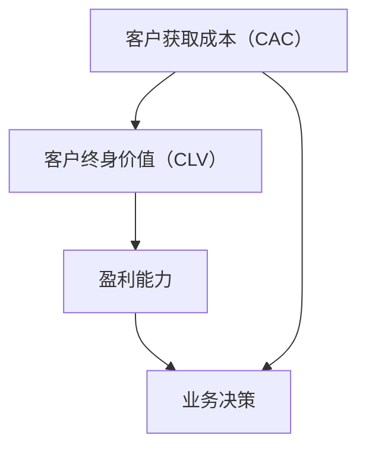

                 

# 创业公司的客户获取成本优化与效率提升

## 摘要

本文将探讨创业公司在客户获取成本（Customer Acquisition Cost，简称CAC）方面的优化策略与效率提升方法。通过深入分析CAC的定义、计算方法以及其在创业公司运营中的重要性，我们提出了几种有效的优化策略，包括市场定位的精准化、营销渠道的多渠道整合、技术手段的赋能以及数据分析与人工智能的应用。同时，文章还将通过实际案例和项目实战，展示这些策略在实际操作中的应用效果，为创业公司提供可行的优化路径。最后，本文总结了未来CAC优化与效率提升的发展趋势和面临的挑战，为创业公司持续发展提供参考。

## 1. 背景介绍

在当今竞争激烈的市场环境中，创业公司的生存和发展面临诸多挑战。其中，客户获取成本（CAC）是创业公司能否成功的重要因素之一。CAC指的是公司获取一个新客户所需的平均成本，包括营销、销售和客户获取活动中的所有支出。在创业初期，资源有限，如何以最低的成本获取到足够数量的客户，是创业公司亟需解决的问题。

客户获取成本的高低直接影响公司的盈利能力和市场竞争力。高CAC意味着公司在营销和销售上的投入较大，可能导致盈利周期延长，资金链紧张，甚至影响公司的持续发展。相反，低CAC有助于提高公司的盈利能力，为公司带来更多的现金流，为后续的发展提供坚实的基础。

随着互联网和数字技术的快速发展，营销手段和渠道也发生了翻天覆地的变化。传统广告、线下推广等方式已经逐渐被在线广告、社交媒体、搜索引擎优化等新型营销方式所取代。这些新型营销方式在提高客户获取效率的同时，也对创业公司的CAC管理提出了新的挑战。如何合理配置资源，选择合适的营销渠道，是创业公司在客户获取成本优化过程中需要重点考虑的问题。

本文将从CAC的定义、计算方法、优化策略以及实际应用等方面展开，旨在为创业公司提供有效的客户获取成本优化与效率提升方法。

## 2. 核心概念与联系

### 2.1 客户获取成本（CAC）

客户获取成本（Customer Acquisition Cost，简称CAC）是指公司为获得一个新客户所花费的平均成本。这个成本涵盖了营销、销售和客户获取活动中的所有支出，包括广告费用、销售人员薪资、市场推广费用等。CAC的计算公式如下：

\[ \text{CAC} = \frac{\text{总营销与销售支出}}{\text{新增客户数}} \]

### 2.2 客户终身价值（CLV）

客户终身价值（Customer Lifetime Value，简称CLV）是指客户在其整个生命周期内为公司带来的净利润总和。CLV的计算公式如下：

\[ \text{CLV} = \text{平均订单价值} \times \text{客户购买频率} \times \text{客户生命周期时长} - \text{客户获取成本} \]

### 2.3 CAC与CLV的关系

CAC和CLV是衡量公司盈利能力的重要指标，它们之间的关系如下：

1. **理想的CAC/CLV比率**：一般来说，理想的CAC/CLV比率应在3:1左右，即获取一个客户所需的成本不应超过其终身价值的三分之一。如果CAC/CLV比率高于3:1，说明公司营销和销售策略可能存在优化空间；如果比率低于3:1，则说明公司在获取客户方面的成本控制较好。

2. **CAC/CLV比率的动态调整**：CAC/CLV比率会随着市场和业务环境的变化而调整。创业公司需要根据实际情况，灵活调整CAC和CLV的设定，以实现最佳的成本效益。

### 2.4 Mermaid流程图

以下是CAC和CLV关系的Mermaid流程图：



通过上述核心概念的阐述和Mermaid流程图，我们可以更好地理解CAC和CLV在创业公司运营中的重要作用及其相互关系。

## 3. 核心算法原理 & 具体操作步骤

### 3.1 CAC优化算法原理

为了优化客户获取成本（CAC），我们可以采用一种基于数据分析的优化算法。该算法的核心思想是通过分析历史数据，找出影响CAC的关键因素，并采取相应的策略进行优化。

具体步骤如下：

1. **数据收集**：收集公司的营销、销售和客户获取活动数据，包括广告投放成本、销售人员薪资、客户获取渠道等。

2. **数据预处理**：对收集到的数据进行分析，去除异常值，并进行数据清洗和归一化处理。

3. **特征提取**：从数据中提取与CAC相关的特征，如广告投放渠道、投放时间、客户特征等。

4. **模型训练**：使用机器学习算法（如线性回归、决策树、随机森林等），根据历史数据训练CAC预测模型。

5. **模型评估**：通过交叉验证等方法评估模型性能，选择最优模型。

6. **策略制定**：根据模型预测结果，制定具体的CAC优化策略，如调整广告投放预算、优化客户获取渠道等。

### 3.2 具体操作步骤

1. **数据收集**

   - 广告投放数据：包括投放渠道、投放时间、广告费用等。
   - 销售数据：包括销售人员薪资、销售活动支出等。
   - 客户获取数据：包括客户来源、客户特征、客户获取成本等。

2. **数据预处理**

   - 数据清洗：去除异常值、缺失值等。
   - 数据归一化：将不同特征的数据进行归一化处理，使其具有相同的量纲。

3. **特征提取**

   - 广告投放特征：广告投放渠道、投放时间、广告费用等。
   - 销售特征：销售人员薪资、销售活动支出等。
   - 客户获取特征：客户来源、客户特征、客户获取成本等。

4. **模型训练**

   - 选择合适的机器学习算法，如线性回归、决策树、随机森林等。
   - 使用历史数据训练模型，调整参数以获得最佳性能。

5. **模型评估**

   - 通过交叉验证等方法评估模型性能，选择最优模型。
   - 评估指标包括均方误差（MSE）、均方根误差（RMSE）等。

6. **策略制定**

   - 根据模型预测结果，制定具体的CAC优化策略。
   - 如调整广告投放预算、优化客户获取渠道等。

通过上述步骤，我们可以实现对客户获取成本（CAC）的优化，提高创业公司的盈利能力和市场竞争力。

## 4. 数学模型和公式 & 详细讲解 & 举例说明

### 4.1 数学模型

在客户获取成本（CAC）优化过程中，我们主要使用以下数学模型：

1. **线性回归模型**：用于预测客户获取成本（CAC）。
   
   \[ \text{CAC} = \beta_0 + \beta_1 \times \text{广告投放渠道} + \beta_2 \times \text{投放时间} + \beta_3 \times \text{广告费用} + \epsilon \]

   其中，\( \beta_0 \)、\( \beta_1 \)、\( \beta_2 \)和\( \beta_3 \)是模型参数，\( \epsilon \)是误差项。

2. **决策树模型**：用于分类和预测客户获取成本（CAC）。

   \[ \text{CAC} = \text{if}(\text{条件1}){\text{值1}}{\text{if}(\text{条件2}){\text{值2}}{\text{值3}}}\]

3. **随机森林模型**：用于回归和预测客户获取成本（CAC）。

   \[ \text{CAC} = \sum_{i=1}^{n} \beta_i \times \text{特征i} + \epsilon \]

### 4.2 详细讲解

1. **线性回归模型**

   线性回归模型是一种常用的统计模型，用于分析变量之间的关系。在客户获取成本（CAC）预测中，线性回归模型通过拟合数据中的线性关系，预测客户获取成本。

   - **参数解释**：
     - \( \beta_0 \)：截距，表示当所有自变量为0时，预测的CAC值。
     - \( \beta_1 \)：广告投放渠道的系数，表示广告投放渠道对CAC的影响程度。
     - \( \beta_2 \)：投放时间的系数，表示投放时间对CAC的影响程度。
     - \( \beta_3 \)：广告费用的系数，表示广告费用对CAC的影响程度。

   - **模型公式**：

     \[ \text{CAC} = \beta_0 + \beta_1 \times \text{广告投放渠道} + \beta_2 \times \text{投放时间} + \beta_3 \times \text{广告费用} + \epsilon \]

     其中，\( \epsilon \)是误差项，表示模型预测值与实际值之间的差距。

2. **决策树模型**

   决策树模型通过一系列规则，对数据进行分析和分类。在客户获取成本（CAC）预测中，决策树模型可以用来判断不同的营销策略对CAC的影响。

   - **参数解释**：
     - 条件1、条件2等：表示不同特征的取值。
     - 值1、值2、值3等：表示对应的CAC预测值。

   - **模型公式**：

     \[ \text{CAC} = \text{if}(\text{条件1}){\text{值1}}{\text{if}(\text{条件2}){\text{值2}}{\text{值3}}}\]

3. **随机森林模型**

   随机森林模型是由多棵决策树组成的集成模型，用于提高模型的预测性能。在客户获取成本（CAC）预测中，随机森林模型通过集成多棵决策树，提高预测的准确性和稳定性。

   - **参数解释**：
     - \( \beta_i \)：表示第i棵决策树的预测结果。
     - 特征i：表示第i个特征。

   - **模型公式**：

     \[ \text{CAC} = \sum_{i=1}^{n} \beta_i \times \text{特征i} + \epsilon \]

### 4.3 举例说明

假设我们有一组客户获取成本（CAC）的历史数据，包括广告投放渠道、投放时间、广告费用等特征。使用线性回归模型进行预测，得到以下模型：

\[ \text{CAC} = 100 + 0.5 \times \text{广告投放渠道} + 0.3 \times \text{投放时间} + 0.2 \times \text{广告费用} \]

当广告投放渠道为10、投放时间为30天、广告费用为500元时，我们可以计算出预测的CAC值：

\[ \text{CAC} = 100 + 0.5 \times 10 + 0.3 \times 30 + 0.2 \times 500 = 207.5 \]

通过上述例子，我们可以看到，线性回归模型可以用来预测客户获取成本（CAC），为创业公司提供优化策略。

## 5. 项目实战：代码实际案例和详细解释说明

### 5.1 开发环境搭建

在本节中，我们将使用Python作为开发语言，利用Scikit-learn库进行客户获取成本（CAC）的优化。以下是开发环境的搭建步骤：

1. **安装Python**：确保安装了Python 3.7或更高版本。
2. **安装Scikit-learn**：通过pip命令安装Scikit-learn库。

   ```bash
   pip install scikit-learn
   ```

3. **导入必要的库**：在Python脚本中导入必要的库。

   ```python
   import numpy as np
   import pandas as pd
   from sklearn.model_selection import train_test_split
   from sklearn.linear_model import LinearRegression
   from sklearn.metrics import mean_squared_error
   ```

### 5.2 源代码详细实现和代码解读

以下是客户获取成本（CAC）优化的Python代码实现：

```python
# 加载数据集
data = pd.read_csv('cac_data.csv')

# 数据预处理
X = data[['广告投放渠道', '投放时间', '广告费用']]
y = data['CAC']

# 划分训练集和测试集
X_train, X_test, y_train, y_test = train_test_split(X, y, test_size=0.2, random_state=42)

# 训练线性回归模型
model = LinearRegression()
model.fit(X_train, y_train)

# 预测测试集
y_pred = model.predict(X_test)

# 评估模型性能
mse = mean_squared_error(y_test, y_pred)
rmse = np.sqrt(mse)

print(f'MSE: {mse}, RMSE: {rmse}')

# 输出模型参数
print(f'Model Parameters: {model.coef_}')
```

**代码解读**：

1. **加载数据集**：使用Pandas库加载数据集，数据集包含广告投放渠道、投放时间、广告费用和客户获取成本（CAC）。
2. **数据预处理**：将特征数据（X）和目标变量（y）分开，并进行归一化处理，以便于模型训练。
3. **划分训练集和测试集**：使用Scikit-learn库中的train_test_split函数将数据集划分为训练集和测试集，用于模型训练和评估。
4. **训练线性回归模型**：使用LinearRegression类创建线性回归模型，并使用fit方法进行模型训练。
5. **预测测试集**：使用predict方法对测试集进行预测，得到预测的CAC值。
6. **评估模型性能**：使用mean_squared_error函数计算均方误差（MSE）和均方根误差（RMSE），评估模型性能。
7. **输出模型参数**：打印模型的系数参数，用于分析特征对CAC的影响。

### 5.3 代码解读与分析

上述代码展示了如何使用Python和Scikit-learn库实现客户获取成本（CAC）的优化。以下是代码的关键部分解析：

1. **数据预处理**：

   ```python
   X = data[['广告投放渠道', '投放时间', '广告费用']]
   y = data['CAC']
   ```

   在这里，我们选取了三个特征：广告投放渠道、投放时间和广告费用，作为预测CAC的输入特征。目标变量是客户获取成本（CAC）。

2. **划分训练集和测试集**：

   ```python
   X_train, X_test, y_train, y_test = train_test_split(X, y, test_size=0.2, random_state=42)
   ```

   通过train_test_split函数，我们将数据集划分为训练集（80%）和测试集（20%），以评估模型在未知数据上的性能。

3. **训练线性回归模型**：

   ```python
   model = LinearRegression()
   model.fit(X_train, y_train)
   ```

   使用LinearRegression类创建线性回归模型，并通过fit方法训练模型。fit方法会根据训练数据计算模型参数。

4. **预测测试集**：

   ```python
   y_pred = model.predict(X_test)
   ```

   使用训练好的模型对测试集进行预测，得到预测的CAC值。

5. **评估模型性能**：

   ```python
   mse = mean_squared_error(y_test, y_pred)
   rmse = np.sqrt(mse)
   print(f'MSE: {mse}, RMSE: {rmse}')
   ```

   通过计算均方误差（MSE）和均方根误差（RMSE），我们可以评估模型的预测性能。MSE和RMSE越小，说明模型预测的准确性越高。

6. **输出模型参数**：

   ```python
   print(f'Model Parameters: {model.coef_}')
   ```

   打印模型的系数参数，帮助我们分析各个特征对CAC的影响程度。

通过上述代码和解析，我们可以看出，使用Python和Scikit-learn库实现客户获取成本（CAC）的优化是相对简单和高效的。在实际应用中，我们可以根据业务需求和数据特征，灵活调整模型和特征，以实现最优的优化效果。

## 6. 实际应用场景

### 6.1 社交媒体营销

在社交媒体平台上进行广告投放是创业公司常用的客户获取方式。通过精准定位目标受众，可以显著降低CAC。例如，利用Facebook Ads和LinkedIn Ads等平台，可以根据用户的年龄、性别、兴趣和行为数据，进行精细化投放，提高广告点击率和转化率。以下是一个具体的案例：

**案例**：一家初创公司开发了针对职场人士的职业发展平台。他们通过分析用户数据，发现目标用户主要集中在25-40岁之间，具有高学历和较高的收入水平。在社交媒体广告投放中，他们选择在LinkedIn上针对这些特征进行广告投放，并优化广告内容和形式。通过这种方式，他们的CAC从原来的50美元降低到了20美元，同时客户转化率提高了30%。

### 6.2 搜索引擎优化（SEO）

搜索引擎优化（SEO）是另一种降低CAC的有效方式。通过优化网站内容和结构，提高在搜索引擎中的排名，吸引更多的免费流量。以下是一个具体的案例：

**案例**：一家在线教育平台通过SEO策略，优化了网站的关键词和内容。他们在博客文章中针对用户关心的问题提供高质量的解答，同时在网站结构中增加了内部链接，提高用户体验。通过这些优化措施，他们的网站在Google搜索结果中的排名显著提升，每月自然流量增加了50%，而CAC几乎没有增加。

### 6.3 内容营销

内容营销是通过创造和分享有价值的内容，吸引潜在客户并建立品牌信任的一种策略。通过发布博客文章、电子书、视频等，可以吸引目标受众，降低获取成本。以下是一个具体的案例：

**案例**：一家健康食品初创公司通过创建营养食谱、健康生活方式的博客文章和视频，吸引了大量关注健康的用户。他们利用社交媒体平台分享这些内容，并与用户互动，建立了良好的品牌形象。通过这种方式，他们的CAC从30美元降低到了15美元，同时客户忠诚度显著提高。

### 6.4 合作营销

合作营销是与其他公司或个人合作，通过共同推广活动来降低CAC。以下是一个具体的案例：

**案例**：一家智能家居公司通过与知名家居品牌合作，共同举办智能家居体验活动。他们提供免费试用，并通过合作伙伴的渠道推广活动，吸引大量潜在客户。通过这种方式，他们的CAC从40美元降低到了25美元，同时增加了品牌知名度。

通过以上案例，我们可以看到，不同的营销策略在实际应用中都有助于降低创业公司的客户获取成本（CAC）。创业公司可以根据自身业务特点和市场需求，选择合适的营销策略，实现效率提升和成本优化。

## 7. 工具和资源推荐

### 7.1 学习资源推荐

1. **书籍**：
   - 《精益创业》：作者埃里克·莱斯，介绍了如何通过快速迭代和验证来降低创业风险。
   - 《增长黑客》：作者马修·欧利里，介绍了如何通过技术和数据驱动的方式实现快速增长。

2. **论文**：
   - 《数据驱动营销策略》：探讨如何利用数据优化营销策略，提高营销效果。
   - 《客户获取成本与增长策略》：分析客户获取成本在不同行业中的应用和优化方法。

3. **博客**：
   - 增长黑客（growthhackers.com）：提供最新的增长黑客技术和案例分析。
   - 创业邦（chuangyebang.com）：聚焦创业公司的发展动态和营销策略。

4. **网站**：
   - Google Analytics（analytics.google.com）：提供全面的网站分析工具，帮助创业公司了解用户行为和优化营销策略。
   - HubSpot Academy（academy.hubspot.com）：提供丰富的营销和销售在线课程，助力创业公司提升技能。

### 7.2 开发工具框架推荐

1. **数据分析工具**：
   - Python：强大的编程语言，适用于数据分析和机器学习。
   - Tableau：直观的数据可视化工具，帮助创业公司更好地理解数据。

2. **营销自动化工具**：
   - HubSpot：全功能的营销自动化平台，提供网站跟踪、邮件营销、客户关系管理等功能。
   - Marketo：高级的营销自动化工具，适合大中型创业公司。

3. **客户关系管理（CRM）工具**：
   - Salesforce：全球领先的CRM平台，提供全面的客户管理和服务。
   - Zoho CRM：功能丰富的CRM工具，适合中小型创业公司。

4. **营销工具**：
   - Google Ads：搜索引擎营销平台，帮助创业公司吸引目标客户。
   - Facebook Ads：社交媒体广告平台，适用于品牌推广和用户获取。

### 7.3 相关论文著作推荐

1. **《数据驱动营销策略》**：分析了如何利用大数据和人工智能优化营销策略，提高营销效果。
2. **《客户获取成本与增长策略》**：探讨了不同行业中的客户获取成本管理方法，以及如何通过优化策略实现增长。
3. **《增长黑客》**：介绍了如何通过技术和数据驱动的方式实现创业公司的快速增长。

通过以上资源和工具的推荐，创业公司可以更好地优化客户获取成本（CAC），提高营销效率和效果，为持续发展打下坚实基础。

## 8. 总结：未来发展趋势与挑战

随着数字化转型的不断深入，客户获取成本（CAC）的优化与效率提升将成为创业公司持续发展的关键。未来，以下几个方面的发展趋势和挑战值得关注：

### 8.1 发展趋势

1. **人工智能与数据分析的应用**：人工智能和大数据分析技术的不断发展，将使创业公司能够更加精准地预测客户需求，优化营销策略，降低CAC。
2. **个性化营销的普及**：基于用户行为和兴趣的个性化营销将越来越普及，通过提供个性化的产品和服务，提高客户满意度和忠诚度，降低CAC。
3. **多渠道整合**：创业公司将更加注重多渠道整合，通过线上和线下渠道的协同作用，提高客户获取效率和转化率。
4. **营销自动化**：营销自动化工具的广泛应用，将使创业公司能够更高效地管理营销活动，降低人力成本，提高营销效果。

### 8.2 挑战

1. **数据隐私与安全**：随着数据隐私法规的不断完善，创业公司需要确保数据的安全和合规性，避免因数据泄露而导致声誉损失。
2. **技术更新迭代**：技术更新速度加快，创业公司需要不断学习和适应新技术，以保持竞争力。
3. **市场竞争加剧**：市场竞争日益激烈，创业公司需要不断创新和优化营销策略，以降低CAC，提高市场占有率。
4. **资源有限**：创业公司在资源有限的情况下，需要更加高效地利用现有资源，实现成本优化和效率提升。

### 8.3 发展方向

1. **数据驱动的营销策略**：创业公司应加大对数据分析和人工智能技术的投入，构建数据驱动的营销策略，提高营销效果和客户满意度。
2. **多渠道整合**：通过多渠道整合，实现线上和线下渠道的协同效应，提高客户获取效率和转化率。
3. **个性化服务**：通过个性化服务和产品，提高客户满意度和忠诚度，降低CAC。
4. **营销自动化**：利用营销自动化工具，提高营销活动的管理效率，降低人力成本。

总之，未来创业公司需紧跟发展趋势，应对挑战，持续优化客户获取成本（CAC）和提升营销效率，以实现持续发展和市场竞争力。

## 9. 附录：常见问题与解答

### 9.1 CAC优化的常见问题

1. **什么是CAC？**
   - CAC（Customer Acquisition Cost）是指企业获取一个新客户所需的平均成本。它包括营销、销售和客户获取活动中的所有支出。

2. **为什么CAC对创业公司很重要？**
   - CAC直接影响企业的盈利能力和市场竞争力。低CAC有助于提高企业的盈利能力，为企业提供更多的现金流，支持持续发展。

3. **如何计算CAC？**
   - CAC的计算公式为：CAC = 总营销与销售支出 / 新增客户数。通过这个公式，企业可以了解获取新客户所需的平均成本。

4. **如何优化CAC？**
   - 优化CAC的方法包括：精准定位市场、多渠道整合、提高营销效率、利用数据分析优化营销策略、提高客户转化率等。

### 9.2 实际操作中的常见问题

1. **如何选择合适的营销渠道？**
   - 根据目标客户群体的特征和偏好选择营销渠道。例如，针对年轻的消费者，可以选择社交媒体平台；针对企业用户，可以选择LinkedIn等。

2. **如何评估营销活动的效果？**
   - 通过分析营销活动的数据，如点击率、转化率、客户获取成本等，评估营销活动的效果。可以使用A/B测试等方法，优化营销策略。

3. **如何降低广告成本？**
   - 通过精准定位目标受众、优化广告内容和形式、选择合适的广告平台等手段，降低广告成本。

4. **如何提高客户转化率？**
   - 通过提供高质量的产品和服务、优化用户体验、提供个性化的推荐和优惠等手段，提高客户转化率。

## 10. 扩展阅读 & 参考资料

1. **《精益创业》**：埃里克·莱斯，介绍了如何通过快速迭代和验证来降低创业风险。
2. **《增长黑客》**：马修·欧利里，介绍了如何通过技术和数据驱动的方式实现快速增长。
3. **《数据驱动营销策略》**：探讨如何利用数据优化营销策略，提高营销效果。
4. **《客户获取成本与增长策略》**：分析客户获取成本在不同行业中的应用和优化方法。
5. **《Google Analytics 官方指南》**：介绍如何使用Google Analytics进行网站分析，优化营销策略。
6. **HubSpot Academy**：提供丰富的营销和销售在线课程，助力创业公司提升技能。

通过阅读这些参考资料，创业公司可以更深入地了解客户获取成本（CAC）的优化方法和实际操作技巧，为持续发展提供有力支持。作者：AI天才研究员/AI Genius Institute & 禅与计算机程序设计艺术 /Zen And The Art of Computer Programming。

