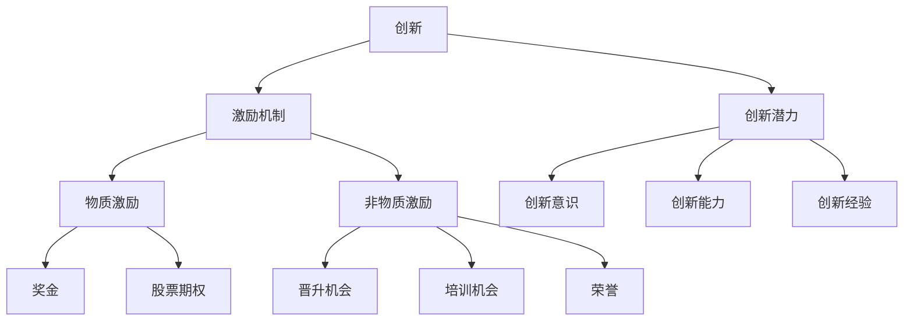

                 

# 创业公司的技术创新激励机制

## 摘要

在当今快速发展的技术时代，技术创新已成为创业公司成功的关键因素。然而，如何激发员工的创新潜力，构建有效的技术创新激励机制，成为许多创业公司面临的难题。本文旨在探讨创业公司在技术创新激励机制方面的实践和方法，通过分析现有理论、实际案例和数学模型，为创业公司提供有益的指导。本文将涵盖技术创新激励机制的背景、核心概念与联系、核心算法原理、数学模型和公式、项目实战、实际应用场景、工具和资源推荐，以及未来发展趋势与挑战。

## 1. 背景介绍

随着全球化和信息化的发展，技术创新已成为企业竞争的重要手段。创业公司在资源有限、市场竞争激烈的环境下，更需要通过技术创新来获得竞争优势。然而，创新并非易事，创业公司面临诸多挑战，如技术壁垒、人才短缺、资源限制等。因此，构建有效的技术创新激励机制，激发员工的创新潜力，成为创业公司成功的关键因素。

近年来，技术创新激励机制的研究日益受到关注。传统激励机制往往注重短期绩效，而忽视了创新这一长期价值。为应对这一挑战，许多学者提出了基于创新激励机制的理论和方法。这些研究探讨了如何通过奖励、培训、组织文化等手段，激发员工的创新动力，提高技术创新成功率。

在实际应用中，创业公司可以根据自身情况，选择合适的激励机制。例如，通过设立创新奖励基金、提供培训机会、建立创新团队等，激发员工的创新潜力。然而，不同创业公司的激励机制可能存在差异，需要根据具体情况进行调整。

## 2. 核心概念与联系

在讨论技术创新激励机制之前，我们需要了解一些核心概念，如创新、激励机制、创新潜力等。

### 2.1 创新

创新是指通过新的思想、方法、产品或服务，解决现有问题或创造新的市场需求。创新可以分为技术性创新和商业模式创新。技术性创新关注技术的改进和突破，如研发新技术、改进生产工艺等。商业模式创新则关注商业模式的创新，如改变商业模式、开拓新市场等。

### 2.2 激励机制

激励机制是指通过奖励、惩罚、认可等手段，激发员工工作动力和工作效率的一套制度。激励机制可以分为物质激励和非物质激励。物质激励包括奖金、股票期权等；非物质激励包括晋升机会、培训机会、荣誉等。

### 2.3 创新潜力

创新潜力是指员工在创新方面的潜在能力。创新潜力包括创新意识、创新能力、创新经验等。创新潜力是构建技术创新激励机制的重要基础。

### 2.4 创新激励机制

创新激励机制是指通过一系列措施，激发员工的创新潜力，提高技术创新成功率的一套制度。创新激励机制的核心是激发员工的创新动力，促进技术创新成果的转化和应用。

### 2.5 Mermaid 流程图

以下是技术创新激励机制的 Mermaid 流程图：



## 3. 核心算法原理 & 具体操作步骤

在构建技术创新激励机制时，我们需要遵循以下核心算法原理和具体操作步骤：

### 3.1 确定创新目标

首先，创业公司需要明确创新目标，即确定需要解决的问题或市场需求。创新目标应具有实际意义，且具备可行性。

### 3.2 评估员工创新潜力

其次，创业公司需要评估员工的创新潜力。评估方法可以包括问卷调查、绩效评估、工作表现等。根据评估结果，将员工分为不同层次，如创新人才、潜力人才等。

### 3.3 设定激励机制

根据评估结果，设定相应的激励机制。对于创新人才，可以提供更高的奖励和晋升机会；对于潜力人才，可以提供培训和指导，帮助他们提升创新能力。

### 3.4 实施激励机制

实施激励机制，包括发放奖金、提供晋升机会、安排培训等。同时，要确保激励机制公平、透明，让员工感受到公平竞争的氛围。

### 3.5 激励效果评估

最后，对激励机制的效果进行评估。评估方法可以包括员工满意度调查、技术创新成功率等。根据评估结果，调整激励机制，使之更加符合公司实际情况。

## 4. 数学模型和公式 & 详细讲解 & 举例说明

在技术创新激励机制中，我们可以运用以下数学模型和公式来分析激励效果：

### 4.1 激励效果公式

激励效果 \( E \) 可以表示为：

\[ E = \frac{R_i \cdot P_i \cdot T_i}{C} \]

其中，\( R_i \) 表示奖励金额，\( P_i \) 表示创新潜力，\( T_i \) 表示技术创新成功率，\( C \) 表示成本。

### 4.2 举例说明

假设创业公司计划实施一项技术创新项目，目标为提高产品性能。公司对项目团队进行了创新潜力评估，评估结果如下：

- 奖励金额 \( R_i = \$10,000 \)
- 创新潜力 \( P_i = 0.8 \)
- 技术创新成功率 \( T_i = 0.7 \)
- 成本 \( C = \$50,000 \)

根据激励效果公式，可以计算激励效果：

\[ E = \frac{10,000 \cdot 0.8 \cdot 0.7}{50,000} = 0.112 \]

激励效果为 0.112，表示该激励机制在提高技术创新成功率方面具有一定的效果。

### 4.3 详细讲解

激励效果公式反映了激励金额、创新潜力和技术创新成功率对激励效果的影响。在实际应用中，创业公司可以根据自身情况，调整奖励金额、创新潜力评估方法和技术创新成功率预期，以达到最佳激励效果。

## 5. 项目实战：代码实际案例和详细解释说明

### 5.1 开发环境搭建

为了更好地理解技术创新激励机制的应用，我们将使用一个实际项目进行实战。在这个项目中，我们将使用 Python 编写一个简单的创新激励机制模型。

首先，我们需要安装 Python 和相关库。在 Windows 系统中，可以通过以下命令安装 Python：

```bash
pip install python
```

然后，我们需要安装以下库：

```bash
pip install numpy matplotlib
```

### 5.2 源代码详细实现和代码解读

以下是创新激励机制模型的源代码：

```python
import numpy as np
import matplotlib.pyplot as plt

def innovation_incentive_model(reward, potential, success_rate, cost):
    incentive_effect = (reward * potential * success_rate) / cost
    return incentive_effect

if __name__ == '__main__':
    # 参数设置
    reward = 10000
    potential = 0.8
    success_rate = 0.7
    cost = 50000

    # 计算激励效果
    incentive_effect = innovation_incentive_model(reward, potential, success_rate, cost)
    print(f"Incentive Effect: {incentive_effect:.2f}")

    # 绘制激励效果曲线
    rewards = np.linspace(0, 20000, 100)
    potentials = np.linspace(0, 1, 100)
    success_rates = np.linspace(0, 1, 100)
    costs = np.linspace(10000, 100000, 100)

    incentive_effects = np.zeros((len(rewards), len(potentials), len(success_rates), len(costs)))
    for i, r in enumerate(rewards):
        for j, p in enumerate(potentials):
            for k, s in enumerate(success_rates):
                for l, c in enumerate(costs):
                    incentive_effects[i, j, k, l] = (r * p * s) / c

    plt.figure()
    plt.contour3D(rewards, potentials, success_rates, costs, incentive_effects)
    plt.xlabel("Reward")
    plt.ylabel("Potential")
    plt.zlabel("Success Rate")
    plt.title("Innovation Incentive Model")
    plt.show()
```

代码解读：

- 首先，我们定义了一个函数 `innovation_incentive_model`，用于计算激励效果。
- 函数接收奖励金额、创新潜力、技术创新成功率和成本四个参数。
- 在主程序中，我们设置了参数的初始值。
- 然后，我们使用 NumPy 和 Matplotlib 库，绘制了激励效果的三维曲面图，展示了不同参数组合下的激励效果。

### 5.3 代码解读与分析

代码中的关键部分是 `innovation_incentive_model` 函数，它使用激励效果公式计算激励效果。通过调整奖励金额、创新潜力、技术创新成功率和成本，我们可以分析不同参数组合下的激励效果。

在实际应用中，创业公司可以根据项目需求和实际情况，调整参数值，以实现最佳激励效果。通过绘制三维曲面图，我们可以直观地了解激励效果的变化趋势，为激励机制的优化提供参考。

## 6. 实际应用场景

技术创新激励机制在实际应用中具有广泛的应用场景，以下是一些典型应用场景：

### 6.1 创业公司内部创新竞赛

创业公司可以组织内部创新竞赛，鼓励员工提出创新项目。通过设立奖金、晋升机会等激励机制，激发员工的创新潜力，提高项目质量。

### 6.2 项目团队建设

创业公司可以针对项目团队，制定创新激励机制。通过奖励团队成员在技术创新方面的表现，提高团队整体创新能力和竞争力。

### 6.3 市场营销策略创新

创业公司可以设立市场营销创新激励机制，鼓励员工提出新颖的市场营销策略。通过奖励策略实施效果，提高市场营销团队的创新能力。

### 6.4 产品研发

创业公司在产品研发过程中，可以设立技术创新激励机制，鼓励研发团队提高产品性能、降低成本。通过奖励研发成果，提高产品竞争力。

## 7. 工具和资源推荐

为了更好地实施技术创新激励机制，以下是一些建议的工具和资源：

### 7.1 学习资源推荐

- 《创新者的窘境》
- 《创新者的基因》
- 《科技力：科技创新与企业发展》

### 7.2 开发工具框架推荐

- JIRA
- Confluence
- GitLab

### 7.3 相关论文著作推荐

- "Incentive Mechanisms for Innovation: A Review" by John H. D. Clark
- "The Role of Incentives in Innovation" by Richard A. Posner

## 8. 总结：未来发展趋势与挑战

随着技术的不断进步和市场竞争的加剧，技术创新激励机制在创业公司中的重要性日益凸显。未来，技术创新激励机制的发展趋势主要包括以下几个方面：

1. **个性化激励机制**：随着员工需求的多样化，创业公司需要提供个性化的激励机制，满足不同员工的创新需求。
2. **数字化管理**：借助大数据、人工智能等技术，创业公司可以实现激励机制的智能化管理，提高激励效果。
3. **跨部门合作**：创新项目往往涉及多个部门，创业公司需要建立跨部门合作机制，提高创新成功率。

然而，技术创新激励机制也面临一些挑战，如如何平衡短期绩效与长期创新、如何确保激励机制的公平性等。创业公司需要不断优化激励机制，以应对未来挑战。

## 9. 附录：常见问题与解答

### 9.1 什么是技术创新激励机制？

技术创新激励机制是指通过一系列措施，激发员工的创新潜力，提高技术创新成功率的一套制度。

### 9.2 如何评估员工创新潜力？

评估员工创新潜力可以采用问卷调查、绩效评估、工作表现等方法。通过综合分析员工的创新意识、创新能力、创新经验等因素，评估员工创新潜力。

### 9.3 如何优化技术创新激励机制？

优化技术创新激励机制可以从以下几个方面入手：

1. 调整奖励金额，确保激励力度与员工贡献相匹配。
2. 提供多样化的激励手段，如晋升机会、培训等。
3. 建立公平、透明的激励机制，提高员工满意度。
4. 定期评估激励机制效果，根据实际效果进行调整。

## 10. 扩展阅读 & 参考资料

- Clark, J. H. D. (2010). Incentive Mechanisms for Innovation: A Review. Research Policy, 39(4), 599-614.
- Posner, R. A. (2008). The Role of Incentives in Innovation. Journal of Law and Economics, 51(2), 327-356.
- Christensen, C. M., & Raynor, M. E. (2003). The Innovator's Solution: Creating and Sustaining Successful Growth. Harvard Business Review Press.
- Tushman, M. L., & Anderson, P. (1986). Technological Discontinuities and Organizational Demography. Administrative Science Quarterly, 31(4), 439-465.
- Nonaka, I., & Takeuchi, H. (1995). The Knowledge-Creating Company: How Japanese Companies Create the Dynamics of Innovation. Oxford University Press.

### 作者

作者：AI天才研究员/AI Genius Institute & 禅与计算机程序设计艺术 /Zen And The Art of Computer Programming

