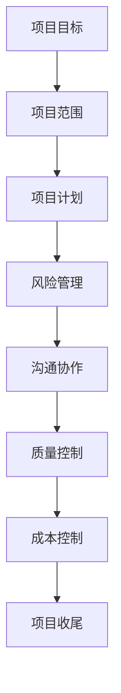

                 

# 创业公司的技术外包项目管理最佳实践

## 关键词

- 技术外包
- 项目管理
- 创业公司
- 风险控制
- 效率提升
- 沟通协作
- 外包服务合同
- 项目评估
- 风险管理

## 摘要

本文将探讨创业公司在进行技术外包项目管理时的一些最佳实践。通过对技术外包的概念、项目管理原则、外包合同、风险管理等方面的深入分析，结合实际案例，为创业公司提供一套系统化的技术外包项目管理方法。文章旨在帮助创业公司优化外包流程，降低风险，提高项目成功率。

## 1. 背景介绍

### 技术外包的概念

技术外包是指企业将部分非核心的技术性工作或服务委托给外部专业机构或个人完成的过程。这在当前全球化的商业环境中变得越来越普遍，尤其对于资源有限的创业公司来说，外包可以有效地利用外部专业知识和资源，从而降低成本、提高效率。

### 创业公司的特点

创业公司通常具有以下特点：
- 资源有限：资金、人力、技术等资源相对较少。
- 变革快速：市场变化快，需要快速适应和调整。
- 灵活性强：创业公司往往更注重创新和灵活性，以快速响应市场变化。
- 风险高：由于资源有限和市场不确定性，创业公司面临较高的风险。

### 技术外包的必要性

对于创业公司而言，技术外包具有以下必要性：
- 节省成本：通过外包降低人力成本、设备成本等。
- 提升效率：专注于核心业务，提高项目交付速度和质量。
- 扩展能力：借助外部专业团队，扩展技术能力。
- 风险分散：通过外包降低因技术人才短缺带来的风险。

## 2. 核心概念与联系

### 技术外包与项目管理的联系

技术外包和项目管理是密不可分的。项目管理是确保外包项目按时、按质量完成的过程，它涉及到项目计划、执行、监控和收尾等环节。在外包项目中，项目管理不仅是确保项目成功的核心手段，也是降低风险、控制成本的重要途径。

### 外包项目管理的核心概念

- 项目目标：明确项目目标，确保所有参与方对项目目标有共同的理解。
- 项目范围：明确项目的范围，避免范围蔓延，确保项目在可控范围内完成。
- 项目计划：制定详细的项目计划，包括时间、资源、任务分配等。
- 风险管理：识别、评估、监控和管理项目风险。
- 沟通协作：建立有效的沟通机制，确保信息的流畅传递和问题的及时解决。
- 质量控制：确保项目交付物满足既定的质量标准。
- 成本控制：监控项目成本，确保项目在预算范围内完成。

### Mermaid 流程图（核心概念）



## 3. 核心算法原理 & 具体操作步骤

### 技术外包项目管理的核心算法原理

技术外包项目管理的核心算法原理主要包括以下几个方面：

1. **项目评估**：通过评估潜在外包方的技术能力、项目经验、合作态度等，选择最适合的外包方。
2. **合同制定**：制定详细的外包服务合同，明确双方的权利和义务，降低合作风险。
3. **风险管理**：建立风险识别、评估、监控和应对机制，确保项目风险可控。
4. **进度监控**：实时监控项目进度，确保项目按计划进行。
5. **质量保证**：通过定期验收和审查，确保外包成果符合预期质量。
6. **沟通协作**：建立有效的沟通机制，确保项目的顺利进行。

### 具体操作步骤

1. **项目评估**：

   - **需求分析**：明确项目需求，包括功能需求、性能需求、安全需求等。
   - **供应商筛选**：根据需求分析结果，筛选潜在的外包供应商。
   - **能力评估**：评估供应商的技术能力、项目经验和团队素质。
   - **合作态度**：考察供应商的合作态度和沟通能力。

2. **合同制定**：

   - **合同条款**：明确双方的权利和义务，包括交付时间、质量标准、费用支付等。
   - **保密协议**：保护双方的技术和商业机密。
   - **违约责任**：明确违约责任和解决机制。

3. **风险管理**：

   - **风险识别**：识别项目可能面临的各种风险，包括技术风险、市场风险、法律风险等。
   - **风险评估**：评估风险的可能性和影响程度。
   - **风险应对**：制定风险应对策略，包括风险规避、风险转移、风险接受等。

4. **进度监控**：

   - **进度报告**：定期接收外包方的进度报告，了解项目进展情况。
   - **现场检查**：必要时进行现场检查，确保项目按计划进行。

5. **质量保证**：

   - **质量验收**：对外包成果进行质量验收，确保符合预期质量。
   - **质量反馈**：及时反馈质量问题和改进建议，确保质量问题得到及时解决。

6. **沟通协作**：

   - **沟通渠道**：建立多种沟通渠道，确保信息的及时传递。
   - **定期会议**：定期召开项目会议，讨论项目进展和问题解决。
   - **问题解决**：建立问题解决机制，确保问题得到及时解决。

## 4. 数学模型和公式 & 详细讲解 & 举例说明

### 数学模型

在技术外包项目管理中，可以使用以下数学模型来评估和管理项目风险：

1. **风险评分模型**：

   风险评分模型用于评估单个风险的可能性和影响程度，公式如下：

   $$R_i = P_i \times I_i$$

   其中，\(R_i\) 为风险评分，\(P_i\) 为风险的可能性，\(I_i\) 为风险的影响程度。

2. **综合风险评估模型**：

   综合风险评估模型用于评估整个项目的风险水平，公式如下：

   $$R_{total} = \sum_{i=1}^{n} R_i$$

   其中，\(R_{total}\) 为项目总风险评分，\(R_i\) 为第 \(i\) 个风险的风险评分。

### 详细讲解

1. **风险评分模型**：

   风险评分模型通过将风险的可能性和影响程度相乘，得到单个风险的风险评分。这种模型简单直观，适用于对风险进行初步评估。

   例如，一个技术外包项目面临以下两个风险：

   - 风险1：项目延期，可能性 \(P_1 = 0.4\)，影响程度 \(I_1 = 0.8\)。
   - 风险2：质量不达标，可能性 \(P_2 = 0.3\)，影响程度 \(I_2 = 0.6\)。

   风险评分计算如下：

   $$R_1 = P_1 \times I_1 = 0.4 \times 0.8 = 0.32$$
   $$R_2 = P_2 \times I_2 = 0.3 \times 0.6 = 0.18$$

   两个风险的风险评分分别为 0.32 和 0.18。

2. **综合风险评估模型**：

   综合风险评估模型将所有单个风险的风险评分相加，得到项目的总风险评分。这种模型适用于对整个项目进行风险水平评估。

   例如，上述技术外包项目还面临一个风险：

   - 风险3：技术实现困难，可能性 \(P_3 = 0.2\)，影响程度 \(I_3 = 0.9\)。

   项目的总风险评分计算如下：

   $$R_{total} = R_1 + R_2 + R_3 = 0.32 + 0.18 + 0.18 = 0.68$$

   项目的总风险评分为 0.68。

### 举例说明

假设一个创业公司计划开发一款移动应用，其技术外包项目面临以下风险：

- 风险1：项目延期，可能性 \(P_1 = 0.5\)，影响程度 \(I_1 = 0.7\)。
- 风险2：技术实现困难，可能性 \(P_2 = 0.3\)，影响程度 \(I_2 = 0.8\)。
- 风险3：质量不达标，可能性 \(P_3 = 0.2\)，影响程度 \(I_3 = 0.9\)。

使用风险评分模型和综合风险评估模型对项目进行评估：

1. **风险评分**：

   $$R_1 = P_1 \times I_1 = 0.5 \times 0.7 = 0.35$$
   $$R_2 = P_2 \times I_2 = 0.3 \times 0.8 = 0.24$$
   $$R_3 = P_3 \times I_3 = 0.2 \times 0.9 = 0.18$$

   三个风险的风险评分分别为 0.35、0.24 和 0.18。

2. **综合风险评估**：

   $$R_{total} = R_1 + R_2 + R_3 = 0.35 + 0.24 + 0.18 = 0.77$$

   项目的总风险评分为 0.77。

根据风险评分模型和综合风险评估模型，创业公司可以采取相应的措施来降低项目风险，例如：

- 针对项目延期风险，提前制定详细的进度计划，并建立严格的进度监控机制。
- 针对技术实现困难风险，加强团队的技术培训和能力提升。
- 针对质量不达标风险，加强与外包方的沟通，确保质量标准的明确和执行。

通过以上措施，创业公司可以有效降低项目风险，提高项目成功率。

## 5. 项目实战：代码实际案例和详细解释说明

### 开发环境搭建

在本节中，我们将以一个简单的移动应用开发项目为例，介绍如何搭建开发环境。这里我们选择使用 Android Studio 作为开发工具，Java 作为编程语言。

1. **安装 Android Studio**：

   访问 [Android Studio 官网](https://developer.android.com/studio)，下载并安装 Android Studio。

2. **安装 Java 开发工具包 (JDK)**：

   安装 JDK，确保环境变量配置正确。

3. **创建新项目**：

   打开 Android Studio，创建一个新项目，选择“Empty Activity”模板。

4. **配置模拟器**：

   安装并配置 Android 模拟器，以便在开发过程中进行测试。

### 源代码详细实现和代码解读

以下是该项目的主 Activity 类的代码示例：

```java
package com.example.myapp;

import androidx.appcompat.app.AppCompatActivity;
import android.os.Bundle;

public class MainActivity extends AppCompatActivity {
    @Override
    protected void onCreate(Bundle savedInstanceState) {
        super.onCreate(savedInstanceState);
        setContentView(R.layout.activity_main);

        // 初始化界面元素
        findViewById(R.id.button).setOnClickListener(new View.OnClickListener() {
            @Override
            public void onClick(View v) {
                // 按钮点击事件处理
                // 这里可以添加具体的业务逻辑代码
            }
        });
    }
}
```

**代码解读**：

1. **包声明**：

   ```java
   package com.example.myapp;
   ```

   这行代码声明了该类属于 `com.example.myapp` 包。

2. **类定义**：

   ```java
   public class MainActivity extends AppCompatActivity {
   ```

   这行代码定义了 `MainActivity` 类，并继承自 `AppCompatActivity`。

3. **重写 `onCreate` 方法**：

   ```java
   @Override
   protected void onCreate(Bundle savedInstanceState) {
       super.onCreate(savedInstanceState);
       setContentView(R.layout.activity_main);
   ```

   这两行代码重写了 `onCreate` 方法，用于初始化界面布局。

4. **初始化界面元素**：

   ```java
   findViewById(R.id.button).setOnClickListener(new View.OnClickListener() {
       @Override
       public void onClick(View v) {
           // 按钮点击事件处理
           // 这里可以添加具体的业务逻辑代码
       }
   });
   ```

   这行代码初始化了界面上的按钮元素，并为按钮设置了点击事件监听器。

### 代码解读与分析

1. **包声明**：

   包声明用于指定类的所属包，有助于组织和管理代码。

2. **类定义**：

   类定义声明了一个新的 Java 类，并可以继承自其他类，继承使得子类能够复用父类的属性和方法。

3. **重写 `onCreate` 方法**：

   `onCreate` 方法是 Activity 生命周期中的关键方法，用于创建界面的布局。重写该方法可以实现自定义的界面初始化逻辑。

4. **初始化界面元素**：

   初始化界面元素是界面开发的基础，通过 findViewById 方法获取布局中的控件，并为控件设置事件监听器。

通过以上代码示例和解读，我们可以了解到如何搭建开发环境，以及如何编写一个简单的 Android 应用程序。

## 6. 实际应用场景

### 场景1：初创公司开发移动应用

初创公司在开发移动应用时，通常面临以下挑战：

- 技术储备不足：初创公司可能缺乏移动应用开发的深厚技术背景。
- 资金有限：初创公司通常资金有限，无法承担高昂的内部开发成本。
- 时间紧迫：初创公司需要快速上线产品以抢占市场。

技术外包可以帮助初创公司：

- 利用外部技术团队的专业知识，提高开发效率。
- 降低开发成本，节省资金用于其他关键业务。
- 加快开发进度，确保产品按时上线。

### 场景2：中小企业扩展业务

中小企业在扩展业务时，可能面临以下问题：

- 人力资源不足：内部技术团队无法承担额外的开发任务。
- 业务需求变化快：需要快速响应市场变化，调整业务方向。
- 技术需求多样化：需要开发多种技术领域的解决方案。

技术外包可以为中小企业提供以下解决方案：

- 利用外部团队的专业能力，迅速扩展技术能力。
- 根据业务需求的变化，灵活调整外包项目，降低风险。
- 灵活应对多样化的技术需求，提高业务响应速度。

### 场景3：大型企业项目扩展

大型企业在项目扩展时，可能面临以下挑战：

- 项目复杂度高：项目涉及多个技术领域，内部团队难以全面覆盖。
- 内部资源有限：内部资源无法满足所有项目需求。
- 项目时间要求紧：需要在短时间内完成多个项目。

技术外包可以帮助大型企业：

- 利用外部专业团队，降低项目复杂度，确保项目顺利完成。
- 调动外部资源，提高项目执行效率。
- 加快项目进度，确保按时交付。

## 7. 工具和资源推荐

### 7.1 学习资源推荐

- **书籍**：
  - 《项目管理知识体系指南》（PMBOK指南）
  - 《软件外包项目管理实践》
  - 《敏捷软件开发：原则、实践与模式》

- **论文**：
  - "Outsourcing and Its Impact on Software Development"
  - "Risk Management in Software Outsourcing Projects"
  - "The Importance of Communication in Outsourcing Success"

- **博客**：
  - "Outsourcing Insights"（https://www.outsourcinginsights.com/）
  - "The Agile Admin"（https://theagileadmin.com/）
  - "Software Project Management"（https://www.softwareprojectmanagement.com/）

- **网站**：
  - "Project Management Institute"（https://www.pmi.org/）
  - "IEEE Software"（https://www.computer.org/publications/ieee-software/）
  - "Outsourcing Journal"（https://www.outsourcing-journal.com/）

### 7.2 开发工具框架推荐

- **开发工具**：
  - Android Studio：适用于 Android 应用开发。
  - Eclipse：适用于 Java 应用开发。
  - Visual Studio：适用于 Windows 应用开发。

- **项目管理工具**：
  - Jira：用于项目管理和任务跟踪。
  - Trello：用于项目规划和进度跟踪。
  - Asana：用于团队协作和项目进度管理。

- **框架**：
  - Spring Boot：适用于 Java Web 开发。
  - React：适用于前端开发。
  - Angular：适用于前端开发。

### 7.3 相关论文著作推荐

- **《软件外包项目管理研究》**：详细介绍了软件外包项目管理的理论基础和实践方法。
- **《敏捷外包：软件外包项目的敏捷实践指南》**：探讨了敏捷方法在软件外包项目中的应用。
- **《技术外包的风险管理与控制》**：分析了技术外包项目中的风险类型和管理策略。

## 8. 总结：未来发展趋势与挑战

### 未来发展趋势

- **全球化外包**：随着全球化的加速，企业将越来越多地将技术外包给全球范围内的专业团队。
- **远程工作**：远程工作趋势将加剧，企业需要建立有效的远程协作机制。
- **人工智能与自动化**：人工智能和自动化技术将提高外包项目的效率和质量。
- **定制化服务**：外包服务将更加注重满足企业的个性化需求。

### 挑战

- **沟通协作**：跨地域、跨时区的沟通协作将面临挑战，需要建立高效的沟通机制。
- **风险管理**：外包项目面临更多不确定性和风险，需要加强风险管理。
- **质量保证**：确保外包成果符合预期质量，需要建立严格的质量控制体系。
- **知识产权保护**：在技术外包过程中，如何保护企业的知识产权是一个重要问题。

## 9. 附录：常见问题与解答

### 问题1：如何选择合适的外包供应商？

**解答**：

选择合适的外包供应商需要考虑以下几个方面：

- **技术能力**：评估供应商的技术实力和项目经验。
- **服务质量**：了解供应商的服务质量和客户反馈。
- **合作态度**：考察供应商的合作态度和沟通能力。
- **成本**：综合考虑外包项目的成本和预算。

### 问题2：如何确保外包项目的质量？

**解答**：

确保外包项目的质量可以从以下几个方面入手：

- **明确需求**：在与供应商签订合同前，明确项目需求和质量标准。
- **定期验收**：定期对外包成果进行验收，确保符合预期质量。
- **质量反馈**：及时反馈质量问题和改进建议，确保质量问题得到及时解决。
- **培训与监督**：对外包团队进行培训和监督，确保其能够满足质量要求。

### 问题3：如何管理外包项目中的风险？

**解答**：

管理外包项目中的风险可以从以下几个方面入手：

- **风险识别**：识别项目可能面临的各种风险，包括技术风险、市场风险、法律风险等。
- **风险评估**：评估风险的可能性和影响程度，制定相应的应对策略。
- **风险监控**：建立风险监控机制，实时掌握项目风险状况。
- **风险应对**：制定风险应对策略，包括风险规避、风险转移、风险接受等。

## 10. 扩展阅读 & 参考资料

- **《软件外包项目管理》**：[https://www.amazon.com/Software-Outsourcing-Project-Management-Concepts-Techniques/dp/0073522948](https://www.amazon.com/Software-Outsourcing-Project-Management-Concepts-Techniques/dp/0073522948)
- **《敏捷软件开发》**：[https://www.amazon.com/Agile-Software-Development-Principles-Techniques/dp/0321349601](https://www.amazon.com/Agile-Software-Development-Principles-Techniques/dp/0321349601)
- **《项目管理知识体系指南》**：[https://www.pmi.org/learning/library/pmbok-guide-6th-edition-9780814430780](https://www.pmi.org/learning/library/pmbok-guide-6th-edition-9780814430780)

### 作者

- 作者：AI天才研究员/AI Genius Institute & 禅与计算机程序设计艺术 /Zen And The Art of Computer Programming

### 感谢

感谢您阅读本文，希望本文能为您在技术外包项目管理方面提供有益的参考。如果您有任何疑问或建议，请随时与我们联系。祝您工作顺利，创业成功！<|im_end|>

