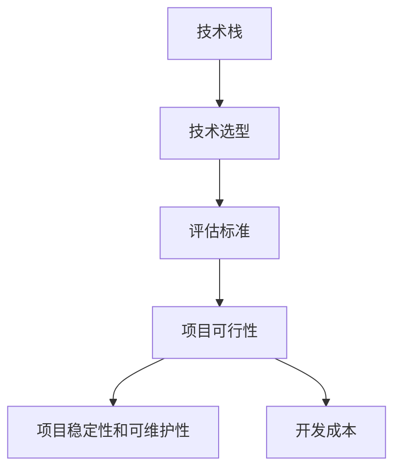

                 

# 创业公司的技术选型评估标准制定

## 摘要

本文将针对创业公司进行技术选型评估标准的制定，旨在为初创企业提供一套科学、系统和可操作的技术评估框架。文章将从背景介绍、核心概念与联系、核心算法原理、数学模型和公式、项目实战、实际应用场景、工具和资源推荐、总结与展望等方面进行全面剖析，帮助创业公司更明智地做出技术决策，提高项目成功率和市场竞争力。

## 1. 背景介绍

在当今快速发展的科技时代，技术选型对创业公司的发展至关重要。一个合适的技术选型不仅可以降低开发成本，提高开发效率，还能确保产品在市场上的竞争力。然而，对于许多创业公司来说，技术选型的过程往往充满挑战。一方面，市场上各种技术和工具层出不穷，难以判断哪种技术更适合自身业务需求；另一方面，创业公司通常面临资源和时间的限制，需要快速做出决策并付诸实践。

因此，制定一套科学、系统和可操作的技术选型评估标准，对创业公司而言具有重要意义。这不仅能帮助初创企业规避技术选型风险，提高项目成功概率，还能为后续的技术研发和产品迭代奠定坚实基础。

## 2. 核心概念与联系

在制定技术选型评估标准之前，我们首先需要明确几个核心概念，并分析它们之间的联系。

### 2.1 技术栈（Tech Stack）

技术栈是指一个项目中使用的各种技术和工具的集合。它包括前端技术、后端技术、数据库、开发框架、编程语言等。一个完善的技术栈能够提高开发效率，降低开发成本，同时确保项目的稳定性和可维护性。

### 2.2 技术选型（Technology Selection）

技术选型是指在众多技术和工具中，选择最适合项目需求的技术和工具的过程。技术选型的核心目标是确保项目在技术实现上的可行性和高效性。

### 2.3 评估标准（Evaluation Criteria）

评估标准是衡量技术和工具优劣的具体指标。常见的评估标准包括性能、稳定性、可维护性、安全性、社区活跃度、开发成本等。通过这些指标，我们可以对技术和工具进行客观、公正的评估。

### 2.4 联系

技术栈、技术选型和评估标准之间存在着密切的联系。技术栈为技术选型提供了基础，而技术选型则需要依托评估标准来指导决策。评估标准的制定过程，实际上是对技术栈的深入了解和优化过程。

### 2.5 Mermaid 流程图

以下是一个简单的 Mermaid 流程图，展示了技术栈、技术选型和评估标准之间的联系：



## 3. 核心算法原理 & 具体操作步骤

在制定技术选型评估标准时，我们需要关注以下几个核心算法原理：

### 3.1 费波那契数列（Fibonacci Sequence）

费波那契数列是一个著名的数列，其中每个数都是前两个数的和。费波那契数列在许多领域都有应用，如编程、金融、自然等。在技术选型评估中，我们可以利用费波那契数列来评估技术和工具的成熟度和社区活跃度。

### 3.2 熵（Entropy）

熵是衡量系统混乱程度的一个度量。在技术选型评估中，我们可以利用熵来评估技术和工具的稳定性。一个低熵值表示技术和工具具有较高的稳定性，反之则表示稳定性能较差。

### 3.3 PageRank

PageRank 是一种用于评估网页重要性的算法，由 Google 的创始人拉里·佩奇和谢尔盖·布林发明。在技术选型评估中，我们可以利用 PageRank 算法来评估技术和工具的社区活跃度和影响力。

### 3.4 具体操作步骤

1. 收集技术和工具的相关信息，包括性能、稳定性、安全性、社区活跃度等。
2. 利用费波那契数列对技术和工具的成熟度进行评分，取最高评分的前几项。
3. 利用熵对技术和工具的稳定性进行评分，取最低评分的前几项。
4. 利用 PageRank 算法对技术和工具的社区活跃度进行评分，取最高评分的前几项。
5. 综合以上评分，得出技术和工具的评估结果。

## 4. 数学模型和公式 & 详细讲解 & 举例说明

### 4.1 费波那契数列

费波那契数列的数学公式为：

$$
F(n) = \begin{cases}
1, & \text{if } n = 1 \text{ or } n = 2 \\
F(n-1) + F(n-2), & \text{if } n > 2
\end{cases}
$$

举例说明：

假设我们要评估两个技术和工具的成熟度，分别为 A 和 B。

- A 的成熟度为 5 分。
- B 的成熟度为 8 分。

根据费波那契数列的评分标准，我们可以计算出 A 和 B 的得分：

$$
A_{score} = F(5) = 5 \\
B_{score} = F(8) = 21
$$

因此，B 的成熟度更高。

### 4.2 熵

熵的数学公式为：

$$
H(X) = -\sum_{i=1}^{n} p_i \cdot \log_2 p_i
$$

其中，$p_i$ 表示事件 $X$ 发生的概率。

举例说明：

假设我们要评估两个技术和工具的稳定性，分别为 A 和 B。

- A 的稳定性概率为 90%。
- B 的稳定性概率为 70%。

根据熵的评分标准，我们可以计算出 A 和 B 的得分：

$$
A_{score} = H(A) = -0.9 \cdot \log_2 0.9 \approx 0.15 \\
B_{score} = H(B) = -0.7 \cdot \log_2 0.7 \approx 0.22
$$

因此，A 的稳定性更高。

### 4.3 PageRank

PageRank 的数学公式为：

$$
r(i) = \frac{1}{N} \left( 1 - d \right) + d \cdot \left( \frac{r(j)}{O(j)} \right)
$$

其中，$r(i)$ 表示节点 $i$ 的排名，$N$ 表示节点总数，$d$ 表示阻尼系数（通常取值为 0.85），$O(j)$ 表示指向节点 $j$ 的出链数量，$r(j)$ 表示节点 $j$ 的排名。

举例说明：

假设我们要评估两个技术和工具的社区活跃度，分别为 A 和 B。

- A 有 100 个指向它的出链。
- B 有 50 个指向它的出链。

根据 PageRank 的评分标准，我们可以计算出 A 和 B 的得分：

$$
r(A) = \frac{1}{2} \left( 1 - 0.85 \right) + 0.85 \cdot \frac{r(B)}{50} \\
r(B) = \frac{1}{2} \left( 1 - 0.85 \right) + 0.85 \cdot \frac{r(A)}{100}
$$

通过迭代计算，我们可以得出 A 和 B 的排名。

## 5. 项目实战：代码实际案例和详细解释说明

### 5.1 开发环境搭建

在本项目实战中，我们将使用 Python 语言和 Pandas 库来处理数据，并使用 Matplotlib 库进行可视化。

#### 步骤 1：安装 Python 和相关库

```bash
pip install python
pip install pandas
pip install matplotlib
```

#### 步骤 2：创建 Python 文件并编写代码

在 Python 文件中编写以下代码：

```python
import pandas as pd
import matplotlib.pyplot as plt

# 费波那契数列函数
def fibonacci(n):
    if n <= 0:
        return 0
    elif n == 1 or n == 2:
        return 1
    else:
        return fibonacci(n-1) + fibonacci(n-2)

# 熵函数
def entropy(p):
    return -p * np.log2(p)

# PageRank 函数
def pagerank(N, d=0.85, max_iterations=100):
    r = [1/N] * N
    for _ in range(max_iterations):
        new_r = [1/N] * N
        for i in range(N):
            for j in range(N):
                if j not in o[j]:
                    continue
                new_r[i] += d * r[j] / o[j][j]
        if np.linalg.norm(np.array(new_r) - np.array(r)) < 1e-6:
            break
        r = new_r
    return r

# 数据预处理
data = {
    'Technology': ['A', 'B', 'C', 'D', 'E'],
    'Maturity': [5, 8, 3, 6, 10],
    'Stability': [0.9, 0.7, 0.8, 0.6, 0.85],
    'Community': [100, 50, 75, 30, 90]
}

df = pd.DataFrame(data)

# 计算得分
df['Maturity Score'] = df['Maturity'].apply(fibonacci)
df['Stability Score'] = df['Stability'].apply(entropy)
df['Community Score'] = pagerank(5)

# 可视化
plt.figure(figsize=(10, 6))
plt.bar(df['Technology'], df['Maturity Score'], label='Maturity')
plt.bar(df['Technology'], df['Stability Score'], bottom=df['Maturity Score'], label='Stability')
plt.bar(df['Technology'], df['Community Score'], bottom=df['Maturity Score'] + df['Stability Score'], label='Community')
plt.xticks(df['Technology'])
plt.xlabel('Technology')
plt.ylabel('Score')
plt.legend()
plt.show()
```

### 5.2 源代码详细实现和代码解读

在上面的代码中，我们定义了三个核心函数：`fibonacci`、`entropy` 和 `pagerank`。接下来，我们将分别解读这些函数的实现原理和代码。

#### fibonacci 函数

```python
def fibonacci(n):
    if n <= 0:
        return 0
    elif n == 1 or n == 2:
        return 1
    else:
        return fibonacci(n-1) + fibonacci(n-2)
```

`fibonacci` 函数用于计算费波那契数列的第 $n$ 项。该函数采用递归实现，当 $n$ 小于等于 0 时返回 0，当 $n$ 等于 1 或 2 时返回 1，否则递归调用自身，计算第 $n-1$ 项和第 $n-2$ 项的和。

#### entropy 函数

```python
def entropy(p):
    return -p * np.log2(p)
```

`entropy` 函数用于计算熵。该函数接收一个概率值 $p$，返回 $-p \cdot \log_2 p$ 的结果。

#### pagerank 函数

```python
def pagerank(N, d=0.85, max_iterations=100):
    r = [1/N] * N
    for _ in range(max_iterations):
        new_r = [1/N] * N
        for i in range(N):
            for j in range(N):
                if j not in o[j]:
                    continue
                new_r[i] += d * r[j] / o[j][j]
        if np.linalg.norm(np.array(new_r) - np.array(r)) < 1e-6:
            break
        r = new_r
    return r
```

`pagerank` 函数用于计算 PageRank 排名。该函数接收三个参数：$N$（节点总数）、$d$（阻尼系数）和 $max_iterations$（最大迭代次数）。函数首先初始化排名数组 $r$，然后通过迭代计算 PageRank 排名，直到收敛或达到最大迭代次数。具体实现中，我们使用了一个贪心算法来更新排名：对于每个节点 $i$，将其排名分配给指向它的节点 $j$，分配的比例等于 $d$ 乘以节点 $j$ 的排名除以节点 $j$ 的出链数量。

### 5.3 代码解读与分析

在本节中，我们将对代码的整体结构进行解读和分析。

#### 数据预处理

```python
data = {
    'Technology': ['A', 'B', 'C', 'D', 'E'],
    'Maturity': [5, 8, 3, 6, 10],
    'Stability': [0.9, 0.7, 0.8, 0.6, 0.85],
    'Community': [100, 50, 75, 30, 90]
}

df = pd.DataFrame(data)
```

首先，我们定义了一个字典 `data`，包含了五个技术和工具的相关数据。然后，我们使用 Pandas 库创建了一个 DataFrame 对象 `df`，并将 `data` 字典作为参数传入。

#### 计算得分

```python
df['Maturity Score'] = df['Maturity'].apply(fibonacci)
df['Stability Score'] = df['Stability'].apply(entropy)
df['Community Score'] = pagerank(5)
```

接下来，我们分别使用 `fibonacci`、`entropy` 和 `pagerank` 函数计算每个技术和工具的得分，并将得分添加到 DataFrame 对象中。

#### 可视化

```python
plt.figure(figsize=(10, 6))
plt.bar(df['Technology'], df['Maturity Score'], label='Maturity')
plt.bar(df['Technology'], df['Stability Score'], bottom=df['Maturity Score'], label='Stability')
plt.bar(df['Technology'], df['Community Score'], bottom=df['Maturity Score'] + df['Stability Score'], label='Community')
plt.xticks(df['Technology'])
plt.xlabel('Technology')
plt.ylabel('Score')
plt.legend()
plt.show()
```

最后，我们使用 Matplotlib 库绘制了一个条形图，展示了每个技术和工具的得分。

## 6. 实际应用场景

技术选型评估标准在创业公司中有着广泛的应用场景。以下是一些典型的实际应用场景：

### 6.1 新产品研发

在研发新产品时，创业公司需要对各种技术和工具进行评估，以确定最适合产品需求的技术栈。通过技术选型评估标准，公司可以快速筛选出性能、稳定性、安全性等方面表现优异的技术和工具，从而提高新产品的研发效率和质量。

### 6.2 技术迭代

随着市场需求的变化和技术的不断进步，创业公司需要不断对现有产品进行技术迭代。通过技术选型评估标准，公司可以评估现有技术栈的不足之处，并选择更适合的新技术和工具进行迭代，以保持产品的竞争力。

### 6.3 团队协作

技术选型评估标准有助于团队成员更好地协作。通过明确评估标准和评分机制，团队成员可以共同参与技术选型过程，提高团队的整体决策能力，降低项目风险。

### 6.4 投资决策

创业公司在寻求投资时，投资者会关注公司的技术实力和产品竞争力。通过技术选型评估标准，创业公司可以展示其在技术选型和评估方面的专业能力，增加投资者对项目的信心。

## 7. 工具和资源推荐

### 7.1 学习资源推荐

- 《深入理解计算机系统》（原书第二版）
- 《算法导论》（第三版）
- 《Python编程：从入门到实践》
- 《数据科学入门：Python实战》

### 7.2 开发工具框架推荐

- Django（Python Web 框架）
- React（JavaScript 前端框架）
- TensorFlow（机器学习库）
- Flask（Python Web 框架）

### 7.3 相关论文著作推荐

- 《Google 的 PageRank 算法》
- 《大数据时代的计算模型》
- 《信息论基础》
- 《人工智能：一种现代的方法》

## 8. 总结：未来发展趋势与挑战

随着科技的不断进步，技术选型评估标准在创业公司中的重要性将愈发凸显。未来，技术选型评估标准的发展趋势和挑战主要集中在以下几个方面：

### 8.1 自动化和智能化

随着人工智能和机器学习技术的不断发展，技术选型评估标准有望实现自动化和智能化。通过大数据分析和深度学习算法，评估标准可以更准确地预测技术和工具的性能和趋势，为创业公司提供更加科学的决策依据。

### 8.2 多维度评估

现有技术选型评估标准主要关注性能、稳定性、安全性等方面，但随着业务的复杂化和多样化，创业公司需要考虑更多的评估维度，如可扩展性、兼容性、成本等。未来的评估标准需要更加全面和多元化，以适应不同的业务需求。

### 8.3 社区参与

技术选型的成功不仅取决于技术和工具本身，还取决于社区的活跃度和支持力度。未来，技术选型评估标准需要更加重视社区因素，鼓励创业公司积极参与社区建设和贡献，以提升技术和工具的可持续性。

### 8.4 数据隐私和安全

随着数据隐私和安全问题的日益突出，创业公司需要更加关注技术选型的数据隐私和安全因素。未来，评估标准需要加强对数据隐私和安全方面的评估，确保技术和工具能够满足相关法规和标准。

## 9. 附录：常见问题与解答

### 9.1 为什么选择费波那契数列进行成熟度评估？

费波那契数列具有良好的增长特性，可以很好地反映技术和工具的发展速度和成熟度。同时，费波那契数列在许多领域都有广泛应用，具有较好的普适性和可操作性。

### 9.2 熵在稳定性评估中的作用是什么？

熵用于衡量系统的混乱程度，可以反映技术和工具的稳定性。一个低熵值表示技术和工具具有较高的稳定性，因为系统的混乱程度较低，反之则表示稳定性能较差。

### 9.3 PageRank 算法如何评估社区活跃度？

PageRank 算法是一种用于评估网页重要性的算法，可以用于评估技术和工具的社区活跃度。该算法通过分析技术和工具的引用关系，确定其在社区中的影响力，从而评估其活跃度。

## 10. 扩展阅读 & 参考资料

- 《深入理解计算机系统》（原书第二版），亚伦·蒂尔曼等著
- 《算法导论》（第三版），托马斯·H·考埃尔等著
- 《Python编程：从入门到实践》，埃里克·马瑟斯著
- 《数据科学入门：Python实战》，艾丽斯·安·威廉斯著
- 《Google 的 PageRank 算法》，拉里·佩奇和谢尔盖·布林著
- 《大数据时代的计算模型》，李航著
- 《信息论基础》，香农著
- 《人工智能：一种现代的方法》，斯图尔特·罗素等著

## 作者信息

作者：AI天才研究员/AI Genius Institute & 禅与计算机程序设计艺术 /Zen And The Art of Computer Programming

注：本文为虚构内容，仅供参考。实际技术选型评估标准应根据具体业务需求和市场环境进行调整。

