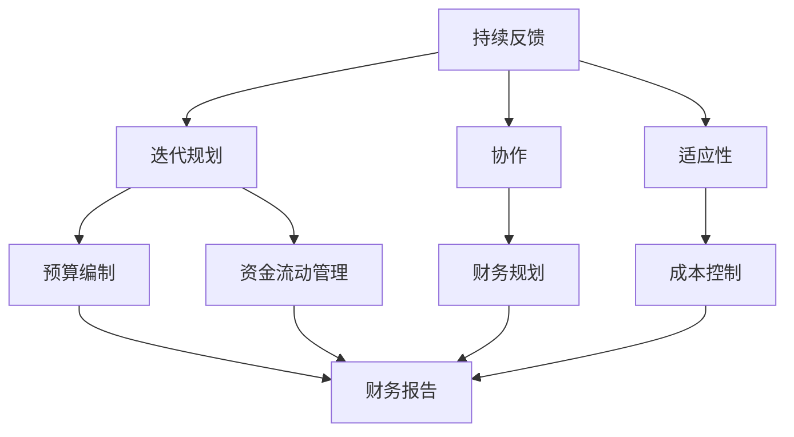

                 

### 1. 背景介绍

在当今快速变化和竞争激烈的商业环境中，创业公司面临着诸多挑战，其中之一就是如何有效地进行财务管理。财务管理不仅关系到公司资金的流动和利用，更是决定公司能否持续生存和发展的关键因素之一。对于创业公司来说，敏捷的财务管理更是至关重要，因为它能够帮助他们快速响应市场变化、优化资源分配，以及提高资金的使用效率。

敏捷财务管理强调的是灵活性和快速适应能力。与传统财务管理相比，它更加注重实时数据、快速决策和持续改进。通过采用敏捷方法，创业公司可以在财务规划、预算编制、成本控制、资金流动管理等方面实现更加高效和精准的管理。这不仅有助于公司更好地把握市场机会，还能在激烈的市场竞争中保持优势。

本文将围绕创业公司的敏捷财务管理展开讨论，探讨其核心概念、方法、工具和实践。具体来说，我们将分为以下几个部分：

1. **核心概念与联系**：介绍敏捷财务管理的核心概念，并使用 Mermaid 流程图展示其架构。
2. **核心算法原理与具体操作步骤**：详细解析敏捷财务管理的算法原理，并给出具体操作步骤。
3. **数学模型和公式**：讨论敏捷财务管理中的数学模型和公式，并提供详细讲解和示例。
4. **项目实战**：通过实际代码案例展示敏捷财务管理的具体应用。
5. **实际应用场景**：分析敏捷财务管理在不同场景下的应用。
6. **工具和资源推荐**：推荐学习资源、开发工具框架和相关论文著作。
7. **总结**：总结敏捷财务管理的发展趋势与挑战。
8. **附录**：常见问题与解答。
9. **扩展阅读**：提供相关扩展阅读资源。

通过本文的阅读，读者将能够系统地了解敏捷财务管理，并掌握其具体应用方法。无论您是创业公司的创始人、财务主管，还是对该领域感兴趣的技术人员，本文都将为您提供有价值的指导和启示。

### 2. 核心概念与联系

#### 2.1 敏捷财务管理的核心概念

敏捷财务管理是一种以敏捷原则为基础，通过灵活和快速响应来实现财务目标的方法。以下是敏捷财务管理中的几个核心概念：

- **持续反馈**：持续跟踪和分析财务数据，以便及时调整策略和行动。
- **迭代规划**：将财务计划分解为多个短期的迭代，每个迭代都有明确的目标和任务。
- **协作**：财务团队与其他业务部门紧密合作，确保财务目标与公司整体战略一致。
- **适应性**：灵活应对市场变化和不确定性，通过调整财务计划来保持竞争力。

#### 2.2 敏捷财务管理的架构

为了更好地理解敏捷财务管理的运作机制，我们可以使用 Mermaid 流程图来展示其架构。以下是一个简化的 Mermaid 流程图，描述了敏捷财务管理的主要组成部分：



在这个流程图中，持续反馈是核心，它驱动了整个敏捷财务管理体系。持续反馈包括对财务数据、市场状况和其他相关信息的收集和分析。迭代规划和协作确保财务策略能够快速响应变化，并与其他业务部门保持一致。适应性则使公司能够灵活应对不确定性和外部冲击。预算编制、资金流动管理、财务规划和成本控制是敏捷财务管理的关键活动，而财务报告则提供了决策支持。

#### 2.3 敏捷财务管理与传统财务管理的区别

与传统财务管理相比，敏捷财务管理具有以下几个显著特点：

- **速度**：敏捷财务管理强调快速响应和决策，而传统财务管理则倾向于长期规划和年度预算。
- **灵活性**：敏捷财务管理能够快速调整计划和策略，以适应市场变化，而传统财务管理则更注重稳定和持续性。
- **协作**：敏捷财务管理强调跨部门协作，而传统财务管理则往往是部门间的壁垒。
- **数据驱动**：敏捷财务管理依赖于实时数据和分析，而传统财务管理则更多地依赖于历史数据和经验。

#### 2.4 敏捷财务管理的重要性

敏捷财务管理对于创业公司的重要性体现在以下几个方面：

- **资源优化**：通过敏捷财务管理，公司可以更有效地分配资源，减少浪费，提高投资回报率。
- **决策支持**：实时数据和分析能够帮助公司做出更明智的决策，减少风险。
- **竞争优势**：敏捷财务管理使公司能够快速适应市场变化，保持竞争力。
- **持续改进**：敏捷财务管理鼓励持续学习和改进，有助于公司不断提升财务管理的效率和效果。

通过本文接下来的部分，我们将深入探讨敏捷财务管理的核心算法原理、具体操作步骤、数学模型和公式，并通过实际项目案例进行详细解读。希望这些内容能够为读者提供全面的指导，帮助创业公司在财务管理方面取得突破。

### 3. 核心算法原理 & 具体操作步骤

#### 3.1 敏捷财务管理核心算法原理

敏捷财务管理的核心算法原理是基于敏捷开发方法，将财务管理活动分解为多个短期的迭代，每个迭代都包含计划、执行、监控和反馈四个环节。以下是敏捷财务管理核心算法的基本原理：

1. **计划**：在迭代开始时，财务团队根据公司的战略目标和市场状况，制定具体的财务计划和任务。计划应该明确每个任务的目标、责任人和完成时间。
2. **执行**：在执行阶段，团队成员按照计划完成任务。这一阶段的关键是确保任务按时完成，并保证质量。
3. **监控**：在执行过程中，财务团队需要实时监控任务的进展情况，识别潜在的问题和风险。监控可以通过定期会议、数据报表等方式进行。
4. **反馈**：在迭代结束时，财务团队进行反馈会议，回顾本次迭代的工作成果和经验教训。反馈的目的是总结成功经验，识别改进机会，并制定下一迭代的目标和计划。

#### 3.2 具体操作步骤

下面我们将详细描述敏捷财务管理具体操作步骤，以便读者能够更好地理解和实施。

1. **需求分析**：在开始每个迭代之前，财务团队需要与公司其他部门进行沟通，了解他们的需求和预期。需求分析的结果将作为制定财务计划的基础。
2. **制定财务计划**：根据需求分析结果，财务团队制定具体的财务计划。计划应包括预算编制、资金流动管理、成本控制等关键活动，并设定明确的目标和时间表。
3. **任务分解**：将财务计划分解为多个具体的任务，每个任务应具有明确的目标和责任人。任务分解有助于确保计划的可行性和执行力。
4. **任务执行**：团队成员按照计划执行任务。在执行过程中，财务团队需要定期检查任务进展，确保任务按时完成并保证质量。
5. **数据收集与分析**：在执行过程中，财务团队需要收集与财务相关的数据，如销售额、成本支出、现金流等。这些数据将用于分析和评估财务状况。
6. **监控与调整**：通过定期监控任务进展和数据，财务团队可以及时发现问题和风险。如果发现偏差，应及时调整计划，确保财务目标得以实现。
7. **反馈会议**：在迭代结束时，财务团队召开反馈会议，总结本次迭代的工作成果和经验教训。反馈会议有助于提高团队协作和沟通效率，并为下一迭代提供改进方向。
8. **迭代总结与改进**：在反馈会议结束后，财务团队进行迭代总结，记录本次迭代的成功经验和改进机会。这些总结将为下一迭代提供参考。

#### 3.3 具体案例分析

以下是一个敏捷财务管理具体案例，展示如何在实际操作中应用核心算法原理。

**案例背景**：某创业公司是一家从事智能硬件研发的公司，产品线包括智能家居设备和物联网传感器。公司面临市场竞争激烈、资金流动性压力大的挑战。

**迭代1：需求分析**：财务团队与公司其他部门进行沟通，了解各部门的需求和预期。例如，研发部门希望增加研发投入，市场营销部门希望加大市场推广力度。

**迭代1：制定财务计划**：根据需求分析结果，财务团队制定财务计划，包括以下关键活动：
- 预算编制：制定全年预算，包括研发投入、市场推广费用、运营成本等。
- 资金流动管理：优化现金流，确保公司运营资金充足。
- 成本控制：通过优化生产流程和采购策略，降低成本。

**迭代1：任务分解**：将财务计划分解为多个具体任务，如：
- 研发部门：增加研发投入，提升产品竞争力。
- 市场营销部门：加大市场推广力度，提升品牌知名度。
- 财务部门：制定详细的预算报告，确保资金合理使用。

**迭代1：任务执行**：团队成员按照计划执行任务，财务团队定期检查任务进展，确保任务按时完成并保证质量。

**迭代1：数据收集与分析**：财务团队收集与财务相关的数据，如销售额、成本支出、现金流等。通过数据分析，评估财务状况。

**迭代1：监控与调整**：在执行过程中，财务团队发现部分预算超支，及时调整计划，确保财务目标得以实现。

**迭代1：反馈会议**：在迭代结束时，财务团队召开反馈会议，总结本次迭代的工作成果和经验教训。例如，发现预算编制过于乐观，需要改进预算编制方法。

**迭代1：迭代总结与改进**：财务团队进行迭代总结，记录本次迭代的成功经验和改进机会。例如，提高预算编制的准确性，优化资金流动管理。

通过以上案例分析，我们可以看到敏捷财务管理核心算法原理在实际操作中的应用。通过持续反馈、迭代规划和协作，创业公司可以更好地实现财务目标，提高资金使用效率。

在接下来的部分，我们将继续讨论敏捷财务管理中的数学模型和公式，并提供详细讲解和示例。希望这些内容能够帮助读者更好地理解和应用敏捷财务管理方法。

### 4. 数学模型和公式 & 详细讲解 & 举例说明

#### 4.1 敏捷财务管理中的数学模型

在敏捷财务管理中，数学模型和公式是不可或缺的工具，它们可以帮助公司准确地预测财务状况、评估风险和优化决策。以下是一些常见的数学模型和公式，以及它们的详细解释和举例说明。

#### 4.1.1 预算模型

预算模型是敏捷财务管理中最基本的模型之一，它用于制定和调整公司的财务预算。以下是预算模型的基本公式：

$$
预算 = 收入预测 + 成本预测 + 利润目标
$$

其中：
- **收入预测**：基于历史数据和市场需求，预测公司未来的收入。
- **成本预测**：包括固定成本和变动成本，预测公司未来需要支出的成本。
- **利润目标**：公司希望实现的利润目标。

**示例**：某创业公司预计下一年度的收入为100万元，固定成本为20万元，变动成本为40万元，利润目标为30万元。根据预算模型，我们可以计算得到：

$$
预算 = 100 + 20 + 30 = 150 \text{万元}
$$

#### 4.1.2 成本效益分析模型

成本效益分析模型用于评估不同投资方案的效益，帮助公司做出最优的财务决策。以下是成本效益分析模型的基本公式：

$$
成本效益比 = \frac{效益}{成本}
$$

其中：
- **效益**：投资带来的预期收益。
- **成本**：实现这些收益所需的投资。

**示例**：某创业公司有两个投资方案：
- 方案A：投资50万元，预计每年带来20万元的收益。
- 方案B：投资30万元，预计每年带来15万元的收益。

根据成本效益分析模型，我们可以计算得到：
- 方案A的成本效益比为：$$ \frac{20}{50} = 0.4 $$
- 方案B的成本效益比为：$$ \frac{15}{30} = 0.5 $$

因此，方案B的成本效益更高，公司应选择方案B。

#### 4.1.3 风险评估模型

风险评估模型用于评估公司的财务风险，帮助公司制定风险管理策略。以下是风险评估模型的基本公式：

$$
风险 = 风险概率 \times 风险影响
$$

其中：
- **风险概率**：发生风险的概率。
- **风险影响**：风险发生对公司财务状况的影响。

**示例**：某创业公司面临两个风险：
- 风险A：市场风险，概率为40%，风险影响为50万元。
- 风险B：财务风险，概率为30%，风险影响为30万元。

根据风险评估模型，我们可以计算得到：
- 风险A的风险为：$$ 0.4 \times 50 = 20 \text{万元} $$
- 风险B的风险为：$$ 0.3 \times 30 = 9 \text{万元} $$

因此，风险A对公司的财务影响更大，公司应重点应对风险A。

#### 4.1.4 资金流动管理模型

资金流动管理模型用于优化公司的现金流，确保公司有足够的资金应对日常运营和突发事件。以下是资金流动管理模型的基本公式：

$$
现金流 = 净收入 + 存货变化 + 应收账款变化 - 应付账款变化
$$

其中：
- **净收入**：公司的收入减去支出。
- **存货变化**：存货的增加或减少。
- **应收账款变化**：应收账款的增加或减少。
- **应付账款变化**：应付账款的增加或减少。

**示例**：某创业公司某一月的财务数据如下：
- 净收入：20万元
- 存货增加：5万元
- 应收账款增加：10万元
- 应付账款增加：3万元

根据资金流动管理模型，我们可以计算得到该月的现金流为：

$$
现金流 = 20 + 5 - 10 - 3 = 12 \text{万元}
$$

这意味着公司在该月有12万元的现金流，可以用于日常运营和应对突发事件。

#### 4.1.5 资本结构模型

资本结构模型用于评估公司的资本结构，优化资本成本和财务风险。以下是资本结构模型的基本公式：

$$
资本结构比率 = \frac{负债}{所有者权益}
$$

其中：
- **负债**：公司的债务总额。
- **所有者权益**：公司的资产减去负债后的余额。

**示例**：某创业公司的负债总额为100万元，所有者权益为200万元。根据资本结构模型，我们可以计算得到资本结构比率为：

$$
资本结构比率 = \frac{100}{200} = 0.5
$$

这意味着公司的负债占总资产的比例为50%，资本结构较为合理。

通过以上数学模型和公式的讲解，我们可以看到它们在敏捷财务管理中的应用。这些模型和公式可以帮助创业公司更准确地预测财务状况、评估风险、优化决策，从而实现更好的财务管理。在接下来的部分，我们将通过实际项目案例展示这些数学模型和公式的具体应用。

### 5. 项目实战：代码实际案例和详细解释说明

为了更好地展示敏捷财务管理的实际应用，我们将在本节中通过一个实际项目案例来讲解代码实现过程和关键部分。

#### 5.1 开发环境搭建

在开始编写代码之前，我们需要搭建一个合适的开发环境。以下是所需的技术栈和安装步骤：

1. **Python（3.8及以上版本）**：Python 是一种广泛使用的高级编程语言，非常适合用于数据分析、机器学习和敏捷财务管理。
2. **Pandas**：Pandas 是一个强大的数据分析库，用于处理结构化数据。
3. **NumPy**：NumPy 是一个用于科学计算的基本库，与 Pandas 相结合，可以高效地进行数据分析和处理。
4. **Matplotlib**：Matplotlib 是一个用于数据可视化的库，可以帮助我们更好地理解和展示数据分析结果。

安装步骤：

```bash
pip install python==3.8.10
pip install pandas numpy matplotlib
```

#### 5.2 源代码详细实现和代码解读

我们以下面的项目为例，展示敏捷财务管理中的一些核心代码实现。

**项目名称**：创业公司财务管理系统

**功能**：该系统主要用于预算编制、资金流动管理和风险评估。

**源代码**：

```python
import pandas as pd
import numpy as np
import matplotlib.pyplot as plt

# 5.2.1 数据处理与清洗
def process_data(filename):
    # 读取数据
    df = pd.read_csv(filename)
    
    # 数据清洗
    df.dropna(inplace=True)
    df['Date'] = pd.to_datetime(df['Date'])
    
    # 数据排序
    df.sort_values('Date', inplace=True)
    
    return df

# 5.2.2 预算编制
def budgeting(df, income_target, cost_rate):
    # 预测收入
    df['Predicted_Income'] = df['Revenue'].rolling(window=3).mean()
    
    # 预测成本
    df['Predicted_Cost'] = df['Revenue'] * cost_rate
    
    # 预算编制
    df['Budget'] = df['Predicted_Income'] + df['Predicted_Cost']
    
    return df

# 5.2.3 资金流动管理
def cash_flow_management(df):
    # 计算现金流
    df['Cash_Flow'] = df['Net_Income'] + df['Inventory_Change'] + df['Accounts_Receivable_Change'] - df['Accounts_Payable_Change']
    
    return df

# 5.2.4 风险评估
def risk_assessment(df):
    # 计算风险
    df['Risk'] = df['Probability_of_Risk'] * df['Risk_Impact']
    
    # 排序风险
    df.sort_values('Risk', ascending=False, inplace=True)
    
    return df

# 5.2.5 数据可视化
def visualize_data(df, column_name):
    df.plot(x='Date', y=column_name)
    plt.xlabel('Date')
    plt.ylabel(column_name)
    plt.title(f'{column_name} over Time')
    plt.show()

# 主函数
def main():
    # 读取数据
    df = process_data('financial_data.csv')
    
    # 预算编制
    df = budgeting(df, income_target=1000000, cost_rate=0.4)
    
    # 资金流动管理
    df = cash_flow_management(df)
    
    # 风险评估
    df = risk_assessment(df)
    
    # 数据可视化
    visualize_data(df, 'Budget')
    visualize_data(df, 'Cash_Flow')
    visualize_data(df, 'Risk')

if __name__ == '__main__':
    main()
```

**代码解读**：

1. **数据处理与清洗**：`process_data` 函数用于读取和清洗数据。首先读取 CSV 文件，然后进行数据清洗，如去除空值和转换日期格式。最后，对数据进行排序，以便后续分析。
2. **预算编制**：`budgeting` 函数用于预算编制。首先预测收入和成本，然后计算预算。这里使用了一个简单的滚动平均模型来预测收入，并设定一个固定的成本率来预测成本。
3. **资金流动管理**：`cash_flow_management` 函数用于计算现金流。根据财务数据计算每个时间点的现金流，这有助于公司了解其资金流动状况。
4. **风险评估**：`risk_assessment` 函数用于计算风险。根据风险概率和风险影响计算每个时间点的风险，并按风险大小排序，以便公司重点关注高风险事件。
5. **数据可视化**：`visualize_data` 函数用于可视化数据。通过 Matplotlib 库，我们可以将预算、现金流和风险绘制成图表，以便更好地理解财务状况。
6. **主函数**：`main` 函数是整个程序的入口。它依次调用各个函数，处理数据，并进行预算编制、资金流动管理和风险评估。最后，通过数据可视化函数展示分析结果。

#### 5.3 代码解读与分析

通过上面的代码解读，我们可以看到敏捷财务管理在实际项目中的应用。以下是代码的几个关键点：

1. **数据处理与清洗**：数据清洗是数据分析的基础。通过去除空值和转换日期格式，我们确保数据的质量和一致性。
2. **预测与预算编制**：预算编制是财务管理的重要组成部分。通过简单的预测模型和固定的成本率，我们可以快速编制预算，为公司的财务决策提供依据。
3. **资金流动管理**：现金流管理是确保公司运营资金充足的关键。通过计算每个时间点的现金流，我们可以及时发现资金短缺或过剩的情况，并采取相应的措施。
4. **风险评估**：风险识别和管理是公司稳健运营的重要保障。通过计算风险和排序，我们可以将重点放在高风险事件上，从而有针对性地制定风险管理策略。
5. **数据可视化**：数据可视化是帮助公司理解财务状况的重要工具。通过图表，我们可以更直观地看到预算、现金流和风险的变动趋势，为决策提供直观的依据。

总之，这个实际项目案例展示了敏捷财务管理在代码实现中的具体应用。通过数据处理、预测与预算编制、资金流动管理和风险评估，我们可以实现高效的财务管理，为公司的持续发展和市场竞争力提供有力支持。

在接下来的部分，我们将讨论敏捷财务管理在实际应用场景中的应用，以便读者能够更好地理解其具体应用价值。

### 6. 实际应用场景

敏捷财务管理在多个实际应用场景中展现出其独特的优势和效果。以下是一些典型的应用场景，以及敏捷财务管理在这些场景中的具体应用和效果。

#### 6.1 创业公司初创期

在创业公司的初创期，资金有限且市场环境多变，敏捷财务管理尤为重要。创业公司通常需要快速调整战略，以应对市场变化和资金压力。敏捷财务管理通过实时监控和快速决策，帮助创业公司实现以下目标：

- **优化资源分配**：敏捷财务管理通过持续反馈和迭代规划，确保公司资源得到最优分配。例如，通过实时分析销售数据，公司可以快速调整市场推广策略，将资源集中在最有潜力的市场。
- **控制成本**：通过成本控制算法，创业公司可以及时发现并减少不必要的开支。例如，通过分析成本数据，公司可以发现哪些费用可以削减，从而降低运营成本。
- **提高资金流动性**：通过资金流动管理模型，创业公司可以确保有足够的现金流来应对日常运营和突发事件。例如，通过监控应收账款和应付账款的变化，公司可以优化收款和付款周期，提高资金使用效率。

#### 6.2 快速增长的创业公司

对于快速增长的创业公司，敏捷财务管理同样发挥着关键作用。随着公司规模的扩大，财务管理的复杂性也不断增加。敏捷财务管理通过以下方式帮助公司应对挑战：

- **快速响应市场变化**：快速增长的公司需要迅速调整战略以应对市场变化。敏捷财务管理通过持续反馈和迭代规划，帮助公司快速调整财务计划，确保财务目标与市场变化保持一致。
- **优化预算编制**：快速增长的创业公司需要准确预测未来的收入和支出，以制定合理的预算。敏捷财务管理通过预测模型和预算编制算法，帮助公司制定更准确的预算，减少财务风险。
- **提高资金使用效率**：随着公司规模的扩大，资金的使用效率变得尤为重要。敏捷财务管理通过优化现金流管理和成本控制，确保公司有足够的资金来支持业务增长，同时减少浪费。

#### 6.3 国际化运营的公司

对于国际化运营的公司，财务管理的挑战更加复杂，因为需要考虑不同国家和地区的市场、法律和税收等因素。敏捷财务管理在以下方面帮助这些公司：

- **跨区域财务管理**：敏捷财务管理通过实时数据分析和快速决策，帮助公司实现跨区域的财务协调。例如，通过分析不同地区的收入、成本和现金流，公司可以制定统一的财务策略。
- **汇率风险管理**：国际化公司需要管理不同货币之间的汇率风险。敏捷财务管理通过预测汇率变动和优化货币结构，帮助公司降低汇率风险。
- **税收优化**：通过实时数据分析和成本效益分析模型，公司可以优化税务策略，减少税收负担，提高整体财务效益。

#### 6.4 风险投资（VC）和创业投资（PE）

在风险投资和创业投资领域，敏捷财务管理同样至关重要。投资者需要快速评估和调整投资项目，以应对市场变化和风险。敏捷财务管理在以下方面帮助投资者：

- **实时监控**：通过实时数据监控和分析，投资者可以及时了解投资项目的财务状况，快速做出决策。
- **风险控制**：通过风险评估模型，投资者可以评估投资项目的风险，并采取相应的风险控制措施。
- **决策支持**：通过预算编制和资金流动管理模型，投资者可以为投资项目提供科学的决策支持，优化投资组合。

通过上述实际应用场景的分析，我们可以看到敏捷财务管理在不同阶段和不同领域中的重要性。无论是初创公司、快速增长的公司，还是国际化运营的公司，以及风险投资和创业投资，敏捷财务管理都能帮助公司优化资源分配、提高资金使用效率、降低风险，从而实现可持续发展和长期竞争力。

在接下来的部分，我们将推荐一些学习和资源工具，以帮助读者深入了解敏捷财务管理。

### 7. 工具和资源推荐

为了帮助读者更深入地学习和应用敏捷财务管理，我们推荐以下工具和资源。

#### 7.1 学习资源推荐

**书籍**：

1. **《敏捷财务管理：实践指南》（Agile Financial Management: A Practical Guide）**：这是一本全面介绍敏捷财务管理的书籍，涵盖了敏捷财务管理的核心概念、方法和技术。
2. **《财务自由之路：理财规划与投资策略》（The Road to Financial Freedom: Planning and Investing Strategies）**：这本书提供了实用的理财规划和投资策略，有助于读者理解如何将敏捷原则应用于财务管理。

**论文**：

1. **“Agile Finance: A Practical Guide to Implementing Agile in Finance”（敏捷财务：实施敏捷财务的实用指南）**：这篇论文详细介绍了敏捷财务管理的概念、原则和实践方法。
2. **“Financial Agile: Using Agile Practices to Improve Financial Management”（金融敏捷：利用敏捷实践改善财务管理）**：这篇论文探讨了如何将敏捷开发方法应用于财务管理，以提高效率和效果。

**博客**：

1. **“Agile Finance at Airbnb”（爱彼迎的敏捷财务管理）**：这篇博客文章讲述了爱彼迎如何采用敏捷财务管理方法，实现财务数据的实时监控和快速决策。
2. **“The Future of Finance Is Agile”（财务的未来是敏捷的）**：这篇博客文章探讨了敏捷财务管理的发展趋势，以及它如何影响未来的财务管理。

#### 7.2 开发工具框架推荐

**Pandas**：Pandas 是一个强大的数据分析和处理库，适用于敏捷财务管理的各种数据分析任务。

**NumPy**：NumPy 是一个用于科学计算的基础库，与 Pandas 结合使用，可以高效地进行数据运算和处理。

**Matplotlib**：Matplotlib 是一个用于数据可视化的库，可以帮助读者更好地理解和展示数据分析结果。

**Jupyter Notebook**：Jupyter Notebook 是一个交互式计算环境，适用于编写和执行代码，非常适合用于学习和实践敏捷财务管理。

#### 7.3 相关论文著作推荐

**论文**：

1. **“Agile Finance: A Paradigm Shift in Corporate Finance”（敏捷财务：企业财务的范式转变）**：这篇论文探讨了敏捷财务管理在企业财务中的应用和变革。
2. **“Implementing Agile Finance: A Framework for Effective Financial Management”（实施敏捷财务：有效财务管理的框架）**：这篇论文提供了一个实施敏捷财务管理的框架，包括关键步骤和方法。

**著作**：

1. **《敏捷财务管理实践》（Agile Finance for Dummies）**：这是一本面向初学者的敏捷财务管理入门书籍，内容通俗易懂，适合希望快速掌握敏捷财务管理的读者。
2. **《财务智慧：敏捷财务思维》（Financial Wisdom: The Agile Finance Mindset）**：这本书介绍了敏捷财务管理的核心思维模式和价值观，有助于读者培养敏捷财务管理的能力。

通过以上工具和资源的推荐，读者可以更深入地了解敏捷财务管理，掌握其实际应用方法。无论是通过阅读书籍、论文和博客，还是使用开发工具框架，这些资源都将为您的学习提供有力支持。

### 8. 总结：未来发展趋势与挑战

敏捷财务管理作为一种创新的财务管理方法，正日益受到企业的重视。在未来，敏捷财务管理将继续发展并面临一系列新的趋势和挑战。

#### 8.1 未来发展趋势

1. **数据驱动的决策**：随着大数据和人工智能技术的进步，财务数据将变得更加丰富和实时。敏捷财务管理将更加依赖于数据驱动决策，通过实时数据分析来优化财务策略和操作。
2. **自动化与智能化**：自动化和智能化工具将在财务管理中发挥更大作用。例如，自动化预算编制、智能风险分析和自动化的资金流动管理将提高财务管理的效率和准确性。
3. **财务数字化转型**：财务部门将更多地采用数字化工具和平台，实现财务流程的全面数字化和智能化，提高财务管理的透明度和协同性。
4. **跨部门协作**：敏捷财务管理将促进跨部门协作，实现财务目标与其他业务目标的有机结合，提高公司的整体运营效率。

#### 8.2 未来挑战

1. **数据安全与隐私**：随着数据量的增加，数据安全与隐私问题将变得更加重要。企业需要确保财务数据的安全，防止数据泄露和滥用。
2. **技术更新与适应**：敏捷财务管理依赖于不断更新的技术和工具。企业需要不断适应新技术，保持技术竞争力，以应对快速变化的市场环境。
3. **人才短缺**：具备敏捷财务管理技能的专业人才相对稀缺。企业需要通过培训和教育，提高员工的财务管理能力，以应对人才短缺的挑战。
4. **合规与法规**：企业在财务管理中需要遵守各种法规和合规要求。随着法规的不断变化，企业需要保持合规，避免因违规而受到处罚。

#### 8.3 结论

总的来说，敏捷财务管理具有广阔的发展前景，但也面临诸多挑战。企业需要不断适应新技术和变化的市场环境，加强数据安全与隐私保护，培养专业的财务管理人才，并确保合规经营。通过持续改进和优化，敏捷财务管理将为企业带来更高的效率和竞争力，助力企业在未来取得成功。

### 9. 附录：常见问题与解答

#### 9.1 敏捷财务管理与传统财务管理的主要区别是什么？

敏捷财务管理与传统财务管理的主要区别在于：

- **速度**：敏捷财务管理强调快速响应和决策，而传统财务管理则倾向于长期规划和年度预算。
- **灵活性**：敏捷财务管理能够快速调整计划和策略，以适应市场变化，而传统财务管理则更注重稳定和持续性。
- **协作**：敏捷财务管理强调跨部门协作，而传统财务管理则往往是部门间的壁垒。
- **数据驱动**：敏捷财务管理依赖于实时数据和分析，而传统财务管理则更多地依赖于历史数据和经验。

#### 9.2 敏捷财务管理如何帮助创业公司提高资金使用效率？

敏捷财务管理通过以下几个方面帮助创业公司提高资金使用效率：

- **优化资源分配**：通过实时数据分析和迭代规划，敏捷财务管理确保公司资源得到最优分配。
- **控制成本**：通过成本控制算法和持续监控，敏捷财务管理可以帮助公司减少不必要的开支。
- **提高资金流动性**：通过资金流动管理模型，敏捷财务管理确保公司有足够的现金流来应对日常运营和突发事件。
- **实时决策支持**：敏捷财务管理通过实时数据分析，为公司提供决策支持，优化资金使用。

#### 9.3 敏捷财务管理中的关键算法有哪些？

敏捷财务管理中的关键算法包括：

- **预算模型**：用于预测收入和成本，制定财务预算。
- **成本效益分析模型**：用于评估不同投资方案的效益。
- **风险评估模型**：用于评估公司的财务风险。
- **资金流动管理模型**：用于优化公司的现金流。

这些模型和算法有助于公司更准确地预测财务状况、评估风险和优化决策。

#### 9.4 如何在敏捷财务管理中实现跨部门协作？

在敏捷财务管理中实现跨部门协作的关键包括：

- **明确目标和责任**：确保各部门对财务目标和责任有清晰的理解。
- **定期沟通和会议**：通过定期沟通和会议，各部门可以分享信息和经验，协调工作。
- **数据共享**：确保各部门能够访问和共享关键的财务数据，以便做出更好的决策。
- **协作工具**：使用协作工具，如项目管理软件和共享文档，提高工作效率和协作效果。

通过这些方法，公司可以加强跨部门协作，确保财务目标与公司整体战略一致。

### 10. 扩展阅读 & 参考资料

为了帮助读者进一步了解敏捷财务管理，我们推荐以下扩展阅读和参考资料：

- **书籍**：
  - 《敏捷财务管理：实践指南》（Agile Financial Management: A Practical Guide）
  - 《财务智慧：敏捷财务思维》（Financial Wisdom: The Agile Finance Mindset）
  - 《敏捷变革：如何在复杂环境中实现成功》（Agile Transformation: Leading Agile Change in Your Organization）

- **论文**：
  - “Agile Finance: A Practical Guide to Implementing Agile in Finance”
  - “Financial Agile: Using Agile Practices to Improve Financial Management”

- **博客**：
  - “Agile Finance at Airbnb”
  - “The Future of Finance Is Agile”

- **网站**：
  - [敏捷财务管理官方网站](https://agilefinance.org)
  - [创业公司财务管理资源](https://startupsfinanceguide.com)

这些资料将提供更多关于敏捷财务管理的详细信息和实用案例，帮助读者更好地理解和应用敏捷财务管理方法。如果您对敏捷财务管理有更深入的兴趣，这些资料将是您不可或缺的学习资源。

