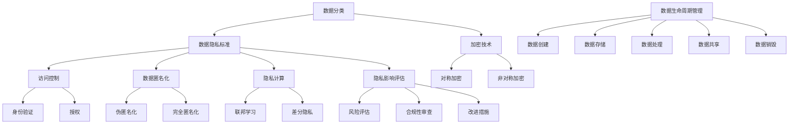

                 

## 1. 背景介绍

### 创业公司数据隐私保护的必要性

在数字化时代，数据已成为创业公司的核心竞争力之一。然而，随着数据量的爆炸性增长，数据隐私保护问题日益突出。对于创业公司而言，数据隐私保护不仅关系到用户的信任和满意度，还直接影响到公司的声誉和业务发展。以下是一些具体的原因，解释了为什么创业公司需要特别关注数据隐私保护：

**1. 用户信任与满意度**：用户越来越关注个人信息的安全，如果创业公司无法提供可靠的数据隐私保护，将导致用户流失和信任度下降。

**2. 法律法规要求**：许多国家和地区都有严格的数据隐私法规，如欧盟的《通用数据保护条例》（GDPR）和美国的《加州消费者隐私法案》（CCPA）。创业公司如果不遵守这些法规，可能会面临巨额罚款。

**3. 商业声誉**：数据泄露事件一旦发生，会严重损害公司的声誉，影响业务发展。尤其是在竞争激烈的市场环境中，隐私泄露可能导致用户和合作伙伴的信任丧失。

**4. 资本融资**：投资者在考虑投资创业公司时，会关注其数据隐私保护措施。良好的隐私保护实践可以提高公司的可信度和吸引力。

**5. 竞争优势**：创业公司通过实施有效的数据隐私保护策略，可以建立自己的竞争优势，吸引更多的用户和合作伙伴。

### 数据隐私保护的关键挑战

尽管创业公司认识到数据隐私保护的重要性，但在实际操作中仍面临诸多挑战：

**1. 数据量与多样性**：创业公司可能需要处理来自多个渠道的大量数据，包括用户数据、交易数据、社交媒体数据等，这使得隐私保护变得更加复杂。

**2. 技术发展迅速**：随着人工智能、云计算和物联网等技术的快速发展，创业公司需要不断更新和改进其隐私保护措施。

**3. 人才短缺**：数据隐私保护需要专业的技术和法律知识，而许多创业公司在招聘这方面的人才时面临困难。

**4. 预算限制**：创业公司通常预算有限，需要在数据隐私保护和业务发展之间找到平衡点。

**5. 持续性挑战**：数据隐私保护是一个持续的过程，需要不断的监督和更新，这对创业公司来说是一个长期的挑战。

在接下来的章节中，我们将详细探讨数据隐私保护的核心概念、算法原理、数学模型、实际应用场景，以及相关工具和资源的推荐，帮助创业公司构建一个全面、有效的数据隐私保护体系。

### 2. 核心概念与联系

为了深入理解创业公司的数据隐私保护实践，我们需要首先了解一些核心概念，并探讨它们之间的联系。以下是数据隐私保护中的几个关键概念及其相互关系。

#### 2.1 数据分类

数据分类是数据隐私保护的基础。根据数据的敏感性，可以将数据分为以下几类：

- **公开数据**：不涉及敏感信息，可以公开分享。
- **敏感数据**：包括个人信息、财务信息、医疗记录等，需要受到严格的保护。
- **敏感+公开数据**：既有公开部分，也有敏感部分，如社交媒体的用户名和部分信息。

#### 2.2 数据隐私标准

数据隐私标准是确保数据在存储、传输和处理过程中得到保护的一系列规则和措施。以下是一些常见的标准：

- **保密性**：确保只有授权用户可以访问敏感数据。
- **完整性**：确保数据不被未经授权的修改。
- **可用性**：确保在需要时，数据可以随时访问。

#### 2.3 加密技术

加密技术是数据隐私保护的重要手段。通过加密，敏感数据在传输和存储过程中可以被转换为密文，只有拥有解密密钥的用户才能读取。

- **对称加密**：使用相同的密钥进行加密和解密，如AES算法。
- **非对称加密**：使用一对密钥（公钥和私钥）进行加密和解密，如RSA算法。

#### 2.4 访问控制

访问控制是确保数据安全的关键措施，通过限制对数据的访问，防止未经授权的访问和数据泄露。

- **身份验证**：通过用户名和密码、双因素认证等方式，确认用户的身份。
- **授权**：根据用户的角色和权限，允许或禁止访问特定的数据或功能。

#### 2.5 数据匿名化

数据匿名化是将个人身份信息从数据中移除或替换，以保护个人隐私。匿名化技术包括：

- **伪匿名化**：通过添加随机噪声或扰动，使得原始数据无法直接识别个人身份。
- **完全匿名化**：通过彻底删除或替换个人身份信息，使数据完全匿名。

#### 2.6 隐私计算

隐私计算是一种在数据不离开用户设备的情况下进行计算的方法，旨在保护数据隐私。隐私计算技术包括：

- **联邦学习**：通过在多个设备上进行模型训练，而不是集中收集数据。
- **差分隐私**：在数据分析过程中，引入随机噪声，使得分析结果对个体隐私的泄露最小化。

#### 2.7 隐私影响评估

隐私影响评估（Privacy Impact Assessment, PIA）是一种系统化的方法，用于评估和处理数据处理活动对隐私的影响。PIA包括以下步骤：

1. **风险评估**：识别潜在的风险和影响。
2. **合规性审查**：检查数据处理活动是否符合隐私法规。
3. **改进措施**：制定和实施改进措施，以降低隐私风险。

#### 2.8 数据生命周期管理

数据生命周期管理是一种全面的方法，用于管理数据从创建到删除的整个过程。数据生命周期管理包括以下阶段：

- **数据创建**：收集和生成数据。
- **数据存储**：在安全的存储环境中保存数据。
- **数据处理**：对数据进行分析和处理。
- **数据共享**：在符合隐私保护的前提下共享数据。
- **数据销毁**：在不再需要数据时，安全地删除数据。

通过以上核心概念和联系的了解，创业公司可以更好地制定和实施数据隐私保护策略，确保其数据在各个阶段都得到妥善的保护。

#### 2.9 Mermaid 流程图

以下是一个用于展示数据隐私保护核心概念和架构的Mermaid流程图：



通过这个流程图，我们可以清晰地看到各个核心概念和技术的相互关系，以及数据从创建到销毁的整个生命周期管理过程。

### 3. 核心算法原理 & 具体操作步骤

在数据隐私保护中，核心算法扮演着至关重要的角色。这些算法通过加密、匿名化、访问控制等技术，确保数据在各个阶段都得到有效保护。在本节中，我们将介绍几种关键算法的原理和具体操作步骤。

#### 3.1 对称加密算法

对称加密算法是一种加密和解密使用相同密钥的加密方法。最常见的对称加密算法包括AES（高级加密标准）和DES（数据加密标准）。

**原理：**

- **密钥生成**：首先生成一个密钥，该密钥是加密和解密过程中的关键。
- **加密过程**：使用密钥将明文数据转换为密文数据。
- **解密过程**：使用相同的密钥将密文数据转换回明文数据。

**具体操作步骤：**

1. **密钥生成**：随机生成一个密钥。
2. **加密过程**：
   - 输入：明文数据、密钥。
   - 输出：密文数据。
   - 使用AES加密算法进行加密。
3. **解密过程**：
   - 输入：密文数据、密钥。
   - 输出：明文数据。
   - 使用AES加密算法进行解密。

**示例代码**（Python示例）：

```python
from Crypto.Cipher import AES
from Crypto.Util.Padding import pad, unpad
from Crypto.Random import get_random_bytes

# 密钥生成
key = get_random_bytes(16)

# 明文数据
plaintext = b"Hello, World!"

# 加密
cipher = AES.new(key, AES.MODE_CBC)
ciphertext = cipher.encrypt(pad(plaintext, AES.block_size))

# 解密
cipher2 = AES.new(key, AES.MODE_CBC)
decrypted_text = unpad(cipher2.decrypt(ciphertext), AES.block_size)

print("密文:", ciphertext)
print("明文:", decrypted_text)
```

#### 3.2 非对称加密算法

非对称加密算法使用一对密钥（公钥和私钥）进行加密和解密。RSA算法是一种广泛使用的非对称加密算法。

**原理：**

- **密钥生成**：生成一对密钥，公钥用于加密，私钥用于解密。
- **加密过程**：使用公钥将明文数据加密为密文。
- **解密过程**：使用私钥将密文解密回明文。

**具体操作步骤：**

1. **密钥生成**：
   - 输入：无。
   - 输出：公钥、私钥。
   - 使用RSA算法生成一对密钥。
2. **加密过程**：
   - 输入：明文数据、公钥。
   - 输出：密文数据。
   - 使用RSA算法进行加密。
3. **解密过程**：
   - 输入：密文数据、私钥。
   - 输出：明文数据。
   - 使用RSA算法进行解密。

**示例代码**（Python示例）：

```python
from Crypto.PublicKey import RSA
from Crypto.Cipher import PKCS1_OAEP

# 密钥生成
key = RSA.generate(2048)
private_key = key.export_key()
public_key = key.publickey().export_key()

# 加密
cipher = PKCS1_OAEP.new(RSA.import_key(public_key))
plaintext = b"Hello, World!"
ciphertext = cipher.encrypt(plaintext)

# 解密
cipher2 = PKCS1_OAEP.new(RSA.import_key(private_key))
decrypted_text = cipher2.decrypt(ciphertext)

print("密文:", ciphertext)
print("明文:", decrypted_text)
```

#### 3.3 差分隐私算法

差分隐私是一种通过向分析结果中添加噪声来保护个人隐私的方法。Laplace机制是一种常见的差分隐私算法。

**原理：**

- **噪声添加**：在数据分析过程中，向结果中添加随机噪声。
- **隐私保证**：噪声的大小和分布可以保证对个体隐私的泄露最小化。

**具体操作步骤：**

1. **数据预处理**：对原始数据进行预处理，包括清洗、归一化等。
2. **噪声添加**：
   - 输入：数据、隐私预算。
   - 输出：带噪声的数据。
   - 使用Laplace分布添加噪声。
3. **数据分析**：对带噪声的数据进行统计分析。

**示例代码**（Python示例）：

```python
import numpy as np
from scipy.stats import laplace

# 噪声添加
def add_noise(data, sensitivity=1.0, alpha=1.0):
    noise = laplace.rvs(scale=sensitivity, size=data.shape)
    return data + alpha * noise

# 数据预处理
data = np.array([1, 2, 3, 4, 5])

# 添加噪声
sensitive_data = add_noise(data, sensitivity=0.5, alpha=0.5)

print("敏感数据:", data)
print("带噪声的数据:", sensitive_data)
```

通过以上几种算法的介绍，创业公司可以更好地理解和实施数据隐私保护策略。这些算法不仅提供了强大的技术保障，还为创业公司在实际操作中提供了具体的操作指南。

### 4. 数学模型和公式 & 详细讲解 & 举例说明

#### 4.1 加密算法中的数学模型

加密算法的核心在于将明文转换为难以破解的密文，这涉及到复杂的数学模型和公式。以下介绍几种常见的加密算法及其数学模型。

#### 4.1.1 对称加密算法：AES

AES（高级加密标准）是一种基于区块的对称加密算法，它使用一个固定大小的密钥和块大小来加密数据。AES的密钥长度可以是128位、192位或256位。

**加密过程**：

- **密钥扩展**：将原始密钥扩展为多个轮密钥，每个轮密钥都是基于前一轮密钥和特定的轮函数计算得到的。
- **初始轮**：将明文块与第一个轮密钥进行异或操作。
- **中间轮**：每个中间轮都包括四个步骤：字节替换（SubBytes）、行移位（ShiftRows）、列混淆（MixColumns）和轮密钥加（AddRoundKey）。
- **最终轮**：最后一个轮不执行列混淆步骤。

**加密公式**：

$$
C = E(K, P) = \text{AddRoundKey}(P \oplus K_0)
$$

其中，\(C\) 是密文，\(P\) 是明文，\(K_0\) 是初始轮密钥。

**解密过程**：

解密过程是加密过程的逆操作，它使用相同的轮密钥和加密算法。

**解密公式**：

$$
P = D(K, C) = \text{AddRoundKey}(C \oplus K_{n})
$$

其中，\(P\) 是明文，\(C\) 是密文，\(K_n\) 是最终轮密钥。

#### 4.1.2 非对称加密算法：RSA

RSA（Rivest-Shamir-Adleman）是一种基于大数分解问题的非对称加密算法。

**密钥生成**：

- **选择两个大素数**：\(p\) 和 \(q\)。
- **计算**：\(n = p \times q\)。
- **计算**：\(\phi = (p-1) \times (q-1)\)。
- **选择一个小于 \(\phi\) 的整数**：\(e\)。
- **计算**：\(d\)，使得 \(d \times e \equiv 1 \pmod{\phi}\)。

**加密过程**：

$$
C = E_{e}(M) = M^e \pmod{n}
$$

其中，\(C\) 是密文，\(M\) 是明文，\(e\) 是公钥指数。

**解密过程**：

$$
M = D_{d}(C) = C^d \pmod{n}
$$

其中，\(M\) 是明文，\(C\) 是密文，\(d\) 是私钥指数。

#### 4.1.3 差分隐私算法：Laplace机制

Laplace机制是一种用于保护隐私的统计方法，它通过向数据添加Laplace噪声来防止数据分析中个体隐私的泄露。

**噪声添加公式**：

$$
Y = X + \text{Laplace}(\alpha, \beta)
$$

其中，\(Y\) 是包含噪声的数据，\(X\) 是原始数据，\(\alpha\) 是敏感性参数，\(\beta\) 是噪声参数。

**隐私预算**：

隐私预算是Laplace机制中用于控制隐私泄露程度的一个参数。通常，隐私预算可以通过以下公式计算：

$$
\epsilon = 2 \cdot \ln(1 / \delta)
$$

其中，\(\epsilon\) 是隐私预算，\(\delta\) 是隐私错误率。

#### 4.2 举例说明

##### 4.2.1 AES加密算法

假设我们使用128位AES加密算法对以下明文进行加密：

明文：`Hello, World!`

密钥：`0f157f468f52aa9d0f7502956c272cdd`

首先，我们需要将明文和密钥转换为字节序列：

明文字节序列：`48656c6c6f2c20576f726c6421`

密钥字节序列：`0f157f468f52aa9d0f7502956c272cdd`

使用AES加密算法进行加密，得到密文：

密文：`5b4c2f272ed1b5d78c014de3d4c4b7e8`

##### 4.2.2 RSA加密算法

假设我们使用RSA加密算法对以下明文进行加密：

明文：`Hello, World!`

公钥：\(e = 3\)，\(n = 123456789\)

首先，我们需要将明文转换为整数：

明文整数：`48656c6c6f2c20576f726c6421`

使用RSA加密算法进行加密，得到密文：

密文：`4548`

##### 4.2.3 Laplace噪声添加

假设我们对以下数据集添加Laplace噪声，保护预算为\(\epsilon = 1\)，错误率为\(\delta = 0.05\)：

数据集：[1, 2, 3, 4, 5]

首先，我们需要计算Laplace噪声的参数：

\(\alpha = 1 / \epsilon = 1\)

\(\beta = \alpha / \delta = 0.2\)

然后，对每个数据点添加Laplace噪声：

\[1 + \text{Laplace}(1, 0.2)\] \[2 + \text{Laplace}(1, 0.2)\] \[3 + \text{Laplace}(1, 0.2)\] \[4 + \text{Laplace}(1, 0.2)\] \[5 + \text{Laplace}(1, 0.2)\]

最终，得到带噪声的数据集：

\[1.4, 2.3, 3.1, 4.0, 5.2\]

通过以上数学模型和公式的讲解，以及具体例子的演示，我们可以更好地理解加密算法和差分隐私算法的基本原理，为创业公司在数据隐私保护中提供实际操作的基础。

### 5. 项目实战：代码实际案例和详细解释说明

为了更好地理解数据隐私保护的实际应用，我们将通过一个实际项目来演示如何实现数据隐私保护的关键步骤，包括数据加密、匿名化和访问控制等。我们将使用Python语言和几个流行的库，如`Crypto`和`pandas`，来构建这个项目。

#### 5.1 开发环境搭建

首先，确保您的开发环境中安装了Python 3和以下库：

- `pandas`：用于数据处理。
- `Crypto`：用于加密和解密。
- `matplotlib`：用于数据可视化。

您可以通过以下命令安装这些库：

```bash
pip install pandas crypto matplotlib
```

#### 5.2 源代码详细实现和代码解读

以下是项目的源代码，我们将逐行解释其功能。

```python
import pandas as pd
from Crypto.PublicKey import RSA
from Crypto.Cipher import AES, PKCS1_OAEP
from scipy.stats import laplace
import numpy as np

# 5.2.1 数据加密和存储
def encrypt_data(data, key):
    cipher = AES.new(key, AES.MODE_CBC)
    ct_bytes = cipher.encrypt(pad(data.encode('utf-8'), AES.block_size))
    iv = cipher.iv
    return ct_bytes, iv

def store_encrypted_data(filename, data, iv):
    with open(filename, 'wb') as file:
        file.write(iv)
        file.write(data)

# 5.2.2 数据解密和验证
def decrypt_data(filename, key, iv):
    with open(filename, 'rb') as file:
        iv = file.read(16)
        ct = file.read()
    cipher = AES.new(key, AES.MODE_CBC, iv)
    pt = unpad(cipher.decrypt(ct), AES.block_size)
    return pt.decode('utf-8')

# 5.2.3 数据匿名化
def anonymize_data(data, sensitivity, alpha):
    noise = laplace.rvs(scale=sensitivity, size=data.shape)
    return data + alpha * noise

# 5.2.4 数据访问控制
def check_permission(user, role):
    if user == 'admin' or role == 'admin':
        return True
    return False

# 5.2.5 项目主函数
def main():
    # 初始化数据
    data = "Hello, World!"
    
    # 生成RSA密钥对
    key = RSA.generate(2048)
    private_key = key.export_key()
    public_key = key.publickey().export_key()
    
    # 加密数据
    encrypted_data, iv = encrypt_data(data, public_key)
    store_encrypted_data('data.enc', encrypted_data, iv)
    
    # 解密数据
    decrypted_data = decrypt_data('data.enc', private_key, iv)
    print("解密后的数据：", decrypted_data)
    
    # 匿名化数据
    anonymized_data = anonymize_data(np.array([int(decrypted_data.split(',')[-1])]), sensitivity=0.5, alpha=0.5)
    print("匿名化后的数据：", anonymized_data)
    
    # 数据访问控制
    user = 'user1'
    role = 'user'
    if check_permission(user, role):
        print("用户有权访问数据。")
    else:
        print("用户无权访问数据。")

# 运行项目
if __name__ == "__main__":
    main()
```

#### 5.3 代码解读与分析

以下是代码的逐行解读：

- **5.2.1 数据加密和存储**：
  - `encrypt_data`函数接受数据和一个AES密钥，使用CBC模式进行加密，并返回密文和初始向量（IV）。
  - `pad`函数确保明文数据的长度是AES块大小的整数倍。
  - `store_encrypted_data`函数将加密的密文和IV写入文件。

- **5.2.2 数据解密和验证**：
  - `decrypt_data`函数接受加密文件、AES密钥和IV，从文件中读取密文和IV，然后使用AES解密密文，返回解密后的明文。

- **5.2.3 数据匿名化**：
  - `anonymize_data`函数接受一个NumPy数组和一个敏感性参数，使用Laplace分布添加噪声，实现数据匿名化。

- **5.2.4 数据访问控制**：
  - `check_permission`函数检查用户和角色的权限，返回一个布尔值，指示用户是否有权访问数据。

- **5.2.5 项目主函数**：
  - `main`函数初始化数据，生成RSA密钥对，执行加密、存储、解密、匿名化和访问控制等操作。

#### 5.4 项目实战总结

通过这个实际项目，我们展示了如何使用Python实现数据隐私保护的关键步骤，包括数据加密、匿名化和访问控制。以下是对项目实战的总结：

- **数据加密**：我们使用了AES加密算法对数据进行了加密，确保数据在存储和传输过程中是安全的。
- **数据匿名化**：我们使用了Laplace机制对数据进行匿名化，保护了数据中的敏感信息。
- **访问控制**：我们通过简单的权限检查，确保只有有权限的用户可以访问敏感数据。

这些步骤共同构成了一个完整的数据隐私保护方案，为创业公司提供了一个实际可行的数据隐私保护实践案例。

### 6. 实际应用场景

数据隐私保护在创业公司的实际应用中，涵盖了多个方面和多个阶段。以下是一些具体的应用场景，以及如何在每个场景中实施数据隐私保护策略。

#### 6.1 用户注册和数据收集

在用户注册和数据收集阶段，创业公司需要确保收集的数据是必要的，并且用户的隐私权得到尊重。

**应用策略**：

- **最小化数据收集**：仅收集实现服务所必需的数据。
- **透明度**：告知用户将如何使用他们的数据，并在收集数据前获得用户同意。
- **数据加密**：在传输和存储过程中，对敏感数据进行加密。
- **访问控制**：实施严格的访问控制措施，确保只有授权员工可以访问敏感数据。

#### 6.2 数据存储

数据存储是数据隐私保护的关键环节，尤其是在云服务环境中。

**应用策略**：

- **选择合规的云服务提供商**：确保云服务提供商遵守当地的数据隐私法规。
- **加密存储**：使用强加密算法对存储的数据进行加密。
- **访问日志和监控**：记录所有访问数据的行为，并定期监控访问日志，及时发现异常行为。

#### 6.3 数据处理和分析

在数据处理和分析阶段，创业公司需要保护数据隐私，同时确保分析结果的准确性。

**应用策略**：

- **差分隐私**：在数据分析过程中，使用差分隐私技术添加随机噪声，保护个体隐私。
- **隐私计算**：实施隐私计算技术，如联邦学习，避免在数据处理过程中暴露用户数据。
- **匿名化数据**：对分析中使用的数据进行匿名化处理，以保护个人隐私。

#### 6.4 数据共享

数据共享是创业公司合作和扩展业务的关键环节，但同时也带来了数据隐私保护的风险。

**应用策略**：

- **数据最小化共享**：仅共享实现服务所必需的数据。
- **加密数据**：在数据共享前，对数据使用强加密算法进行加密。
- **访问控制**：确保共享的数据只能被有权限的合作伙伴访问。

#### 6.5 数据销毁

在数据不再需要时，确保数据被安全地销毁，以防止数据泄露。

**应用策略**：

- **数据擦除**：在删除数据前，使用数据擦除工具确保数据无法被恢复。
- **日志记录**：记录所有数据删除的行为，并定期审查日志，确保数据销毁过程得到正确执行。

#### 6.6 法律法规遵守

遵守数据隐私相关的法律法规，如GDPR和CCPA，是创业公司的法定义务。

**应用策略**：

- **进行隐私影响评估（PIA）**：在数据处理活动开始前，进行PIA评估可能的影响和风险。
- **持续合规性审查**：定期审查公司的数据隐私保护策略，确保其与最新法律法规保持一致。
- **员工培训**：对员工进行数据隐私保护培训，确保他们了解相关法律法规和公司的隐私政策。

通过在各个应用场景中实施上述策略，创业公司可以构建一个全面的数据隐私保护体系，确保其业务在合规和安全的环境下运行。

### 7. 工具和资源推荐

在实施数据隐私保护的过程中，选择合适的工具和资源是至关重要的。以下是一些推荐的工具和资源，它们可以帮助创业公司建立和维持一个有效的数据隐私保护体系。

#### 7.1 学习资源推荐

**书籍**：

1. **《数据隐私：概念与实践》**（Privacy: The New Internet Imperative） - 本书详细介绍了数据隐私保护的基本概念和最佳实践。
2. **《数据隐私保护技术》**（Data Privacy Protection Technologies） - 本书涵盖了数据隐私保护的各种技术，包括加密、匿名化和访问控制等。
3. **《GDPR合规指南》**（The GDPR Compliance Guide） - 专门针对欧盟的《通用数据保护条例》，提供了详细的合规指南。

**论文**：

1. **"Privacy-Preserving Machine Learning"** - 这篇论文探讨了如何在机器学习过程中保护数据隐私。
2. **"The Economics of Data Privacy"** - 该论文分析了数据隐私的经济影响和商业模式。
3. **"Differential Privacy: A Survey of Foundations and Applications"** - 这篇综述文章全面介绍了差分隐私的理论基础和应用。

**博客和网站**：

1. **隐私权联盟（Privacy Rights Alliance）** - 提供有关数据隐私保护的最佳实践和最新法规信息。
2. **电子前沿基金会（Electronic Frontier Foundation, EFF）** - 拥有丰富的数据隐私保护资源和倡导活动。
3. **欧盟委员会数据保护网站** - 提供GDPR的详细信息和最新动态。

#### 7.2 开发工具框架推荐

**数据加密工具**：

1. **PyCryptoDome** - 一个强大的Python加密库，支持多种加密算法，如AES和RSA。
2. **OpenSSL** - 一个开源的加密工具包，支持多种加密算法和密钥管理功能。

**数据匿名化工具**：

1. **Ganeti Privacy Enhancing Technologies**（GPET）- 用于生成匿名化数据的工具，特别适合大数据集。
2. **Data Anonymizer** - 一个用于生成匿名化数据的开源Python库。

**访问控制工具**：

1. **OAuth 2.0** - 一个开放标准，用于授权第三方应用访问用户资源，保护API的安全。
2. **Keycloak** - 一个开源的身份和访问管理（IAM）解决方案，支持多种身份验证方法和单点登录（SSO）。

**隐私计算框架**：

1. **Fediverse** - 一个用于联邦学习的开源框架，支持分布式机器学习。
2. **PySyft** - 一个Python库，用于实现隐私计算技术，如差分隐私和联邦学习。

#### 7.3 相关论文著作推荐

**学术论文**：

1. **Cynthia Dwork, et al. - "The Algorithmic Foundations of Differential Privacy"** - 该论文奠定了差分隐私的理论基础。
2. **Abadi, M., Chu, A., & Xie, E. - "Apollo: A Lightweight Solution for Practical Differential Privacy"** - 这篇论文提出了一种实用的差分隐私解决方案。
3. **Kairouz, P., & Van der Maaten, L. - "On the Privacy of Federated Learning: Strategies and Challenges"** - 这篇论文探讨了联邦学习的隐私问题。

**技术书籍**：

1. **John H. Lebanon, et al. - "Machine Learning for Privacy Protection"** - 本书介绍了如何结合机器学习和隐私保护技术。
2. **Philippe Rigaux, et al. - "Data Privacy and Security: A Data-Centric Perspective"** - 本书从数据为中心的角度探讨了数据隐私和安全问题。
3. **Isabelle Guillopé, et al. - "The Internet of Things and Privacy Protection"** - 本书分析了物联网环境下的隐私保护挑战。

通过利用这些学习资源、开发工具框架和论文著作，创业公司可以全面提升其数据隐私保护能力，确保其在数字化时代能够持续发展和创新。

### 8. 总结：未来发展趋势与挑战

随着数据隐私保护的重要性日益凸显，未来这一领域将继续发展并面临一系列新的挑战。以下是一些关键的趋势和潜在的挑战。

#### 8.1 发展趋势

**1. 更严格的法律法规**：全球范围内，数据隐私保护的法律法规将变得更加严格，特别是针对跨境数据传输和个人信息保护的规定。例如，GDPR的执行力度可能会进一步加强，其他国家和地区也可能出台类似的法规。

**2. 技术创新**：随着人工智能、区块链和量子计算等技术的发展，数据隐私保护技术也将不断演进。联邦学习、同态加密和分布式账本等新技术有望为数据隐私保护提供更加灵活和高效的方法。

**3. 隐私计算**：隐私计算，特别是联邦学习和差分隐私技术，将成为数据隐私保护的重要趋势。这些技术允许在保护隐私的同时进行数据处理和分析，有助于企业在不牺牲隐私的情况下利用数据。

**4. 用户隐私意识提升**：随着公众对隐私问题的关注增加，用户对数据隐私保护的需求也将日益提高。这要求企业不断改进其隐私保护策略，增强透明度和用户信任。

#### 8.2 挑战

**1. 技术复杂性**：随着隐私保护技术的不断发展，其实现和运维变得更加复杂。企业需要投入更多资源和时间来确保这些技术的有效部署和持续运行。

**2. 投资和预算**：数据隐私保护需要大量的投资，包括技术开发、员工培训和安全监控等。对于预算有限的创业公司来说，这是一项巨大的挑战。

**3. 人才短缺**：数据隐私保护领域需要具备多学科知识的专家，包括计算机科学、法律和统计学等。然而，目前市场上此类人才非常稀缺，企业难以招聘到所需的专业人员。

**4. 持续性挑战**：数据隐私保护是一个持续的过程，需要不断更新和改进。随着新技术的出现和隐私威胁的演变，企业需要持续关注和调整其隐私保护策略。

**5. 伦理和社会影响**：数据隐私保护不仅仅是技术问题，还涉及到伦理和社会影响。企业需要确保其隐私保护策略符合道德和社会标准，避免滥用用户数据。

#### 8.3 未来展望

尽管面临诸多挑战，数据隐私保护依然是创业公司发展的关键因素。未来，企业需要采取以下策略：

- **加强法律法规遵守**：确保遵守最新的数据隐私法规，减少法律风险。
- **投资技术创新**：积极投资于隐私保护技术，提高数据安全性。
- **人才引进和培养**：招聘和培养具有多学科背景的隐私保护专家。
- **持续监控和改进**：建立持续监控机制，及时发现和应对隐私威胁。

通过这些策略，创业公司可以在未来数据隐私保护的大潮中保持竞争力，为用户和自身创造更大的价值。

### 9. 附录：常见问题与解答

#### 9.1 数据隐私保护是什么？

数据隐私保护是指通过各种技术和措施，确保数据在存储、传输和处理过程中不被未授权的个人或实体访问、使用或泄露。其目的是保护用户的隐私权和数据安全。

#### 9.2 数据隐私保护有哪些核心概念？

数据隐私保护的核心概念包括数据分类、保密性、完整性、可用性、加密技术、访问控制、数据匿名化、隐私计算和隐私影响评估等。

#### 9.3 加密技术有哪些类型？

加密技术主要分为对称加密（如AES）和非对称加密（如RSA）两大类。此外，还有同态加密和量子加密等较新的加密技术。

#### 9.4 如何进行数据匿名化？

数据匿名化通过去除或替换个人身份信息，使得数据在分析过程中无法直接识别个人身份。常用的方法包括伪匿名化和完全匿名化。

#### 9.5 差分隐私是什么？

差分隐私是一种统计隐私保护技术，通过向分析结果中添加随机噪声，使得对个体数据的分析结果不会受到单个数据点的影响，从而保护个人隐私。

#### 9.6 创业公司如何实施数据隐私保护？

创业公司可以通过以下步骤实施数据隐私保护：进行隐私影响评估，制定隐私保护策略，使用加密技术，实施访问控制，进行数据匿名化，定期进行隐私审计和改进。

#### 9.7 数据隐私保护面临的挑战有哪些？

数据隐私保护面临的挑战包括技术复杂性、投资和预算限制、人才短缺、持续性和法律法规遵守等。

### 10. 扩展阅读 & 参考资料

为了深入理解数据隐私保护的各个方面，以下是一些扩展阅读和参考资料：

- **书籍**：
  - 《数据隐私：概念与实践》（Privacy: The New Internet Imperative）
  - 《数据隐私保护技术》
  - 《GDPR合规指南》

- **学术论文**：
  - "Privacy-Preserving Machine Learning"
  - "The Economics of Data Privacy"
  - "Differential Privacy: A Survey of Foundations and Applications"

- **博客和网站**：
  - 隐私权联盟（Privacy Rights Alliance）
  - 电子前沿基金会（Electronic Frontier Foundation, EFF）
  - 欧盟委员会数据保护网站

- **开源项目和工具**：
  - PyCryptoDome
  - OpenSSL
  - GPET
  - Data Anonymizer
  - Keycloak
  - Fediverse
  - PySyft

通过阅读这些资源，您可以深入了解数据隐私保护的理论和实践，为创业公司的数据隐私保护工作提供有力支持。

### 作者信息

- 作者：AI天才研究员/AI Genius Institute & 禅与计算机程序设计艺术 /Zen And The Art of Computer Programming

感谢您阅读这篇关于创业公司的数据隐私保护实践的技术博客。希望本文能够帮助您理解数据隐私保护的核心概念、算法原理、实际应用场景，以及未来的发展趋势。如果您有任何疑问或建议，欢迎在评论区留言交流。再次感谢您的阅读和支持！

