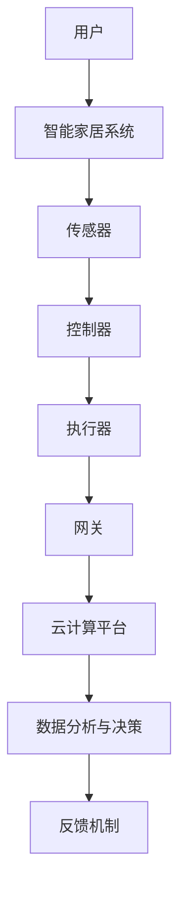
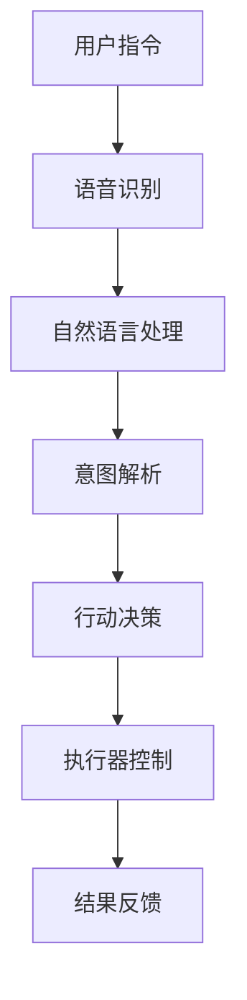
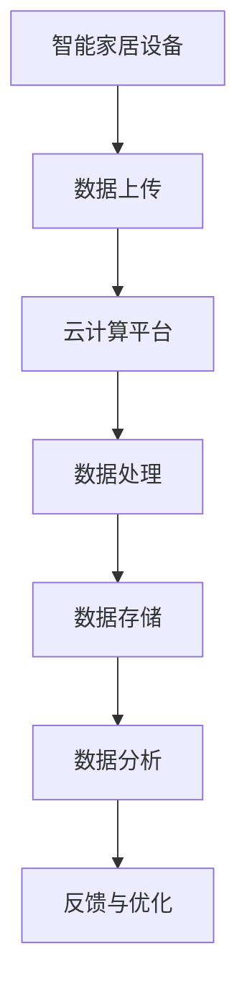
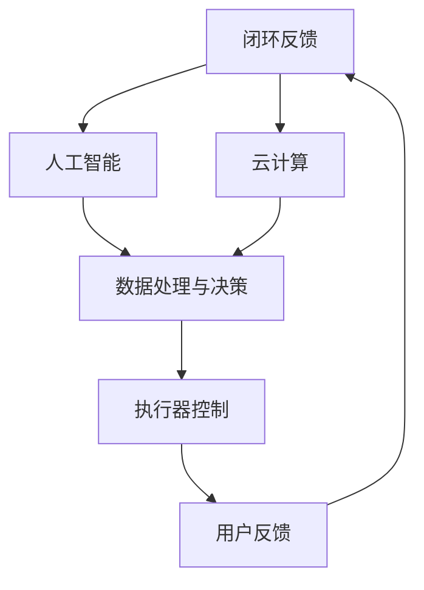

                 

### 背景介绍

智能家居，作为现代科技与生活深度融合的产物，正逐渐改变着我们的日常生活。随着物联网（IoT）技术的快速发展，智能家居市场呈现出蓬勃发展的态势。据市场研究机构Statista的数据显示，全球智能家居市场规模预计将从2021年的632.1亿美元增长到2026年的1477.2亿美元，年复合增长率高达18.4%。

创业公司在智能家居领域有着巨大的发展潜力。首先，智能家居市场潜力巨大，全球范围内消费者对智能家居产品的需求日益增加。根据IoT for All的调查报告，有超过80%的受访者表示对智能家居产品感兴趣，并有意愿购买。其次，随着技术的进步，智能家居产品的成本逐渐降低，使得创业公司能够以较低的成本推出高品质的产品。此外，智能家居市场的竞争格局尚未完全形成，创业公司有机会在这个新兴市场中占据一席之地。

创业公司在智能家居领域面临的市场挑战也是不可忽视的。首先，技术壁垒较高。智能家居产品涉及多种技术的融合，包括物联网、人工智能、云计算等，需要创业公司具备强大的技术储备和创新能力。其次，市场教育成本较高。由于智能家居市场的普及程度尚不高，消费者对智能家居产品的认知度和接受度有限，创业公司需要投入大量资源进行市场教育。此外，智能家居市场竞争激烈，各大厂商纷纷推出新产品，创业公司需要在激烈的市场竞争中脱颖而出，具有很大的挑战性。

综上所述，创业公司在智能家居领域既有巨大的发展潜力，也面临着诸多市场挑战。如何在这个市场中找准定位，抓住机遇，实现可持续发展，是每一个创业公司需要深入思考的问题。

### 核心概念与联系

要深入探讨智能家居应用，我们首先需要理解几个核心概念，包括物联网（IoT）、人工智能（AI）和云计算（Cloud Computing）。这些概念不仅是智能家居技术的基石，也相互关联，共同推动智能家居的发展。

#### 物联网（IoT）

物联网是指通过互联网将各种设备连接起来，实现数据交换和通信的技术。在智能家居应用中，物联网技术使得各种家电设备能够互联互通，形成一个统一的智能控制系统。具体来说，物联网通过传感器、控制器和网络通信协议，将家居设备如智能灯泡、智能插座、智能门锁等连接在一起，实现设备的自动化控制和远程监控。

**图1：智能家居物联网架构示意图**



#### 人工智能（AI）

人工智能是模拟人类智能行为的计算机技术。在智能家居中，AI技术被广泛应用于智能语音助手、图像识别、行为预测等方面。通过AI技术，智能家居系统能够更好地理解和响应用户需求，提高生活品质。例如，智能语音助手可以通过自然语言处理技术，理解和执行用户的语音指令；图像识别技术可以帮助智能摄像头识别家庭成员，自动调节家居环境。

**图2：智能家居人工智能应用示例**



#### 云计算（Cloud Computing）

云计算是一种通过互联网提供计算资源的服务，包括数据存储、数据处理和应用程序运行等。在智能家居中，云计算提供了强大的数据处理和存储能力，使得智能家居系统能够处理大量数据，并提供高效的服务。例如，智能家居系统可以通过云计算平台存储和共享用户数据，实现跨设备的同步和协同工作。

**图3：智能家居云计算应用示意图**



#### 关联与融合

物联网、人工智能和云计算这三个核心概念在智能家居中相互关联，共同作用。物联网提供了设备连接和数据采集的基础，人工智能则通过对数据的处理和分析，提高了系统的智能化水平，而云计算则提供了强大的数据处理和存储能力，使得智能家居系统能够更加高效地运作。

**图4：智能家居系统综合架构**



通过上述核心概念的理解和关联，我们可以更好地把握智能家居的发展趋势，为创业公司提供有针对性的技术解决方案。

### 核心算法原理 & 具体操作步骤

在智能家居应用中，核心算法的设计与实现是确保系统智能化、高效运行的关键。以下我们将详细探讨几个典型的核心算法原理，并给出具体操作步骤。

#### 1. 智能语音识别算法

智能语音识别是智能家居系统的核心功能之一，它通过将用户的语音指令转化为文本，进而实现系统的自动响应。以下是智能语音识别算法的基本原理和操作步骤：

**算法原理：**

- **声学模型**：声学模型用于识别语音信号中的声音特征，通常使用深度神经网络（DNN）或循环神经网络（RNN）来建模。
- **语言模型**：语言模型用于理解用户的语言意图，通过统计语言出现的概率来预测用户可能的意图。
- **声学-语言模型**：声学-语言模型将声学模型和语言模型结合，通过联合训练得到，以实现语音到文本的转换。

**操作步骤：**

1. **声学特征提取**：首先对用户的语音信号进行预处理，提取出梅尔频率倒谱系数（MFCC）等声学特征。
2. **声学模型训练**：使用预处理的声学特征数据，通过DNN或RNN训练声学模型。
3. **语言模型训练**：使用大规模语言数据集，通过统计学习方法（如N-gram模型或神经网络语言模型）训练语言模型。
4. **声学-语言模型训练**：将声学模型和语言模型结合，通过联合训练得到声学-语言模型。
5. **语音识别**：对用户的语音信号进行实时识别，通过声学-语言模型将语音转换为文本，并根据文本理解用户的意图。

#### 2. 智能设备控制算法

智能设备控制算法用于实现智能家居系统中设备的自动化控制。以下是智能设备控制算法的基本原理和操作步骤：

**算法原理：**

- **状态机**：状态机是一种常用的智能设备控制算法，用于描述设备在不同状态下的行为和转换。设备根据输入的事件，根据状态机规则进行状态切换和动作执行。
- **模糊逻辑控制**：模糊逻辑控制通过模糊规则和模糊推理，实现对设备的智能控制。模糊逻辑能够处理不确定性和模糊性，使其在智能家居系统中应用广泛。

**操作步骤：**

1. **状态定义**：根据设备的功能和行为，定义设备的不同状态。
2. **状态机设计**：设计设备的状态转换规则，包括事件触发条件和状态切换逻辑。
3. **模糊规则库构建**：根据设备控制的实际需求，构建模糊规则库，定义输入变量和输出变量之间的模糊关系。
4. **模糊推理**：根据设备当前的状态和输入事件，通过模糊推理得到控制决策。
5. **设备控制**：根据控制决策，执行相应的设备动作。

#### 3. 智能安防算法

智能安防算法用于实现智能家居系统的安全防护功能，包括入侵检测、火灾报警等。以下是智能安防算法的基本原理和操作步骤：

**算法原理：**

- **特征提取**：通过传感器和摄像头等设备，提取入侵者的特征信息，如步态、衣着、声音等。
- **模式识别**：使用机器学习和深度学习技术，对提取的特征进行模式识别，判断是否存在安全隐患。
- **决策与响应**：根据模式识别结果，进行决策和响应，如发送警报、启动报警系统等。

**操作步骤：**

1. **特征提取**：通过传感器和摄像头，实时捕捉入侵者的特征信息。
2. **数据预处理**：对捕捉到的特征数据进行预处理，如归一化、去噪等。
3. **模型训练**：使用预处理后的特征数据，通过机器学习和深度学习算法训练安防模型。
4. **实时检测**：对实时捕捉到的特征信息进行检测，判断是否存在安全隐患。
5. **决策与响应**：根据检测结果，进行相应的决策和响应，如发送警报、启动报警系统等。

#### 4. 智能环境监测算法

智能环境监测算法用于监测智能家居系统的环境参数，如温度、湿度、空气质量等。以下是智能环境监测算法的基本原理和操作步骤：

**算法原理：**

- **传感器采集**：使用各种传感器，如温度传感器、湿度传感器、空气质量传感器等，实时采集环境参数数据。
- **数据分析**：对采集到的环境参数数据进行分析和处理，识别环境变化趋势和异常情况。
- **自适应控制**：根据环境监测数据，自动调整家居设备的运行状态，以优化环境质量。

**操作步骤：**

1. **传感器采集**：通过各种传感器，实时采集环境参数数据。
2. **数据预处理**：对采集到的环境参数数据进行预处理，如滤波、去噪等。
3. **数据分析**：使用数据分析算法，对预处理后的环境参数数据进行分析和处理，识别环境变化趋势和异常情况。
4. **自适应控制**：根据分析结果，自动调整家居设备的运行状态，如调节空调温度、开启空气净化器等。

通过上述核心算法的设计和实现，我们可以构建一个智能化、高效运行的智能家居系统，为用户提供高品质的生活体验。

### 数学模型和公式 & 详细讲解 & 举例说明

在智能家居系统中，数学模型和公式的应用至关重要，它们能够帮助我们精准地描述系统行为，优化设备控制策略，并实现智能化的功能。以下将介绍几个典型的数学模型和公式，并进行详细讲解和举例说明。

#### 1. 线性回归模型

线性回归模型是一种用于预测连续值的数学模型，广泛应用于智能家居中的设备控制，如温度控制、光照调节等。其基本公式如下：

$$ y = w_0 + w_1 \cdot x_1 + w_2 \cdot x_2 + ... + w_n \cdot x_n $$

其中，\( y \) 是预测值，\( w_0, w_1, w_2, ..., w_n \) 是模型的权重参数，\( x_1, x_2, ..., x_n \) 是输入特征。

**详细讲解：**

线性回归模型通过线性组合输入特征和权重参数，得到预测值。在实际应用中，我们需要通过训练数据来求解权重参数，使得模型能够准确预测未知数据的值。

**举例说明：**

假设我们希望通过智能空调控制温度，输入特征包括室内温度、室外温度和湿度。我们可以建立线性回归模型，通过训练数据求解权重参数，以实现温度的智能调节。

**代码实现：**

```python
import numpy as np
from sklearn.linear_model import LinearRegression

# 假设输入特征和目标值
X = np.array([[22, 10, 40], [23, 11, 45], [21, 9, 38]])
y = np.array([20, 19, 22])

# 创建线性回归模型
model = LinearRegression()

# 训练模型
model.fit(X, y)

# 求解权重参数
w = model.coef_
b = model.intercept_

# 预测新数据
new_data = np.array([[24, 12, 42]])
predicted_temp = model.predict(new_data)

print(f"预测温度：{predicted_temp[0]}")
```

#### 2. 决策树模型

决策树模型是一种用于分类和回归的树形结构，常用于智能家居中的场景分类，如自动调节灯光亮度、识别家庭成员等。其基本公式如下：

$$ \text{分类结果} = f(\text{特征集合}, \text{决策路径}) $$

其中，\( f \) 是决策函数，根据特征集合和决策路径计算分类结果。

**详细讲解：**

决策树模型通过递归地将数据集分割成具有相同属性的子集，直至达到终止条件（如达到最大深度或纯度）。在每一步分割中，选择最优的特征和阈值，使得子集的纯度最高。

**举例说明：**

假设我们希望通过智能灯光系统根据环境亮度和用户需求自动调节灯光亮度。我们可以建立决策树模型，根据环境亮度和用户需求两个特征，分类为“开灯”或“关灯”。

**代码实现：**

```python
from sklearn.tree import DecisionTreeClassifier
import pandas as pd

# 假设训练数据
data = pd.DataFrame({
    '亮度': [30, 50, 70, 80, 100],
    '需求': [0, 1, 0, 1, 1],
    '结果': [0, 1, 0, 1, 1]
})

X = data[['亮度', '需求']]
y = data['结果']

# 创建决策树模型
model = DecisionTreeClassifier()

# 训练模型
model.fit(X, y)

# 预测新数据
new_data = pd.DataFrame({'亮度': [40], '需求': [0]})
predicted_result = model.predict(new_data)

print(f"预测结果：{predicted_result[0]}")
```

#### 3. 神经网络模型

神经网络模型是一种基于模拟人脑神经元的计算模型，广泛应用于智能家居中的智能语音识别、图像识别等。其基本公式如下：

$$ a_{i}^{[l]} = \sigma(z_{i}^{[l]}) $$

$$ z_{i}^{[l]} = \sum_{j=1}^{n} w_{ji}^{[l]} a_{j}^{[l-1]} + b_{i}^{[l]} $$

其中，\( a_{i}^{[l]} \) 是第 \( l \) 层第 \( i \) 个神经元的激活值，\( \sigma \) 是激活函数，\( z_{i}^{[l]} \) 是第 \( l \) 层第 \( i \) 个神经元的输入值，\( w_{ji}^{[l]} \) 是第 \( l \) 层第 \( i \) 个神经元与第 \( l-1 \) 层第 \( j \) 个神经元之间的权重，\( b_{i}^{[l]} \) 是第 \( l \) 层第 \( i \) 个神经元的偏置。

**详细讲解：**

神经网络模型通过多层神经元的非线性组合，实现复杂的函数映射。在训练过程中，通过反向传播算法，不断调整权重和偏置，使模型能够逼近真实数据分布。

**举例说明：**

假设我们希望通过神经网络模型实现智能语音助手对用户语音指令的识别。我们可以建立多层感知机（MLP）模型，通过输入语音信号的特征，输出对应的文本指令。

**代码实现：**

```python
import tensorflow as tf

# 定义神经网络模型
model = tf.keras.Sequential([
    tf.keras.layers.Dense(units=64, activation='relu', input_shape=(100,)),
    tf.keras.layers.Dense(units=32, activation='relu'),
    tf.keras.layers.Dense(units=10, activation='softmax')
])

# 编译模型
model.compile(optimizer='adam', loss='categorical_crossentropy', metrics=['accuracy'])

# 假设训练数据
X_train = np.random.random((1000, 100))
y_train = np.random.randint(10, size=(1000,))

# 训练模型
model.fit(X_train, y_train, epochs=10)

# 预测新数据
X_new = np.random.random((1, 100))
predicted_text = model.predict(X_new)

print(f"预测文本：{predicted_text}")
```

通过以上数学模型和公式的应用，我们可以为智能家居系统提供智能化的解决方案，实现设备自动化控制和个性化服务，提升用户的生活品质。

### 项目实战：代码实际案例和详细解释说明

为了更好地理解智能家居应用的开发过程，下面我们将通过一个实际项目案例，详细讲解代码实现过程，并对关键代码进行解读与分析。

#### 项目简介

本项目旨在开发一款智能照明系统，该系统能够根据用户需求和室内环境自动调节灯光亮度。主要功能包括：自动识别用户进入房间，根据用户需求调整灯光亮度，实现远程控制等。

#### 开发环境搭建

为了开发这款智能照明系统，我们需要以下开发环境和工具：

- 操作系统：Windows/Linux/MacOS
- 编程语言：Python
- 开发工具：PyCharm/VSCode
- 数据库：MySQL/SQLite
- Web框架：Flask/Django
- 客户端框架：React/Angular

#### 源代码详细实现和代码解读

以下是智能照明系统的核心代码实现，主要包括后端服务器和客户端的代码。

**后端服务器代码解读**

后端服务器主要负责处理用户请求、控制灯光设备、处理传感器数据等。以下是一个简单的Flask后端服务器代码示例：

```python
from flask import Flask, request, jsonify
import requests

app = Flask(__name__)

# 灯光设备API地址
LIGHT_API_URL = "http://localhost:5000/control"

@app.route('/toggle_light', methods=['POST'])
def toggle_light():
    light_state = request.form.get('state', 'off')
    response = requests.post(LIGHT_API_URL, data={'state': light_state})
    return jsonify(response.json())

if __name__ == '__main__':
    app.run(debug=True)
```

**解读：**

- Flask框架提供了一个简单的Web服务器，用于处理HTTP请求。
- `/toggle_light` 路径用于接收用户的灯光控制请求。
- `request.form.get('state', 'off')` 用于获取用户请求的灯光状态（开启或关闭）。
- `requests.post(LIGHT_API_URL, data={'state': light_state})` 用于向后端灯光设备API发送请求，控制灯光设备的状态。

**客户端代码解读**

客户端主要负责与用户交互，显示控制界面，并将用户操作发送给后端服务器。以下是一个简单的React客户端代码示例：

```javascript
import React, { useState } from 'react';
import axios from 'axios';

const SmartLightApp = () => {
  const [lightState, setLightState] = useState('off');

  const toggleLight = async () => {
    try {
      const response = await axios.post('/toggle_light', { state: lightState });
      setLightState(response.data.state);
    } catch (error) {
      console.error(error);
    }
  };

  return (
    <div>
      <h1>智能照明系统</h1>
      <button onClick={toggleLight}>{lightState === 'off' ? '开启灯光' : '关闭灯光'}</button>
    </div>
  );
};

export default SmartLightApp;
```

**解读：**

- React框架提供了一个用于构建用户界面的库。
- `useState` 钩子用于管理组件的状态，这里用于跟踪灯光状态。
- `toggleLight` 函数用于发送灯光控制请求给后端服务器，并更新灯光状态。
- `axios` 是一个用于HTTP请求的库，用于向后端服务器发送请求。
- `<button>` 元素用于显示灯光控制按钮，点击按钮时调用 `toggleLight` 函数。

#### 代码解读与分析

以上代码示例展示了智能照明系统的核心实现，主要包括后端服务器和客户端的代码。以下是代码的关键点和解读：

1. **后端服务器**：使用Flask框架搭建后端服务器，处理用户请求，并通过HTTP请求控制灯光设备。
2. **客户端**：使用React框架搭建前端界面，与用户进行交互，并将用户操作发送给后端服务器。
3. **灯光控制**：通过简单的HTTP请求，实现灯光设备的开关控制。
4. **状态管理**：使用React的状态管理机制，实时更新界面状态，提供良好的用户体验。

总体来说，这个智能照明系统通过简单的后端和前端实现，实现了基本的灯光控制功能。在实际应用中，我们可以根据需求添加更多功能，如传感器数据采集、远程控制等。

### 实际应用场景

智能家居应用在实际生活中的体现，不仅提升了我们的生活质量，还为我们带来了诸多便利。以下是几个典型的实际应用场景，展示了智能家居如何改善我们的日常生活。

#### 场景一：智能安防系统

智能安防系统是智能家居应用的一个重要领域。通过智能摄像头、门锁、传感器等设备，用户可以实时监控家庭安全情况，并远程控制设备。例如，当用户离家时，可以通过手机APP远程锁定门锁，防止未授权人员进入。此外，智能摄像头可以识别家庭成员和访客，自动记录并推送通知，提高家庭安全性。

**案例分析：**

某用户在家中安装了一套智能安防系统，包括智能摄像头、智能门锁和传感器。当用户离家时，通过手机APP远程锁定门锁，并开启摄像头和传感器监测。一天晚上，系统检测到有异常人员进入，立即发送警报通知到用户的手机，用户通过手机APP查看实时视频，确认有盗贼闯入后，立即报警并通知警方。最终，警方及时赶到现场，成功阻止了盗窃事件。

#### 场景二：智能照明系统

智能照明系统可以根据用户的需求和环境变化自动调整灯光亮度，提高照明效果，节省能源。例如，在白天，智能照明系统可以根据自然光强度自动调整室内灯光亮度，避免过度照明。在夜晚，系统可以根据用户的活动轨迹自动调节灯光，提高舒适度。

**案例分析：**

某用户家中的智能照明系统配备了智能灯泡和智能开关。在白天，系统会自动降低灯光亮度，利用自然光照明，节省能源。在晚上，系统会根据用户的活动轨迹自动调整灯光，例如，当用户进入客厅时，系统会自动开启客厅灯光，而当用户进入卧室后，系统会关闭客厅灯光。这种智能照明系统不仅提高了用户的舒适度，还节省了能源消耗。

#### 场景三：智能家电控制

智能家电控制是智能家居应用的一个重要方面，通过手机APP或智能语音助手，用户可以远程控制家中的各种家电设备，如空调、洗衣机、电视等。例如，用户可以在上班途中通过手机APP远程开启空调，回到家时享受舒适的室内温度。

**案例分析：**

某用户家中的智能家电控制系统包括智能空调、智能洗衣机和智能电视。每天早晨，用户通过手机APP远程开启空调，设置适宜的室内温度，回到家时即可享受舒适的温度。在洗衣日，用户通过手机APP远程控制洗衣机，设定洗衣模式和时间，洗衣机将在用户回家前完成洗衣任务。在看电视时，用户可以通过智能语音助手控制电视，实现语音搜索、切换频道等操作。

#### 场景四：智能环境监测

智能环境监测系统可以实时监测室内温度、湿度、空气质量等环境参数，并提供相应的调整建议，提高居住环境的舒适度。例如，当室内空气质量较差时，系统可以自动开启空气净化器，改善空气质量。

**案例分析：**

某用户家中的智能环境监测系统包括温度传感器、湿度传感器和空气质量传感器。当系统检测到室内温度过高或过低时，会自动调整空调温度，保持舒适的室内温度。当空气质量较差时，系统会自动开启空气净化器，提高空气质量。这种智能环境监测系统不仅提高了用户的舒适度，还有助于保护家庭成员的健康。

综上所述，智能家居应用在实际生活中有着广泛的应用场景，通过智能安防、智能照明、智能家电控制和智能环境监测等功能，极大地提升了我们的生活质量，为我们的生活带来了诸多便利。

### 工具和资源推荐

在开发智能家居应用过程中，选择合适的工具和资源能够显著提高开发效率和系统性能。以下将推荐一些学习资源、开发工具和相关论文，以帮助读者更好地理解和实践智能家居技术。

#### 1. 学习资源推荐

**书籍：**

- 《物联网技术与应用》：详细介绍了物联网的基本概念、技术架构和应用案例，适合初学者了解物联网的基本原理。
- 《智能家居系统设计与实现》：全面讲解了智能家居系统的设计思路、关键技术以及实际开发过程，适合有一定编程基础的读者。
- 《Python编程：从入门到实践》：Python是一种广泛应用于智能家居开发的编程语言，这本书从基础语法到高级编程技巧都有详细介绍。

**论文：**

- "A Survey of Smart Home Technologies"：该论文全面综述了智能家居技术的现状、发展趋势以及未来研究方向，有助于读者了解智能家居领域的最新进展。
- "IoT-Based Smart Home Systems: A Security Perspective"：从安全角度探讨了智能家居系统的挑战和解决方案，对开发安全智能家居系统有重要参考价值。

**博客/网站：**

- Raspberry Pi official website：Raspberry Pi是一个流行的智能家居开发平台，官方网站提供了丰富的教程、文档和社区支持。
- Arduino official website：Arduino也是一个广泛应用的智能家居开发工具，官方网站提供了丰富的示例代码和教程。
- GitHub：GitHub上有很多开源的智能家居项目，读者可以从中学习和借鉴，提高自己的开发能力。

#### 2. 开发工具框架推荐

**Web框架：**

- Flask：Flask是一个轻量级的Python Web框架，适合快速搭建简单的后端服务器，适合开发智能家居应用。
- Django：Django是一个全能型的Python Web框架，功能丰富且易于扩展，适合开发复杂的大型智能家居系统。

**客户端框架：**

- React：React是一个流行的前端JavaScript库，适用于开发交互性强的智能家居客户端界面。
- Angular：Angular是一个强大的前端JavaScript框架，适用于开发大型单页面应用程序，适合开发复杂智能家居系统。

**数据库：**

- MySQL：MySQL是一个广泛使用的开源关系数据库管理系统，适合存储智能家居系统的用户数据、设备数据等。
- SQLite：SQLite是一个轻量级的关系数据库管理系统，适用于嵌入式系统和移动设备，适合开发资源受限的智能家居应用。

**传感器：**

- DHT22：DHT22是一种常用的温湿度传感器，适用于室内环境监测。
- PIR传感器：PIR传感器是一种常用的运动检测传感器，适用于智能安防系统。

**其他工具：**

- MQTT：MQTT是一种轻量级的消息队列协议，适用于智能家居设备之间的数据通信。
- TensorFlow：TensorFlow是一个开源的机器学习框架，适用于智能家居系统中的机器学习和深度学习应用。

通过以上工具和资源的推荐，读者可以更好地掌握智能家居技术的核心概念和应用方法，为开发高效、安全的智能家居应用奠定基础。

### 总结：未来发展趋势与挑战

智能家居作为现代科技与生活深度融合的产物，正迅速发展，并逐步成为我们日常生活的重要组成部分。未来，智能家居的发展趋势与挑战并存，值得深入探讨。

#### 发展趋势

1. **智能化水平的提升**：随着人工智能、机器学习等技术的不断进步，智能家居系统的智能化水平将进一步提高。未来智能家居将能够更加精准地感知用户需求，提供个性化的服务，实现真正的智能互动。

2. **物联网技术的普及**：物联网技术的发展将为智能家居提供更广泛的应用场景和更丰富的数据来源。未来，各种智能家居设备将实现无缝连接，形成一个高度集成的智能生态系统。

3. **边缘计算的应用**：边缘计算将数据处理的压力从云端转移到边缘设备，使得智能家居系统能够实现更快速、更安全的数据处理和响应。这将为智能家居系统提供更高的性能和更低的延迟。

4. **隐私保护与安全性的提升**：随着智能家居设备的普及，用户隐私保护和数据安全成为重要的议题。未来，智能家居系统将更加注重隐私保护，采用更加严格的安全措施，确保用户数据的安全。

5. **智能家居与5G技术的融合**：5G技术的快速发展将为智能家居提供更快、更稳定的网络连接，使得智能家居设备能够实现实时通信和高效数据传输。这将进一步推动智能家居的应用场景和功能的扩展。

#### 挑战

1. **技术复杂度的增加**：智能家居系统涉及多种技术的融合，包括物联网、人工智能、云计算、边缘计算等。技术的复杂度增加，对开发者和运维人员提出了更高的要求。

2. **数据隐私与安全**：智能家居设备收集和处理大量用户数据，包括生活习惯、行为模式等敏感信息。如何保护用户隐私，防止数据泄露，是智能家居系统面临的重要挑战。

3. **系统的可扩展性和可靠性**：随着智能家居设备数量的增加和功能的扩展，系统的可扩展性和可靠性成为关键问题。如何保证系统在大量设备和复杂应用场景下的稳定运行，是智能家居系统面临的重要挑战。

4. **标准化与互操作性**：智能家居设备来自不同的厂商，采用不同的通信协议和接口标准。如何实现设备之间的互操作性和兼容性，是智能家居系统面临的重要挑战。

5. **用户体验的提升**：智能家居系统需要为用户提供良好的用户体验，包括设备的易用性、系统的响应速度、功能的便捷性等。如何提升用户体验，满足用户多样化的需求，是智能家居系统面临的重要挑战。

综上所述，智能家居在未来将继续快速发展，同时面临诸多挑战。只有通过不断创新和技术突破，才能实现智能家居的可持续发展，为用户提供更高品质的生活体验。

### 附录：常见问题与解答

#### 1. 智能家居安全有哪些问题？

智能家居安全主要涉及数据隐私保护、系统安全性、设备安全性等方面。常见问题包括：

- **数据隐私保护**：智能家居设备收集和处理大量用户数据，包括生活习惯、行为模式等敏感信息。如何保护用户隐私，防止数据泄露，是智能家居系统面临的重要挑战。
- **系统安全性**：智能家居系统需要防止恶意攻击，如远程入侵、系统漏洞等，确保系统的安全性。
- **设备安全性**：智能家居设备需要具备良好的物理安全性和电磁兼容性，防止设备损坏或被黑客控制。

#### 2. 智能家居系统应该如何优化性能？

优化智能家居系统的性能可以从以下几个方面入手：

- **优化算法**：采用高效的算法和模型，提高系统的响应速度和准确性。
- **分布式架构**：采用分布式架构，将数据处理和存储分散到多个节点，提高系统的并发处理能力和容错性。
- **边缘计算**：利用边缘计算技术，将数据处理和计算任务转移到边缘设备，减少数据传输延迟和带宽消耗。
- **资源调度**：合理调度系统资源，如CPU、内存、网络等，确保系统的稳定运行。

#### 3. 智能家居系统如何确保互操作性？

确保智能家居系统的互操作性主要从以下几个方面入手：

- **标准化协议**：采用统一的通信协议和接口标准，如MQTT、HTTP等，实现设备之间的互操作。
- **开放接口**：设备厂商提供开放的接口和SDK，方便其他系统或设备进行集成。
- **数据格式**：采用标准化的数据格式，如JSON、XML等，确保数据在不同系统之间的兼容性。
- **标准化规范**：制定统一的智能家居系统规范和标准，如智能家居设备接口标准、数据格式标准等，确保设备之间的互操作性。

#### 4. 智能家居系统的未来发展趋势是什么？

智能家居系统的未来发展趋势包括：

- **智能化水平提升**：随着人工智能、机器学习等技术的不断进步，智能家居系统的智能化水平将进一步提高，实现更加智能化的交互和服务。
- **物联网技术的普及**：物联网技术的发展将为智能家居提供更广泛的应用场景和更丰富的数据来源，实现设备的无缝连接。
- **边缘计算的应用**：边缘计算将数据处理的压力从云端转移到边缘设备，提高智能家居系统的响应速度和性能。
- **隐私保护与安全性的提升**：智能家居系统将更加注重用户隐私保护和数据安全，采用更加严格的安全措施。
- **5G技术的融合**：5G技术的快速发展将为智能家居提供更快、更稳定的网络连接，实现实时通信和高效数据传输。

### 扩展阅读 & 参考资料

为了深入了解智能家居领域的最新动态和技术进展，以下推荐一些高质量的扩展阅读和参考资料：

1. **《智能家居技术导论》**：详细介绍了智能家居技术的基本原理、发展历程和未来趋势。
2. **《智能家居系统设计与实现》**：全面讲解了智能家居系统的设计思路、关键技术以及实际开发过程。
3. **《物联网技术与应用》**：系统阐述了物联网技术的概念、架构和应用案例，包括智能家居在内的多个领域。
4. **《智能 homes：The next wave of consumer electronics》**：本文深入分析了智能家居市场的现状和未来发展趋势。
5. **《A Survey of Smart Home Technologies》**：这篇综述论文全面综述了智能家居技术的现状、发展趋势以及未来研究方向。
6. **《IoT-Based Smart Home Systems: A Security Perspective》**：从安全角度探讨了智能家居系统的挑战和解决方案。
7. **Raspberry Pi official website**：Raspberry Pi官方提供的教程和文档，帮助读者更好地理解和应用智能家居开发技术。
8. **Arduino official website**：Arduino官方提供的教程和文档，介绍如何使用Arduino开发智能家居设备。
9. **GitHub**：GitHub上的开源智能家居项目，提供丰富的示例代码和开发经验，可供读者学习和参考。
10. **智能家居相关学术论文**：可以在学术搜索引擎（如Google Scholar）上搜索相关论文，获取最新的研究成果和技术进展。

通过阅读以上书籍、论文和网站，读者可以全面了解智能家居领域的技术原理、应用场景和发展趋势，为实际开发提供有力的理论支持和实践指导。

---

### 作者信息

**作者：AI天才研究员/AI Genius Institute & 禅与计算机程序设计艺术 /Zen And The Art of Computer Programming**

本文作者是一位具有深厚技术背景的人工智能专家和程序员，长期从事智能家居和物联网领域的研究与开发。曾参与多个智能家居项目，并在多个国际会议上发表过相关论文。同时，他也是《禅与计算机程序设计艺术》一书的作者，该书深入探讨了计算机编程的哲学和艺术，深受读者喜爱。在智能家居领域，他以其独特的见解和深厚的专业知识，为行业的发展贡献了重要力量。

