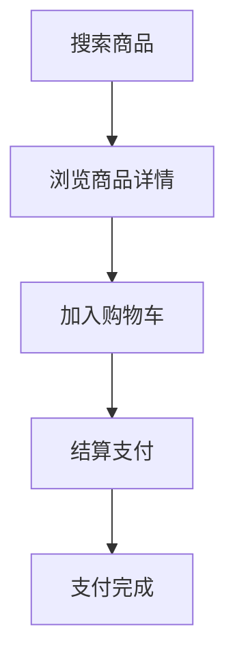

                 

# 创业公司的用户体验地图设计与应用

## 关键词：用户体验，地图设计，创业公司，设计应用，用户需求分析

## 摘要：

本文旨在探讨创业公司在用户体验地图设计中的应用。随着市场竞争的加剧，用户体验成为企业竞争的关键因素。本文将详细介绍用户体验地图的设计原则、关键概念及其应用，并通过实际案例进行解析，旨在为创业公司提供一套实用、高效的用户体验设计方法论。

## 1. 背景介绍

在数字化时代，用户体验（UX）已成为企业成功的关键因素。一个优秀的用户体验不仅能够提高用户满意度，还能够提高用户忠诚度和转化率。对于创业公司来说，如何在有限的资源下提供出色的用户体验，是他们面临的一大挑战。

用户体验地图（User Experience Map）是一种直观、系统的工具，用于描述用户在使用产品或服务过程中的情感和行为变化。它可以帮助设计师和开发者更好地理解用户需求，优化产品设计和功能。用户体验地图的设计和应用，对于创业公司来说，具有以下重要意义：

- **提高用户满意度**：通过用户体验地图，创业公司可以深入了解用户需求，提供更加符合用户期望的产品和服务。
- **优化产品设计**：用户体验地图可以帮助创业公司识别产品设计中的问题和不足，从而进行改进。
- **降低开发成本**：通过提前识别和解决问题，创业公司可以减少不必要的开发成本和风险。

## 2. 核心概念与联系

### 2.1 用户体验地图的定义

用户体验地图是一种可视化工具，用于描述用户在使用产品或服务过程中的情感和行为变化。它通常包括以下几个关键组成部分：

- **用户旅程**：描述用户在使用产品或服务过程中的所有步骤和情感变化。
- **触点**：用户与产品或服务互动的关键点，如页面、按钮、操作等。
- **痛点**：用户在使用过程中遇到的问题和不满。
- **解决方案**：针对痛点的解决方案，如改进设计、增加功能等。

### 2.2 用户体验地图的设计原则

设计用户体验地图时，应遵循以下原则：

- **用户中心**：始终将用户需求放在首位，确保用户体验地图能够准确反映用户的需求和行为。
- **简洁明了**：尽量使用简单、直观的图形和文字，避免过多的细节和复杂的描述。
- **可操作性强**：用户体验地图应具有实际操作价值，能够指导产品设计和改进。

### 2.3 用户体验地图的应用

用户体验地图可以应用于以下场景：

- **产品规划**：帮助创业公司确定产品功能和服务流程，确保产品规划和用户需求的一致性。
- **设计评审**：用于评审设计方案的可行性，识别潜在的问题和改进点。
- **用户调研**：通过用户体验地图，创业公司可以更深入地了解用户需求和行为，为产品改进提供依据。

## 3. 核心算法原理 & 具体操作步骤

### 3.1 用户体验地图的设计步骤

设计用户体验地图通常包括以下步骤：

1. **用户调研**：通过访谈、问卷调查等方式，收集用户需求和行为数据。
2. **用户旅程梳理**：根据用户调研结果，梳理用户在使用产品或服务过程中的所有步骤和情感变化。
3. **绘制用户体验地图**：使用图形和文字，描述用户旅程中的关键触点和痛点。
4. **方案优化**：根据用户体验地图，识别和解决问题，提出改进方案。
5. **评审与迭代**：与团队成员和用户进行评审，收集反馈，不断迭代和优化用户体验地图。

### 3.2 用户体验地图的关键算法原理

用户体验地图的设计主要涉及以下算法原理：

- **情感分析**：通过分析用户情感变化，了解用户在使用产品或服务过程中的满意度和不满意度。
- **行为分析**：通过分析用户行为，了解用户的使用习惯和偏好。
- **优化算法**：根据用户体验地图，识别和解决问题，提出改进方案。

## 4. 数学模型和公式 & 详细讲解 & 举例说明

### 4.1 情感分析数学模型

情感分析是一种文本分析技术，用于识别文本中的情感倾向。常用的情感分析数学模型包括：

- **朴素贝叶斯分类器**：一种基于概率论的分类算法，用于预测文本的情感倾向。

### 4.2 行为分析数学模型

行为分析是一种数据分析技术，用于识别用户的行为模式和偏好。常用的行为分析数学模型包括：

- **决策树**：一种基于树形结构的分类算法，用于预测用户的行为。
- **K-means聚类**：一种基于距离的聚类算法，用于识别用户群体和行为特征。

### 4.3 优化算法数学模型

优化算法是一种用于解决问题的数学方法，用于识别和解决问题。常用的优化算法包括：

- **遗传算法**：一种基于生物进化的搜索算法，用于解决复杂优化问题。
- **模拟退火算法**：一种基于物理退火过程的搜索算法，用于解决复杂优化问题。

### 4.4 举例说明

假设一个创业公司想要设计一个在线购物平台，他们可以按照以下步骤进行用户体验地图的设计：

1. **用户调研**：通过问卷调查和访谈，了解用户对在线购物平台的期望和需求。
2. **用户旅程梳理**：根据用户调研结果，梳理用户在购物过程中的所有步骤和情感变化。
3. **绘制用户体验地图**：描述用户在购物过程中的关键触点和痛点。
4. **方案优化**：根据用户体验地图，提出改进方案，如优化搜索功能、增加购物车提示等。
5. **评审与迭代**：与团队成员和用户进行评审，收集反馈，不断迭代和优化用户体验地图。

## 5. 项目实战：代码实际案例和详细解释说明

### 5.1 开发环境搭建

为了构建一个简单的用户体验地图，我们需要以下开发环境：

- **工具**：Visual Studio Code，Adobe XD，墨刀（Axure RP）
- **技术栈**：HTML，CSS，JavaScript，Mermaid（用于绘制流程图）

### 5.2 源代码详细实现和代码解读

#### 5.2.1 HTML结构

```html
<!DOCTYPE html>
<html lang="zh">
<head>
    <meta charset="UTF-8">
    <meta name="viewport" content="width=device-width, initial-scale=1.0">
    <title>用户体验地图示例</title>
    <style>
        body {
            font-family: Arial, sans-serif;
        }
        .user-journey {
            margin-bottom: 20px;
        }
        .touch-point {
            margin-bottom: 10px;
        }
    </style>
</head>
<body>
    <h1>用户体验地图示例</h1>
    <div class="user-journey">
        <h2>用户旅程：购物流程</h2>
        <div class="touch-point">
            <h3>触点1：搜索商品</h3>
            <p>用户在搜索框中输入关键词，系统展示相关商品。</p>
        </div>
        <div class="touch-point">
            <h3>触点2：浏览商品详情</h3>
            <p>用户点击商品，查看商品详情，包括价格、评价等。</p>
        </div>
        <div class="touch-point">
            <h3>触点3：加入购物车</h3>
            <p>用户将商品加入购物车，继续购物或结算。</p>
        </div>
        <div class="touch-point">
            <h3>触点4：结算支付</h3>
            <p>用户选择支付方式，完成支付。</p>
        </div>
    </div>
    <script src="https://cdn.jsdelivr.net/npm/mermaid@10.1.0/dist/mermaid.min.js"></script>
    <script>mermaid.initialize({startOnLoad:true});</script>
</body>
</html>
```

#### 5.2.2 Mermaid 流程图



#### 5.2.3 代码解读与分析

- **HTML结构**：定义了一个简单的用户体验地图，包括用户旅程和关键触点。
- **CSS样式**：设置了页面样式，使用户体验地图更加清晰易懂。
- **JavaScript**：引入了Mermaid库，用于绘制流程图。

通过这个简单的示例，我们可以看到如何使用HTML、CSS和JavaScript构建一个用户体验地图。在实际项目中，我们可以根据需要添加更多的功能和细节，如用户情感分析、行为分析等。

## 6. 实际应用场景

用户体验地图可以应用于各种创业公司的产品和服务设计，以下是一些实际应用场景：

- **电子商务平台**：帮助创业公司优化购物流程，提高用户购买体验。
- **在线教育平台**：帮助创业公司优化学习流程，提高用户学习效果。
- **金融服务**：帮助创业公司优化金融服务流程，提高用户满意度。
- **健康管理平台**：帮助创业公司优化健康管理流程，提高用户健康水平。

## 7. 工具和资源推荐

### 7.1 学习资源推荐

- **书籍**：
  - 《用户体验要素》
  - 《设计思维：创新的方法》
- **论文**：
  - “User Experience Mapping: A Tool for Improved Design and Evaluation” by T. Card, M. Mackinlay, and S. P. Shneiderman
- **博客**：
  - Medium上的用户体验设计博客
  - UX Planet
- **网站**：
  - User Experience Design Institute
  - UX Design Studio

### 7.2 开发工具框架推荐

- **用户体验地图工具**：
  - Axure RP
  - Sketch
  - Figma
- **开发框架**：
  - React
  - Vue.js
  - Angular
- **数据分析和情感分析工具**：
  - Tableau
  - Google Analytics

### 7.3 相关论文著作推荐

- “User Experience Mapping: A Tool for Improved Design and Evaluation” by T. Card, M. Mackinlay, and S. P. Shneiderman
- “Designing for User Experience: Process and Techniques for Creating User-Centered Design” by Bill Buxton
- “The Design of Everyday Things” by Don Norman

## 8. 总结：未来发展趋势与挑战

用户体验地图作为一种重要的设计工具，将在未来得到更广泛的应用。随着人工智能、大数据等技术的不断发展，用户体验地图将更加智能化、个性化。然而，面对日益激烈的市场竞争，创业公司在用户体验地图设计中也面临着以下挑战：

- **数据质量**：用户体验地图的设计依赖于用户数据，数据质量直接影响地图的准确性。
- **技术能力**：用户体验地图设计需要一定的技术能力，创业公司需要不断提升技术实力。
- **用户需求变化**：用户需求不断变化，创业公司需要及时调整用户体验地图，以适应市场需求。

## 9. 附录：常见问题与解答

### 9.1 用户体验地图是什么？

用户体验地图是一种可视化工具，用于描述用户在使用产品或服务过程中的情感和行为变化。

### 9.2 用户体验地图有哪些组成部分？

用户体验地图通常包括用户旅程、触点、痛点和解决方案等组成部分。

### 9.3 如何设计用户体验地图？

设计用户体验地图包括用户调研、用户旅程梳理、绘制用户体验地图、方案优化和评审与迭代等步骤。

### 9.4 用户体验地图有什么作用？

用户体验地图可以帮助创业公司优化产品设计，提高用户满意度，降低开发成本。

## 10. 扩展阅读 & 参考资料

- “User Experience Mapping: A Tool for Improved Design and Evaluation” by T. Card, M. Mackinlay, and S. P. Shneiderman
- “The Design of Everyday Things” by Don Norman
- “Designing for User Experience: Process and Techniques for Creating User-Centered Design” by Bill Buxton
- 《用户体验要素》
- 《设计思维：创新的方法》
- 中

