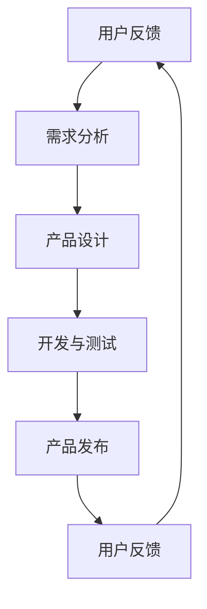

                 

# 创业公司的用户反馈loop与快速迭代

> **关键词**：用户反馈、快速迭代、创业公司、敏捷开发、持续集成、数据驱动
> 
> **摘要**：本文将探讨创业公司如何通过建立有效的用户反馈loop来实现产品快速迭代，以提高市场竞争力和用户体验。通过分析敏捷开发方法、持续集成和数据驱动的优势，结合实际案例，为创业公司提供实用的策略和工具。

## 1. 背景介绍

在当今快速变化的市场环境中，创业公司面临着前所未有的竞争压力。为了在激烈的市场竞争中脱颖而出，创业公司必须具备快速响应市场变化的能力，不断优化和改进产品。用户反馈loop作为一种重要的产品开发方法，可以帮助创业公司实现这一目标。

用户反馈loop是指通过收集用户反馈、分析用户需求、快速迭代产品，形成的一种循环迭代的过程。这种循环迭代不仅能够帮助创业公司快速发现并解决产品中的问题，还能够不断满足用户的需求，提高用户满意度。

### 1.1 用户反馈loop的重要性

用户反馈loop对于创业公司的重要性体现在以下几个方面：

- **发现并解决问题**：通过用户反馈，创业公司可以及时发现产品中的问题，并进行修复。这有助于提高产品的稳定性和用户体验。
- **满足用户需求**：用户反馈loop使得创业公司能够更好地了解用户需求，从而设计出更符合用户期望的产品特性。
- **提高市场竞争力**：快速迭代的产品能够更快地满足市场需求，抢占市场先机，提高创业公司的市场竞争力。
- **降低开发风险**：通过不断迭代和测试，创业公司可以降低产品开发的风险，确保最终产品的质量。

### 1.2 快速迭代的优势

快速迭代是创业公司成功的关键因素之一。快速迭代的优势包括：

- **缩短产品上市时间**：通过快速迭代，创业公司可以更快地将产品推向市场，抢占市场份额。
- **降低开发成本**：快速迭代可以减少开发过程中的返工和修复成本，提高开发效率。
- **提高用户满意度**：快速迭代的产品能够更快地满足用户需求，提高用户满意度。

## 2. 核心概念与联系

### 2.1 敏捷开发方法

敏捷开发是一种以人为核心、迭代、增量和协作的开发方法。敏捷开发的核心原则包括：

- **个体和互动胜过过程和工具**：强调团队协作和个人能力。
- **可工作的软件胜过详尽的文档**：注重实际可用的软件，而非冗长的文档。
- **客户合作胜过合同谈判**：与客户保持紧密合作，确保产品满足客户需求。
- **响应变化胜过遵循计划**：灵活应对变化，以适应市场需求。

敏捷开发方法有助于创业公司实现快速迭代，提高产品质量。

### 2.2 持续集成

持续集成（Continuous Integration，CI）是一种软件开发实践，通过将代码不断集成到共享仓库中，并立即进行自动化测试，以快速发现并解决集成过程中出现的问题。

持续集成的优势包括：

- **快速发现问题**：通过自动化测试，及早发现集成过程中的问题，降低修复成本。
- **提高代码质量**：持续集成有助于保持代码库的整洁和一致性，提高代码质量。
- **缩短发布周期**：自动化测试和集成可以减少人工干预，缩短发布周期。

### 2.3 数据驱动

数据驱动是指基于数据进行分析和决策，从而优化产品设计和开发过程。数据驱动的优势包括：

- **准确了解用户需求**：通过分析用户行为数据，创业公司可以更准确地了解用户需求，提高产品设计质量。
- **优化产品性能**：基于数据驱动的分析，可以帮助创业公司不断优化产品性能，提高用户体验。
- **降低开发风险**：数据驱动的方法有助于识别潜在的问题和风险，降低产品开发过程中的不确定性。

### 2.4 Mermaid 流程图

下面是一个描述用户反馈loop的 Mermaid 流程图：



### 2.5 用户反馈loop与敏捷开发、持续集成、数据驱动的联系

用户反馈loop与敏捷开发、持续集成、数据驱动之间存在紧密的联系：

- **敏捷开发**：用户反馈loop是敏捷开发的核心组成部分，通过不断迭代和优化，敏捷开发有助于实现快速迭代。
- **持续集成**：持续集成可以确保用户反馈loop中的每次迭代都能够顺利进行，降低集成风险。
- **数据驱动**：数据驱动的方法可以提供更准确的用户需求信息，帮助创业公司在用户反馈loop中进行更科学的决策。

## 3. 核心算法原理 & 具体操作步骤

### 3.1 用户反馈收集

用户反馈收集是用户反馈loop的基础。以下是一些常用的用户反馈收集方法：

- **问卷调查**：通过设计问卷，收集用户的意见和建议。
- **用户访谈**：与用户进行面对面访谈，深入了解用户需求和问题。
- **用户行为分析**：通过分析用户在使用产品过程中的行为数据，发现用户痛点。
- **用户反馈表单**：在产品中嵌入反馈表单，方便用户提交反馈。

### 3.2 需求分析

需求分析是用户反馈loop的关键步骤。以下是一些常用的需求分析方法：

- **用户故事地图**：通过绘制用户故事地图，了解用户的使用场景和需求。
- **需求优先级排序**：根据用户反馈和业务目标，对需求进行优先级排序。
- **原型设计**：通过原型设计，验证需求的可行性和用户体验。

### 3.3 产品设计

产品设计是根据需求分析结果进行的。以下是一些常用的产品设计方法：

- **精益设计**：通过不断迭代和优化，确保产品设计符合用户需求。
- **用户体验设计**：注重用户在使用过程中的舒适度和满意度。
- **敏捷开发**：采用敏捷开发方法，确保产品能够在短时间内完成开发。

### 3.4 开发与测试

开发与测试是用户反馈loop的核心步骤。以下是一些常用的开发与测试方法：

- **自动化测试**：通过编写自动化测试脚本，提高测试效率。
- **持续集成**：将代码集成到共享仓库中，并立即进行自动化测试。
- **代码审查**：对代码进行审查，确保代码质量。

### 3.5 产品发布

产品发布是用户反馈loop的最后一个步骤。以下是一些常用的产品发布方法：

- **灰度发布**：将新功能逐步推广给部分用户，观察其效果。
- **迭代发布**：将产品分为多个版本，逐步完善和优化。
- **快速迭代**：在短时间内完成多个版本的迭代，以满足用户需求。

### 3.6 用户反馈收集与分析

用户反馈收集与分析是用户反馈loop的关键步骤。以下是一些常用的用户反馈分析方法：

- **词云分析**：通过分析用户反馈中的关键词，了解用户关注的问题。
- **情感分析**：通过分析用户反馈中的情感倾向，了解用户的满意度和不满意度。
- **关联规则分析**：通过分析用户反馈中的关联关系，发现用户痛点和需求。

## 4. 数学模型和公式 & 详细讲解 & 举例说明

### 4.1 用户满意度模型

用户满意度模型（User Satisfaction Model）是衡量用户对产品满意度的数学模型。以下是一个简单的用户满意度模型：

$$
\text{User Satisfaction} = \frac{\text{Quality}}{\text{Expectation}}
$$

其中，Quality表示产品质量，Expectation表示用户对产品的期望。

### 4.2 用户体验模型

用户体验模型（User Experience Model）是衡量用户体验的数学模型。以下是一个简单的用户体验模型：

$$
\text{User Experience} = \frac{\text{Usefulness}}{\text{Effort}}
$$

其中，Usefulness表示产品的有用性，Effort表示用户在使用过程中的努力程度。

### 4.3 举例说明

假设用户对产品的期望是80分，产品质量是90分，则用户满意度为：

$$
\text{User Satisfaction} = \frac{90}{80} = 1.125
$$

假设用户认为产品非常有用，Usefulness为90分，但用户在使用过程中感到非常困难，Effort为10分，则用户体验为：

$$
\text{User Experience} = \frac{90}{10} = 9
$$

### 4.4 详细讲解

用户满意度模型和用户体验模型是衡量用户对产品满意度和用户体验的重要工具。通过这些模型，创业公司可以了解用户的需求和痛点，从而优化产品设计和开发。

用户满意度模型告诉我们，产品质量越高，用户满意度越高。因此，创业公司应该努力提高产品质量，以满足用户的期望。

用户体验模型告诉我们，产品的有用性越高，用户体验越好。因此，创业公司应该注重提高产品的有用性，并降低用户在使用过程中的努力程度。

通过这两个模型，创业公司可以更好地了解用户的需求和痛点，从而优化产品设计和开发，提高用户满意度和用户体验。

## 5. 项目实战：代码实际案例和详细解释说明

### 5.1 开发环境搭建

在本项目实战中，我们将使用 Python 语言进行开发。首先，需要安装 Python 3.8 或更高版本，以及以下开发工具和库：

- PyCharm（或任意 Python IDE）
- pip（Python 包管理器）
- requests（用于 HTTP 请求）
- pandas（用于数据处理）
- matplotlib（用于数据可视化）

安装方法如下：

```bash
pip install python3.8
pip install pycharm-community
pip install requests
pip install pandas
pip install matplotlib
```

### 5.2 源代码详细实现和代码解读

以下是一个简单的用户反馈收集和分析的 Python 代码实现：

```python
import requests
import pandas as pd
import matplotlib.pyplot as plt

def fetch_user_feedback(url):
    response = requests.get(url)
    if response.status_code == 200:
        return response.json()
    else:
        return None

def analyze_feedback(feedback_data):
    feedback_df = pd.DataFrame(feedback_data)
    feedback_df['rating'] = feedback_df['rating'].astype(int)
    feedback_df['comment'] = feedback_df['comment'].astype(str)
    
    # 计算平均评分
    avg_rating = feedback_df['rating'].mean()
    print(f"平均评分：{avg_rating:.2f}")
    
    # 绘制词云图
    wordcloud = WordCloud(width=800, height=600, background_color="white").generate(str(feedback_df['comment']))
    plt.figure(figsize=(10, 10))
    plt.imshow(wordcloud, interpolation="bilinear")
    plt.axis("off")
    plt.title("词云图")
    plt.show()
    
    # 绘制评分分布图
    ratings = feedback_df['rating'].value_counts().sort_index()
    plt.figure(figsize=(10, 5))
    plt.bar(ratings.index, ratings.values)
    plt.xlabel("评分")
    plt.ylabel("频次")
    plt.title("评分分布图")
    plt.show()

if __name__ == "__main__":
    url = "https://example.com/user_feedback"
    feedback_data = fetch_user_feedback(url)
    if feedback_data:
        analyze_feedback(feedback_data)
    else:
        print("获取用户反馈失败")
```

### 5.3 代码解读与分析

这段代码的主要功能是收集用户反馈数据，并对其进行分析和可视化。

- **fetch_user_feedback()**：这是一个用于获取用户反馈数据的函数。它通过 HTTP GET 请求从指定 URL 获取数据，并返回 JSON 格式的数据。
- **analyze_feedback()**：这是一个用于分析用户反馈数据的函数。它首先将反馈数据转换为 DataFrame 格式，然后计算平均评分。接下来，它使用 WordCloud 库绘制词云图，并使用 matplotlib 绘制评分分布图。
- **if __name__ == "__main__":**：这是主函数。它首先定义了一个 URL，用于获取用户反馈数据。然后，它调用 fetch_user_feedback() 函数获取数据，并传递给 analyze_feedback() 函数进行分析和可视化。

通过这段代码，创业公司可以快速收集和分析用户反馈数据，从而更好地了解用户需求，优化产品设计。

### 5.4 实际应用场景

在实际应用中，创业公司可以使用类似的代码实现来收集和分析用户反馈数据。以下是一些可能的场景：

- **社交媒体分析**：通过分析用户在社交媒体上的评论和反馈，了解用户对产品的看法和需求。
- **客户调研**：通过设计问卷和调查，收集客户的反馈和意见，了解客户对产品的满意度。
- **在线反馈表单**：在产品中嵌入在线反馈表单，方便用户提交反馈，并自动收集和分析数据。

## 6. 实际应用场景

用户反馈loop在创业公司中的应用场景非常广泛。以下是一些典型的应用场景：

### 6.1 新产品开发

在新产品开发过程中，用户反馈loop可以帮助创业公司：

- **验证产品概念**：通过收集早期用户反馈，验证产品概念的可行性和市场需求。
- **优化产品原型**：根据用户反馈，不断优化和改进产品原型，确保产品设计符合用户期望。

### 6.2 产品优化

在产品优化过程中，用户反馈loop可以帮助创业公司：

- **发现用户痛点**：通过收集和分析用户反馈，发现产品中的问题和不足，并进行优化。
- **提高用户体验**：根据用户反馈，优化产品功能和界面设计，提高用户体验。

### 6.3 市场推广

在市场推广过程中，用户反馈loop可以帮助创业公司：

- **了解用户需求**：通过分析用户反馈，了解目标用户群体的需求和偏好，调整市场策略。
- **提高品牌形象**：积极响应用户反馈，展示创业公司的关注用户和快速响应能力，提高品牌形象。

### 6.4 客户服务

在客户服务过程中，用户反馈loop可以帮助创业公司：

- **及时解决问题**：通过收集用户反馈，及时发现并解决客户问题，提高客户满意度。
- **提供个性化服务**：根据用户反馈，为客户提供个性化的产品推荐和服务。

## 7. 工具和资源推荐

### 7.1 学习资源推荐

- **书籍**：
  - 《敏捷开发：原则、实践与模式》
  - 《用户体验要素》
  - 《数据驱动产品管理》
- **论文**：
  - "Agile Software Development: Principles, Patterns, and Practices"
  - "User Experience Design: Scenario-Based Approach to Creating User-Centric Applications"
  - "Data-Driven Product Management: Data as Your Most Strategic Advantage"
- **博客**：
  - "Medium - Agile Development"
  - "UX Planet - User Experience Design"
  - "Product School - Product Management"
- **网站**：
  - "Agile Alliance - Agile Software Development"
  - "Smashing Magazine - User Experience Design"
  - "Mind the Product - Product Management"

### 7.2 开发工具框架推荐

- **敏捷开发工具**：
  - Jira
  - Trello
  - Asana
- **持续集成工具**：
  - Jenkins
  - GitLab CI/CD
  - CircleCI
- **数据分析工具**：
  - Tableau
  - Power BI
  - Google Data Studio

### 7.3 相关论文著作推荐

- **《敏捷软件工程：原理、实践与模式》**（Agile Software Development: Principles, Patterns, and Practices）
- **《用户体验要素》**（The Elements of User Experience）
- **《数据驱动产品管理》**（Data-Driven Product Management: Data as Your Most Strategic Advantage）

## 8. 总结：未来发展趋势与挑战

### 8.1 未来发展趋势

- **人工智能与用户反馈loop的融合**：随着人工智能技术的不断发展，创业公司可以利用人工智能算法对用户反馈进行更深入的分析，提高反馈处理效率和准确性。
- **大数据分析在用户反馈loop中的应用**：创业公司可以利用大数据分析技术，对海量用户反馈数据进行分析，发现潜在的用户需求和趋势。
- **用户反馈loop的自动化**：随着技术的发展，创业公司可以开发出更智能的反馈收集和分析工具，实现用户反馈loop的自动化。

### 8.2 面临的挑战

- **用户隐私保护**：在收集和分析用户反馈时，创业公司需要确保用户隐私保护，遵守相关法律法规。
- **数据质量和分析准确性**：创业公司需要确保用户反馈数据的质量，避免数据噪音对分析结果的影响。
- **快速响应和迭代能力**：创业公司需要具备快速响应和迭代的能力，以满足用户不断变化的需求。

## 9. 附录：常见问题与解答

### 9.1 用户反馈loop是什么？

用户反馈loop是一种通过收集用户反馈、分析用户需求、快速迭代产品的循环迭代过程。它有助于创业公司快速发现并解决产品问题，提高产品质量和用户满意度。

### 9.2 怎样收集用户反馈？

收集用户反馈的方法包括问卷调查、用户访谈、用户行为分析、用户反馈表单等。创业公司可以根据实际情况选择合适的方法。

### 9.3 用户反馈loop与敏捷开发有什么关系？

用户反馈loop是敏捷开发的核心组成部分，通过不断迭代和优化，敏捷开发有助于实现快速迭代，提高产品质量和用户满意度。

### 9.4 数据驱动在用户反馈loop中有哪些应用？

数据驱动可以帮助创业公司更准确地了解用户需求，优化产品设计，提高产品性能。在用户反馈loop中，数据驱动可以用于用户行为分析、需求分析和效果评估等。

## 10. 扩展阅读 & 参考资料

- **《敏捷开发实践指南》**（Agile Practice Guide）
- **《用户体验度量：量化方法与应用》**（User Experience Metrics: Practical Methods for Quantifying Software User Experience）
- **《数据驱动产品管理实践》**（Data-Driven Product Management: Practical Techniques to Help You Develop Successful Products）
- **《用户反馈：产品创新的秘密武器》**（User Feedback: The Secret Weapon for Product Innovation）

