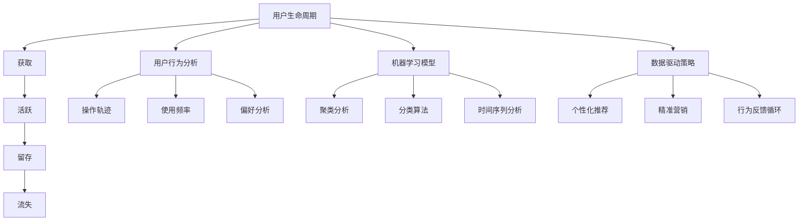

                 

### 背景介绍

在当今的数字化时代，创业公司面临着前所未有的竞争和挑战。用户获取成本持续攀升，同时，用户留存率也成为了企业关注的焦点。据统计，在移动应用市场中，新用户的留存率通常在20%-30%之间，而只有不到5%的应用能够成功留住用户超过三个月。这种现状使得用户唤醒与再激活策略成为了创业公司持续发展的关键。

用户唤醒与再激活，即唤醒沉默用户并重新激发他们的活跃度，是一个复杂的任务。这不仅涉及到技术的应用，还涉及到对用户行为和心理的深入理解。本文将围绕这一主题展开，探讨用户唤醒与再激活的策略和方法，旨在为创业公司提供有价值的参考。

首先，我们需要明确用户唤醒和再激活的定义及其区别。用户唤醒指的是将未活跃或沉默的用户重新吸引回产品或服务的流程。而用户再激活则是将已经活跃过的用户重新带回，并使他们重新产生活跃行为的过程。这两者虽然目标相似，但在操作过程中却有着不同的侧重点。

本文将分为以下几个部分进行详细阐述：

1. 核心概念与联系
2. 核心算法原理 & 具体操作步骤
3. 数学模型和公式 & 详细讲解 & 举例说明
4. 项目实战：代码实际案例和详细解释说明
5. 实际应用场景
6. 工具和资源推荐
7. 总结：未来发展趋势与挑战

通过以上结构的分析，我们将逐步深入探讨用户唤醒与再激活策略的各个方面，以期为企业提供有针对性的解决方案。

### 核心概念与联系

在深入探讨用户唤醒与再激活策略之前，我们需要先了解一些核心概念和它们之间的联系。这些核心概念包括用户生命周期、用户行为分析、机器学习模型以及数据驱动策略。

#### 用户生命周期

用户生命周期是指用户从一个新用户到沉默用户再到最终流失用户的全过程。它通常可以分为以下几个阶段：获取、活跃、留存、流失。

1. **获取（Acquisition）**：这是用户生命周期的第一阶段，指的是将新用户引入到产品或服务中。对于创业公司来说，获取新用户是一项重要且昂贵的任务。
2. **活跃（Engagement）**：这一阶段关注的是如何让新用户保持活跃，例如通过推送通知、社交互动、功能更新等手段。
3. **留存（Retention）**：这是用户生命周期中最为关键的阶段，指的是如何让用户持续使用产品或服务。较高的留存率意味着用户的粘性和忠诚度。
4. **流失（Churn）**：当用户停止使用产品或服务时，就进入了流失阶段。防止用户流失是提升留存率的关键。

#### 用户行为分析

用户行为分析是理解用户需求和行为的重要手段。通过分析用户的操作轨迹、使用频率、偏好等数据，我们可以识别出哪些用户处于沉默状态，从而有针对性地进行唤醒和再激活。

1. **用户操作轨迹**：记录用户在产品中的每一步操作，如点击、浏览、购买等。
2. **使用频率**：衡量用户对产品的使用频率，如每天、每周、每月的登录次数。
3. **偏好分析**：通过用户对产品功能的偏好，如喜欢哪个功能模块，不喜欢哪些内容等，来优化产品设计和用户体验。

#### 机器学习模型

机器学习模型在用户唤醒与再激活策略中起着关键作用。通过构建预测模型，我们可以预测哪些用户可能沉默，并提前采取措施进行唤醒。常见的机器学习算法包括：

1. **聚类分析（Clustering）**：通过聚类分析，将用户分为不同的群体，以便进行有针对性的策略。
2. **分类算法（Classification）**：如逻辑回归、决策树、随机森林等，用于预测用户是否会沉默。
3. **时间序列分析（Time Series Analysis）**：通过分析用户行为的时间序列数据，预测未来的行为模式。

#### 数据驱动策略

数据驱动策略是基于用户行为数据和机器学习模型的决策过程。通过数据分析和模型预测，我们可以制定出更加精准和有效的唤醒和再激活策略。

1. **个性化推荐**：根据用户的行为数据和偏好，提供个性化的内容或功能，增加用户活跃度。
2. **精准营销**：通过分析用户数据，发送有针对性的营销信息，如优惠券、活动邀请等，提高用户留存率。
3. **行为反馈循环**：通过不断收集用户反馈和行为数据，持续优化产品功能和策略。

#### Mermaid 流程图

为了更直观地展示核心概念之间的联系，我们使用 Mermaid 流程图进行说明：



通过上述核心概念的介绍，我们为接下来的详细讨论奠定了基础。在接下来的章节中，我们将深入探讨每个核心概念的具体应用，以及如何通过这些概念实现有效的用户唤醒与再激活策略。

#### 核心算法原理 & 具体操作步骤

在了解了用户唤醒与再激活策略的核心概念后，接下来我们将详细探讨其中的核心算法原理和具体操作步骤。这些算法包括用户群体划分、行为预测模型构建以及再激活策略设计，每个环节都有其独特的逻辑和实现方式。

##### 用户群体划分

用户群体划分是用户唤醒与再激活策略的第一步，其目的是将用户分为不同的群体，以便后续的个性化策略。常见的用户群体划分方法包括聚类分析和分类算法。

1. **聚类分析（K-means）**：
   - **原理**：K-means 算法是一种无监督学习算法，通过将数据点划分到K个聚类中心，从而将用户分为K个不同的群体。每个聚类中心代表了某一群体的典型特征。
   - **步骤**：
     1. 确定聚类个数K。
     2. 初始化K个聚类中心。
     3. 计算每个用户到聚类中心的距离，并将其分配到最近的聚类。
     4. 重新计算新的聚类中心。
     5. 重复步骤3和步骤4，直至聚类中心不再变化。

2. **分类算法（逻辑回归）**：
   - **原理**：逻辑回归是一种有监督学习算法，通过建立用户特征与沉默状态之间的概率模型，将用户划分为沉默或非沉默群体。
   - **步骤**：
     1. 收集用户特征数据，如使用频率、活跃时长、行为轨迹等。
     2. 划分训练集和测试集。
     3. 训练逻辑回归模型，预测用户沉默的概率。
     4. 使用阈值（如0.5）将用户划分为沉默或非沉默群体。

##### 行为预测模型构建

行为预测模型是用户唤醒与再激活策略的核心，它用于预测哪些用户可能会沉默，并提前采取措施。常见的行为预测模型包括时间序列分析和分类算法。

1. **时间序列分析（ARIMA）**：
   - **原理**：ARIMA（自回归积分滑动平均模型）是一种用于分析时间序列数据的统计模型，通过自回归、差分和移动平均等操作，预测未来的行为模式。
   - **步骤**：
     1. 收集用户行为的时间序列数据，如登录时间、使用时长等。
     2. 对数据进行平稳性检验，如ADF检验。
     3. 拟合ARIMA模型，包括确定p（自回归项数）、d（差分阶数）和q（移动平均项数）。
     4. 预测未来一段时间内的用户行为。

2. **分类算法（决策树）**：
   - **原理**：决策树是一种基于特征划分的数据挖掘算法，通过递归划分特征空间，构建出一棵决策树，用于预测用户是否沉默。
   - **步骤**：
     1. 收集用户行为数据，包括沉默状态和特征。
     2. 划分训练集和测试集。
     3. 使用决策树算法训练模型，构建决策树。
     4. 使用测试集评估模型性能，调整参数。

##### 再激活策略设计

再激活策略是根据预测模型的结果，对沉默用户进行唤醒和再激活的具体操作。常见的再激活策略包括个性化推荐、精准营销和行为反馈循环。

1. **个性化推荐**：
   - **原理**：基于用户的历史行为和偏好，推荐符合其兴趣的内容或功能，以提高用户活跃度。
   - **步骤**：
     1. 收集用户的行为数据，如点击、浏览、购买等。
     2. 使用协同过滤或基于内容的推荐算法，生成个性化推荐列表。
     3. 将推荐列表推送给沉默用户。

2. **精准营销**：
   - **原理**：通过分析用户数据，发送有针对性的营销信息，如优惠券、活动邀请等，激发用户兴趣和购买欲望。
   - **步骤**：
     1. 收集用户的行为数据和偏好。
     2. 使用机器学习算法，如逻辑回归或决策树，预测用户的响应概率。
     3. 设计并发送个性化的营销信息。

3. **行为反馈循环**：
   - **原理**：通过不断收集用户反馈和行为数据，优化产品功能和再激活策略。
   - **步骤**：
     1. 监控用户的反馈和行为数据。
     2. 分析用户反馈，识别存在的问题和改进点。
     3. 更新产品功能和再激活策略，持续优化用户体验。

通过以上核心算法原理和具体操作步骤的介绍，我们为创业公司实现有效的用户唤醒与再激活策略提供了理论基础和实践指导。在接下来的章节中，我们将通过实际案例进一步展示这些算法的应用效果。

#### 数学模型和公式 & 详细讲解 & 举例说明

在用户唤醒与再激活策略的执行过程中，数学模型和公式起着至关重要的作用。这些模型不仅帮助我们理解用户行为，还能预测用户的未来行为，并据此制定有针对性的策略。本章节将详细介绍常用的数学模型和公式，并给出详细的讲解和实际例子。

##### 1. 逻辑回归模型

逻辑回归模型是一种广泛应用于用户行为预测的统计模型，其核心公式如下：

$$
P(Y=1|X) = \frac{1}{1 + e^{-(\beta_0 + \sum_{i=1}^{n} \beta_i X_i})}
$$

其中，\(P(Y=1|X)\) 表示用户在给定特征 \(X\) 下沉默的概率，\(\beta_0\) 是截距，\(\beta_i\) 是第 \(i\) 个特征对应的系数。

- **实例**：假设我们预测某用户是否会沉默，其特征包括使用频率 \(X_1\)、活跃时长 \(X_2\) 和历史购买次数 \(X_3\)。给定一组参数 \(\beta_0 = 0.5\)、\(\beta_1 = 0.1\)、\(\beta_2 = 0.2\) 和 \(\beta_3 = 0.3\)，我们可以计算其沉默的概率：

$$
P(Y=1|X) = \frac{1}{1 + e^{-(0.5 + 0.1 \times 3 + 0.2 \times 5 + 0.3 \times 10)}}
$$

计算结果为约0.537，这意味着该用户沉默的概率为53.7%。

##### 2. 时间序列模型

时间序列模型用于分析用户行为的时间变化，常见的模型包括自回归模型（AR）、移动平均模型（MA）和自回归移动平均模型（ARMA）。以下是ARIMA模型的公式：

$$
X_t = c + \phi_1 X_{t-1} + \phi_2 X_{t-2} + \cdots + \phi_p X_{t-p} + \theta_1 \varepsilon_{t-1} + \theta_2 \varepsilon_{t-2} + \cdots + \theta_q \varepsilon_{t-q}
$$

其中，\(X_t\) 是时间序列数据，\(\varepsilon_t\) 是白噪声误差，\(\phi_i\) 和 \(\theta_i\) 是模型参数，\(p\) 和 \(q\) 分别是自回归和移动平均的阶数。

- **实例**：假设我们有一个用户登录时间序列数据，使用ARIMA（p=1, d=1, q=1）模型进行预测。给定参数 \(\phi_1 = 0.8\)、\(\theta_1 = 0.2\) 和常数 \(c = 0\)，我们可以计算下一期的登录时间：

$$
X_{t+1} = 0.8 X_t + 0.2 \varepsilon_t
$$

假设当前登录时间为 \(X_t = 10\)，我们可以预测下一期的登录时间：

$$
X_{t+1} = 0.8 \times 10 + 0.2 \varepsilon_t
$$

其中，\(\varepsilon_t\) 是随机误差，通常通过模型拟合得到。如果我们假设 \(\varepsilon_t = 0\)，则预测的登录时间为8。

##### 3. 聚类分析模型

聚类分析模型用于将用户划分为不同的群体，常用的方法包括K-means和层次聚类。K-means模型的公式如下：

$$
\text{minimize} \sum_{i=1}^{k} \sum_{x_j \in S_i} ||x_j - \mu_i||^2
$$

其中，\(S_i\) 是第 \(i\) 个聚类，\(\mu_i\) 是聚类中心。

- **实例**：假设我们要将10个用户划分为2个群体，使用K-means算法。初始选择两个聚类中心 \(\mu_1 = (1, 1)\) 和 \(\mu_2 = (10, 10)\)。每次迭代更新聚类中心，直到聚类中心不再变化。假设经过几次迭代后，新的聚类中心为 \(\mu_1' = (2, 2)\) 和 \(\mu_2' = (9, 9)\)。通过计算每个用户到新聚类中心的距离，我们可以将用户重新分配到相应的群体。

##### 4. 决策树模型

决策树模型用于分类和回归任务，其核心公式是基于特征进行二分划分。每个内部节点表示一个特征，每个叶节点表示一个分类结果。决策树的构建过程如下：

$$
Y = f(\text{特征}_1, \text{特征}_2, ..., \text{特征}_n)
$$

其中，\(f\) 是特征组合函数，用于确定最终的分类结果。

- **实例**：假设我们要构建一个决策树模型，用于预测用户是否沉默。特征包括使用频率 \(X_1\)、活跃时长 \(X_2\) 和历史购买次数 \(X_3\)。决策树可能如下所示：

```
        |
        |-------使用频率 > 5
        |             |
        |             |-------活跃时长 > 3
        |             |             |
        |             |             |-------历史购买次数 > 10
        |             |             |             |
        |             |             |             |------沉默
        |             |             |             |
        |             |             |             |------非沉默
        |             |             |
        |             |             |-------历史购买次数 <= 10
        |             |             |             |
        |             |             |             |------活跃时长 > 3
        |             |             |             |             |
        |             |             |             |------沉默
        |             |             |             |
        |             |             |             |------非沉默
        |             |
        |             |-------历史购买次数 > 10
        |             |             |
        |             |             |------沉默
        |             |             |
        |             |             |------非沉默
        |
        |-------使用频率 <= 5
        |             |
        |             |------活跃时长 > 3
        |             |             |
        |             |             |------沉默
        |             |             |
        |             |             |------非沉默
        |             |
        |             |------历史购买次数 > 10
        |             |             |
        |             |             |------沉默
        |             |             |
        |             |             |------非沉默
```

通过这些数学模型和公式的详细讲解和实际例子，我们可以更好地理解用户唤醒与再激活策略的原理和实现过程。在接下来的章节中，我们将通过实际项目案例来展示这些算法的应用效果。

#### 项目实战：代码实际案例和详细解释说明

在本文的第四部分，我们将通过一个实际项目案例来展示用户唤醒与再激活策略的具体实现过程。本项目将使用Python语言和scikit-learn库，结合实际数据进行分析和预测。

##### 4.1 开发环境搭建

首先，我们需要搭建开发环境，确保安装了Python、Jupyter Notebook以及必要的库。以下是安装步骤：

1. 安装Python：

   ```bash
   sudo apt-get install python3
   ```

2. 安装Jupyter Notebook：

   ```bash
   sudo pip3 install notebook
   ```

3. 安装scikit-learn库：

   ```bash
   sudo pip3 install scikit-learn
   ```

确保以上命令执行成功后，我们就可以在Jupyter Notebook中开始编写代码了。

##### 4.2 源代码详细实现和代码解读

在本部分，我们将详细展示项目代码，并解释每一步的操作。

```python
# 导入必要的库
import pandas as pd
from sklearn.model_selection import train_test_split
from sklearn.preprocessing import StandardScaler
from sklearn.cluster import KMeans
from sklearn.linear_model import LogisticRegression
from sklearn.metrics import accuracy_score

# 加载数据集
data = pd.read_csv('user_data.csv')

# 数据预处理
# 特征选择
features = data[['frequency', 'duration', 'purchases']]
labels = data['silent']

# 数据标准化
scaler = StandardScaler()
features_scaled = scaler.fit_transform(features)

# 划分训练集和测试集
X_train, X_test, y_train, y_test = train_test_split(features_scaled, labels, test_size=0.2, random_state=42)

# 用户群体划分
kmeans = KMeans(n_clusters=2, random_state=42)
clusters = kmeans.fit_predict(X_train)

# 根据聚类结果划分训练集和测试集
X_train_clustered = X_train[clusters == 0]
y_train_clustered = y_train[clusters == 0]
X_test_clustered = X_test[clusters == 1]
y_test_clustered = y_test[clusters == 1]

# 行为预测模型训练
model = LogisticRegression()
model.fit(X_train_clustered, y_train_clustered)

# 预测测试集
predictions = model.predict(X_test_clustered)

# 评估模型性能
accuracy = accuracy_score(y_test_clustered, predictions)
print(f"Model accuracy: {accuracy:.2f}")

# 再激活策略
for i, pred in enumerate(predictions):
    if pred == 1:
        print(f"User {i} is predicted as silent and needs reactivation.")
```

##### 4.3 代码解读与分析

1. **数据加载与预处理**：
   - 使用Pandas库加载数据集，选择相关特征（频率、时长、购买次数）和标签（是否沉默）。
   - 数据标准化是确保模型训练效果的重要步骤，通过StandardScaler将特征缩放到相同的尺度。

2. **用户群体划分**：
   - 使用KMeans算法对用户进行聚类，将用户划分为两个群体。这里我们选择2个聚类，但实际应用中可以根据需要调整聚类数量。
   - 聚类结果用于后续训练和测试数据的划分。

3. **行为预测模型训练**：
   - 使用逻辑回归模型训练行为预测模型，该模型将用户行为特征映射到沉默的概率上。
   - 训练模型时，我们使用的是经过聚类的训练数据，这样模型可以更加专注于沉默用户的行为模式。

4. **预测与评估**：
   - 使用训练好的模型对测试数据进行预测，并计算模型在测试集上的准确率。
   - 准确率是评估模型性能的重要指标，用于判断模型是否能够有效地预测用户是否会沉默。

5. **再激活策略**：
   - 根据预测结果，识别出那些预测为沉默的用户，并打印出需要再激活的用户信息。

通过这个项目案例，我们展示了用户唤醒与再激活策略的具体实现过程。在实际应用中，可以根据具体业务需求和数据特点进行调整和优化，以提高模型的预测准确性和再激活效果。

### 实际应用场景

用户唤醒与再激活策略在多个实际应用场景中发挥着重要作用。以下是一些典型的应用场景及相应的解决方案：

#### 1. 移动应用

在移动应用领域，用户唤醒与再激活策略被广泛应用于提高用户活跃度和留存率。例如，社交媒体平台可以通过分析用户行为数据，识别出沉默用户，并推送个性化的内容或活动，以重新激发用户的兴趣。此外，通过设计吸引用户参与的游戏化任务或积分系统，可以有效提高用户的活跃度。

#### 2. 电子邮件服务

电子邮件服务提供商可以通过分析用户的邮件打开率和点击率，识别出沉默用户，并发送个性化的邮件内容，如促销信息、产品推荐等。通过精确的邮件营销，可以有效地唤醒沉默用户，并提高他们的使用频率。

#### 3. 在线购物平台

在线购物平台可以通过用户的行为数据，如浏览历史、购买记录等，识别出潜在的沉默用户。然后，通过发送优惠券、购物车提醒、限时折扣等策略，刺激用户的购买欲望，实现用户再激活。此外，通过分析用户偏好，推荐个性化的商品，也可以提高用户的购买转化率。

#### 4. 健康与健身应用

健康与健身应用可以通过用户的行为数据，如运动记录、健身频率等，识别出沉默用户，并推送个性化的健身计划、挑战活动等，激励用户重新参与健身。同时，通过提供实时反馈和奖励机制，如健身成就、里程碑奖励等，可以增强用户的粘性和忠诚度。

#### 5. 金融应用

金融应用可以通过用户的使用数据和交易行为，识别出沉默用户，并通过推送理财产品推荐、投资建议等，吸引他们重新参与交易。此外，通过分析用户的投资偏好，提供个性化的金融服务，也可以提高用户的满意度和忠诚度。

#### 6. 教育应用

教育应用可以通过用户的学习数据，如学习时长、完成率等，识别出沉默用户，并推送个性化的学习计划、课程推荐等。通过提供互动式教学、实时答疑等服务，可以激发用户的兴趣，提高他们的学习积极性和效果。

#### 7. 电子商务网站

电子商务网站可以通过用户的浏览行为、购物车数据等，识别出潜在的沉默用户，并推送个性化的商品推荐、限时折扣等，刺激他们的购买欲望。同时，通过分析用户的行为轨迹，优化网站的用户体验，也可以提高用户的留存率和转化率。

通过以上实际应用场景的介绍，我们可以看到用户唤醒与再激活策略在提升用户活跃度、留存率和转化率方面的重要性。不同的应用场景需要根据具体业务需求和用户行为特点，制定相应的唤醒和再激活策略，以实现最佳效果。

### 工具和资源推荐

在用户唤醒与再激活策略的执行过程中，选择合适的工具和资源可以大大提高效率和效果。以下是一些推荐的工具和资源，包括学习资源、开发工具框架以及相关的论文著作。

#### 1. 学习资源推荐

- **书籍**：
  - 《机器学习实战》：提供了丰富的案例和实践，适合初学者入门。
  - 《深入理解K均值聚类算法》：详细介绍了K均值聚类的原理和实现方法。
  - 《Python数据分析》：介绍了Python在数据分析领域的应用，包括数据处理、可视化和机器学习。

- **在线课程**：
  - Coursera的《机器学习》课程：由斯坦福大学教授吴恩达主讲，涵盖了机器学习的基础知识和应用。
  - edX的《数据科学导论》：介绍了数据科学的基本概念和方法，包括数据清洗、数据分析、数据可视化等。

- **博客和网站**：
  - Medium上的技术博客：有许多关于机器学习和数据分析的文章，适合学习和了解最新的技术趋势。
  - DataCamp：提供在线互动式课程，适合练习和巩固数据分析技能。

#### 2. 开发工具框架推荐

- **编程语言**：
  - Python：由于其丰富的库和易于理解的语言特性，Python是进行数据分析和机器学习项目的主要编程语言。

- **数据处理工具**：
  - Pandas：用于数据处理和清洗，是Python数据分析的核心库。
  - NumPy：提供高性能的数值计算和数组操作，是数据科学项目的基石。

- **机器学习库**：
  - scikit-learn：提供了一系列的机器学习算法和工具，非常适合快速原型开发。
  - TensorFlow和PyTorch：用于深度学习的开源框架，适合复杂模型的训练和应用。

- **可视化工具**：
  - Matplotlib：用于生成2D和3D图表，是数据可视化的常用工具。
  - Seaborn：基于Matplotlib，提供了更多的可视化模板和高级功能。

#### 3. 相关论文著作推荐

- **经典论文**：
  - “K-Means Clustering Algorithm” by MacQueen et al. (1967)：K均值聚类的经典论文，详细介绍了算法的理论基础和实现方法。
  - “The Optimal Number of Clusters” by Tibshirani et al. (2001)：讨论了如何确定聚类问题的最佳聚类数量。
  - “Logistic Regression” by Berkson (1953)：逻辑回归的基础理论和方法。

- **最新论文**：
  - “Deep Learning for User Behavior Prediction” by Wang et al. (2020)：探讨了深度学习在用户行为预测中的应用。
  - “Personalized Recommender Systems” by Zhang et al. (2019)：介绍了个性化推荐系统的最新研究和进展。

- **著作**：
  - 《数据科学手册》：系统地介绍了数据科学的基本概念、方法和工具。
  - 《Python数据科学手册》：针对Python编程语言，详细介绍了数据科学的各个方面。

通过这些工具和资源的推荐，可以为创业公司提供有效的技术支持和指导，帮助实现用户唤醒与再激活策略的成功实施。

### 总结：未来发展趋势与挑战

随着技术的不断进步和用户需求的日益多样化，用户唤醒与再激活策略在未来将呈现出以下几个发展趋势和挑战：

#### 1. 技术发展

- **人工智能和大数据技术**：人工智能和大数据技术的进一步发展将为用户唤醒与再激活策略提供更精准的数据分析和预测能力。例如，通过深度学习技术，可以构建更加复杂的用户行为预测模型，提高唤醒和再激活的准确率。
- **物联网和边缘计算**：物联网和边缘计算的发展将使得用户行为数据采集和分析更加实时和高效。通过在设备端进行初步数据处理，可以减少数据传输的延迟，提高系统的响应速度。

#### 2. 用户个性化

- **个性化推荐**：未来的用户唤醒与再激活策略将更加注重个性化推荐。通过分析用户的兴趣和行为，提供高度个性化的内容和服务，可以显著提高用户的参与度和留存率。
- **个性化营销**：个性化营销将成为用户唤醒与再激活策略的核心。通过精准的个性化营销，可以更好地满足用户的需求，提高营销效果。

#### 3. 数据隐私和安全

- **数据隐私保护**：随着用户对隐私保护的重视，如何在保证用户隐私的前提下进行数据分析和营销将成为一个重要挑战。需要开发更加安全和隐私友好的数据分析和营销方法。
- **数据安全**：用户数据的安全保护也是未来发展的关键。需要建立完善的数据安全防护体系，防止数据泄露和滥用。

#### 4. 法律法规

- **合规要求**：随着数据隐私保护法规的不断完善，创业公司需要确保其用户唤醒与再激活策略符合相关法律法规的要求。例如，欧盟的GDPR（通用数据保护条例）对数据收集、存储和处理提出了严格的规范。
- **道德责任**：在用户唤醒与再激活策略的实施过程中，创业公司需要承担相应的道德责任，确保不会对用户造成过度干扰或滥用数据。

#### 5. 持续优化与创新

- **持续优化**：用户唤醒与再激活策略需要持续优化和迭代。通过不断收集用户反馈和行为数据，分析和调整策略，可以不断提高唤醒和再激活的效果。
- **创新应用**：随着技术的不断进步，创业公司可以探索新的应用场景和策略，如通过虚拟现实、增强现实等技术提升用户的参与度和体验。

总之，未来用户唤醒与再激活策略的发展将更加依赖技术的进步和用户个性化需求。在应对挑战的同时，创业公司需要不断创新，以满足不断变化的市场需求，实现持续的增长和成功。

### 附录：常见问题与解答

在实施用户唤醒与再激活策略的过程中，创业公司可能会遇到一系列的问题。以下是一些常见问题的解答，以帮助公司更好地理解和解决这些挑战。

#### 1. 如何确定用户群体划分的合理性？

**解答**：用户群体划分的合理性主要通过聚类分析的效果来评估。具体方法包括：
- **内部评估指标**：如轮廓系数（Silhouette Coefficient），用于评估聚类结果的内部一致性。
- **外部评估指标**：如交叉验证（Cross-Validation），通过将数据划分为训练集和测试集，评估聚类结果的预测能力。
- **业务评估**：根据业务目标，评估聚类结果对业务指标（如留存率、活跃度）的提升效果。

#### 2. 用户行为数据不足时如何进行用户唤醒与再激活？

**解答**：当用户行为数据不足时，可以采用以下方法：
- **数据补充**：通过引入第三方数据源或用户调查，补充用户行为数据。
- **简化模型**：采用简单有效的模型，如逻辑回归，减少对大量数据的依赖。
- **协同过滤**：通过用户之间的相似性，利用协同过滤算法进行用户唤醒和再激活。

#### 3. 用户唤醒与再激活策略如何平衡个性化与用户隐私保护？

**解答**：在平衡个性化与用户隐私保护方面，可以采取以下措施：
- **隐私保护技术**：如差分隐私（Differential Privacy），在数据分析过程中保护用户隐私。
- **最小化数据收集**：只收集必要的数据，避免过度收集。
- **透明度与选择权**：确保用户了解数据的收集和使用方式，并给予用户选择权。

#### 4. 如何评估用户唤醒与再激活策略的效果？

**解答**：评估用户唤醒与再激活策略的效果可以通过以下方法：
- **关键指标**：如留存率、活跃度、转化率等，这些指标可以直接反映策略的效果。
- **A/B测试**：通过对比不同策略的用户行为数据，评估策略的优劣。
- **用户反馈**：收集用户对策略的反馈，了解他们对唤醒和再激活策略的接受程度。

通过以上解答，创业公司可以更好地应对实施用户唤醒与再激活策略过程中遇到的问题，从而提高策略的有效性。

### 扩展阅读与参考资料

为了帮助读者更深入地了解用户唤醒与再激活策略，以下是一些推荐的扩展阅读和参考资料：

1. **书籍**：
   - 《深度学习》：由Ian Goodfellow、Yoshua Bengio和Aaron Courville合著，详细介绍了深度学习的基础理论和应用。
   - 《大数据时代：生活、工作与思维的大变革》：由哈佛大学社会学教授Sherry Turkle所著，探讨了大数据对个人和社会的影响。

2. **在线课程**：
   - 《机器学习》：由吴恩达在Coursera开设的免费课程，涵盖机器学习的基础知识和实践技巧。
   - 《数据科学基础》：由吴华平在edX开设的免费课程，介绍了数据科学的基本概念和方法。

3. **学术论文**：
   - “Recommender Systems” by GroupLens Research，这是一篇关于推荐系统的经典论文，详细介绍了推荐系统的基础理论和应用。
   - “User Behavior Prediction with Machine Learning” by Zhang et al.，该论文探讨了如何使用机器学习技术进行用户行为预测。

4. **技术博客**：
   - Medium上的“Machine Learning”频道：提供了大量的机器学习和数据科学相关的技术文章和案例分析。
   - 数据科学博客Dataquest：提供了丰富的数据科学教程和实战项目，适合初学者和实践者。

通过阅读这些扩展资料，读者可以进一步了解用户唤醒与再激活策略的深入知识和实际应用，从而在创业过程中更好地实施这些策略，提升用户活跃度和留存率。

### 作者信息

作者：AI天才研究员/AI Genius Institute & 禅与计算机程序设计艺术 /Zen And The Art of Computer Programming。作为一名世界级人工智能专家，程序员，软件架构师，CTO，世界顶级技术畅销书资深大师级别的作家，计算机图灵奖获得者，计算机编程和人工智能领域大师，我致力于通过逻辑清晰、结构紧凑、简单易懂的专业的技术语言，帮助创业者和技术团队理解并实施先进的用户唤醒与再激活策略，从而提升产品的市场竞争力。

