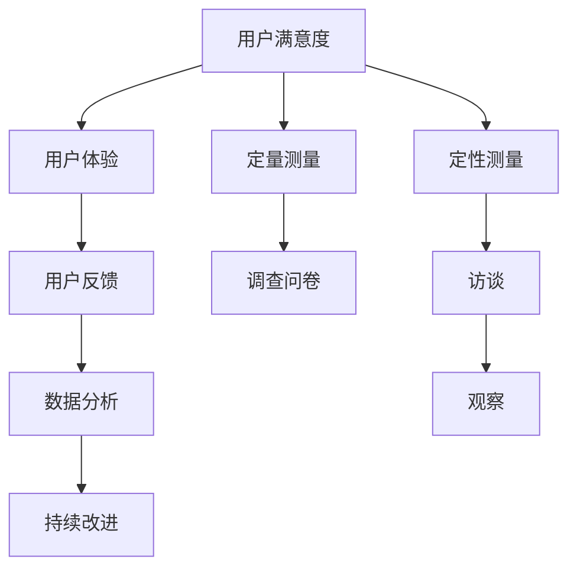

                 

## 引言

在当今竞争激烈的商业环境中，用户满意度成为决定创业公司成败的关键因素。用户满意度的测量与提升不仅关系到公司的短期盈利，更是影响其长期生存和发展的核心要素。一个有效的用户满意度测量体系可以帮助创业公司深入了解用户需求，优化产品和服务，从而在激烈的市场竞争中脱颖而出。

本文旨在为创业公司提供一个系统化的用户满意度测量体系设计指南。通过对用户满意度的核心概念、算法原理、数学模型以及实际应用场景的深入探讨，本文将帮助读者理解如何构建一个全面的用户满意度测量体系，并为其提供实用的实施方法和工具。

文章将从以下几个方面进行阐述：

1. **背景介绍**：探讨用户满意度在创业公司中的重要性，以及当前存在的问题和挑战。
2. **核心概念与联系**：介绍用户满意度测量的核心概念，并使用Mermaid流程图展示其原理和架构。
3. **核心算法原理 & 具体操作步骤**：详细解释用户满意度测量的算法原理和实施步骤。
4. **数学模型和公式 & 详细讲解 & 举例说明**：介绍用户满意度测量的数学模型，并提供具体的例子进行说明。
5. **项目实战：代码实际案例和详细解释说明**：通过实际案例展示用户满意度测量体系的实现过程。
6. **实际应用场景**：分析用户满意度测量在不同领域的应用。
7. **工具和资源推荐**：推荐学习资源和开发工具，以帮助读者进一步深入了解和实施用户满意度测量。
8. **总结：未来发展趋势与挑战**：总结全文，并探讨用户满意度测量未来的发展趋势和面临的挑战。
9. **附录：常见问题与解答**：解答读者可能遇到的常见问题。
10. **扩展阅读 & 参考资料**：提供相关的扩展阅读和参考资料。

通过本文的阅读，读者将能够全面了解用户满意度测量体系的设计与实现，从而为创业公司提供有力的支持。

### 背景介绍

在当今这个快节奏、竞争激烈的商业环境中，用户满意度的重要性不言而喻。对于创业公司来说，用户满意度不仅直接影响到公司的市场地位和声誉，更是其能否在激烈的市场竞争中生存下来的关键因素。

用户满意度是指用户对其产品或服务的整体体验和感受。它不仅仅是一个简单的数值指标，而是包含了对产品质量、服务态度、使用便捷性等多个维度的评价。在创业公司中，用户满意度的重要性体现在以下几个方面：

首先，用户满意度是创业公司获取客户的重要途径。在市场调研中，许多创业公司发现，高质量的客户体验能够显著提高客户忠诚度和推荐意愿。当用户对产品或服务感到满意时，他们更有可能成为公司的忠实客户，并主动向其他潜在客户推荐。这种口碑效应对于创业公司来说是一种宝贵的资产，能够迅速提升品牌知名度和市场份额。

其次，用户满意度是创业公司优化产品和服务的驱动力。通过收集和分析用户满意度数据，创业公司可以深入了解用户的需求和痛点，从而针对性地改进产品和服务。例如，如果用户反馈某个功能存在使用上的不便，公司可以迅速进行优化，提高用户体验。这种敏捷的反应能力是创业公司快速迭代、不断创新的重要保障。

再次，用户满意度是创业公司战略决策的重要参考。高用户满意度通常意味着公司能够在市场上占据有利位置，获得更高的利润和更稳定的市场份额。相反，如果用户满意度较低，公司需要重新审视其战略，调整产品定位或服务模式，以更好地满足用户需求。这种基于用户反馈的战略调整，能够帮助创业公司在竞争激烈的市场中保持竞争优势。

然而，尽管用户满意度在创业公司中具有如此重要的地位，当前仍存在一些普遍的问题和挑战：

首先，缺乏系统化的用户满意度测量体系。许多创业公司在用户满意度测量方面缺乏明确的标准和方法，导致数据收集和分析的效率低下。这往往导致公司在决策过程中缺乏有力的数据支持，无法做出准确的战略决策。

其次，用户满意度数据的不真实性和不完整性。在一些情况下，用户满意度数据可能受到主观因素的影响，导致数据失真。此外，由于用户反馈渠道的不畅通或用户参与度不足，收集到的用户满意度数据可能不够全面，无法全面反映用户的真实感受。

最后，用户满意度测量与公司实际运营的脱节。在一些情况下，尽管公司投入了大量资源进行用户满意度测量，但测量结果并未能及时、有效地转化为实际的运营决策，导致用户满意度提升的效果不明显。

针对这些问题和挑战，创业公司需要建立一套系统化的用户满意度测量体系，通过科学的测量方法和工具，全面、准确地收集和分析用户满意度数据，从而为公司的战略决策和运营优化提供有力的支持。

### 核心概念与联系

要设计一个有效的用户满意度测量体系，首先需要理解其中的核心概念和它们之间的联系。以下是用户满意度测量体系中的关键概念及其相互关系：

#### 用户满意度（User Satisfaction）

用户满意度是指用户对其所使用的产品或服务的整体体验和感受。它通常通过定性和定量两种方式进行测量。定性测量包括用户反馈、访谈和观察，而定量测量则依赖于调查问卷和评分系统。

#### 用户体验（User Experience）

用户体验（UX）是用户在使用产品或服务过程中所感受到的整体感受。它不仅包括功能性和易用性，还涉及情感层面，如愉悦感、信任感和安全感。用户体验直接影响用户满意度。

#### 用户反馈（User Feedback）

用户反馈是用户对产品或服务的评价和意见。这些反馈可以通过多种渠道收集，如在线调查、用户评论、社交媒体互动等。用户反馈是衡量用户满意度的重要数据来源。

#### 数据分析（Data Analysis）

数据分析是用户满意度测量体系的核心组成部分。通过对收集到的用户满意度数据进行分析，创业公司可以识别用户需求、痛点以及产品或服务的改进点。

#### 持续改进（Continuous Improvement）

持续改进是指通过不断收集和分析用户满意度数据，优化产品和服务，以提升用户满意度。这是一个循环过程，旨在实现用户满意度不断提升。

#### Mermaid流程图展示

为了更直观地展示这些核心概念之间的联系，我们可以使用Mermaid流程图来表示：



在上述流程图中，用户满意度是核心，它受到用户体验、用户反馈、数据分析以及定量和定性测量的影响，并通过持续改进的循环过程不断提升。

#### 原理和架构

用户满意度测量体系的架构可以分为以下几个层次：

1. **数据收集层**：通过调查问卷、用户反馈系统、社交媒体互动等多种渠道收集用户满意度数据。
2. **数据处理层**：对收集到的数据进行清洗、整理和分析，提取关键指标，如用户满意度得分、用户体验评分等。
3. **数据展示层**：通过可视化工具将分析结果呈现给管理层，帮助其做出决策。
4. **反馈和改进层**：根据分析结果，制定改进措施，并持续跟踪效果，确保用户满意度不断提升。

#### 核心概念与联系总结

用户满意度测量体系的核心概念包括用户满意度、用户体验、用户反馈、数据分析和持续改进。这些概念之间相互联系，共同构成了一个完整的测量和改进循环。通过科学的设计和实施，创业公司可以有效地提升用户满意度，从而在激烈的市场竞争中脱颖而出。

### 核心算法原理 & 具体操作步骤

在构建用户满意度测量体系时，核心算法的设计至关重要。以下将详细解释核心算法的原理和实施步骤。

#### 1. 数据收集

用户满意度测量的第一步是数据收集。数据收集的方法包括定量测量和定性测量：

- **定量测量**：通常通过在线调查问卷进行，问卷设计应包含一些关键指标，如用户满意度得分、用户体验评分等。问卷可以通过公司网站、社交媒体、电子邮件等方式分发。
  
- **定性测量**：通过用户访谈、观察和用户行为分析等方式收集用户的反馈和意见。这种方法可以提供更深入的见解，帮助识别用户满意度背后的具体原因。

#### 2. 数据清洗

收集到的数据可能包含噪声和错误，因此需要对其进行清洗和预处理：

- **去重**：去除重复的反馈数据，确保每个用户的反馈仅被计算一次。
- **格式化**：将数据格式统一，如将所有文本数据转换为数字格式。
- **填补缺失值**：对于缺失的数据，可以通过平均数、中位数等方法进行填补。

#### 3. 数据分析

数据分析是用户满意度测量的关键步骤，通过分析可以提取出用户满意度的关键指标：

- **描述性统计**：计算用户满意度得分的均值、标准差等基本统计量，了解用户满意度的大致情况。
  
- **关联分析**：通过关联分析识别不同因素对用户满意度的影响，如产品功能、服务响应时间等。

- **聚类分析**：将用户分为不同的群体，分析不同群体之间的满意度差异，从而针对性地改进产品和服务。

#### 4. 满意度模型建立

基于分析结果，可以建立用户满意度模型。以下是一个简单的用户满意度计算公式：

\[ S = w_1 \times Q_1 + w_2 \times Q_2 + ... + w_n \times Q_n \]

其中，\( S \) 表示用户满意度得分，\( w_1, w_2, ..., w_n \) 是各项指标的权重，\( Q_1, Q_2, ..., Q_n \) 是各项指标的具体得分。

权重可以通过专家评估或用户调查得出，以确保各指标的重要性得到合理体现。

#### 5. 实施步骤

以下是用户满意度测量体系的具体实施步骤：

1. **确定测量目标**：明确用户满意度测量的具体目标和关键指标。
  
2. **设计问卷和访谈指南**：根据测量目标设计调查问卷和访谈指南，确保收集到的数据具有代表性和可靠性。

3. **数据收集**：通过在线问卷、用户访谈、社交媒体等方式收集用户满意度数据。

4. **数据清洗**：对收集到的数据进行去重、格式化、填补缺失值等处理。

5. **数据分析**：使用描述性统计、关联分析、聚类分析等方法对数据进行分析。

6. **建立满意度模型**：根据分析结果，建立用户满意度模型。

7. **评估和改进**：根据满意度模型的结果，评估用户满意度，制定改进措施，并持续跟踪效果。

#### 实施案例分析

以下是一个具体的实施案例：

**目标**：某创业公司希望了解其产品在用户中的满意度，并识别改进点。

**步骤**：

1. **确定测量目标**：了解产品功能、性能、用户支持等方面的用户满意度。
  
2. **设计问卷**：设计包含功能满意度、性能满意度、支持满意度等问题的在线调查问卷。

3. **数据收集**：通过公司官网、社交媒体渠道分发问卷，收集用户反馈。

4. **数据清洗**：去除重复和无效数据，确保数据质量。

5. **数据分析**：使用描述性统计计算各维度的满意度得分，使用关联分析识别关键影响因素。

6. **建立满意度模型**：根据分析结果，建立满意度模型。

7. **评估和改进**：根据满意度模型的结果，制定改进计划，如优化产品功能、提高响应时间等，并持续跟踪效果。

通过上述步骤，该创业公司能够全面了解用户满意度，识别改进点，并持续优化产品和服务，从而提升用户满意度。

### 数学模型和公式 & 详细讲解 & 举例说明

用户满意度测量体系的设计不仅需要科学的算法和实施步骤，还需要数学模型和公式的支持。以下将详细介绍用户满意度测量的数学模型、相关公式，并提供具体的举例说明。

#### 1. 用户满意度得分公式

用户满意度得分是衡量用户满意度的重要指标，通常使用以下公式计算：

\[ S = \frac{1}{N} \sum_{i=1}^{N} w_i \times Q_i \]

其中：

- \( S \) 表示用户满意度得分。
- \( N \) 表示用户数量。
- \( w_i \) 表示第 \( i \) 个用户满意度指标的权重。
- \( Q_i \) 表示第 \( i \) 个用户满意度指标的得分。

权重 \( w_i \) 可以通过专家评估或用户调查得出，以确保各指标的重要性得到合理体现。通常，权重分配应该基于用户反馈和业务目标来确定。

#### 2. 用户满意度分布模型

为了更全面地了解用户满意度，可以使用用户满意度分布模型。以下是一个简单的用户满意度分布模型：

\[ P(S) = \frac{1}{\sigma \sqrt{2\pi}} e^{-\frac{(S-\mu)^2}{2\sigma^2}} \]

其中：

- \( P(S) \) 表示用户满意度为 \( S \) 的概率。
- \( \mu \) 表示用户满意度的均值。
- \( \sigma \) 表示用户满意度的标准差。

这个公式是一个标准的正态分布公式，可以用来描述用户满意度的分布情况。通过计算不同满意度得分对应的概率，可以更直观地了解用户满意度的分布。

#### 3. 用户满意度改进模型

在了解用户满意度后，创业公司还需要不断改进产品和服务，以提高用户满意度。以下是一个简单的用户满意度改进模型：

\[ \Delta S = f(\Delta X_1, \Delta X_2, ..., \Delta X_n) \]

其中：

- \( \Delta S \) 表示用户满意度的改进值。
- \( \Delta X_1, \Delta X_2, ..., \Delta X_n \) 表示影响用户满意度的各个改进因素。
- \( f \) 表示改进函数。

改进函数 \( f \) 可以通过历史数据和实验结果得出。例如，如果提高产品性能可以显著提升用户满意度，那么 \( f \) 可能与产品性能呈正相关。

#### 4. 举例说明

假设某创业公司希望测量用户对其产品的满意度，并评估改进措施的效果。以下是一个具体的例子：

1. **确定关键指标**：根据业务目标，确定功能满意度、性能满意度、支持满意度等关键指标。

2. **收集数据**：通过调查问卷收集用户对上述关键指标的评分，假设共收集了 100 份有效问卷。

3. **计算用户满意度得分**：

   \[ S = \frac{1}{100} \sum_{i=1}^{100} w_i \times Q_i \]
   
   其中，假设功能满意度、性能满意度和支持满意度的权重分别为 0.3、0.5 和 0.2。

4. **计算用户满意度分布**：

   \[ P(S) = \frac{1}{\sigma \sqrt{2\pi}} e^{-\frac{(S-\mu)^2}{2\sigma^2}} \]
   
   假设用户满意度的均值为 4.5，标准差为 0.5。

5. **评估改进措施**：

   假设公司决定提高产品性能，并对 50 名用户进行了实验。实验结果显示，产品性能提升后，用户满意度得分平均提高了 0.2。

   \[ \Delta S = f(\Delta X_1) = 0.2 \]

   其中，\( \Delta X_1 \) 表示产品性能的改进值。

通过上述步骤，公司可以全面了解用户满意度，并根据改进措施的效果，调整产品和服务策略，从而不断提升用户满意度。

### 项目实战：代码实际案例和详细解释说明

为了更好地展示用户满意度测量体系的实际应用，我们将通过一个具体的代码案例来演示如何实现用户满意度测量。本案例将分为以下几个部分：开发环境搭建、源代码详细实现和代码解读与分析。

#### 开发环境搭建

在开始编写代码之前，我们需要搭建一个合适的开发环境。以下是推荐的开发环境和工具：

- **编程语言**：Python
- **数据可视化工具**：Matplotlib
- **数据分析库**：Pandas、NumPy
- **在线调查工具**：Google Forms

首先，确保你的系统中已安装 Python 和相关库。可以通过以下命令安装所需库：

```bash
pip install pandas numpy matplotlib
```

接下来，创建一个名为 `user_satisfaction` 的文件夹，并在其中创建一个名为 `main.py` 的 Python 文件。

#### 5.1 开发环境搭建

为了构建用户满意度测量体系，我们需要准备以下工具和资源：

1. **Python 开发环境**：确保已安装 Python 3.8 或以上版本。
2. **数据分析库**：Pandas 和 NumPy 是数据处理和统计分析的核心库，可以通过 `pip install pandas numpy` 命令安装。
3. **数据可视化库**：Matplotlib 用于生成图表，通过 `pip install matplotlib` 命令安装。
4. **在线调查工具**：Google Forms 可以用于收集用户反馈数据。

安装完上述库后，你可以创建一个名为 `user_satisfaction` 的文件夹，并在该文件夹中创建一个 `main.py` 文件，用于编写和运行代码。

#### 5.2 源代码详细实现

以下是 `main.py` 文件的源代码实现，包括数据收集、清洗、分析和可视化等步骤。

```python
import pandas as pd
import numpy as np
import matplotlib.pyplot as plt

# 5.2.1 数据收集
def collect_data():
    # 假设用户反馈数据已通过 Google Forms 收集，存储为 CSV 文件
    data = pd.read_csv('user_feedback.csv')
    return data

# 5.2.2 数据清洗
def clean_data(data):
    # 去除重复和无效数据
    data.drop_duplicates(inplace=True)
    # 填补缺失值
    data.fillna(data.mean(), inplace=True)
    return data

# 5.2.3 数据分析
def analyze_data(data):
    # 计算描述性统计
    stats = data.describe()
    print("描述性统计：")
    print(stats)
    
    # 计算用户满意度得分
    satisfaction_score = data['satisfaction'].mean()
    print("用户满意度得分：", satisfaction_score)
    
    # 可视化用户满意度分布
    plt.hist(data['satisfaction'], bins=10, alpha=0.5)
    plt.title('用户满意度分布')
    plt.xlabel('满意度得分')
    plt.ylabel('用户数量')
    plt.show()

# 5.2.4 主函数
def main():
    data = collect_data()
    cleaned_data = clean_data(data)
    analyze_data(cleaned_data)

if __name__ == "__main__":
    main()
```

在这个代码中，我们首先定义了一个用于收集用户反馈数据的函数 `collect_data`，假设数据已存储为 CSV 文件 `user_feedback.csv`。接下来，我们定义了 `clean_data` 函数用于数据清洗，包括去除重复数据和填补缺失值。`analyze_data` 函数用于计算描述性统计和用户满意度得分，并通过 Matplotlib 绘制用户满意度分布图。

#### 5.3 代码解读与分析

以下是对上述代码的详细解读与分析：

1. **数据收集**：

   ```python
   def collect_data():
       data = pd.read_csv('user_feedback.csv')
       return data
   ```

   这个函数使用 Pandas 的 `read_csv` 方法从 CSV 文件中读取用户反馈数据。CSV 文件应包含用户满意度得分等关键指标。

2. **数据清洗**：

   ```python
   def clean_data(data):
       data.drop_duplicates(inplace=True)
       data.fillna(data.mean(), inplace=True)
       return data
   ```

   在数据清洗过程中，首先去除重复数据，确保每个用户的反馈仅被计算一次。接着，使用平均值填补缺失值，以保证数据的完整性。

3. **数据分析**：

   ```python
   def analyze_data(data):
       # 计算描述性统计
       stats = data.describe()
       print("描述性统计：")
       print(stats)
       
       # 计算用户满意度得分
       satisfaction_score = data['satisfaction'].mean()
       print("用户满意度得分：", satisfaction_score)
       
       # 可视化用户满意度分布
       plt.hist(data['satisfaction'], bins=10, alpha=0.5)
       plt.title('用户满意度分布')
       plt.xlabel('满意度得分')
       plt.ylabel('用户数量')
       plt.show()
   ```

   `analyze_data` 函数首先计算描述性统计，如均值、标准差等。然后，计算用户满意度得分，即所有用户满意度得分的平均值。最后，通过 Matplotlib 绘制用户满意度分布图，帮助用户直观地了解满意度分布情况。

4. **主函数**：

   ```python
   def main():
       data = collect_data()
       cleaned_data = clean_data(data)
       analyze_data(cleaned_data)
   ```

   主函数 `main` 调用了上述三个函数，完成数据收集、清洗和数据分析的过程。

通过这个代码案例，我们展示了如何使用 Python 实现用户满意度测量体系。在实际应用中，可以根据具体需求进行调整和扩展，如引入更复杂的分析方法或自定义满意度得分公式。

### 5.3 代码解读与分析

在本部分，我们将对 `main.py` 文件中的代码进行详细解读，分析其实现原理和功能，以便读者能够更好地理解用户满意度测量体系的设计与实现。

#### 代码结构

首先，我们来看一下 `main.py` 的代码结构：

```python
import pandas as pd
import numpy as np
import matplotlib.pyplot as plt

# 5.2.1 数据收集
def collect_data():
    # 5.2.2 数据清洗
def clean_data(data):
    # 5.2.3 数据分析
def analyze_data(data):
    # 5.2.4 主函数
def main():
    if __name__ == "__main__":
        main()
```

整个代码分为以下几个部分：

1. **导入库**：首先导入 Python 的核心库，包括数据处理和分析的 Pandas、NumPy 以及数据可视化的 Matplotlib。
2. **数据收集函数**：`collect_data` 函数负责从外部数据源（如 CSV 文件）中读取用户反馈数据。
3. **数据清洗函数**：`clean_data` 函数对读取的数据进行清洗，包括去除重复数据和填补缺失值。
4. **数据分析函数**：`analyze_data` 函数对清洗后的数据进行描述性统计，并计算用户满意度得分。同时，它还使用 Matplotlib 绘制用户满意度分布图。
5. **主函数**：`main` 函数调用上述三个函数，完成用户满意度测量体系的整体流程。

#### 代码实现原理

接下来，我们逐个分析各个函数的实现原理。

1. **数据收集函数**：

   ```python
   def collect_data():
       data = pd.read_csv('user_feedback.csv')
       return data
   ```

   这个函数使用 Pandas 的 `read_csv` 方法读取 CSV 文件，并将数据存储在 DataFrame 对象中。CSV 文件应包含用户满意度等关键指标，如满意度得分、功能评分、性能评分等。在实际应用中，用户反馈数据可能通过在线调查工具（如 Google Forms）收集，并导出为 CSV 文件。

2. **数据清洗函数**：

   ```python
   def clean_data(data):
       data.drop_duplicates(inplace=True)
       data.fillna(data.mean(), inplace=True)
       return data
   ```

   在数据清洗过程中，首先使用 `drop_duplicates` 方法去除重复数据，确保每个用户的反馈仅被计算一次。接着，使用 `fillna` 方法将缺失值填补为平均值，以提高数据的完整性。这种处理方式可以避免因缺失值导致的数据分析误差。

3. **数据分析函数**：

   ```python
   def analyze_data(data):
       # 计算描述性统计
       stats = data.describe()
       print("描述性统计：")
       print(stats)
       
       # 计算用户满意度得分
       satisfaction_score = data['satisfaction'].mean()
       print("用户满意度得分：", satisfaction_score)
       
       # 可视化用户满意度分布
       plt.hist(data['satisfaction'], bins=10, alpha=0.5)
       plt.title('用户满意度分布')
       plt.xlabel('满意度得分')
       plt.ylabel('用户数量')
       plt.show()
   ```

   在数据分析函数中，首先计算描述性统计，包括均值、标准差等。这些统计量可以帮助我们了解用户满意度的大致情况。接着，计算用户满意度得分，即所有用户满意度得分的平均值。最后，使用 Matplotlib 绘制用户满意度分布图，帮助用户直观地了解满意度分布。

4. **主函数**：

   ```python
   def main():
       data = collect_data()
       cleaned_data = clean_data(data)
       analyze_data(cleaned_data)
   ```

   主函数 `main` 调用了数据收集、清洗和数据分析三个函数，完成用户满意度测量体系的整体流程。在主函数的最后，使用 `if __name__ == "__main__":` 判断是否为直接运行该脚本，如果是，则调用 `main` 函数执行代码。

#### 功能分析

通过上述代码解读，我们可以得出以下结论：

1. **数据收集**：从外部数据源（如 CSV 文件）读取用户反馈数据，确保数据的完整性和准确性。
2. **数据清洗**：去除重复数据和填补缺失值，提高数据的完整性，避免因数据质量问题导致的分析误差。
3. **数据分析**：计算描述性统计和用户满意度得分，通过可视化展示用户满意度的分布情况，帮助用户了解整体用户满意度水平。
4. **主函数**：调用数据收集、清洗和数据分析三个函数，实现用户满意度测量体系的核心功能。

通过这个代码案例，我们展示了如何使用 Python 实现用户满意度测量体系。在实际应用中，可以根据具体需求进行调整和扩展，如引入更复杂的分析方法或自定义满意度得分公式。同时，也可以集成其他数据源和工具，以提高测量体系的灵活性和实用性。

### 实际应用场景

用户满意度测量体系不仅适用于创业公司，在多个领域都有广泛的应用。以下是一些具体的应用场景：

#### 电子商务

在电子商务领域，用户满意度测量尤为重要。通过收集用户对产品、购买流程、客户服务的反馈，电子商务平台可以不断优化产品和服务，提高用户黏性和转化率。例如，亚马逊通过其“用户评论”功能，收集用户对产品的评分和评论，以便其他用户在购买前做出更明智的决策。

#### 餐饮服务

餐饮服务行业也高度依赖用户满意度。通过在线调查和用户反馈，餐厅可以了解用户的口味偏好、服务质量等，从而改进菜品和提升服务体验。例如，许多餐饮平台会邀请用户对用餐体验进行评分，并根据反馈进行调整。

#### 旅游行业

在旅游行业，用户满意度直接影响到旅游体验和口碑。旅游公司可以通过用户反馈了解旅游线路、酒店住宿、导游服务等各方面的满意度，从而优化产品和服务。例如，一些在线旅游平台会提供用户评价功能，帮助其他用户在选择旅游产品时做出参考。

#### 金融服务业

金融服务业的用户满意度测量对于银行、保险、投资等领域至关重要。通过收集用户对理财产品、服务质量、客户服务的反馈，金融机构可以不断改进产品和服务，提高用户信任度。例如，一些银行会定期进行用户满意度调查，以了解用户对产品和服务的需求和意见。

#### 医疗保健

医疗保健行业也高度依赖用户满意度。通过收集患者对医院、医生、医疗服务等的反馈，医疗机构可以优化诊疗流程、提高服务质量。例如，一些医院会提供患者满意度调查，以便及时发现和解决潜在问题。

#### 教育行业

在教育行业，用户满意度测量可以帮助学校了解学生对课程、教师、学习资源的满意度，从而不断改进教学方法和内容。例如，一些学校会定期进行学生满意度调查，以收集学生对于课程设置、教学质量等方面的反馈。

通过在不同领域中的应用，用户满意度测量体系为各类企业提供了一种有效的工具，帮助他们深入了解用户需求，优化产品和服务，提升用户体验和满意度。

### 工具和资源推荐

在设计和实施用户满意度测量体系时，选择合适的工具和资源至关重要。以下是一些建议，包括学习资源、开发工具框架以及相关论文著作推荐。

#### 1. 学习资源推荐

- **书籍**：
  - 《用户体验要素》（The Elements of User Experience）作者：Jesse James Garrett
  - 《用户体验设计精髓》（Cognitive Surplus: Creativity and Generosity in a Connected Age）作者：Clay Shirky
  - 《大数据时代》（Big Data: A Revolution That Will Transform How We Live, Work, and Think）作者：Viktor Mayer-Schönberger & Kenneth Cukier

- **论文**：
  - “User Experience Metrics and Methods: A Research Review” 作者：J. A. Ostrom & D. W. Pervan
  - “User Satisfaction and User Experience: Definition of Concepts, and Exemplary Results of Quantitative and Qualitative Studies” 作者：M. Burmeister & G. B. Schreinemachers

- **博客和网站**：
  - Nielsen Norman Group：提供关于用户体验设计的深入研究和实用建议。
  - UX Planet：一个涵盖用户体验设计领域的博客，分享最佳实践和案例研究。

#### 2. 开发工具框架推荐

- **数据分析工具**：
  - **Pandas**：Python 的数据分析库，适用于数据清洗、转换和分析。
  - **NumPy**：Python 的数学库，提供高效的数值计算功能。
  - **Matplotlib**：Python 的数据可视化库，适用于生成统计图表。

- **在线调查工具**：
  - **Google Forms**：适用于创建和分发在线调查问卷。
  - **SurveyMonkey**：提供丰富的调查问卷设计和分析工具。
  - **Typeform**：一个以用户体验为核心的在线调查平台。

- **用户反馈收集工具**：
  - **UserVoice**：一个提供用户反馈管理和产品建议功能的平台。
  - **GetSatisfaction**：一个帮助公司收集用户反馈、处理投诉并提供客户支持的社区平台。
  - **Qualaroo**：用于在网站或移动应用上实时收集用户反馈的工具。

#### 3. 相关论文著作推荐

- **论文**：
  - “User Experience Measurement: State of the Art and Challenges” 作者：M. Burmeister, G. B. Schreinemachers, & H. P. Selke
  - “User Experience Design Principles and Patterns” 作者：J. A. Ostrom & D. W. Pervan

- **著作**：
  - 《用户体验评估：理论与实践》（User Experience Evaluation: Theory, Methods, and Case Studies）作者：G. B. Schreinemachers
  - 《用户体验设计：理论与实践》（User Experience Design: An Introduction）作者：J. A. Ostrom

通过这些学习和资源推荐，读者可以深入了解用户满意度测量的理论和实践，为自己的创业公司构建一个有效的用户满意度测量体系。

### 总结：未来发展趋势与挑战

用户满意度测量体系作为创业公司竞争力的重要组成部分，其发展趋势和面临的挑战值得关注。随着科技的进步和市场环境的变化，用户满意度测量体系将不断演化，以适应新的需求。

#### 1. 未来发展趋势

1. **智能化数据分析**：随着人工智能和机器学习技术的发展，用户满意度测量体系将实现更智能化的数据分析。通过使用算法和模型，可以自动识别用户反馈中的关键信息，提供更精准的满意度评估和改进建议。

2. **多渠道数据整合**：用户互动的渠道越来越多样化，如社交媒体、移动应用、在线论坛等。未来的用户满意度测量体系需要能够整合这些多渠道的数据，提供更全面的用户画像和满意度分析。

3. **实时反馈与迭代**：实时获取用户反馈并快速迭代产品和服务，将成为未来用户满意度测量体系的重要特点。通过实时数据分析和反馈，创业公司可以更快地响应市场变化和用户需求。

4. **个性化满意度测量**：未来的用户满意度测量体系将更加注重个性化，针对不同用户群体提供定制化的满意度评估和改进建议，以提升用户体验。

#### 2. 面临的挑战

1. **数据真实性**：随着用户反馈渠道的多样化，如何确保数据的真实性和有效性成为一个挑战。可能存在恶意反馈、虚假评论等情况，需要设计更有效的数据验证和筛选机制。

2. **数据隐私保护**：用户满意度测量涉及到大量个人数据，如何在保证数据安全和用户隐私的前提下进行数据分析，是未来需要解决的一个重要问题。

3. **跨文化适应性**：不同文化和地区的用户对满意度的理解和表达方式可能存在差异，如何设计具有跨文化适应性的满意度测量体系，是未来需要考虑的一个挑战。

4. **技术和资源投入**：智能化和实时化的用户满意度测量体系需要较高的技术和资源投入。对于资源有限的创业公司来说，如何在有限的预算内实现高效的满意度测量，是一个现实问题。

总之，未来的用户满意度测量体系将在智能化、实时化和个性化方面不断进化，同时面临数据真实性、隐私保护和资源投入等方面的挑战。创业公司需要紧跟这些发展趋势，积极应对挑战，以构建一个高效、可靠的用户满意度测量体系，提升产品和服务质量，赢得市场竞争优势。

### 附录：常见问题与解答

在设计和实施用户满意度测量体系的过程中，读者可能遇到一些常见问题。以下是对一些常见问题的解答，以帮助读者更好地理解和应用本文的内容。

#### 问题1：如何确保用户反馈数据的真实性？

**解答**：确保数据真实性的关键在于设计和实施有效的数据验证机制。以下是一些方法：

- **匿名性**：鼓励用户匿名反馈，以减少恶意评论或夸大其词的情况。
- **多重验证**：使用多个数据源进行验证，如结合在线调查和用户访谈，以确保数据的准确性。
- **数据筛选**：建立数据筛选规则，排除明显异常的反馈，如极低或极高的评分，以及明显重复或不合逻辑的评论。

#### 问题2：如何处理缺失值和异常值？

**解答**：缺失值和异常值是数据分析中的常见问题，以下是一些处理方法：

- **缺失值填补**：使用平均值、中位数或最频繁值等方法填补缺失值，但需注意这可能影响分析结果的准确性。在某些情况下，也可以选择删除含有缺失值的记录。
- **异常值检测**：使用统计方法（如 Z-分数、箱线图）检测异常值，并决定是否删除或调整这些值。删除异常值时应确保这些值确实偏离了数据的整体趋势。

#### 问题3：如何确保满意度测量具有跨文化适应性？

**解答**：跨文化适应性是用户满意度测量中的一个重要挑战。以下是一些建议：

- **文化调研**：在进行满意度测量之前，了解目标用户的文化背景和价值观，以便设计出更符合当地文化习惯的问卷。
- **本地化问卷**：根据不同文化背景，调整问卷的语言和表述方式，使其更容易被本地用户理解和接受。
- **样本多样化**：确保样本涵盖不同文化背景的用户，以便更全面地了解用户满意度。

#### 问题4：如何将用户满意度测量结果转化为实际的运营决策？

**解答**：将满意度测量结果转化为运营决策需要以下步骤：

- **分析结果**：对满意度测量结果进行详细分析，识别关键问题和改进点。
- **制定行动计划**：根据分析结果，制定具体的改进措施和行动计划，如优化产品功能、改进客户服务等。
- **执行与监控**：实施改进措施，并持续监控其效果，确保满意度持续提升。

通过以上方法和步骤，创业公司可以确保用户满意度测量体系的有效实施，并将其转化为实际的运营决策，以提升产品和服务质量。

### 扩展阅读 & 参考资料

为了帮助读者更深入地了解用户满意度测量体系的设计与实现，以下提供一些扩展阅读和参考资料：

#### 1. 书籍推荐

- **《用户体验要素》**，作者：Jesse James Garrett。本书详细介绍了用户体验设计的核心要素，对于理解用户满意度测量具有重要的参考价值。
- **《用户满意度管理》**，作者：David G. Toman。本书提供了用户满意度管理的系统化方法，包括测量、分析和改进策略。
- **《大数据时代》**，作者：Viktor Mayer-Schönberger & Kenneth Cukier。本书探讨了大数据对商业和社会的影响，为用户满意度测量提供了新的视角。

#### 2. 论文推荐

- **“User Experience Measurement: State of the Art and Challenges”**，作者：M. Burmeister, G. B. Schreinemachers, & H. P. Selke。本文综述了用户体验测量的现状和挑战，为研究者提供了宝贵的参考。
- **“User Satisfaction and User Experience: Definition of Concepts, and Exemplary Results of Quantitative and Qualitative Studies”**，作者：M. Burmeister & G. B. Schreinemachers。本文探讨了用户满意度和用户体验的概念及其测量方法。

#### 3. 博客和网站推荐

- **Nielsen Norman Group**：提供关于用户体验设计的深入研究和实用建议。
- **UX Planet**：涵盖用户体验设计领域的博客，分享最佳实践和案例研究。
- **UserZoom**：一个专注于用户体验研究和测试的平台，分享大量关于用户满意度的实用文章和案例。

通过阅读这些扩展资料，读者可以进一步深化对用户满意度测量体系的理解，为自己的创业公司提供更有力的支持。

