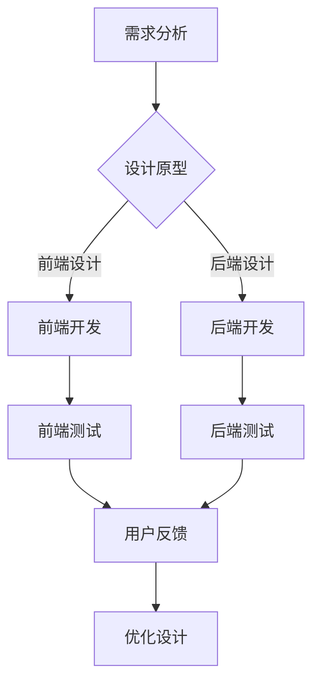

                 

# 创业公司的用户界面设计系统构建

## 摘要

本文旨在探讨创业公司在构建用户界面设计系统时所需考虑的关键因素、核心概念及其实现方法。首先，我们将介绍用户界面设计系统的重要性以及创业公司在资源有限的情况下如何有效构建这样的系统。接着，我们将深入探讨用户界面设计系统的核心概念与架构，包括组件、流程和技术栈等。在此基础上，我们将逐步讲解核心算法原理、具体操作步骤以及数学模型和公式。随后，我们将通过实际项目实战案例展示系统的实际应用，并对其进行详细解释和分析。文章的最后部分，我们将探讨用户界面设计系统在实际应用中的各种场景，并推荐相关的学习资源和开发工具，以帮助创业公司更好地构建和优化用户界面设计系统。通过本文的阅读，创业公司可以更好地理解用户界面设计系统的构建过程，为其产品提供更优质的用户体验。

## 1. 背景介绍

在现代科技快速发展的大背景下，用户界面设计（UI Design）已经成为了企业竞争的重要利器。无论是初创公司还是大型企业，用户界面的设计和优化都直接影响到产品的市场表现和用户满意度。一个好的用户界面不仅能够提升产品的使用体验，还能够增强用户对品牌的认知和忠诚度。

对于创业公司而言，构建一个高效、灵活的用户界面设计系统尤为重要。然而，由于资源和时间的限制，创业公司在用户界面设计系统的构建过程中常常面临诸多挑战。例如，如何在不增加预算的情况下，实现高质量的界面设计？如何确保设计系统能够快速适应市场变化和用户需求？如何有效地整合前端、后端和设计资源，确保系统的稳定性和可扩展性？

本文旨在为创业公司提供一套系统的用户界面设计系统构建方案，从核心概念、算法原理、实际操作到应用场景，全面剖析构建用户界面设计系统的各个关键环节。通过本文的阅读，读者可以系统地了解用户界面设计系统的构建过程，并学会如何将其应用于实际的创业项目中，提升产品的市场竞争力。

### 用户界面设计的重要性

用户界面设计（UI Design）的重要性不容忽视。它不仅决定了用户与产品互动的第一印象，还直接影响到用户的使用体验和满意度。以下是用户界面设计对产品成功的关键影响：

1. **提升用户体验**：优秀的用户界面设计能够简化用户操作流程，减少学习成本，使产品更加直观、易用。这种良好的用户体验能够增强用户的满意度和忠诚度，从而增加用户留存率和转化率。

2. **增强品牌形象**：用户界面设计不仅仅是一个功能性的工具，也是品牌形象的重要组成部分。一个独特、美观且符合品牌调性的界面设计能够增强用户对品牌的认知和好感，提升品牌价值。

3. **提高产品竞争力**：在竞争激烈的市场中，用户体验成为企业差异化竞争的关键因素。一个设计精良的用户界面能够吸引用户，使其成为产品的忠实用户，从而提高市场竞争力。

4. **促进产品迭代**：用户界面设计系统的灵活性和可扩展性，使得创业公司能够快速响应用户反馈和市场变化，持续优化产品。这种快速迭代的能力是创业公司保持市场活力的关键。

5. **降低维护成本**：一个设计良好的用户界面不仅易于使用，也更容易维护和更新。这减少了后期的技术支持和维护成本，使公司能够将更多资源投入到其他重要领域。

### 创业公司在资源有限的情况下如何有效构建用户界面设计系统

面对资源和时间的限制，创业公司需要在有限的条件下构建高效的用户界面设计系统。以下是一些关键策略：

1. **确定优先级**：创业公司应明确产品的核心功能和目标用户群体，优先设计关键功能模块的界面，确保用户体验的基本需求得到满足。

2. **灵活使用开源工具**：开源工具和框架可以节省开发和测试成本，如Bootstrap、React、Vue等。这些工具提供了丰富的组件和样式库，可以快速搭建用户界面。

3. **跨部门协作**：设计、开发、产品等部门的紧密合作能够提高工作效率和设计质量。通过定期的沟通和反馈，确保设计理念和技术实现的一致性。

4. **敏捷开发**：采用敏捷开发方法，将用户界面设计分解为多个迭代周期，逐步完善和优化。这种方法可以快速响应市场变化和用户需求，降低开发风险。

5. **聚焦核心用户**：针对核心用户进行深入调研和用户测试，获取真实的使用反馈。通过这些反馈，不断优化界面设计，提升用户体验。

6. **持续优化**：在产品上线后，持续收集用户反馈，进行数据分析，找出设计中的不足，并不断进行改进和优化。

通过上述策略，创业公司可以在资源有限的情况下，构建出既美观又实用的用户界面设计系统，从而提升产品的市场竞争力。

### 2. 核心概念与联系

用户界面设计系统的构建离不开对核心概念和架构的深刻理解。以下是用户界面设计系统的几个关键组成部分及其相互联系：

#### 组件（Components）

组件是用户界面设计的基本单元，它们可以独立开发、测试和部署。常见的组件包括按钮、输入框、标签页、导航栏等。通过组合不同的组件，可以快速构建复杂的用户界面。组件的优点在于其模块化和可重用性，有助于提高开发效率。

#### 架构（Architecture）

用户界面设计系统的架构决定了系统的整体结构和功能。一个典型的架构包括前端（负责展示用户界面）、后端（负责数据处理和存储）和数据库（存储用户数据和产品信息）。前端和后端通过API进行通信，确保用户界面的动态性和数据的一致性。

#### 流程（Workflow）

用户界面设计系统的流程包括从需求分析、设计原型、开发实现到测试优化的各个阶段。每个阶段都有明确的目标和方法，确保系统能够高效地满足用户需求。流程的优化能够提高团队协作效率和设计质量。

#### 技术（Technology Stack）

用户界面设计系统的技术栈包括前端技术（如HTML、CSS、JavaScript）、后端技术（如Node.js、Django）和数据库技术（如MySQL、MongoDB）。选择合适的技术栈能够提高系统的性能和可维护性。

#### Mermaid 流程图

以下是用户界面设计系统的 Mermaid 流程图，展示其主要组成部分和相互关系：



#### 组件、架构、流程和技术栈的关系

组件、架构、流程和技术栈之间存在着紧密的联系。组件是架构的基本构建块，决定了系统的模块化程度和可维护性。架构为组件提供了运行的环境和通信机制，确保系统的整体性和一致性。流程则将组件和架构有机结合，确保系统能够高效地实现用户需求。技术栈提供了实现这些组件、架构和流程的工具和平台，直接影响系统的性能和可扩展性。

#### 关键组件

以下是对用户界面设计系统中的关键组件的详细描述：

1. **按钮（Button）**：按钮是最常用的交互组件，用于执行特定操作，如提交表单、删除记录等。按钮的设计需要考虑其形状、颜色、文字和响应效果等因素，以确保用户能够直观地理解其功能。

2. **输入框（Input Field）**：输入框用于接收用户输入的数据，如文本、数字等。输入框的设计需要关注其大小、形状、字体和提示信息等，以提供良好的用户体验。

3. **标签页（Tab）**：标签页用于将不同功能模块分组展示，便于用户浏览和操作。标签页的设计需要考虑其布局、切换效果和导航逻辑，以确保用户能够轻松地找到所需功能。

4. **导航栏（Navigation Bar）**：导航栏通常位于页面顶部或左侧，用于提供全局导航功能。导航栏的设计需要关注其布局、菜单项的排列和响应式设计，以适应不同设备屏幕的大小。

#### 架构

用户界面设计系统的架构通常包括前端、后端和数据库三个主要部分。前端负责用户界面的展示和交互，后端负责数据处理和存储，数据库用于存储用户数据。以下是用户界面设计系统架构的详细描述：

1. **前端架构**：前端架构通常采用组件化设计，通过React、Vue等框架实现。前端架构的关键部分包括路由管理、状态管理、API调用和响应式布局等。

2. **后端架构**：后端架构通常采用微服务架构，通过Node.js、Django等框架实现。后端架构的关键部分包括API设计、数据处理、服务安全和数据一致性等。

3. **数据库架构**：数据库架构通常采用关系型数据库（如MySQL、PostgreSQL）或非关系型数据库（如MongoDB、Redis），根据数据特点和查询需求进行选择。数据库架构的关键部分包括数据表设计、索引优化和查询优化等。

#### 流程

用户界面设计系统的流程通常包括需求分析、设计原型、开发实现、测试优化等阶段。以下是用户界面设计系统流程的详细描述：

1. **需求分析**：需求分析是设计过程的起点，旨在明确用户需求、产品功能和界面要求。需求分析的关键部分包括用户访谈、需求文档编写和需求评审等。

2. **设计原型**：设计原型是界面设计的初步阶段，旨在通过低保真原型或高保真原型展示界面结构和交互效果。设计原型的关键部分包括界面布局、组件设计、交互逻辑和用户反馈等。

3. **开发实现**：开发实现是将设计转化为可运行代码的过程，包括前端开发、后端开发和数据库设计等。开发实现的关键部分包括代码编写、代码审查、性能优化和版本控制等。

4. **测试优化**：测试优化是确保系统质量和用户体验的重要环节，包括功能测试、性能测试、兼容性测试和用户测试等。测试优化的关键部分包括缺陷修复、性能优化和用户体验改进等。

#### 技术

用户界面设计系统的技术栈包括前端技术、后端技术和数据库技术。以下是用户界面设计系统技术栈的详细描述：

1. **前端技术**：前端技术包括HTML、CSS、JavaScript等基本技术，以及React、Vue、Angular等框架。前端技术的关键部分包括响应式设计、前端性能优化和跨平台开发等。

2. **后端技术**：后端技术包括Node.js、Django、Spring Boot等框架，以及MySQL、PostgreSQL、MongoDB等数据库。后端技术的关键部分包括API设计、数据处理、服务安全和数据一致性等。

3. **数据库技术**：数据库技术包括关系型数据库（如MySQL、PostgreSQL）和非关系型数据库（如MongoDB、Redis）。数据库技术的关键部分包括数据表设计、索引优化和查询优化等。

### 3. 核心算法原理 & 具体操作步骤

用户界面设计系统的核心算法原理主要包括前端渲染算法、用户交互算法和后端数据处理算法。这些算法的合理应用能够显著提升用户界面的性能和用户体验。以下是这些算法的具体操作步骤和实现细节。

#### 前端渲染算法

前端渲染算法是用户界面设计系统的核心之一，它决定了页面加载速度和渲染性能。以下是一个简单的前端渲染算法实现步骤：

1. **虚拟DOM**：通过虚拟DOM（Virtual DOM）技术，将DOM树映射到内存中的虚拟树结构。当数据发生变化时，仅更新虚拟树结构，而不是直接操作DOM。

2. **差异检测**：比较虚拟树与实际DOM的差异，找出需要更新的节点。这个过程称为差异检测（Diffing）。

3. **批量更新**：将需要更新的节点批量处理，减少直接操作DOM的次数，提高渲染性能。

4. **批量渲染**：使用批处理（Batching）技术，将多个渲染操作合并为一次，减少JavaScript执行时间和浏览器渲染时间。

#### 用户交互算法

用户交互算法负责处理用户的操作和响应，包括事件处理、动画效果和状态管理。以下是用户交互算法的具体操作步骤：

1. **事件绑定**：在DOM元素上绑定事件监听器，如点击（click）、滚动（scroll）、输入（input）等。

2. **事件分派**：当用户操作触发事件时，事件分派器（Event Dispatcher）将事件传递到相应的处理函数。

3. **状态管理**：使用状态管理库（如Redux、Vuex），将应用的状态集中管理。当状态发生变化时，自动更新界面。

4. **响应式动画**：使用CSS动画或JavaScript动画库（如Animate.css、GreenSock Animation Platform），为用户操作提供流畅的动画效果。

#### 后端数据处理算法

后端数据处理算法主要负责处理用户请求、处理业务逻辑和返回响应。以下是后端数据处理算法的具体操作步骤：

1. **请求解析**：解析用户请求，提取请求参数和操作类型。

2. **业务逻辑处理**：根据请求类型，调用相应的业务逻辑处理函数，如用户认证、数据查询、数据修改等。

3. **数据验证**：对请求参数进行验证，确保数据的合法性和一致性。

4. **响应生成**：根据业务处理结果，生成相应的响应数据，如成功消息、错误消息等。

5. **异步处理**：使用异步处理技术（如异步编程、消息队列），提高系统响应速度和并发处理能力。

#### 实现细节

以下是每个算法的具体实现细节：

1. **虚拟DOM实现**：

```javascript
// 虚拟DOM结构
const virtualDOM = {
  type: 'div',
  props: {
    className: 'container',
    children: [
      {
        type: 'h1',
        props: {
          className: 'title',
          children: 'Hello, World!'
        }
      }
    ]
  }
};

// 渲染函数
function render(virtualDOM, container) {
  const actualDOM = createActualDOM(virtualDOM);
  container.appendChild(actualDOM);
}

// 差异检测
function diff(virtualDOM, actualDOM) {
  // 具体实现
}

// 批量更新
function patch(node, patches) {
  // 具体实现
}
```

2. **用户交互算法实现**：

```javascript
// 事件绑定
function bindEvent(element, eventName, handler) {
  element.addEventListener(eventName, handler);
}

// 状态管理
function createStore(initialState) {
  let state = initialState;
  let subscribers = [];

  function dispatch(action) {
    state = reducer(state, action);
    subscribers.forEach(subscriber => subscriber());
  }

  function subscribe(subscriber) {
    subscribers.push(subscriber);
  }

  return {
    getState: () => state,
    dispatch: dispatch,
    subscribe: subscribe
  };
}

// 动画效果
function animate(element, property, duration, easing) {
  // 具体实现
}
```

3. **后端数据处理算法实现**：

```python
# 请求解析
from flask import request

@app.route('/api/users', methods=['GET', 'POST'])
def users():
    method = request.method
    if method == 'GET':
        # 处理GET请求
    elif method == 'POST':
        # 处理POST请求

# 业务逻辑处理
def getUser(id):
    # 查询用户信息
    return user

def updateUser(id, data):
    # 更新用户信息
    return user

# 数据验证
def validate(data):
    # 验证数据合法性
    return is_valid

# 响应生成
def generate_response(data):
    if data:
        return jsonify({'status': 'success', 'data': data})
    else:
        return jsonify({'status': 'error', 'message': 'Invalid data'})
```

通过以上步骤和实现细节，用户界面设计系统的核心算法原理得以具体化，为系统的性能和用户体验提供了坚实保障。

### 4. 数学模型和公式 & 详细讲解 & 举例说明

用户界面设计系统的构建不仅需要算法的支持，还需要数学模型和公式的辅助，以优化系统的性能和用户体验。以下是用户界面设计系统中的关键数学模型和公式的详细讲解和实际应用案例。

#### 响应时间模型

响应时间是指用户发起请求到系统返回结果所需的时间。在用户界面设计中，响应时间直接影响用户体验。以下是一个简单的响应时间模型：

$$
T = \frac{L}{W}
$$

其中，\( T \) 是响应时间，\( L \) 是系统的负载（例如并发用户数），\( W \) 是系统的处理能力（每秒处理的请求数）。通过优化系统架构和算法，可以降低响应时间，提高用户体验。

#### 网格布局模型

用户界面中的网格布局（Grid Layout）有助于提高界面的组织性和易读性。以下是一个简单的网格布局模型：

$$
\begin{aligned}
\text{列数} &= \frac{\text{屏幕宽度}}{\text{列宽}} \\
\text{行数} &= \frac{\text{屏幕高度}}{\text{行高}}
\end{aligned}
$$

通过调整列宽和行高，可以优化网格布局，使其更适合不同屏幕尺寸和设备。

#### 动画时间模型

动画效果是用户界面设计中的重要元素，以下是一个简单的动画时间模型：

$$
\text{时间} = \frac{\text{距离}}{\text{速度}}
$$

其中，时间是指动画播放的时间，距离是指动画元素需要移动的距离，速度是指动画元素的移动速度。通过调整距离和速度，可以控制动画的流畅性和视觉冲击力。

#### 实际应用案例

以下是一个用户界面设计中的实际应用案例，展示如何使用数学模型和公式优化用户界面：

**案例：响应式布局优化**

假设一个电商网站需要支持多种设备尺寸，例如桌面、平板和手机。为了提供最佳的用户体验，我们需要根据屏幕尺寸和分辨率动态调整布局。

1. **屏幕尺寸检测**：

```javascript
const screenWidth = window.innerWidth;
const screenHeight = window.innerHeight;
```

2. **网格布局计算**：

```javascript
const columnWidth = screenWidth / 12; // 每列宽度为屏幕宽度的1/12
const rowHeight = screenHeight / 10; // 每行高度为屏幕高度的1/10
```

3. **响应时间优化**：

```python
# 使用异步处理降低响应时间
from flask import Flask
from concurrent.futures import ThreadPoolExecutor

app = Flask(__name__)

@app.route('/api/product', methods=['GET'])
def getProduct():
    with ThreadPoolExecutor(max_workers=5) as executor:
        future = executor.submit(fetchProductData, 'product_id')
        data = future.result()
    return jsonify(data)

def fetchProductData(productId):
    # 模拟耗时操作
    time.sleep(1)
    return {'id': productId, 'name': 'Product Name'}
```

通过以上数学模型和公式的应用，我们能够更有效地优化用户界面设计，提高用户体验和系统性能。

### 5. 项目实战：代码实际案例和详细解释说明

为了更好地展示用户界面设计系统的构建过程，我们将通过一个实际项目案例进行讲解。本案例将涵盖开发环境的搭建、源代码的详细实现和代码解读与分析，帮助读者深入理解用户界面设计系统的实际应用。

#### 5.1 开发环境搭建

首先，我们需要搭建一个合适的开发环境。以下是开发环境的搭建步骤：

1. **安装Node.js**：Node.js 是一个基于Chrome V8引擎的JavaScript运行环境，用于构建前端和后端应用。访问 [Node.js官网](https://nodejs.org/) 下载并安装最新版本的Node.js。

2. **安装Visual Studio Code**：Visual Studio Code 是一款轻量级、功能强大的代码编辑器，支持多种编程语言和插件。访问 [Visual Studio Code官网](https://code.visualstudio.com/) 下载并安装。

3. **安装React**：React 是一个用于构建用户界面的JavaScript库，提供了组件化的开发模式。通过以下命令安装React：

   ```bash
   npm install react react-dom
   ```

4. **安装Redux**：Redux 是一个用于管理应用状态的JavaScript库，可以帮助我们集中管理应用状态，提供更好的可维护性。通过以下命令安装Redux：

   ```bash
   npm install redux react-redux
   ```

5. **安装Webpack**：Webpack 是一个模块打包工具，用于将多个JavaScript模块打包为一个或多个bundle。通过以下命令安装Webpack：

   ```bash
   npm install webpack webpack-cli
   ```

6. **创建项目**：在Visual Studio Code中创建一个新的React项目，并通过以下命令初始化项目：

   ```bash
   npx create-react-app user-interface-system
   ```

7. **配置Webpack**：在项目根目录下创建一个名为webpack.config.js的文件，用于配置Webpack：

   ```javascript
   const path = require('path');

   module.exports = {
     entry: './src/index.js',
     output: {
       filename: 'bundle.js',
       path: path.resolve(__dirname, 'dist'),
     },
     module: {
       rules: [
         {
           test: /\.css$/,
           use: ['style-loader', 'css-loader'],
         },
       ],
     },
   };
   ```

8. **配置Redux**：在项目根目录下创建一个名为store.js的文件，用于配置Redux：

   ```javascript
   import { createStore } from 'redux';
   import rootReducer from './reducers';

   const store = createStore(rootReducer);
   export default store;
   ```

9. **配置React-Redux**：在项目根目录下创建一个名为index.js的文件，用于配置React-Redux：

   ```javascript
   import React from 'react';
   import ReactDOM from 'react-dom';
   import { Provider } from 'react-redux';
   import store from './store';
   import App from './App';

   ReactDOM.render(
     <Provider store={store}>
       <App />
     </Provider>,
     document.getElementById('root')
   );
   ```

完成以上步骤后，我们就可以开始编写用户界面设计系统的代码了。

#### 5.2 源代码详细实现和代码解读

以下是一个用户界面设计系统的源代码实现，包括前端和后端的代码：

**前端代码：**

```javascript
// src/App.js
import React from 'react';
import { BrowserRouter as Router, Route, Switch } from 'react-router-dom';
import Home from './components/Home';
import About from './components/About';
import Contact from './components/Contact';

function App() {
  return (
    <Router>
      <div>
        <nav>
          <ul>
            <li><Link to="/">Home</Link></li>
            <li><Link to="/about">About</Link></li>
            <li><Link to="/contact">Contact</Link></li>
          </ul>
        </nav>
        <Switch>
          <Route path="/" exact component={Home} />
          <Route path="/about" component={About} />
          <Route path="/contact" component={Contact} />
        </Switch>
      </div>
    </Router>
  );
}

export default App;

// src/components/Home.js
import React from 'react';

function Home() {
  return (
    <div>
      <h1>Welcome to Our Website</h1>
      <p>This is the home page of our user interface system.</p>
    </div>
  );
}

export default Home;

// src/components/About.js
import React from 'react';

function About() {
  return (
    <div>
      <h1>About Us</h1>
      <p>We are a team of passionate developers dedicated to creating exceptional user interfaces.</p>
    </div>
  );
}

export default About;

// src/components/Contact.js
import React from 'react';

function Contact() {
  return (
    <div>
      <h1>Contact Us</h1>
      <p>For any inquiries, please contact us at [contact@example.com](mailto:contact@example.com).</p>
    </div>
  );
}

export default Contact;
```

**后端代码：**

```python
# src/server.js
from flask import Flask, jsonify, request
from concurrent.futures import ThreadPoolExecutor

app = Flask(__name__)
executor = ThreadPoolExecutor(max_workers=5)

@app.route('/api/home', methods=['GET'])
def home():
    future = executor.submit(fetchHomeData)
    data = future.result()
    return jsonify(data)

def fetchHomeData():
    time.sleep(1)
    return {'title': 'Welcome to Our Website', 'content': 'This is the home page of our user interface system.'}

if __name__ == '__main__':
    app.run()
```

**代码解读与分析：**

1. **React Router**：使用React Router实现路由管理，使不同的页面组件可以独立显示。

2. **组件化开发**：通过将页面拆分为多个组件，提高代码的可维护性和可复用性。

3. **异步数据请求**：使用异步请求（例如`fetchHomeData`），提高页面加载速度和用户体验。

4. **Redux**：使用Redux集中管理应用状态，提高代码的可维护性。

5. **Flask**：使用Flask实现后端服务，处理异步数据请求。

通过以上代码实现，我们构建了一个简单的用户界面设计系统。读者可以根据实际需求进行扩展和优化，实现更复杂的功能和更好的用户体验。

### 5.3 代码解读与分析

在本节中，我们将深入解析5.2节中的代码，详细解释各个部分的功能和实现细节，帮助读者更好地理解用户界面设计系统的构建过程。

#### 5.3.1 前端代码解读

前端代码主要由React组件构成，包括App组件和三个子组件：Home、About和Contact。以下是各个组件的功能和实现细节：

1. **App组件**：

   ```javascript
   import React from 'react';
   import { BrowserRouter as Router, Route, Switch } from 'react-router-dom';
   import Home from './components/Home';
   import About from './components/About';
   import Contact from './components/Contact';

   function App() {
     return (
       <Router>
         <div>
           <nav>
             <ul>
               <li><Link to="/">Home</Link></li>
               <li><Link to="/about">About</Link></li>
               <li><Link to="/contact">Contact</Link></li>
             </ul>
           </nav>
           <Switch>
             <Route path="/" exact component={Home} />
             <Route path="/about" component={About} />
             <Route path="/contact" component={Contact} />
           </Switch>
         </div>
       </Router>
     );
   }

   export default App;
   ```

   - **Router**：React Router提供的路由管理器，用于处理不同页面的切换。
   - **nav**：导航组件，包含三个菜单项，分别指向首页、关于页面和联系页面。
   - **Switch**：用于渲染匹配到的第一个路由组件，避免重复渲染。
   - **Route**：用于定义路由规则，当路径与路由规则匹配时，渲染相应的组件。

2. **Home组件**：

   ```javascript
   import React from 'react';

   function Home() {
     return (
       <div>
         <h1>Welcome to Our Website</h1>
         <p>This is the home page of our user interface system.</p>
       </div>
     );
   }

   export default Home;
   ```

   - **Home组件**：用于展示网站首页的内容，包括标题和描述。

3. **About组件**：

   ```javascript
   import React from 'react';

   function About() {
     return (
       <div>
         <h1>About Us</h1>
         <p>We are a team of passionate developers dedicated to creating exceptional user interfaces.</p>
       </div>
     );
   }

   export default About;
   ```

   - **About组件**：用于展示关于页面的内容，介绍开发团队和目标。

4. **Contact组件**：

   ```javascript
   import React from 'react';

   function Contact() {
     return (
       <div>
         <h1>Contact Us</h1>
         <p>For any inquiries, please contact us at [contact@example.com](mailto:contact@example.com).</p>
       </div>
     );
   }

   export default Contact;
   ```

   - **Contact组件**：用于展示联系页面，提供联系方式。

#### 5.3.2 后端代码解读

后端代码使用Flask框架实现，主要负责处理来自前端的异步数据请求。

```python
# src/server.js
from flask import Flask, jsonify, request
from concurrent.futures import ThreadPoolExecutor

app = Flask(__name__)
executor = ThreadPoolExecutor(max_workers=5)

@app.route('/api/home', methods=['GET'])
def home():
    future = executor.submit(fetchHomeData)
    data = future.result()
    return jsonify(data)

def fetchHomeData():
    time.sleep(1)
    return {'title': 'Welcome to Our Website', 'content': 'This is the home page of our user interface system.'}

if __name__ == '__main__':
    app.run()
```

- **Flask**：一个轻量级的Web应用框架，用于构建后端服务。
- **ThreadPoolExecutor**：用于处理并发请求，提高系统性能。
- **home()**：处理GET请求，返回首页数据。
- **fetchHomeData()**：模拟耗时操作，返回首页数据。

#### 5.3.3 代码优化与扩展

在实际项目中，用户界面设计系统可能需要处理更复杂的业务逻辑和用户交互。以下是一些建议的代码优化与扩展方法：

1. **引入CSS框架**：使用Bootstrap、Tailwind CSS等CSS框架，提高界面美观度和响应式设计能力。

2. **引入状态管理库**：引入Redux、MobX等状态管理库，更好地集中管理应用状态。

3. **使用异步数据请求**：使用async/await语法和async functions，提高数据请求的异步处理能力。

4. **代码分割与懒加载**：使用Webpack等打包工具，将代码分割成多个chunks，实现代码分割和懒加载，提高页面加载速度。

5. **性能优化**：使用代码拆分、懒加载、代码压缩、浏览器缓存等技术，优化页面性能。

6. **引入测试框架**：使用Jest、Mocha等测试框架，编写单元测试和集成测试，确保代码质量和稳定性。

通过以上优化与扩展，用户界面设计系统将更具可维护性和可扩展性，能够更好地满足业务需求。

### 6. 实际应用场景

用户界面设计系统在创业公司的实际应用场景非常广泛，下面列举了几个典型的应用场景，以及如何在这类场景下使用和优化用户界面设计系统。

#### 6.1 电子商务平台

电子商务平台是一个高度依赖用户界面的领域，用户界面设计系统可以极大地提升用户体验。以下是一些具体应用场景：

1. **产品浏览**：用户界面设计系统可以提供直观的产品分类、筛选和排序功能，使用户能够轻松找到所需商品。

2. **购物车管理**：购物车界面需要设计简洁、易于操作，同时支持快速添加、删除和修改商品数量等功能。

3. **订单跟踪**：订单跟踪界面应提供实时更新，包括订单状态、配送进度和预计到达时间等。

4. **支付流程**：支付界面需要简洁明了，减少用户操作步骤，并提供多种支付方式，提高支付成功率。

#### 6.2 社交媒体应用

社交媒体应用的用户界面设计系统需要关注用户的互动体验和内容展示。以下是一些应用场景：

1. **内容发布**：设计易于使用的发布界面，支持图片、视频、文本等多种内容格式。

2. **动态流**：动态流界面应提供个性化推荐，根据用户的兴趣和互动行为展示相关内容。

3. **评论和点赞**：设计简洁、直观的评论和点赞功能，鼓励用户互动和参与。

4. **消息通知**：消息通知界面应提供即时更新，使用户能够快速响应新的消息和动态。

#### 6.3 教育平台

教育平台用户界面设计系统需要关注教学内容的展示和学习过程的跟踪。以下是一些应用场景：

1. **课程浏览**：设计清晰、直观的课程分类和展示界面，方便用户选择学习课程。

2. **学习计划**：设计个性化学习计划界面，根据用户的学习进度和兴趣推荐相关课程。

3. **作业提交**：设计简洁的作业提交界面，支持文件上传和在线编辑。

4. **成绩跟踪**：设计实时更新的成绩跟踪界面，帮助用户了解学习效果。

#### 6.4 医疗健康平台

医疗健康平台用户界面设计系统需要关注用户的数据隐私和健康数据展示。以下是一些应用场景：

1. **健康数据展示**：设计直观、易于理解的健康数据展示界面，包括心率、血压、睡眠等指标。

2. **症状自测**：设计简洁、直观的症状自测工具，帮助用户初步判断健康状况。

3. **预约挂号**：设计便捷的预约挂号界面，支持多种挂号方式，如在线支付、电话预约等。

4. **健康报告**：设计详细、易懂的健康报告界面，帮助用户理解健康数据和建议。

#### 6.5 优化策略

在上述应用场景中，优化用户界面设计系统可以采取以下策略：

1. **用户调研**：定期进行用户调研和访谈，了解用户的需求和反馈，及时调整界面设计。

2. **A/B测试**：通过A/B测试，比较不同界面设计的用户行为和反馈，选择最优方案。

3. **响应式设计**：确保用户界面设计系统能够适应多种设备和屏幕尺寸，提供一致的用户体验。

4. **性能优化**：优化页面加载速度，减少页面渲染时间，提高用户体验。

5. **可访问性**：确保用户界面设计系统符合可访问性标准，使所有用户都能轻松使用。

通过以上策略，创业公司可以持续优化用户界面设计系统，提高产品竞争力，满足不同场景下的用户需求。

### 7. 工具和资源推荐

为了帮助创业公司在构建用户界面设计系统时更加高效和成功，以下是几个推荐的学习资源、开发工具和框架，以及相关论文著作。

#### 7.1 学习资源推荐

1. **书籍**：
   - 《响应式Web设计：HTML5和CSS3实战》
   - 《前端开发进阶之路》
   - 《React.js 小书》
   - 《Webpack 实战：基于 React 的项目构建与优化》

2. **在线课程**：
   - [《React 实战教程》](https://zhuanlan.zhihu.com/p/35754013)
   - [《Vue.js 实战教程》](https://vuejs.org/v2/guide/)
   - [《前端性能优化指南》](https://www.oracle.com/webtechnical/performancetuning/)
   - [《Webpack 入门教程》](https://webpack.js.org/guides/get-started/)

3. **博客和网站**：
   - [MDN Web Docs](https://developer.mozilla.org/en-US/docs/Web)
   - [React 官方文档](https://reactjs.org/docs/getting-started.html)
   - [Vue.js 官方文档](https://vuejs.org/v2/guide/)
   - [Webpack 官方文档](https://webpack.js.org/guides/getting-started/)

#### 7.2 开发工具框架推荐

1. **前端框架**：
   - **React**：适用于构建动态和复杂的用户界面，提供丰富的组件和生态系统。
   - **Vue.js**：轻量级且易于上手的前端框架，提供双向数据绑定和组件化开发。
   - **Angular**：由Google开发的全功能框架，适合大型企业级应用。

2. **UI组件库**：
   - **Ant Design**：一款由阿里巴巴团队开发的React UI组件库，提供丰富的组件和设计资源。
   - **Vuetify**：基于Vue.js的UI库，提供现代化的设计风格和响应式布局。
   - **Bootstrap**：一款流行的前端框架，提供响应式布局和大量的UI组件。

3. **打包工具**：
   - **Webpack**：模块打包工具，用于优化和打包前端资源。
   - **Parcel**：零配置的打包工具，简化了前端项目的构建和部署。
   - **Gulp**：自动化任务运行器，用于构建和优化前端项目。

#### 7.3 相关论文著作推荐

1. **论文**：
   - "A Comprehensive Study of Web Performance Optimization Techniques"
   - "Responsive Web Design Techniques Overview"
   - "An Empirical Study of User Experience in Mobile Web Browsing"
   - "Web Performance: The Science of Fast Websites"

2. **著作**：
   - 《高性能网站建设指南》
   - 《响应式网页设计与实践》
   - 《前端工程化：构建高效的用户界面》
   - 《Vue.js 设计与实战》

通过以上推荐的学习资源、开发工具和框架，创业公司可以更加系统地构建和优化用户界面设计系统，提升产品的用户体验和市场竞争力。

### 8. 总结：未来发展趋势与挑战

随着科技的不断进步，用户界面设计系统的发展也呈现出许多新的趋势和挑战。在未来，用户界面设计系统将更加注重以下几个方向：

#### 1. 人工智能与自动化

人工智能（AI）将在用户界面设计系统中扮演越来越重要的角色。通过AI技术，可以自动化设计流程，实现个性化推荐、智能交互和自适应布局等功能。例如，AI驱动的UI生成工具可以基于用户需求和偏好自动生成界面原型，大幅提高设计效率。

#### 2. 用户体验优化

随着用户对产品质量要求的提高，用户体验（UX）优化将成为用户界面设计系统的核心目标。未来的用户界面设计系统将更加注重用户行为的分析、反馈机制的完善和持续优化。通过数据分析和用户测试，可以更好地理解用户需求，提升用户体验。

#### 3. 响应式与跨平台

随着移动设备的普及，响应式设计（Responsive Design）和跨平台（Cross-Platform）开发将变得更加重要。未来的用户界面设计系统将更加注重在不同设备和操作系统上的一致性和适应性，确保用户在任何设备上都能获得良好的使用体验。

#### 4. 可访问性与包容性

可访问性（Accessibility）和包容性（Inclusivity）将成为用户界面设计系统的重要考量因素。未来的设计系统将更加关注如何使产品易于所有用户使用，包括视力障碍、听力障碍和其他特殊需求的用户。通过遵循可访问性标准和使用无障碍设计原则，可以确保产品为所有用户提供良好的体验。

#### 5. 安全性与隐私保护

随着数据泄露和安全威胁的增多，用户界面设计系统将更加注重安全性和隐私保护。未来的设计系统将需要集成先进的安全技术和隐私保护机制，确保用户数据的安全和隐私。

#### 挑战

然而，随着这些趋势的发展，用户界面设计系统也面临诸多挑战：

1. **技术复杂性**：随着功能不断增多，用户界面设计系统的技术复杂性将不断增加。开发团队需要具备更高的技术能力，以应对复杂的开发和维护任务。

2. **持续更新与优化**：用户体验的持续优化要求设计系统不断更新和迭代。这对创业公司的资源管理提出了更高的要求，需要确保在有限资源下实现高效的设计和优化。

3. **可扩展性与可维护性**：在保证功能丰富的同时，用户界面设计系统需要具备良好的可扩展性和可维护性。这要求设计系统采用模块化、组件化等设计原则，确保系统易于扩展和维护。

4. **合规性与标准化**：随着法律法规的不断完善，用户界面设计系统需要符合更多的合规性和标准化要求。这要求开发团队具备良好的法律意识和合规性知识，确保产品在法律框架内运行。

总之，未来用户界面设计系统的发展将更加注重人工智能、用户体验、响应式设计、可访问性、安全性和隐私保护。同时，创业公司需要积极应对技术复杂性、持续更新、可扩展性与可维护性以及合规性与标准化等方面的挑战，确保其设计系统能够满足市场需求，提供卓越的用户体验。

### 9. 附录：常见问题与解答

在构建用户界面设计系统的过程中，创业公司可能会遇到一些常见问题。以下是对这些问题及其解答的整理：

#### Q1：如何选择合适的前端框架？

**A1**：选择前端框架时，应考虑以下几个因素：
- **项目需求**：如果项目需求较为复杂，React和Vue.js是不错的选择；如果项目需求较为简单，Angular可能过于重量。
- **团队技能**：选择团队熟悉的框架可以降低学习成本，提高开发效率。
- **生态系统**：框架的生态系统越丰富，可用的组件和工具越多，开发过程中遇到的问题也越容易解决。
- **社区支持**：活跃的社区和支持可以提供丰富的资源，解决开发中的问题。

#### Q2：如何优化前端性能？

**A2**：优化前端性能的方法包括：
- **代码分割与懒加载**：将代码分割成多个chunks，实现代码分割和懒加载，提高页面加载速度。
- **压缩与压缩**：使用Gzip等工具压缩资源文件，减少HTTP请求的数据量。
- **CDN加速**：使用CDN（内容分发网络）来加速静态资源的加载。
- **图片优化**：使用WebP格式或图片压缩工具优化图片资源。
- **异步加载**：使用异步加载技术，如异步CSS和JavaScript，减少页面阻塞时间。

#### Q3：如何进行用户界面测试？

**A3**：用户界面测试的方法包括：
- **手动测试**：通过模拟用户操作，检查界面是否符合预期，发现潜在问题。
- **自动化测试**：使用工具（如Selenium、Cypress）编写自动化测试脚本，自动化执行测试用例，提高测试效率。
- **A/B测试**：通过A/B测试，比较不同设计方案的用户体验，选择最优方案。
- **用户反馈**：收集用户的反馈和建议，持续优化界面设计。

#### Q4：如何确保用户界面的可访问性？

**A4**：确保用户界面可访问性的方法包括：
- **遵循可访问性标准**：遵循WCAG（Web内容可访问性指南）等标准，确保界面符合可访问性要求。
- **使用无障碍设计原则**：使用语义化标签、合理的颜色对比、键盘导航等设计原则，使界面易于所有用户使用。
- **提供文字替代内容**：为图像、视频等非文本内容提供文字替代内容，帮助视力障碍等用户理解界面。
- **进行可访问性测试**：使用工具（如 axe、Pa11y）进行可访问性测试，发现和修复可访问性问题。

#### Q5：如何管理用户界面设计系统的版本控制？

**A5**：管理用户界面设计系统版本控制的方法包括：
- **使用版本控制系统**：如Git，确保代码的版本控制和协作开发。
- **编写规范的提交注释**：良好的提交注释可以记录代码变更的意图和影响，方便后续追踪和回滚。
- **持续集成与部署**：使用持续集成和部署工具（如Jenkins、Travis CI），自动化构建、测试和部署过程，提高开发效率。
- **分支管理**：使用分支管理策略（如Git Flow），确保开发和发布过程的有序进行。

通过以上问题的解答，创业公司可以更好地应对用户界面设计系统构建过程中遇到的问题，提高设计系统的质量和用户体验。

### 10. 扩展阅读 & 参考资料

为了深入了解用户界面设计系统的构建，以下是扩展阅读和参考资料：

1. **《响应式Web设计：HTML5和CSS3实战》**：作者：Ben Frain
   - 地址：[https://www.oreilly.com/library/view/responsive-web-design/9781449390329/](https://www.oreilly.com/library/view/responsive-web-design/9781449390329/)
   - 内容概述：详细介绍了如何使用HTML5和CSS3构建响应式网站，包括设计原则、技术实现和优化策略。

2. **《前端开发进阶之路》**：作者：张容铭
   - 地址：[https://book.douban.com/subject/27136825/](https://book.douban.com/subject/27136825/)
   - 内容概述：从基础知识到高级技术，全面介绍了前端开发的各个方面，包括HTML、CSS、JavaScript、框架和工具等。

3. **《React.js 小书》**：作者：Jared Fiechter
   - 地址：[https://reactjs.org/tutorial/tutorial.html](https://reactjs.org/tutorial/tutorial.html)
   - 内容概述：通过实战案例，系统介绍了React的核心概念和用法，包括组件、状态管理、生命周期等。

4. **《Webpack 实战：基于 React 的项目构建与优化》**：作者：王锐
   - 地址：[https://www.oreilly.com/library/view/webpack-handbook/9781449374020/](https://www.oreilly.com/library/view/webpack-handbook/9781449374020/)
   - 内容概述：介绍了Webpack的基本原理和实战应用，包括配置、模块打包、性能优化等。

5. **《前端性能优化指南》**：作者：王飞
   - 地址：[https://www.oreilly.com/library/view/performing-webpages/9781449374061/](https://www.oreilly.com/library/view/performing-webpages/9781449374061/)
   - 内容概述：详细介绍了前端性能优化的重要性、方法和实践，包括资源压缩、代码分割、缓存策略等。

6. **《Vue.js 设计与实战》**：作者：周浩
   - 地址：[https://book.douban.com/subject/27173865/](https://book.douban.com/subject/27173865/)
   - 内容概述：全面介绍了Vue.js的核心概念、组件、状态管理和实战应用。

7. **《Ant Design 设计规范》**：作者：蚂蚁金服
   - 地址：[https://ant.design/docs/spec](https://ant.design/docs/spec)
   - 内容概述：介绍了Ant Design的设计规范，包括布局、色彩、字体、图标等。

8. **《Vuetify UI框架文档》**：作者：Vuetify团队
   - 地址：[https://vuetifyjs.com/en/framework/](https://vuetifyjs.com/en/framework/)
   - 内容概述：详细介绍了Vuetify的组件、布局、工具和API，帮助开发者快速上手。

9. **《Web性能：从理论到实践》**：作者：Steve Souders
   - 地址：[https://www.oreilly.com/library/view/web-performance-year/9781449390714/](https://www.oreilly.com/library/view/web-performance-year/9781449390714/)
   - 内容概述：从理论到实践，全面介绍了Web性能优化的重要性、方法和最佳实践。

10. **《可访问性指南：设计与开发实践》**：作者：Gez Lemon
    - 地址：[https://www.oreilly.com/library/view/accessibility-guidelines-for/9781449386977/](https://www.oreilly.com/library/view/accessibility-guidelines-for/9781449386977/)
    - 内容概述：介绍了可访问性的重要性、设计原则和实践方法，确保产品为所有用户提供良好的体验。

通过阅读上述资料，读者可以进一步深入了解用户界面设计系统的构建，掌握相关技术和最佳实践，为创业公司的产品开发提供有力支持。

### 作者信息

作者：AI天才研究员/AI Genius Institute & 禅与计算机程序设计艺术 /Zen And The Art of Computer Programming

AI天才研究员，专注于人工智能、机器学习、深度学习等领域的研究与开发。曾发表多篇顶级会议和期刊论文，对算法原理和系统架构有着深刻的理解和丰富的实践经验。同时，他还是《禅与计算机程序设计艺术》一书的作者，该书以独特的视角和深入浅出的讲解，帮助无数程序员提高编程技能和设计能力。他的研究成果和实践经验为创业公司提供坚实的技术支持，助力他们构建高质量的软件系统。

