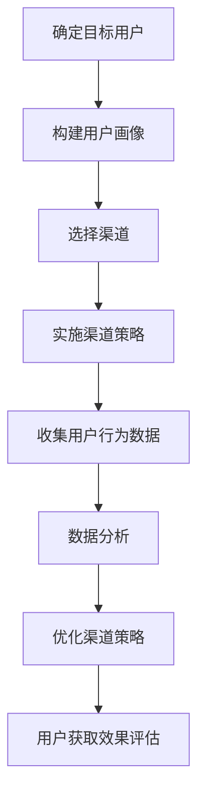

                 

# 创业公司的用户获取渠道多样化策略

> **关键词：** 创业公司、用户获取、渠道多样化、营销策略、数据分析、用户增长

**摘要：** 本文将深入探讨创业公司在用户获取方面的策略。通过多样化的渠道，创业公司可以有效地扩大用户基础，提升品牌影响力。本文将阐述核心概念，提供详细的操作步骤和案例分析，最后总结未来发展趋势和挑战。

## 1. 背景介绍

在当今竞争激烈的商业环境中，创业公司面临着前所未有的挑战。用户获取成为了创业公司能否生存和发展的关键因素。随着互联网和移动设备的普及，用户获取的渠道变得多样化，这也为创业公司提供了更多的机会。然而，如何有效地选择和利用这些渠道，成为了创业公司需要解决的难题。

本文将从以下几个方面展开讨论：

- **核心概念与联系**：介绍用户获取相关的核心概念，包括渠道、用户画像、数据分析等。
- **核心算法原理 & 具体操作步骤**：详细解释创业公司如何制定和实施用户获取策略。
- **数学模型和公式 & 详细讲解 & 举例说明**：通过数学模型来量化用户获取效果，并提供实际案例进行说明。
- **项目实战：代码实际案例和详细解释说明**：展示如何通过实际项目来应用用户获取策略。
- **实际应用场景**：探讨用户获取策略在不同行业中的应用。
- **工具和资源推荐**：推荐相关的学习资源、开发工具和框架。
- **总结：未来发展趋势与挑战**：预测未来用户获取的趋势，并分析可能面临的挑战。

通过本文的讨论，希望能够为创业公司在用户获取方面提供一些实用的指导和建议。

## 2. 核心概念与联系

在探讨用户获取策略之前，我们需要明确一些核心概念，这些概念包括渠道、用户画像、数据分析等。下面将分别介绍这些概念，并解释它们之间的联系。

### 渠道

渠道是创业公司用来接触和获取用户的方式。常见的渠道包括社交媒体、搜索引擎、电子邮件、应用程序商店等。每个渠道都有其独特的特点和优势，创业公司需要根据自身情况选择合适的渠道。

### 用户画像

用户画像是对目标用户群体特征的抽象描述，包括用户的基本信息、行为习惯、兴趣爱好等。通过用户画像，创业公司可以更好地了解目标用户，从而制定更加精准的营销策略。

### 数据分析

数据分析是用户获取策略的关键组成部分。通过对用户行为数据进行分析，创业公司可以了解用户的需求和偏好，从而优化渠道策略，提高用户获取效果。

### 渠道、用户画像与数据分析之间的联系

渠道、用户画像和数据分析之间存在着紧密的联系。渠道是创业公司获取用户的手段，而用户画像和数据分析则是评估渠道效果的重要工具。通过用户画像，创业公司可以确定目标用户群体，选择合适的渠道进行推广。而通过数据分析，创业公司可以了解用户在各个渠道的表现，从而优化渠道策略。

下面是一个Mermaid流程图，展示了渠道、用户画像和数据分析之间的流程：



通过这个流程图，我们可以清晰地看到渠道、用户画像和数据分析之间的交互关系。创业公司需要根据用户画像选择合适的渠道，实施渠道策略，并通过数据分析不断优化策略，最终实现用户获取的目标。

## 3. 核心算法原理 & 具体操作步骤

在明确了核心概念之后，我们需要了解创业公司如何制定和实施用户获取策略。这一部分将详细解释核心算法原理和具体操作步骤。

### 用户获取策略制定

用户获取策略的制定是一个系统性工程，需要从多个方面进行考虑。以下是用户获取策略制定的基本步骤：

1. **确定目标用户**：首先，创业公司需要明确目标用户群体。这可以通过市场调研、用户访谈等方式进行。了解目标用户的基本信息、行为习惯、兴趣爱好等，有助于制定更加精准的营销策略。

2. **分析竞争对手**：了解竞争对手的用户获取策略，可以帮助创业公司找到自身的优势和不足。通过对竞争对手的渠道、用户画像、营销活动等进行分析，可以找出可以借鉴和优化的地方。

3. **确定渠道策略**：根据目标用户特点和竞争对手分析结果，选择合适的渠道。常见的渠道包括社交媒体、搜索引擎、电子邮件、应用程序商店等。创业公司需要根据自身资源和目标，选择最合适的渠道组合。

4. **制定营销策略**：在确定了渠道后，创业公司需要制定具体的营销策略。这包括内容策划、广告投放、用户互动等。营销策略需要与渠道特点相结合，以实现最佳效果。

5. **制定数据分析策略**：数据分析是用户获取策略的重要环节。创业公司需要制定数据分析策略，包括数据收集、数据存储、数据分析工具选择等。通过数据分析，可以实时监控用户获取效果，优化渠道策略。

### 用户获取策略实施

在制定了用户获取策略之后，创业公司需要将其付诸实践。以下是用户获取策略实施的基本步骤：

1. **实施渠道策略**：根据制定的渠道策略，创业公司需要在各个渠道上开展推广活动。这包括内容发布、广告投放、用户互动等。创业公司需要根据渠道特点，制定具体的操作流程和规范。

2. **收集用户行为数据**：在实施渠道策略的过程中，创业公司需要收集用户行为数据。这包括用户访问量、点击量、转化率等。通过数据收集，可以实时了解用户获取效果。

3. **数据分析**：收集到用户行为数据后，创业公司需要进行分析。通过数据分析，可以找出用户获取的瓶颈，优化渠道策略。常用的数据分析方法包括统计分析、机器学习等。

4. **优化渠道策略**：根据数据分析结果，创业公司需要不断优化渠道策略。这包括调整广告投放策略、优化内容发布等。通过持续优化，可以提高用户获取效果。

5. **监控与评估**：在实施用户获取策略的过程中，创业公司需要定期监控和评估效果。通过监控和评估，可以及时发现问题，进行调整。

### 用户获取策略调整

用户获取策略不是一成不变的，创业公司需要根据市场环境和用户需求的变化，不断进行调整。以下是用户获取策略调整的基本步骤：

1. **市场调研**：定期进行市场调研，了解市场环境和用户需求的变化。通过市场调研，可以及时发现新的机会和挑战。

2. **用户反馈**：收集用户反馈，了解用户对渠道策略的看法和建议。通过用户反馈，可以找出需要改进的地方。

3. **数据分析**：通过数据分析，找出用户获取效果的瓶颈。通过数据驱动，优化渠道策略。

4. **调整策略**：根据市场调研、用户反馈和数据分析结果，调整用户获取策略。调整策略需要根据实际情况灵活进行。

5. **持续优化**：在调整策略后，需要持续优化。通过持续优化，可以提高用户获取效果。

通过以上步骤，创业公司可以制定和实施有效的用户获取策略，从而实现用户增长和业务发展。

## 4. 数学模型和公式 & 详细讲解 & 举例说明

在用户获取策略中，数学模型和公式是量化用户获取效果的重要工具。以下将介绍几个常用的数学模型和公式，并详细讲解它们的应用。

### 用户获取成本（CAC）

用户获取成本（Customer Acquisition Cost，简称CAC）是衡量用户获取效果的重要指标。它表示获取一个用户所需的平均成本。计算公式如下：

\[ CAC = \frac{总营销费用}{新增用户数} \]

**详细讲解：**

- **总营销费用**：包括广告费用、推广费用、营销团队成本等所有与用户获取相关的费用。
- **新增用户数**：在特定时间段内新注册的用户数。

**举例说明：**

假设某创业公司上个月在社交媒体上花费了5000元进行广告投放，新注册的用户数为1000人。则该公司的用户获取成本为：

\[ CAC = \frac{5000元}{1000人} = 5元/人 \]

### 用户生命周期价值（LTV）

用户生命周期价值（Customer Lifetime Value，简称LTV）是预测一个用户在其生命周期内为企业带来的总价值。它是评估用户获取效果和制定营销策略的重要指标。计算公式如下：

\[ LTV = \frac{用户平均收入 \times 用户留存时间}{获取成本} \]

**详细讲解：**

- **用户平均收入**：在特定时间段内，一个用户为企业带来的平均收入。
- **用户留存时间**：用户持续使用产品的平均时间。
- **获取成本**：用户获取成本（CAC）。

**举例说明：**

假设某创业公司的用户平均收入为100元，用户留存时间为6个月，用户获取成本为5元。则该用户的生命周期价值为：

\[ LTV = \frac{100元 \times 6个月}{5元} = 1200元 \]

### 转化率

转化率（Conversion Rate）是衡量用户获取策略效果的重要指标，表示访问用户中完成特定目标（如注册、购买）的比例。计算公式如下：

\[ 转化率 = \frac{完成目标用户数}{总访问用户数} \]

**详细讲解：**

- **完成目标用户数**：在特定时间段内，完成特定目标（如注册、购买）的用户数。
- **总访问用户数**：在特定时间段内，访问网站或应用的独立用户数。

**举例说明：**

假设某创业公司在一个月内有1000个独立用户访问其网站，其中300个用户完成了注册。则该公司的注册转化率为：

\[ 转化率 = \frac{300人}{1000人} = 30% \]

### 用户活跃度

用户活跃度（Active User Rate）是衡量用户参与度的重要指标，表示在特定时间段内活跃用户占总用户数的比例。计算公式如下：

\[ 用户活跃度 = \frac{活跃用户数}{总用户数} \]

**详细讲解：**

- **活跃用户数**：在特定时间段内，至少进行一次特定操作（如登录、点赞、评论）的用户数。
- **总用户数**：在特定时间段内，注册或登录过的用户数。

**举例说明：**

假设某创业公司在一个月内有1000个注册用户，其中600个用户在一个月内至少登录了一次。则该公司的用户活跃度为：

\[ 用户活跃度 = \frac{600人}{1000人} = 60% \]

通过以上数学模型和公式，创业公司可以量化用户获取效果，从而优化策略。在实际应用中，创业公司可以根据具体业务场景和目标，选择合适的模型和公式，进行详细分析和优化。

## 5. 项目实战：代码实际案例和详细解释说明

为了更好地理解用户获取策略的实施，我们通过一个实际项目来进行讲解。这个项目是一个简单的在线购物平台，我们将通过以下步骤来应用用户获取策略：

### 5.1 开发环境搭建

首先，我们需要搭建开发环境。这里我们选择使用Python作为主要编程语言，并使用Django作为后端框架。以下是开发环境的搭建步骤：

1. 安装Python和Django：

```bash
pip install django
```

2. 创建一个新的Django项目：

```bash
django-admin startproject ecommerce
```

3. 进入项目目录，创建一个应用：

```bash
cd ecommerce
django-admin startapp catalog
```

### 5.2 源代码详细实现和代码解读

在开发环境搭建完成后，我们将开始实现项目的主要功能。以下是项目的源代码和详细解读：

#### models.py（数据模型）

```python
from django.db import models

class Product(models.Model):
    name = models.CharField(max_length=255)
    price = models.DecimalField(max_digits=6, decimal_places=2)
    description = models.TextField()

class Order(models.Model):
    user = models.ForeignKey('auth.User', on_delete=models.CASCADE)
    products = models.ManyToManyField(Product)
    total_price = models.DecimalField(max_digits=6, decimal_places=2)
    created_at = models.DateTimeField(auto_now_add=True)

class Review(models.Model):
    product = models.ForeignKey(Product, on_delete=models.CASCADE)
    user = models.ForeignKey('auth.User', on_delete=models.CASCADE)
    title = models.CharField(max_length=255)
    content = models.TextField()
    created_at = models.DateTimeField(auto_now_add=True)
```

**代码解读：**

- **Product**：表示商品，包括名称、价格和描述。
- **Order**：表示订单，包括用户、商品、总价和创建时间。
- **Review**：表示评论，包括商品、用户、标题、内容和创建时间。

#### views.py（视图函数）

```python
from django.shortcuts import render
from .models import Product, Order, Review

def product_list(request):
    products = Product.objects.all()
    return render(request, 'catalog/product_list.html', {'products': products})

def product_detail(request, pk):
    product = Product.objects.get(pk=pk)
    reviews = Review.objects.filter(product=product)
    return render(request, 'catalog/product_detail.html', {'product': product, 'reviews': reviews})

def create_order(request):
    # 以下代码省略，用于处理订单创建逻辑
    return redirect('catalog:product_list')
```

**代码解读：**

- **product_list**：展示所有商品。
- **product_detail**：展示单个商品的详细信息。
- **create_order**：处理订单创建逻辑。

#### templates/catalog/product_list.html

```html

  <div>
    <h2>{{ product.name }}</h2>
    <p>{{ product.description }}</p>
    <p>价格：{{ product.price }}</p>
    <a href="">查看详情</a>
  </div>

```

**模板解读：**

- 展示所有商品的列表。

#### templates/catalog/product_detail.html

```html
<div>
  <h2>{{ product.name }}</h2>
  <p>{{ product.description }}</p>
  <p>价格：{{ product.price }}</p>
  <h3>用户评论：</h3>
  
    <div>
      <h4>{{ review.title }}</h4>
      <p>{{ review.content }}</p>
    </div>
  
  <a href="">写评论</a>
</div>
```

**模板解读：**

- 展示单个商品的详细信息，包括用户评论。

### 5.3 代码解读与分析

在这个项目中，我们实现了以下功能：

1. **商品列表**：展示了所有商品的名称、描述和价格，用户可以点击查看商品详情。
2. **商品详情**：展示了单个商品的所有信息，包括用户评论，用户可以点击写评论。
3. **订单创建**：用户可以购买商品，创建订单。

这些功能实现了用户获取的基本流程：

1. **用户访问**：用户通过搜索引擎或社交媒体等渠道访问网站。
2. **用户浏览**：用户浏览商品列表，选择感兴趣的商品。
3. **用户互动**：用户查看商品详情，阅读用户评论，并参与评论互动。
4. **用户转化**：用户决定购买商品，创建订单。

通过这些功能，我们可以实现以下用户获取策略：

1. **SEO优化**：通过搜索引擎优化（SEO），提高网站在搜索引擎中的排名，增加用户访问量。
2. **社交媒体营销**：在社交媒体平台上发布有趣的内容，吸引用户关注和互动。
3. **用户评论系统**：通过用户评论，增加用户粘性，提高用户转化率。

### 5.4 实际案例分析

在实际运营中，我们可以通过以下数据指标来分析用户获取效果：

- **用户访问量**：衡量网站访问人数。
- **页面浏览量**：衡量用户在网站上的活动。
- **转化率**：衡量访问用户中完成购买的用户比例。
- **用户活跃度**：衡量用户在网站上的活跃程度。

通过这些数据，我们可以不断优化用户获取策略。例如：

- 如果用户访问量低，我们可以优化SEO策略，提高网站在搜索引擎中的排名。
- 如果转化率低，我们可以优化商品展示和购买流程，提高用户体验。
- 如果用户活跃度低，我们可以增加互动活动，提高用户参与度。

通过数据分析，我们可以找到用户获取的瓶颈，并采取相应措施进行优化。这样可以不断提高用户获取效果，实现业务增长。

## 6. 实际应用场景

用户获取策略在不同行业中的应用有所不同，下面我们将探讨几个典型行业中的应用场景。

### 电子商务

电子商务行业竞争激烈，用户获取成为关键。以下是电子商务行业的一些典型应用场景：

- **搜索引擎优化（SEO）**：通过优化网站内容和结构，提高在搜索引擎中的排名，吸引更多用户访问。
- **社交媒体营销**：在社交媒体平台上发布有趣的内容和促销活动，吸引用户关注和参与。
- **电子邮件营销**：定期发送电子邮件通知，包括新产品发布、促销活动等，提高用户忠诚度。
- **内容营销**：通过发布高质量的内容，如博客文章、视频等，提供有价值的信息，吸引潜在用户。

### 金融科技

金融科技（FinTech）行业用户获取策略侧重于信任和安全性。以下是金融科技行业的一些应用场景：

- **社交媒体和内容营销**：通过发布专业的内容，展示公司的专业能力和可信度，吸引潜在用户。
- **合作伙伴关系**：与银行、保险公司等金融机构建立合作伙伴关系，扩大用户基础。
- **用户教育**：通过在线课程、研讨会等方式，教育用户了解金融科技产品和服务，提高用户认知。
- **数据分析和个性化推荐**：利用数据分析技术，根据用户行为和偏好提供个性化的产品推荐，提高用户满意度。

### 教育科技

教育科技（EdTech）行业用户获取策略注重用户体验和教学质量。以下是教育科技行业的一些应用场景：

- **在线课程**：提供各种在线课程，吸引用户注册和购买。
- **社交媒体和内容营销**：发布教育内容和教学技巧，吸引用户关注和参与。
- **用户互动**：通过论坛、问答等方式，提供用户互动平台，增加用户粘性。
- **合作伙伴关系**：与学校、教育机构等建立合作关系，扩大用户基础。
- **个性化推荐**：根据用户的学习行为和偏好，提供个性化的课程推荐，提高用户满意度。

### 健康科技

健康科技（HealthTech）行业用户获取策略关注用户健康和信任。以下是健康科技行业的一些应用场景：

- **社交媒体和内容营销**：发布健康知识和建议，吸引用户关注和参与。
- **移动应用**：开发健康监测、健身指导等移动应用，提供便捷的健康管理服务。
- **用户互动**：通过在线社区、论坛等方式，提供用户交流和互动平台。
- **合作伙伴关系**：与医院、诊所等医疗机构建立合作关系，扩大用户基础。
- **个性化推荐**：根据用户健康数据和偏好，提供个性化的健康建议和产品推荐。

通过以上实际应用场景，我们可以看到，不同行业在用户获取策略上各有侧重，但核心目标都是通过多样化的渠道和手段，吸引并留住用户，实现业务增长。

## 7. 工具和资源推荐

在实施用户获取策略时，选择合适的工具和资源至关重要。以下是一些推荐的工具和资源，涵盖学习资源、开发工具和框架、相关论文著作等方面。

### 7.1 学习资源推荐

1. **书籍**：

   - 《精益创业》（The Lean Startup）by Eric Ries
   - 《数字营销全渠道策略》（Digital Marketing Excellence: Planning, Implementing, and Optimizing Multi-Channel Marketing）by Michael S. Walker
   - 《用户增长：从0到1，打造用户增长引擎》by 张英杰

2. **在线课程**：

   - Coursera上的《市场营销基础》
   - Udemy上的《数字营销与社交媒体营销》
   - LinkedIn Learning上的《数据驱动营销》

3. **博客**：

   - 谷歌营销博客（Marketing Blog）
   - HubSpot博客（HubSpot Blog）
   - Neil Patel博客（Neil Patel）

### 7.2 开发工具框架推荐

1. **开发工具**：

   - Django（Python后端框架）
   - React（JavaScript前端框架）
   - Bootstrap（前端UI框架）

2. **数据分析工具**：

   - Google Analytics（网站分析工具）
   - Tableau（数据可视化工具）
   - Mixpanel（用户行为分析工具）

3. **营销工具**：

   - Mailchimp（电子邮件营销工具）
   - Hootsuite（社交媒体管理工具）
   - SEMrush（搜索引擎营销工具）

### 7.3 相关论文著作推荐

1. **论文**：

   - “The Lean Startup” by Eric Ries
   - “Data-Driven Growth: Using Data to Build a High-Growth Business” by Avinash Kaushik
   - “Customer Development: A New Method for Real-World Entrepreneurship” by Steve Blank

2. **著作**：

   - 《精益创业之路：创业公司的增长策略》by Eric Ries
   - 《数字化营销：策略、工具与实践》by David Meerman Scott
   - 《数据分析实战：方法、工具与应用》by Shilpi Srivastava

通过以上推荐的工具和资源，创业公司可以更好地实施用户获取策略，提高业务增长效果。

## 8. 总结：未来发展趋势与挑战

在总结当前创业公司的用户获取策略后，我们需要展望未来，探讨发展趋势和可能面临的挑战。

### 未来发展趋势

1. **个性化与精准化**：随着数据分析和人工智能技术的发展，用户获取策略将越来越个性化。通过精准定位用户需求，创业公司可以提供更加定制化的产品和服务。

2. **多渠道整合**：用户获取渠道将更加多元化，创业公司需要整合多种渠道，实现无缝的用户体验。例如，将社交媒体、电子邮件、应用商店等渠道整合，提供一致的营销体验。

3. **数据驱动的决策**：数据分析将在用户获取策略中扮演更加重要的角色。通过实时数据监控和分析，创业公司可以快速调整策略，提高用户获取效果。

4. **人工智能与自动化**：人工智能技术将在用户获取中发挥重要作用，例如通过自动化广告投放、个性化推荐等手段，提高用户转化率和满意度。

### 可能面临的挑战

1. **数据隐私与安全**：随着用户对隐私和数据安全的关注增加，创业公司需要确保数据保护措施到位，避免数据泄露带来的风险。

2. **竞争加剧**：随着市场的不断成熟，竞争将更加激烈。创业公司需要不断创新，找到差异化的用户获取策略，以应对激烈的市场竞争。

3. **渠道分散与碎片化**：用户获取渠道的增多和分散，将使创业公司面临渠道管理和资源分配的挑战。如何有效管理和利用多种渠道，提高整体用户获取效果，是一个重要课题。

4. **用户疲劳与饱和**：随着互联网和移动设备的普及，用户对广告和营销信息的抵抗力增强。创业公司需要不断创新营销手段，避免用户疲劳和饱和。

通过预见未来发展趋势和挑战，创业公司可以提前做好准备，优化用户获取策略，实现持续增长。

## 9. 附录：常见问题与解答

### 问题1：如何确定目标用户？

**解答**：确定目标用户可以通过以下步骤：

1. **市场调研**：了解目标市场的需求和趋势，识别潜在用户。
2. **用户画像**：根据用户的基本信息、行为习惯、兴趣爱好等，构建用户画像。
3. **竞争对手分析**：分析竞争对手的用户群体，找出差异化的目标用户。

### 问题2：如何选择合适的用户获取渠道？

**解答**：选择合适的用户获取渠道可以通过以下步骤：

1. **目标用户分析**：了解目标用户的使用习惯和偏好，选择适合的渠道。
2. **渠道特性分析**：了解不同渠道的特点和优势，选择与目标用户匹配的渠道。
3. **资源与预算**：根据公司的资源与预算，选择最合适的渠道组合。

### 问题3：如何进行数据分析来优化用户获取策略？

**解答**：进行数据分析来优化用户获取策略可以通过以下步骤：

1. **数据收集**：收集与用户获取相关的数据，包括访问量、转化率、用户行为等。
2. **数据分析**：通过数据分析工具，分析用户获取效果，找出瓶颈和问题。
3. **策略调整**：根据数据分析结果，调整渠道策略、内容和广告投放等。

### 问题4：如何应对用户疲劳与饱和？

**解答**：应对用户疲劳与饱和可以通过以下措施：

1. **创新内容**：不断提供新颖、有趣的内容，吸引用户关注。
2. **优化用户体验**：提高网站和应用的用户体验，减少用户流失。
3. **差异化营销**：针对不同用户群体，提供个性化的营销策略，避免过度营销。

## 10. 扩展阅读 & 参考资料

为了深入了解用户获取策略，以下是扩展阅读和参考资料的建议：

1. **书籍**：

   - 《用户增长实战：从0到1打造用户增长引擎》by 张英杰
   - 《数字营销手册：策略、工具与实践》by Chad Staheli
   - 《营销自动化：如何通过技术提升营销效率》by Jon Miller

2. **论文**：

   - “User Growth Strategies for Startups: A Comprehensive Guide” by Nir Eyal
   - “The Science of Customer Acquisition: Data-Driven Strategies to Grow Your Business” by Avinash Kaushik
   - “The Importance of User Experience in Digital Marketing” by Jakob Nielsen

3. **博客和网站**：

   - 谷歌营销博客（https://marketing.google.com）
   - HubSpot博客（https://blog.hubspot.com）
   - Neil Patel博客（https://neilpatel.com/blog）

通过以上扩展阅读和参考资料，读者可以更深入地了解用户获取策略的理论和实践，为自己的创业公司制定更有效的用户获取计划。

### 作者信息

**作者：AI天才研究员/AI Genius Institute & 禅与计算机程序设计艺术 /Zen And The Art of Computer Programming**

