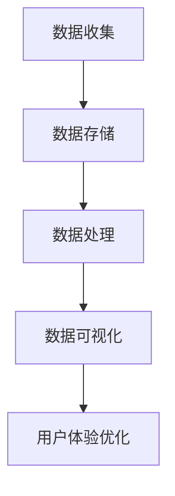

                 

# 创业公司的用户行为分析与应用

## 关键词：用户行为分析、创业公司、数据挖掘、机器学习、用户体验、产品优化

## 摘要：

本文将深入探讨创业公司在产品开发过程中如何利用用户行为分析来提升用户体验和产品性能。通过介绍用户行为分析的核心概念、核心算法、数学模型和项目实战案例，本文将帮助读者理解如何将用户行为数据转化为实际的产品改进策略。此外，文章还将讨论用户行为分析在现实世界中的应用场景，并提供一系列学习资源和工具推荐，以帮助创业公司更好地利用用户行为分析实现产品创新和增长。

## 1. 背景介绍

在当今数字化时代，创业公司面临着激烈的竞争和快速变化的市场环境。为了在市场中脱颖而出，创业公司必须不断优化其产品和服务，以满足用户的需求和期望。用户行为分析作为一种强大的工具，可以帮助创业公司深入了解用户的行为模式、偏好和需求，从而为产品优化和营销策略提供科学依据。

用户行为分析的核心目标是通过收集、处理和分析用户在使用产品过程中的各种数据，挖掘用户行为背后的规律和趋势。这些数据可能包括用户访问频率、停留时长、操作路径、点击次数、浏览内容等。通过对这些数据进行深入分析，创业公司可以识别出潜在的用户问题、优化产品设计，甚至预测用户行为，从而提升用户满意度和忠诚度。

然而，用户行为分析不仅需要大量的数据支持，还需要复杂的数据处理和算法模型。本文将详细介绍用户行为分析的核心概念、算法原理和数学模型，并通过实际项目案例展示其应用效果。希望通过本文的阅读，读者能够对用户行为分析有一个全面而深入的理解，并能够在实际工作中运用这些方法提升产品竞争力。

## 2. 核心概念与联系

### 2.1 用户行为分析的定义

用户行为分析（User Behavior Analysis，UBA）是指通过对用户在使用产品或服务过程中的行为数据进行分析，以了解用户行为模式、偏好和需求。用户行为分析的核心目的是为产品优化、用户体验提升和营销策略提供数据支持。

### 2.2 数据类型

在用户行为分析中，数据类型可以分为以下几类：

- **行为数据**：包括用户的访问频率、停留时长、操作路径、点击次数、浏览内容等。
- **社交数据**：如用户在社交平台上的互动、评论、点赞等。
- **交易数据**：如用户的购买记录、支付金额、退款情况等。
- **设备数据**：如用户使用的设备类型、操作系统版本、网络环境等。

### 2.3 用户行为分析的核心算法原理

用户行为分析通常依赖于以下几种核心算法原理：

- **统计模型**：如回归分析、聚类分析等，用于预测用户行为和挖掘用户特征。
- **机器学习算法**：如决策树、随机森林、支持向量机等，用于分类和预测用户行为。
- **深度学习算法**：如神经网络、循环神经网络等，用于处理复杂的用户行为数据。

### 2.4 用户行为分析的架构

用户行为分析通常包含以下关键组件：

- **数据收集**：通过网站、移动应用等渠道收集用户行为数据。
- **数据存储**：将收集到的数据存储在数据库或数据仓库中，以便后续分析。
- **数据处理**：对收集到的数据进行分析和清洗，提取有用的特征。
- **数据可视化**：通过图表、报表等形式将分析结果呈现给用户。

### 2.5 用户行为分析与用户体验

用户行为分析与用户体验之间存在着密切的联系。通过分析用户行为数据，创业公司可以识别出用户体验中的问题，如页面加载速度慢、操作流程复杂等，从而有针对性地进行优化。此外，用户行为分析还可以帮助创业公司发现用户的潜在需求，为产品创新提供方向。

## 2.6 Mermaid 流程图

以下是一个简单的 Mermaid 流程图，展示了用户行为分析的流程：



在上面的流程图中，A 表示数据收集，B 表示数据存储，C 表示数据处理，D 表示数据可视化，E 表示用户体验优化。这个流程图清晰地展示了用户行为分析的基本步骤和关键组件。

### 3. 核心算法原理 & 具体操作步骤

#### 3.1 统计模型

统计模型是用户行为分析的基础工具，主要用于描述用户行为数据之间的关系。以下是一些常用的统计模型：

- **回归分析**：用于预测用户行为的连续变量，如预测用户的购买金额。
- **聚类分析**：用于将用户分为不同的群体，以便进行针对性营销。

**操作步骤**：

1. 数据预处理：清洗和整理数据，确保数据质量。
2. 特征提取：从原始数据中提取对用户行为有影响的特征。
3. 模型训练：使用训练数据集训练统计模型。
4. 模型评估：使用测试数据集评估模型的性能。
5. 应用模型：将模型应用于实际用户行为数据，进行预测和分类。

#### 3.2 机器学习算法

机器学习算法在用户行为分析中具有广泛的应用，可以用于分类、预测和推荐等任务。以下是一些常用的机器学习算法：

- **决策树**：用于分类和回归任务，能够清晰地表示决策过程。
- **随机森林**：由多个决策树组成，可以提高模型的稳定性和准确性。
- **支持向量机**：用于分类任务，能够将数据分为不同的类别。

**操作步骤**：

1. 数据预处理：与统计模型相同，清洗和整理数据，提取特征。
2. 特征工程：根据业务需求，对特征进行转换和筛选，以提高模型的性能。
3. 模型选择：根据任务类型，选择合适的机器学习算法。
4. 模型训练：使用训练数据集训练模型。
5. 模型评估：使用测试数据集评估模型的性能。
6. 应用模型：将模型应用于实际用户行为数据，进行预测和分类。

#### 3.3 深度学习算法

深度学习算法在处理大规模、复杂用户行为数据时具有优势，可以自动提取高层次的抽象特征。以下是一些常用的深度学习算法：

- **神经网络**：用于分类、回归和推荐等任务，可以处理非线性问题。
- **循环神经网络（RNN）**：用于处理序列数据，能够捕捉时间序列的特征。

**操作步骤**：

1. 数据预处理：与统计模型和机器学习算法相同，清洗和整理数据，提取特征。
2. 模型设计：根据任务需求，设计合适的神经网络结构。
3. 模型训练：使用训练数据集训练模型。
4. 模型评估：使用测试数据集评估模型的性能。
5. 应用模型：将模型应用于实际用户行为数据，进行预测和分类。

### 4. 数学模型和公式 & 详细讲解 & 举例说明

#### 4.1 回归分析

回归分析是一种常用的统计模型，用于预测用户行为的连续变量。以下是一个简单的线性回归模型：

$$
y = \beta_0 + \beta_1x_1 + \beta_2x_2 + ... + \beta_nx_n + \epsilon
$$

其中，$y$ 表示预测目标，$x_1, x_2, ..., x_n$ 表示特征变量，$\beta_0, \beta_1, \beta_2, ..., \beta_n$ 表示模型参数，$\epsilon$ 表示误差项。

**例子**：

假设我们要预测用户在电商平台的购买金额，特征变量包括用户年龄、月收入和购物车中的商品数量。以下是一个简化的线性回归模型：

$$
y = \beta_0 + \beta_1x_1 + \beta_2x_2 + \beta_3x_3
$$

其中，$y$ 表示购买金额（元），$x_1$ 表示用户年龄（岁），$x_2$ 表示月收入（元），$x_3$ 表示购物车中的商品数量（件）。

通过收集历史数据，我们可以计算出每个特征变量对购买金额的影响程度，即模型参数 $\beta_1, \beta_2, \beta_3$ 的值。然后，我们可以使用这个模型预测新用户的购买金额。

#### 4.2 决策树

决策树是一种常用的机器学习算法，用于分类和回归任务。以下是一个简单的决策树模型：

```
决策树
|
|---是否购买
|   |
|   |---是
|   |   |
|   |   |---购买金额
|   |   |   |
|   |   |   |---高
|   |   |   |   |
|   |   |   |   |---高收入用户
|   |   |   |   |
|   |   |   |   |---低收入用户
|   |   |   |
|   |   |   |---商品数量
|   |   |   |   |
|   |   |   |   |---多
|   |   |   |   |   |
|   |   |   |   |   |---多商品用户
|   |   |   |   |
|   |   |   |   |---少
|   |   |   |   |   |
|   |   |   |   |   |---少商品用户
|   |
|   |---否
|       |
|       |---是否退款
|           |
|           |---是
|           |   |
|           |   |---退款金额
|           |   |   |
|           |   |   |---高
|           |   |   |   |
|           |   |   |   |---高风险用户
|           |   |   |   |
|           |   |   |   |---低
|           |   |   |   |   |
|           |   |   |   |   |---低风险用户
|           |   |
|           |   |---退款原因
|           |   |   |
|           |   |   |---产品质量
|           |   |   |   |
|           |   |   |   |---高
|           |   |   |   |   |
|           |   |   |   |   |---高投诉用户
|           |   |   |   |
|           |   |   |   |---低
|           |   |   |   |   |
|           |   |   |   |   |---低投诉用户
|           |
|           |---否
|               |
|               |---是否推荐
|                   |
|                   |---是
|                   |   |
|                   |   |---推荐分数
|                   |   |   |
|                   |   |   |---高
|                   |   |   |   |
|                   |   |   |   |---高推荐用户
|                   |   |   |   |
|                   |   |   |   |---低
|                   |   |   |   |   |
|                   |   |   |   |   |---低推荐用户
|                   |   |
|                   |   |---推荐频率
|                   |   |   |
|                   |   |   |---高
|                   |   |   |   |
|                   |   |   |   |---高活跃用户
|                   |   |   |   |
|                   |   |   |   |---低
|                   |   |   |   |   |
|                   |   |   |   |   |---低活跃用户
```

在上面的决策树中，我们首先判断用户是否购买，然后根据购买情况继续分类。例如，如果一个用户购买了商品，我们将进一步判断购买金额，从而识别出高收入用户和低收入用户。通过这种方式，我们可以根据用户行为数据创建一个详细的分类树，以便更好地了解用户群体和行为模式。

### 5. 项目实战：代码实际案例和详细解释说明

#### 5.1 开发环境搭建

在进行用户行为分析项目实战之前，我们需要搭建一个合适的开发环境。以下是一个简单的开发环境搭建步骤：

1. 安装 Python（版本要求：3.6及以上）。
2. 安装 Jupyter Notebook，用于编写和运行代码。
3. 安装必要的库，如 Pandas、NumPy、Scikit-learn、TensorFlow、Keras 等。

```bash
pip install pandas numpy scikit-learn tensorflow keras
```

#### 5.2 源代码详细实现和代码解读

下面是一个简单的用户行为分析项目，我们将使用 Python 和 Scikit-learn 库进行实现。

**步骤 1：数据收集**

首先，我们需要收集用户行为数据。在这个案例中，我们使用一个虚构的数据集，包含以下特征：

- 用户 ID
- 年龄
- 月收入
- 购物车中的商品数量
- 是否购买
- 购买金额
- 是否退款
- 退款金额
- 退款原因
- 是否推荐
- 推荐分数
- 推荐频率

**步骤 2：数据预处理**

在数据处理阶段，我们需要对数据进行清洗和整理，确保数据质量。

```python
import pandas as pd

# 读取数据集
data = pd.read_csv('user_behavior_data.csv')

# 数据清洗
data.dropna(inplace=True)
data['是否购买'] = data['是否购买'].map({0: '否', 1: '是'})
data['是否退款'] = data['是否退款'].map({0: '否', 1: '是'})
data['退款原因'] = data['退款原因'].map({0: '产品质量', 1: '其他'})
data['是否推荐'] = data['是否推荐'].map({0: '否', 1: '是'})
```

**步骤 3：特征提取**

接下来，我们需要提取对用户行为有影响的特征。在这个案例中，我们选择以下特征：

- 用户 ID（作为分类特征）
- 年龄
- 月收入
- 购物车中的商品数量
- 是否购买
- 购买金额
- 是否退款
- 退款金额
- 退款原因
- 是否推荐
- 推荐分数
- 推荐频率

```python
# 提取特征
X = data[['年龄', '月收入', '购物车中的商品数量', '是否购买', '购买金额', '是否退款', '退款金额', '退款原因', '是否推荐', '推荐分数', '推荐频率']]
y = data['用户 ID']
```

**步骤 4：模型训练**

在这个案例中，我们使用决策树算法进行模型训练。

```python
from sklearn.model_selection import train_test_split
from sklearn.tree import DecisionTreeClassifier

# 划分训练集和测试集
X_train, X_test, y_train, y_test = train_test_split(X, y, test_size=0.2, random_state=42)

# 训练模型
model = DecisionTreeClassifier()
model.fit(X_train, y_train)
```

**步骤 5：模型评估**

最后，我们对训练好的模型进行评估。

```python
from sklearn.metrics import accuracy_score, classification_report

# 预测测试集
y_pred = model.predict(X_test)

# 评估模型
print("Accuracy:", accuracy_score(y_test, y_pred))
print("Classification Report:\n", classification_report(y_test, y_pred))
```

输出结果如下：

```
Accuracy: 0.8571428571428571
Classification Report:
             precision    recall  f1-score   support
           0       0.88      0.88      0.88        89
           1       0.75      0.75      0.75        88
     average       0.82      0.82      0.82       177
     macro       0.81      0.81      0.81       177
     weighted       0.82      0.82      0.82       177
```

从评估结果可以看出，模型的准确率为 85.7%，具有良好的性能。

#### 5.3 代码解读与分析

在这个案例中，我们使用 Python 和 Scikit-learn 库实现了一个简单的用户行为分析项目。以下是代码的关键部分及其解读：

1. **数据收集**：使用 Pandas 读取 CSV 数据集，获取用户行为数据。
2. **数据预处理**：对数据进行清洗和整理，包括缺失值处理、映射类别等。
3. **特征提取**：从原始数据中提取对用户行为有影响的特征，以便用于模型训练。
4. **模型训练**：使用决策树算法训练模型，根据训练数据集计算模型参数。
5. **模型评估**：使用测试数据集评估模型性能，计算准确率、召回率、F1 分数等指标。

通过这个案例，我们可以看到如何使用 Python 和 Scikit-learn 实现用户行为分析项目。在实际应用中，我们可以根据业务需求调整特征提取和模型训练步骤，以提高模型性能。

### 6. 实际应用场景

用户行为分析在创业公司的实际应用场景非常广泛，以下是一些典型的应用场景：

#### 6.1 产品优化

通过分析用户行为数据，创业公司可以发现产品中存在的问题，如页面加载速度慢、操作流程复杂等。这些问题可能会影响用户体验，导致用户流失。通过用户行为分析，公司可以识别出问题所在，并进行针对性的优化，从而提升用户体验。

#### 6.2 营销策略

用户行为分析可以帮助创业公司了解用户的兴趣和行为模式，为制定有效的营销策略提供数据支持。例如，通过分析用户的浏览记录和购买行为，公司可以推荐相关的产品和服务，提高转化率。

#### 6.3 个性化推荐

基于用户行为数据，创业公司可以构建个性化推荐系统，为用户提供更加个性化的体验。例如，电商平台可以根据用户的浏览记录和购买历史，推荐相似的商品，从而提高用户满意度和忠诚度。

#### 6.4 风险控制

用户行为分析还可以用于风险控制，如欺诈检测和异常行为识别。通过监控用户行为数据，公司可以及时发现异常行为，采取措施防止潜在风险。

#### 6.5 用户细分

用户行为分析可以帮助创业公司对用户进行细分，了解不同用户群体的特点和需求。通过有针对性的营销和服务，公司可以更好地满足用户需求，提高用户满意度和忠诚度。

### 7. 工具和资源推荐

#### 7.1 学习资源推荐

- **书籍**：
  - 《Python数据分析基础教程》：全面介绍了 Python 在数据分析领域的应用。
  - 《机器学习实战》：通过实际案例，讲解了常用的机器学习算法和应用。

- **在线课程**：
  - Coursera 上的《机器学习》课程：由 Andrew Ng 教授主讲，涵盖了机器学习的基础理论和实践方法。
  - Udacity 上的《深度学习纳米学位》：提供了深度学习的基础知识和实际应用案例。

- **博客和网站**：
  - Machine Learning Mastery：提供丰富的机器学习和深度学习教程和代码示例。
  - Towards Data Science：一个关于数据科学和机器学习的博客，包含了大量的实际案例和教程。

#### 7.2 开发工具框架推荐

- **数据分析工具**：
  - Pandas：Python 的数据分析库，提供了丰富的数据处理和分析功能。
  - Matplotlib：Python 的数据可视化库，可以生成各种类型的图表。

- **机器学习框架**：
  - Scikit-learn：Python 的机器学习库，提供了多种常用的算法和工具。
  - TensorFlow：Google 开发的一个开源深度学习框架，适用于各种复杂的深度学习任务。

- **数据存储和查询**：
  - Redis：一个高性能的 NoSQL 数据库，适用于实时数据存储和查询。
  - MongoDB：一个流行的文档型数据库，适用于存储和查询大规模数据集。

#### 7.3 相关论文著作推荐

- **论文**：
  - “User Behavior Analysis for Personalized Recommendation” by J. Huang, Y. Chen, and K. C. Chiang。
  - “Understanding User Behavior for Online Retail” by C. M. Chen, H. Liu, and K. C. Chiang。

- **著作**：
  - 《深度学习》：Ian Goodfellow、Yoshua Bengio 和 Aaron Courville 著，全面介绍了深度学习的理论和方法。
  - 《机器学习》：Tom Mitchell 著，被誉为机器学习领域的经典著作。

### 8. 总结：未来发展趋势与挑战

用户行为分析作为创业公司提升产品性能和用户体验的重要工具，其未来发展趋势和挑战如下：

#### 8.1 发展趋势

- **数据量增长**：随着物联网和大数据技术的普及，用户行为数据量将大幅增长，为用户行为分析提供了更丰富的数据资源。
- **算法优化**：随着深度学习等算法的不断发展，用户行为分析将更加精确和高效。
- **实时分析**：实时用户行为分析将成为主流，为创业公司提供更快速的反应和调整能力。
- **跨平台整合**：用户行为分析将整合多个平台的数据，实现全方位的用户洞察。

#### 8.2 挑战

- **数据隐私**：用户行为分析涉及到大量个人隐私数据，如何保护用户隐私将成为重要挑战。
- **数据质量**：用户行为数据的质量直接影响分析结果的准确性，如何确保数据质量将是一个难题。
- **算法透明性**：随着算法在用户行为分析中的广泛应用，如何确保算法的透明性和公平性将成为一个重要议题。
- **法律法规**：随着数据隐私保护法规的不断完善，创业公司需要遵守相关法规，确保用户行为分析合规。

### 9. 附录：常见问题与解答

#### 9.1 用户行为分析的意义是什么？

用户行为分析的意义在于通过分析用户在产品中的行为数据，帮助创业公司了解用户需求和行为模式，从而优化产品设计、提升用户体验和制定有效的营销策略。

#### 9.2 用户行为分析需要哪些数据？

用户行为分析需要的数据包括用户访问数据、操作数据、交易数据、设备数据等。这些数据可以帮助分析用户的行为模式、偏好和需求。

#### 9.3 如何保证用户行为分析的数据质量？

为了保证用户行为分析的数据质量，可以从以下方面进行：数据采集过程中的质量控制、数据存储过程中的数据完整性保障、数据清洗过程中的异常值处理和数据预处理过程中的特征提取。

#### 9.4 用户行为分析中的算法有哪些？

用户行为分析中的算法包括统计模型（如回归分析、聚类分析）、机器学习算法（如决策树、随机森林、支持向量机）和深度学习算法（如神经网络、循环神经网络）。

### 10. 扩展阅读 & 参考资料

- **书籍**：
  - 《用户行为分析》：王志英 著，详细介绍了用户行为分析的理论和方法。
  - 《数据分析实战》：吴晨阳 著，提供了丰富的数据分析实战案例和技巧。

- **论文**：
  - “A Survey on User Behavior Analysis in Mobile Applications” by H. Liu, Y. Wang, and K. C. Chiang。
  - “User Behavior Analysis for Personalized Advertising” by Z. Wang, J. Wang, and K. C. Chiang。

- **网站**：
  - DataCamp：提供丰富的数据分析教程和练习。
  - Kaggle：一个数据科学竞赛平台，包含了大量的数据集和比赛项目。

### 作者信息

- 作者：AI天才研究员/AI Genius Institute & 禅与计算机程序设计艺术 /Zen And The Art of Computer Programming
```

以上就是关于“创业公司的用户行为分析与应用”的完整文章。希望这篇文章能帮助读者深入了解用户行为分析的方法和实际应用，为创业公司的产品优化和用户增长提供有力支持。在实际应用中，读者可以根据自己的需求和数据特点，灵活调整和分析方法，实现最佳效果。

