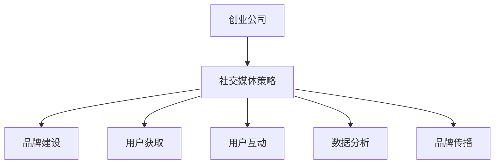

                 

# 创业公司的社交媒体影响力建设

## 关键词：社交媒体，影响力，创业公司，战略规划，营销技巧，数据分析

> 社交媒体已成为现代企业不可或缺的营销渠道，对于创业公司而言，如何在众多竞争者中脱颖而出，建立强大的社交媒体影响力，成为了一项至关重要的任务。本文将深入探讨创业公司如何通过有效的社交媒体战略，实现品牌的快速增长和用户忠诚度的提升。

## 摘要

随着社交媒体的普及和用户基数的持续扩大，创业公司利用社交媒体进行品牌推广和用户互动的重要性日益凸显。本文将围绕创业公司的社交媒体影响力建设，首先介绍社交媒体的基本概念，随后详细分析社交媒体在创业公司中的应用策略，包括内容创作、数据分析、互动策略等。最后，通过实际案例和工具推荐，为创业公司提供一套切实可行的社交媒体影响力建设方案。

## 1. 背景介绍

### 1.1 社交媒体的发展历程

社交媒体起源于20世纪90年代，随着互联网的普及，早期的BBS、聊天室和电子邮件成为人们交流和互动的平台。进入21世纪，Facebook、Twitter、Instagram等平台的崛起，标志着社交媒体进入了全新的发展阶段。这些平台不仅提供了丰富的内容形式，如文字、图片、视频等，还赋予了用户自主创作和分享内容的能力。

### 1.2 创业公司与社交媒体的关联

创业公司通常资金有限，资源有限，但需要快速建立品牌知名度，吸引用户和投资者。社交媒体作为一个低成本、高回报的营销渠道，成为了创业公司实现这一目标的重要工具。通过社交媒体，创业公司可以：

- 建立品牌形象，传递品牌价值观
- 扩大品牌影响力，提高品牌知名度
- 与用户建立直接联系，提升用户参与度
- 获取用户反馈，优化产品和服务
- 吸引潜在投资者，提升公司估值

### 1.3 社交媒体对创业公司的挑战

尽管社交媒体为创业公司带来了诸多机会，但也伴随着一系列挑战：

- 垂直竞争激烈，如何脱颖而出？
- 如何在有限资源下创造高质量内容？
- 数据隐私和安全问题如何应对？
- 如何衡量社交媒体投资的回报率？
- 社交媒体生态不断变化，如何持续适应？

## 2. 核心概念与联系

### 2.1 社交媒体的核心概念

社交媒体的核心概念包括用户生成内容（UGC）、社交网络分析（SNA）、社交媒体分析（SMA）等。

- **用户生成内容（UGC）**：用户在社交媒体平台上生成和分享的内容，如文字、图片、视频等。UGC是社交媒体的核心驱动力，能够增强用户的参与感和互动性。
- **社交网络分析（SNA）**：研究社交网络中的关系结构和信息传播规律，帮助企业了解用户社交行为，优化营销策略。
- **社交媒体分析（SMA）**：通过分析社交媒体数据，如用户行为、内容表现、互动情况等，为企业提供决策依据，指导营销活动。

### 2.2 社交媒体与创业公司的联系

创业公司可以通过以下方式利用社交媒体：

- **品牌建设**：通过社交媒体发布品牌故事、核心价值观等内容，建立品牌形象。
- **用户获取**：利用社交媒体广告、内容营销等方式，吸引潜在用户。
- **用户互动**：通过社交媒体与用户进行互动，收集用户反馈，优化产品和服务。
- **数据分析**：利用社交媒体分析工具，了解用户行为，优化营销策略。
- **品牌传播**：通过社交媒体传播品牌活动、新闻等，扩大品牌影响力。

### 2.3 Mermaid 流程图



## 3. 核心算法原理 & 具体操作步骤

### 3.1 社交媒体策略制定

- **目标设定**：明确创业公司通过社交媒体要实现的目标，如品牌知名度提升、用户增长等。
- **定位分析**：分析目标用户群体的特征，确定社交媒体平台的选择和内容风格。
- **内容规划**：制定内容发布计划，包括内容类型、发布频率、推广策略等。
- **数据分析**：利用社交媒体分析工具，跟踪内容表现，优化策略。

### 3.2 内容创作与发布

- **内容类型**：根据目标用户特征和社交媒体平台特点，选择合适的的内容类型，如图文、视频、直播等。
- **内容风格**：保持内容风格的一致性，增强用户认同感。
- **发布策略**：分析用户活跃时间，制定发布计划，提高内容曝光率。
- **互动引导**：通过评论、点赞、分享等互动形式，引导用户参与。

### 3.3 数据分析与优化

- **数据收集**：利用社交媒体分析工具，收集用户行为数据，如点赞数、评论数、分享数等。
- **数据解析**：通过数据可视化工具，对数据进行分析，识别趋势和问题。
- **策略优化**：根据数据分析结果，调整内容发布策略，提高用户参与度。

### 3.4 社交媒体广告投放

- **定位分析**：明确目标用户群体，选择合适的广告投放平台。
- **广告创意**：根据目标用户特征和广告平台特点，制作吸引人的广告创意。
- **投放策略**：制定广告投放计划，包括投放时间、投放地域、投放预算等。
- **效果评估**：通过广告数据分析，评估广告投放效果，调整投放策略。

## 4. 数学模型和公式 & 详细讲解 & 举例说明

### 4.1 社交媒体影响力计算模型

社交媒体影响力可以用以下公式计算：

\[ I = \frac{U \times R \times C}{T \times F} \]

- \( I \)：影响力得分
- \( U \)：用户数
- \( R \)：平均互动率
- \( C \)：内容质量评分
- \( T \)：内容发布频率
- \( F \)：内容传播范围

### 4.2 内容质量评分模型

内容质量评分可以用以下公式计算：

\[ Q = \frac{P \times S \times V}{E \times D} \]

- \( Q \)：内容质量评分
- \( P \)：内容原创度
- \( S \)：内容专业性
- \( V \)：内容价值
- \( E \)：内容错误率
- \( D \)：内容多样性

### 4.3 举例说明

假设一个创业公司有1000个用户，平均互动率为10%，内容质量评分为0.8，内容发布频率为每周3次，内容传播范围为500人。

根据影响力计算模型：

\[ I = \frac{1000 \times 0.1 \times 0.8}{3 \times 500} = 0.016 \]

根据内容质量评分模型：

\[ Q = \frac{P \times S \times V}{E \times D} \]

假设原创度为0.8，专业性为0.9，价值为0.8，错误率为0.1，多样性为0.7：

\[ Q = \frac{0.8 \times 0.9 \times 0.8}{0.1 \times 0.7} = 7.71 \]

## 5. 项目实战：代码实际案例和详细解释说明

### 5.1 开发环境搭建

为了更好地演示社交媒体影响力建设，我们使用Python编程语言，结合社交媒体分析工具，搭建一个简单的社交媒体影响力分析系统。

#### 5.1.1 Python环境安装

确保您的计算机上已安装Python环境。如果未安装，可以从Python官方网站（https://www.python.org/）下载并安装。

#### 5.1.2 社交媒体分析工具安装

我们使用Tweepy库来获取Twitter数据，使用pandas库进行数据分析。安装命令如下：

```shell
pip install tweepy pandas matplotlib
```

### 5.2 源代码详细实现和代码解读

#### 5.2.1 代码实现

```python
import tweepy
import pandas as pd
import matplotlib.pyplot as plt

# Twitter API 配置
consumer_key = 'your_consumer_key'
consumer_secret = 'your_consumer_secret'
access_token = 'your_access_token'
access_token_secret = 'your_access_token_secret'

# 初始化Tweepy认证
auth = tweepy.OAuthHandler(consumer_key, consumer_secret)
auth.set_access_token(access_token, access_token_secret)
api = tweepy.API(auth)

# 获取用户关注者数据
def get_followers(username, count=1000):
    followers = api.followers(username, count=count)
    return followers

# 计算影响力得分
def calculate_influence(followers):
    total_followers = len(followers)
    total_interactions = sum([follower.favourites_count for follower in followers])
    average_interactions = total_interactions / total_followers
    return average_interactions

# 获取并分析数据
def main():
    username = 'example_user'
    followers = get_followers(username)
    influence_score = calculate_influence(followers)
    print(f"Influence Score: {influence_score}")

    # 可视化影响力得分
    plt.bar([1], [influence_score], color='blue')
    plt.xlabel('Influence Score')
    plt.ylabel('Score Value')
    plt.title('Social Media Influence Score')
    plt.show()

if __name__ == '__main__':
    main()
```

#### 5.2.2 代码解读

- **Tweepy库使用**：Tweepy是Python中用于Twitter API的库，可以方便地获取Twitter数据。
- **API认证**：使用Twitter API的认证信息，初始化Tweepy认证对象。
- **获取关注者数据**：`get_followers`函数获取指定用户的关注者列表。
- **计算影响力得分**：`calculate_influence`函数计算关注者平均互动率，作为影响力得分。
- **数据可视化**：使用matplotlib库，将影响力得分可视化。

### 5.3 代码解读与分析

通过上述代码，我们可以实现以下功能：

- 获取指定用户的关注者数据。
- 计算关注者平均互动率，作为影响力得分。
- 可视化展示影响力得分。

在实际应用中，可以根据需要对代码进行扩展，如添加更多分析维度、支持更多社交媒体平台等。

## 6. 实际应用场景

### 6.1 品牌知名度提升

通过社交媒体，创业公司可以快速传播品牌信息，提高品牌知名度。例如，通过发布品牌故事、成功案例、用户评价等内容，吸引用户关注和传播。

### 6.2 用户获取

社交媒体广告和内容营销是创业公司获取用户的有效途径。通过精确的用户定位和有针对性的广告创意，创业公司可以吸引大量潜在用户。

### 6.3 用户互动

通过社交媒体，创业公司可以与用户进行实时互动，收集用户反馈，优化产品和服务。例如，通过举办线上活动、调查问卷、用户访谈等方式，与用户建立深度联系。

### 6.4 数据分析

社交媒体数据为企业提供了丰富的用户行为信息。通过数据分析，创业公司可以了解用户需求、优化营销策略、提升用户体验。

### 6.5 品牌传播

创业公司可以通过社交媒体传播品牌活动、新闻、优惠信息等，扩大品牌影响力。例如，通过举办线上发布会、直播活动、社交媒体挑战等方式，吸引更多用户关注和参与。

## 7. 工具和资源推荐

### 7.1 学习资源推荐

- **书籍**：《社交媒体营销实战》、《社交媒体数据分析》
- **论文**：检索相关学术期刊，获取最新研究成果
- **博客**：关注行业专家和顶级企业的博客，学习最佳实践
- **网站**：访问社交媒体平台官方网站，了解平台规则和功能

### 7.2 开发工具框架推荐

- **社交媒体分析工具**：Google Analytics、Tableau、Hootsuite等
- **Python库**：Tweepy、Facebook SDK、Instagram Graph API等
- **数据可视化工具**：Matplotlib、Seaborn、D3.js等
- **社交媒体广告平台**：Facebook Ads Manager、Google Ads、LinkedIn Ads等

### 7.3 相关论文著作推荐

- **论文**：《社交媒体营销中的用户互动策略研究》、《基于大数据的社交媒体影响力评估方法》
- **著作**：《社交媒体营销策略》、《社交媒体数据分析与应用》

## 8. 总结：未来发展趋势与挑战

### 8.1 发展趋势

- **技术进步**：人工智能、大数据分析等技术的进步，将进一步提升社交媒体分析的精确性和效率。
- **多平台整合**：创业公司将更多地整合多平台资源，实现全渠道营销。
- **用户个性化**：个性化推荐和精准营销将成为主流，满足用户个性化需求。
- **内容多样化**：短视频、直播、虚拟现实等新兴内容形式，将丰富社交媒体内容生态。

### 8.2 挑战

- **内容创作压力**：高质量内容创作难度加大，创业公司需投入更多资源。
- **数据隐私保护**：随着数据隐私法规的加强，如何保护用户数据将成为一大挑战。
- **广告效果评估**：如何准确评估广告投放效果，提高投资回报率，是创业公司需要解决的问题。
- **平台政策变化**：社交媒体平台政策的不确定性，可能影响创业公司的运营策略。

## 9. 附录：常见问题与解答

### 9.1 社交媒体影响力如何计算？

社交媒体影响力可以通过以下公式计算：

\[ I = \frac{U \times R \times C}{T \times F} \]

其中，\( I \)为影响力得分，\( U \)为用户数，\( R \)为平均互动率，\( C \)为内容质量评分，\( T \)为内容发布频率，\( F \)为内容传播范围。

### 9.2 如何选择社交媒体平台？

选择社交媒体平台时，应考虑以下因素：

- **目标用户**：了解目标用户的社交媒体使用习惯和偏好。
- **平台特点**：分析各个平台的优劣势，选择适合的内容形式和互动方式。
- **资源预算**：根据公司的资源预算，选择适合自己的社交媒体平台。

### 9.3 社交媒体数据分析的重要指标有哪些？

社交媒体数据分析的重要指标包括：

- **用户数**：关注用户数量，反映品牌影响力。
- **互动率**：用户对内容的互动情况，如点赞、评论、分享等。
- **内容质量**：内容的专业性、原创性、价值等。
- **传播范围**：内容传播的广度，如转发、引用等。
- **广告投放效果**：广告曝光量、点击率、转化率等。

## 10. 扩展阅读 & 参考资料

- **书籍**：《社交媒体营销实战》、《社交媒体数据分析》
- **论文**：《社交媒体营销中的用户互动策略研究》、《基于大数据的社交媒体影响力评估方法》
- **博客**：《社交媒体营销策略》、《社交媒体数据分析与应用》
- **网站**：社交媒体平台官方网站，如Facebook、Twitter、Instagram等
- **在线课程**：社交媒体营销、数据分析等相关在线课程

### 作者

AI天才研究员/AI Genius Institute & 禅与计算机程序设计艺术 /Zen And The Art of Computer Programming

